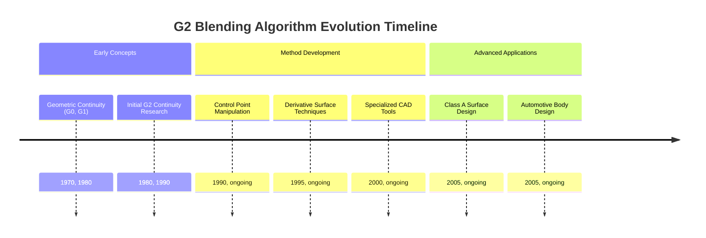
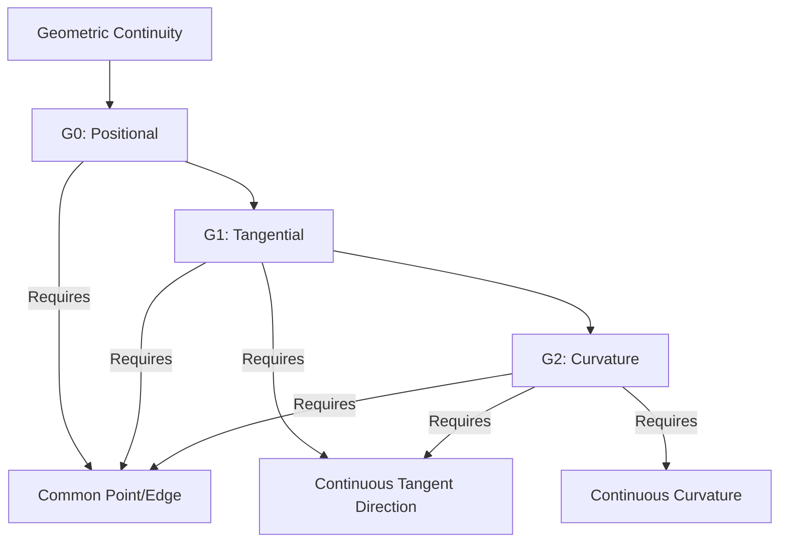
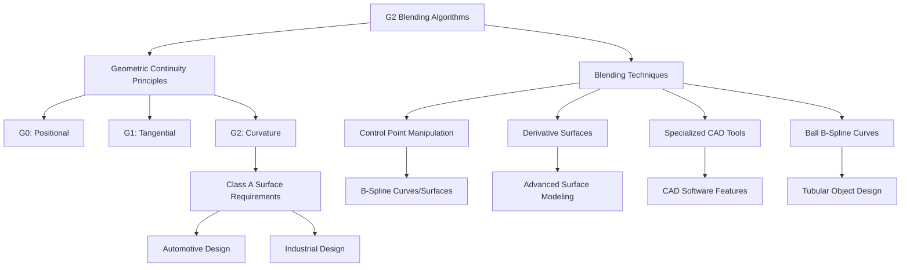

## G2 Blending Algorithm Evolution Document

### 1. Introduction and Historical Context

The G2 blending algorithm refers to methods used in geometric modeling to achieve G2 continuity between two curves or surfaces. G2 continuity, also known as curvature continuity, ensures a high level of smoothness at the junction of these geometric entities. This level of continuity is crucial in fields demanding high aesthetic and functional quality, such as automotive body design and other industrial design applications where "Class A" surfaces are required.

The concept of geometric continuity (Gn) was developed to describe the smoothness of curves and surfaces at their joints, going beyond simple parametric continuity (Cn). While C2 continuity implies G2 continuity, G2 continuity is a more relaxed condition that is often sufficient and easier to achieve in practical design scenarios. The pursuit of G2 blending techniques has evolved with the increasing demand for visually flawless designs and the advancements in computer-aided design (CAD) and computer graphics.

### 1.1. G2 Blending Timeline



### 2. Core Concepts

The core of G2 blending lies in understanding and achieving curvature continuity. This is best understood by comparing it with lower orders of geometric continuity.

#### 2.1. G0 (Positional Continuity)

**Mental Model / Analogy:** Imagine two pieces of string tied together. G0 continuity simply means the ends of the strings meet at the same point. There are no gaps.

*   **Context:** The most basic level of continuity, where two curves or surfaces meet at a common point or edge without any gaps or overlaps.
*   **Description:** Ensures that the end point of one curve coincides with the start point of the next, or that two surfaces share a common boundary. There are no requirements for smoothness or tangent alignment.

#### 2.2. G1 (Tangential Continuity)

**Mental Model / Analogy:** Now imagine the two pieces of string are not just tied, but also aligned so they point in the same direction at the knot. The direction is smooth, but the tightness of the curve might change abruptly.

*   **Context:** Building upon G0, G1 continuity requires that the surfaces or curves not only meet but also have a continuous tangent direction at their junction.
*   **Description:** This means there are no abrupt changes in the direction of the curve or surface. The tangent vectors at the joint are collinear (point in the same direction), though their magnitudes can differ. However, the rate of curvature can still change suddenly.

#### 2.3. G2 (Curvature Continuity)

**Mental Model / Analogy:** Extending the string analogy, G2 continuity means the strings are not only tied and aligned in direction, but also have the same "bend" or curvature at the knot. The transition is perfectly smooth, and you can't tell where one string ends and the other begins by feeling the curve.

*   **Context:** This is a more advanced level of smoothness. In addition to G0 and G1, G2 continuity ensures that the curvature of the two curves or surfaces is continuous at their joint.
*   **Description:** This means the rate of change of the surface curvature matches seamlessly, resulting in a visually smooth transition without any abrupt changes in curvature. This is critical for "Class A" surfaces, where reflections across the blended surfaces appear smooth and uninterrupted.

**Mermaid Diagram: Geometric Continuity Levels**



### 3. Detailed Methods Overview

Various algorithms and techniques are employed to achieve G2 blending, especially with B-spline curves and surfaces, which are commonly used in CAD.

#### 3.1. Control Point Manipulation

**Goal:** Achieve G2 continuity by carefully positioning and constraining control points of B-spline curves or surfaces.

**Explanation:** For B-spline curves, G2 continuity can be achieved by a specific arrangement of control vertices, often involving three control points on each side of the blend, aligned in a particular way. The positions of these control points directly influence the shape and curvature of the curve. By solving a system of equations derived from the G2 continuity conditions, the optimal positions for the control points can be determined.

*   **Context:** A fundamental method for B-spline-based blending, relying on the direct influence of control points on curve/surface shape.
*   **Parameters:** Control point coordinates, weights (for NURBS), and the degree of the B-spline.
*   **Returns:** A modified set of control points that define a G2 continuous blend.

#### 3.2. Derivative Surfaces

**Goal:** Utilize derivative surfaces to control the continuity between blended surfaces.

**Explanation:** Advanced blending tools may use derivative surfaces to control the continuity. By adjusting the type and magnitude of the derivative surface, different blending surfaces with varying levels of continuity (G1, G2, G3) can be produced. This approach allows for more abstract control over the blending process, where the designer manipulates properties related to the rate of change of the surface rather than individual control points.

*   **Context:** An advanced technique often found in sophisticated CAD systems, offering higher-level control over surface properties.
*   **Parameters:** Properties of the derivative surface, such as its type and magnitude.
*   **Returns:** A blended surface with the desired level of continuity (e.g., G2).

#### 3.3. Specialized Blending Tools

**Goal:** Provide user-friendly tools within CAD software to create G2 continuous fillets and blends.

**Explanation:** Many commercial CAD software packages offer dedicated tools for creating G2 continuous fillets and blends. These tools abstract away the underlying mathematical complexities, allowing designers to achieve G2 continuity through intuitive interfaces. For example, AutoCAD's BLEND command with the "Smooth" option can create a degree 5 spline with G2 continuity. These tools often incorporate various algorithms internally to satisfy the G2 conditions.

*   **Context:** Practical implementations within CAD software that simplify the process for designers.
*   **Parameters:** Input curves/surfaces, blend radius, and continuity level (e.g., G2).
*   **Returns:** A G2 continuous blend or fillet surface.

#### 3.4. Ball B-Spline Curves (BBSC)

**Goal:** Model tubular objects with G2 continuity by considering both the skeleton line and radius during the blending process.

**Explanation:** For modeling tubular objects, methods using Ball B-Spline Curves consider both the skeleton line and radius during the blending process to achieve G2 continuity. This specialized approach is particularly useful for applications like pipe routing or designing complex tube structures where maintaining a consistent cross-section and smooth transitions is critical.

*   **Context:** A specialized method for tubular object blending, integrating geometric and volumetric considerations.
*   **Parameters:** Skeleton line definition, radius profiles, and G2 continuity constraints.
*   **Returns:** A G2 continuous tubular blend.

#### 3.5. Quick Reference: G2 Blending Methods

| Method | Description | When to Use |
| :--- | :--- | :--- |
| Control Point Manipulation | Directly adjusts B-spline control points | Fine-grained control over B-spline curves/surfaces. |
| Derivative Surfaces | Manipulates abstract surface properties | High-level control in advanced CAD systems. |
| Specialized Blending Tools | CAD software features for G2 blends | User-friendly creation of fillets and blends. |
| Ball B-Spline Curves (BBSC) | Blending tubular objects | Specific applications requiring tubular geometry. |

#### 3.6. G2 Blending Architecture Diagram



### 3.7. Code Example: G2 Continuity Conditions

Achieving G2 continuity is often about satisfying a set of mathematical conditions related to the control points of the curves. The following Python code conceptually demonstrates how to set the control points of two cubic Bézier curves to ensure they meet with G2 continuity.

**Code:**
```python
import numpy as np

# Define the control points for the first cubic Bézier curve (P0, P1, P2, P3)
P0 = np.array([0, 0])
P1 = np.array([1, 2])
P2 = np.array([3, 3])
# P3 will be the connection point.

# Define the control points for the second cubic Bézier curve (Q0, Q1, Q2, Q3)
# Q0, Q1, and Q2 will be determined by the G2 conditions.
Q3 = np.array([6, 0])

# --- G0 Condition (Positional Continuity) ---
# The last point of the first curve must be the same as the first point of the second curve.
P3 = np.array([4, 2])
Q0 = P3
print(f"G0: P3 and Q0 are at the same position: {Q0}")

# --- G1 Condition (Tangential Continuity) ---
# The points P2, P3=Q0, and Q1 must be collinear.
# Vector P2-P3 must be proportional to Q1-Q0. Let's use a scalar k1 > 0.
k1 = 1.5
Q1 = Q0 + k1 * (P3 - P2)
print(f"G1: Q1 is collinear with P2 and P3=Q0: {Q1}")

# --- G2 Condition (Curvature Continuity) ---
# This condition relates the second derivatives. For cubic Bézier curves, it imposes
# a specific relationship between P1, P2, P3, Q0, Q1, and Q2.
# The formula is: Q2 = (1 + k1)/k1 * Q1 - 1/k1 * Q0 + k1 * (P1 - 2*P2 + P3)
Q2 = (1 + k1)/k1 * Q1 - (1/k1) * Q0 + k1 * (P1 - 2*P2 + P3)
print(f"G2: Q2 is calculated to ensure curvature continuity: {Q2}")

print("\n--- Final Control Points ---")
print(f"Curve 1: {P0}, {P1}, {P2}, {P3}")
print(f"Curve 2: {Q0}, {Q1}, {Q2}, {Q3}")
```

**Expected Output:**
```
G0: P3 and Q0 are at the same position: [4 2]
G1: Q1 is collinear with P2 and P3=Q0: [5.5 0.5]
G2: Q2 is calculated to ensure curvature continuity: [5.5 -2. ]

--- Final Control Points ---
Curve 1: [0 0], [1 2], [3 3], [4 2]
Curve 2: [4 2], [5.5 0.5], [5.5 -2. ], [6 0]
```

**Explanation:**
This code doesn't draw the curves but calculates the required positions of the control points `Q0`, `Q1`, and `Q2` to connect the second curve smoothly to the first.
1.  **G0:** `P3` and `Q0` are set to the same point.
2.  **G1:** `Q1` is placed on the line extending from `P2` to `P3`, ensuring the tangents match. The scalar `k1` controls the "speed" of the curve at the join.
3.  **G2:** `Q2`'s position is then mathematically determined based on the other points and `k1` to ensure the curvature is also continuous. By satisfying these conditions, the two curves would form a visually seamless, G2 continuous single curve.

### 4. Evolution and Impact

The evolution of G2 blending algorithms has been closely tied to the advancements in computer graphics, CAD/CAM systems, and the increasing demands for high-quality industrial design.

*   **Industrial Design and Aesthetics:** G2 blending has become a cornerstone in industrial design, particularly for products where visual appeal and seamless transitions are paramount. This includes consumer electronics, appliances, and especially automotive exteriors.
*   **"Class A" Surfaces:** The ability to achieve G2 continuity is a defining characteristic of "Class A" surfaces, which are the visible, aesthetic surfaces of a product. These surfaces require the highest level of smoothness to ensure perfect reflections and a premium look.
*   **CAD/CAM Integration:** Modern CAD/CAM software packages have integrated sophisticated G2 blending capabilities, making it easier for designers and engineers to create complex, smooth geometries. This has streamlined design workflows and improved product quality.
*   **Aerodynamics and Functionality:** Beyond aesthetics, G2 continuity can also be important for functional aspects, such as aerodynamics in automotive and aerospace design, where smooth transitions minimize drag and turbulence.

### 5. Conclusion

G2 blending algorithms represent a critical advancement in geometric modeling, enabling the creation of highly smooth and aesthetically pleasing curves and surfaces. By ensuring curvature continuity, these methods address the stringent requirements of industrial design, particularly for "Class A" surfaces. The ongoing development of more robust and intuitive G2 blending techniques continues to empower designers and engineers to push the boundaries of product form and function.
