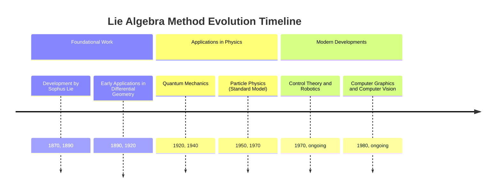
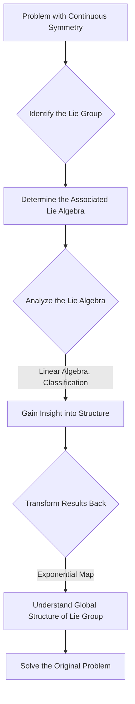

## Lie Algebra Method Evolution Document

### 1. Introduction and Historical Context

The Lie algebra method is a mathematical approach that uses Lie algebras to study continuous symmetries and their implications in various fields, particularly in physics and mathematics. It is based on the intimate relationship between Lie algebras and Lie groups. The theory was developed in the 19th century by Norwegian mathematician Sophus Lie to study differential equations and construct a theory of continuous groups.

The method transforms complex, nonlinear problems related to Lie groups into simpler, linear problems within the framework of Lie algebras. This has proven to be an exceptionally powerful tool for understanding the structure and classification of Lie groups and for analyzing symmetries in physical systems.

### 1.1. Lie Algebra Method Timeline



### 2. Core Concepts

At the heart of the Lie algebra method is the correspondence between Lie groups and Lie algebras.

#### 2.1. Lie Groups

**Mental Model / Analogy:** Think of a Lie group as the set of all possible continuous transformations you can apply to an object, such as all possible rotations of a sphere. Each rotation is an element of the group, and you can combine rotations (the group operation) to get a new rotation.

*   **Context:** A Lie group is a group that is also a smooth manifold. This means its elements vary continuously, and the group operations (multiplication and inversion) are smooth.
*   **Description:** Lie groups describe continuous symmetries. Examples include the group of rotations in 3D space (SO(3)) or the group of spacetime transformations in special relativity (the Poincaré group).

#### 2.2. Lie Algebras

**Mental Model / Analogy:** If a Lie group is all possible rotations of a sphere, then the corresponding Lie algebra is the set of all possible "infinitesimal rotations" or axes of rotation. Each element of the Lie algebra describes a tiny rotation about a specific axis.

*   **Context:** Every Lie group gives rise to a Lie algebra, which is the tangent space at the identity element of the group.
*   **Description:** A Lie algebra is a vector space equipped with a binary operation called the Lie bracket. The elements of the Lie algebra can be thought of as the "infinitesimal generators" of the Lie group.

#### 2.3. Lie Bracket (Commutator)

**Mental Model / Analogy:** The Lie bracket measures how two infinitesimal transformations interfere with each other. If you perform a tiny rotation about the x-axis and then a tiny rotation about the y-axis, the result is different from doing it in the reverse order. The Lie bracket quantifies this difference.

*   **Context:** The Lie bracket is an operation in a Lie algebra that measures the non-commutativity of the corresponding Lie group.
*   **Description:** For two elements X and Y of the Lie algebra, the Lie bracket [X, Y] is also an element of the Lie algebra. If [X, Y] = 0, then the corresponding transformations commute.

**Mermaid Diagram: Lie Group-Lie Algebra Relationship**

```mermaid
graph TD
    A[Lie Group (e.g., Rotations)] -- "Differentiation at Identity" --> B[Lie Algebra (e.g., Rotation Axes)]
    B -- "Exponential Map" --> A

    B -- "Lie Bracket [X, Y]" --> C{Measure of Non-Commutativity}
```

### 3. Detailed Method Overview

The Lie algebra method leverages the correspondence between Lie groups and Lie algebras to simplify complex problems.

#### 3.1. Linearization

**Goal:** Transform a nonlinear problem into a linear one.

**Explanation:** Instead of working directly with the complex, nonlinear operations of Lie groups, the method transforms the problem into the linear space of the Lie algebra. Calculations involving vectors and matrices in the Lie algebra are often much simpler than working with the global transformations of the Lie group.

*   **Context:** The fundamental step of the method that reduces complexity.
*   **Parameters:** A Lie group and its associated Lie algebra.
*   **Returns:** A linearized problem that can be analyzed using the tools of linear algebra.

#### 3.2. Classification of Lie Algebras

**Goal:** Classify and understand the structure of Lie groups by classifying their Lie algebras.

**Explanation:** The classification of Lie algebras is a completely solved problem in mathematics. By studying the structure of a Lie algebra (e.g., whether it is simple, semi-simple, or solvable), one can draw profound conclusions about the properties of the corresponding Lie group.

*   **Context:** A central result of Lie theory that allows for a systematic study of symmetry groups.
*   **Parameters:** The structure constants of the Lie algebra.
*   **Returns:** A classification of the Lie algebra, and with it, a deep understanding of the associated Lie group.

#### 3.3. Application to Differential Equations

**Goal:** Find symmetries of differential equations to simplify or solve them.

**Explanation:** Sophus Lie originally developed the method for this purpose. If a differential equation has a continuous symmetry (i.e., it is invariant under a Lie group of transformations), the Lie algebra method can be used to find that symmetry. Knowledge of the symmetry can then be used to reduce the order of the equation or even find an analytical solution.

*   **Context:** The original and one of the most important applications of Lie theory.
*   **Parameters:** A differential equation.
*   **Returns:** A set of symmetry generators (a Lie algebra) that can be used to simplify or solve the equation.

#### 3.4. Quick Reference: Lie Algebra Methods

| Method | Description | When to Use |
| :--- | :--- | :--- |
| Linearization | Transform group problems into algebra problems | To simplify complex, nonlinear problems. |
| Classification | Study the structure of Lie algebras | To understand the properties of symmetry groups. |
| Application to DEs | Find symmetries in differential equations | For simplifying and solving differential equations. |

#### 3.5. Lie Algebra Method Workflow Diagram



### 3.6. Code Example: Lie Group-Algebra Relation for SO(3)

This example uses Python with `numpy` and `scipy` to show the relationship between the SO(3) Lie group (3D rotations) and its Lie algebra so(3) (skew-symmetric 3x3 matrices).

**Code:**
```python
import numpy as np
from scipy.linalg import expm

# An element of the so(3) Lie algebra (a skew-symmetric matrix)
# This represents an infinitesimal rotation about the z-axis.
X = np.array([[0, -1, 0],
              [1,  0, 0],
              [0,  0, 0]])

# The parameter 'theta' determines the amount of rotation.
theta = np.pi / 2  # 90 degrees

# Use the exponential map to get the corresponding Lie group element (a rotation matrix)
# R = exp(theta * X)
R = expm(theta * X)

print("Lie algebra element (X):")
print(X)
print("\nRotation angle (theta):", theta)
print("\nLie group element (R = expm(theta * X)):")
print(np.round(R, decimals=5))

# The Lie bracket [X, Y] = XY - YX shows non-commutativity.
# Let's define another element for rotation about the x-axis.
Y = np.array([[0, 0, 0],
              [0, 0, -1],
              [0, 1, 0]])

lie_bracket_XY = (X @ Y) - (Y @ X)
print("\nLie bracket of X (z-axis rot) and Y (x-axis rot):")
print(lie_bracket_XY)
print("# This result is a generator for rotation about the y-axis.")
```

**Expected Output:**
```
Lie algebra element (X):
[[ 0 -1  0]
 [ 1  0  0]
 [ 0  0  0]]

Rotation angle (theta): 1.5707963267948966

Lie group element (R = expm(theta * X)):
[[ 0. -1.  0.]
 [ 1.  0.  0.]
 [ 0.  0.  1.]]

Lie bracket of X (z-axis rot) and Y (x-axis rot):
[[ 0  0  1]
 [ 0  0  0]
 [-1  0  0]]
# This result is a generator for rotation about the y-axis.
```

**Explanation:**
The skew-symmetric matrix `X` is an element of the Lie algebra so(3) and represents an infinitesimal rotation generator. The `scipy.linalg.expm()` function computes the matrix exponential, which maps the algebra element to an element of the Lie group SO(3) — in this case, a 90-degree rotation matrix around the z-axis. The Lie bracket `[X, Y]` is non-zero, demonstrating that rotations around different axes do not commute. The result of the bracket is itself another generator of rotation.

### 4. Evolution and Impact

The Lie algebra method has revolutionized modern physics and mathematics.

*   **Physics:** Lie groups and Lie algebras are the mathematical language of symmetries in physics. They are fundamental to quantum mechanics, general relativity, and especially the Standard Model of particle physics, which describes the fundamental forces and particles.
*   **Differential Equations:** The method remains a vital tool for the analysis and solution of differential equations in many areas of science and engineering.
*   **Robotics and Control Theory:** In robotics, Lie groups and algebras are used to describe the configuration and motion of robots (e.g., the position and orientation of a robotic arm).
*   **Computer Graphics:** In computer graphics, they are used to represent 3D rotations and transformations in a way that is numerically stable and avoids problems like "gimbal lock."

### 5. Conclusion

The Lie algebra method is a profound and versatile tool that allows us to view the complex world of continuous symmetries through the lens of linear algebra. From its origins in the theory of differential equations to its central role in modern physics, the method has fundamentally shaped our understanding of the fundamental laws of the universe and our ability to model and control complex systems.
