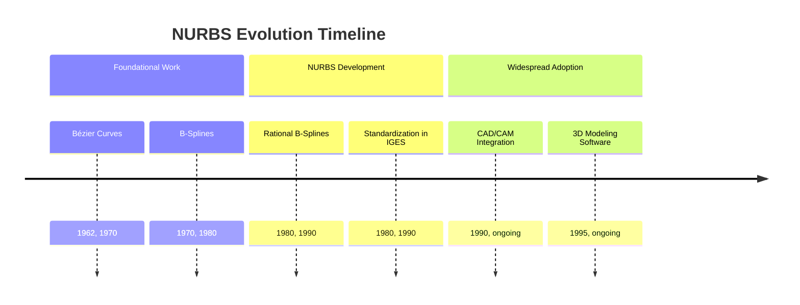
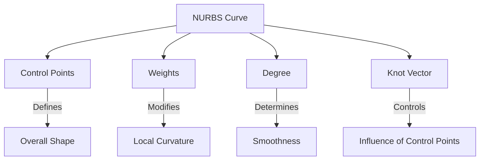
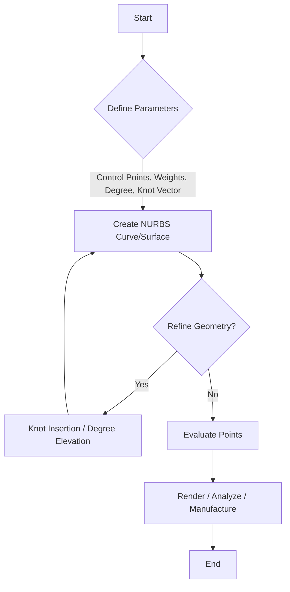

## NURBS Evolution Document

### 1. Introduction and Historical Context

NURBS (Non-Uniform Rational B-Splines) is a mathematical model used in computer graphics for representing and designing curves and surfaces. It offers significant flexibility and precision, making it suitable for both analytical shapes (like circles and cones) and complex, free-form organic shapes. NURBS have become an industry standard for the representation and exchange of geometric information in CAD, CAM, and CAE systems.

The development of NURBS was a gradual process, building upon the foundations of B-splines and Bézier curves. The key innovation of NURBS was the introduction of "rational" splines, which allowed for the precise representation of conic sections like circles and ellipses. This capability was a significant step forward from non-rational B-splines. The standardization of NURBS in the IGES (Initial Graphics Exchange Specification) in the 1980s solidified its role as a cornerstone of modern geometric modeling.

### 1.1. NURBS Evolution Timeline



### 2. Core Architecture

The power of NURBS lies in its components, which provide a high degree of control over the shape of curves and surfaces.

#### 2.1. Control Points

**Mental Model / Analogy:** Think of control points as a "skeleton" that defines the overall shape of the curve. The curve is "attracted" to these points, but does not necessarily pass through them. Moving a control point pulls the curve in that direction.

*   **Context:** The shape of a NURBS curve or surface is determined by a set of weighted control points.
*   **Description:** These points form a control polygon or polyhedron that guides the shape of the curve or surface. Moving these points intuitively and predictably alters the geometry.

#### 2.2. Weights

**Mental Model / Analogy:** Each control point has a "gravitational pull" on the curve, and the weight determines the strength of this pull. A higher weight pulls the curve closer to that control point.

*   **Context:** Each control point has an associated weight.
*   **Description:** When all weights are equal (typically 1), the curve is considered non-rational, reducing to a B-spline. Rational NURBS, with varying weights, enable the accurate representation of shapes like circles and ellipses, which are not possible with non-rational B-splines.

#### 2.3. Degree

**Mental Model / Analogy:** The degree is like the "stiffness" or "smoothness" of the curve. A higher degree results in a smoother, more continuous curve, but also one that is less locally controlled.

*   **Context:** The degree is a positive whole number (commonly 1, 2, 3, or 5) that defines the number of nearby control points influencing any given point on the curve.
*   **Description:**
    *   Degree 1: Linear curves (straight lines).
    *   Degree 2: Quadratic curves.
    *   Degree 3: Cubic curves (the most common for free-form modeling).

#### 2.4. Knot Vector

**Mental Model / Analogy:** The knot vector is like a "ruler" along the curve that determines where the influence of each control point begins and ends. "Non-uniform" means the markings on this ruler don't have to be evenly spaced, allowing for more control over specific parts of the curve.

*   **Context:** This is a sequence of non-decreasing numbers that defines the parametric intervals of the curve.
*   **Description:** "Non-uniform" in NURBS indicates that these intervals need not be equally spaced, allowing for greater control over the curve's local shape. This is a key feature that distinguishes NURBS from uniform B-splines.

**Mermaid Diagram: NURBS Curve Components**



### 3. Detailed Operations Overview

While NURBS is a mathematical model rather than a library with a specific API, the operations performed on NURBS curves and surfaces are standardized across various software implementations.

#### 3.1. Curve and Surface Creation

**Goal:** Generate NURBS curves and surfaces from a set of input parameters.

**Explanation:** This is the fundamental operation, where a curve or surface is created based on a given set of control points, weights, degree, and a knot vector. CAD software provides various tools to create NURBS geometry, from simple primitives like circles and spheres to complex free-form shapes.

*   **Context:** The initial generation of NURBS geometry.
*   **Parameters:** Control points, weights, degree, knot vector.
*   **Returns:** A NURBS curve or surface.

#### 3.2. Knot Insertion

**Goal:** Add new knots to the knot vector without changing the shape of the curve.

**Explanation:** Knot insertion is a crucial algorithm for refining NURBS curves and surfaces. It allows for the addition of more control points, providing greater local control over the shape. This is often used to prepare curves for operations like splitting or merging.

*   **Context:** A refinement operation that increases the number of control points for more detailed editing.
*   **Parameters:** The NURBS curve/surface and the location for the new knot.
*   **Returns:** A new NURBS curve/surface with the inserted knot and additional control points.

#### 3.3. Degree Elevation

**Goal:** Increase the degree of a NURBS curve or surface without changing its shape.

**Explanation:** Degree elevation is used to increase the smoothness of a curve or to make it compatible with other curves of a higher degree. For example, a linear curve (degree 1) can be elevated to a quadratic curve (degree 2) to allow for smoother transitions.

*   **Context:** An operation to increase the smoothness and continuity of a NURBS object.
*   **Parameters:** The NURBS curve/surface.
*   **Returns:** A new NURBS curve/surface with an elevated degree.

#### 3.4. Evaluation

**Goal:** Compute the coordinates of a point on a NURBS curve or surface for a given parameter value.

**Explanation:** This is the process of finding the 3D coordinates of a point on the curve or surface at a specific parametric value (often denoted as `u` for curves, and `u, v` for surfaces). This is essential for rendering, analysis, and manufacturing processes.

*   **Context:** The process of calculating the physical location of a point on the NURBS geometry.
*   **Parameters:** The NURBS curve/surface and a parametric value.
*   **Returns:** The 3D coordinates of the point.

#### 3.5. Quick Reference: NURBS Operations

| Operation | Description | When to Use |
| :--- | :--- | :--- |
| Creation | Generate NURBS geometry | Initial design and modeling. |
| Knot Insertion | Add knots to the knot vector | Refining and adding detail to a curve/surface. |
| Degree Elevation | Increase the degree | Increasing smoothness or for compatibility. |
| Evaluation | Compute point coordinates | Rendering, analysis, and manufacturing. |

#### 3.6. NURBS Modeling Workflow Diagram



### 3.7. Code Example: Creating a NURBS Curve

The following example uses the `geomdl` Python library to create a simple 2D NURBS curve. This demonstrates how the core components (control points, degree, knot vector, and weights) come together in practice.

**Code:**
```python
from geomdl import NURBS

# Create a NURBS curve instance
crv = NURBS.Curve()

# Set curve degree
crv.degree = 3

# Set control points (a list of lists)
crv.ctrlpts = [[10, 5, 0], [10, 10, 0], [5, 10, 0], [5, 5, 0]]

# Set weights (one for each control point)
crv.weights = [1, 2, 1, 2]

# The knot vector is automatically generated by geomdl if not provided.
# For a degree 3 curve with 4 control points, the default knot vector is [0, 0, 0, 0, 1, 1, 1, 1].
crv.knotvector = [0, 0, 0, 0, 1, 1, 1, 1]

# Evaluate the curve at a specific parameter (u-value)
point_on_curve = crv.evaluate_single(0.5)

print(f"Control Points: {crv.ctrlpts}")
print(f"Degree: {crv.degree}")
print(f"Knot Vector: {crv.knotvector}")
print(f"Weights: {crv.weights}")
print(f"Point evaluated at u=0.5: {point_on_curve}")

```

**Expected Output:**
```
Control Points: [[10, 5, 0], [10, 10, 0], [5, 10, 0], [5, 5, 0]]
Degree: 3
Knot Vector: [0, 0, 0, 0, 1, 1, 1, 1]
Weights: [1, 2, 1, 2]
Point evaluated at u=0.5: [7.5, 8.75, 0.0]
```

**Explanation:**
This code defines a degree 3 NURBS curve with four control points. The `weights` list is crucial; by setting some weights to 2, we are making the curve "rational" and pulling it closer to the second and fourth control points. The `evaluate_single(0.5)` function then calculates the coordinates of the point that is halfway along the parametric space of the curve.

### 4. Evolution and Impact

The adoption of NURBS has had a profound impact on the fields of computer graphics, industrial design, and manufacturing.

*   **Industry Standard:** NURBS is the de facto standard for representing and exchanging complex 3D geometries in CAD/CAM/CAE systems. This has enabled seamless interoperability between different software packages.
*   **Design Flexibility:** NURBS provides designers with a powerful and intuitive tool for creating both precise geometric shapes and complex, organic forms. This has revolutionized product design in industries like automotive, aerospace, and consumer goods.
*   **Manufacturing Accuracy:** The mathematical precision of NURBS ensures that digital models can be accurately translated into physical products through computer-aided manufacturing (CAM) processes like CNC machining and 3D printing.
*   **Computer Graphics and Animation:** While polygonal modeling is often preferred for real-time applications like video games, NURBS is widely used in high-end animation and visual effects for creating smooth, detailed characters and environments.

### 5. Conclusion

NURBS has been a transformative technology in the world of 3D modeling and design. Its ability to represent a wide range of shapes with mathematical precision and intuitive control has made it an indispensable tool for designers, engineers, and artists. The principles of NURBS continue to be relevant, and its influence is evident in the sophisticated geometries that define modern products and digital content.
