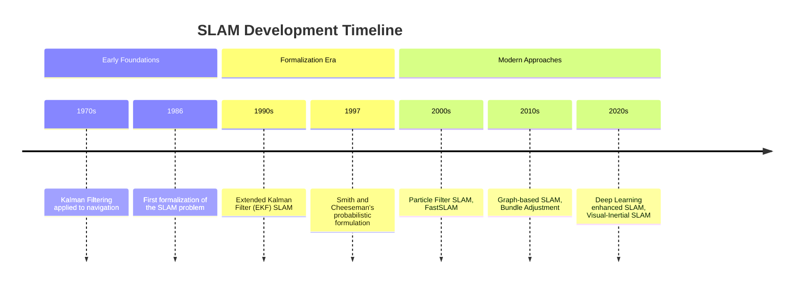
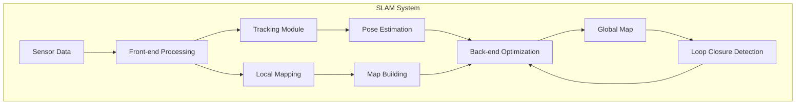
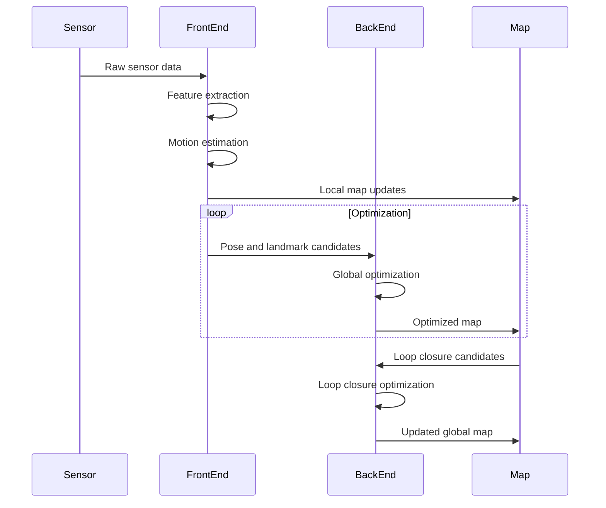

# Simultaneous Localization and Mapping (SLAM) Evolution Document

> **A comprehensive knowledge base documenting the evolution, architecture, and implementations of SLAM (Simultaneous Localization and Mapping) systems in computer vision and robotics.**

## Overview

This document provides a deep insight into the history, architecture, and implementation approaches of SLAM (Simultaneous Localization and Mapping) systems. SLAM is a fundamental problem in robotics and computer vision where a device equipped with sensors creates a map of an unknown environment while simultaneously keeping track of its location within that environment.

### Document Purpose

- **Historical Context**: Trace the evolution and major milestones of SLAM algorithms
- **Architectural Understanding**: Explain core concepts and design principles of SLAM systems
- **Implementation Reference**: Comprehensive documentation of common approaches and techniques
- **Cross-Domain Insights**: Understand relationships between SLAM, computer vision, and robotics
- **Educational Resource**: Support learning and teaching of SLAM concepts

## Introduction & Historical Context

### Origins and Motivation

SLAM emerged in the late 1980s and early 1990s as a critical challenge in robotics. The fundamental problem is that to navigate in an unknown environment, a robot needs a map, but to build a map, the robot needs to know its location. This chicken-and-egg problem was formalized and became known as the SLAM problem.

The term "SLAM" was first formally introduced in the literature in the early 2000s, though the underlying concepts had been explored since the 1970s in the context of navigation problems.

### Key Milestones Timeline

### Evolution Stages

1. **Classical SLAM (1990s-2000s)**: Based primarily on Extended Kalman Filters (EKF) and particle filters
2. **Feature-Based SLAM (2000s-2010s)**: Emphasis on robust feature detection and matching
3. **Direct SLAM (2010s-present)**: Dense reconstruction and direct alignment methods
4. **Learning-Based SLAM (2010s-present)**: Integration of machine learning techniques

## Core Architecture

### Fundamental Concepts and Abstractions

#### State Estimation Framework

SLAM is fundamentally a state estimation problem where the goal is to estimate the robot's trajectory and the map of the environment simultaneously. Mathematically, this can be expressed as:

$$P(x_{1:t}, m | z_{1:t}, u_{1:t})$$

Where:
- $x_{1:t}$ represents the robot poses over time
- $m$ represents the map
- $z_{1:t}$ represents sensor measurements
- $u_{1:t}$ represents control inputs

#### Key Components

1. **Sensor Fusion Module**: Integrates data from multiple sensors (cameras, LiDAR, IMU, etc.)
2. **Feature Extraction**: Detects and describes landmarks in the environment
3. **Motion Model**: Predicts robot pose based on control inputs
4. **Observation Model**: Relates robot pose to landmark observations
5. **Map Representation**: Maintains the estimated map of the environment
6. **Optimization Engine**: Solves the SLAM estimation problem

### Design Principles and Patterns

#### Loop Closure Detection

One of the critical challenges in SLAM is loop closure detection - recognizing when the robot returns to a previously visited location. This prevents drift accumulation and maintains global consistency.

#### Front-end and Back-end Architecture

Modern SLAM systems often follow a front-end/back-end architecture:

- **Front-end**: Real-time processing of sensor data, tracking, and local mapping
- **Back-end**: Global optimization, loop closure, and map refinement

## Detailed API Overview

While SLAM systems don't typically expose traditional APIs like software libraries, they do have standardized interfaces and modules:

### Core Modules

#### Visual Odometry (VO)

Visual odometry estimates the camera's motion between consecutive frames. Common approaches include:

- Feature-based VO (e.g., ORB-SLAM)
- Direct VO (e.g., LSD-SLAM, DSO)
- Semi-direct VO (e.g., SVO)

#### Mapping Module

The mapping module maintains the representation of the environment:

- Point cloud maps
- Mesh-based representations
- Semantic maps
- Topological maps

#### Optimization Module

Handles the optimization of the pose-graph or bundle adjustment:

- Graph optimization (e.g., g2o, Ceres Solver)
- Bundle adjustment
- Pose graph optimization

### Notable SLAM Systems

#### Classical Approaches

- **EKF-SLAM**: Early approach using Extended Kalman Filters
- **FastSLAM**: Particle filter-based approach using Rao-Blackwellized particles
- **Rao-Blackwellized Particle Filters**: Hybrid approach combining particle filters with Kalman filters

#### Modern Feature-Based SLAM

- **MonoSLAM**: Real-time single camera SLAM
- **PTAM**: Parallel Tracking and Mapping
- **ORB-SLAM**: Versatile feature-based SLAM system with loop closure and relocalization
- **LSD-SLAM**: Large-Scale Direct Monocular SLAM

#### Direct SLAM

- **DTAM**: Dense Tracking and Mapping
- **LSD-SLAM**: Large-Scale Direct Monocular SLAM
- **DSO**: Direct Sparse Odometry
- **SVO**: Semi-Direct Visual Odometry

#### Visual-Inertial SLAM

- **OKVIS**: Open Keyframe-based Visual-Inertial SLAM
- **VINS-Mono**: Robust Visual-Inertial State Estimator
- **ROVIO**: Robust Visual Inertial Odometry

### Interactive Mermaid Diagrams

#### SLAM System Architecture

#### SLAM Pipeline Flow

## Evolution & Performance

### Performance Improvements Over Time

#### Computational Efficiency

- **Early SLAM (1990s)**: Limited to sparse features and simple environments
- **2000s**: Real-time performance achieved for indoor environments
- **2010s**: Large-scale outdoor mapping became feasible
- **2020s**: Real-time dense reconstruction and semantic understanding

#### Accuracy Improvements

- **Drift Reduction**: Advanced loop closure detection reduced trajectory drift
- **Robustness**: Better handling of challenging conditions (lighting, textureless areas)
- **Multi-sensor Fusion**: Integration of IMU, GPS, and other sensors improved accuracy

### Ecosystem Relationships

SLAM systems often integrate with:

- **Robot Operating System (ROS)**: Standardized interfaces for robotics applications
- **Computer Vision Libraries**: OpenCV, PCL (Point Cloud Library)
- **Optimization Libraries**: Ceres Solver, g2o, GTSAM
- **Deep Learning Frameworks**: Integration of neural networks for semantic understanding

### Build System and Development Maturity

Modern SLAM systems typically use:

- **CMake**: For cross-platform build systems
- **ROS/Ros2**: For robotics integration
- **Package Managers**: vcpkg, conan, or system package managers
- **Continuous Integration**: Automated testing on multiple platforms

## Conclusion & Future Trajectory

### Current Significance in the Ecosystem

SLAM remains a cornerstone technology in robotics, autonomous vehicles, augmented reality, and computer vision. Its applications span from consumer AR applications to autonomous driving and planetary exploration.

### Ongoing Development Trends

1. **Semantic SLAM**: Integration of semantic understanding for richer map representations
2. **Learning-based SLAM**: Neural networks for feature extraction, correspondence, and optimization
3. **Event-based SLAM**: Using event cameras for high-speed, low-latency SLAM
4. **Collaborative SLAM**: Multiple robots sharing mapping information
5. **Long-term Operation**: SLAM systems that adapt to environmental changes over time

### Future Roadmap Considerations

- **Real-time Neural Rendering**: Combining SLAM with neural radiance fields (NeRF)
- **Edge Computing**: Efficient SLAM implementations for resource-constrained devices
- **Trustworthy SLAM**: Systems with uncertainty quantification and failure detection
- **Generalizable SLAM**: Systems that adapt to diverse environments without reconfiguration

---

**Continue exploring**: Learn about related topics in [Computer Graphics](../README.md) or explore [Visual-Inertial SLAM](./visual_inertial_slam_evolution_document.md) for advanced implementations.

**Quick Navigation**: [Computer Graphics](../README.md) | [SLAM](./slam_evolution_document.md) | [Visual-Inertial SLAM](./visual_inertial_slam_evolution_document.md)