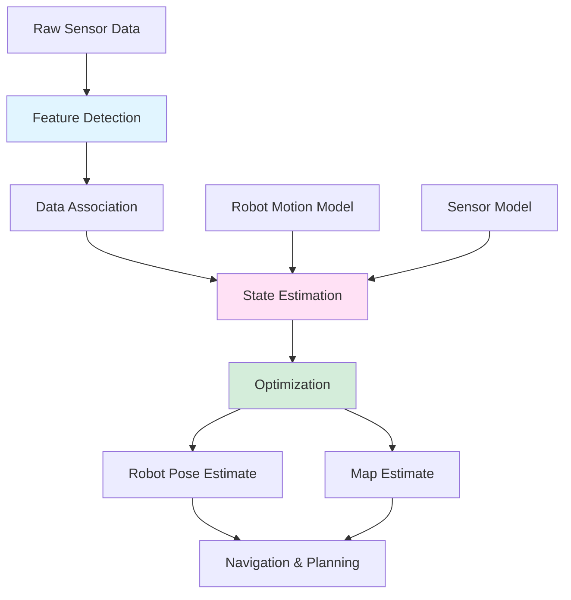

# SLAM Introduction for Beginners

> A gentle, beginner-friendly introduction to SLAM (Simultaneous Localization and Mapping) - the technology behind autonomous robots, AR/VR, and self-driving cars. No prior robotics or computer vision knowledge required!

---

## Table of Contents

1. [Prerequisites & Foundations](#1-prerequisites--foundations)
2. [From Dead Reckoning to SLAM: The Evolution](#2-from-dead-reckoning-to-slam-the-evolution)
3. [Why Do We Need SLAM?](#3-why-do-we-need-slam)
4. [Core Concepts](#4-core-concepts)
5. [How SLAM Works](#5-how-slam-works)
6. [Why SLAM Matters](#6-why-slam-matters)
7. [Hands-On Intuition](#7-hands-on-intuition)
8. [Glossary](#8-glossary)

---

## 1. Prerequisites & Foundations

Before diving into SLAM, let's build up some foundational concepts. Don't worry - we'll explain everything from scratch!

### 1.1 What is a Coordinate System?

> 📖 **Term: Coordinate System** - A mathematical framework that uses numbers to specify positions in space. Think of it as a map with numbered streets and avenues that lets you pinpoint any location.

A **coordinate system** is like a universal address system that lets us describe where things are in space.

**Visual Example:**

```
2D Cartesian Coordinate System:

    Y-axis
      ↑
  5   │    ● Point A (3, 4)
  4   │   /
  3   │  /
  2   │ /
  1   │/
  0 ──┼──●───→ X-axis
    0 1 2 3 4 5

Point A is at coordinates (3, 4):
- 3 units along the X-axis (horizontal)
- 4 units along the Y-axis (vertical)
```

**Why do we use coordinate systems in robotics?**

Coordinate systems let robots:
- Know where they are (localization)
- Know where other things are (mapping)
- Plan how to get somewhere (navigation)

### 1.2 What is a Vector?

> 📖 **Term: Vector** - An ordered list of numbers that represents both direction and magnitude. Think of it as an arrow pointing from one place to another.

A **vector** is like a compass with distance - it tells you both where to go AND how far.

**Visual Example:**

```
In 2D space:
    ↑ North
  5 |    ● [3, 2] (destination)
  4 |   /
  3 |  /  Vector [3, 2]: Move 3 East, 2 North
  2 | /
  1 |/  
  0 +──●──→ East
    0 1 2 3 4 5
      [0, 0] (origin)

Vector [3, 2] = an arrow from (0,0) to (3,2)
Magnitude = √(3² + 2²) = √13 ≈ 3.6 units
Direction = angle of ~33.7° from X-axis
```

**Vectors in robotics:**
- Robot movement: [forward, turn] directions
- Sensor measurements: [distance, angle] to landmarks
- Positions: [x, y, z] coordinates in space

### 1.3 What is a Sensor?

> 📖 **Term: Sensor** - A device that detects and responds to physical inputs from the environment. Like a robot's "sense organs" that gather information about the world.

A **sensor** is like a robot's eye, ear, or skin - it gathers information about the world.

**Common Robot Sensors:**
- **Camera**: "See" visual landmarks and obstacles
- **Lidar**: "Feel" distances using laser light
- **IMU (Inertial Measurement Unit)**: "Feel" motion and orientation
- **GPS**: "Know" approximate location on Earth

**Sensor Example:**

```
Robot with camera sensor:

┌─────────────────────────────────────────┐
│  Environment:                          │
│                                         │
│  [Tree]    [Building]                  │
│     ●           ●                      │
│                                         │
│        ← Robot with camera →           │
│        [O]                             │
│                                         │
│  Camera sees:                          │
│  - Tree at angle 45°, distance 5m      │
│  - Building at angle 90°, distance 10m │
└─────────────────────────────────────────┘

Sensor data: {(45°, 5m), (90°, 10m)} ← landmarks detected!
```

### 1.4 What is Uncertainty?

> 📖 **Term: Uncertainty** - The lack of perfect knowledge about something. In robotics, sensors are never perfectly accurate, so we must account for "best guesses" with confidence levels.

In the real world, nothing is perfectly precise. **Uncertainty** acknowledges that our measurements and predictions have errors.

**Visual Example:**

```
Robot thinks it's here: ●
But it's actually here:    ○

Real position is somewhere near the estimate,
but we're not 100% sure where!

Probability distribution:
     ↑ Confidence
     │     ***
     │   *******
     │  *********
     │ ***   ***
     │*         *
     └─────────────→ Position
        ●=estimate  ○=truth
```

**In robotics:**
- Sensor readings have noise ("the landmark is about 5m away, ±0.1m")
- Robot movement isn't perfect ("I tried to move forward 1m, but maybe 0.95m")
- We track our confidence in estimates

---

## 2. From Dead Reckoning to SLAM: The Evolution

Before understanding SLAM, we need to understand older navigation methods and why they weren't enough.

### 2.1 What is Dead Reckoning?

> 📖 **Term: Dead Reckoning** - Navigation by estimating your current position based only on your previous position, speed, and direction of travel. Like closing your eyes and trying to walk in a straight line.

**Dead Reckoning** is the simplest navigation method: just keep track of where you think you went.

**How Dead Reckoning Works:**

```
Starting position: (0, 0)

Step 1: Move forward 1 meter
→ New estimate: (0, 1)  [assuming we moved north]

Step 2: Turn right 90 degrees, move 0.5 meters  
→ New estimate: (0.5, 1) [moved east]

Step 3: Turn left 45 degrees, move 0.8 meters
→ New estimate: (1.1, 1.6) [moved northeast]

Current estimate: (1.1, 1.6)
```

### 2.2 The Problem with Dead Reckoning

**Error Accumulation:**

```
Dead Reckoning Error Problem:

Time: 0s → Robot at (0, 0) [known exactly]
       ↓
Time: 1s → Move 1m (actually 0.98m) → (0, 0.98) [error: 0.02m]
       ↓
Time: 2s → Move 1m (actually 1.02m) → (0, 1.00) [error: 0.02m]
       ↓
Time: 3s → Move 1m (actually 0.97m) → (0, 0.97) [error: 0.03m]
       ↓
Time: 100s → Small errors accumulate → (0, 85.3) [huge error: 14.7m!]

Error grows over time! → Robot lost!
```

### 2.3 The Map-Based Solution

**Using Known Maps:**

```
Solution: Use a pre-made map!

Known map:
┌─────────────────────────────────────────┐
│  [TREE]                    [BUILDING]   │
│     ●                           ●       │
│                                         │
│                                         │
│              [ROBOT]                    │
│                 [O]                     │
│                                         │
└─────────────────────────────────────────┘

Robot can:
1. Look around and recognize landmarks
2. Compare to known map
3. Correct its position estimate

Problem solved? Not quite...
```

### 2.4 The SLAM Breakthrough

> 📖 **Term: SLAM (Simultaneous Localization and Mapping)** - The ability to build a map of an unknown environment while simultaneously using that map to navigate. Like exploring a new city while drawing the map and finding your way around at the same time.

**The SLAM Insight:**

```
Traditional approach:
Map exists → Robot localizes itself in known map
     OR
Robot explores → Someone else builds map later

SLAM approach:
Robot explores → Builds map AND localizes simultaneously!
     ← Revolutionary! →
```

**SLAM vs Traditional Navigation:**

| Approach | What it needs | What it produces | Limitation |
|----------|---------------|------------------|------------|
| Dead Reckoning | Starting position | Robot path estimate | Errors accumulate quickly |
| Map-Based | Pre-built map | Robot location | Needs map beforehand |
| **SLAM** | Nothing special | **Both map & location** | **Works in unknown environments!** |

---

## 3. Why Do We Need SLAM?

Now that we understand the foundation, let's explore why SLAM was needed and what problems it solves.

### 3.1 The Problem: Unknown Environments

Many real-world scenarios require navigating where no map exists:

**Example 1: Mars Exploration**

```
Mars Rover Challenge:

Environment: Completely unknown planet
No GPS, no pre-built maps
Must explore and navigate autonomously

┌─────────────────────────────────────────┐
│  MARS SURFACE (unknown)                 │
│                                         │
│  ▲ Rock formations                      │
│  ● Strange minerals                     │
│  ■ Potential hazards                    │
│                                         │
│              [ROVER]                    │
│              [O]                        │
│                                         │
│  Solution: SLAM! Build map while        │
│  exploring and stay localized!          │
└─────────────────────────────────────────┘
```

**Example 2: Indoor Navigation**

```
Warehouse Robot:

Environment: Large indoor facility
Layout changes frequently
New obstacles daily
No GPS indoors

┌─────────────────────────────────────────┐
│  WAREHOUSE (dynamic)                    │
│                                         │
│  [Shelf] [Shelf] [Shelf]               │
│    ▓▓▓     ▓▓▓     ▓▓▓                  │
│                                         │
│              [ROBOT]                    │
│              [O]                        │
│                                         │
│  [Moving] [Pallet] [Station]           │
│   ▒▒▒▒     █████     ▒▒▒                │
│                                         │
│  Solution: SLAM! Adapt to changes       │
│  and navigate dynamically!              │
└─────────────────────────────────────────┘
```

### 3.2 Why Traditional Methods Failed

**GPS Problems:**
- Doesn't work indoors
- Inaccurate in urban canyons
- Noisy in tunnels
- Doesn't exist on other planets

**Pre-built Maps Problems:**
- Don't exist for new places
- Become outdated quickly
- Don't show temporary obstacles
- Require expensive surveys

**Dead Reckoning Problems:**
- Errors accumulate rapidly
- Robot becomes lost quickly
- No way to correct drift

### 3.3 SLAM's Solution

**Self-Sufficient Navigation:**

```
SLAM Process:

Unknown Environment:
┌─────────────────────────────────────────┐
│  ???  ???  ???  ???  ???               │
│  ???  ???  [O]  ???  ???  ← Robot      │
│  ???  ???  ???  ???  ???               │
│  ???  ???  ???  ???  ???               │
└─────────────────────────────────────────┘

Step 1: Sense surroundings
┌─────────────────────────────────────────┐
│  TREE  ???  ???  ???  BUILDING          │
│  ●     ???  [O]  ???  ●                 │
│  ???  ???  ???  ???  ???                │
│  ???  ???  ???  ???  ???                │
└─────────────────────────────────────────┘

Step 2: Update map & position
┌─────────────────────────────────────────┐
│  TREE  ???  ???  ???  BUILDING          │
│  ●     ???  [O]  ???  ●                 │
│  ???  ???  ???  ???  ???                │
│  ???  ???  ???  ???  ???                │
└─────────────────────────────────────────┘

Step 3: Move, repeat
┌─────────────────────────────────────────┐
│  TREE  PATH  ???  ???  BUILDING         │
│  ●  →  [O]   ???  ???  ●                │
│  ???  ???  ???  ???  ???                │
│  ???  ???  ???  ???  ???                │
└─────────────────────────────────────────┘

Result: Both map and location known!
```

---

## 4. Core Concepts

Now let's understand the key concepts that make SLAM work.

### 4.1 The SLAM Problem Statement

> 📖 **Term: SLAM Problem** - Given sensor measurements over time, estimate both the robot's trajectory and a map of the environment simultaneously.

**Mathematical Formulation:**

```
SLAM wants to find:
- Robot poses: x₀, x₁, x₂, ..., xₜ (positions over time)
- Landmark positions: m₁, m₂, ..., mₙ (map features)

Given: Sensor measurements z₁, z₂, ..., zₜ

Goal: Maximize P(x₀:t, m₁:n | z₁:t, u₁:t)
      (Find the most probable robot path and map given observations)
```

### 4.2 Landmarks: The Key to SLAM

> 📖 **Term: Landmark** - A distinctive feature in the environment that can be recognized repeatedly. Like a "signpost" that helps the robot know where it is.

**Landmark Concept:**

```
Landmarks are like reference points:

Environment with landmarks:
┌─────────────────────────────────────────┐
│  [TREE]                    [BUILDING]   │
│     ●                           ●       │
│                                         │
│                                         │
│              [ROBOT]                    │
│                 [O]                     │
│                                         │
│  [ROCK]                    [LIGHTPOST]  │
│     ●                           ●       │
└─────────────────────────────────────────┘

Robot sees: {(TREE, angle=45°, dist=5m), (BUILDING, angle=90°, dist=10m)}

If robot moves and sees the same TREE again:
- Same landmark! → Robot knows relative positions
- Can refine both map AND location
```

**Good Landmarks Have:**
- **Distinctive**: Easy to recognize
- **Stable**: Don't move around
- **Observable**: Detectable by sensors
- **Trackable**: Recognizable across time

### 4.3 The Loop Closure Concept

> 📖 **Term: Loop Closure** - When a robot recognizes that it has returned to a previously visited location, allowing it to correct accumulated errors.

**Loop Closure Example:**

```
Robot trajectory with loop closure:

Time 1: [A] → [B] → [C] → [D] → [E]
        (errors accumulating)

Time 2: [E] → ... → [B] ← Oh! I've been here before!
        │                  ↑
        └──────────────────┘
           Loop closure! → Can correct all intermediate positions
           (A, C, D, E can now be adjusted based on known B)

Before loop closure: Positions drifted due to accumulated errors
After loop closure:  All positions corrected to be consistent
```

### 4.4 Sensor Fusion

> 📖 **Term: Sensor Fusion** - Combining information from multiple sensors to get better estimates than any single sensor could provide.

**Sensor Fusion Analogy:**

```
Library Analogy:

Single sensor = Single book
→ Limited perspective

Multiple sensors = Multiple books on same topic
→ More complete understanding

Robot with multiple sensors:

Camera: "I see a red door at angle 30°"
Lidar:  "I detect an obstacle at distance 2.5m"
IMU:    "I rotated 5° clockwise"
Odometry: "I moved forward 1m"

Fusion: "There's a red door ~2.5m ahead and to the right!"
```

### 4.5 Uncertainty Representation

> 📖 **Term: Covariance** - A mathematical way to represent uncertainty in multiple dimensions simultaneously, showing both individual uncertainties and correlations between variables.

**Uncertainty Visualization:**

```
2D Position Uncertainty:

Robot thinks it's at (3, 4), but with uncertainty:

     ↑ Y
   5 │      ● Mean position (3, 4)
   4 │     ╭─────────────────╮
   3 │     │   Robot might   │ ← 95% confidence ellipse
   2 │     │   be anywhere   │
   1 │     │   in here       │
   0 └─────●─────────────────●→ X
     0     3                 6

Covariance matrix:
[σₓ²    σₓᵧ ]
[σᵧₓ    σᵧ² ]

Shows: How uncertain in X, how uncertain in Y, how X and Y uncertainties relate
```

---

## 5. How SLAM Works

Now let's put it all together and see how SLAM processes information.

### 5.1 The SLAM Pipeline: Step-by-Step

```
SLAM Algorithm Flow:

┌─────────────────────────────────────────────────────────────┐
│                    SLAM PIPELINE                           │
├─────────────────────────────────────────────────────────────┤
│                                                            │
│  INPUT: Raw sensor data (camera images, lidar scans, etc.) │
│     │                                                       │
│     ▼                                                       │
│  ┌─────────────────────────────────────┐                   │
│  │  FRONT-END: Feature Extraction     │                   │
│  │  - Extract landmarks from sensors  │                   │
│  │  - Match to existing landmarks     │                   │
│  │  - Detect loop closures            │                   │
│  └─────────────────────────────────────┘                   │
│     │                                                       │
│     ▼                                                       │
│  ┌─────────────────────────────────────┐                   │
│  │  BACK-END: State Estimation        │                   │
│  │  - Optimize robot trajectory       │                   │
│  │  - Optimize landmark positions     │                   │
│  │  - Minimize uncertainties          │                   │
│  └─────────────────────────────────────┘                   │
│     │                                                       │
│     ▼                                                       │
│  OUTPUT: Robot pose + Map (the SLAM solution)              │
│                                                            │
└─────────────────────────────────────────────────────────────┘
```

### 5.2 Front-End: Feature Processing

The front-end extracts and matches features from sensor data.

```
Feature Processing Steps:

Step 1: Feature Detection
┌─────────────────────────────────────────────────┐
│  Input: Camera image                           │
│                                                │
│  ████████████████████████████████████████      │
│  ███▓▓▓▓▓▓▓▓▓▓▓▓▓▓▓▓▓▓▓▓▓▓▓▓▓▓▓▓▓▓▓▓███      │
│  ███▓▓▓ TREE  ▓▓▓▓▓▓▓▓▓▓▓▓▓▓▓▓▓▓▓▓▓▓▓███      │
│  ███▓▓▓▓▓▓▓▓▓▓▓▓▓▓▓▓▓▓▓▓▓▓▓▓▓▓▓▓▓▓▓▓███      │
│  ███▓▓▓▓▓▓▓▓▓▓▓▓▓▓▓▓▓▓▓▓▓▓▓▓▓▓▓▓▓▓▓▓███      │
│  ███▓▓▓▓▓▓▓▓▓▓▓▓▓▓▓▓▓▓▓▓▓▓▓▓▓▓▓▓▓▓▓▓███      │
│  ███▓▓▓▓▓▓▓▓▓▓▓▓▓▓▓▓▓▓▓▓▓▓▓▓▓▓▓▓▓▓▓▓███      │
│  ███▓▓▓▓▓▓▓▓▓▓▓▓▓▓▓▓▓▓▓▓▓▓▓▓▓▓▓▓▓▓▓▓███      │
│  ████████████████████████████████████████      │
│                                                │
│  Detected features: [TREE corner, DOOR edge,  │
│                     WINDOW center]             │
└─────────────────────────────────────────────────┘

Step 2: Feature Matching
┌─────────────────────────────────────────────────┐
│  Current features: [TREE corner, DOOR edge]    │
│  Previous features: [TREE corner*, WINDOW]     │
│                                               │
│  Match: TREE corner ↔ TREE corner* (same!)    │
│  New: DOOR edge (first time seeing)           │
│  Unmatched: WINDOW (moved out of view)        │
└─────────────────────────────────────────────────┘

Step 3: Data Association
┌─────────────────────────────────────────────────┐
│  "Is this the SAME tree I saw before?"        │
│  YES → Update landmark position estimate       │
│  NO  → Create new landmark                     │
│  UNCLEAR → Use probabilistic matching          │
└─────────────────────────────────────────────────┘
```

### 5.3 Back-End: Optimization

The back-end optimizes the complete solution.

```
Optimization Process:

Initial estimates:
┌─────────────────────────────────────────────────┐
│  Robot path: [A]─[B]─[C]─[D]─[E]             │
│  Landmarks: {TREE@5m, BUILDING@10m}           │
│  Uncertainties: High (many approximations)    │
└─────────────────────────────────────────────────┘

Constraints from measurements:
┌─────────────────────────────────────────────────┐
│  At A: Saw TREE at bearing 45°               │
│  At B: Saw TREE at bearing 30°               │
│  At C: Saw BUILDING at bearing 90°           │
│  At D: Returned to vicinity of A location    │
│  At E: Saw TREE again, confirming loop       │
└─────────────────────────────────────────────────┘

Optimization:
┌─────────────────────────────────────────────────┐
│  Find path and map that BEST satisfies:       │
│  1. Kinematic constraints (robot motion)      │
│  2. Measurement constraints (sensor data)     │
│  3. Loop closure constraints (consistency)    │
│                                               │
│  Result: Optimized path + map with reduced    │
│          uncertainties!                       │
└─────────────────────────────────────────────────┘
```

### 5.4 Common SLAM Approaches

**EKF SLAM (Extended Kalman Filter SLAM):**
- Represents state as mean and covariance
- Good for small environments
- Computationally efficient

**Graph SLAM:**
- Represents as optimization graph
- Better for large environments
- Handles loop closures well

**Particle Filter SLAM:**
- Uses multiple hypotheses
- Good for ambiguous situations
- Handles multi-modal distributions

### 5.5 Visual Architecture Diagram



---

## 6. Why SLAM Matters

SLAM has revolutionized robotics and spatial computing. Let's see why it's so important.

### 6.1 Real-World Applications

```
┌─────────────────────────────────────────────────────────────┐
│                    SLAM APPLICATIONS                       │
├─────────────────────────────────────────────────────────────┤
│                                                            │
│  🤖 Autonomous Vehicles                                     │
│     "Navigate city streets without GPS"                    │
│     → Self-driving cars, delivery robots                   │
│                                                            │
│  📱 Augmented Reality (AR)                                  │
│     "Overlay digital content on real world"                │
│     → Pokemon GO, Snapchat filters, AR navigation          │
│                                                            │
│  🏠 Domestic Robots                                         │
│     "Clean house efficiently"                              │
│     → Roomba, floor mopping robots                         │
│                                                            │
│  🏭 Industrial Automation                                   │
│     "Transport goods in warehouses"                        │
│     → Amazon fulfillment centers, factory logistics        │
│                                                            │
│  🌍 Planetary Exploration                                   │
│     "Explore Mars autonomously"                            │
│     → Mars rovers, lunar missions                          │
│                                                            │
│  👁️ Virtual Reality (VR)                                   │
│     "Track user movements in room"                         │
│     → VR headsets, immersive experiences                   │
│                                                            │
│  🏥 Medical Robotics                                        │
│     "Navigate inside body for surgery"                     │
│     → Surgical robots, endoscopy                           │
│                                                            │
│  🚁 Drones & UAVs                                           │
│     "Fly autonomously in GPS-denied areas"                 │
│     → Indoor inspection, search and rescue                 │
│                                                            │
│  🏗️ Construction & Surveying                               │
│     "Map construction sites"                               │
│     → Site monitoring, progress tracking                   │
│                                                            │
└─────────────────────────────────────────────────────────────┘
```

### 6.2 The SLAM Family Tree

```
SLAM Evolution:

1986: "The Mobile Robot Simultaneous Localization and Mapping Problem"
         │
         └─► Early SLAM (Kalman Filter based)
              │
              ├─► 1990s: EKF SLAM
              │        "Extended Kalman Filter SLAM"
              │        Used for: Small-scale mapping
              │
              ├─► 2000s: Particle Filter SLAM
              │        "Monte Carlo Localization"
              │        Used for: Ambiguous environments
              │
              ├─► 2000s: FastSLAM
              │        "Fast SLAM using particle filters"
              │        Breakthrough in efficiency
              │
              ├─► 2010s: Graph SLAM
              │        "Pose Graph Optimization"
              │        Better loop closure handling
              │
              ├─► 2010s: Visual SLAM (VO/VIO)
              │        "Visual Odometry/Inertial"
              │        Using cameras as primary sensors
              │
              ├─» 2010s-Present: LiDAR SLAM
              │        "Light Detection and Ranging SLAM"
              │        Precise mapping with lasers
              │
              └─► 2020s+: Neural SLAM
                        "Learning-based SLAM"
                        AI-enhanced perception and mapping
```

### 6.3 Key Innovations Summary

| Innovation | Why It Matters |
|------------|----------------|
| **Simultaneous Operation** | Solve localization and mapping together |
| **Uncertainty Handling** | Account for sensor and motion noise |
| **Loop Closure** | Correct accumulated drift errors |
| **Data Association** | Match observations to landmarks reliably |
| **Multi-Sensor Fusion** | Combine different sensor types |
| **Real-Time Capability** | Operate online as robot moves |

---

## 7. Hands-On Intuition

Let's simulate SLAM by hand with a simple example. This will help you really understand how it works!

### 7.1 Setup: Simple Example

```
Scenario: Robot moving in 1D hallway

Environment: 1D hallway with landmarks at known positions
- Landmark A: at position 5.0m
- Landmark B: at position 10.0m  
- Landmark C: at position 15.0m

Robot starts at position 0.0m, moves +1m each step.

For simplicity, let's track:
- Robot position (x)
- Landmark positions (mA, mB, mC)
- All with simple uncertainty values
```

### 7.2 Step-by-Step SLAM Simulation

**Step 1: Initialization**

```
Initial state:
Robot at: x₀ = 0.0m ± 0.1m (very confident start position)
Landmarks: unknown positions

State vector: [x₀, mA, mB, mC] = [0.0, ?, ?, ?]
```

**Step 2: First Movement**

```
Action: Move forward 1.0m (odometry says)
Actual: Move forward 1.0m ± 0.05m (motion uncertainty)

New estimate:
x₁ = x₀ + 1.0 = 0.0 + 1.0 = 1.0m
Uncertainty increases: ±0.15m (accumulated)

State: [1.0, ?, ?, ?] ± [0.15, ?, ?, ?]
```

**Step 3: First Observation**

```
Sensor observation: "See landmark A at distance 4.1m"

If landmark A is at position mA, and robot is at x₁,
then: distance = |mA - x₁| = |mA - 1.0| = 4.1m

So: mA = 1.0 + 4.1 = 5.1m (assuming landmark is ahead)

Update belief about landmark A:
mA = 5.1m ± 0.2m (sensor uncertainty)

State: [1.0, 5.1, ?, ?] ± [0.15, 0.2, ?, ?]
```

**Step 4: Continue Moving and Observing**

```
Move to x₂ = 2.0m ± 0.2m (more uncertainty accumulated)

Observe landmark A again: "distance 3.2m"
Prediction: |5.1 - 2.0| = 3.1m
Measurement: 3.2m
Small difference → confirms landmark position!

Refine estimate: mA is likely at 5.1m (consistent with both observations)

State: [2.0, 5.1, ?, ?] ± [0.2, 0.15, ?, ?] (confidence increased)
```

**Step 5: Discover New Landmark**

```
At x₃ = 3.0m ± 0.25m, observe: "landmark at distance 7.1m"

Check against known landmarks:
- Distance to A (at 5.1): |5.1 - 3.0| = 2.1m ≠ 7.1m
- This is a NEW landmark!

Estimate new landmark B position:
mB = 3.0 + 7.1 = 10.1m ± 0.2m

State: [3.0, 5.1, 10.1, ?] ± [0.25, 0.15, 0.2, ?]
```

**Step 6: Loop Closure Opportunity**

```
Robot reaches x₈ = 8.0m ± 0.4m

Observe landmark A: "distance 2.9m"
Predicted: |5.1 - 8.0| = 2.9m
Measured: 2.9m
Perfect match! → Loop closure detected!

This means our path from x₀ to x₈ is consistent
with our landmark map → Increase confidence in entire path!
```

### 7.3 Visual Summary

```
SLAM Learning Process:

Time 0: [O]─────A─────B─────C    (robot knows nothing)
       (0.0m)  (?.?m)  (?.?m) (?.?m)

Time 1: [O]─────A─────B─────C    (moved, uncertain)
       (1.0m±) (?.?m)  (?.?m) (?.?m)

Time 2: [O]─────A─────B─────C    (saw A, estimated position)
       (2.0m±) (5.1m±) (?.?m) (?.?m)

Time 3: [O]─────A─────B─────C    (saw new landmark B)
       (3.0m±) (5.1m+) (10.1m±) (?.?m)

Time 8: [O]─────A─────B─────C    (loop closure, all refined)
       (8.0m+) (5.0m*) (10.0m*) (?.?m)

Legend: 
- Number = estimated position
- ± = low confidence
- + = medium confidence  
- * = high confidence
```

---

## 8. Glossary

Complete reference for all terms introduced in this document.

| Term | Definition |
|------|------------|
| **Coordinate System** | A mathematical framework using numbers to specify positions in space. Like a map with numbered streets. |
| **Covariance** | Mathematical representation of uncertainty in multiple dimensions, showing both individual uncertainties and correlations. |
| **Data Association** | The process of determining whether a current sensor measurement corresponds to a previously observed landmark. |
| **Dead Reckoning** | Navigation by estimating current position based only on previous position, speed, and direction of travel. |
| **Feature** | A distinctive point, line, or region in sensor data that can be detected and tracked over time. |
| **Front-End** | The part of SLAM that processes raw sensor data to extract features and establish correspondences. |
| **Graph SLAM** | A SLAM approach that formulates the problem as a graph optimization, with poses and landmarks as nodes. |
| **Landmark** | A distinctive feature in the environment that can be recognized repeatedly to aid in localization. |
| **Loop Closure** | Recognition that the robot has returned to a previously visited location, allowing correction of accumulated errors. |
| **Sensor** | A device that detects and responds to physical inputs from the environment, like a robot's "sense organs". |
| **Sensor Fusion** | Combining information from multiple sensors to get better estimates than any single sensor could provide. |
| **SLAM** | Simultaneous Localization and Mapping - building a map while using it to navigate. |
| **SLAM Problem** | The mathematical challenge of estimating robot trajectory and environmental map simultaneously from sensor data. |
| **Uncertainty** | The lack of perfect knowledge about something; in robotics, acknowledging that measurements and predictions have errors. |
| **Back-End** | The part of SLAM that performs state estimation and optimization using front-end measurements. |
| **EKF SLAM** | Extended Kalman Filter SLAM, representing state as mean and covariance matrix. |
| **Visual SLAM** | SLAM using primarily camera sensors for localization and mapping. |
| **LiDAR SLAM** | SLAM using Light Detection and Ranging sensors for precise distance measurements. |
| **Particle Filter SLAM** | SLAM using multiple hypotheses to represent uncertainty in the state estimate. |

---

## Conclusion

Congratulations! You've learned the fundamentals of SLAM (Simultaneous Localization and Mapping):

**What you now understand:**
- ✓ Prerequisites: Coordinate systems, vectors, sensors, uncertainty
- ✓ Evolution from dead reckoning to SLAM
- ✓ Why SLAM was invented (problems it solves)
- ✓ Core concepts: Landmarks, loop closure, sensor fusion, uncertainty
- ✓ How SLAM works (front-end, back-end, optimization)
- ✓ Why it matters (real-world applications)
- ✓ Hands-on intuition (simulated SLAM by hand!)

**Next Steps:**
1. **Experiment** with SLAM simulators (like Gazebo with ROS)
2. **Try** open-source SLAM implementations (ORB-SLAM, RTAB-MAP)
3. **Learn** about specific SLAM algorithms in depth
4. **Explore** applications in robotics, AR/VR, or autonomous vehicles

SLAM is more than an algorithm - it's the foundation that enables robots to understand and navigate in unknown environments. Understanding it gives you insight into how autonomous systems achieve spatial awareness.

**Keep learning!** 🚀

---

> **Document Info**
>
> - **Created:** 2026
> - **Target Audience:** Complete beginners (no robotics/vision background required)
> - **Prerequisites:** Basic geometry and algebra comfort
> - **Approximate Reading Time:** 45-60 minutes
>
> For the standard technical reference, see `slam_evolution_document.md`