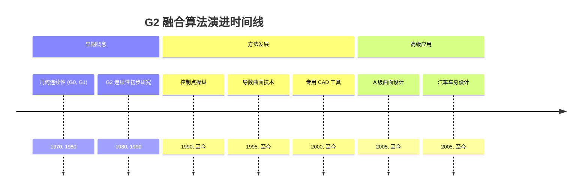
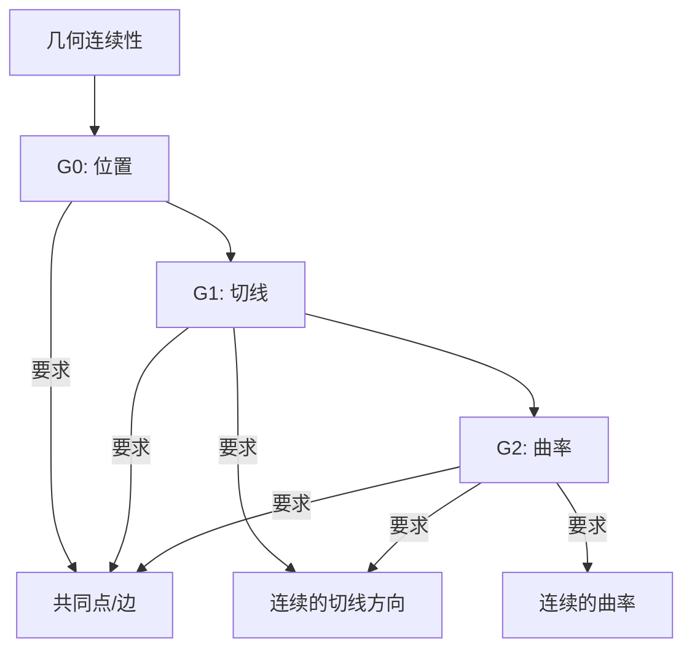
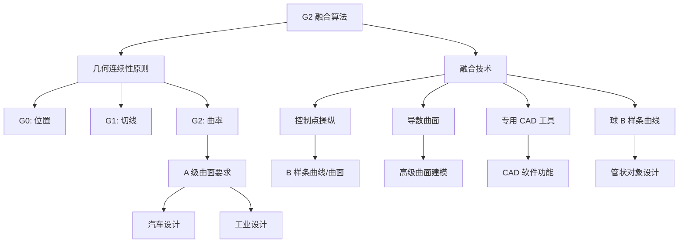

## G2 融合算法演进文档

### 1. 引言与历史背景

G2 融合算法是指在几何建模中用于实现两条曲线或两个曲面之间 G2 连续性的方法。G2 连续性，又称曲率连续性，确保了这些几何实体在交界处的平滑过渡。在汽车车身设计等要求高美学和功能质量的领域，以及其他需要“A级”曲面的工业设计应用中，这种连续性至关重要。

几何连续性（Gn）概念的提出，旨在描述曲线和曲面在连接处的平滑度，超越了简单的参数连续性（Cn）。虽然 C2 连续性意味着 G2 连续性，但 G2 连续性是一个更宽松的条件，在实际设计场景中通常足够使用且更易于实现。随着对视觉无瑕设计的需求日益增长以及计算机辅助设计（CAD）和计算机图形学的发展，对 G2 融合技术的研究也在不断演进。

### 1.1. G2 融合时间线



### 2. 核心概念

G2 融合的核心在于理解和实现曲率连续性。通过与较低阶的几何连续性进行比较，可以更好地理解这一点。

#### 2.1. G0 (位置连续性)

**心智模型 / 类比：** 想象两根绳子系在一起。G0 连续性仅仅意味着绳子的末端在同一点相遇，没有间隙。

*   **背景：** 这是最基本的连续性级别，其中两条曲线或两个曲面在一个共同的点或边上相遇，没有间隙或重叠。
*   **描述：** 确保一条曲线的终点与下一条曲线的起点重合，或者两个曲面共享一个公共边界。对平滑度或切线对齐没有要求。

#### 2.2. G1 (切线连续性)

**心智模型 / 类比：** 现在想象这两根绳子不仅系在一起，而且在结点处的方向也对齐。方向是平滑的，但曲线的弯曲程度可能会突然改变。

*   **背景：** 在 G0 的基础上，G1 连续性要求曲面或曲线不仅要相遇，而且在交界处具有连续的切线方向。
*   **描述：** 这意味着曲线或曲面的方向没有突然的变化。连接处的切向量是共线的（指向同一方向），尽管它们的长度可以不同。然而，曲率的变化率仍然可能突然改变。

#### 2.3. G2 (曲率连续性)

**心智模型 / 类比：** 延续绳子的类比，G2 连续性意味着绳子不仅系在一起并且方向对齐，而且在结点处具有相同的“弯曲”或曲率。过渡是完全平滑的，你无法通过触摸曲线来判断一根绳子在哪里结束，另一根从哪里开始。

*   **背景：** 这是更高级别的平滑度。除了 G0 和 G1，G2 连续性还确保两条曲线或两个曲面在连接处的曲率是连续的。
*   **描述：** 这意味着曲面曲率的变化率无缝匹配，从而产生视觉上平滑的过渡，没有曲率的突然变化。这对于“A级”曲面至关重要，因为在这些曲面上，反射光线会显得平滑且不间断。

**Mermaid 图：几何连续性级别**



### 3. 详细方法概述

在 CAD 中，通常使用 B 样条曲线和曲面来实现 G2 融合，这需要采用多种算法和技术。

#### 3.1. 控制点操纵

**目标：** 通过仔细定位和约束 B 样条曲线或曲面的控制点来实现 G2 连续性。

**解释：** 对于 B 样条曲线，可以通过特定的控制顶点排列来实现 G2 连续性，通常涉及在融合区域两侧各有三个控制点，并以特定方式对齐。这些控制点的位置直接影响曲线的形状和曲率。通过求解从 G2 连续性条件导出的方程组，可以确定控制点的最佳位置。

*   **背景：** 一种基于 B 样条融合的基本方法，依赖于控制点对曲线/曲面形状的直接影响。
*   **参数：** 控制点坐标、权重（对于 NURBS）和 B 样条的阶数。
*   **返回：** 定义了 G2 连续融合的修改后的一组控制点。

#### 3.2. 导数曲面

**目标：** 利用导数曲面来控制融合曲面之间的连续性。

**解释：** 先进的融合工具可能会使用导数曲面来控制连续性。通过调整导数曲面的类型和大小，可以生成具有不同连续性级别（G1、G2、G3）的融合曲面。这种方法允许对融合过程进行更抽象的控制，设计者可以操纵与曲面变化率相关的属性，而不是单个控制点。

*   **背景：** 一种常见于复杂 CAD 系统中的先进技术，提供对曲面属性的更高级别控制。
*   **参数：** 导数曲面的属性，例如其类型和大小。
*   **返回：** 具有所需连续性级别（例如 G2）的融合曲面。

#### 3.3. 专用融合工具

**目标：** 在 CAD 软件中提供用户友好的工具，以创建 G2 连续的圆角和融合。

**解释：** 许多商业 CAD 软件包都提供专门的工具来创建 G2 连续的圆角和融合。这些工具将底层的数学复杂性抽象出来，允许设计者通过直观的界面实现 G2 连续性。例如，AutoCAD 的 BLEND 命令使用“平滑”选项可以创建具有 G2 连续性的 5 次样条。这些工具通常在内部集成各种算法以满足 G2 条件。

*   **背景：** 在 CAD 软件中的实际应用，为设计者简化了流程。
*   **参数：** 输入曲线/曲面、融合半径和连续性级别（例如 G2）。
*   **返回：** G2 连续的融合或圆角曲面。

#### 3.4. 球 B 样条曲线 (BBSC)

**目标：** 通过在融合过程中同时考虑骨架线和半径来建模具有 G2 连续性的管状对象。

**解释：** 对于管状对象的建模，使用球 B 样条曲线的方法在融合过程中同时考虑骨架线和半径，以实现 G2 连续性。这种专门的方法对于管道布线或设计复杂的管状结构等应用特别有用，在这些应用中，保持一致的横截面和平滑的过渡至关重要。

*   **背景：** 一种用于管状对象融合的专门方法，集成了几何和体积考虑。
*   **参数：** 骨架线定义、半径轮廓和 G2 连续性约束。
*   **返回：** G2 连续的管状融合。

#### 3.5. 快速参考：G2 融合方法

| 方法 | 描述 | 何时使用 |
| :--- | :--- | :--- |
| 控制点操纵 | 直接调整 B 样条控制点 | 对 B 样条曲线/曲面进行精细控制。 |
| 导数曲面 | 操纵抽象的曲面属性 | 在高级 CAD 系统中进行高级别控制。 |
| 专用融合工具 | 用于 G2 融合的 CAD 软件功能 | 用户友好地创建圆角和融合。 |
| 球 B 样条曲线 (BBSC) | 融合管状对象 | 需要管状几何的特定应用。 |

#### 3.6. G2 融合架构图



### 3.7. 代码示例：G2 连续性条件

实现 G2 连续性通常需要满足一组与曲线控制点相关的数学条件。以下 Python 代码从概念上演示了如何设置两条三次贝塞尔曲线的控制点，以确保它们以 G2 连续性相交。

**代码:**
```python
import numpy as np

# 定义第一条三次贝塞尔曲线的控制点 (P0, P1, P2, P3)
P0 = np.array([0, 0])
P1 = np.array([1, 2])
P2 = np.array([3, 3])
# P3 将是连接点。

# 定义第二条三次贝塞尔曲线的控制点 (Q0, Q1, Q2, Q3)
# Q0, Q1, 和 Q2 将由 G2 条件确定。
Q3 = np.array([6, 0])

# --- G0 条件 (位置连续性) ---
# 第一条曲线的最后一个点必须与第二条曲线的第一个点相同。
P3 = np.array([4, 2])
Q0 = P3
print(f"G0: P3 和 Q0 位于相同位置: {Q0}")

# --- G1 条件 (切线连续性) ---
# 点 P2, P3=Q0, 和 Q1 必须共线。
# 向量 P2-P3 必须与 Q1-Q0 成比例。我们使用一个标量 k1 > 0。
k1 = 1.5
Q1 = Q0 + k1 * (P3 - P2)
print(f"G1: Q1 与 P2 和 P3=Q0 共线: {Q1}")

# --- G2 条件 (曲率连续性) ---
# 这个条件关联了二阶导数。对于三次贝塞尔曲线，它对
# P1, P2, P3, Q0, Q1, 和 Q2 施加了特定的关系。
# 公式是: Q2 = (1 + k1)/k1 * Q1 - 1/k1 * Q0 + k1 * (P1 - 2*P2 + P3)
Q2 = (1 + k1)/k1 * Q1 - (1/k1) * Q0 + k1 * (P1 - 2*P2 + P3)
print(f"G2: 计算 Q2 以确保曲率连续性: {Q2}")

print("\n--- 最终控制点 ---")
print(f"曲线 1: {P0}, {P1}, {P2}, {P3}")
print(f"曲线 2: {Q0}, {Q1}, {Q2}, {Q3}")
```

**预期输出:**
```
G0: P3 和 Q0 位于相同位置: [4 2]
G1: Q1 与 P2 和 P3=Q0 共线: [5.5 0.5]
G2: 计算 Q2 以确保曲率连续性: [5.5 -2. ]

--- 最终控制点 ---
曲线 1: [0 0], [1 2], [3 3], [4 2]
曲线 2: [4 2], [5.5 0.5], [5.5 -2. ], [6 0]
```

**解释:**
此代码不绘制曲线，但计算了控制点 `Q0`、`Q1` 和 `Q2` 所需的位置，以将第二条曲线平滑地连接到第一条。
1.  **G0:** `P3` 和 `Q0` 设置为同一点。
2.  **G1:** `Q1` 放置在从 `P2` 到 `P3` 的延长线上，确保切线匹配。标量 `k1` 控制连接点处曲线的“速度”。
3.  **G2:** 然后根据其他点和 `k1` 数学确定 `Q2` 的位置，以确保曲率也是连续的。通过满足这些条件，两条曲线将形成一条视觉上无缝的 G2 连续的单一曲线。

### 4. 演进与影响

G2 融合算法的演进与计算机图形学、CAD/CAM 系统的进步以及高质量工业设计日益增长的需求密切相关。

*   **工业设计与美学：** G2 融合已成为工业设计的基石，特别是对于视觉吸引力和无缝过渡至关重要的产品。这包括消费电子产品、家电，尤其是汽车外饰。
*   **“A级”曲面：** 实现 G2 连续性的能力是“A级”曲面的一个决定性特征，这些曲面是产品的可见、美学表面。这些曲面需要最高级别的平滑度，以确保完美的反射和优质的外观。
*   **CAD/CAM 集成：** 现代 CAD/CAM 软件包集成了复杂的 G2 融合功能，使设计人员和工程师能够更轻松地创建复杂、平滑的几何形状。这简化了设计工作流程并提高了产品质量。
*   **空气动力学与功能性：** 除了美学，G2 连续性对于功能方面也很重要，例如汽车和航空航天设计中的空气动力学，其中平滑的过渡可以最大限度地减少阻力和湍流。

### 5. 结论

G2 融合算法代表了几何建模领域的一项关键进步，能够创建高度平滑且美观的曲线和曲面。通过确保曲率连续性，这些方法满足了工业设计，特别是“A级”曲面的严格要求。更强大、更直观的 G2 融合技术的不断发展，继续为设计人员和工程师突破产品形式和功能的界限提供支持。