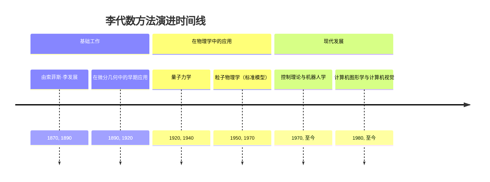
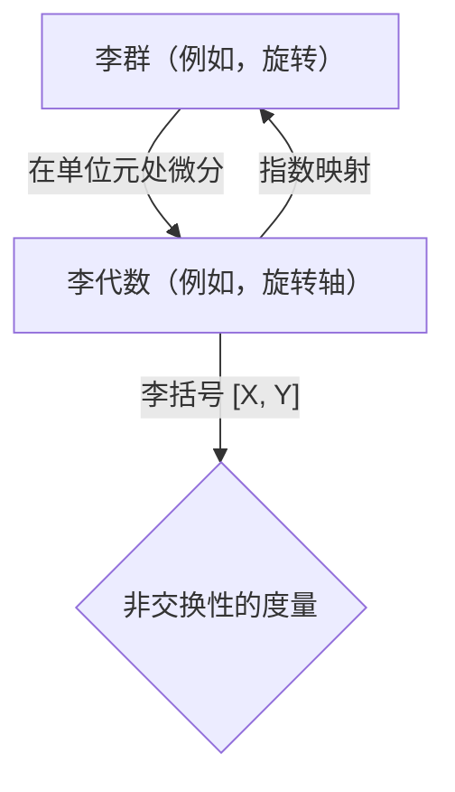
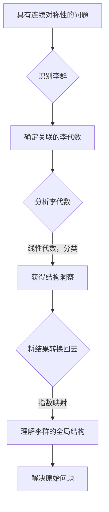

## 李代数方法演进文档

### 1. 引言与历史背景

李代数方法是一种数学方法，利用李代数来研究连续对称性及其在各个领域（尤其是在物理学和数学中）的影响。它基于李代数和李群之间的密切关系。该理论由挪威数学家索菲斯·李于 19 世纪创立，旨在研究微分方程并构建连续群的理论。

该方法将与李群相关的复杂的非线性问题转化为李代数框架内更简单的线性问题。事实证明，这对于理解李群的结构和分类以及分析物理系统中的对称性是一个非常强大的工具。

### 1.1. 李代数方法时间线



### 2. 核心概念

李代数方法的核心是李群和李代数之间的对应关系。

#### 2.1. 李群

**心智模型 / 类比：** 将李群想象成可以应用于对象的所有可能连续变换的集合，例如球体的所有可能旋转。每次旋转都是群的一个元素，你可以组合旋转（群操作）以获得新的旋转。

*   **背景：** 李群是一个群，同时也是一个光滑流形。这意味着它的元素是连续变化的，并且群操作（乘法和求逆）是光滑的。
*   **描述：** 李群描述了连续对称性。例如，3D 空间中的旋转群（SO(3)）或狭义相对论中的时空变换群（庞加莱群）。

#### 2.2. 李代数

**心智模型 / 类比：** 如果李群是球体的所有可能旋转，那么相应的李代数就是所有可能的“无穷小旋转”或旋转轴的集合。李代数的每个元素都描述了围绕特定轴的微小旋转。

*   **背景：** 每个李群都对应一个李代数，即群单位元处的切空间。
*   **描述：** 李代数是一个向量空间，配备了一个称为李括号的二元运算。李代数的元素可以被认为是李群的“无穷小生成元”。

#### 2.3. 李括号（交换子）

**心智模型 / 类比：** 李括号衡量两个无穷小变换如何相互干扰。如果你先围绕 x 轴进行微小旋转，然后再围绕 y 轴进行微小旋转，其结果与颠倒顺序不同。李括号量化了这种差异。

*   **背景：** 李括号是李代数中的一种运算，用于衡量相应李群的非交换性。
*   **描述：** 对于李代数的两个元素 X 和 Y，李括号 [X, Y] 也是李代数的一个元素。如果 [X, Y] = 0，则相应的变换是可交换的。

**Mermaid 图：李群-李代数关系**



### 3. 详细方法概述

李代数方法利用李群和李代数之间的对应关系来简化复杂问题。

#### 3.1. 线性化

**目标：** 将非线性问题转化为线性问题。

**解释：** 该方法不是直接处理李群的复杂非线性操作，而是将问题转化为李代数的线性空间。在李代数中涉及向量和矩阵的计算通常比处理李群的全局变换要简单得多。

*   **背景：** 该方法降低复杂性的基本步骤。
*   **参数：** 一个李群及其关联的李代数。
*   **返回：** 一个可以使用线性代数工具进行分析的线性化问题。

#### 3.2. 李代数的分类

**目标：** 通过对李代数进行分类来分类和理解李群的结构。

**解释：** 李代数的分类在数学中是一个已经完全解决的问题。通过研究李代数的结构（例如，它是单代数、半单代数还是可解代数），可以得出关于相应李群性质的深刻结论。

*   **背景：** 李理论的一个核心成果，允许对对称群进行系统研究。
*   **参数：** 李代数的结构常数。
*   **返回：** 李代数的分类，以及对相关李群的深入理解。

#### 3.3. 在微分方程中的应用

**目标：** 寻找微分方程的对称性以简化或求解它们。

**解释：** 索菲斯·李最初是为此目的发展该方法的。如果一个微分方程具有连续对称性（即，在一组李群变换下保持不变），则可以使用李代数方法找到该对称性。然后，可以利用对称性的知识来降低方程的阶数，甚至找到解析解。

*   **背景：** 李理论的最初也是最重要的应用之一。
*   **参数：** 一个微分方程。
*   **返回：** 一组可用于简化或求解方程的对称性生成元（一个李代数）。

#### 3.4. 快速参考：李代数方法

| 方法 | 描述 | 何时使用 |
| :--- | :--- | :--- |
| 线性化 | 将群问题转化为代数问题 | 简化复杂的非线性问题。 |
| 分类 | 研究李代数的结构 | 理解对称群的性质。 |
| 在 DEs 中的应用 | 寻找微分方程中的对称性 | 简化和求解微分方程。 |

#### 3.5. 李代数方法工作流程图



### 3.6. 代码示例：SO(3)的李群-代数关系

本示例使用 Python 的 `numpy` 和 `scipy` 库来展示 SO(3) 李群（3D 旋转）与其李代数 so(3)（反对称 3x3 矩阵）之间的关系。

**代码:**
```python
import numpy as np
from scipy.linalg import expm

# so(3) 李代数的一个元素（一个反对称矩阵）
# 这表示围绕 z 轴的无穷小旋转。
X = np.array([[0, -1, 0],
              [1,  0, 0],
              [0,  0, 0]])

# 参数 'theta' 决定了旋转量。
theta = np.pi / 2  # 90 度

# 使用指数映射来获取相应的李群元素（一个旋转矩阵）
# R = exp(theta * X)
R = expm(theta * X)

print("李代数元素 (X):")
print(X)
print("\n旋转角度 (theta):", theta)
print("\n李群元素 (R = expm(theta * X)):")
print(np.round(R, decimals=5))

# 李括号 [X, Y] = XY - YX 显示了非交换性。
# 让我们定义另一个用于围绕 x 轴旋转的元素。
Y = np.array([[0, 0, 0],
              [0, 0, -1],
              [0, 1, 0]])

lie_bracket_XY = (X @ Y) - (Y @ X)
print("\nX (z-轴旋转) 和 Y (x-轴旋转) 的李括号:")
print(lie_bracket_XY)
print("# 这个结果是围绕 y 轴旋转的生成元。")
```

**预期输出:**
```
李代数元素 (X):
[[ 0 -1  0]
 [ 1  0  0]
 [ 0  0  0]]

旋转角度 (theta): 1.5707963267948966

李群元素 (R = expm(theta * X)):
[[ 0. -1.  0.]
 [ 1.  0.  0.]
 [ 0.  0.  1.]]

X (z-轴旋转) 和 Y (x-轴旋转) 的李括号:
[[ 0  0  1]
 [ 0  0  0]
 [-1  0  0]]
# 这个结果是围绕 y 轴旋转的生成元。
```

**解释:**
反对称矩阵 `X` 是李代数 so(3) 的一个元素，代表一个无穷小旋转生成元。`scipy.linalg.expm()` 函数计算矩阵指数，它将代数元素映射到李群 SO(3) 的一个元素——在本例中，是一个围绕 z 轴旋转 90 度的旋转矩阵。李括号 `[X, Y]` 不为零，表明围绕不同轴的旋转是不可交换的。括号的结果本身是另一个旋转的生成元。

### 4. 演进与影响

李代数方法彻底改变了现代物理学和数学。

*   **物理学：** 李群和李代数是物理学中对称性的数学语言。它们是量子力学、广义相对论，特别是描述基本力和粒子的粒子物理学标准模型的基础。
*   **微分方程：** 该方法仍然是科学和工程许多领域中分析和求解微分方程的重要工具。
*   **机器人学与控制理论：** 在机器人学中，李群和李代数用于描述机器人的配置和运动（例如，机器人手臂的位置和方向）。
*   **计算机图形学：** 在计算机图形学中，它们用于以数值稳定的方式表示 3D 旋转和变换，并避免“万向节锁”等问题。

### 5. 结论

李代数方法是一种深刻而通用的工具，它使我们能够通过线性代数的视角来观察连续对称性的复杂世界。从其在微分方程理论中的起源到其在现代物理学中的核心作用，该方法从根本上塑造了我们对宇宙基本定律的理解以及我们建模和控制复杂系统的能力。