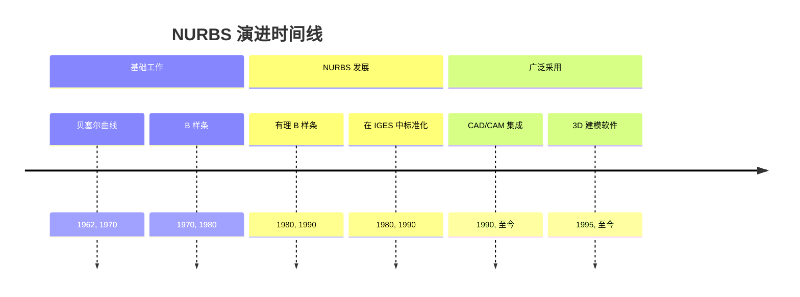
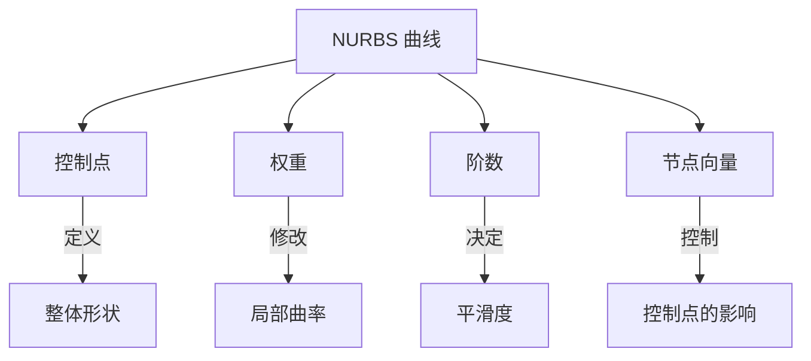
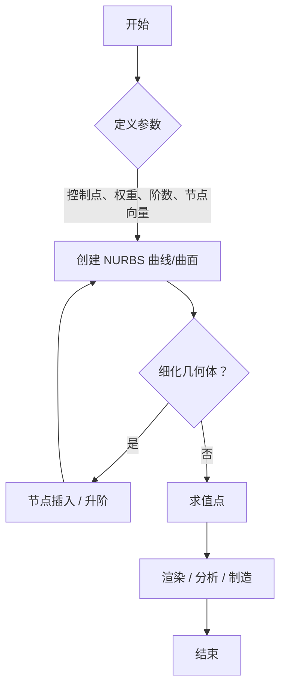

## NURBS 演进文档

### 1. 引言与历史背景

NURBS（非均匀有理 B 样条）是一种用于计算机图形学中表示和设计曲线和曲面的数学模型。它提供了显著的灵活性和精度，既适用于解析形状（如圆形和圆锥体），也适用于复杂的自由形态有机形状。NURBS 已成为 CAD、CAM 和 CAE 系统中表示和交换几何信息的行业标准。

NURBS 的发展是一个渐进的过程，建立在 B 样条和贝塞尔曲线的基础之上。NURBS 的关键创新是引入了“有理”样条，这使得可以精确表示圆锥截面，如圆形和椭圆。这一能力是非有理 B 样条的一个重要进步。20 世纪 80 年代，NURBS 在 IGES（初始图形交换规范）中的标准化，巩固了其作为现代几何建模基石的地位。

### 1.1. NURBS 演进时间线



### 2. 核心架构

NURBS 的强大之处在于其组件，这些组件为曲线和曲面的形状提供了高度的控制。

#### 2.1. 控制点

**心智模型 / 类比：** 将控制点想象成定义曲线整体形状的“骨架”。曲线被这些点“吸引”，但不一定穿过它们。移动一个控制点会将曲线向该方向拉动。

*   **背景：** NURBS 曲线或曲面的形状由一组加权控制点确定。
*   **描述：** 这些点形成一个控制多边形或多面体，引导曲线或曲面的形状。移动这些点可以直观且可预测地改变几何形状。

#### 2.2. 权重

**心智模型 / 类比：** 每个控制点对曲线都有“引力”，权重决定了这种引力的强度。权重越高，曲线越靠近该控制点。

*   **背景：** 每个控制点都有一个关联的权重。
*   **描述：** 当所有权重相等（通常为 1）时，曲线被认为是非有理的，简化为 B 样条。具有不同权重的有理 NURBS 能够精确表示圆形和椭圆等形状，这是非有理 B 样条无法做到的。

#### 2.3. 阶数

**心智模型 / 类比：** 阶数就像曲线的“刚度”或“平滑度”。阶数越高，曲线越平滑、越连续，但局部控制也越少。

*   **背景：** 阶数是一个正整数（通常为 1、2、3 或 5），定义了影响曲线上任何给定点的邻近控制点的数量。
*   **描述：**
    *   阶数 1：线性曲线（直线）。
    *   阶数 2：二次曲线。
    *   阶数 3：三次曲线（最常用于自由形态建模）。

#### 2.4. 节点向量

**心智模型 / 类比：** 节点向量就像沿着曲线的“标尺”，决定了每个控制点影响的起始和结束位置。“非均匀”意味着这把标尺上的标记不必均匀分布，从而可以对曲线的特定部分进行更多控制。

*   **背景：** 这是一个非递减数字序列，定义了曲线的参数间隔。
*   **描述：** NURBS 中的“非均匀”表示这些间隔不必均匀分布，从而可以更好地控制曲线的局部形状。这是 NURBS 与均匀 B 样条的一个关键区别特征。

**Mermaid 图：NURBS 曲线组件**



### 3. 详细操作概述

虽然 NURBS 是一个数学模型，而不是一个具有特定 API 的库，但在各种软件实现中，对 NURBS 曲线和曲面执行的操作是标准化的。

#### 3.1. 曲线和曲面创建

**目标：** 从一组输入参数生成 NURBS 曲线和曲面。

**解释：** 这是基本操作，根据给定的控制点、权重、阶数和节点向量创建曲线或曲面。CAD 软件提供各种工具来创建 NURBS 几何体，从圆形和球体等简单基元到复杂的自由形态形状。

*   **背景：** NURBS 几何体的初始生成。
*   **参数：** 控制点、权重、阶数、节点向量。
*   **返回：** NURBS 曲线或曲面。

#### 3.2. 节点插入

**目标：** 在不改变曲线形状的情况下向节点向量添加新节点。

**解释：** 节点插入是细化 NURBS 曲线和曲面的关键算法。它允许添加更多控制点，从而提供对形状的更大局部控制。这通常用于为分割或合并等操作准备曲线。

*   **背景：** 一种细化操作，可增加控制点数量以进行更详细的编辑。
*   **参数：** NURBS 曲线/曲面以及新节点的位置。
*   **返回：** 带有插入节点和附加控制点的新 NURBS 曲线/曲面。

#### 3.3. 升阶

**目标：** 在不改变其形状的情况下增加 NURBS 曲线或曲面的阶数。

**解释：** 升阶用于增加曲线的平滑度或使其与更高阶数的其他曲线兼容。例如，可以将线性曲线（阶数 1）提升为二次曲线（阶数 2），以实现更平滑的过渡。

*   **背景：** 一种增加 NURBS 对象平滑度和连续性的操作。
*   **参数：** NURBS 曲线/曲面。
*   **返回：** 阶数提升的新 NURBS 曲线/曲面。

#### 3.4. 求值

**目标：** 对于给定的参数值，计算 NURBS 曲线或曲面上点的坐标。

**解释：** 这是在特定参数值（通常表示为曲线的 `u` 和曲面的 `u, v`）下查找曲线上或曲面上点的 3D 坐标的过程。这对于渲染、分析和制造过程至关重要。

*   **背景：** 计算 NURBS 几何体上点的物理位置的过程。
*   **参数：** NURBS 曲线/曲面和参数值。
*   **返回：** 点的 3D 坐标。

#### 3.5. 快速参考：NURBS 操作

| 操作 | 描述 | 何时使用 |
| :--- | :--- | :--- |
| 创建 | 生成 NURBS 几何体 | 初始设计和建模。 |
| 节点插入 | 向节点向量添加节点 | 细化和向曲线/曲面添加细节。 |
| 升阶 | 增加阶数 | 增加平滑度或为了兼容性。 |
| 求值 | 计算点坐标 | 渲染、分析和制造。 |

#### 3.6. NURBS 建模工作流程图



### 3.7. 代码示例：创建 NURBS 曲线

以下示例使用 `geomdl` Python 库创建一个简单的二维 NURBS 曲线。这演示了核心组件（控制点、阶数、节点向量和权重）在实践中如何协同工作。

**代码:**
```python
from geomdl import NURBS

# 创建一个 NURBS 曲线实例
crv = NURBS.Curve()

# 设置曲线阶数
crv.degree = 3

# 设置控制点（一个列表的列表）
crv.ctrlpts = [[10, 5, 0], [10, 10, 0], [5, 10, 0], [5, 5, 0]]

# 设置权重（每个控制点一个）
crv.weights = [1, 2, 1, 2]

# 如果未提供，geomdl 会自动生成节点向量。
# 对于一个 3 阶、4 个控制点的曲线，默认的节点向量是 [0, 0, 0, 0, 1, 1, 1, 1]。
crv.knotvector = [0, 0, 0, 0, 1, 1, 1, 1]

# 在特定参数（u 值）处评估曲线
point_on_curve = crv.evaluate_single(0.5)

print(f"控制点: {crv.ctrlpts}")
print(f"阶数: {crv.degree}")
print(f"节点向量: {crv.knotvector}")
print(f"权重: {crv.weights}")
print(f"在 u=0.5 处评估的点: {point_on_curve}")

```

**预期输出:**
```
控制点: [[10, 5, 0], [10, 10, 0], [5, 10, 0], [5, 5, 0]]
阶数: 3
节点向量: [0, 0, 0, 0, 1, 1, 1, 1]
权重: [1, 2, 1, 2]
在 u=0.5 处评估的点: [7.5, 8.75, 0.0]
```

**解释:**
此代码定义了一个 3 阶、有四个控制点的 NURBS 曲线。`weights` 列表至关重要；通过将一些权重设置为 2，我们使曲线成为“有理的”，并将其拉近第二个和第四个控制点。然后，`evaluate_single(0.5)` 函数计算出沿曲线参数空间一半位置的点的坐标。

### 4. 演进与影响

NURBS 的采用对计算机图形学、工业设计和制造领域产生了深远的影响。

*   **行业标准：** NURBS 是在 CAD/CAM/CAE 系统中表示和交换复杂 3D 几何体的既成事实标准。这使得不同软件包之间能够无缝互操作。
*   **设计灵活性：** NURBS 为设计人员提供了强大而直观的工具，用于创建精确的几何形状和复杂的有机形态。这彻底改变了汽车、航空航天和消费品等行业的产品设计。
*   **制造精度：** NURBS 的数学精度确保了数字模型可以通过计算机辅助制造（CAM）过程（如 CNC 加工和 3D 打印）准确地转化为实体产品。
*   **计算机图形学与动画：** 虽然多边形建模通常是视频游戏等实时应用的首选，但 NURBS 在高端动画和视觉效果中广泛用于创建平滑、细腻的角色和环境。

### 5. 结论

NURBS 是 3D 建模和设计领域的一项变革性技术。它能够以数学精度和直观控制来表示各种形状，使其成为设计人员、工程师和艺术家不可或缺的工具。NURBS 的原理至今仍然适用，其影响在定义现代产品和数字内容的复杂几何形状中显而易见。