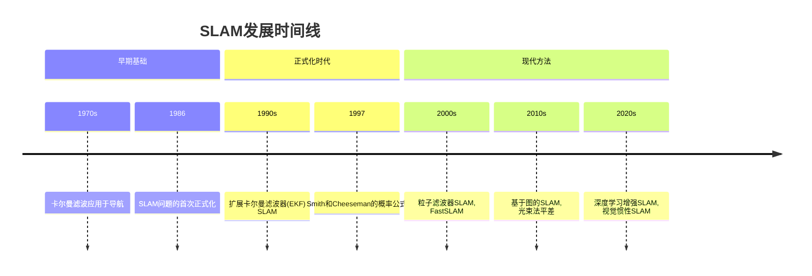
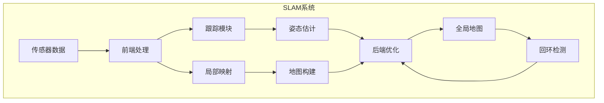
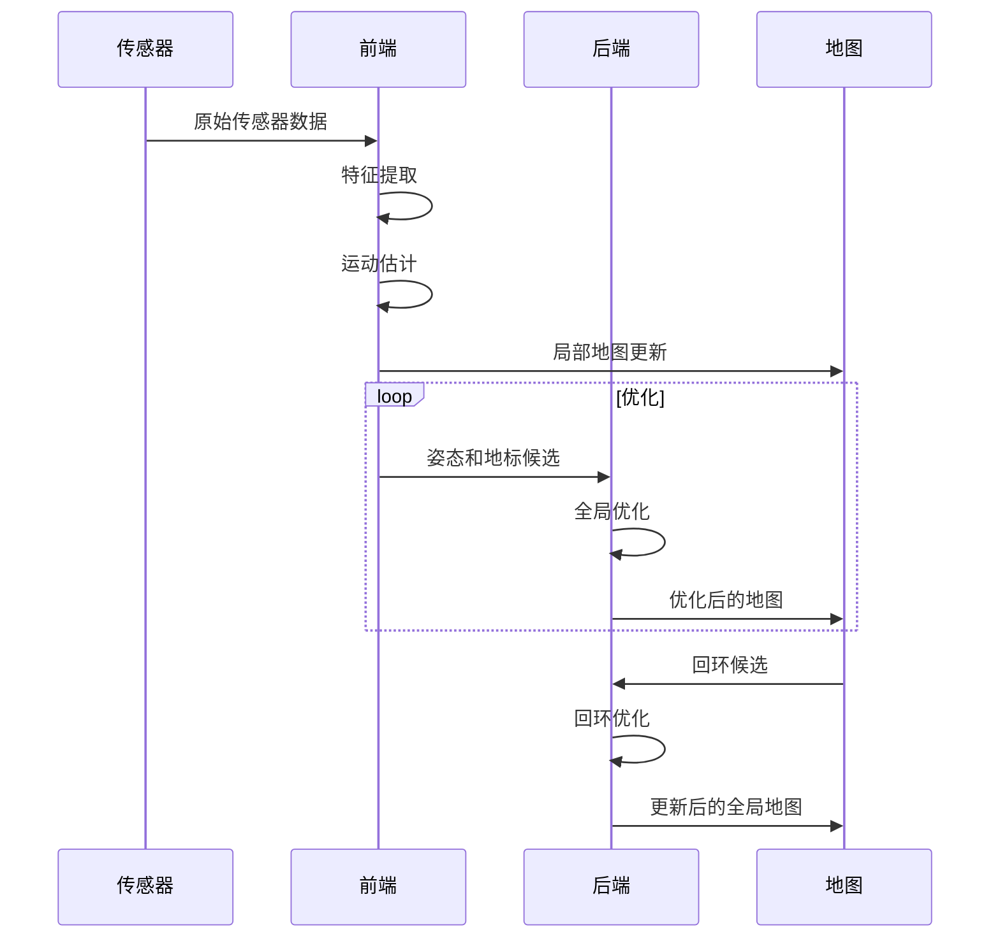

# 同时定位与地图构建（SLAM）演进文档

> **全面记录和介绍SLAM（同时定位与地图构建）系统在计算机视觉和机器人领域中的演进、架构和实现的知识库。**

## 概述

本文档深入介绍了SLAM（同时定位与地图构建）系统的历史、架构和实现方法。SLAM是机器人学和计算机视觉中的一个基本问题，其中配备传感器的设备在未知环境中创建地图的同时跟踪其在该环境中的位置。

### 文档目的

- **历史背景**：追踪SLAM算法的演进和重要里程碑
- **架构理解**：解释SLAM系统的核心概念和设计原则
- **实现参考**：常见方法和技术的综合文档
- **跨领域洞察**：了解SLAM、计算机视觉和机器人之间的关系
- **教育资源**：支持SLAM概念的学习和教学

## 引言与历史背景

### 起源与动机

SLAM于20世纪80年代末和90年代初作为机器人学中的关键挑战出现。基本问题是，要在未知环境中导航，机器人需要一张地图，但要构建地图，机器人需要知道自己的位置。这个鸡和蛋的问题被正式化并被称为SLAM问题。

"SLAM"一词在21世纪初首次在文献中正式引入，尽管基本概念自20世纪70年代以来在导航问题中已有探索。

### 关键里程碑时间线

### 演进阶段

1. **经典SLAM (1990s-2000s)**：主要基于扩展卡尔曼滤波器(EKF)和粒子滤波器
2. **基于特征的SLAM (2000s-2010s)**：强调鲁棒的特征检测和匹配
3. **直接SLAM (2010s-至今)**：密集重建和直接对齐方法
4. **基于学习的SLAM (2010s-至今)**：机器学习技术的集成

## 核心架构

### 基本概念和抽象

#### 状态估计框架

SLAM本质上是一个状态估计问题，目标是同时估计机器人的轨迹和环境的地图。数学上，这可以表示为：

$$P(x_{1:t}, m | z_{1:t}, u_{1:t})$$

其中：
- $x_{1:t}$ 表示随时间变化的机器人姿态
- $m$ 表示地图
- $z_{1:t}$ 表示传感器测量值
- $u_{1:t}$ 表示控制输入

#### 关键组件

1. **传感器融合模块**：整合来自多个传感器的数据（摄像头、LiDAR、IMU等）
2. **特征提取**：检测和描述环境中的地标
3. **运动模型**：根据控制输入预测机器人姿态
4. **观测模型**：将机器人姿态与地标观测相关联
5. **地图表示**：维护环境的估计地图
6. **优化引擎**：解决SLAM估计问题

### 设计原则和模式

#### 回环检测

SLAM中的一个关键挑战是回环检测 - 识别机器人何时返回到之前访问过的位置。这防止了漂移累积并保持全局一致性。

#### 前端和后端架构

现代SLAM系统通常遵循前端/后端架构：

- **前端**：传感器数据的实时处理、跟踪和局部映射
- **后端**：全局优化、回环闭合和地图细化

## 详细API概述

虽然SLAM系统通常不像软件库那样公开传统API，但它们确实有标准化的接口和模块：

### 核心模块

#### 视觉里程计(VO)

视觉里程计估计相机在连续帧之间的运动。常见的方法包括：

- 基于特征的VO（例如，ORB-SLAM）
- 直接VO（例如，LSD-SLAM，DSO）
- 半直接VO（例如，SVO）

#### 映射模块

映射模块维护环境的表示：

- 点云地图
- 网格表示
- 语义地图
- 拓扑地图

#### 优化模块

处理姿态图或光束法平差的优化：

- 图优化（例如，g2o，Ceres求解器）
- 光束法平差
- 姿态图优化

### 著名的SLAM系统

#### 经典方法

- **EKF-SLAM**：使用扩展卡尔曼滤波器的早期方法
- **FastSLAM**：基于粒子滤波器的方法，使用Rao-Blackwellized粒子
- **Rao-Blackwellized粒子滤波器**：结合粒子滤波器和卡尔曼滤波器的混合方法

#### 现代基于特征的SLAM

- **MonoSLAM**：实时单相机SLAM
- **PTAM**：并行跟踪和映射
- **ORB-SLAM**：具有回环闭合和重定位功能的多功能基于特征的SLAM系统
- **LSD-SLAM**：大规模直接单目SLAM

#### 直接SLAM

- **DTAM**：密集跟踪和映射
- **LSD-SLAM**：大规模直接单目SLAM
- **DSO**：直接稀疏里程计
- **SVO**：半直接视觉里程计

#### 视觉惯性SLAM

- **OKVIS**：基于关键帧的开放视觉惯性SLAM
- **VINS-Mono**：鲁棒的视觉惯性状态估计器
- **ROVIO**：鲁棒视觉惯性里程计

### 交互式Mermaid图表

#### SLAM系统架构

#### SLAM流水线流程

## 演进与性能

### 随时间的性能改进

#### 计算效率

- **早期SLAM (1990s)**：仅限于稀疏特征和简单环境
- **2000s**：室内环境实现实时性能
- **2010s**：大规模户外映射成为可能
- **2020s**：实时密集重建和语义理解

#### 准确性改进

- **减少漂移**：先进的回环检测减少了轨迹漂移
- **鲁棒性**：更好地处理挑战性条件（照明、无纹理区域）
- **多传感器融合**：集成IMU、GPS和其他传感器提高了准确性

### 生态系统关系

SLAM系统通常与以下内容集成：

- **机器人操作系统(ROS)**：机器人应用的标准接口
- **计算机视觉库**：OpenCV、PCL（点云库）
- **优化库**：Ceres求解器、g2o、GTSAM
- **深度学习框架**：用于语义理解的神经网络集成

### 构建系统和开发成熟度

现代SLAM系统通常使用：

- **CMake**：跨平台构建系统
- **ROS/Ros2**：机器人集成
- **包管理器**：vcpkg、conan或系统包管理器
- **持续集成**：在多个平台上自动测试

## 结论与未来轨迹

### 在生态系统中的当前意义

SLAM仍然是机器人学、自动驾驶汽车、增强现实和计算机视觉领域的基石技术。其应用范围从消费级AR应用程序到自动驾驶和行星探索。

### 持续发展趋势

1. **语义SLAM**：集成语义理解以获得更丰富的地图表示
2. **基于学习的SLAM**：用于特征提取、对应和优化的神经网络
3. **事件驱动SLAM**：使用事件相机进行高速、低延迟SLAM
4. **协作SLAM**：多个机器人共享映射信息
5. **长期运行**：适应环境随时间变化的SLAM系统

### 未来路线图考虑

- **实时神经渲染**：将SLAM与神经辐射场(NeRF)相结合
- **边缘计算**：资源受限设备的高效SLAM实现
- **可信SLAM**：具有不确定性量化和故障检测的系统
- **通用SLAM**：无需重新配置即可适应多样化环境的系统

---

**继续探索**：了解[计算机图形学](../README.md)中的相关主题，或探索[视觉惯性SLAM](./visual_inertial_slam_evolution_document.md)以获取高级实现。

**快速导航**: [计算机图形学](../README.md) | [SLAM](./slam_evolution_document.md) | [视觉惯性SLAM](./visual_inertial_slam_evolution_document.md)