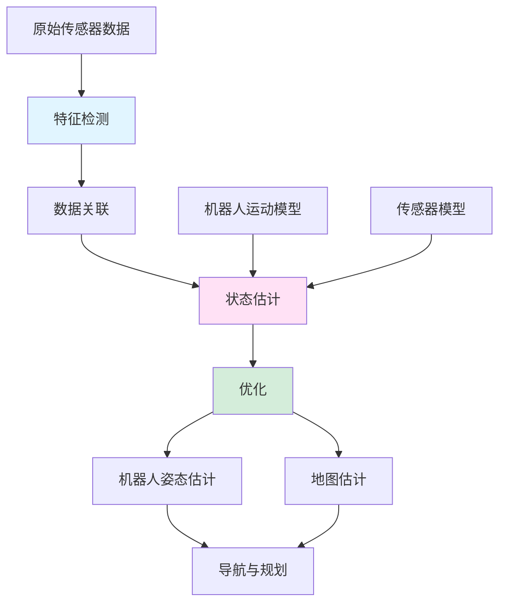

# SLAM 初学者介绍

> 一份温和、初学者友好的 SLAM（同步定位与地图构建）介绍——自主机器人、增强现实/虚拟现实和自动驾驶汽车背后的技术。无需机器人或计算机视觉背景！

---

## 目录

1. [先决条件与基础](#1-先决条件与基础)
2. [从航位推算到SLAM：演变过程](#2-从航位推算到slam演变过程)
3. [为什么需要SLAM？](#3-为什么需要slam)
4. [核心概念](#4-核心概念)
5. [SLAM如何工作](#5-slam如何工作)
6. [SLAM的重要性](#6-slam的重要性)
7. [实践直觉](#7-实践直觉)
8. [术语表](#8-术语表)

---

## 1. 先决条件与基础

在深入SLAM之前，让我们建立一些基础概念。别担心——我们会从头开始解释一切！

### 1.1 什么是坐标系？

> 📖 **术语：坐标系** - 使用数字指定空间中位置的数学框架。就像一张带有编号街道和大道的地图，可以精确定位任何地点。

**坐标系**就像一个通用地址系统，让我们描述事物在空间中的位置。

**示例图：**

```
2D笛卡尔坐标系：

    Y轴
      ↑
  5   │    ● 点A (3, 4)
  4   │   /
  3   │  /
  2   │ /
  1   │/
  0 ──┼──●───→ X轴
    0 1 2 3 4 5

点A位于坐标(3, 4)：
- X轴方向3个单位（水平）
- Y轴方向4个单位（垂直）
```

**为什么在机器人技术中使用坐标系？**

坐标系让机器人能够：
- 知道自己在哪里（定位）
- 知道其他东西在哪里（地图构建）
- 规划如何到达某地（导航）

### 1.2 什么是向量？

> 📖 **术语：向量** - 表示方向和大小的有序数字列表。把它想象成指向某个方向的箭头。

**向量**就像一个带距离的指南针——它告诉你去哪里以及多远。

**示例图：**

```
在2D空间中：
    ↑ 北
  5 |    ● [3, 2] (目的地)
  4 |   /
  3 |  /  向量[3, 2]：向东移动3，向北移动2
  2 | /
  1 |/  
  0 +──●──→ 东
    0 1 2 3 4 5
      [0, 0] (原点)

向量[3, 2] = 从(0,0)到(3,2)的箭头
大小 = √(3² + 2²) = √13 ≈ 3.6单位
方向 = 与X轴约33.7°角
```

**机器人技术中的向量：**
- 机器人运动：[前进，转向]方向
- 传感器测量：[距离，角度]到地标
- 位置：[x, y, z]空间坐标

### 1.3 什么是传感器？

> 📖 **术语：传感器** - 检测和响应环境物理输入的设备。像机器人的"感觉器官"，收集关于世界的信息。

**传感器**就像机器人的眼睛、耳朵或皮肤——它收集关于世界的信息。

**常见机器人传感器：**
- **摄像头**："看"视觉地标和障碍物
- **激光雷达**："感受"使用激光的距离
- **惯性测量单元(IMU)**："感受"运动和方向
- **GPS**："知道"地球上的大致位置

**传感器示例：**

```
带摄像头传感器的机器人：

┌─────────────────────────────────────────┐
│  环境：                                │
│                                         │
│  [树]      [建筑]                      │
│     ●           ●                      │
│                                         │
│        ← 带摄像头的机器人 →            │
│        [O]                             │
│                                         │
│  摄像头看到：                          │
│  - 树在角度45°，距离5米               │
│  - 建筑在角度90°，距离10米            │
└─────────────────────────────────────────┘

传感器数据：{(45°, 5m), (90°, 10m)} ← 检测到的地标！
```

### 1.4 什么是不确定性？

> 📖 **术语：不确定性** - 对某事缺乏完美知识。在机器人技术中，传感器并不完全准确，因此我们必须考虑"最佳猜测"和置信度。

在现实世界中，没有什么是完全精确的。**不确定性**承认我们的测量和预测存在误差。

**示例图：**

```
机器人认为它在这里：●
但实际在这里：        ○

真实位置在估计值附近，
但我们不100%确定在哪里！

概率分布：
     ↑ 置信度
     │     ***
     │   *******
     │  *********
     │ ***   ***
     │*         *
     └─────────────→ 位置
        ●=估计    ○=真实
```

**在机器人技术中：**
- 传感器读数有噪声("地标大约5m远，±0.1m")
- 机器人运动不完美("我试图向前移动1m，但可能0.95m")
- 我们跟踪估计的置信度

---

## 2. 从航位推算到SLAM：演变过程

在理解SLAM之前，我们需要了解旧的导航方法以及它们为什么不够用。

### 2.1 什么是航位推算？

> 📖 **术语：航位推算** - 仅基于先前位置、速度和行驶方向来估算当前位置的导航。就像闭着眼睛尝试走直线。

**航位推算**是最简单的导航方法：只需跟踪你认为去了哪里。

**航位推算如何工作：**

```
起始位置：(0, 0)

步骤1：向前移动1米
→ 新估计：(0, 1)  [假设我们向北移动]

步骤2：右转90度，移动0.5米  
→ 新估计：(0.5, 1) [向东移动]

步骤3：左转45度，移动0.8米
→ 新估计：(1.1, 1.6) [向东北移动]

当前估计：(1.1, 1.6)
```

### 2.2 航位推算的问题

**误差累积：**

```
航位推算误差问题：

时间：0秒 → 机器人在(0, 0) [确切已知]
       ↓
时间：1秒 → 移动1m (实际0.98m) → (0, 0.98) [误差：0.02m]
       ↓
时间：2秒 → 移动1m (实际1.02m) → (0, 1.00) [误差：0.02m]
       ↓
时间：3秒 → 移动1m (实际0.97m) → (0, 0.97) [误差：0.03m]
       ↓
时间：100秒 → 小误差累积 → (0, 85.3) [大误差：14.7m！]

误差随时间增长！→ 机器人迷路！
```

### 2.3 基于地图的解决方案

**使用已知地图：**

```
解决方案：使用预制作的地图！

已知地图：
┌─────────────────────────────────────────┐
│  [树]                      [建筑]      │
│     ●                           ●       │
│                                         │
│                                         │
│              [机器人]                   │
│                 [O]                     │
│                                         │
└─────────────────────────────────────────┘

机器人可以：
1. 环顾四周并识别地标
2. 与已知地图比较
3. 纠正其位置估计

问题解决了吗？还不完全是...
```

### 2.4 SLAM的突破

> 📖 **术语：SLAM(同步定位与地图构建)** - 在未知环境中构建地图的同时使用该地图进行导航的能力。就像探索新城市时绘制地图并在其中找到路线。

**SLAM的见解：**

```
传统方法：
地图存在 → 机器人在已知地图中定位自身
     或
机器人探索 → 某人稍后制作地图

SLAM方法：
机器人探索 → 同时构建地图和定位！
     ← 革命性的！ →
```

**SLAM vs 传统导航：**

| 方法 | 需要什么 | 产生什么 | 局限性 |
|------|----------|----------|--------|
| 航位推算 | 起始位置 | 机器人路径估计 | 误差快速累积 |
| 基于地图 | 预制地图 | 机器人位置 | 需要预先有地图 |
| **SLAM** | 没有特殊要求 | **地图和位置** | **在未知环境中工作！** |

---

## 3. 为什么需要SLAM？

现在我们了解了基础，让我们探讨为什么需要SLAM以及它解决了什么问题。

### 3.1 问题：未知环境

许多现实场景需要在没有地图的地方导航：

**示例1：火星探索**

```
火星漫游车挑战：

环境：完全未知的星球
无GPS，无预建地图
必须自主探索和导航

┌─────────────────────────────────────────┐
│  火星表面(未知)                         │
│                                         │
│  ▲ 岩石构造                            │
│  ● 奇特矿物                            │
│  ■ 潜在危险                            │
│                                         │
│              [漫游车]                   │
│              [O]                        │
│                                         │
│  解决方案：SLAM！边探索边构建地图！      │
└─────────────────────────────────────────┘
```

**示例2：室内导航**

```
仓库机器人：

环境：大型室内设施
布局频繁变化
每日新障碍
室内无GPS

┌─────────────────────────────────────────┐
│  仓库(动态)                            │
│                                         │
│  [货架] [货架] [货架]                 │
│    ▓▓▓     ▓▓▓     ▓▓▓                  │
│                                         │
│              [机器人]                   │
│              [O]                        │
│                                         │
│  [移动] [托盘] [站点]                │
│   ▒▒▒▒     █████     ▒▒▒                │
│                                         │
│  解决方案：SLAM！适应变化并动态导航！    │
└─────────────────────────────────────────┘
```

### 3.2 传统方法为何失败

**GPS问题：**
- 室内不起作用
- 城市峡谷中不准确
- 隧道中嘈杂
- 在其他行星上不存在

**预建地图问题：**
- 新地方不存在
- 快速过时
- 不显示临时障碍
- 需要昂贵的调查

**航位推算问题：**
- 误差迅速累积
- 机器人很快迷路
- 无法纠正漂移

### 3.3 SLAM的解决方案

**自给自足的导航：**

```
SLAM过程：

未知环境：
┌─────────────────────────────────────────┐
│  ???  ???  ???  ???  ???               │
│  ???  ???  [O]  ???  ???  ← 机器人    │
│  ???  ???  ???  ???  ???               │
│  ???  ???  ???  ???  ???               │
└─────────────────────────────────────────┘

步骤1：感知周围环境
┌─────────────────────────────────────────┐
│  树   ???  ???  ???  建筑              │
│  ●     ???  [O]  ???  ●                │
│  ???  ???  ???  ???  ???               │
│  ???  ???  ???  ???  ???               │
└─────────────────────────────────────────┘

步骤2：更新地图和位置
┌─────────────────────────────────────────┐
│  树   ???  ???  ???  建筑              │
│  ●     ???  [O]  ???  ●                │
│  ???  ???  ???  ???  ???               │
│  ???  ???  ???  ???  ???               │
└─────────────────────────────────────────┘

步骤3：移动，重复
┌─────────────────────────────────────────┐
│  树   路径  ???  ???  建筑             │
│  ●  →  [O]   ???  ???  ●               │
│  ???  ???  ???  ???  ???               │
│  ???  ???  ???  ???  ???               │
└─────────────────────────────────────────┘

结果：地图和位置都已知！
```

---

## 4. 核心概念

现在让我们了解使SLAM工作的关键概念。

### 4.1 SLAM问题陈述

> 📖 **术语：SLAM问题** - 给定随时间的传感器测量，同时估计机器人轨迹和环境地图。

**数学表述：**

```
SLAM想要找到：
- 机器人姿态：x₀, x₁, x₂, ..., xₜ (随时间的位置)
- 地标位置：m₁, m₂, ..., mₙ (地图特征)

给定：传感器测量z₁, z₂, ..., zₜ

目标：最大化P(x₀:t, m₁:n | z₁:t, u₁:t)
      (找到给定观测值最可能的机器人路径和地图)
```

### 4.2 地标：SLAM的关键

> 📖 **术语：地标** - 环境中可重复识别的显著特征。像帮助机器人知道位置的"路标"。

**地标概念：**

```
地标就像参考点：

有地标的环境：
┌─────────────────────────────────────────┐
│  [树]                      [建筑]      │
│     ●                           ●       │
│                                         │
│                                         │
│              [机器人]                   │
│                 [O]                     │
│                                         │
│  [岩石]                      [路灯]     │
│     ●                           ●       │
└─────────────────────────────────────────┘

机器人看到：{(树, 角度=45°, 距离=5m), (建筑, 角度=90°, 距离=10m)}

如果机器人移动并再次看到相同的树：
- 相同地标！→ 机器人知道相对位置
- 可以优化地图和位置
```

**好的地标具有：**
- **独特性**：易于识别
- **稳定性**：不移动
- **可观测性**：传感器可检测
- **可追踪性**：跨时间可识别

### 4.3 回环闭合概念

> 📖 **术语：回环闭合** - 当机器人识别出它回到了以前访问过的位置时，允许纠正累积误差。

**回环闭合示例：**

```
机器人轨迹与回环闭合：

时间1：[A] → [B] → [C] → [D] → [E]
        (误差累积)

时间2：[E] → ... → [B] ← 哦！我来过这里！
        │                  ↑
        └──────────────────┘
           回环闭合！→ 可以纠正所有中间位置
           (A, C, D, E现在可以根据已知的B调整)

回环闭合前：位置因累积误差而漂移
回环闭合后：所有位置修正为一致
```

### 4.4 传感器融合

> 📖 **术语：传感器融合** - 结合多个传感器的信息以获得比任何单个传感器更好的估计。

**传感器融合类比：**

```
图书馆类比：

单一传感器 = 单本书
→ 视角有限

多个传感器 = 关于同一主题的多本书
→ 更完整的理解

带多个传感器的机器人：

摄像头："我看到30°角处有一扇红门"
激光雷达："我在距离2.5m处检测到障碍物"
IMU："我顺时针旋转了5°"
里程计："我向前移动了1m"

融合："前方右侧约2.5m处有一扇红门！"
```

### 4.5 不确定性表示

> 📖 **术语：协方差** - 同时表示多个维度不确定性的数学方法，显示个体不确定性和变量间相关性。

**不确定性可视化：**

```
2D位置不确定性：

机器人认为它在(3, 4)，但有不确定性：

     ↑ Y
   5 │      ● 平均位置(3, 4)
   4 │     ╭─────────────────╮
   3 │     │   机器人可能    │ ← 95%置信椭圆
   2 │     │   在这里任何地方 │
   1 │     │                 │
   0 └─────●─────────────────●→ X
     0     3                 6

协方差矩阵：
[σₓ²    σₓᵧ ]
[σᵧₓ    σᵧ² ]

显示：X方向的不确定性，Y方向的不确定性，X和Y不确定性如何关联
```

---

## 5. SLAM如何工作

现在让我们把所有内容放在一起，看看SLAM如何处理信息。

### 5.1 SLAM流水线：逐步说明

```
SLAM算法流程：

┌─────────────────────────────────────────────────────────────┐
│                    SLAM流水线                              │
├─────────────────────────────────────────────────────────────┤
│                                                            │
│  输入：原始传感器数据(摄像头图像、激光雷达扫描等)           │
│     │                                                       │
│     ▼                                                       │
│  ┌─────────────────────────────────────┐                   │
│  │  前端：特征提取                   │                   │
│  │  - 从传感器提取地标              │                   │
│  │  - 与现有地标匹配                │                   │
│  │  - 检测回环闭合                  │                   │
│  └─────────────────────────────────────┘                   │
│     │                                                       │
│     ▼                                                       │
│  ┌─────────────────────────────────────┐                   │
│  │  后端：状态估计                   │                   │
│  │  - 优化机器人轨迹                │                   │
│  │  - 优化地标位置                  │                   │
│  │  - 最小化不确定性                │                   │
│  └─────────────────────────────────────┘                   │
│     │                                                       │
│     ▼                                                       │
│  输出：机器人姿态+地图(SLAM解)                              │
│                                                            │
└─────────────────────────────────────────────────────────────┘
```

### 5.2 前端：特征处理

前端从传感器数据中提取和匹配特征。

```
特征处理步骤：

步骤1：特征检测
┌─────────────────────────────────────────────────┐
│  输入：摄像头图像                            │
│                                                │
│  ████████████████████████████████████████      │
│  ███▓▓▓▓▓▓▓▓▓▓▓▓▓▓▓▓▓▓▓▓▓▓▓▓▓▓▓▓▓▓▓▓███      │
│  ███▓▓▓ 树   ▓▓▓▓▓▓▓▓▓▓▓▓▓▓▓▓▓▓▓▓▓▓▓███      │
│  ███▓▓▓▓▓▓▓▓▓▓▓▓▓▓▓▓▓▓▓▓▓▓▓▓▓▓▓▓▓▓▓▓███      │
│  ███▓▓▓▓▓▓▓▓▓▓▓▓▓▓▓▓▓▓▓▓▓▓▓▓▓▓▓▓▓▓▓▓███      │
│  ███▓▓▓▓▓▓▓▓▓▓▓▓▓▓▓▓▓▓▓▓▓▓▓▓▓▓▓▓▓▓▓▓███      │
│  ███▓▓▓▓▓▓▓▓▓▓▓▓▓▓▓▓▓▓▓▓▓▓▓▓▓▓▓▓▓▓▓▓███      │
│  ████████████████████████████████████████      │
│                                                │
│  检测到的特征：[树角，门边缘，            │
│               窗户中心]                  │
└─────────────────────────────────────────────────┘

步骤2：特征匹配
┌─────────────────────────────────────────────────┐
│  当前特征：[树角，门边缘]                │
│  以前特征：[树角*，窗户]                 │
│                                               │
│  匹配：树角 ↔ 树角* (相同！)             │
│  新的：门边缘(第一次看到)                 │
│  未匹配：窗户(移出视野)                  │
└─────────────────────────────────────────────────┘

步骤3：数据关联
┌─────────────────────────────────────────────────┐
│  "这是我在之前看到的同一棵树吗？"            │
│  是 → 更新地标位置估计                      │
│  否 → 创建新地标                           │
│  不清楚 → 使用概率匹配                      │
└─────────────────────────────────────────────────┘
```

### 5.3 后端：优化

后端优化完整解。

```
优化过程：

初始估计：
┌─────────────────────────────────────────────────┐
│  机器人路径：[A]─[B]─[C]─[D]─[E]         │
│  地标：{树@5m，建筑@10m}                   │
│  不确定性：高(许多近似值)                   │
└─────────────────────────────────────────────────┘

来自测量的约束：
┌─────────────────────────────────────────────────┐
│  在A：看到树在方位角45°                   │
│  在B：看到树在方位角30°                   │
│  在C：看到建筑在方位角90°                 │
│  在D：返回到A位置附近                     │
│  在E：再次看到树，确认回环                 │
└─────────────────────────────────────────────────┘

优化：
┌─────────────────────────────────────────────────┐
│  找到最佳满足以下条件的路径和地图：           │
│  1. 运动学约束(机器人运动)                 │
│  2. 测量约束(传感器数据)                   │
│  3. 回环闭合约束(一致性)                   │
│                                               │
│  结果：优化的路径+地图，减少不确定性！        │
└─────────────────────────────────────────────────┘
```

### 5.4 常见SLAM方法

**EKF SLAM(扩展卡尔曼滤波SLAM)：**
- 将状态表示为均值和协方差
- 适用于小环境
- 计算效率高

**图SLAM：**
- 表示为优化图
- 适用于大环境
- 很好处理回环闭合

**粒子滤波SLAM：**
- 使用多个假设
- 适用于模糊情况
- 处理多峰分布

### 5.5 可视化架构图



---

## 6. SLAM的重要性

SLAM已经彻底改变了机器人技术和空间计算。让我们看看为什么它如此重要。

### 6.1 现实应用

```
┌─────────────────────────────────────────────────────────────┐
│                    SLAM应用                                │
├─────────────────────────────────────────────────────────────┤
│                                                            │
│  🤖 自动驾驶车辆                                           │
│     "在没有GPS的情况下导航城市街道"                         │
│     → 自动驾驶汽车，配送机器人                             │
│                                                            │
│  📱 增强现实(AR)                                          │
│     "在现实世界上叠加数字内容"                             │
│     → 宝可梦GO，Snapchat滤镜，AR导航                       │
│                                                            │
│  🏠 家用机器人                                             │
│     "高效清洁房屋"                                         │
│     → 扫地机器人，拖地机器人                               │
│                                                            │
│  🏭 工业自动化                                             │
│     "在仓库中运输货物"                                     │
│     → 亚马逊配送中心，工厂物流                             │
│                                                            │
│  🌍 行星探索                                               │
│     "自主探索火星"                                         │
│     → 火星漫游车，月球任务                                 │
│                                                            │
│  👁️ 虚拟现实(VR)                                         │
│     "跟踪用户在房间中的移动"                               │
│     → VR头显，沉浸式体验                                   │
│                                                            │
│  🏥 医疗机器人                                             │
│     "在体内导航进行手术"                                   │
│     → 手术机器人，内窥镜                                   │
│                                                            │
│  🚁 无人机                                                 │
│     "在GPS受限区域自主飞行"                                │
│     → 室内检查，搜救                                         │
│                                                            │
│  🏗️ 建筑与测绘                                           │
│     "绘制建筑工地地图"                                     │
│     → 现场监控，进度跟踪                                   │
│                                                            │
└─────────────────────────────────────────────────────────────┘
```

### 6.2 SLAM家族树

```
SLAM演变：

1986年："移动机器人同步定位与地图构建问题"
         │
         └─► 早期SLAM(基于卡尔曼滤波器)
              │
              ├─► 1990年代：EKF SLAM
              │        "扩展卡尔曼滤波SLAM"
              │        用于：小规模地图构建
              │
              ├─► 2000年代：粒子滤波SLAM
              │        "蒙特卡洛定位"
              │        用于：模糊环境
              │
              ├─► 2000年代：FastSLAM
              │        "使用粒子滤波的快速SLAM"
              │        效率突破
              │
              ├─► 2010年代：图SLAM
              │        "姿态图优化"
              │        更好的回环闭合处理
              │
              ├─► 2010年代：视觉SLAM(VO/VIO)
              │        "视觉里程计/惯性"
              │        使用摄像头作为主要传感器
              │
              ├─» 2010年代至今：激光雷达SLAM
              │        "光探测和测距SLAM"
              │        使用激光的精确地图构建
              │
              └─► 2020年代+：神经SLAM
                        "基于学习的SLAM"
                        AI增强的感知和地图构建
```

### 6.3 关键创新总结

| 创新 | 重要性 |
|------|--------|
| **同步操作** | 同时解决定位和地图构建 |
| **不确定性处理** | 考虑传感器和运动噪声 |
| **回环闭合** | 纠正累积漂移误差 |
| **数据关联** | 可靠地将观测值与地标匹配 |
| **多传感器融合** | 组合不同传感器类型 |
| **实时能力** | 机器人移动时在线操作 |

---

## 7. 实践直觉

让我们手动模拟SLAM的简单示例。这将真正帮助您理解它是如何工作的！

### 7.1 设置：简单示例

```
场景：机器人在1D走廊中移动

环境：1D走廊，地标在已知位置
- 地标A：位置5.0m
- 地标B：位置10.0m  
- 地标C：位置15.0m

机器人从位置0.0m开始，每步向前移动+1m。

为简单起见，让我们跟踪：
- 机器人位置(x)
- 地标位置(mA, mB, mC)
- 都带有简单的不确定性值
```

### 7.2 逐步SLAM模拟

**步骤1：初始化**

```
初始状态：
机器人在：x₀ = 0.0m ± 0.1m (非常确信起始位置)
地标：未知位置

状态向量：[x₀, mA, mB, mC] = [0.0, ?, ?, ?]
```

**步骤2：第一次移动**

```
动作：向前移动1.0m(里程计说)
实际：向前移动1.0m ± 0.05m(运动不确定性)

新估计：
x₁ = x₀ + 1.0 = 0.0 + 1.0 = 1.0m
不确定性增加：±0.15m (累积)

状态：[1.0, ?, ?, ?] ± [0.15, ?, ?, ?]
```

**步骤3：第一次观测**

```
传感器观测："在距离4.1m处看到地标A"

如果地标A在位置mA，机器人在x₁，
那么：距离 = |mA - x₁| = |mA - 1.0| = 4.1m

所以：mA = 1.0 + 4.1 = 5.1m (假设地标在前面)

更新对地标A的信念：
mA = 5.1m ± 0.2m (传感器不确定性)

状态：[1.0, 5.1, ?, ?] ± [0.15, 0.2, ?, ?]
```

**步骤4：继续移动和观测**

```
移动到x₂ = 2.0m ± 0.2m (更多不确定性累积)

再次观测地标A："距离3.2m"
预测：|5.1 - 2.0| = 3.1m
测量：3.2m
小差异 → 确认地标位置！

细化估计：mA可能在5.1m(与两次观测一致)

状态：[2.0, 5.1, ?, ?] ± [0.2, 0.15, ?, ?] (置信度增加)
```

**步骤5：发现新地标**

```
在x₃ = 3.0m ± 0.25m，观测："距离7.1m处的地标"

检查已知地标：
- 到A(在5.1)的距离：|5.1 - 3.0| = 2.1m ≠ 7.1m
- 这是一个新地标！

估计新地标B位置：
mB = 3.0 + 7.1 = 10.1m ± 0.2m

状态：[3.0, 5.1, 10.1, ?] ± [0.25, 0.15, 0.2, ?]
```

**步骤6：回环闭合机会**

```
机器人到达x₈ = 8.0m ± 0.4m

观测地标A："距离2.9m"
预测：|5.1 - 8.0| = 2.9m
测量：2.9m
完美匹配！→ 检测到回环闭合！

这意味着我们从x₀到x₈的路径与我们的地标地图一致
→ 增加整个路径的信心！
```

### 7.3 可视化总结

```
SLAM学习过程：

时间0：[O]─────A─────B─────C    (机器人一无所知)
       (0.0m)  (?.?m)  (?.?m) (?.?m)

时间1：[O]─────A─────B─────C    (移动，不确定)
       (1.0m±) (?.?m)  (?.?m) (?.?m)

时间2：[O]─────A─────B─────C    (看到A，估计位置)
       (2.0m±) (5.1m±) (?.?m) (?.?m)

时间3：[O]─────A─────B─────C    (看到新地标B)
       (3.0m±) (5.1m+) (10.1m±) (?.?m)

时间8：[O]─────A─────B─────C    (回环闭合，全部优化)
       (8.0m+) (5.0m*) (10.0m*) (?.?m)

图例： 
- 数字 = 估计位置
- ± = 低置信度
- + = 中等置信度  
- * = 高置信度
```

---

## 8. 术语表

本文档中引入的所有术语的完整参考。

| 术语 | 定义 |
|------|------|
| **坐标系** | 使用数字指定空间中位置的数学框架。像带有编号街道的地图。 |
| **协方差** | 多维度不确定性的数学表示，显示个体不确定性和相关性。 |
| **数据关联** | 确定当前传感器测量是否对应于先前观测到的地标的进程。 |
| **航位推算** | 仅基于先前位置、速度和行驶方向来估算当前位置的导航。 |
| **特征** | 传感器数据中可检测和跟踪的显著点、线或区域。 |
| **前端** | SLAM中处理原始传感器数据以提取特征并建立对应关系的部分。 |
| **图SLAM** | 将问题公式化为图优化的SLAM方法，姿态和地标作为节点。 |
| **地标** | 环境中可重复识别以辅助定位的显著特征。 |
| **回环闭合** | 识别机器人回到先前访问过的位置，允许纠正累积误差。 |
| **传感器** | 检测和响应环境物理输入的设备，像机器人的"感觉器官"。 |
| **传感器融合** | 结合多个传感器的信息以获得比任何单个传感器更好的估计。 |
| **SLAM** | 同步定位与地图构建——在使用地图的同时构建地图。 |
| **SLAM问题** | 从传感器数据同时估计机器人轨迹和环境地图的数学挑战。 |
| **不确定性** | 对某事缺乏完美知识；在机器人技术中，承认测量和预测有误差。 |
| **后端** | 执行状态估计和优化的SLAM部分，使用前端测量。 |
| **EKF SLAM** | 扩展卡尔曼滤波SLAM，将状态表示为均值和协方差矩阵。 |
| **视觉SLAM** | 主要使用摄像头传感器进行定位和地图构建的SLAM。 |
| **激光雷达SLAM** | 使用光探测和测距传感器进行精确距离测量的SLAM。 |
| **粒子滤波SLAM** | 使用多个假设表示状态估计不确定性的SLAM。 |

---

## 结论

恭喜！您已经学习了SLAM(同步定位与地图构建)的基础知识：

**您现在理解的内容：**
- ✓ 先决条件：坐标系、向量、传感器、不确定性
- ✓ 从航位推算到SLAM的演变
- ✓ 为什么发明SLAM(解决的问题)
- ✓ 核心概念：地标、回环闭合、传感器融合、不确定性
- ✓ SLAM如何工作(前端、后端、优化)
- ✓ 为什么重要(现实应用)
- ✓ 实践直觉(手动模拟SLAM！)

**下一步：**
1. **实验** SLAM模拟器(如Gazebo与ROS)
2. **尝试** 开源SLAM实现(ORB-SLAM, RTAB-MAP)
3. **学习** 特定SLAM算法的深度知识
4. **探索** 在机器人、AR/VR或自动驾驶领域的应用

SLAM不仅仅是一种算法——它是使机器人能够在未知环境中理解和导航的基础。理解它让您洞察自主系统如何实现空间感知。

**继续学习！** 🚀

---

> **文档信息**
>
> - **创建时间：** 2026
> - **目标受众：** 完全初学者(无需机器人/视觉背景)
> - **先决条件：** 基本几何和代数掌握
> - **预计阅读时间：** 45-60分钟
>
> 有关标准技术参考，请参阅 `slam_evolution_document.md`