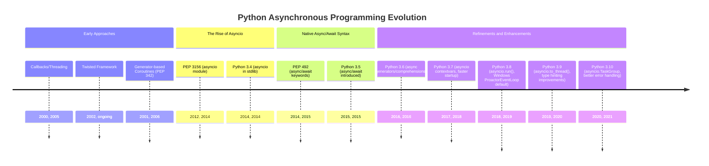
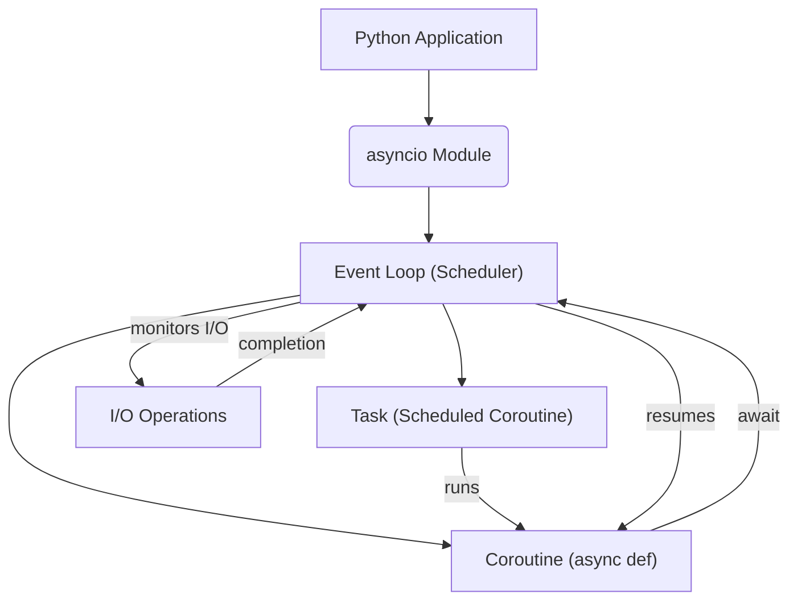
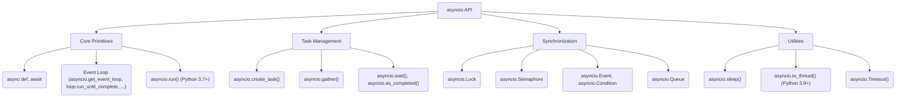
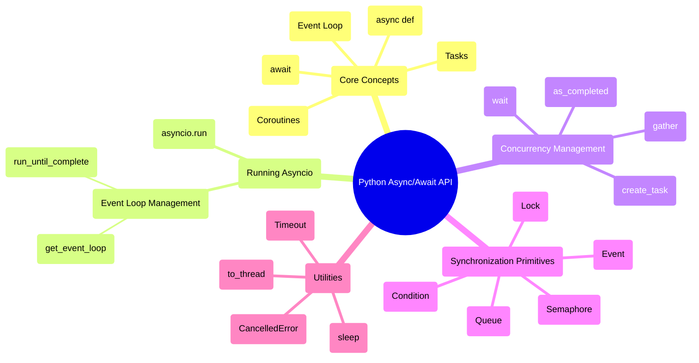

## Async/Await Evolution Document

### 1. Introduction and Historical Context

Asynchronous programming has become increasingly vital in modern Python applications, especially for I/O-bound and high-concurrency tasks. The `async/await` syntax, introduced in Python 3.5, provides a native, more readable, and maintainable way to write concurrent code compared to earlier approaches like callbacks or explicit generator-based coroutines. It allows developers to write asynchronous code that *looks* and *feels* like synchronous code, significantly improving developer experience and reducing the complexity often associated with concurrency.

The need for efficient handling of concurrent operations, particularly network requests, file I/O, and database interactions, led to the evolution of asynchronous programming paradigms in Python. Before `async/await`, developers relied on various techniques, each with its own set of challenges.

### 1.1. Asynchronous Programming Evolution Timeline in Python



### 2. Core Architecture

The `async/await` pattern in Python is built upon a few fundamental concepts: the event loop, coroutines, and tasks. These components work together to enable cooperative multitasking, where functions voluntarily yield control, allowing other functions to run without the overhead of traditional threads or processes.

#### 2.1. Event Loop

**Mental Model / Analogy:**
Imagine a single, highly efficient chef in a restaurant kitchen. This chef (the event loop) doesn't wait for one dish to completely finish cooking before starting another. Instead, they prepare a dish until it needs to simmer or bake (an I/O operation). While that dish is "waiting," the chef immediately switches to another dish, preparing it until it also needs to wait. They constantly check on all waiting dishes, and as soon as one is ready for the next step, they resume working on it. The event loop is this chef, managing many "dishes" (coroutines/tasks) concurrently on a single thread.

The event loop is the heart of `asyncio`. It is responsible for:
*   **Scheduling:** Deciding which task to run next.
*   **Executing:** Running coroutines until they `await` an I/O operation or another coroutine.
*   **Monitoring:** Keeping track of I/O events (e.g., network data arriving, files being ready to read/write).
*   **Dispatching:** Resuming coroutines when their awaited operations complete.

Python's `asyncio` module provides the standard implementation of the event loop.

#### 2.2. Coroutines

Coroutines are special functions defined with `async def`. When called, they don't execute immediately but return a *coroutine object*. This object represents a potential computation that can be run by an event loop. Coroutines can `await` other awaitable objects (like other coroutines, tasks, or futures), which is the point where they yield control back to the event loop.

**Key Characteristics:**
*   **`async def`:** Defines a coroutine function.
*   **`await`:** Pauses the execution of the current coroutine until the awaited object completes, allowing the event loop to run other tasks.
*   **Cooperative Multitasking:** Coroutines explicitly yield control, making them efficient as there's no context switching overhead like with threads.

#### 2.3. Tasks

In `asyncio`, a task is a wrapper around a coroutine that schedules its execution on the event loop. When you want to run a coroutine concurrently, you typically wrap it in a `Task`. Tasks are a subclass of `Future` and allow you to monitor the state of a running coroutine, get its result, or handle exceptions.

**Mental Model / Analogy:**
If a coroutine is a recipe, a task is the order slip for that recipe given to the chef (event loop). The chef uses the order slip to know which recipe to work on and to track its progress.

**Mermaid Diagram: Asyncio Core Architecture**



### 3. Detailed API Overview

The `async/await` API is primarily centered around the `asyncio` module, which provides the infrastructure for writing concurrent code. The evolution has focused on making the API more user-friendly, robust, and performant, with significant additions in each Python release since 3.5.

#### 3.1. Defining and Running Coroutines

##### 3.1.1. Defining Coroutine Functions

**`async def function_name(...):`**

**Goal:** Declare a function as a coroutine, making it an awaitable object.

**Code:**
```python
import asyncio

async def my_coroutine():
    print("Starting my_coroutine")
    await asyncio.sleep(1) # Simulate an I/O bound operation
    print("Finished my_coroutine")

# Calling it directly returns a coroutine object, doesn't run it
coro_obj = my_coroutine()
print(f"Type of coro_obj: {type(coro_obj)}")
```

**Expected Output:**
```
Type of coro_obj: <class 'coroutine'>
```

**Explanation:** `async def` is the fundamental syntax for defining coroutines. When `my_coroutine()` is called, it doesn't execute its body immediately; instead, it returns a coroutine object. This object must then be scheduled on an event loop to run.

*   **Context:** The primary keyword to define an asynchronous function. Functions defined with `async def` are coroutines and must be `await`ed or scheduled as tasks.
*   **Parameters:** Standard function parameters.
*   **Returns:** A coroutine object.

##### 3.1.2. Running the Event Loop

**`asyncio.run(coro, *, debug=False)` (Python 3.7+)**

**Goal:** Run a coroutine until it completes, managing the event loop automatically.

**Code:**
```python
import asyncio

async def main():
    print("Hello")
    await asyncio.sleep(0.1)
    print("World")

if __name__ == "__main__":
    asyncio.run(main())
```

**Expected Output:**
```
Hello
World
```

**Explanation:** `asyncio.run()` is the simplest way to run the top-level entry point of an `asyncio` application. It handles the creation, management, and closing of the event loop, making it ideal for scripts and simple applications. It was introduced in Python 3.7 to simplify `asyncio` usage.

*   **Context:** The high-level entry point for running `asyncio` event loops. It runs the passed coroutine, taking care of managing the event loop, finalizing asynchronous generators, and closing the loop.
*   **Parameters:**
    *   `coro`: A coroutine object to run.
    *   `debug`: (Optional) If `True`, the event loop will run in debug mode.
*   **Returns:** The result of the coroutine.

#### 3.2. Awaiting and Concurrency

##### 3.2.1. Pausing for Awaitables

**`await awaitable`**

**Goal:** Pause the execution of the current coroutine until the `awaitable` (another coroutine, task, or future) completes, yielding control to the event loop.

**Code:**
```python
import asyncio

async def greet(name, delay):
    await asyncio.sleep(delay)
    print(f"Hello, {name} after {delay} seconds")

async def main_await():
    print("Starting main_await")
    await greet("Alice", 2) # This will block main_await for 2 seconds
    await greet("Bob", 1)  # This will block main_await for 1 second after Alice finishes
    print("Finished main_await")

if __name__ == "__main__":
    asyncio.run(main_await())
```

**Expected Output:**
```
Starting main_await
Hello, Alice after 2 seconds
Hello, Bob after 1 seconds
Finished main_await
```

**Explanation:** The `await` keyword is used inside `async def` functions to pause execution and wait for an asynchronous operation to complete. During this pause, the event loop can switch to other tasks. In `main_await`, `greet("Alice", 2)` completes fully before `greet("Bob", 1)` starts.

*   **Context:** Used within an `async def` function to pause its execution until an awaitable object (like a coroutine, task, or future) is resolved. This is the mechanism for cooperative multitasking.
*   **Parameters:** An awaitable object.
*   **Returns:** The result of the awaited object.

##### 3.2.2. Running Tasks Concurrently

**`asyncio.create_task(coro, *, name=None)` (Python 3.7+)**

**Goal:** Schedule a coroutine to run as an `asyncio.Task` on the event loop, allowing it to run concurrently with other tasks.

**Code:**
```python
import asyncio

async def greet_concurrent(name, delay):
    await asyncio.sleep(delay)
    print(f"Hello, {name} after {delay} seconds")

async def main_concurrent():
    print("Starting main_concurrent")
    task1 = asyncio.create_task(greet_concurrent("Alice", 2))
    task2 = asyncio.create_task(greet_concurrent("Bob", 1))

    # Await the tasks to ensure they complete
    await task1
    await task2
    print("Finished main_concurrent")

if __name__ == "__main__":
    asyncio.run(main_concurrent())
```

**Expected Output (order of "Hello" lines may vary slightly due to concurrency):**
```
Starting main_concurrent
Hello, Bob after 1 seconds
Hello, Alice after 2 seconds
Finished main_concurrent
```

**Explanation:** `asyncio.create_task()` takes a coroutine and schedules it to run on the event loop. It returns a `Task` object immediately, allowing the calling coroutine to continue without waiting. The `await task1` and `await task2` lines then wait for these tasks to actually finish. Notice how "Bob" finishes before "Alice" even though "Alice" was created first, demonstrating concurrency.

*   **Context:** Creates a `Task` from a coroutine and schedules its execution on the event loop. This is the primary way to run coroutines concurrently.
*   **Parameters:**
    *   `coro`: The coroutine object to be wrapped in a Task.
    *   `name`: (Optional) A name for the task, useful for debugging.
*   **Returns:** An `asyncio.Task` object.

##### 3.2.3. Waiting for Multiple Tasks

**`asyncio.gather(*aws, return_exceptions=False)`**

**Goal:** Run multiple awaitable objects concurrently and wait for all of them to complete.

**Code:**
```python
import asyncio

async def worker(name, delay):
    await asyncio.sleep(delay)
    return f"{name} finished after {delay}s"

async def main_gather():
    print("Starting main_gather")
    results = await asyncio.gather(
        worker("Worker A", 3),
        worker("Worker B", 1),
        worker("Worker C", 2)
    )
    print("All workers finished.")
    for res in results:
        print(res)

if __name__ == "__main__":
    asyncio.run(main_gather())
```

**Expected Output (order of "finished" lines may vary, but results list order is preserved):**
```
Starting main_gather
All workers finished.
Worker A finished after 3s
Worker B finished after 1s
Worker C finished after 2s
```

**Explanation:** `asyncio.gather()` is a powerful way to run multiple coroutines or tasks in parallel and collect their results. It waits until all provided awaitables are done. The order of results in the returned list corresponds to the order of awaitables passed to `gather`.

*   **Context:** Runs multiple awaitable objects concurrently. It waits for all of them to complete and returns a list of their results in the order they were passed.
*   **Parameters:**
    *   `*aws`: One or more awaitable objects (coroutines, tasks, futures).
    *   `return_exceptions`: (Optional) If `True`, exceptions are treated as results; otherwise, the first exception raised is immediately propagated.
*   **Returns:** A list of results from the awaitables.

##### 3.2.4. Quick Reference: Awaiting and Concurrency

| Syntax/Function | Description | When to Use |
| :--- | :--- | :--- |
| `await awaitable` | Pause current coroutine, wait for `awaitable` | Inside an `async def` function to wait for an I/O operation or another coroutine to complete. |
| `asyncio.create_task()` | Schedule coroutine as a task | To run a coroutine concurrently in the background without blocking the current coroutine. |
| `asyncio.gather()` | Run multiple awaitables concurrently | When you need to run several independent asynchronous operations and wait for all of them to finish, collecting their results. |

#### 3.3. Synchronization Primitives

`asyncio` provides several synchronization primitives, analogous to those in `threading`, but designed for cooperative multitasking. These help manage shared resources and coordinate tasks.

##### 3.3.1. Locks

**`asyncio.Lock`**

**Goal:** Protect shared resources from concurrent access by multiple tasks.

**Code:**
```python
import asyncio

lock = asyncio.Lock()
shared_resource = 0

async def increment_with_lock(task_id):
    global shared_resource
    print(f"Task {task_id}: Trying to acquire lock")
    async with lock: # Acquire lock
        print(f"Task {task_id}: Lock acquired, current resource: {shared_resource}")
        await asyncio.sleep(0.01) # Simulate work
        shared_resource += 1
        print(f"Task {task_id}: Resource incremented to {shared_resource}, releasing lock")
    # Lock is automatically released here

async def main_lock():
    print("Starting main_lock")
    tasks = [asyncio.create_task(increment_with_lock(i)) for i in range(5)]
    await asyncio.gather(*tasks)
    print(f"Final shared resource value: {shared_resource}")

if __name__ == "__main__":
    asyncio.run(main_lock())
```

**Expected Output (order of "Trying to acquire lock" may vary, but "Lock acquired" and "Resource incremented" will be sequential for each task):**
```
Starting main_lock
Task 0: Trying to acquire lock
Task 1: Trying to acquire lock
Task 2: Trying to acquire lock
Task 3: Trying to acquire lock
Task 4: Trying to acquire lock
Task 0: Lock acquired, current resource: 0
Task 0: Resource incremented to 1, releasing lock
Task 1: Lock acquired, current resource: 1
Task 1: Resource incremented to 2, releasing lock
Task 2: Lock acquired, current resource: 2
Task 2: Resource incremented to 3, releasing lock
Task 3: Lock acquired, current resource: 3
Task 3: Resource incremented to 4, releasing lock
Task 4: Lock acquired, current resource: 4
Task 4: Resource incremented to 5, releasing lock
Final shared resource value: 5
```

**Explanation:** `asyncio.Lock` ensures that only one task can execute a critical section of code at a time. The `async with lock:` syntax is the idiomatic way to acquire and release the lock, ensuring it's released even if exceptions occur. This prevents race conditions when modifying `shared_resource`.

*   **Context:** A low-level synchronization primitive that can be used to protect shared resources from concurrent access by multiple tasks.
*   **Methods:**
    *   `acquire()`: Acquire the lock. This method is a coroutine.
    *   `release()`: Release the lock.
    *   `async with lock:`: Context manager for acquiring and releasing the lock.
*   **Returns:** An `asyncio.Lock` object.

##### 3.3.2. Semaphores

**`asyncio.Semaphore(value)`**

**Goal:** Limit the number of concurrent tasks accessing a resource.

**Code:**
```python
import asyncio

semaphore = asyncio.Semaphore(2) # Allow only 2 concurrent tasks
async def limited_worker(task_id):
    print(f"Task {task_id}: Waiting for semaphore")
    async with semaphore:
        print(f"Task {task_id}: Acquired semaphore, working...")
        await asyncio.sleep(1) # Simulate work
        print(f"Task {task_id}: Releasing semaphore")

async def main_semaphore():
    print("Starting main_semaphore")
    tasks = [asyncio.create_task(limited_worker(i)) for i in range(5)]
    await asyncio.gather(*tasks)
    print("Finished main_semaphore")

if __name__ == "__main__":
    asyncio.run(main_semaphore())
```

**Expected Output (notice only 2 tasks acquire the semaphore at a time):**
```
Starting main_semaphore
Task 0: Waiting for semaphore
Task 1: Waiting for semaphore
Task 2: Waiting for semaphore
Task 3: Waiting for semaphore
Task 4: Waiting for semaphore
Task 0: Acquired semaphore, working...
Task 1: Acquired semaphore, working...
Task 0: Releasing semaphore
Task 1: Releasing semaphore
Task 2: Acquired semaphore, working...
Task 3: Acquired semaphore, working...
Task 2: Releasing semaphore
Task 3: Releasing semaphore
Task 4: Acquired semaphore, working...
Task 4: Releasing semaphore
Finished main_semaphore
```

**Explanation:** `asyncio.Semaphore` is useful when you want to control the maximum number of tasks that can access a certain resource or perform a certain operation simultaneously. In this example, only two `limited_worker` tasks can be "working" (holding the semaphore) at any given time.

*   **Context:** A counter that limits the number of concurrent `acquire()` calls. Useful for bounding the capacity of a resource.
*   **Parameters:**
    *   `value`: The initial value of the semaphore, representing the maximum number of concurrent acquisitions.
*   **Methods:**
    *   `acquire()`: Acquire a semaphore. This method is a coroutine.
    *   `release()`: Release a semaphore.
    *   `async with semaphore:`: Context manager for acquiring and releasing the semaphore.
*   **Returns:** An `asyncio.Semaphore` object.

##### 3.3.3. Queues

**`asyncio.Queue`**

**Goal:** Implement producer-consumer patterns and safely exchange data between concurrently running tasks.

**Code:**
```python
import asyncio
import random

async def producer(queue, num_items):
    for i in range(num_items):
        item = f"item-{i}"
        await asyncio.sleep(random.uniform(0.1, 0.5)) # Simulate work
        await queue.put(item)
        print(f"Producer: Put {item} into queue")
    await queue.put(None) # Sentinel to signal consumer to stop

async def consumer(queue, consumer_id):
    while True:
        item = await queue.get()
        if item is None:
            queue.task_done()
            break
        print(f"Consumer {consumer_id}: Got {item} from queue")
        await asyncio.sleep(random.uniform(0.2, 0.6)) # Simulate work
        queue.task_done()
    print(f"Consumer {consumer_id}: Finished")

async def main_queue():
    print("Starting main_queue")
    queue = asyncio.Queue()
    
    producer_task = asyncio.create_task(producer(queue, 5))
    consumer_tasks = [asyncio.create_task(consumer(queue, i)) for i in range(2)]

    await asyncio.gather(producer_task, *consumer_tasks)
    await queue.join() # Wait until all items in the queue have been processed
    print("Finished main_queue")

if __name__ == "__main__":
    asyncio.run(main_queue())
```

**Expected Output (order of producer/consumer actions may vary due to concurrency):**
```
Starting main_queue
Producer: Put item-0 into queue
Consumer 0: Got item-0 from queue
Producer: Put item-1 into queue
Consumer 1: Got item-1 from queue
Producer: Put item-2 into queue
Consumer 0: Got item-2 from queue
Producer: Put item-3 into queue
Consumer 1: Got item-3 from queue
Producer: Put item-4 into queue
Consumer 0: Got item-4 from queue
Producer: Put None into queue
Consumer 0: Finished
Consumer 1: Got None from queue
Consumer 1: Finished
Finished main_queue
```

**Explanation:** `asyncio.Queue` is a powerful tool for inter-task communication, enabling classic producer-consumer patterns. Producers put items into the queue, and consumers get items from it. The queue handles the synchronization, allowing tasks to safely exchange data without explicit locks. `queue.join()` waits until all items previously put into the queue have been received and processed (i.e., `task_done()` has been called for each).

*   **Context:** A first-in, first-out (FIFO) queue designed for use with `async/await` to safely exchange data between multiple concurrent tasks.
*   **Methods:**
    *   `put(item)`: A coroutine that puts an item into the queue.
    *   `get()`: A coroutine that removes and returns an item from the queue. If the queue is empty, it waits until an item is available.
    *   `task_done()`: Indicates that a formerly enqueued task is complete. Used with `join()`.
    *   `join()`: A coroutine that blocks until all items in the queue have been received and `task_done()` has been called for each.
*   **Returns:** An `asyncio.Queue` object.

##### 3.3.4. Quick Reference: Synchronization Primitives

| Primitive | Description | When to Use |
| :--- | :--- | :--- |
| `asyncio.Lock` | Mutual exclusion lock | Protecting shared mutable state from race conditions. |
| `asyncio.Semaphore` | Bounded counter | Limiting the number of concurrent tasks accessing a resource or performing an operation. |
| `asyncio.Queue` | Producer-consumer queue | Safely exchanging data between tasks; implementing producer-consumer patterns. |

#### 3.4. Running Blocking Code in a Thread Pool

##### 3.4.1. Offloading Blocking I/O or CPU-bound Tasks

**`asyncio.to_thread(func, /, *args, **kwargs)` (Python 3.9+)**

**Goal:** Run a synchronous (blocking) function in a separate thread pool, allowing the event loop to continue running other tasks.

**Code:**
```python
import asyncio
import time

def blocking_function(duration):
    print(f"  Blocking function started for {duration}s")
    time.sleep(duration) # This is a blocking call
    print(f"  Blocking function finished after {duration}s")
    return f"Blocking result after {duration}s"

async def main_to_thread():
    print("Main: Starting non-blocking operations")
    task1 = asyncio.create_task(asyncio.sleep(0.5)) # Non-blocking async operation

    print("Main: Offloading blocking_function to a thread")
    # Run blocking_function in a separate thread
    blocking_result = await asyncio.to_thread(blocking_function, 2)

    await task1 # Wait for the non-blocking task
    print(f"Main: Non-blocking task finished.")
    print(f"Main: Received blocking result: {blocking_result}")
    print("Main: Finished")

if __name__ == "__main__":
    asyncio.run(main_to_thread())
```

**Expected Output (notice the non-blocking sleep finishes before the blocking function, even though the blocking function was started first):**
```
Main: Starting non-blocking operations
Main: Offloading blocking_function to a thread
  Blocking function started for 2s
Main: Non-blocking task finished.
  Blocking function finished after 2s
Main: Received blocking result: Blocking result after 2s
Main: Finished
```

**Explanation:** `asyncio.to_thread()` is crucial for integrating synchronous, blocking code (like CPU-bound calculations or I/O operations that don't have an `async` equivalent) into an `asyncio` application without blocking the event loop. It runs the function in a default thread pool executor, and the `await` on `asyncio.to_thread()` waits for that thread to complete.

*   **Context:** Asynchronously runs a synchronous function in a separate thread pool. This is essential for preventing blocking I/O or CPU-bound synchronous operations from freezing the event loop.
*   **Parameters:**
    *   `func`: The synchronous function to run.
    *   `*args`, `**kwargs`: Arguments to pass to `func`.
*   **Returns:** The result of `func`.

##### 3.4.2. Quick Reference: Running Blocking Code

| Function | Description | When to Use |
| :--- | :--- | :--- |
| `asyncio.to_thread()` | Run blocking function in a thread | When you need to execute synchronous, potentially long-running I/O or CPU-bound operations without blocking the `asyncio` event loop. |

**Mermaid Diagram: Simplified Asyncio API Structure**



### 3.5. API Mindmap



### 4. Evolution and Impact

The introduction and continuous refinement of `async/await` have had a profound impact on Python's capabilities, particularly in areas requiring high concurrency and responsiveness.

*   **Improved Readability and Maintainability:** `async/await` significantly improved the readability of asynchronous code, moving away from callback hell or complex generator logic. This made concurrent programming more accessible to a wider range of Python developers.
*   **Performance for I/O-bound Workloads:** By enabling cooperative multitasking on a single thread, `asyncio` applications can handle a vast number of concurrent I/O operations with minimal overhead, making Python a strong contender for web servers, API gateways, and data streaming applications.
*   **Ecosystem Growth:** The `async/await` syntax spurred the development of a rich asynchronous ecosystem, including web frameworks (FastAPI, Starlette), HTTP clients (httpx, aiohttp), database drivers (asyncpg, aiomysql), and message queues (aio_pika).
*   **Standardization:** `asyncio` became the standard library for asynchronous programming, providing a consistent foundation that other libraries and frameworks could build upon, reducing fragmentation.
*   **Integration with Synchronous Code:** `asyncio.to_thread()` (Python 3.9+) addressed a critical challenge by providing an elegant way to integrate blocking synchronous code into an asynchronous application without compromising the event loop's responsiveness.
*   **Error Handling and Debugging:** Subsequent Python releases have brought improvements to error handling, debugging tools, and clearer diagnostics within `asyncio`, making it easier to identify and resolve issues in complex asynchronous applications.

### 5. Conclusion

The `async/await` pattern and the `asyncio` framework represent a significant leap forward for concurrent programming in Python. By providing a native, intuitive, and powerful mechanism for cooperative multitasking, they have transformed Python into a highly capable language for building scalable and responsive I/O-bound applications. The ongoing evolution of the `asyncio` module, driven by community feedback and performance considerations, ensures that Python remains a competitive and attractive choice for modern asynchronous development.
