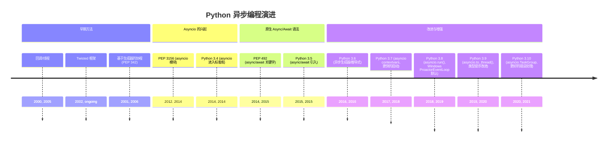
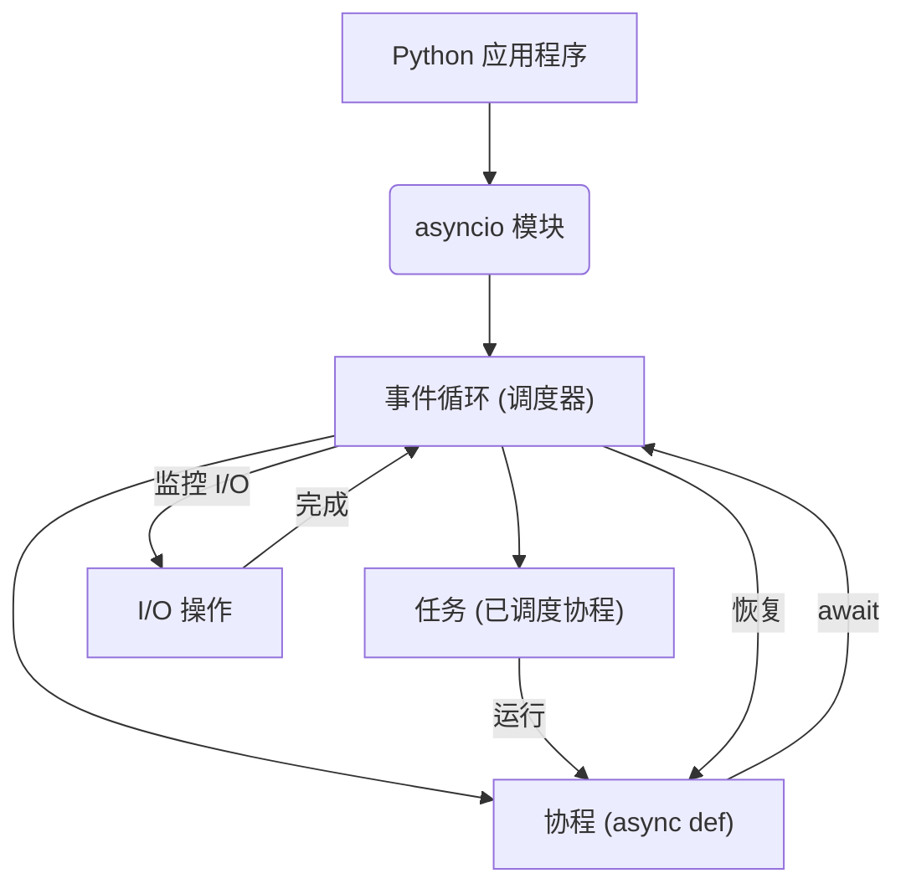
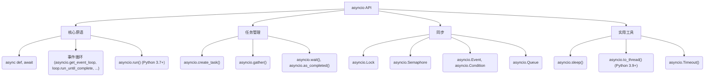
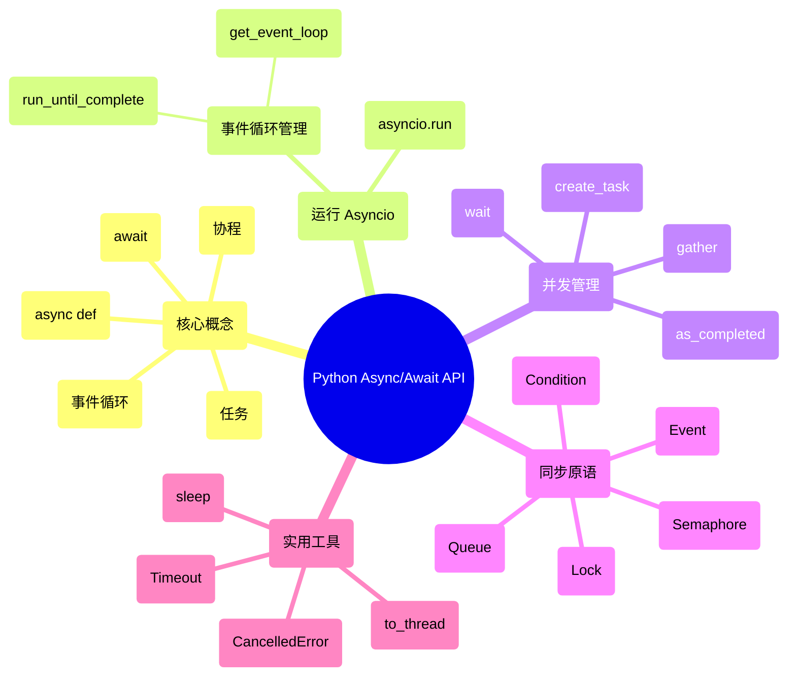

## Async/Await 演进文档

### 1. 引言与历史背景

异步编程在现代 Python 应用程序中变得越来越重要，尤其适用于 I/O 密集型和高并发任务。`async/await` 语法于 Python 3.5 引入，提供了一种原生、更具可读性和可维护性的方式来编写并发代码，优于早期基于回调或显式生成器的协程方法。它允许开发者编写看起来和感觉上都像同步代码的异步代码，显著改善了开发体验，并降低了通常与并发相关的复杂性。

对并发操作（特别是网络请求、文件 I/O 和数据库交互）进行高效处理的需求，推动了 Python 中异步编程范式的演进。在 `async/await` 之前，开发者依赖各种技术，每种技术都有其自身的挑战。

### 1.1. Python 异步编程演进时间线



### 2. 核心架构

Python 中的 `async/await` 模式建立在几个基本概念之上：事件循环、协程和任务。这些组件协同工作，实现协作式多任务处理，即函数自愿让出控制权，允许其他函数运行，而无需传统线程或进程的开销。

#### 2.1. 事件循环

**心智模型 / 类比：**
想象一家餐厅厨房里有一位高效的厨师。这位厨师（事件循环）不会等一道菜完全做好才开始做下一道。相反，他们会准备一道菜，直到它需要炖煮或烘烤（一个 I/O 操作）。当这道菜“等待”时，厨师会立即转到另一道菜，准备它直到它也需要等待。他们不断检查所有等待的菜肴，一旦有菜肴准备好进入下一步，他们就会继续处理它。事件循环就是这位厨师，在单个线程上并发管理许多“菜肴”（协程/任务）。

事件循环是 `asyncio` 的核心。它负责：
*   **调度：** 决定下一个要运行的任务。
*   **执行：** 运行协程直到它们 `await` 一个 I/O 操作或另一个协程。
*   **监控：** 跟踪 I/O 事件（例如，网络数据到达，文件准备好读/写）。
*   **分派：** 在其等待的操作完成后恢复协程。

Python 的 `asyncio` 模块提供了事件循环的标准实现。

#### 2.2. 协程

协程是使用 `async def` 定义的特殊函数。当被调用时，它们不会立即执行，而是返回一个 *协程对象*。此对象表示一个潜在的计算，可以由事件循环运行。协程可以 `await` 其他可等待对象（如其他协程、任务或 Future），这是它们将控制权交还给事件循环的点。

**主要特点：**
*   **`async def`：** 定义一个协程函数。
*   **`await`：** 暂停当前协程的执行，直到等待的对象完成，从而将控制权交还给事件循环。
*   **协作式多任务处理：** 协程显式地让出控制权，这使得它们效率很高，因为没有像线程那样的上下文切换开销。

#### 2.3. 任务

在 `asyncio` 中，任务是协程的包装器，它在事件循环上调度协程的执行。当您想要并发运行协程时，通常会将其包装在 `Task` 中。任务是 `Future` 的子类，允许您监视正在运行的协程的状态、获取其结果或处理异常。

**心智模型 / 类比：**
如果协程是一个食谱，那么任务就是交给厨师（事件循环）的食谱订单。厨师使用订单来知道要处理哪个食谱并跟踪其进度。

**Mermaid 图：Asyncio 核心架构**



### 3. 详细 API 概述

`async/await` API 主要围绕 `asyncio` 模块，该模块提供了编写并发代码的基础设施。其演进重点在于使 API 更用户友好、更健壮、性能更高，自 Python 3.5 以来，每个 Python 版本都有重大新增。

#### 3.1. 定义和运行协程

##### 3.1.1. 定义协程函数

**`async def function_name(...):`**

**目标：** 将函数声明为协程，使其成为可等待对象。

**代码：**
```python
import asyncio

async def my_coroutine():
    print("Starting my_coroutine")
    await asyncio.sleep(1) # 模拟一个 I/O 密集型操作
    print("Finished my_coroutine")

# 直接调用它会返回一个协程对象，但不会运行它
coro_obj = my_coroutine()
print(f"Type of coro_obj: {type(coro_obj)}")
```

**预期输出：**
```
Type of coro_obj: <class 'coroutine'>
```

**解释：** `async def` 是定义协程的基本语法。当调用 `my_coroutine()` 时，它不会立即执行其主体；相反，它会返回一个协程对象。然后必须在事件循环上调度此对象才能运行。

*   **上下文：** 定义异步函数的主要关键字。使用 `async def` 定义的函数是协程，必须 `await` 或作为任务调度。
*   **参数：** 标准函数参数。
*   **返回：** 一个协程对象。

##### 3.1.2. 运行事件循环

**`asyncio.run(coro, *, debug=False)` (Python 3.7+)**

**目标：** 运行协程直到完成，自动管理事件循环。

**代码：**
```python
import asyncio

async def main():
    print("Hello")
    await asyncio.sleep(0.1)
    print("World")

if __name__ == "__main__":
    asyncio.run(main())
```

**预期输出：**
```
Hello
World
```

**解释：** `asyncio.run()` 是运行 `asyncio` 应用程序顶层入口点的最简单方法。它处理事件循环的创建、管理和关闭，使其非常适合脚本和简单应用程序。它于 Python 3.7 引入，以简化 `asyncio` 的使用。

*   **上下文：** 运行 `asyncio` 事件循环的高级入口点。它运行传递的协程，负责管理事件循环、完成异步生成器和关闭循环。
*   **参数：**
    *   `coro`：要运行的协程对象。
    *   `debug`：(可选) 如果为 `True`，事件循环将以调试模式运行。
*   **返回：** 协程的结果。

#### 3.2. 等待与并发

##### 3.2.1. 暂停等待可等待对象

**`await awaitable`**

**目标：** 暂停当前协程的执行，直到 `awaitable`（另一个协程、任务或 Future）完成，将控制权交还给事件循环。

**代码：**
```python
import asyncio

async def greet(name, delay):
    await asyncio.sleep(delay)
    print(f"Hello, {name} after {delay} seconds")

async def main_await():
    print("Starting main_await")
    await greet("Alice", 2) # 这将阻塞 main_await 2 秒
    await greet("Bob", 1)  # 这将在 Alice 完成后阻塞 main_await 1 秒
    print("Finished main_await")

if __name__ == "__main__":
    asyncio.run(main_await())
```

**预期输出：**
```
Starting main_await
Hello, Alice after 2 seconds
Hello, Bob after 1 seconds
Finished main_await
```

**解释：** `await` 关键字用于 `async def` 函数内部，以暂停执行并等待异步操作完成。在此暂停期间，事件循环可以切换到其他任务。在 `main_await` 中，`greet("Alice", 2)` 完全完成后，`greet("Bob", 1)` 才开始。

*   **上下文：** 在 `async def` 函数中使用，以暂停其执行，直到可等待对象（如协程、任务或 Future）被解析。这是协作式多任务处理的机制。
*   **参数：** 一个可等待对象。
*   **返回：** 等待对象的结果。

##### 3.2.2. 并发运行任务

**`asyncio.create_task(coro, *, name=None)` (Python 3.7+)**

**目标：** 将协程作为 `asyncio.Task` 调度到事件循环上运行，使其能够与其他任务并发运行。

**代码：**
```python
import asyncio

async def greet_concurrent(name, delay):
    await asyncio.sleep(delay)
    print(f"Hello, {name} after {delay} seconds")

async def main_concurrent():
    print("Starting main_concurrent")
    task1 = asyncio.create_task(greet_concurrent("Alice", 2))
    task2 = asyncio.create_task(greet_concurrent("Bob", 1))

    # 等待任务完成
    await task1
    await task2
    print("Finished main_concurrent")

if __name__ == "__main__":
    asyncio.run(main_concurrent())
```

**预期输出（“Hello”行的顺序可能因并发而略有不同）：**
```
Starting main_concurrent
Hello, Bob after 1 seconds
Hello, Alice after 2 seconds
Finished main_concurrent
```

**解释：** `asyncio.create_task()` 接受一个协程并将其调度到事件循环上运行。它立即返回一个 `Task` 对象，允许调用协程继续而不等待。然后 `await task1` 和 `await task2` 行等待这些任务实际完成。请注意，“Bob”在“Alice”之前完成，即使“Alice”是先创建的，这表明了并发性。

*   **上下文：** 从协程创建 `Task` 并调度其在事件循环上执行。这是并发运行协程的主要方式。
*   **参数：**
    *   `coro`：要包装在 Task 中的协程对象。
    *   `name`：(可选) 任务的名称，用于调试。
*   **返回：** 一个 `asyncio.Task` 对象。

##### 3.2.3. 等待多个任务

**`asyncio.gather(*aws, return_exceptions=False)`**

**目标：** 并发运行多个可等待对象，并等待它们全部完成。

**代码：**
```python
import asyncio

async def worker(name, delay):
    await asyncio.sleep(delay)
    return f"{name} finished after {delay}s"

async def main_gather():
    print("Starting main_gather")
    results = await asyncio.gather(
        worker("Worker A", 3),
        worker("Worker B", 1),
        worker("Worker C", 2)
    )
    print("All workers finished.")
    for res in results:
        print(res)

if __name__ == "__main__":
    asyncio.run(main_gather())
```

**预期输出（“finished”行的顺序可能不同，但结果列表的顺序会保留）：**
```
Starting main_gather
All workers finished.
Worker A finished after 3s
Worker B finished after 1s
Worker C finished after 2s
```

**解释：** `asyncio.gather()` 是一种强大的方式，可以并行运行多个协程或任务并收集它们的结果。它会等待所有提供的可等待对象完成。返回列表中的结果顺序与传递给 `gather` 的可等待对象的顺序一致。

*   **上下文：** 并发运行多个可等待对象。它会等待它们全部完成，并按传递的顺序返回其结果列表。
*   **参数：**
    *   `*aws`：一个或多个可等待对象（协程、任务、Future）。
    *   `return_exceptions`：(可选) 如果为 `True`，则异常被视为结果；否则，第一个引发的异常会立即传播。
*   **返回：** 可等待对象的结果列表。

##### 3.2.4. 快速参考：等待与并发

| 语法/函数 | 描述 | 何时使用 |
| :--- | :--- | :--- |
| `await awaitable` | 暂停当前协程，等待 `awaitable` | 在 `async def` 函数内部，等待 I/O 操作或另一个协程完成。 |
| `asyncio.create_task()` | 将协程调度为任务 | 在后台并发运行协程，而不阻塞当前协程。 |
| `asyncio.gather()` | 并发运行多个可等待对象 | 当您需要运行多个独立的异步操作并等待它们全部完成，同时收集它们的结果时。 |

#### 3.3. 同步原语

`asyncio` 提供了几个同步原语，类似于 `threading` 中的原语，但专为协作式多任务处理而设计。这些有助于管理共享资源和协调任务。

##### 3.3.1. 锁

**`asyncio.Lock`**

**目标：** 保护共享资源免受多个任务的并发访问。

**代码：**
```python
import asyncio

lock = asyncio.Lock()
shared_resource = 0

async def increment_with_lock(task_id):
    global shared_resource
    print(f"Task {task_id}: Trying to acquire lock")
    async with lock: # 获取锁
        print(f"Task {task_id}: Lock acquired, current resource: {shared_resource}")
        await asyncio.sleep(0.01) # 模拟工作
        shared_resource += 1
        print(f"Task {task_id}: Resource incremented to {shared_resource}, releasing lock")
    # 锁在此处自动释放

async def main_lock():
    print("Starting main_lock")
    tasks = [asyncio.create_task(increment_with_lock(i)) for i in range(5)]
    await asyncio.gather(*tasks)
    print(f"Final shared resource value: {shared_resource}")

if __name__ == "__main__":
    asyncio.run(main_lock())
```

**预期输出（“Trying to acquire lock”的顺序可能不同，但“Lock acquired”和“Resource incremented”将按任务顺序）：**
```
Starting main_lock
Task 0: Trying to acquire lock
Task 1: Trying to acquire lock
Task 2: Trying to acquire lock
Task 3: Trying to acquire lock
Task 4: Trying to acquire lock
Task 0: Lock acquired, current resource: 0
Task 0: Resource incremented to 1, releasing lock
Task 1: Lock acquired, current resource: 1
Task 1: Resource incremented to 2, releasing lock
Task 2: Lock acquired, current resource: 2
Task 2: Resource incremented to 3, releasing lock
Task 3: Lock acquired, current resource: 3
Task 3: Resource incremented to 4, releasing lock
Task 4: Lock acquired, current resource: 4
Task 4: Resource incremented to 5, releasing lock
Final shared resource value: 5
```

**解释：** `asyncio.Lock` 确保一次只有一个任务可以执行代码的关键部分。`async with lock:` 语法是获取和释放锁的惯用方式，确保即使发生异常也会释放锁。这可以防止在修改 `shared_resource` 时出现竞态条件。

*   **上下文：** 一种低级同步原语，可用于保护共享资源免受多个任务的并发访问。
*   **方法：**
    *   `acquire()`：获取锁。此方法是一个协程。
    *   `release()`：释放锁。
    *   `async with lock:`：用于获取和释放锁的上下文管理器。
*   **返回：：** 一个 `asyncio.Lock` 对象。

##### 3.3.2. 信号量

**`asyncio.Semaphore(value)`**

**目标：** 限制访问资源的并发任务数量。

**代码：**
```python
import asyncio

semaphore = asyncio.Semaphore(2) # 只允许 2 个并发任务
async def limited_worker(task_id):
    print(f"Task {task_id}: Waiting for semaphore")
    async with semaphore:
        print(f"Task {task_id}: Acquired semaphore, working...")
        await asyncio.sleep(1) # 模拟工作
        print(f"Task {task_id}: Releasing semaphore")

async def main_semaphore():
    print("Starting main_semaphore")
    tasks = [asyncio.create_task(limited_worker(i)) for i in range(5)]
    await asyncio.gather(*tasks)
    print("Finished main_semaphore")

if __name__ == "__main__":
    asyncio.run(main_semaphore())
```

**预期输出（请注意，一次只有 2 个任务获取信号量）：**
```
Starting main_semaphore
Task 0: Waiting for semaphore
Task 1: Waiting for semaphore
Task 2: Waiting for semaphore
Task 3: Waiting for semaphore
Task 4: Waiting for semaphore
Task 0: Acquired semaphore, working...
Task 1: Acquired semaphore, working...
Task 0: Releasing semaphore
Task 1: Releasing semaphore
Task 2: Acquired semaphore, working...
Task 3: Acquired semaphore, working...
Task 2: Releasing semaphore
Task 3: Releasing semaphore
Task 4: Acquired semaphore, working...
Task 4: Releasing semaphore
Finished main_semaphore
```

**解释：** `asyncio.Semaphore` 在您想要控制同时访问某个资源或执行某个操作的最大任务数量时非常有用。在此示例中，一次只有两个 `limited_worker` 任务可以“工作”（持有信号量）。

*   **上下文：** 一个计数器，限制并发 `acquire()` 调用的数量。用于限制资源容量。
*   **参数：**
    *   `value`：信号量的初始值，表示并发获取的最大数量。
*   **方法：**
    *   `acquire()`：获取信号量。此方法是一个协程。
    *   `release()`：释放信号量。
    *   `async with semaphore:`：用于获取和释放信号量的上下文管理器。
*   **返回：：** 一个 `asyncio.Semaphore` 对象。

##### 3.3.3. 队列

**`asyncio.Queue`**

**目标：** 实现生产者-消费者模式，并安全地在并发运行的任务之间交换数据。

**代码：**
```python
import asyncio
import random

async def producer(queue, num_items):
    for i in range(num_items):
        item = f"item-{i}"
        await asyncio.sleep(random.uniform(0.1, 0.5)) # 模拟工作
        await queue.put(item)
        print(f"Producer: Put {item} into queue")
    await queue.put(None) # 发送哨兵值以指示消费者停止

async def consumer(queue, consumer_id):
    while True:
        item = await queue.get()
        if item is None:
            queue.task_done()
            break
        print(f"Consumer {consumer_id}: Got {item} from queue")
        await asyncio.sleep(random.uniform(0.2, 0.6)) # 模拟工作
        queue.task_done()
    print(f"Consumer {consumer_id}: Finished")

async def main_queue():
    print("Starting main_queue")
    queue = asyncio.Queue()
    
    producer_task = asyncio.create_task(producer(queue, 5))
    consumer_tasks = [asyncio.create_task(consumer(queue, i)) for i in range(2)]

    await asyncio.gather(producer_task, *consumer_tasks)
    await queue.join() # 等待队列中的所有项目都被处理完毕
    print("Finished main_queue")

if __name__ == "__main__":
    asyncio.run(main_queue())
```

**预期输出（生产者/消费者操作的顺序可能因并发而异）：**
```
Starting main_queue
Producer: Put item-0 into queue
Consumer 0: Got item-0 from queue
Producer: Put item-1 into queue
Consumer 1: Got item-1 from queue
Producer: Put item-2 into queue
Consumer 0: Got item-2 from queue
Producer: Put item-3 into queue
Consumer 1: Got item-3 from queue
Producer: Put item-4 into queue
Consumer 0: Got item-4 from queue
Producer: Put None into queue
Consumer 0: Finished
Consumer 1: Got None from queue
Consumer 1: Finished
Finished main_queue
```

**解释：** `asyncio.Queue` 是一个强大的任务间通信工具，支持经典的生产者-消费者模式。生产者将项目放入队列，消费者从中获取项目。队列处理同步，允许任务安全地交换数据而无需显式锁。`queue.join()` 会一直等待，直到队列中所有先前放入的项目都被接收并处理（即，每个项目都调用了 `task_done()`）。

*   **上下文：** 一个先进先出 (FIFO) 队列，专为 `async/await` 设计，用于在多个并发任务之间安全地交换数据。
*   **方法：**
    *   `put(item)`：一个协程，将项目放入队列。
    *   `get()`：一个协程，从队列中移除并返回一个项目。如果队列为空，它会一直等待直到有项目可用。
    *   `task_done()`：指示先前入队的一个任务已完成。与 `join()` 一起使用。
    *   `join()`：一个协程，阻塞直到队列中所有项目都被接收并为每个项目调用了 `task_done()`。
*   **返回：：** 一个 `asyncio.Queue` 对象。

##### 3.3.4. 快速参考：同步原语

| 原语 | 描述 | 何时使用 |
| :--- | :--- | :--- |
| `asyncio.Lock` | 互斥锁 | 保护共享可变状态免受竞态条件影响。 |
| `asyncio.Semaphore` | 有界计数器 | 限制并发任务访问资源或执行操作的数量。 |
| `asyncio.Queue` | 生产者-消费者队列 | 安全地在任务之间交换数据；实现生产者-消费者模式。 |

#### 3.4. 在线程池中运行阻塞代码

##### 3.4.1. 卸载阻塞 I/O 或 CPU 密集型任务

**`asyncio.to_thread(func, /, *args, **kwargs)` (Python 3.9+)**

**目标：** 在单独的线程池中运行同步（阻塞）函数，允许事件循环继续运行其他任务。

**代码：**
```python
import asyncio
import time

def blocking_function(duration):
    print(f"  Blocking function started for {duration}s")
    time.sleep(duration) # 这是一个阻塞调用
    print(f"  Blocking function finished after {duration}s")
    return f"Blocking result after {duration}s"

async def main_to_thread():
    print("Main: Starting non-blocking operations")
    task1 = asyncio.create_task(asyncio.sleep(0.5)) # 非阻塞异步操作

    print("Main: Offloading blocking_function to a thread")
    # 在单独的线程中运行 blocking_function
    blocking_result = await asyncio.to_thread(blocking_function, 2)

    await task1 # 等待非阻塞任务
    print(f"Main: Non-blocking task finished.")
    print(f"Main: Received blocking result: {blocking_result}")
    print("Main: Finished")

if __name__ == "__main__":
    asyncio.run(main_to_thread())
```

**预期输出（请注意，非阻塞睡眠在阻塞函数之前完成，即使阻塞函数是先启动的）：**
```
Main: Starting non-blocking operations
Main: Offloading blocking_function to a thread
  Blocking function started for 2s
Main: Non-blocking task finished.
  Blocking function finished after 2s
Main: Received blocking result: Blocking result after 2s
Main: Finished
```

**解释：** `asyncio.to_thread()` 对于将同步阻塞代码（例如 CPU 密集型计算或没有 `async` 等效项的 I/O 操作）集成到 `asyncio` 应用程序中而不会阻塞事件循环至关重要。它在默认线程池执行器中运行函数，并且 `await asyncio.to_thread()` 会等待该线程完成。

*   **上下文：** 在单独的线程池中异步运行同步函数。这对于防止阻塞 I/O 或 CPU 密集型同步操作冻结事件循环至关重要。
*   **参数：**
    *   `func`：要运行的同步函数。
    *   `*args`, `**kwargs`：要传递给 `func` 的参数。
*   **返回：：** `func` 的结果。

##### 3.4.2. 快速参考：运行阻塞代码

| 函数 | 描述 | 何时使用 |
| :--- | :--- | :--- |
| `asyncio.to_thread()` | 在线程中运行阻塞函数 | 当您需要执行同步、可能长时间运行的 I/O 或 CPU 密集型操作而不会阻塞 `asyncio` 事件循环时。 |

**Mermaid 图：简化的 Asyncio API 结构**



### 3.5. API 思维导图



### 4. 演进与影响

`async/await` 的引入和持续改进对 Python 的能力产生了深远影响，特别是在需要高并发和响应能力的领域。

*   **提高可读性和可维护性：** `async/await` 显著提高了异步代码的可读性，摆脱了回调地狱或复杂的生成器逻辑。这使得更广泛的 Python 开发者能够更容易地进行并发编程。
*   **I/O 密集型工作负载的性能：** 通过在单个线程上实现协作式多任务处理，`asyncio` 应用程序可以以最小的开销处理大量并发 I/O 操作，使 Python 成为 Web 服务器、API 网关和数据流应用程序的有力竞争者。
*   **生态系统增长：** `async/await` 语法推动了丰富的异步生态系统的发展，包括 Web 框架 (FastAPI, Starlette)、HTTP 客户端 (httpx, aiohttp)、数据库驱动程序 (asyncpg, aiomysql) 和消息队列 (aio_pika)。
*   **标准化：** `asyncio` 成为异步编程的标准库，为其他库和框架提供了可以构建的一致基础，减少了碎片化。
*   **与同步代码集成：** `asyncio.to_thread()` (Python 3.9+) 通过提供一种优雅的方式将阻塞同步代码集成到异步应用程序中而不会损害事件循环的响应能力，解决了关键挑战。
*   **错误处理和调试：** 随后的 Python 版本对 `asyncio` 中的错误处理、调试工具和更清晰的诊断进行了改进，使得在复杂的异步应用程序中识别和解决问题变得更加容易。

### 5. 结论

`async/await` 模式和 `asyncio` 框架代表了 Python 并发编程的重大飞跃。通过提供原生、直观且强大的协作式多任务处理机制，它们已将 Python 转变为一种功能强大的语言，用于构建可扩展和响应迅速的 I/O 密集型应用程序。`asyncio` 模块在社区反馈和性能考虑的推动下不断演进，确保 Python 仍然是现代异步开发的有竞争力和吸引力的选择。
