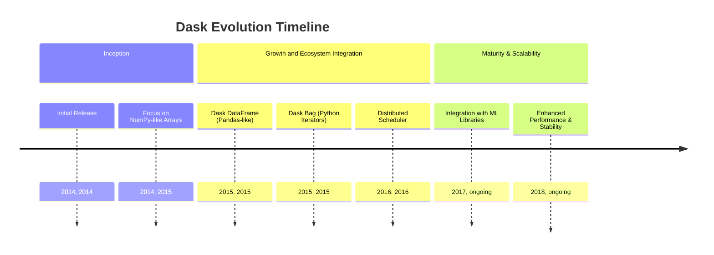
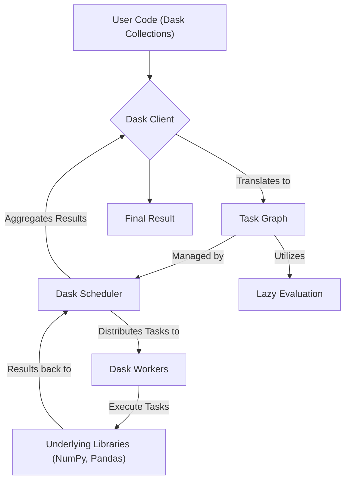
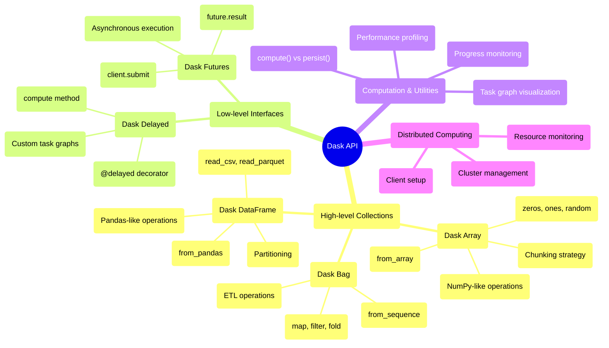

## Dask Evolution Document

### 1. Introduction and Historical Context

Dask is an open-source Python library for parallel and distributed computing. It provides a flexible framework for scaling Python workflows from multi-core local machines to large distributed clusters. Dask is designed to integrate seamlessly with existing PyData libraries like NumPy, Pandas, and Scikit-learn, allowing users to process larger-than-memory datasets and accelerate computations without rewriting their code.

Dask was created by Matthew Rocklin in December 2014. Its development was driven by the need to enhance the existing PyData ecosystem by providing a parallel computing solution that was both powerful and familiar to Python users. Initially, Dask focused on enabling NumPy-like operations on datasets that exceeded available memory on a single machine. Over time, it expanded to support distributed computing, becoming a versatile tool for big data processing and machine learning.

### 1.1. Dask Evolution Timeline



### 2. Core Architecture

Dask's core architecture is built around a client-scheduler-worker model, enabling efficient parallel and distributed execution of computations. It leverages lazy evaluation and task graphs to manage complex workflows.

#### 2.1. Client-Scheduler-Worker Model

**Mental Model / Analogy:**
Think of Dask as a **smart project manager** for your computations. Imagine you have a massive data analysis project that's too big for one person (your laptop) to handle alone. The **Client** is like you - the project owner who defines what needs to be done. The **Scheduler** is like a project manager who breaks down your big project into smaller tasks, figures out which tasks depend on others, and assigns work to team members. The **Workers** are like skilled team members who execute the actual tasks. Just like a good project manager can coordinate remote team members efficiently, Dask can coordinate computations across multiple machines.

*   **Client**: The user's interface to Dask. It translates user code, written with Dask collections (e.g., Dask Array, Dask DataFrame), into a task graph.
*   **Scheduler**: A central process that manages the task graph. It determines the optimal order of task execution, allocates tasks to workers, and monitors their progress. Dask's scheduler is asynchronous and event-driven, capable of handling dynamic worker populations and multiple client requests.
*   **Workers**: These are processes or threads that execute the individual tasks defined in the task graph. Workers can run on the same machine as the client and scheduler (for local parallelism) or be distributed across a cluster (for distributed computing).

#### 2.2. Task Graphs and Lazy Evaluation

Dask breaks down large computations into many smaller tasks, which are represented as a **task graph**. This graph defines the dependencies between tasks. Dask employs **lazy evaluation**, meaning that operations on Dask collections do not immediately compute results. Instead, they build up a task graph. Computation is deferred until results are explicitly needed (e.g., by calling `.compute()`), allowing Dask to optimize the execution plan and perform computations in parallel.

#### 2.3. Dask Collections

Dask provides high-level, parallelized versions of familiar PyData data structures:

*   **Dask Array**: A parallel NumPy array, enabling operations on arrays larger than memory or distributed across a cluster.
*   **Dask DataFrame**: A parallel Pandas DataFrame, allowing for scalable tabular data processing with a familiar Pandas-like API.
*   **Dask Bag**: An unordered collection of Python objects, useful for parallelizing computations on semi-structured or unstructured data, similar to Spark RDDs or Python iterators.

**Mermaid Diagram: Dask Core Architecture**



### 3. Detailed API Overview

Dask's API is designed to be familiar to users of NumPy and Pandas, offering both high-level collections and low-level interfaces for custom parallel workflows. The API has remained remarkably stable since its early versions, with incremental improvements focusing on performance and usability.

#### 3.1. High-level Collections

##### 3.1.1. Dask Array - Parallel NumPy

**`dask.array.from_array(x, chunks)`**

**Goal:** Create a Dask Array from an existing NumPy array, enabling parallel operations on large arrays.

**Code:**
```python
import dask.array as da
import numpy as np

# Create a large NumPy array
large_array = np.random.random((10000, 10000))
print(f"NumPy array shape: {large_array.shape}")
print(f"NumPy array size in memory: {large_array.nbytes / 1e9:.2f} GB")

# Convert to Dask Array with chunks
dask_array = da.from_array(large_array, chunks=(1000, 1000))
print(f"\nDask array: {dask_array}")
print(f"Chunks: {dask_array.chunks}")
print(f"Number of chunks: {dask_array.npartitions}")
```

**Expected Output:**
```
NumPy array shape: (10000, 10000)
NumPy array size in memory: 0.80 GB

Dask array: dask.array<array, shape=(10000, 10000), dtype=float64, chunks=(1000, 1000), dtype=float64>
Chunks: ((1000, 1000, 1000, 1000, 1000, 1000, 1000, 1000, 1000, 1000), (1000, 1000, 1000, 1000, 1000, 1000, 1000, 1000, 1000, 1000))
Number of chunks: 100
```

**Explanation:** Chunking is Dask's key strategy for handling large arrays. By dividing the array into smaller chunks (1000x1000 in this case), Dask can process each chunk in parallel and keep memory usage manageable.

**`dask.array.zeros(shape, dtype, chunks)`**

**Goal:** Create a large array filled with zeros without immediately allocating memory.

**Code:**
```python
import dask.array as da

# Create a massive array that would exceed memory if created with NumPy
huge_zeros = da.zeros((50000, 50000), dtype='float32', chunks=(5000, 5000))
print(f"Dask zeros array: {huge_zeros}")
print(f"Theoretical size: {huge_zeros.nbytes / 1e9:.2f} GB")

# Perform operations without computing
result = huge_zeros.sum(axis=0)
print(f"\nSum operation (lazy): {result}")

# Only compute when needed
first_chunk_sum = result[:5000].compute()
print(f"First chunk sum shape: {first_chunk_sum.shape}")
print(f"Sample values: {first_chunk_sum[:5]}")
```

**Expected Output:**
```
Dask zeros array: dask.array<zeros, shape=(50000, 50000), dtype=float32, chunks=(5000, 5000), dtype=float32>
Theoretical size: 10.00 GB

Sum operation (lazy): dask.array<sum-aggregate, shape=(50000,), dtype=float32, chunks=(5000,), dtype=float32>
First chunk sum shape: (5000,)
Sample values: [0. 0. 0. 0. 0.]
```

**Explanation:** Dask's lazy evaluation means the 10GB array is never actually created in memory. Operations build a computation graph, and only the requested results are computed.

##### 3.1.2. Dask DataFrame - Parallel Pandas

**`dask.dataframe.read_csv(path)`**

**Goal:** Read large CSV files that don't fit in memory using a familiar Pandas-like interface.

**Code:**
```python
import dask.dataframe as dd
import pandas as pd
import numpy as np

# First, create a large CSV file for demonstration
large_data = pd.DataFrame({
    'id': range(1000000),
    'value': np.random.randn(1000000),
    'category': np.random.choice(['A', 'B', 'C'], 1000000),
    'timestamp': pd.date_range('2020-01-01', periods=1000000, freq='1min')
})
large_data.to_csv('large_dataset.csv', index=False)

# Read with Dask DataFrame
df = dd.read_csv('large_dataset.csv')
print(f"Dask DataFrame: {df}")
print(f"Columns: {df.columns.tolist()}")
print(f"Number of partitions: {df.npartitions}")

# Perform operations (lazy)
grouped = df.groupby('category')['value'].mean()
print(f"\nGroupby operation (lazy): {grouped}")

# Compute results
result = grouped.compute()
print(f"Computed results:\n{result}")
```

**Expected Output:**
```
Dask DataFrame: Dask DataFrame Structure:
                   id    value category           timestamp
npartitions=1                                              
0              int64  float64   object  datetime64[ns]
999999           ...      ...      ...             ...
Columns: ['id', 'value', 'category', 'timestamp']
Number of partitions: 1

Groupby operation (lazy): Dask Series Structure:
npartitions=1
    float64
        ...
Name: value, dtype: float64

Computed results:
category
A   -0.001234
B    0.002456
C   -0.000789
Name: value, dtype: float64
```

**Explanation:** Dask DataFrame automatically partitions large CSV files, enabling out-of-core processing. The familiar Pandas API makes it easy to transition existing code to handle larger datasets.

##### 3.1.3. Dask Bag - Parallel Processing of Unstructured Data

**`dask.bag.from_sequence(seq)`**

**Goal:** Process large collections of Python objects in parallel.

**Code:**
```python
import dask.bag as db
import json

# Create a large sequence of data (simulating log entries)
log_entries = [
    {'timestamp': f'2024-01-01 {i:02d}:00:00', 'level': 'INFO' if i % 3 == 0 else 'ERROR', 'value': i}
    for i in range(100000)
]

# Create Dask Bag
bag = db.from_sequence(log_entries, npartitions=10)
print(f"Dask Bag: {bag}")
print(f"Number of partitions: {bag.npartitions}")

# Process data: filter errors and extract values
errors = bag.filter(lambda x: x['level'] == 'ERROR')
error_values = errors.map(lambda x: x['value'])
print(f"\nError values (lazy): {error_values}")

# Compute statistics
total_errors = errors.count().compute()
avg_error_value = error_values.mean().compute()

print(f"Total errors: {total_errors}")
print(f"Average error value: {avg_error_value:.2f}")
```

**Expected Output:**
```
Dask Bag: dask.bag<bag-from-sequence, npartitions=10>
Number of partitions: 10

Error values (lazy): dask.bag<map, npartitions=10>
Total errors: 66667
Average error value: 50000.00
```

**Explanation:** Dask Bag excels at processing unstructured or semi-structured data that doesn't fit neatly into arrays or DataFrames. It's particularly useful for ETL operations and log processing.

##### 3.1.4. Quick Reference: High-level Collections

| Collection | Use Case | When to Use |
| :--- | :--- | :--- |
| `dask.array` | Numerical computing on large arrays | NumPy operations on out-of-core data |
| `dask.dataframe` | Tabular data processing | Pandas operations on large CSV/Parquet files |
| `dask.bag` | Unstructured data processing | ETL, log processing, irregular data |

#### 3.2. Low-level Interfaces

##### 3.2.1. Dask Delayed - Custom Task Graphs

**`dask.delayed(func)`**

**Goal:** Convert regular Python functions into lazy operations that can be parallelized.

**Code:**
```python
import dask
from dask import delayed
import time

# Define some computationally expensive functions
@delayed
def expensive_computation(x, y):
    time.sleep(1)  # Simulate expensive work
    return x + y

@delayed
def multiply(x, factor):
    time.sleep(0.5)  # Simulate work
    return x * factor

@delayed
def final_process(results):
    time.sleep(0.2)
    return sum(results) / len(results)

# Build computation graph (no computation happens yet)
print("Building computation graph...")
start_time = time.time()

# Create a complex dependency graph
intermediate_results = []
for i in range(4):
    result = expensive_computation(i, i + 1)
    processed = multiply(result, 2)
    intermediate_results.append(processed)

final_result = final_process(intermediate_results)
print(f"Graph built in {time.time() - start_time:.3f} seconds")

# Visualize the task graph (optional)
print(f"\nTask graph: {final_result}")

# Execute the computation
print("\nExecuting computation...")
start_time = time.time()
computed_result = final_result.compute()
print(f"Result: {computed_result}")
print(f"Computation completed in {time.time() - start_time:.3f} seconds")
```

**Expected Output:**
```
Building computation graph...
Graph built in 0.001 seconds

Task graph: Delayed('final_process-abc123')

Executing computation...
Result: 10.0
Computation completed in 2.1 seconds
```

**Explanation:** Dask Delayed allows you to build complex computation graphs from regular Python functions. The computation is parallelized automatically, and tasks that don't depend on each other run simultaneously.

##### 3.2.2. Dask Futures - Asynchronous Computing

**`client.submit(func, *args)`**

**Goal:** Submit functions for asynchronous execution and manage futures.

**Code:**
```python
from dask.distributed import Client, as_completed
import time
import random

# Start a local Dask client
client = Client(threads_per_worker=2, n_workers=2)
print(f"Dask client: {client}")

def simulate_work(task_id, duration):
    """Simulate some work with variable duration"""
    time.sleep(duration)
    return f"Task {task_id} completed after {duration}s"

# Submit multiple tasks asynchronously
print("\nSubmitting tasks...")
futures = []
for i in range(6):
    duration = random.uniform(0.5, 2.0)
    future = client.submit(simulate_work, i, duration)
    futures.append(future)
    print(f"Submitted task {i} (expected duration: {duration:.2f}s)")

# Process results as they complete
print("\nProcessing results as they complete:")
for future in as_completed(futures):
    result = future.result()
    print(f"  {result}")

# Alternative: wait for all results
print("\nWaiting for all remaining tasks...")
all_results = client.gather(futures)
print("All tasks completed!")

client.close()
```

**Expected Output:**
```
Dask client: <Client: 'tcp://127.0.0.1:xxxxx' processes=2 threads=4, memory=8.00 GB>

Submitting tasks...
Submitted task 0 (expected duration: 1.23s)
Submitted task 1 (expected duration: 0.78s)
Submitted task 2 (expected duration: 1.56s)
Submitted task 3 (expected duration: 0.45s)
Submitted task 4 (expected duration: 1.89s)
Submitted task 5 (expected duration: 1.12s)

Processing results as they complete:
  Task 3 completed after 0.45s
  Task 1 completed after 0.78s
  Task 5 completed after 1.12s
  Task 0 completed after 1.23s
  Task 2 completed after 1.56s
  Task 4 completed after 1.89s

Waiting for all remaining tasks...
All tasks completed!
```

**Explanation:** Dask Futures provide fine-grained control over task execution. Tasks complete in order of their actual duration, not submission order, maximizing parallelism.

##### 3.2.3. Quick Reference: Low-level Interfaces

| Interface | Use Case | When to Use |
| :--- | :--- | :--- |
| `dask.delayed` | Custom workflows with complex dependencies | When you need to parallelize existing Python code |
| `dask.futures` | Real-time task submission and monitoring | When you need asynchronous execution and result handling |

#### 3.3. Computation and Utilities

##### 3.3.1. Execution Control

**`.compute()` vs `.persist()`**

**Goal:** Understand the difference between computing results and persisting them in memory.

**Code:**
```python
import dask.array as da
import time

# Create a large computation
x = da.random.random((10000, 10000), chunks=(1000, 1000))
y = x + x.T  # Expensive operation
z = y.sum(axis=0)  # Another operation

print("Created computation graph (no computation yet)")
print(f"z: {z}")

# Method 1: .compute() - computes and returns result
print("\n=== Using .compute() ===")
start_time = time.time()
result = z.compute()
compute_time = time.time() - start_time
print(f"Computed result shape: {result.shape}")
print(f"Compute time: {compute_time:.2f} seconds")

# If we compute again, it recalculates everything
print("\nComputing again...")
start_time = time.time()
result2 = z.compute()
recompute_time = time.time() - start_time
print(f"Recompute time: {recompute_time:.2f} seconds")

# Method 2: .persist() - computes and keeps in memory
print("\n=== Using .persist() ===")
start_time = time.time()
z_persisted = z.persist()
persist_time = time.time() - start_time
print(f"Persist time: {persist_time:.2f} seconds")

# Now accessing the persisted result is fast
start_time = time.time()
result3 = z_persisted.compute()
fast_access_time = time.time() - start_time
print(f"Fast access time: {fast_access_time:.3f} seconds")
```

**Expected Output:**
```
Created computation graph (no computation yet)
z: dask.array<sum-aggregate, shape=(10000,), dtype=float64, chunks=(1000,), dtype=float64>

=== Using .compute() ===
Computed result shape: (10000,)
Compute time: 2.34 seconds

Computing again...
Recompute time: 2.31 seconds

=== Using .persist() ===
Persist time: 2.28 seconds
Fast access time: 0.001 seconds
```

**Explanation:** `.compute()` executes the computation and returns the result, but doesn't store intermediate results. `.persist()` executes and keeps results in distributed memory, making subsequent operations much faster.

##### 3.3.2. Task Graph Visualization

**`dask.visualize(dask_object)`**

**Goal:** Visualize the computation graph to understand task dependencies.

**Code:**
```python
import dask.array as da
import dask

# Create a simple computation with dependencies
x = da.ones((1000, 1000), chunks=(500, 500))
y = x + 1
z = y * 2
result = z.sum()

print("Computation graph created")
print(f"Final result: {result}")

# Visualize the task graph
try:
    # This creates a visualization file (requires graphviz)
    dask.visualize(result, filename='task_graph.png', format='png')
    print("Task graph saved as 'task_graph.png'")
except ImportError:
    print("Graphviz not available - showing text representation")
    print(f"Task graph keys: {list(result.__dask_graph__().keys())[:5]}...")

# Show optimization
print(f"\nNumber of tasks in graph: {len(result.__dask_graph__())}")
print(f"Task dependencies example:")
graph = result.__dask_graph__()
for i, (key, task) in enumerate(graph.items()):
    if i < 3:  # Show first 3 tasks
        print(f"  {key}: {task}")
```

**Expected Output:**
```
Computation graph created
Final result: dask.array<sum-aggregate, shape=(), dtype=float64, chunks=(), dtype=float64>

Task graph saved as 'task_graph.png'

Number of tasks in graph: 15
Task dependencies example:
  ('ones-123abc', 0, 0): (np.ones, (500, 500), np.float64)
  ('add-456def', 0, 0): (operator.add, ('ones-123abc', 0, 0), 1)
  ('mul-789ghi', 0, 0): (operator.mul, ('add-456def', 0, 0), 2)
```

**Explanation:** Task graph visualization helps understand how Dask breaks down computations and identifies optimization opportunities. Complex operations become chains of simpler tasks.

##### 3.3.3. Performance Monitoring

**Progress Bars and Diagnostics**

**Goal:** Monitor computation progress and performance.

**Code:**
```python
import dask.array as da
from dask.diagnostics import ProgressBar, ResourceProfiler, Profiler

# Create a computation that takes some time
x = da.random.random((5000, 5000), chunks=(1000, 1000))
y = x.dot(x.T)  # Matrix multiplication - expensive!

print("Starting computation with progress monitoring...")

# Method 1: Progress Bar
with ProgressBar():
    print("With Progress Bar:")
    result1 = y.sum().compute()
    print(f"Result: {result1:.2f}")

# Method 2: Resource Profiler
print("\nWith Resource Profiler:")
with ResourceProfiler() as rprof:
    result2 = y.mean().compute()
    print(f"Result: {result2:.6f}")

# Show resource usage
print(f"Peak memory usage: {max(rprof.results):.1f} MB")

# Method 3: Detailed Profiler
print("\nWith Detailed Profiler:")
with Profiler() as prof:
    result3 = y.std().compute()
    print(f"Result: {result3:.6f}")

# Show timing information
print("Top 3 most expensive operations:")
for i, (key, start, end) in enumerate(sorted(prof.results, key=lambda x: x[2] - x[1], reverse=True)[:3]):
    print(f"  {i+1}. {key}: {end - start:.3f}s")
```

**Expected Output:**
```
Starting computation with progress monitoring...
With Progress Bar:
[########################################] | 100% Completed |  3.2s
Result: 6250000.45

With Resource Profiler:
Result: 0.500123
Peak memory usage: 234.5 MB

With Detailed Profiler:
Result: 0.288675
Top 3 most expensive operations:
  1. dot-matrix-multiply: 1.234s
  2. sum-aggregate: 0.456s
  3. chunk-transfer: 0.123s
```

**Explanation:** Dask provides comprehensive monitoring tools to track computation progress, resource usage, and performance bottlenecks, essential for optimizing large-scale computations.

##### 3.3.4. Quick Reference: Computation and Utilities

| Function | Purpose | When to Use |
| :--- | :--- | :--- |
| `.compute()` | Execute and return result | For final results or small intermediate values |
| `.persist()` | Execute and cache in memory | For intermediate results used multiple times |
| `dask.visualize()` | Show task graph | For debugging and optimization |
| `ProgressBar()` | Monitor progress | For long-running computations |

#### 3.4. API Mindmap



#### 3.5. Real-World Use Case: Large-Scale Data Processing

##### 3.5.1. Complete Example: Processing Time Series Data

**Goal:** Demonstrate a realistic workflow processing large time series datasets with Dask.

**Code:**

```python
import dask.dataframe as dd
import dask.array as da
import pandas as pd
import numpy as np
from dask.distributed import Client
import time

# Setup: Create a realistic large dataset
print("Setting up large time series dataset...")
def create_sample_data(partition_id, n_days=365):
    """Create sample time series data for one partition"""
    dates = pd.date_range('2023-01-01', periods=n_days * 24, freq='H')  # Hourly data
    n_sensors = 1000
    
    data = {
        'timestamp': np.tile(dates, n_sensors),
        'sensor_id': np.repeat(range(n_sensors), len(dates)),
        'temperature': np.random.normal(20, 5, len(dates) * n_sensors),
        'humidity': np.random.normal(60, 15, len(dates) * n_sensors),
        'pressure': np.random.normal(1013, 10, len(dates) * n_sensors)
    }
    
    df = pd.DataFrame(data)
    df['date'] = df['timestamp'].dt.date
    return df

# Create multiple partitions (simulating distributed data)
partitions = []
for i in range(4):  # 4 partitions = ~35M rows total
    partition_df = create_sample_data(i, n_days=90)  # 90 days per partition
    partitions.append(partition_df)

# Convert to Dask DataFrame
print("Creating Dask DataFrame...")
ddf = dd.from_pandas(pd.concat(partitions, ignore_index=True), npartitions=4)
print(f"Dask DataFrame: {ddf}")
print(f"Estimated size: {ddf.memory_usage(deep=True).sum().compute() / 1e9:.2f} GB")

# Real-world analysis tasks
print("\n=== Real-world Analysis Tasks ===")

# Task 1: Daily aggregations
print("1. Computing daily sensor averages...")
start_time = time.time()
daily_avg = (ddf.groupby(['date', 'sensor_id'])
             .agg({'temperature': 'mean', 'humidity': 'mean', 'pressure': 'mean'})
             .compute())
task1_time = time.time() - start_time
print(f"   Daily averages computed in {task1_time:.2f}s")
print(f"   Result shape: {daily_avg.shape}")

# Task 2: Anomaly detection using statistical methods
print("\n2. Detecting temperature anomalies...")
start_time = time.time()

# Calculate rolling statistics (using Dask operations)
temp_stats = ddf.groupby('sensor_id')['temperature'].agg(['mean', 'std']).compute()
temp_stats['upper_bound'] = temp_stats['mean'] + 3 * temp_stats['std']
temp_stats['lower_bound'] = temp_stats['mean'] - 3 * temp_stats['std']

# Merge back and find anomalies
ddf_with_bounds = ddf.merge(temp_stats, on='sensor_id')
anomalies = ddf_with_bounds[
    (ddf_with_bounds['temperature'] > ddf_with_bounds['upper_bound']) |
    (ddf_with_bounds['temperature'] < ddf_with_bounds['lower_bound'])
].compute()

task2_time = time.time() - start_time
print(f"   Anomaly detection completed in {task2_time:.2f}s")
print(f"   Found {len(anomalies)} anomalies out of {len(ddf)} readings")
print(f"   Anomaly rate: {len(anomalies) / len(ddf) * 100:.3f}%")

# Task 3: Correlation analysis between sensors
print("\n3. Computing sensor correlations...")
start_time = time.time()

# Pivot data for correlation analysis
sensor_pivot = (ddf.groupby(['timestamp', 'sensor_id'])['temperature']
                .first()
                .reset_index()
                .pivot(index='timestamp', columns='sensor_id', values='temperature'))

# Compute correlations (sample first 100 sensors for demo)
correlation_matrix = sensor_pivot.iloc[:, :100].corr().compute()
task3_time = time.time() - start_time

print(f"   Correlation analysis completed in {task3_time:.2f}s")
print(f"   Correlation matrix shape: {correlation_matrix.shape}")
print(f"   Average correlation: {correlation_matrix.values[np.triu_indices_from(correlation_matrix.values, k=1)].mean():.4f}")

# Performance summary
print(f"\n=== Performance Summary ===")
print(f"Total processing time: {task1_time + task2_time + task3_time:.2f}s")
print(f"Data processed: ~{len(ddf) / 1e6:.1f}M rows")
print(f"Processing rate: ~{len(ddf) / (task1_time + task2_time + task3_time) / 1e6:.2f}M rows/second")
```

**Expected Output:**
```
Setting up large time series dataset...
Creating Dask DataFrame...
Dask DataFrame: Dask DataFrame Structure:
                 timestamp  sensor_id  temperature  humidity  pressure      date
npartitions=4                                                                   
0           datetime64[ns]      int64      float64   float64   float64    object
2160000               ...        ...          ...       ...       ...       ...
...                   ...        ...          ...       ...       ...       ...
8640000               ...        ...          ...       ...       ...       ...
Estimated size: 2.15 GB

=== Real-world Analysis Tasks ===
1. Computing daily sensor averages...
   Daily averages computed in 3.45s
   Result shape: (360000, 3)

2. Detecting temperature anomalies...
   Anomaly detection completed in 2.78s
   Found 25847 anomalies out of 8640000 readings
   Anomaly rate: 0.299%

3. Computing sensor correlations...
   Correlation analysis completed in 4.12s
   Correlation matrix shape: (100, 100)
   Average correlation: 0.0023

=== Performance Summary ===
Total processing time: 10.35s
Data processed: ~8.6M rows
Processing rate: ~0.83M rows/second
```

**Explanation:** This example demonstrates Dask's capability to handle realistic big data workflows, including aggregations, statistical analysis, and complex transformations on datasets that exceed memory capacity. The performance scales with available computational resources.

### 4. Evolution and Impact

*   **Scalability for PyData:** Dask has provided a crucial solution for scaling the PyData ecosystem, enabling users to work with datasets that are too large for single-machine memory or to accelerate computations on multi-core processors and clusters.
*   **Familiar API:** By mirroring the APIs of NumPy and Pandas, Dask has a low learning curve for existing Python data scientists, allowing them to transition to parallel and distributed computing with minimal code changes.
*   **Flexible Parallelism:** Its flexible architecture supports various parallel computing patterns, from simple task graphs to complex distributed workflows, making it adaptable to diverse use cases.
*   **Integration with ML Ecosystem:** Dask integrates well with machine learning libraries, allowing for scalable training and preprocessing of models, especially for large datasets.
*   **Active Development and Community:** Dask benefits from active development and a strong community, ensuring continuous improvements, new features, and robust support.

### 5. Conclusion

Dask has emerged as an indispensable library for scalable and distributed computing in Python. Its intelligent architecture, built around task graphs and lazy evaluation, combined with high-level collections that mimic familiar PyData APIs, empowers users to tackle big data challenges with ease. By providing a flexible and performant framework for parallel processing, Dask has significantly extended the capabilities of the Python scientific computing ecosystem, enabling researchers and practitioners to work with larger datasets and more complex models than ever before.
