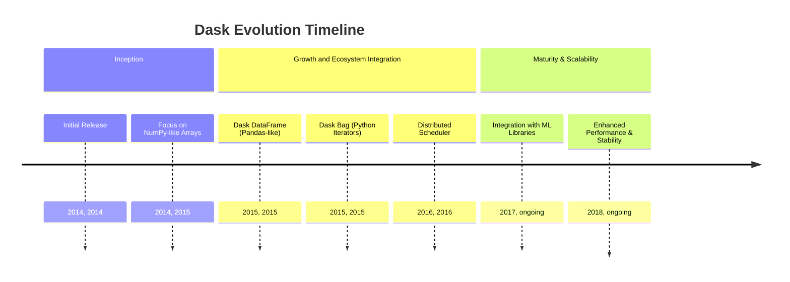
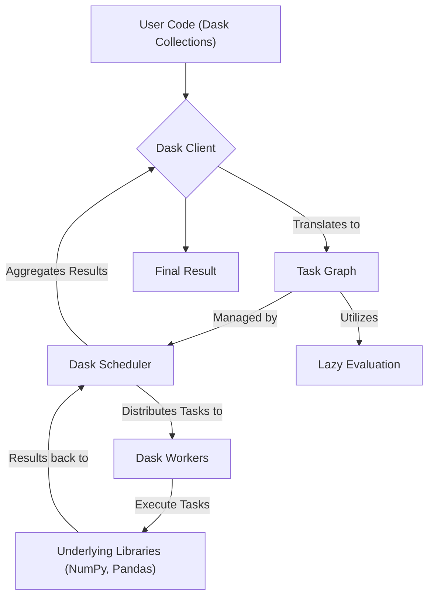
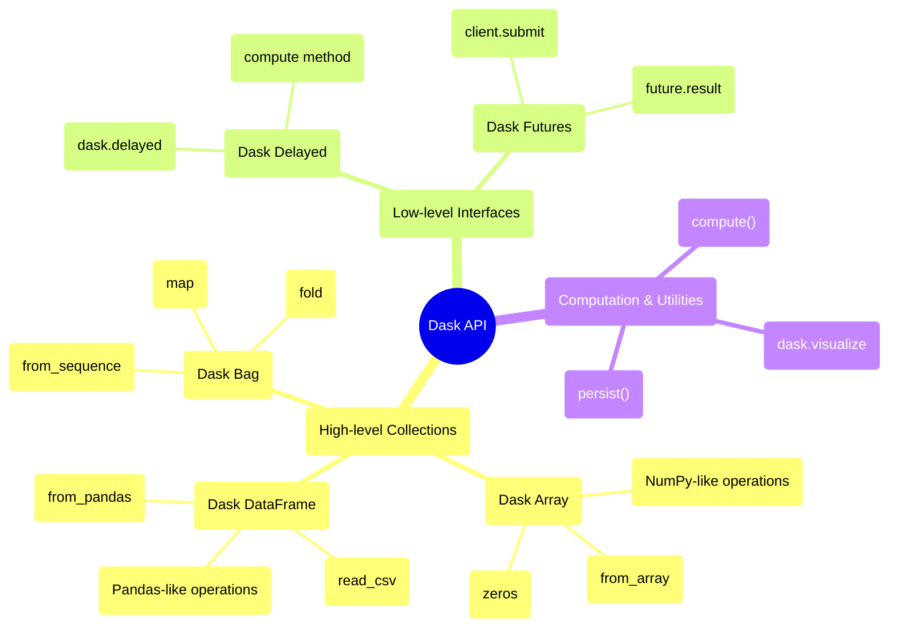

## Dask Evolution Document

### 1. Introduction and Historical Context

Dask is an open-source Python library for parallel and distributed computing. It provides a flexible framework for scaling Python workflows from multi-core local machines to large distributed clusters. Dask is designed to integrate seamlessly with existing PyData libraries like NumPy, Pandas, and Scikit-learn, allowing users to process larger-than-memory datasets and accelerate computations without rewriting their code.

Dask was created by Matthew Rocklin in December 2014. Its development was driven by the need to enhance the existing PyData ecosystem by providing a parallel computing solution that was both powerful and familiar to Python users. Initially, Dask focused on enabling NumPy-like operations on datasets that exceeded available memory on a single machine. Over time, it expanded to support distributed computing, becoming a versatile tool for big data processing and machine learning.

### 1.1. Dask Evolution Timeline

### 2. Core Architecture

Dask's core architecture is built around a client-scheduler-worker model, enabling efficient parallel and distributed execution of computations. It leverages lazy evaluation and task graphs to manage complex workflows.

#### 2.1. Client-Scheduler-Worker Model

*   **Client**: The user's interface to Dask. It translates user code, written with Dask collections (e.g., Dask Array, Dask DataFrame), into a task graph.
*   **Scheduler**: A central process that manages the task graph. It determines the optimal order of task execution, allocates tasks to workers, and monitors their progress. Dask's scheduler is asynchronous and event-driven, capable of handling dynamic worker populations and multiple client requests.
*   **Workers**: These are processes or threads that execute the individual tasks defined in the task graph. Workers can run on the same machine as the client and scheduler (for local parallelism) or be distributed across a cluster (for distributed computing).

#### 2.2. Task Graphs and Lazy Evaluation

Dask breaks down large computations into many smaller tasks, which are represented as a **task graph**. This graph defines the dependencies between tasks. Dask employs **lazy evaluation**, meaning that operations on Dask collections do not immediately compute results. Instead, they build up a task graph. Computation is deferred until results are explicitly needed (e.g., by calling `.compute()`), allowing Dask to optimize the execution plan and perform computations in parallel.

#### 2.3. Dask Collections

Dask provides high-level, parallelized versions of familiar PyData data structures:

*   **Dask Array**: A parallel NumPy array, enabling operations on arrays larger than memory or distributed across a cluster.
*   **Dask DataFrame**: A parallel Pandas DataFrame, allowing for scalable tabular data processing with a familiar Pandas-like API.
*   **Dask Bag**: An unordered collection of Python objects, useful for parallelizing computations on semi-structured or unstructured data, similar to Spark RDDs or Python iterators.

**Mermaid Diagram: Dask Core Architecture**

### 3. Detailed API Overview

Dask's API is designed to be familiar to users of NumPy and Pandas, offering both high-level collections and low-level interfaces for custom parallel workflows.

#### 3.1. High-level Collections

*   **Dask Array (`dask.array`)**:
    *   `dask.array.from_array(x, chunks)`: Creates a Dask Array from a NumPy array.
    *   `dask.array.zeros(shape, dtype)`: Creates a Dask Array filled with zeros.
    *   Supports most NumPy array operations (e.g., `sum()`, `mean()`, `dot()`).
*   **Dask DataFrame (`dask.dataframe`)**:
    *   `dask.dataframe.read_csv(path)`: Reads CSV files into a Dask DataFrame.
    *   `dask.dataframe.from_pandas(df, npartitions)`: Creates a Dask DataFrame from a Pandas DataFrame.
    *   Supports most Pandas DataFrame operations (e.g., `groupby()`, `merge()`, `apply()`).
*   **Dask Bag (`dask.bag`)**:
    *   `dask.bag.from_sequence(seq)`: Creates a Dask Bag from a Python sequence.
    *   `bag.map(func)`: Applies a function to each element in the bag.
    *   `bag.fold(binop)`: Aggregates elements using a binary operator.

#### 3.2. Low-level Interfaces

*   **Dask Delayed (`dask.delayed`)**:
    *   `dask.delayed(func)(*args, **kwargs)`: Wraps a function for lazy evaluation, returning a delayed object.
    *   `delayed_object.compute()`: Triggers the computation of the delayed object.
*   **Dask Futures (`dask.distributed.Client`)**:
    *   `client.submit(func, *args, **kwargs)`: Submits a function for asynchronous execution.
    *   `future.result()`: Blocks until the result is available and returns it.

#### 3.3. Computation and Utilities

*   **`.compute()`**: Triggers the computation of a Dask collection or delayed object.
*   **`.persist()`**: Computes and stores the results of a Dask collection in memory across the cluster.
*   **`dask.visualize(dask_object)`**: Generates a visual representation of the task graph.

### 3.4. API Mindmap

### 4. Evolution and Impact

*   **Scalability for PyData:** Dask has provided a crucial solution for scaling the PyData ecosystem, enabling users to work with datasets that are too large for single-machine memory or to accelerate computations on multi-core processors and clusters.
*   **Familiar API:** By mirroring the APIs of NumPy and Pandas, Dask has a low learning curve for existing Python data scientists, allowing them to transition to parallel and distributed computing with minimal code changes.
*   **Flexible Parallelism:** Its flexible architecture supports various parallel computing patterns, from simple task graphs to complex distributed workflows, making it adaptable to diverse use cases.
*   **Integration with ML Ecosystem:** Dask integrates well with machine learning libraries, allowing for scalable training and preprocessing of models, especially for large datasets.
*   **Active Development and Community:** Dask benefits from active development and a strong community, ensuring continuous improvements, new features, and robust support.

### 5. Conclusion

Dask has emerged as an indispensable library for scalable and distributed computing in Python. Its intelligent architecture, built around task graphs and lazy evaluation, combined with high-level collections that mimic familiar PyData APIs, empowers users to tackle big data challenges with ease. By providing a flexible and performant framework for parallel processing, Dask has significantly extended the capabilities of the Python scientific computing ecosystem, enabling researchers and practitioners to work with larger datasets and more complex models than ever before.
