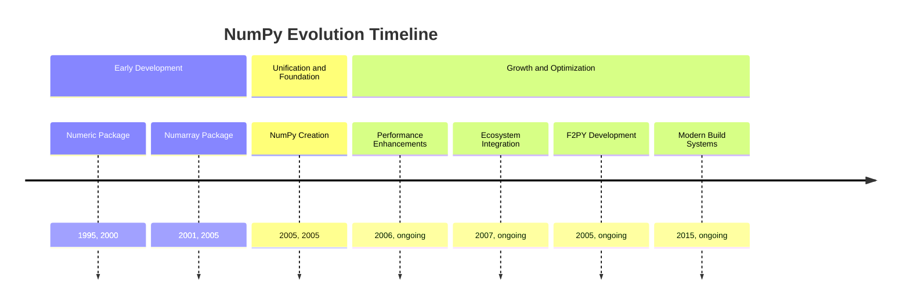
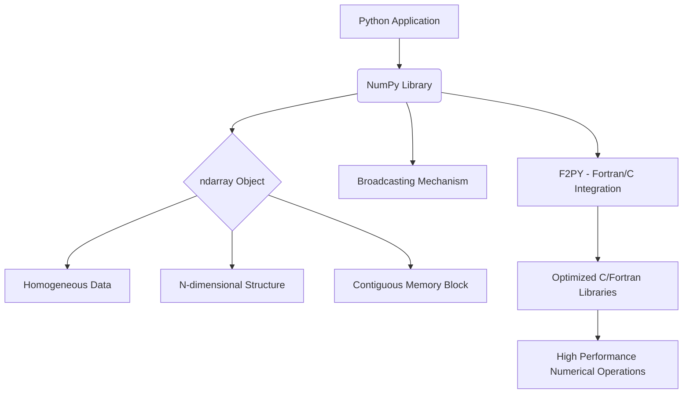
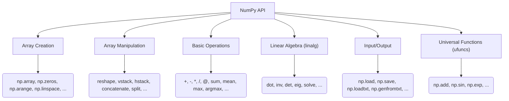
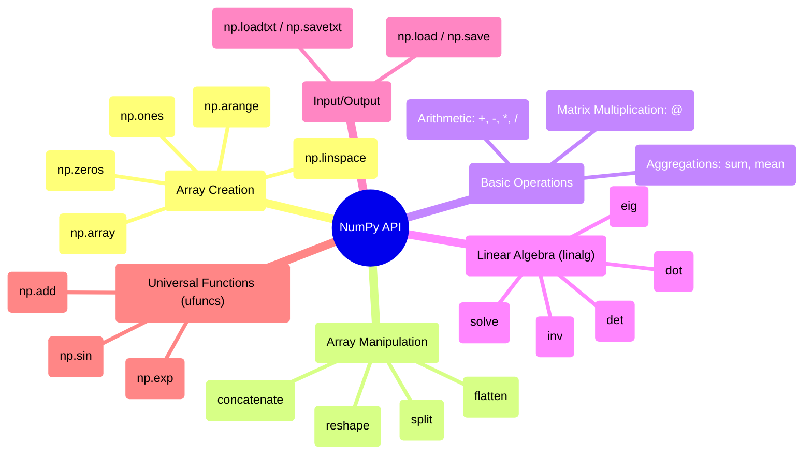

## NumPy Evolution Document

### 1. Introduction and Historical Context

NumPy (Numerical Python) is the fundamental package for scientific computing in Python. It provides a high-performance multidimensional array object, and tools for working with these arrays. It is the cornerstone of the scientific Python ecosystem, enabling efficient numerical operations that are crucial for data science, machine learning, and scientific research.

NumPy's origins trace back to the late 1990s with the development of **Numeric** by Jim Hugunin. Numeric provided a basic array object and operations. Later, **Numarray** emerged as an alternative, offering different features and performance characteristics. The existence of two competing array packages led to fragmentation in the scientific Python community.

In 2005, Travis Oliphant merged the features of Numeric and Numarray into a single package, creating **NumPy**. This unification was a pivotal moment, providing a consistent and powerful array computing foundation that accelerated the growth of the entire scientific Python stack.

### 1.1. NumPy Evolution Timeline



### 2. Core Architecture

The core of NumPy's architecture revolves around the `ndarray` (N-dimensional array) object. This object is a contiguous block of memory that stores homogeneous data (all elements are of the same data type). This design choice is critical for performance, as it allows for efficient memory access and leverages optimized C/Fortran libraries for computations.

#### 2.1. `ndarray` Object

**Mental Model / Analogy:**
Think of an `ndarray` as a highly organized, multi-dimensional container for numbers, similar to a grid or a spreadsheet, but optimized for speed. Unlike Python lists, all its "cells" must hold the same type of data (e.g., all integers, all floats), which is why it's so fast. You can have simple rows (1D), tables (2D), or even cubes and hypercubes (N-dimensional) of numbers.

The `ndarray` is a flexible container for large datasets in Python. It allows for:
*   **Homogeneous Data:** All elements in an `ndarray` must be of the same data type (e.g., integers, floats, booleans). This simplifies memory management and enables highly optimized operations.
*   **N-dimensional:** Arrays can have any number of dimensions, from 1D vectors to 2D matrices and higher-dimensional tensors.
*   **Contiguous Memory:** Data is typically stored in a contiguous block of memory, which is crucial for cache efficiency and vectorized operations.
*   **Metadata:** The `ndarray` object itself stores metadata about the array, such as its shape, data type (`dtype`), and strides (the number of bytes to skip in memory to go to the next element along each dimension).

#### 2.2. Broadcasting

Broadcasting is a powerful mechanism in NumPy that allows arithmetic operations to be performed on arrays of different shapes. It eliminates the need for explicit looping, making code more concise and efficient. When operating on two arrays, NumPy compares their shapes element-wise, starting from the trailing dimensions. If dimensions are compatible (either they are equal, one of them is 1, or one of them is missing), the operation proceeds.

#### 2.3. C/Fortran Integration (F2PY)

A significant architectural aspect of NumPy is its ability to seamlessly integrate with C and Fortran code. This is primarily achieved through **F2PY (Fortran to Python Interface Generator)**. F2PY allows developers to wrap existing Fortran (and C) libraries, exposing their functionalities as Python modules. This enables NumPy to leverage highly optimized numerical routines written in these lower-level languages, providing significant performance gains.

**Mermaid Diagram: NumPy Core Architecture**



### 3. Detailed API Overview

NumPy's API has evolved significantly since its inception, balancing the need for stability with the drive for modernization and consistency. The core functionalities were established with the foundational **NumPy 1.0** release in 2006, providing a stable base that the scientific Python ecosystem could build upon.

Throughout the 1.x release series, the API grew incrementally. New functions were added, and existing ones were refined, but backward compatibility was a primary concern. This long period of stability was crucial for NumPy's adoption. A major evolutionary step occurred with the **NumPy 2.0** release in 2024. This was a transformative release focused on modernizing the library. It introduced a significant cleanup of the API namespace (removing many aliases and lesser-used functions), improved type promotion rules, and adopted the Python Array API Standard to ensure consistency and interoperability with other libraries like PyTorch and JAX.

Here's a breakdown of key areas and their evolution:

#### 3.1. Array Creation Routines

These functions are used to create new NumPy arrays. While the core routines have been stable since version 1.0, this part of the API has also seen significant evolution. For instance, the random number generation system was overhauled in **NumPy 1.17** with the introduction of a new `np.random.Generator` API for more robust and extensible pseudo-random number generation.

##### 3.1.1. Creating Arrays from Existing Python Data

**`np.array(object, dtype=None, ...)`**

**Goal:** Convert a standard Python list or tuple into a NumPy array.

**Code:**
```python
import numpy as np

python_list = [1, 2, 3, 4, 5]
numpy_array = np.array(python_list)
print(numpy_array)
print(type(numpy_array))
```

**Expected Output:**
```
[1 2 3 4 5]
<class 'numpy.ndarray'>
```

**Explanation:** `np.array()` is the most fundamental way to create an array from existing Python sequences. It infers the data type by default, but you can explicitly set it using the `dtype` parameter (e.g., `dtype=np.float64`).

*   **Context:** The most fundamental array creation function. It converts a Python-native data structure (like a list or tuple) into a NumPy `ndarray`.
*   **Parameters:**
    *   `object`: The data to be converted into an array.
    *   `dtype`: (Optional) The desired data type for the array's elements. If not specified, NumPy will infer the type from the input data.
*   **Returns:** An `ndarray` containing the data from the input `object`.

##### 3.1.2. Creating Arrays Filled with Placeholder Values

**`np.zeros(shape, dtype=float, ...)`**

**Goal:** Create an array of a specific shape, filled entirely with zeros.

**Code:**
```python
import numpy as np

zeros_array = np.zeros((2, 3)) # A 2x3 array of zeros
print(zeros_array)
```

**Expected Output:**
```
[[0. 0. 0.]
 [0. 0. 0.]]
```

**Explanation:** This is useful for initializing arrays when you know their size but will populate them with actual data later. The `dtype` defaults to `float` but can be changed (e.g., `dtype=int`).

*   **Context:** Creates an array of a given shape, filled entirely with zeros. This is useful for initializing an array before populating it with values.
*   **Parameters:**
    *   `shape`: An integer or tuple of integers defining the dimensions of the array (e.g., `(2, 3)` for a 2x3 matrix).
    *   `dtype`: (Optional) The data type of the array elements, defaulting to `float`.
*   **Returns:** A new array of the specified shape and type, filled with zeros.

**`np.ones(shape, dtype=float, ...)`**

**Goal:** Create an array of a specific shape, filled entirely with ones.

**Code:**
```python
import numpy as np

ones_array = np.ones((3, 2), dtype=int) # A 3x2 array of ones with integer type
print(ones_array)
```

**Expected Output:**
```
[[1 1]
 [1 1]
 [1 1]]
```

**Explanation:** Similar to `np.zeros()`, but initializes with ones. Specifying `dtype=int` ensures integer values.

*   **Context:** Similar to `np.zeros()`, but creates an array filled with ones.
*   **Parameters:**
    *   `shape`: The dimensions of the array.
    *   `dtype`: (Optional) The data type, defaulting to `float`.
*   **Returns:** A new array of the specified shape and type, filled with ones.

##### 3.1.3. Creating Arrays with Sequences of Numbers

**`np.arange([start,] stop, [step,], dtype=None, ...)`**

**Goal:** Generate an array with a sequence of numbers within a specified range, similar to Python's `range()`.

**Code:**
```python
import numpy as np

# From 0 up to (but not including) 5, with a step of 1
array_range_1 = np.arange(5)
print(f"arange(5): {array_range_1}")

# From 2 up to (but not including) 10, with a step of 2
array_range_2 = np.arange(2, 10, 2)
print(f"arange(2, 10, 2): {array_range_2}")
```

**Expected Output:**
```
arange(5): [0 1 2 3 4]
arange(2, 10, 2): [2 4 6 8]
```

**Explanation:** `np.arange()` is ideal for creating arrays where you need a specific step size between elements. It's very flexible with `start`, `stop`, and `step` parameters.

*   **Context:** Creates an array with regularly spaced values within a given interval. It is similar to Python's built-in `range` function but returns a NumPy array.
*   **Parameters:**
    *   `start`: (Optional) The start of the interval. Defaults to 0.
    *   `stop`: The end of the interval (exclusive).
    *   `step`: (Optional) The spacing between values. Defaults to 1.
*   **Returns:** An `ndarray` with evenly spaced values.

**`np.linspace(start, stop, num=50, ...)`**

**Goal:** Generate an array with a specified number of evenly spaced values over a given interval.

**Code:**
```python
import numpy as np

# 5 evenly spaced points between 0 and 1 (inclusive)
array_linspace = np.linspace(0, 1, num=5)
print(array_linspace)
```

**Expected Output:**
```
[0.   0.25 0.5  0.75 1.  ]
```

**Explanation:** Use `np.linspace()` when you know how many points you need in a range, rather than the step size. The `stop` value is included by default, unlike `np.arange()`.

*   **Context:** Creates an array with a specified number of evenly spaced values over a given interval. This is useful when you know the number of points you need, rather than the step size.
*   **Parameters:**
    *   `start`: The starting value of the sequence.
    *   `stop`: The ending value of the sequence.
    *   `num`: (Optional) The number of samples to generate. Defaults to 50.
*   **Returns:** An `ndarray` of `num` evenly spaced samples from `start` to `stop`.

##### 3.1.4. Quick Reference: Array Creation

| Function | Description | When to Use |
| :--- | :--- | :--- |
| `np.array()` | Create array from Python list/tuple | Converting existing data into an `ndarray`. |
| `np.zeros()` | Create array filled with zeros | Initializing an array of a known shape with placeholder zeros. |
| `np.ones()` | Create array filled with ones | Initializing an array of a known shape with placeholder ones. |
| `np.arange()` | Create array with stepped values | Generating sequences with a specific step size (like Python's `range`). |
| `np.linspace()` | Create array with N evenly spaced values | Generating a specific number of points over an interval (inclusive end). |

#### 3.2. Array Manipulation

The functions for changing an array's shape and structure have remained remarkably stable, as they represent fundamental operations. Most functions in this category, like `reshape` and `concatenate`, have been part of NumPy since its first release, providing a consistent interface for developers.

##### 3.2.1. Changing Array Dimensions

**`ndarray.reshape(shape)`**

**Goal:** Change the shape of an array without changing its data.

**Code:**
```python
import numpy as np

arr = np.arange(6) # [0 1 2 3 4 5]
reshaped_arr = arr.reshape((2, 3)) # Reshape to a 2x3 matrix
print(f"Original array: {arr}")
print(f"Reshaped array (2x3):\n{reshaped_arr}")

# Using -1 to infer a dimension
reshaped_arr_inferred = arr.reshape((3, -1)) # Reshape to 3 rows, infer columns
print(f"Reshaped array (3x-1):\n{reshaped_arr_inferred}")
```

**Expected Output:**
```
Original array: [0 1 2 3 4 5]
Reshaped array (2x3):
[[0 1 2]
 [3 4 5]]
Reshaped array (3x-1):
[[0 1]
 [2 3]
 [4 5]]
```

**Explanation:** `reshape` returns a *view* of the original array if possible, meaning no data is copied. The total number of elements must remain constant. Using `-1` in the `shape` tuple allows NumPy to automatically calculate that dimension.

*   **Context:** Rearranges the elements of an array into a new shape without changing the data. The total number of elements must remain the same.
*   **Parameters:**
    *   `shape`: An integer or tuple of integers defining the new dimensions of the array.
*   **Returns:** A new `ndarray` with the specified shape, sharing the same data as the original array (a "view").

**`ndarray.flatten()`**

**Goal:** Convert a multi-dimensional array into a one-dimensional array.

**Code:**
```python
import numpy as np

matrix = np.array([[1, 2, 3], [4, 5, 6]])
flattened_array = matrix.flatten()
print(f"Original matrix:\n{matrix}")
print(f"Flattened array: {flattened_array}")
```

**Expected Output:**
```
Original matrix:
[[1 2 3]
 [4 5 6]]
Flattened array: [1 2 3 4 5 6]
```

**Explanation:** `flatten()` always returns a *copy* of the array, ensuring that changes to the flattened array do not affect the original. If you need a view, consider `ravel()`.

*   **Context:** Returns a one-dimensional copy of the array.
*   **Returns:** A new 1D `ndarray` containing a copy of the elements from the original array.

##### 3.2.2. Combining and Splitting Arrays

**`np.concatenate((a1, a2, ...), axis=0)`**

**Goal:** Join a sequence of arrays along an existing axis.

**Code:**
```python
import numpy as np

arr1 = np.array([[1, 2], [3, 4]])
arr2 = np.array([[5, 6]])

# Concatenate along axis 0 (rows)
concatenated_rows = np.concatenate((arr1, arr2), axis=0)
print(f"Concatenated rows:\n{concatenated_rows}")

# Concatenate along axis 1 (columns) - requires compatible shapes
arr3 = np.array([[7], [8]])
concatenated_cols = np.concatenate((arr1, arr3), axis=1)
print(f"Concatenated columns:\n{concatenated_cols}")
```

**Expected Output:**
```
Concatenated rows:
[[1 2]
 [3 4]
 [5 6]]
Concatenated columns:
[[1 2 7]
 [3 4 8]]
```

**Explanation:** `np.concatenate()` is highly versatile. The arrays must have the same shape, except for the dimension along which they are being concatenated. `axis=0` means stacking rows, `axis=1` means stacking columns.

*   **Context:** Joins a sequence of arrays along a specified axis.
*   **Parameters:**
    *   `(a1, a2, ...)`: A tuple or sequence of arrays to be joined. They must have the same shape, except in the dimension corresponding to `axis`.
    *   `axis`: (Optional) The axis along which the arrays will be joined. Defaults to 0 (the first dimension).
*   **Returns:** A new `ndarray` containing the concatenated arrays.

**`np.split(ary, indices_or_sections, axis=0)`**

**Goal:** Divide an array into multiple sub-arrays.

**Code:**
```python
import numpy as np

arr = np.arange(9).reshape(3, 3)
print(f"Original array:\n{arr}")

# Split into 3 equal parts along axis 0 (rows)
split_rows = np.split(arr, 3, axis=0)
print(f"\nSplit into 3 rows:\n{split_rows[0]}\n{split_rows[1]}\n{split_rows[2]}")

# Split at specific indices along axis 1 (columns)
split_cols_at_indices = np.split(arr, [1, 2], axis=1)
print(f"\nSplit columns at indices 1 and 2:\n{split_cols_at_indices[0]}\n{split_cols_at_indices[1]}\n{split_cols_at_indices[2]}")
```

**Expected Output:**
```
Original array:
[[0 1 2]
 [3 4 5]
 [6 7 8]]

Split into 3 rows:
[[0 1 2]]
[[3 4 5]]
[[6 7 8]]

Split columns at indices 1 and 2:
[[0]
 [3]
 [6]]
[[1]
 [4]
 [7]]
[[2]
 [5]
 [8]]
```

**Explanation:** `np.split()` can divide an array into equal parts or at specified indices. The `axis` parameter determines along which dimension the split occurs.

*   **Context:** Splits an array into multiple sub-arrays.
*   **Parameters:**
    *   `ary`: The array to be split.
    *   `indices_or_sections`: An integer or a 1-D array. If an integer, the array is split into that many equal-sized sub-arrays. If a 1-D array, it specifies the indices at which to split.
    *   `axis`: (Optional) The axis along which to split. Defaults to 0.
*   **Returns:** A list of `ndarray` objects.

##### 3.2.3. Transposing Arrays

**`ndarray.T`**

**Goal:** Reverse the order of the axes of an array, effectively swapping rows and columns for a 2D array.

**Code:**
```python
import numpy as np

matrix = np.array([[1, 2, 3], [4, 5, 6]])
transposed_matrix = matrix.T
print(f"Original matrix:\n{matrix}")
print(f"\nTransposed matrix:\n{transposed_matrix}")
```

**Expected Output:**
```
Original matrix:
[[1 2 3]
 [4 5 6]]

Transposed matrix:
[[1 4]
 [2 5]
 [3 6]]
```

**Explanation:** The `.T` attribute provides a simple way to get the transpose. For 2D arrays, this means rows become columns and columns become rows. It returns a *view* of the original array, so changes to the transposed array will affect the original.

*   **Context:** A convenient attribute for transposing an array. It reverses the order of the axes. For a 2D array, this swaps the rows and columns.
*   **Returns:** A view of the array with its axes permuted.

##### 3.2.4. Quick Reference: Array Manipulation

| Function/Attribute | Description | When to Use |
| :--- | :--- | :--- |
| `ndarray.reshape()` | Change array dimensions | When you need to logically restructure an array without changing its data. |
| `ndarray.flatten()` | Convert to 1D array (copy) | When you need a flat copy of a multi-dimensional array. |
| `np.concatenate()` | Join arrays along an axis | Combining multiple arrays into a larger one. |
| `np.split()` | Divide array into sub-arrays | Breaking down a large array into smaller, manageable parts. |
| `ndarray.T` | Transpose array | Swapping rows and columns (or reversing axes) of an array. |

#### 3.3. Basic Operations

Element-wise operations are a cornerstone of NumPy's performance. A notable evolution was the introduction of the `@` operator for matrix multiplication in **NumPy 1.10** (following its addition to Python 3.5), providing a cleaner syntax than `np.dot()`. More recently, **NumPy 2.0** enhanced aggregation functions, such as adding a `weights` parameter to `np.quantile` for weighted quantiles.

##### 3.3.1. Element-wise and Matrix Arithmetic

**Arithmetic Operators (`+`, `-`, `*`, `/`, `**`)**

**Goal:** Perform standard arithmetic operations on arrays, element by element.

**Code:**
```python
import numpy as np

arr1 = np.array([1, 2, 3])
arr2 = np.array([10, 20, 30])

print(f"Addition: {arr1 + arr2}")
print(f"Subtraction: {arr2 - arr1}")
print(f"Multiplication: {arr1 * arr2}")
print(f"Division: {arr2 / arr1}")
print(f"Exponentiation: {arr1 ** 2}")

# Broadcasting example
scalar = 5
print(f"Array + scalar: {arr1 + scalar}")
```

**Expected Output:**
```
Addition: [11 22 33]
Subtraction: [ 9 18 27]
Multiplication: [10 40 90]
Division: [10. 10. 10.]
Exponentiation: [1 4 9]
Array + scalar: [ 6  7  8]
```

**Explanation:** NumPy's arithmetic operators work element-wise. If arrays have different but compatible shapes, broadcasting rules apply (e.g., adding a scalar to an array applies the operation to every element).

*   **Context:** These standard operators perform element-wise arithmetic on arrays. The arrays must be of compatible shapes (a concept known as "broadcasting").
*   **Returns:** A new array containing the result of the element-wise operation.

**`@` Operator / `np.dot(a, b)`**

**Goal:** Perform matrix multiplication (dot product).

**Code:**
```python
import numpy as np

matrix_a = np.array([[1, 2], [3, 4]])
matrix_b = np.array([[5, 6], [7, 8]])

# Using the @ operator (preferred for matrix multiplication)
matrix_product_at = matrix_a @ matrix_b
print(f"Matrix product (using @):\n{matrix_product_at}")

# Using np.dot()
matrix_product_dot = np.dot(matrix_a, matrix_b)
print(f"\nMatrix product (using np.dot()):\n{matrix_product_dot}")

# Dot product of 1D arrays (inner product)
vec_a = np.array([1, 2, 3])
vec_b = np.array([4, 5, 6])
inner_product = np.dot(vec_a, vec_b)
print(f"\nInner product of vectors: {inner_product}")
```

**Expected Output:**
```
Matrix product (using @):
[[19 22]
 [43 50]]

Matrix product (using np.dot()):
[[19 22]
 [43 50]]

Inner product of vectors: 32
```

**Explanation:** The `@` operator (introduced in Python 3.5 and NumPy 1.10) is the idiomatic way to perform matrix multiplication. `np.dot()` can also be used and is more versatile, handling both matrix products and inner products of 1D arrays.

*   **Context:** Performs matrix multiplication. For 2D arrays, this is the standard matrix product. For 1D arrays, it is the inner product of vectors.
*   **Parameters:**
    *   `a`, `b`: The arrays to be multiplied.
*   **Returns:** The dot product of `a` and `b`.

##### 3.3.2. Aggregation and Reduction

**`np.sum(a, axis=None, ...)`**

**Goal:** Calculate the sum of array elements, optionally along a specific axis.

**Code:**
```python
import numpy as np

arr = np.array([[1, 2, 3], [4, 5, 6]])

# Sum of all elements
total_sum = np.sum(arr)
print(f"Total sum: {total_sum}")

# Sum along axis 0 (columns, reducing rows)
sum_axis_0 = np.sum(arr, axis=0)
print(f"Sum along axis 0: {sum_axis_0}")

# Sum along axis 1 (rows, reducing columns)
sum_axis_1 = np.sum(arr, axis=1)
print(f"Sum along axis 1: {sum_axis_1}")
```

**Expected Output:**
```
Total sum: 21
Sum along axis 0: [5 7 9]
Sum along axis 1: [ 6 15]
```

**Explanation:** `np.sum()` is fundamental for aggregation. The `axis` parameter is crucial for controlling the dimension along which the sum is performed. `axis=None` sums all elements.

*   **Context:** Computes the sum of array elements over a given axis.
*   **Parameters:**
    *   `a`: The array to be summed.
    *   `axis`: (Optional) The axis along which the sum is computed. If `None`, the sum of all elements is calculated.
*   **Returns:** An array with the specified axis removed, or a scalar if `axis` is `None`.

**`np.mean(a, axis=None, ...)`**

**Goal:** Calculate the arithmetic mean (average) of array elements, optionally along a specific axis.

**Code:**
```python
import numpy as np

arr = np.array([[1, 2, 3], [4, 5, 6]])

# Mean of all elements
total_mean = np.mean(arr)
print(f"Total mean: {total_mean}")

# Mean along axis 0
mean_axis_0 = np.mean(arr, axis=0)
print(f"Mean along axis 0: {mean_axis_0}")
```

**Expected Output:**
```
Total mean: 3.5
Mean along axis 0: [2.5 3.5 4.5]
```

**Explanation:** Similar to `np.sum()`, `np.mean()` calculates the average. The `axis` parameter works identically for controlling the dimension of reduction.

*   **Context:** Computes the arithmetic mean of array elements over a given axis.
*   **Parameters:**
    *   `a`: The array to compute the mean of.
    *   `axis`: (Optional) The axis along which the mean is computed.
    *   **Returns:** The average of the array elements.

**`ndarray.argmax(axis=None, ...)`**

**Goal:** Find the indices of the maximum values along a specified axis.

**Code:**
```python
import numpy as np

arr = np.array([[1, 5, 2], [8, 3, 6]])

# Index of maximum value in the flattened array
argmax_flat = arr.argmax()
print(f"Index of max (flattened): {argmax_flat}")

# Indices of maximum values along axis 0
argmax_axis_0 = arr.argmax(axis=0)
print(f"Indices of max along axis 0: {argmax_axis_0}")

# Indices of maximum values along axis 1
argmax_axis_1 = arr.argmax(axis=1)
print(f"Indices of max along axis 1: {argmax_axis_1}")
```

**Expected Output:**
```
Index of max (flattened): 3
Indices of max along axis 0: [1 0 1]
Indices of max along axis 1: [1 0]
```

**Explanation:** `argmax()` is useful for identifying the *position* of the largest element. When `axis` is specified, it returns an array of indices, one for each slice along that axis.

*   **Context:** Returns the indices of the maximum values along a specified axis.
*   **Parameters:**
    *   `axis`: (Optional) The axis by which to find the maximum indices. If `None`, the index is into the flattened array.
*   **Returns:** An array of indices into the array.

##### 3.3.3. Quick Reference: Basic Operations

| Operator/Function | Description | When to Use |
| :--- | :--- | :--- |
| `+`, `-`, `*`, `/`, `**` | Element-wise arithmetic | Performing calculations on arrays where each element is operated on individually. |
| `@` / `np.dot()` | Matrix multiplication / Dot product | Performing linear algebra operations like matrix products. |
| `np.sum()` | Sum of elements | Calculating the total or sub-total of elements in an array. |
| `np.mean()` | Mean of elements | Calculating the average of elements in an array. |
| `ndarray.argmax()` | Index of maximum value | Finding the position of the largest element along an axis. |

#### 3.4. Linear Algebra (`numpy.linalg`)

The `numpy.linalg` submodule provides a stable interface to highly optimized linear algebra libraries like BLAS and LAPACK. While the underlying implementations have been continuously improved for performance, the Python-facing API has remained largely consistent to ensure that code relying on these fundamental operations does not break.

##### 3.4.1. Fundamental Matrix Operations

**`np.linalg.inv(a)`**

**Goal:** Compute the multiplicative inverse of a square matrix.

**Code:**
```python
import numpy as np

matrix = np.array([[1, 2], [3, 4]])
inverse_matrix = np.linalg.inv(matrix)
print(f"Original matrix:\n{matrix}")
print(f"\nInverse matrix:\n{inverse_matrix}")

# Verify: matrix @ inverse_matrix should be identity matrix
identity_check = matrix @ inverse_matrix
print(f"\nIdentity check (matrix @ inverse):\n{identity_check}")
```

**Expected Output:**
```
Original matrix:
[[1 2]
 [3 4]]

Inverse matrix:
[[-2.   1. ]
 [ 1.5 -0.5]]

Identity check (matrix @ inverse):
[[1.0000000e+00 0.0000000e+00]
 [0.0000000e+00 1.0000000e+00]]
```

**Explanation:** The inverse of a matrix `A` is a matrix `B` such that `A @ B` (or `B @ A`) is the identity matrix. This operation is crucial for solving systems of linear equations and other advanced linear algebra tasks.

*   **Context:** Computes the multiplicative inverse of a matrix.
*   **Parameters:**
    *   `a`: The matrix to be inverted. Must be square.
*   **Returns:** The inverse of the matrix `a`.

**`np.linalg.det(a)`**

**Goal:** Compute the determinant of a square matrix.

**Code:**
```python
import numpy as np

matrix = np.array([[1, 2], [3, 4]])
determinant = np.linalg.det(matrix)
print(f"Matrix:\n{matrix}")
print(f"\nDeterminant: {determinant}")
```

**Expected Output:**
```
Matrix:
[[1 2]
 [3 4]]

Determinant: -2.0000000000000004
```

**Explanation:** The determinant is a scalar value that can be computed from the elements of a square matrix. It provides important information about the matrix, such as whether it is invertible (a non-zero determinant means it is invertible).

*   **Context:** Computes the determinant of a square matrix.
*   **Parameters:**
    *   `a`: The input matrix.
*   **Returns:** The determinant of `a`.

**`np.linalg.eig(a)`**

**Goal:** Compute the eigenvalues and right eigenvectors of a square matrix.

**Code:**
```python
import numpy as np

matrix = np.array([[3, -2], [1, 0]])
eigenvalues, eigenvectors = np.linalg.eig(matrix)
print(f"Matrix:\n{matrix}")
print(f"\nEigenvalues: {eigenvalues}")
print(f"\nEigenvectors:\n{eigenvectors}")
```

**Expected Output:**
```
Matrix:
[[ 3 -2]
 [ 1  0]]

Eigenvalues: [2. 1.]

Eigenvectors:
[[0.89442719 0.70710678]
 [0.4472136  0.70710678]]
```

**Explanation:** Eigenvalues and eigenvectors are fundamental concepts in linear algebra, particularly in areas like principal component analysis (PCA) and quantum mechanics. An eigenvector of a linear transformation is a non-zero vector that changes at most by a scalar factor when that linear transformation is applied to it.

*   **Context:** Computes the eigenvalues and right eigenvectors of a square matrix.
*   **Parameters:**
    *   `a`: The matrix for which to compute the eigenvalues and eigenvectors.
*   **Returns:** A tuple containing:
    *   An array of the eigenvalues.
    *   An array where each column is the corresponding eigenvector.

**`np.linalg.solve(a, b)`**

**Goal:** Solve a linear matrix equation of the form `ax = b` for `x`.

**Code:**
```python
import numpy as np

# System of equations:
# 2x + 3y = 8
# 1x + 2y = 5

a = np.array([[2, 3], [1, 2]]) # Coefficient matrix
b = np.array([8, 5]) # Dependent variable values

x = np.linalg.solve(a, b)
print(f"Coefficient matrix (a):\n{a}")
print(f"Dependent variable values (b): {b}")
print(f"\nSolution (x): {x}")

# Verify the solution: a @ x should be approximately b
verification = a @ x
print(f"Verification (a @ x): {verification}")
```

**Expected Output:**
```
Coefficient matrix (a):
[[2 3]
 [1 2]]
Dependent variable values (b): [8 5]

Solution (x): [1. 2.]
Verification (a @ x): [8. 5.]
```

**Explanation:** This function is used to efficiently solve systems of linear equations. It is generally preferred over computing the inverse of `a` and then multiplying by `b` (`np.linalg.inv(a) @ b`) for numerical stability and performance.

*   **Context:** Solves a linear matrix equation `ax = b` for `x`.
*   **Parameters:**
    *   `a`: The coefficient matrix.
    *   `b`: The ordinate or "dependent variable" values.
*   **Returns:** The solution to the system `ax = b`.

##### 3.4.2. Quick Reference: Linear Algebra

| Function | Description | When to Use |
| :--- | :--- | :--- |
| `np.linalg.inv()` | Matrix inverse | Solving linear systems, finding inverse transformations. |
| `np.linalg.det()` | Matrix determinant | Checking matrix invertibility, geometric interpretations. |
| `np.linalg.eig()` | Eigenvalues and eigenvectors | Principal Component Analysis (PCA), stability analysis. |
| `np.linalg.solve()` | Solve linear system `ax = b` | Efficiently finding `x` in linear equations, numerically stable. |

#### 3.5. Input/Output

NumPy's I/O functions are designed for both simplicity and performance. While `np.loadtxt` is useful for simple text files, `np.genfromtxt` was introduced to provide a more robust way to handle files with missing data. For performance-critical applications, the binary `.npy` and `.npz` formats have been the standard since early versions.

##### 3.5.1. Binary File I/O (.npy, .npz)

**`np.save(file, arr)`**

**Goal:** Save a single NumPy array to a binary file in the `.npy` format.

**Code:**
```python
import numpy as np
import os

arr_to_save = np.array([10, 20, 30, 40, 50])
filename = "my_array.npy"

np.save(filename, arr_to_save)
print(f"Array saved to {filename}")

# Clean up the created file
os.remove(filename)
print(f"Cleaned up {filename}")
```

**Expected Output:**
```
Array saved to my_array.npy
Cleaned up my_array.npy
```

**Explanation:** The `.npy` format is the standard binary file format for NumPy arrays. It's efficient for storing and loading arrays, preserving `dtype` and `shape` information. It's highly recommended for interchanging data between NumPy sessions.

*   **Context:** Saves a single array to a binary file in NumPy's `.npy` format.
*   **Parameters:**
    *   `file`: The filename (or file object) to which to save the data.
    *   `arr`: The array to be saved.

**`np.load(file)`**

**Goal:** Load an array from a `.npy` or `.npz` file.

**Code:**
```python
import numpy as np
import os

# First, save an array to load it later
arr_original = np.array([[1, 2], [3, 4]])
filename = "temp_array_to_load.npy"
np.save(filename, arr_original)

# Now, load the array
loaded_arr = np.load(filename)
print(f"Original array:\n{arr_original}")
print(f"\nLoaded array:\n{loaded_arr}")

# Clean up the created file
os.remove(filename)
print(f"Cleaned up {filename}")
```

**Expected Output:**
```
Original array:
[[1 2]
 [3 4]]

Loaded array:
[[1 2]
 [3 4]]
Cleaned up temp_array_to_load.npy
```

**Explanation:** `np.load()` is the counterpart to `np.save()`. It can automatically detect the file type (`.npy` or `.npz`) and reconstruct the array with its original `dtype` and `shape`.

*   **Context:** Loads an array from a `.npy` or `.npz` file.
*   **Parameters:**
    *   `file`: The file to read.
*   **Returns:** The array stored in the file.

##### 3.5.2. Text File I/O

**`np.savetxt(fname, X, fmt='%.18e', delimiter=' ', ...)`**

**Goal:** Save an array to a plain text file.

**Code:**
```python
import numpy as np
import os

arr_to_save_txt = np.array([[1.1, 2.2], [3.3, 4.4]])
filename_txt = "my_data.txt"

np.savetxt(filename_txt, arr_to_save_txt, fmt='%.2f', delimiter=',')
print(f"Array saved to {filename_txt}")

# Verify content (optional)
with open(filename_txt, 'r') as f:
    print(f"\nContent of {filename_txt}:\n{f.read()}")

# Clean up the created file
os.remove(filename_txt)
print(f"Cleaned up {filename_txt}")
```

**Expected Output:**
```
Array saved to my_data.txt

Content of my_data.txt:
1.10,2.20
3.30,4.40

Cleaned up my_data.txt
```

**Explanation:** `np.savetxt()` is useful for exporting data to human-readable formats or for compatibility with other software that expects text-based data. You can control the format of numbers (`fmt`) and the delimiter.

*   **Context:** Saves an array to a text file.
*   **Parameters:**
    *   `fname`: The filename.
    *   `X`: The array to be saved.
    *   `fmt`: (Optional) A format string for the numbers.
    *   `delimiter`: (Optional) The string used to separate values.

**`np.loadtxt(fname, dtype=float, delimiter=None, ...)`**

**Goal:** Load data from a plain text file into a NumPy array.

**Code:**
```python
import numpy as np
import os

# Create a dummy text file to load
text_data = "10 20\n30 40"
filename_to_load = "data_to_load.txt"
with open(filename_to_load, 'w') as f:
    f.write(text_data)

# Load the data
loaded_from_txt = np.loadtxt(filename_to_load, dtype=int)
print(f"Content of {filename_to_load}:\n{text_data}")
print(f"\nLoaded array:\n{loaded_from_txt}")

# Clean up the created file
os.remove(filename_to_load)
print(f"Cleaned up {filename_to_load}")
```

**Expected Output:**
```
Content of data_to_load.txt:
10 20
30 40

Loaded array:
[[10 20]
 [30 40]]
Cleaned up data_to_load.txt
```

**Explanation:** `np.loadtxt()` is designed for reading simple text files where data is organized in columns. It can infer data types or you can specify them with `dtype`. For more complex text files (e.g., with missing values or headers), `np.genfromtxt()` is a more robust alternative.

*   **Context:** Loads data from a text file.
*   **Parameters:**
    *   `fname`: The filename.
    *   `dtype`: (Optional) The data type of the resulting array.
    *   `delimiter`: (Optional) The string used to separate values.
*   **Returns:** An `ndarray` containing the data from the file.

##### 3.5.3. Quick Reference: Input/Output

| Function | Description | When to Use |
| :--- | :--- | :--- |
| `np.save()` | Save array to binary `.npy` | Efficiently store and load single NumPy arrays, preserving metadata. |
| `np.load()` | Load array from binary `.npy` or `.npz` | Retrieve arrays saved in NumPy's binary formats. |
| `np.savetxt()` | Save array to text file | Exporting data to human-readable text files, or for compatibility with other software. |
| `np.loadtxt()` | Load array from text file | Importing simple, column-oriented data from text files. |

#### 3.6. Universal Functions (ufuncs)

Ufuncs are the core of NumPy's element-wise operations. They are functions that operate on `ndarray`s in an element-by-element fashion, supporting features like array broadcasting and type casting. A key evolutionary step was the introduction of the `__array_ufunc__` protocol in **NumPy 1.13**, which allowed other libraries to interoperate with NumPy's ufuncs.

*   **Context:** Ufuncs provide a "vectorized" wrapper for functions that take a fixed number of scalar inputs and produce a fixed number of scalar outputs. This means they can apply a function to every element of an array without requiring an explicit Python loop, which leads to significant performance gains.

##### 3.6.1. Element-wise Mathematical Operations

**Common Examples: `np.add`, `np.subtract`, `np.multiply`, `np.divide`, `np.sin`, `np.cos`, `np.exp`, `np.sqrt`, `np.log`**

**Goal:** Apply common mathematical operations to each element of an array efficiently.

**Code:**
```python
import numpy as np

arr = np.array([1, 2, 3, 4])

# Element-wise addition
added_arr = np.add(arr, 10)
print(f"np.add(arr, 10): {added_arr}")

# Element-wise sine
sin_arr = np.sin(arr)
print(f"np.sin(arr): {sin_arr}")

# Element-wise square root
sqrt_arr = np.sqrt(arr)
print(f"np.sqrt(arr): {sqrt_arr}")

# Element-wise natural logarithm
log_arr = np.log(arr)
print(f"np.log(arr): {log_arr}")
```

**Expected Output:**
```
np.add(arr, 10): [11 12 13 14]
np.sin(arr): [0.84147098 0.90929743 0.14112001 -0.7568025 ]
np.sqrt(arr): [1.         1.41421356 1.73205081 2.        ]
np.log(arr): [0.         0.69314718 1.09861229 1.38629436]
```

**Explanation:** Ufuncs are highly optimized C functions that operate on arrays element by element. They are much faster than writing explicit Python loops for the same operations, especially for large arrays. They also support broadcasting, allowing operations between arrays of different shapes (if compatible).

*   **Common Examples:**
    *   **`np.add`**, **`np.subtract`**, **`np.multiply`**, **`np.divide`**: These correspond to the basic arithmetic operators (`+`, `-`, `*`, `/`).
    *   **`np.sin`**, **`np.cos`**, **`np.exp`**: These are examples of common mathematical functions that can be applied element-wise.
    *   **`np.sqrt`**: Computes the non-negative square root of each element.
    *   **`np.log`**: Computes the natural logarithm of each element.

##### 3.6.2. Quick Reference: Universal Functions (ufuncs)

| Function | Description | When to Use |
| :--- | :--- | :--- |
| `np.add`, `np.subtract`, etc. | Element-wise arithmetic | Performing vectorized arithmetic operations. |
| `np.sin`, `np.cos`, `np.exp`, etc. | Element-wise mathematical functions | Applying common mathematical functions to every element of an array. |
| `np.sqrt` | Element-wise square root | Calculating the square root of each element. |
| `np.log` | Element-wise natural logarithm | Calculating the natural logarithm of each element. |

**Mermaid Diagram: Simplified NumPy API Structure**



### 3.7. API Mindmap



### 4. Evolution and Impact

NumPy's evolution has been driven by the needs of the scientific computing community, focusing on performance, ease of use, and broad applicability.

*   **Performance Optimization:** Continuous efforts have been made to optimize NumPy's performance, including leveraging SIMD (Single Instruction, Multiple Data) instructions, improving memory management, and enhancing its C/Fortran integration. The build options for CPU features (`cpu-baseline`, `cpu-dispatch`) demonstrate this focus on hardware-specific optimizations.
*   **Ecosystem Foundation:** NumPy's stable and efficient `ndarray` has become the de facto standard for numerical data interchange in Python. Libraries like SciPy, Pandas, Matplotlib, Scikit-learn, and TensorFlow all build upon or integrate deeply with NumPy arrays.
*   **Community and Development:** NumPy has a vibrant open-source community that contributes to its development, documentation, and maintenance. The `spin` utility for running tests and `scipy-doctest` for documentation checks highlight the robust development and testing practices.
*   **Interoperability:** F2PY remains a key feature, allowing researchers and developers to integrate high-performance legacy code written in Fortran or C, extending Python's capabilities without rewriting core numerical algorithms.
*   **Modern Build Systems:** The adoption of tools like `scikit-build` and `meson-python` for building NumPy extensions reflects a move towards more modern and robust build processes, especially for complex projects involving compiled languages.

### 5. Conclusion

NumPy's journey from disparate array packages to a unified, high-performance foundation has been transformative for scientific computing in Python. Its `ndarray` object, coupled with powerful broadcasting, extensive API, and seamless C/Fortran integration, provides an unparalleled platform for numerical operations. The ongoing evolution, driven by performance optimization and community contributions, ensures NumPy remains at the forefront of scientific data processing, continuing to empower researchers and developers across various domains.