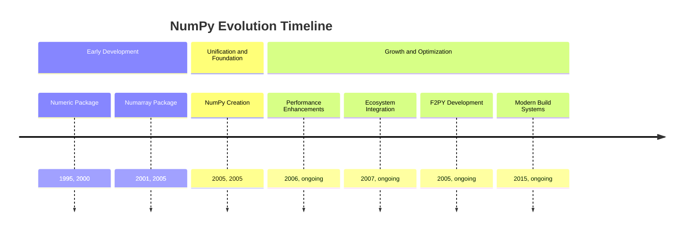
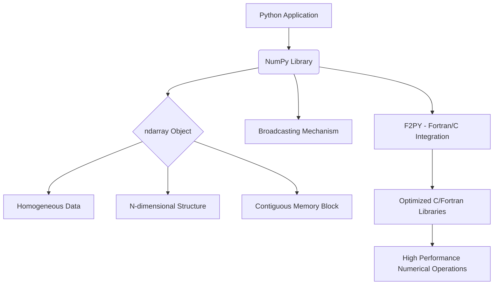
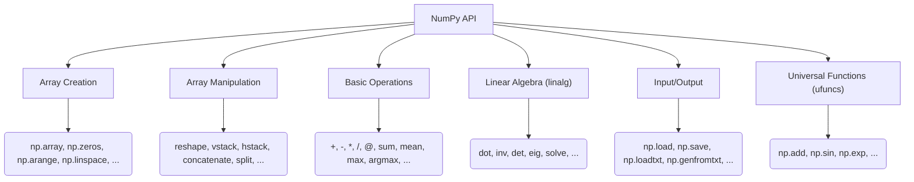
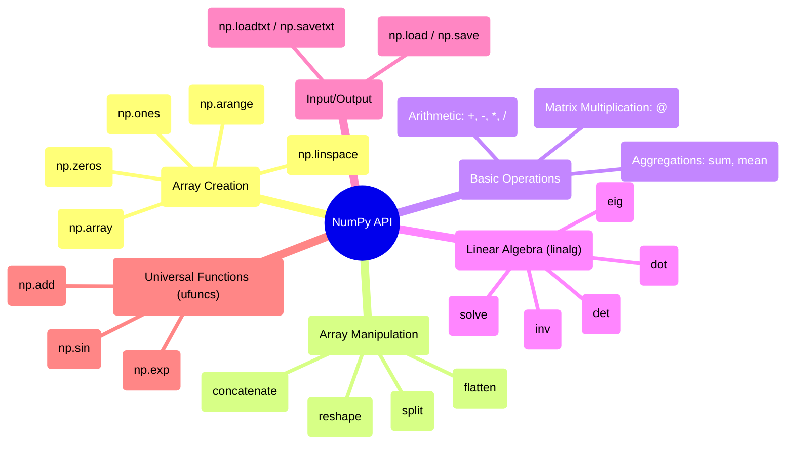

## NumPy Evolution Document

### 1. Introduction and Historical Context

NumPy (Numerical Python) is the fundamental package for scientific computing in Python. It provides a high-performance multidimensional array object, and tools for working with these arrays. It is the cornerstone of the scientific Python ecosystem, enabling efficient numerical operations that are crucial for data science, machine learning, and scientific research.

NumPy's origins trace back to the late 1990s with the development of **Numeric** by Jim Hugunin. Numeric provided a basic array object and operations. Later, **Numarray** emerged as an alternative, offering different features and performance characteristics. The existence of two competing array packages led to fragmentation in the scientific Python community.

In 2005, Travis Oliphant merged the features of Numeric and Numarray into a single package, creating **NumPy**. This unification was a pivotal moment, providing a consistent and powerful array computing foundation that accelerated the growth of the entire scientific Python stack.

### 1.1. NumPy Evolution Timeline



### 2. Core Architecture

The core of NumPy's architecture revolves around the `ndarray` (N-dimensional array) object. This object is a contiguous block of memory that stores homogeneous data (all elements are of the same data type). This design choice is critical for performance, as it allows for efficient memory access and leverages optimized C/Fortran libraries for computations.

#### 2.1. `ndarray` Object

The `ndarray` is a flexible container for large datasets in Python. It allows for:
*   **Homogeneous Data:** All elements in an `ndarray` must be of the same data type (e.g., integers, floats, booleans). This simplifies memory management and enables highly optimized operations.
*   **N-dimensional:** Arrays can have any number of dimensions, from 1D vectors to 2D matrices and higher-dimensional tensors.
*   **Contiguous Memory:** Data is typically stored in a contiguous block of memory, which is crucial for cache efficiency and vectorized operations.
*   **Metadata:** The `ndarray` object itself stores metadata about the array, such as its shape, data type (`dtype`), and strides (the number of bytes to skip in memory to go to the next element along each dimension).

#### 2.2. Broadcasting

Broadcasting is a powerful mechanism in NumPy that allows arithmetic operations to be performed on arrays of different shapes. It eliminates the need for explicit looping, making code more concise and efficient. When operating on two arrays, NumPy compares their shapes element-wise, starting from the trailing dimensions. If dimensions are compatible (either they are equal, one of them is 1, or one of them is missing), the operation proceeds.

#### 2.3. C/Fortran Integration (F2PY)

A significant architectural aspect of NumPy is its ability to seamlessly integrate with C and Fortran code. This is primarily achieved through **F2PY (Fortran to Python Interface Generator)**. F2PY allows developers to wrap existing Fortran (and C) libraries, exposing their functionalities as Python modules. This enables NumPy to leverage highly optimized numerical routines written in these lower-level languages, providing significant performance gains.

**Mermaid Diagram: NumPy Core Architecture**



### 3. Detailed API Overview

NumPy's API has evolved significantly since its inception, balancing the need for stability with the drive for modernization and consistency. The core functionalities were established with the foundational **NumPy 1.0** release in 2006, providing a stable base that the scientific Python ecosystem could build upon.

Throughout the 1.x release series, the API grew incrementally. New functions were added, and existing ones were refined, but backward compatibility was a primary concern. This long period of stability was crucial for NumPy's adoption. A major evolutionary step occurred with the **NumPy 2.0** release in 2024. This was a transformative release focused on modernizing the library. It introduced a significant cleanup of the API namespace (removing many aliases and lesser-used functions), improved type promotion rules, and adopted the Python Array API Standard to ensure consistency and interoperability with other libraries like PyTorch and JAX.

Here's a breakdown of key areas and their evolution:

#### 3.1. Array Creation Routines

These functions are used to create new NumPy arrays. While the core routines have been stable since version 1.0, this part of the API has also seen significant evolution. For instance, the random number generation system was overhauled in **NumPy 1.17** with the introduction of a new `np.random.Generator` API for more robust and extensible pseudo-random number generation.

*   **`np.array(object, dtype=None, ...)`**
    *   **Context:** The most fundamental array creation function. It converts a Python-native data structure (like a list or tuple) into a NumPy `ndarray`.
    *   **Parameters:**
        *   `object`: The data to be converted into an array.
        *   `dtype`: (Optional) The desired data type for the array's elements. If not specified, NumPy will infer the type from the input data.
    *   **Returns:** An `ndarray` containing the data from the input `object`.

*   **`np.zeros(shape, dtype=float, ...)`**
    *   **Context:** Creates an array of a given shape, filled entirely with zeros. This is useful for initializing an array before populating it with values.
    *   **Parameters:**
        *   `shape`: An integer or tuple of integers defining the dimensions of the array (e.g., `(2, 3)` for a 2x3 matrix).
        *   `dtype`: (Optional) The data type of the array elements, defaulting to `float`.
    *   **Returns:** A new array of the specified shape and type, filled with zeros.

*   **`np.ones(shape, dtype=float, ...)`**
    *   **Context:** Similar to `np.zeros()`, but creates an array filled with ones.
    *   **Parameters:**
        *   `shape`: The dimensions of the array.
        *   `dtype`: (Optional) The data type, defaulting to `float`.
    *   **Returns:** A new array of the specified shape and type, filled with ones.

*   **`np.arange([start,] stop, [step,], dtype=None, ...)`**
    *   **Context:** Creates an array with regularly spaced values within a given interval. It is similar to Python's built-in `range` function but returns a NumPy array.
    *   **Parameters:**
        *   `start`: (Optional) The start of the interval. Defaults to 0.
        *   `stop`: The end of the interval (exclusive).
        *   `step`: (Optional) The spacing between values. Defaults to 1.
    *   **Returns:** An `ndarray` with evenly spaced values.

*   **`np.linspace(start, stop, num=50, ...)`**
    *   **Context:** Creates an array with a specified number of evenly spaced values over a given interval. This is useful when you know the number of points you need, rather than the step size.
    *   **Parameters:**
        *   `start`: The starting value of the sequence.
        *   `stop`: The ending value of the sequence.
        *   `num`: (Optional) The number of samples to generate. Defaults to 50.
    *   **Returns:** An `ndarray` of `num` evenly spaced samples from `start` to `stop`.

#### 3.2. Array Manipulation

The functions for changing an array's shape and structure have remained remarkably stable, as they represent fundamental operations. Most functions in this category, like `reshape` and `concatenate`, have been part of NumPy since its first release, providing a consistent interface for developers.

*   **`ndarray.reshape(shape)`**
    *   **Context:** Rearranges the elements of an array into a new shape without changing the data. The total number of elements must remain the same.
    *   **Parameters:**
        *   `shape`: An integer or tuple of integers defining the new dimensions of the array.
    *   **Returns:** A new `ndarray` with the specified shape, sharing the same data as the original array (a "view").

*   **`ndarray.flatten()`**
    *   **Context:** Returns a one-dimensional copy of the array.
    *   **Returns:** A new 1D `ndarray` containing a copy of the elements from the original array.

*   **`np.concatenate((a1, a2, ...), axis=0)`**
    *   **Context:** Joins a sequence of arrays along a specified axis.
    *   **Parameters:**
        *   `(a1, a2, ...)`: A tuple or sequence of arrays to be joined. They must have the same shape, except in the dimension corresponding to `axis`.
        *   `axis`: (Optional) The axis along which the arrays will be joined. Defaults to 0 (the first dimension).
    *   **Returns:** A new `ndarray` containing the concatenated arrays.

*   **`np.split(ary, indices_or_sections, axis=0)`**
    *   **Context:** Splits an array into multiple sub-arrays.
    *   **Parameters:**
        *   `ary`: The array to be split.
        *   `indices_or_sections`: An integer or a 1-D array. If an integer, the array is split into that many equal-sized sub-arrays. If a 1-D array, it specifies the indices at which to split.
        *   `axis`: (Optional) The axis along which to split. Defaults to 0.
    *   **Returns:** A list of `ndarray` objects.

*   **`ndarray.T`**
    *   **Context:** A convenient attribute for transposing an array. It reverses the order of the axes. For a 2D array, this swaps the rows and columns.
    *   **Returns:** A view of the array with its axes permuted.

#### 3.3. Basic Operations

Element-wise operations are a cornerstone of NumPy's performance. A notable evolution was the introduction of the `@` operator for matrix multiplication in **NumPy 1.10** (following its addition to Python 3.5), providing a cleaner syntax than `np.dot()`. More recently, **NumPy 2.0** enhanced aggregation functions, such as adding a `weights` parameter to `np.quantile` for weighted quantiles.

*   **Arithmetic Operators (`+`, `-`, `*`, `/`, `**`)**
    *   **Context:** These standard operators perform element-wise arithmetic on arrays. The arrays must be of compatible shapes (a concept known as "broadcasting").
    *   **Returns:** A new array containing the result of the element-wise operation.

*   **`@` Operator / `np.dot(a, b)`**
    *   **Context:** Performs matrix multiplication. For 2D arrays, this is the standard matrix product. For 1D arrays, it is the inner product of vectors.
    *   **Parameters:**
        *   `a`, `b`: The arrays to be multiplied.
    *   **Returns:** The dot product of `a` and `b`.

*   **`np.sum(a, axis=None, ...)`**
    *   **Context:** Computes the sum of array elements over a given axis.
    *   **Parameters:**
        *   `a`: The array to be summed.
        *   `axis`: (Optional) The axis along which the sum is computed. If `None`, the sum of all elements is calculated.
    *   **Returns:** An array with the specified axis removed, or a scalar if `axis` is `None`.

*   **`np.mean(a, axis=None, ...)`**
    *   **Context:** Computes the arithmetic mean of array elements over a given axis.
    *   **Parameters:**
        *   `a`: The array to compute the mean of.
        *   `axis`: (Optional) The axis along which the mean is computed.
    *   **Returns:** The average of the array elements.

*   **`ndarray.argmax(axis=None, ...)`**
    *   **Context:** Returns the indices of the maximum values along a specified axis.
    *   **Parameters:**
        *   `axis`: (Optional) The axis by which to find the maximum indices. If `None`, the index is into the flattened array.
    *   **Returns:** An array of indices into the array.

#### 3.4. Linear Algebra (`numpy.linalg`)

The `numpy.linalg` submodule provides a stable interface to highly optimized linear algebra libraries like BLAS and LAPACK. While the underlying implementations have been continuously improved for performance, the Python-facing API has remained largely consistent to ensure that code relying on these fundamental operations does not break.

*   **`np.linalg.inv(a)`**
    *   **Context:** Computes the multiplicative inverse of a matrix.
    *   **Parameters:**
        *   `a`: The matrix to be inverted. Must be square.
    *   **Returns:** The inverse of the matrix `a`.

*   **`np.linalg.det(a)`**
    *   **Context:** Computes the determinant of a square matrix.
    *   **Parameters:**
        *   `a`: The input matrix.
    *   **Returns:** The determinant of `a`.

*   **`np.linalg.eig(a)`**
    *   **Context:** Computes the eigenvalues and right eigenvectors of a square matrix.
    *   **Parameters:**
        *   `a`: The matrix for which to compute the eigenvalues and eigenvectors.
    *   **Returns:** A tuple containing:
        *   An array of the eigenvalues.
        *   An array where each column is the corresponding eigenvector.

*   **`np.linalg.solve(a, b)`**
    *   **Context:** Solves a linear matrix equation `ax = b` for `x`.
    *   **Parameters:**
        *   `a`: The coefficient matrix.
        *   `b`: The ordinate or "dependent variable" values.
    *   **Returns:** The solution to the system `ax = b`.

#### 3.5. Input/Output

NumPy's I/O functions are designed for both simplicity and performance. While `np.loadtxt` is useful for simple text files, `np.genfromtxt` was introduced to provide a more robust way to handle files with missing data. For performance-critical applications, the binary `.npy` and `.npz` formats have been the standard since early versions.

*   **`np.save(file, arr)`**
    *   **Context:** Saves a single array to a binary file in NumPy's `.npy` format.
    *   **Parameters:**
        *   `file`: The filename (or file object) to which to save the data.
        *   `arr`: The array to be saved.

*   **`np.load(file)`**
    *   **Context:** Loads an array from a `.npy` or `.npz` file.
    *   **Parameters:**
        *   `file`: The file to read.
    *   **Returns:** The array stored in the file.

*   **`np.savetxt(fname, X, fmt='%.18e', delimiter=' ', ...)`**
    *   **Context:** Saves an array to a text file.
    *   **Parameters:**
        *   `fname`: The filename.
        *   `X`: The array to be saved.
        *   `fmt`: (Optional) A format string for the numbers.
        *   `delimiter`: (Optional) The string used to separate values.

*   **`np.loadtxt(fname, dtype=float, delimiter=None, ...)`**
    *   **Context:** Loads data from a text file.
    *   **Parameters:**
        *   `fname`: The filename.
        *   `dtype`: (Optional) The data type of the resulting array.
        *   `delimiter`: (Optional) The string used to separate values.
    *   **Returns:** An `ndarray` containing the data from the file.

#### 3.6. Universal Functions (ufuncs)

Ufuncs are the core of NumPy's element-wise operations. They are functions that operate on `ndarray`s in an element-by-element fashion, supporting features like array broadcasting and type casting. A key evolutionary step was the introduction of the `__array_ufunc__` protocol in **NumPy 1.13**, which allowed other libraries to interoperate with NumPy's ufuncs.

*   **Context:** Ufuncs provide a "vectorized" wrapper for functions that take a fixed number of scalar inputs and produce a fixed number of scalar outputs. This means they can apply a function to every element of an array without requiring an explicit Python loop, which leads to significant performance gains.
*   **Common Examples:**
    *   **`np.add`**, **`np.subtract`**, **`np.multiply`**, **`np.divide`**: These correspond to the basic arithmetic operators (`+`, `-`, `*`, `/`).
    *   **`np.sin`**, **`np.cos`**, **`np.exp`**: These are examples of common mathematical functions that can be applied element-wise.
    *   **`np.sqrt`**: Computes the non-negative square root of each element.
    *   **`np.log`**: Computes the natural logarithm of each element.

**Mermaid Diagram: Simplified NumPy API Structure**



### 3.7. API Mindmap



### 4. Evolution and Impact

NumPy's evolution has been driven by the needs of the scientific computing community, focusing on performance, ease of use, and broad applicability.

*   **Performance Optimization:** Continuous efforts have been made to optimize NumPy's performance, including leveraging SIMD (Single Instruction, Multiple Data) instructions, improving memory management, and enhancing its C/Fortran integration. The build options for CPU features (`cpu-baseline`, `cpu-dispatch`) demonstrate this focus on hardware-specific optimizations.
*   **Ecosystem Foundation:** NumPy's stable and efficient `ndarray` has become the de facto standard for numerical data interchange in Python. Libraries like SciPy, Pandas, Matplotlib, Scikit-learn, and TensorFlow all build upon or integrate deeply with NumPy arrays.
*   **Community and Development:** NumPy has a vibrant open-source community that contributes to its development, documentation, and maintenance. The `spin` utility for running tests and `scipy-doctest` for documentation checks highlight the robust development and testing practices.
*   **Interoperability:** F2PY remains a key feature, allowing researchers and developers to integrate high-performance legacy code written in Fortran or C, extending Python's capabilities without rewriting core numerical algorithms.
*   **Modern Build Systems:** The adoption of tools like `scikit-build` and `meson-python` for building NumPy extensions reflects a move towards more modern and robust build processes, especially for complex projects involving compiled languages.

### 5. Conclusion

NumPy's journey from disparate array packages to a unified, high-performance foundation has been transformative for scientific computing in Python. Its `ndarray` object, coupled with powerful broadcasting, extensive API, and seamless C/Fortran integration, provides an unparalleled platform for numerical operations. The ongoing evolution, driven by performance optimization and community contributions, ensures NumPy remains at the forefront of scientific data processing, continuing to empower researchers and developers across various domains.

### 6. Typical use cases

#### 6.1. Array computations

```python
import numpy as np
x = np.arange(1, 6)
y = np.linspace(0.0, 1.0, 5)
z = x * y + np.sin(x)
```

#### 6.2. Broadcasting

```python
import numpy as np
A = np.ones((3, 1))
B = np.arange(3)
C = A + B
```

#### 6.3. Linear algebra

```python
import numpy as np
M = np.array([[3.0, 1.0], [2.0, 4.0]])
b = np.array([10.0, 8.0])
x = np.linalg.solve(M, b)
```

#### 6.4. I/O with .npy

```python
import numpy as np
arr = np.random.rand(2, 3)
np.save("data.npy", arr)
loaded = np.load("data.npy")
```