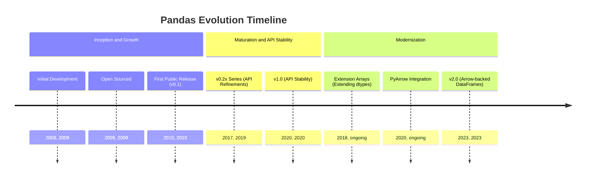
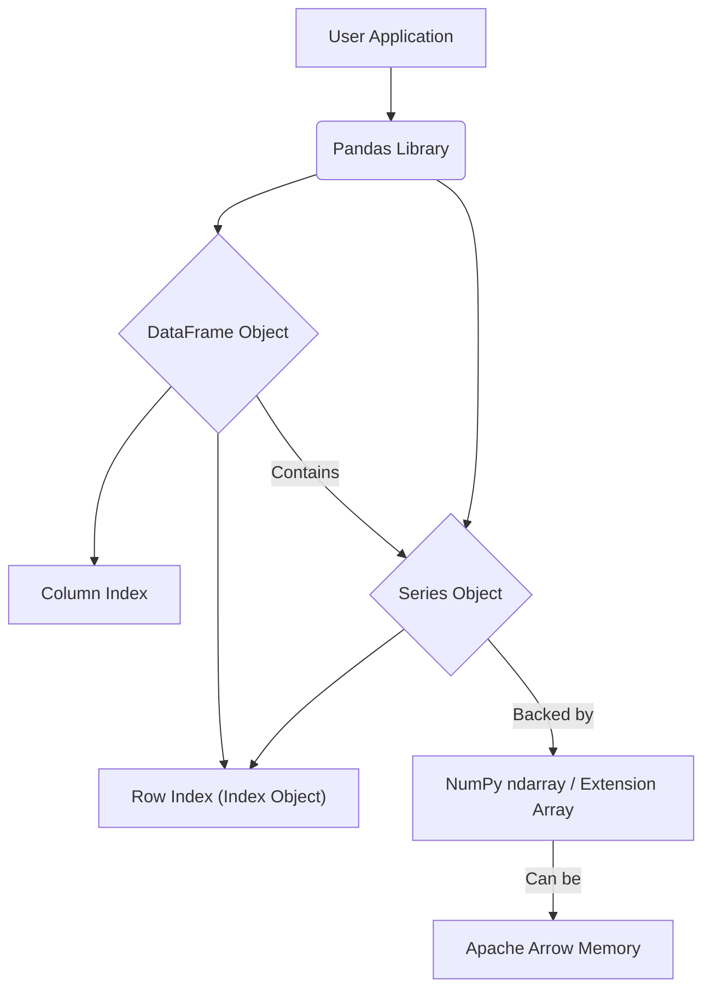
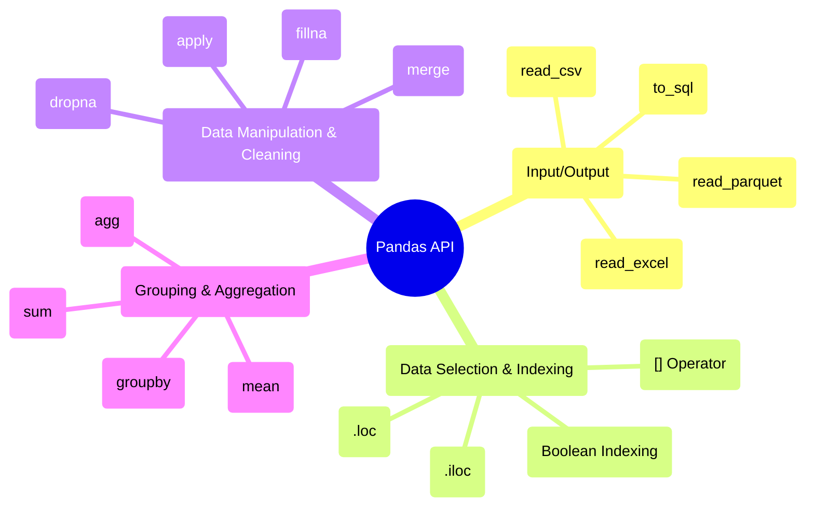

## Pandas Evolution Document

### 1. Introduction and Historical Context

Pandas is a foundational library for data manipulation and analysis in Python. It provides high-performance, easy-to-use data structures and data analysis tools, making it an indispensable part of the data science and machine learning ecosystem. Its name is derived from "panel data," an econometrics term for multidimensional, structured datasets.

Pandas was created by Wes McKinney in 2008 while he was working at AQR Capital Management. He needed a tool that could handle complex financial data with high performance and flexibility. Finding the existing tools in Python inadequate, he started building pandas to address these needs. It was open-sourced in 2009 and has since grown into a massive, community-driven project.

The library's primary contribution is the **DataFrame**, a two-dimensional labeled data structure with columns of potentially different types, similar to a spreadsheet or a SQL table. It provides powerful tools for reading and writing data, cleaning, transforming, merging, and reshaping datasets.

### 1.1. Pandas Evolution Timeline



### 2. Core Architecture

Pandas is built on top of NumPy, leveraging its `ndarray` for fast, memory-efficient data storage. However, pandas introduces its own high-level data structures, the `Series` and `DataFrame`, which provide labeled axes (index and columns) and a wealth of specialized functions for data manipulation.

#### 2.1. `Series` and `DataFrame` Objects

**Mental Model / Analogy:**
*   **`Series`:** Imagine a single column from a spreadsheet, like a list of names or ages, but with a special label (an "index") for each item. It's a 1D array with superpowers for data handling.
*   **`DataFrame`:** Think of a full spreadsheet or a SQL table. It's a collection of `Series` (columns) that share the same row labels (index). This 2D structure is the core of data analysis in Pandas, allowing you to organize and manipulate tabular data efficiently.

*   **`Series`:** A one-dimensional labeled array capable of holding any data type. It is essentially a single column of a `DataFrame`. The labels are collectively referred to as the **index**.
*   **`DataFrame`:** A two-dimensional labeled data structure with columns of potentially different types. It can be thought of as a dictionary of `Series` objects, where the keys are the column names and the values are the `Series` themselves. It has both a row index and a column index.

#### 2.2. Index Objects

The `Index` is a core pandas data structure that holds the axis labels for `Series` and `DataFrame` objects. It is immutable and provides optimized lookups and set logic, enabling efficient alignment of data during operations.

#### 2.3. Memory Management and Data Types

Internally, a `DataFrame` is a collection of `Series`, each of which is backed by a NumPy array. This "column-major" or "block-based" architecture allows for efficient storage and computation, as operations can be vectorized on a per-column basis. A significant evolution in this area is the introduction of **Extension Arrays**, which allow for custom data types beyond what NumPy provides (e.g., categorical, nullable integers, and timezone-aware datetimes). More recently, the integration with **Apache Arrow** provides a more efficient in-memory columnar format, especially for string data and for interoperability with other systems.

**Mermaid Diagram: Pandas Core Architecture**



### 3. Detailed API Overview

Pandas' API is extensive, covering the entire data analysis workflow from data ingestion to cleaning, transformation, and visualization. The API saw significant growth and refinement in the `0.x` versions, culminating in the **pandas 1.0** release in 2020, which signaled a strong commitment to API stability.

A major recent evolution was the **pandas 2.0** release in 2023, which introduced official support for **Apache Arrow** as a memory backend. This provides significant performance improvements (especially for string processing and I/O) and better interoperability with other data analysis libraries.

#### 3.1. Input/Output

Pandas provides a rich set of I/O tools for reading and writing data in various formats.

##### 3.1.1. Reading Data from CSV Files

**`pd.read_csv(filepath_or_buffer, ...)`**

**Goal:** Load data from a CSV (Comma Separated Values) file into a Pandas DataFrame.

**Code:**
```python
import pandas as pd
import os

# Create a dummy CSV file for demonstration
csv_content = "col1,col2\n1,A\n2,B\n3,C"
with open("sample.csv", "w") as f:
    f.write(csv_content)

df_csv = pd.read_csv("sample.csv")
print(df_csv)

# Clean up the dummy file
os.remove("sample.csv")
```

**Expected Output:**
```
   col1 col2
0     1    A
1     2    B
2     3    C
```

**Explanation:** `pd.read_csv()` is the most commonly used function for importing tabular data. It automatically infers column types and handles common delimiters. You can specify `sep` for different delimiters (e.g., `sep='\t'` for TSV) and `header` if your file doesn't have a header row.

*   **Context:** The workhorse for reading delimited data (like CSV and TSV files) into a `DataFrame`.
*   **Parameters:**
    *   `filepath_or_buffer`: The path to the file or a file-like object.
    *   `sep`: The delimiter to use.
    *   `header`: The row number to use as column names.
*   **Returns:** A `DataFrame`.

##### 3.1.2. Reading Data from Excel Files

**`pd.read_excel(io, ...)`**

**Goal:** Load data from an Excel file (e.g., `.xlsx`, `.xls`) into a Pandas DataFrame.

**Code:**
```python
import pandas as pd
import os

# This example requires the openpyxl engine to be installed:
# pip install openpyxl

# Create a dummy Excel file for demonstration
# (Requires openpyxl to write, but read_excel can use other engines too)
try:
    from openpyxl import Workbook
    wb = Workbook()
    ws = wb.active
    ws['A1'] = 'col1'
    ws['B1'] = 'col2'
    ws['A2'] = 1
    ws['B2'] = 'X'
    ws['A3'] = 2
    ws['B3'] = 'Y'
    excel_filename = "sample.xlsx"
    wb.save(excel_filename)

    df_excel = pd.read_excel(excel_filename)
    print(df_excel)

    # Clean up the dummy file
    os.remove(excel_filename)
    print(f"Cleaned up {excel_filename}")
except ImportError:
    print("'openpyxl' not installed. Skipping Excel example.")
except Exception as e:
    print(f"An error occurred: {e}")
```

**Expected Output (if openpyxl is installed):**
```
   col1 col2
0     1    X
1     2    Y
Cleaned up sample.xlsx
```

**Explanation:** `pd.read_excel()` is used for reading data from Excel spreadsheets. You can specify `sheet_name` to read a particular sheet. It often requires an additional engine like `openpyxl` or `xlrd` to be installed.

*   **Context:** Reads data from an Excel file into a `DataFrame`.
*   **Parameters:**
    *   `io`: The path to the Excel file.
    *   `sheet_name`: The specific sheet to read.
*   **Returns:** A `DataFrame`.

##### 3.1.3. Writing Data to SQL Databases

**`DataFrame.to_sql(name, con, ...)`**

**Goal:** Write the contents of a DataFrame to a SQL database table.

**Code:**
```python
import pandas as pd
import sqlite3
import os

# Create a dummy DataFrame
df_sql = pd.DataFrame({'id': [1, 2, 3], 'name': ['Alice', 'Bob', 'Charlie']})

# Create an in-memory SQLite database connection
conn = sqlite3.connect(':memory:')

# Write the DataFrame to a SQL table named 'users'
df_sql.to_sql('users', conn, if_exists='replace', index=False)
print("DataFrame written to SQL table 'users'.")

# Verify by reading from SQL
df_from_sql = pd.read_sql("SELECT * FROM users", conn)
print(f"\nData read from SQL:\n{df_from_sql}")

# Close the connection
conn.close()
```

**Expected Output:**
```
DataFrame written to SQL table 'users'.

Data read from SQL:
   id     name
0   1    Alice
1   2      Bob
2   3  Charlie
```

**Explanation:** `DataFrame.to_sql()` is essential for integrating Pandas with relational databases. You need a database connection object (`con`) and can specify how to handle existing tables (`if_exists='replace'`, `'append'`, or `'fail'`). `index=False` prevents writing the DataFrame index as a column in the SQL table.

*   **Context:** Writes records stored in a `DataFrame` to a SQL database.
*   **Parameters:**
    *   `name`: The name of the SQL table.
    *   `con`: A database connection object.

*   **`pd.read_parquet(path, ...)`**
    *   **Context:** Reads data from a Parquet file. The Parquet format is a highly efficient columnar storage format.
    *   **Parameters:**
    *   `name`: The name of the SQL table.
    *   `con`: A database connection object.

##### 3.1.4. Reading Data from Parquet Files

**`pd.read_parquet(path, ...)`**

**Goal:** Load data from a Parquet file into a Pandas DataFrame.

**Code:**
```python
import pandas as pd
import os

# This example requires the pyarrow or fastparquet engine to be installed:
# pip install pyarrow

# Create a dummy DataFrame and save it to Parquet
df_parquet_original = pd.DataFrame({
    'col1': [1, 2, 3],
    'col2': ['A', 'B', 'C']
})
parquet_filename = "sample.parquet"

try:
    df_parquet_original.to_parquet(parquet_filename, index=False)
    print(f"DataFrame saved to {parquet_filename}")

    # Read the Parquet file back into a DataFrame
    df_parquet_loaded = pd.read_parquet(parquet_filename)
    print(f"\nData read from Parquet:\n{df_parquet_loaded}")

    # Clean up the dummy file
    os.remove(parquet_filename)
    print(f"Cleaned up {parquet_filename}")
except ImportError:
    print("'pyarrow' or 'fastparquet' not installed. Skipping Parquet example.")
except Exception as e:
    print(f"An error occurred: {e}")
```

**Expected Output (if pyarrow/fastparquet is installed):**
```
DataFrame saved to sample.parquet

Data read from Parquet:
   col1 col2
0     1    A
1     2    B
2     3    C
Cleaned up sample.parquet
```

**Explanation:** Parquet is a columnar storage format optimized for performance and efficient disk usage, especially for large datasets. `pd.read_parquet()` is the function to load these files. It's often used in big data ecosystems.

*   **Context:** Reads data from a Parquet file. The Parquet format is a highly efficient columnar storage format.
*   **Parameters:**
    *   `path`: The path to the Parquet file.
*   **Returns:** A `DataFrame`.

##### 3.1.5. Quick Reference: Input/Output

| Function | Description | When to Use |
| :--- | :--- | :--- |
| `pd.read_csv()` | Read delimited data (CSV, TSV) | Most common for flat file data, highly configurable. |
| `pd.read_excel()` | Read Excel files | Working with data stored in `.xlsx` or `.xls` formats. |
| `DataFrame.to_sql()` | Write DataFrame to SQL | Storing processed data in a relational database. |
| `pd.read_parquet()` | Read Parquet files | Efficiently loading large, columnar datasets. |

#### 3.2. Data Selection and Indexing

Pandas offers powerful and flexible ways to select subsets of data.

##### 3.2.1. Basic Column Selection

**`[]` Operator**

**Goal:** Select one or more columns from a DataFrame.

**Code:**
```python
import pandas as pd

df = pd.DataFrame({
    'name': ['Alice', 'Bob', 'Charlie'],
    'age': [25, 30, 35],
    'city': ['NY', 'LA', 'CHI']
})

# Select a single column (returns a Series)
names = df['name']
print(f"Single column (Series):\n{names}")
print(f"Type of single column: {type(names)}")

# Select multiple columns (returns a DataFrame)
cities_ages = df[['city', 'age']]
print(f"\nMultiple columns (DataFrame):\n{cities_ages}")
print(f"Type of multiple columns: {type(cities_ages)}")
```

**Expected Output:**
```
Single column (Series):
0      Alice
1        Bob
2    Charlie
Name: name, dtype: object
Type of single column: <class 'pandas.core.series.Series'>

Multiple columns (DataFrame):
  city  age
0   NY   25
1   LA   30
2  CHI   35
Type of multiple columns: <class 'pandas.core.frame.DataFrame'>
```

**Explanation:** Using single brackets `[]` with a column name returns a `Series`. Using double brackets `[[]]` with a list of column names returns a `DataFrame`. This is a fundamental way to access columns.

*   **Context:** Basic selection. For a `DataFrame`, `df['col']` selects a column as a `Series`, while `df[['col1', 'col2']]` selects multiple columns as a `DataFrame`.

##### 3.2.2. Label-based Selection with `.loc[]`

**`.loc[]` Accessor**

**Goal:** Select data by row and column labels.

**Code:**
```python
import pandas as pd

df = pd.DataFrame({
    'name': ['Alice', 'Bob', 'Charlie'],
    'age': [25, 30, 35],
    'city': ['NY', 'LA', 'CHI']
}, index=['a', 'b', 'c'])

print(f"Original DataFrame:\n{df}")

# Select a single row by label
row_b = df.loc['b']
print(f"\nRow 'b' (Series):\n{row_b}")

# Select a single value by row and column label
alice_age = df.loc['a', 'age']
print(f"\nAlice's age: {alice_age}")

# Select multiple rows and columns by labels
subset_df = df.loc[['a', 'c'], ['name', 'city']]
print(f"\nSubset by labels:\n{subset_df}")

# Select rows with a boolean condition using .loc
older_than_30 = df.loc[df['age'] > 30]
print(f"\nRows where age > 30:\n{older_than_30}")
```

**Expected Output:**
```
Original DataFrame:
      name  age city
a    Alice   25   NY
b      Bob   30   LA
c  Charlie   35  CHI

Row 'b' (Series):
name    Bob
age      30
city     LA
Name: b, dtype: object

Alice's age: 25

Subset by labels:
      name city
a    Alice   NY
c  Charlie  CHI

Rows where age > 30:
      name  age city
c  Charlie   35  CHI
```

**Explanation:** `.loc[]` is strictly label-based. The first argument refers to the row label(s), and the second to the column label(s). It's inclusive of both start and end labels when slicing. It's also the preferred way to perform boolean indexing for rows when you want to ensure label alignment.

*   **Context:** Label-based indexing. Selects data based on the index and column labels.
*   **Usage:** `df.loc['row_label', 'col_label']`

##### 3.2.3. Integer-position-based Selection with `.iloc[]`

**`.iloc[]` Accessor**

**Goal:** Select data by integer position (0-based index) for rows and columns.

**Code:**
```python
import pandas as pd

df = pd.DataFrame({
    'name': ['Alice', 'Bob', 'Charlie'],
    'age': [25, 30, 35],
    'city': ['NY', 'LA', 'CHI']
}, index=['a', 'b', 'c'])

print(f"Original DataFrame:\n{df}")

# Select the first row by integer position
first_row = df.iloc[0]
print(f"\nFirst row (Series):\n{first_row}")

# Select a single value by row and column integer position
bob_age = df.iloc[1, 1]
print(f"\nBob's age: {bob_age}")

# Select multiple rows and columns by integer positions
subset_iloc_df = df.iloc[[0, 2], [0, 2]] # Rows 0 and 2, columns 0 and 2
print(f"\nSubset by integer positions:\n{subset_iloc_df}")

# Slice rows and columns by integer position
slice_df = df.iloc[0:2, 1:3] # Rows 0 to 1, columns 1 to 2
print(f"\nSliced by integer positions:\n{slice_df}")
```

**Expected Output:**
```
Original DataFrame:
      name  age city
a    Alice   25   NY
b      Bob   30   LA
c  Charlie   35  CHI

First row (Series):
name    Alice
age        25
city       NY
Name: a, dtype: object

Bob's age: 30

Subset by integer positions:
      name city
a    Alice   NY
c  Charlie  CHI

Sliced by integer positions:
    age city
a    25   NY
b    30   LA
```

**Explanation:** `.iloc[]` is strictly integer-position-based, similar to standard Python list slicing. The first argument refers to row position(s), and the second to column position(s). It is exclusive of the end position when slicing.

*   **Context:** Integer-position-based indexing. Selects data based on its integer position.
*   **Usage:** `df.iloc[0, 1]`
*   **Boolean Indexing:**
    *   **Usage:** `df.iloc[0, 1]`

##### 3.2.4. Conditional Selection (Boolean Indexing)

**Boolean Indexing**

**Goal:** Select rows from a DataFrame based on a condition applied to one or more columns.

**Code:**
```python
import pandas as pd

df = pd.DataFrame({
    'name': ['Alice', 'Bob', 'Charlie', 'David'],
    'age': [25, 30, 35, 28],
    'city': ['NY', 'LA', 'CHI', 'NY']
})

print(f"Original DataFrame:\n{df}")

# Select rows where age is greater than 30
older_than_30 = df[df['age'] > 30]
print(f"\nRows where age > 30:\n{older_than_30}")

# Select rows based on multiple conditions (AND)
ny_and_young = df[(df['city'] == 'NY') & (df['age'] < 30)]
print(f"\nRows from NY and age < 30:\n{ny_and_young}")

# Select rows based on multiple conditions (OR)
ny_or_la = df[(df['city'] == 'NY') | (df['city'] == 'LA')]
print(f"\nRows from NY or LA:\n{ny_or_la}")
```

**Expected Output:**
```
Original DataFrame:
      name  age   city
0    Alice   25     NY
1      Bob   30     LA
2  Charlie   35    CHI
3    David   28     NY

Rows where age > 30:
      name  age city
2  Charlie   35  CHI

Rows from NY and age < 30:
    name  age city
0  Alice   25   NY
3  David   28   NY

Rows from NY or LA:
    name  age city
0  Alice   25   NY
1    Bob   30   LA
3  David   28   NY
```

**Explanation:** Boolean indexing involves passing a Series of boolean values (True/False) to the DataFrame's `[]` operator. Only rows corresponding to `True` values are selected. For multiple conditions, use `&` (AND) and `|` (OR) operators, ensuring each condition is enclosed in parentheses.

*   **Context:** Selects rows based on a boolean condition.
*   **Usage:** `df[df['age'] > 30]`

##### 3.2.5. Quick Reference: Data Selection and Indexing

| Method/Operator | Description | When to Use |
| :--- | :--- | :--- |
| `df[]` | Basic column selection | Selecting one or more columns by name. |
| `df.loc[]` | Label-based selection | Selecting rows/columns by their explicit labels (names). |
| `df.iloc[]` | Integer-position-based selection | Selecting rows/columns by their integer positions (0-based). |
| `df[boolean_array]` | Conditional selection | Filtering rows based on a boolean condition applied to column values. |

#### 3.3. Data Manipulation and Cleaning

This is where pandas truly shines, providing a vast array of functions for cleaning and transforming data.

##### 3.3.1. Handling Missing Data

**`DataFrame.dropna(axis=0, ...)`**

**Goal:** Remove rows or columns that contain missing values (NaN).

**Code:**
```python
import pandas as pd
import numpy as np

df = pd.DataFrame({
    'A': [1, 2, np.nan, 4],
    'B': [5, np.nan, 7, 8],
    'C': [9, 10, 11, 12]
})

print(f"Original DataFrame:\n{df}")

# Drop rows with any NaN values
df_dropped_rows = df.dropna(axis=0)
print(f"\nDataFrame after dropping rows with NaN:\n{df_dropped_rows}")

# Drop columns with any NaN values
df_dropped_cols = df.dropna(axis=1)
print(f"\nDataFrame after dropping columns with NaN:\n{df_dropped_cols}")

# Drop rows only if ALL values are NaN
df_all_nan = pd.DataFrame({'X': [1, np.nan], 'Y': [np.nan, np.nan]})
print(f"\nOriginal DataFrame (with all NaN row):\n{df_all_nan}")
df_dropped_all_nan = df_all_nan.dropna(how='all')
print(f"DataFrame after dropping rows where ALL are NaN:\n{df_dropped_all_nan}")
```

**Expected Output:**
```
Original DataFrame:
     A    B   C
0  1.0  5.0   9
1  2.0  NaN  10
2  NaN  7.0  11
3  4.0  8.0  12

DataFrame after dropping rows with NaN:
     A    B   C
0  1.0  5.0   9
3  4.0  8.0  12

DataFrame after dropping columns with NaN:
    C
0   9
1  10
2  11
3  12

Original DataFrame (with all NaN row):
     X   Y
0  1.0 NaN
1  NaN NaN
DataFrame after dropping rows where ALL are NaN:
     X   Y
0  1.0 NaN
```

**Explanation:** `dropna()` is crucial for data cleaning. `axis=0` (default) drops rows, `axis=1` drops columns. The `how` parameter (`'any'` or `'all'`) specifies whether to drop if *any* NaN is present or only if *all* values are NaN. It returns a new DataFrame, leaving the original unchanged unless `inplace=True` is used.

*   **Context:** Removes missing values (NaN).
*   **Parameters:**
    *   `axis`: `0` to drop rows with missing values, `1` to drop columns.
    *   **Returns:** A `DataFrame` with missing values removed.

**`DataFrame.fillna(value, ...)`**

**Goal:** Replace missing values (NaN) with a specified value or using a particular method.

**Code:**
```python
import pandas as pd
import numpy as np

df = pd.DataFrame({
    'A': [1, 2, np.nan, 4],
    'B': [5, np.nan, 7, 8],
    'C': [9, 10, 11, 12]
})

print(f"Original DataFrame:\n{df}")

# Fill all NaN with a scalar value
df_filled_scalar = df.fillna(0)
print(f"\nDataFrame after filling NaN with 0:\n{df_filled_scalar}")

# Fill NaN with the mean of each column
df_filled_mean = df.fillna(df.mean())
print(f"\nDataFrame after filling NaN with column means:\n{df_filled_mean}")

# Forward fill (propagate last valid observation forward)
df_ffill = df.fillna(method='ffill')
print(f"\nDataFrame after forward fill:\n{df_ffill}")
```

**Expected Output:**
```
Original DataFrame:
     A    B   C
0  1.0  5.0   9
1  2.0  NaN  10
2  NaN  7.0  11
3  4.0  8.0  12

DataFrame after filling NaN with 0:
     A    B   C
0  1.0  5.0   9
1  2.0  0.0  10
2  0.0  7.0  11
3  4.0  8.0  12

DataFrame after filling NaN with column means:
     A    B   C
0  1.0  5.0   9
1  2.0  6.6  10
2  2.3  7.0  11
3  4.0  8.0  12

DataFrame after forward fill:
     A    B   C
0  1.0  5.0   9
1  2.0  5.0  10
2  2.0  7.0  11
3  4.0  8.0  12
```

**Explanation:** `fillna()` is another essential data cleaning tool. You can fill with a constant `value`, a Series (like `df.mean()`), or use methods like `'ffill'` (forward fill) or `'bfill'` (backward fill) to propagate values. Like `dropna()`, it returns a new DataFrame by default.

*   **Context:** Fills missing values with a specified value or method.
*   **Parameters:**
    *   `value`: The value to use for filling missing data.
    *   **Returns:** A `DataFrame` with missing values filled.

##### 3.3.2. Combining DataFrames (Merging)

**`DataFrame.merge(right, on=None, ...)`**

**Goal:** Combine two DataFrames based on common columns or indices, similar to SQL JOIN operations.

**Code:**
```python
import pandas as pd

# Create two dummy DataFrames
df1 = pd.DataFrame({'id': [1, 2, 3], 'name': ['Alice', 'Bob', 'Charlie']})
df2 = pd.DataFrame({'id': [1, 3, 4], 'score': [90, 85, 95]})

print(f"DataFrame 1:\n{df1}")
print(f"\nDataFrame 2:\n{df2}")

# Inner merge (default): only rows with matching 'id' in both DataFrames
merged_inner = df1.merge(df2, on='id')
print(f"\nInner Merge (on 'id'):\n{merged_inner}")

# Left merge: keep all rows from df1, add matching from df2 (NaN for no match)
merged_left = df1.merge(df2, on='id', how='left')
print(f"\nLeft Merge (on 'id'):\n{merged_left}")

# Outer merge: keep all rows from both, fill NaN for no match
merged_outer = df1.merge(df2, on='id', how='outer')
print(f"\nOuter Merge (on 'id'):\n{merged_outer}")
```

**Expected Output:**
```
DataFrame 1:
   id     name
0   1    Alice
1   2      Bob
2   3  Charlie

DataFrame 2:
   id  score
0   1     90
1   3     85
2   4     95

Inner Merge (on 'id'):
   id     name  score
0   1    Alice     90
1   3  Charlie     85

Left Merge (on 'id'):
   id     name  score
0   1    Alice   90.0
1   2      Bob    NaN
2   3  Charlie   85.0

Outer Merge (on 'id'):
   id     name  score
0   1    Alice   90.0
1   2      Bob    NaN
2   3  Charlie   85.0
3   4      NaN   95.0
```

**Explanation:** `DataFrame.merge()` is a powerful function for combining datasets. The `on` parameter specifies the column(s) to join on. The `how` parameter (`'inner'`, `'left'`, `'right'`, `'outer'`) determines the type of join, controlling which rows are kept from the original DataFrames.

*   **Context:** Merges two `DataFrame` objects with a database-style join.
*   **Parameters:**
    *   `right`: The other `DataFrame` to merge with.
    *   `on`: The column(s) to join on.
    *   **Returns:** A merged `DataFrame`.

##### 3.3.3. Applying Functions to Data

**`Series.apply(func)`**

**Goal:** Apply a custom function to each element of a Series.

**Code:**
```python
import pandas as pd

df = pd.DataFrame({
    'name': ['Alice', 'Bob', 'Charlie'],
    'score': [85, 92, 78]
})

print(f"Original DataFrame:\n{df}")

# Define a function to categorize scores
def categorize_score(score):
    if score >= 90:
        return 'Excellent'
    elif score >= 80:
        return 'Good'
    else:
        return 'Average'

# Apply the function to the 'score' column
df['grade'] = df['score'].apply(categorize_score)
print(f"\nDataFrame with new 'grade' column:\n{df}")

# Using a lambda function for a simpler transformation
df['score_plus_5'] = df['score'].apply(lambda x: x + 5)
print(f"\nDataFrame with 'score_plus_5':\n{df}")
```

**Expected Output:**
```
Original DataFrame:
      name  score
0    Alice     85
1      Bob     92
2  Charlie     78

DataFrame with new 'grade' column:
      name  score      grade
0    Alice     85       Good
1      Bob     92  Excellent
2  Charlie     78    Average

DataFrame with 'score_plus_5':
      name  score      grade  score_plus_5
0    Alice     85       Good            90
1      Bob     92  Excellent            97
2  Charlie     78    Average            83
```

**Explanation:** The `apply()` method is highly flexible for performing element-wise transformations on a Series using custom Python functions (including lambda functions). For DataFrames, `df.apply()` can apply functions row-wise or column-wise.

*   **Context:** Applies a function element-wise to a `Series`.
*   **Parameters:**
    *   `func`: The function to apply.
    *   **Returns:** A new `Series` with the function applied.

##### 3.3.4. Quick Reference: Data Manipulation and Cleaning

| Function | Description | When to Use |
| :--- | :--- | :--- |
| `DataFrame.dropna()` | Remove missing values | When you want to eliminate rows/columns with `NaN` values. |
| `DataFrame.fillna()` | Fill missing values | When you want to replace `NaN` values with specific data or using a method. |
| `DataFrame.merge()` | Combine DataFrames | Performing SQL-like joins to combine data from different tables. |
| `Series.apply()` | Apply function element-wise | Performing custom transformations on individual elements of a Series. |

#### 3.4. Grouping and Aggregation

Pandas provides a powerful "group by" mechanism for splitting, applying a function, and combining results.

##### 3.4.1. Grouping Data with `groupby()`

**`DataFrame.groupby(by, ...)`**

**Goal:** Group rows of a DataFrame based on the unique values in one or more columns.

**Code:**
```python
import pandas as pd

df = pd.DataFrame({
    'city': ['NY', 'LA', 'NY', 'LA', 'CHI'],
    'gender': ['M', 'F', 'F', 'M', 'F'],
    'age': [25, 30, 35, 28, 40]
})

print(f"Original DataFrame:\n{df}")

# Group by a single column 'city'
grouped_by_city = df.groupby('city')
print(f"\nGrouped by city (type): {type(grouped_by_city)}")

# Group by multiple columns 'city' and 'gender'
grouped_by_city_gender = df.groupby(['city', 'gender'])
print(f"Grouped by city and gender (type): {type(grouped_by_city_gender)}")

# To see the groups, you often need to apply an aggregation function immediately
print(f"\nMean age by city:\n{grouped_by_city['age'].mean()}")
```

**Expected Output:**
```
Original DataFrame:
  city gender  age
0   NY      M   25
1   LA      F   30
2   NY      F   35
3   LA      M   28
4  CHI      F   40

Grouped by city (type): <class 'pandas.core.groupby.generic.DataFrameGroupBy'>
Grouped by city and gender (type): <class 'pandas.core.groupby.generic.DataFrameGroupBy'>

Mean age by city:
city
CHI    40.0
LA     29.0
NY     30.0
Name: age, dtype: float64
```

**Explanation:** `groupby()` is a core operation in data analysis. It returns a `DataFrameGroupBy` object, which is an intermediate object. To get meaningful results, you typically chain an aggregation function (like `mean()`, `sum()`, `count()`) or `apply()` to this grouped object.

*   **Context:** Groups a `DataFrame` using one or more columns. This returns a `DataFrameGroupBy` object.
*   **Parameters:**
    *   `by`: The column(s) to group by.
    *   **Returns:** A `DataFrameGroupBy` object.
    
##### 3.4.2. Performing Aggregations

**Aggregation (`.sum()`, `.mean()`, `.agg()`)**

**Goal:** Compute summary statistics for each group created by `groupby()`.

**Code:**
```python
import pandas as pd

df = pd.DataFrame({
    'category': ['A', 'B', 'A', 'B', 'A'],
    'value1': [10, 20, 15, 25, 12],
    'value2': [1, 2, 3, 4, 5]
})

print(f"Original DataFrame:\n{df}")

# Group by 'category' and calculate the sum of 'value1' for each group
sum_by_category = df.groupby('category')['value1'].sum()
print(f"\nSum of value1 by category:\n{sum_by_category}")

# Group by 'category' and calculate the mean of 'value2' for each group
mean_by_category = df.groupby('category')['value2'].mean()
print(f"\nMean of value2 by category:\n{mean_by_category}")

# Perform multiple aggregations on multiple columns using .agg()
multi_agg = df.groupby('category').agg(
    value1_mean=('value1', 'mean'),
    value1_max=('value1', 'max'),
    value2_sum=('value2', 'sum')
)
print(f"\nMultiple aggregations using .agg():\n{multi_agg}")
```

**Expected Output:**
```
Original DataFrame:
  category  value1  value2
0        A      10       1
1        B      20       2
2        A      15       3
3        B      25       4
4        A      12       5

Sum of value1 by category:
category
A    37
B    45
Name: value1, dtype: int64

Mean of value2 by category:
category
A    3.0
B    3.0
Name: value2, dtype: float64

Multiple aggregations using .agg():
          value1_mean  value1_max  value2_sum
category                                  
A               12.33          15           9
B               22.50          25           6
```

**Explanation:** After grouping, you can apply various aggregation functions. Common ones include `sum()`, `mean()`, `min()`, `max()`, `count()`, `size()`, `std()`, `var()`. The `.agg()` method is highly flexible, allowing you to apply multiple aggregation functions to multiple columns simultaneously and even rename the output columns.

*   **Context:** After grouping, you can apply aggregation functions to compute summary statistics for each group.
*   **Usage:** `df.groupby('category').agg({'price': 'mean', 'quantity': 'sum'})`

##### 3.4.3. Quick Reference: Grouping and Aggregation

| Function | Description | When to Use |
| :--- | :--- | :--- |
| `DataFrame.groupby()` | Group data by column(s) | Performing operations on subsets of data based on categorical variables. |
| `.sum()`, `.mean()`, etc. | Standard aggregations | Calculating basic statistics (sum, average, min, max) for grouped data. |
| `.agg()` | Flexible aggregations | Applying multiple or custom aggregation functions to grouped data. |

### 3.5. API Mindmap


### 4. Evolution and Impact

*   **Performance:** Pandas has continuously improved its performance through better algorithms, tighter integration with NumPy, and the adoption of new technologies like Numba for JIT compilation of user-defined functions and, most recently, Apache Arrow for its memory backend.
*   **Data Science Standard:** Pandas, along with NumPy and Matplotlib, forms the "standard stack" for data science in Python. It is the primary tool for data wrangling and exploration, and its `DataFrame` is the standard input for many other libraries, including Scikit-learn and Seaborn.
*   **Extensibility:** The introduction of the Extension Array interface was a major step, allowing pandas to handle a wider variety of data types more efficiently and cleanly. This has paved the way for better support for nullable integers, categoricals, and integration with libraries like GeoPandas for geospatial data.
*   **Interoperability:** The move towards Apache Arrow as a backend in pandas 2.0 is a significant step towards better interoperability within the broader data science ecosystem, enabling seamless data exchange with systems like Spark, Dask, and various database technologies without costly serialization/deserialization steps.

### 5. Conclusion

Pandas transformed data analysis in Python from a niche capability into a mainstream practice. Its intuitive `DataFrame` and `Series` objects, combined with a rich and expressive API, provide a powerful and flexible toolkit for real-world data wrangling. The library's evolution reflects a deep commitment to performance, usability, and interoperability, ensuring that pandas remains an essential tool for anyone working with data in Python.