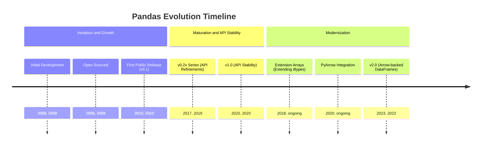
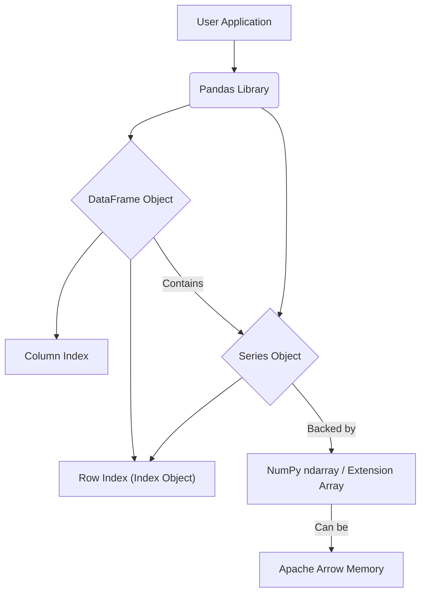
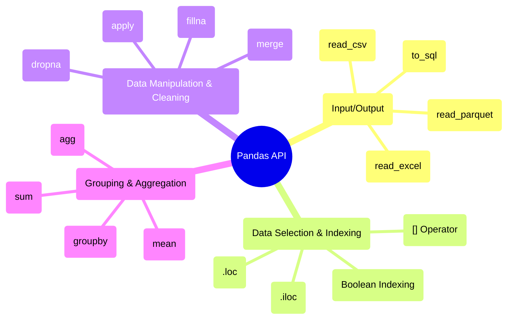

## Pandas Evolution Document

### 1. Introduction and Historical Context

Pandas is a foundational library for data manipulation and analysis in Python. It provides high-performance, easy-to-use data structures and data analysis tools, making it an indispensable part of the data science and machine learning ecosystem. Its name is derived from "panel data," an econometrics term for multidimensional, structured datasets.

Pandas was created by Wes McKinney in 2008 while he was working at AQR Capital Management. He needed a tool that could handle complex financial data with high performance and flexibility. Finding the existing tools in Python inadequate, he started building pandas to address these needs. It was open-sourced in 2009 and has since grown into a massive, community-driven project.

The library's primary contribution is the **DataFrame**, a two-dimensional labeled data structure with columns of potentially different types, similar to a spreadsheet or a SQL table. It provides powerful tools for reading and writing data, cleaning, transforming, merging, and reshaping datasets.

### 1.1. Pandas Evolution Timeline



### 2. Core Architecture

Pandas is built on top of NumPy, leveraging its `ndarray` for fast, memory-efficient data storage. However, pandas introduces its own high-level data structures, the `Series` and `DataFrame`, which provide labeled axes (index and columns) and a wealth of specialized functions for data manipulation.

#### 2.1. `Series` and `DataFrame` Objects

*   **`Series`:** A one-dimensional labeled array capable of holding any data type. It is essentially a single column of a `DataFrame`. The labels are collectively referred to as the **index**.
*   **`DataFrame`:** A two-dimensional labeled data structure with columns of potentially different types. It can be thought of as a dictionary of `Series` objects, where the keys are the column names and the values are the `Series` themselves. It has both a row index and a column index.

#### 2.2. Index Objects

The `Index` is a core pandas data structure that holds the axis labels for `Series` and `DataFrame` objects. It is immutable and provides optimized lookups and set logic, enabling efficient alignment of data during operations.

#### 2.3. Memory Management and Data Types

Internally, a `DataFrame` is a collection of `Series`, each of which is backed by a NumPy array. This "column-major" or "block-based" architecture allows for efficient storage and computation, as operations can be vectorized on a per-column basis. A significant evolution in this area is the introduction of **Extension Arrays**, which allow for custom data types beyond what NumPy provides (e.g., categorical, nullable integers, and timezone-aware datetimes). More recently, the integration with **Apache Arrow** provides a more efficient in-memory columnar format, especially for string data and for interoperability with other systems.

**Mermaid Diagram: Pandas Core Architecture**



### 3. Detailed API Overview

Pandas' API is extensive, covering the entire data analysis workflow from data ingestion to cleaning, transformation, and visualization. The API saw significant growth and refinement in the `0.x` versions, culminating in the **pandas 1.0** release in 2020, which signaled a strong commitment to API stability.

A major recent evolution was the **pandas 2.0** release in 2023, which introduced official support for **Apache Arrow** as a memory backend. This provides significant performance improvements (especially for string processing and I/O) and better interoperability with other data analysis libraries.

#### 3.1. Input/Output

Pandas provides a rich set of I/O tools for reading and writing data in various formats.

*   **`pd.read_csv(filepath_or_buffer, ...)`**
    *   **Context:** The workhorse for reading delimited data (like CSV and TSV files) into a `DataFrame`.
    *   **Parameters:**
        *   `filepath_or_buffer`: The path to the file or a file-like object.
        *   `sep`: The delimiter to use.
        *   `header`: The row number to use as column names.
    *   **Returns:** A `DataFrame`.

*   **`pd.read_excel(io, ...)`**
    *   **Context:** Reads data from an Excel file into a `DataFrame`.
    *   **Parameters:**
        *   `io`: The path to the Excel file.
        *   `sheet_name`: The specific sheet to read.
    *   **Returns:** A `DataFrame`.

*   **`DataFrame.to_sql(name, con, ...)`**
    *   **Context:** Writes records stored in a `DataFrame` to a SQL database.
    *   **Parameters:**
        *   `name`: The name of the SQL table.
        *   `con`: A database connection object.

*   **`pd.read_parquet(path, ...)`**
    *   **Context:** Reads data from a Parquet file. The Parquet format is a highly efficient columnar storage format.
    *   **Parameters:**
        *   `path`: The path to the Parquet file.
    *   **Returns:** A `DataFrame`.

#### 3.2. Data Selection and Indexing

Pandas offers powerful and flexible ways to select subsets of data.

*   **`[]` Operator:**
    *   **Context:** Basic selection. For a `DataFrame`, `df['col']` selects a column as a `Series`, while `df[['col1', 'col2']]` selects multiple columns as a `DataFrame`.
*   **`.loc[]` Accessor:**
    *   **Context:** Label-based indexing. Selects data based on the index and column labels.
    *   **Usage:** `df.loc['row_label', 'col_label']`
*   **`.iloc[]` Accessor:**
    *   **Context:** Integer-position-based indexing. Selects data based on its integer position.
    *   **Usage:** `df.iloc[0, 1]`
*   **Boolean Indexing:**
    *   **Context:** Selects rows based on a boolean condition.
    *   **Usage:** `df[df['age'] > 30]`

#### 3.3. Data Manipulation and Cleaning

This is where pandas truly shines, providing a vast array of functions for cleaning and transforming data.

*   **`DataFrame.dropna(axis=0, ...)`**
    *   **Context:** Removes missing values (NaN).
    *   **Parameters:**
        *   `axis`: `0` to drop rows with missing values, `1` to drop columns.
    *   **Returns:** A `DataFrame` with missing values removed.

*   **`DataFrame.fillna(value, ...)`**
    *   **Context:** Fills missing values with a specified value or method.
    *   **Parameters:**
        *   `value`: The value to use for filling missing data.
    *   **Returns:** A `DataFrame` with missing values filled.

*   **`DataFrame.merge(right, on=None, ...)`**
    *   **Context:** Merges two `DataFrame` objects with a database-style join.
    *   **Parameters:**
        *   `right`: The other `DataFrame` to merge with.
        *   `on`: The column(s) to join on.
    *   **Returns:** A merged `DataFrame`.

*   **`Series.apply(func)`**
    *   **Context:** Applies a function element-wise to a `Series`.
    *   **Parameters:**
        *   `func`: The function to apply.
    *   **Returns:** A new `Series` with the function applied.

#### 3.4. Grouping and Aggregation

Pandas provides a powerful "group by" mechanism for splitting, applying a function, and combining results.

*   **`DataFrame.groupby(by, ...)`**
    *   **Context:** Groups a `DataFrame` using one or more columns. This returns a `DataFrameGroupBy` object.
    *   **Parameters:**
        *   `by`: The column(s) to group by.
    *   **Returns:** A `DataFrameGroupBy` object.

*   **Aggregation (`.sum()`, `.mean()`, `.agg()`)**
    *   **Context:** After grouping, you can apply aggregation functions to compute summary statistics for each group.
    *   **Usage:** `df.groupby('category').agg({'price': 'mean', 'quantity': 'sum'})`

### 3.5. API Mindmap



### 4. Evolution and Impact

*   **Performance:** Pandas has continuously improved its performance through better algorithms, tighter integration with NumPy, and the adoption of new technologies like Numba for JIT compilation of user-defined functions and, most recently, Apache Arrow for its memory backend.
*   **Data Science Standard:** Pandas, along with NumPy and Matplotlib, forms the "standard stack" for data science in Python. It is the primary tool for data wrangling and exploration, and its `DataFrame` is the standard input for many other libraries, including Scikit-learn and Seaborn.
*   **Extensibility:** The introduction of the Extension Array interface was a major step, allowing pandas to handle a wider variety of data types more efficiently and cleanly. This has paved the way for better support for nullable integers, categoricals, and integration with libraries like GeoPandas for geospatial data.
*   **Interoperability:** The move towards Apache Arrow as a backend in pandas 2.0 is a significant step towards better interoperability within the broader data science ecosystem, enabling seamless data exchange with systems like Spark, Dask, and various database technologies without costly serialization/deserialization steps.

### 5. Conclusion

Pandas transformed data analysis in Python from a niche capability into a mainstream practice. Its intuitive `DataFrame` and `Series` objects, combined with a rich and expressive API, provide a powerful and flexible toolkit for real-world data wrangling. The library's evolution reflects a deep commitment to performance, usability, and interoperability, ensuring that pandas remains an essential tool for anyone working with data in Python.

### 6. Typical use cases

#### 6.1. Data ingestion

```python
import pandas as pd
df = pd.read_csv("data.csv")
```

#### 6.2. Cleaning missing values

```python
import pandas as pd
df = pd.DataFrame({"a": [1, None, 3]})
clean = df.fillna(0)
```

#### 6.3. Filtering and selection

```python
import pandas as pd
df = pd.DataFrame({"age": [22, 35, 29], "name": ["A", "B", "C"]})
adults = df[df["age"] >= 30][["name", "age"]]
```

#### 6.4. Group by and aggregation

```python
import pandas as pd
df = pd.DataFrame({"cat": ["x", "x", "y"], "price": [5, 7, 3]})
stats = df.groupby("cat").agg({"price": ["mean", "sum"]})
```