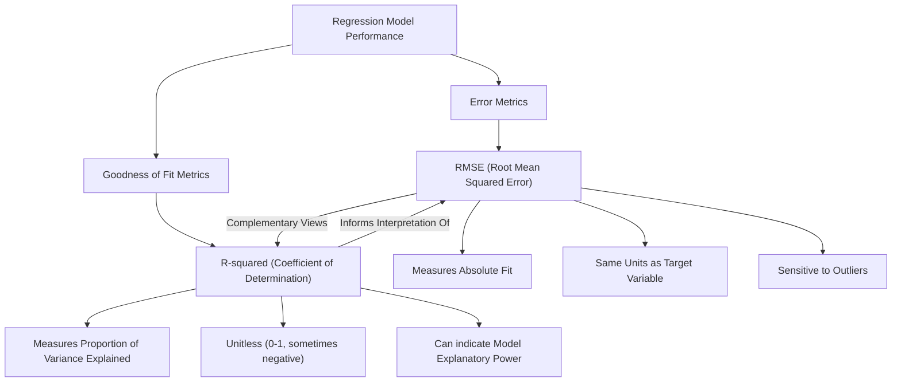
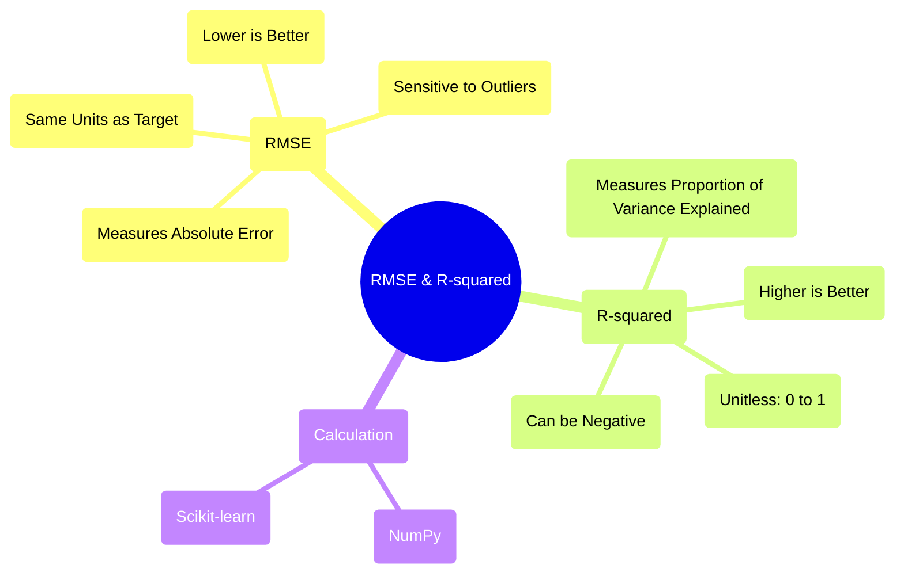

## RMSE and R-squared Evolution Document

### 1. Introduction and Historical Context

Root Mean Squared Error (RMSE) and R-squared (Coefficient of Determination) are two of the most widely used and fundamental metrics for evaluating the performance of regression models. In the realm of statistics, machine learning, and data science, understanding how well a model predicts continuous outcomes is paramount, and these metrics provide crucial insights into a model's accuracy and explanatory power.

Historically, both RMSE and R-squared emerged from classical statistical analysis, particularly in the context of linear regression. As statistical modeling grew in complexity and applications, these metrics became standard tools for assessing model fit. With the rise of machine learning in the late 20th and early 21st centuries, their importance only amplified, becoming essential for comparing different algorithms, tuning hyperparameters, and communicating model effectiveness to stakeholders. They provide a quantitative way to gauge predictive accuracy and the proportion of variance explained, respectively, forming a common language for model evaluation across various disciplines.

### 2. Core Concepts

The core of evaluating regression models lies in quantifying the difference between predicted and actual values. RMSE and R-squared offer complementary perspectives on this difference.

#### 2.1. Root Mean Squared Error (RMSE)

**Mental Model / Analogy:**
Imagine you're trying to hit a target with darts. Each dart throw is a prediction, and the bullseye is the actual value. RMSE is like calculating the average distance of your darts from the bullseye. It penalizes larger misses more heavily than smaller ones because the errors are squared before averaging. A smaller RMSE means your darts are, on average, closer to the bullseye.

RMSE is a frequently used measure of the differences between values predicted by a model or an estimator and the values observed. It is the standard deviation of the residuals (prediction errors). Residuals are a measure of how far from the regression line data points are; RMSE is a measure of how spread out these residuals are. In other words, it tells you how concentrated the data is around the line of best fit.

The formula for RMSE is:

$RMSE = \sqrt{\frac{1}{n} \sum_{i=1}^{n} (y_i - \hat{y}_i)^2}$

Where:
*   $y_i$ is the actual value for the i-th observation.
*   $\hat{y}_i$ is the predicted value for the i-th observation.
*   $n$ is the total number of observations.

**Interpretation:**
*   **Lower RMSE is better:** An RMSE of 0 indicates a perfect fit, where all predictions exactly match the actual values.
*   **Units:** RMSE is in the same units as the dependent variable (the target variable), making it easy to interpret in a practical context. For example, if you're predicting house prices in dollars, an RMSE of $10,000 means your predictions are, on average, off by $10,000.
*   **Sensitivity to outliers:** Due to the squaring of errors, RMSE penalizes large errors more than Mean Absolute Error (MAE), making it sensitive to outliers.

#### 2.2. R-squared (Coefficient of Determination)

**Mental Model / Analogy:**
R-squared tells you how much of the variation in your target (bullseye) is explained by your model (dart throws), compared to just guessing the average. If R-squared is 0.80, it means 80% of the reasons why the bullseye isn't always in the same spot can be accounted for by your dart throws. If it's very low, your dart throws don't explain much, and it's almost like you're just throwing randomly around the average position.

R-squared, or the coefficient of determination, is a statistical measure that represents the proportion of the variance for a dependent variable that's explained by an independent variable or variables in a regression model. It indicates how well the terms (data points) fit a curve or line.

The formula for R-squared is:

$R^2 = 1 - \frac{\sum_{i=1}^{n} (y_i - \hat{y}_i)^2}{\sum_{i=1}^{n} (y_i - \bar{y})^2}$

Where:
*   $y_i$ is the actual value for the i-th observation.
*   $\hat{y}_i$ is the predicted value for the i-th observation.
*   $\bar{y}$ is the mean of the actual values.
*   $n$ is the total number of observations.

**Interpretation:**
*   **Range:** R-squared typically ranges from 0 to 1, where:
    *   **1:** Indicates that the model explains all the variability of the response data around its mean.
    *   **0:** Indicates that the model explains none of the variability of the response data around its mean (it's as good as simply predicting the mean).
*   **Negative R-squared:** While usually between 0 and 1, R-squared can be negative if the model is worse than simply predicting the mean of the dependent variable. This often suggests a very poor model or incorrect application.
*   **Proportion of variance explained:** An R-squared of 0.75 means that 75% of the variance in the dependent variable is predictable from the independent variables.

**Mermaid Diagram: Relationship between RMSE and R-squared (Conceptual)**



### 3. Detailed API Overview (Conceptual)

While RMSE and R-squared are statistical concepts, their calculation is often implemented using numerical libraries like NumPy and statistical/machine learning libraries such as scikit-learn in Python. These libraries provide efficient and standardized ways to compute these metrics.

#### 3.1. RMSE Calculation

**Goal:** Calculate the Root Mean Squared Error (RMSE) between actual and predicted values.

**Code:**
```python
import numpy as np
from sklearn.metrics import mean_squared_error

# Actual values
y_true = np.array([3, -0.5, 2, 7])
# Predicted values
y_pred = np.array([2.5, 0.0, 2, 8])

# Manual calculation using NumPy
rmse_manual = np.sqrt(np.mean((y_true - y_pred)**2))
print(f"RMSE (manual with NumPy): {rmse_manual:.4f}")

# Using scikit-learn's mean_squared_error with squared=False
rmse_sklearn = mean_squared_error(y_true, y_pred, squared=False)
print(f"RMSE (scikit-learn): {rmse_sklearn:.4f}")
```

**Expected Output:**
```
RMSE (manual with NumPy): 0.6124
RMSE (scikit-learn): 0.6124
```

**Explanation:**
The code demonstrates two ways to calculate RMSE. The manual method uses basic NumPy operations to implement the RMSE formula: calculating squared differences, averaging them, and then taking the square root. The `scikit-learn` method utilizes `mean_squared_error` with the `squared=False` parameter to directly return RMSE, which is generally preferred for conciseness and robustness in a machine learning context.

*   **Context:** Computes the Root Mean Squared Error, a measure of the average magnitude of the errors.
*   **Parameters:**
    *   `y_true`: Array-like, true target values.
    *   `y_pred`: Array-like, estimated target values.
    *   `squared`: (For scikit-learn) If `True` returns MSE, if `False` returns RMSE.
*   **Returns:** A float representing the RMSE value.

#### 3.2. R-squared Calculation

**Goal:** Calculate the R-squared (Coefficient of Determination) score.

**Code:**
```python
import numpy as np
from sklearn.metrics import r2_score

# Actual values
y_true = np.array([3, -0.5, 2, 7])
# Predicted values
y_pred = np.array([2.5, 0.0, 2, 8])

# Manual calculation using NumPy
ss_res = np.sum((y_true - y_pred)**2) # Sum of squares of residuals
ss_tot = np.sum((y_true - np.mean(y_true))**2) # Total sum of squares
r2_manual = 1 - (ss_res / ss_tot)
print(f"R-squared (manual with NumPy): {r2_manual:.4f}")

# Using scikit-learn's r2_score
r2_sklearn = r2_score(y_true, y_pred)
print(f"R-squared (scikit-learn): {r2_sklearn:.4f}")

# Example of a poor model (R-squared can be negative)
y_pred_bad = np.array([5, 5, 5, 5]) # A constant prediction, worse than the mean
r2_bad = r2_score(y_true, y_pred_bad)
print(f"R-squared (bad model example): {r2_bad:.4f}")
```

**Expected Output:**
```
R-squared (manual with NumPy): 0.9486
R-squared (scikit-learn): 0.9486
R-squared (bad model example): -0.0769
```

**Explanation:**
Similar to RMSE, R-squared can be calculated manually using NumPy based on its formula, which involves the sum of squares of residuals and the total sum of squares. However, the `r2_score` function from `scikit-learn` provides a direct and robust way to compute R-squared, handling edge cases and ensuring consistency. The example also illustrates that R-squared can be negative for models that perform worse than a simple horizontal line at the mean of the dependent variable.

*   **Context:** Computes the R-squared (coefficient of determination) score, indicating the proportion of variance in the dependent variable predictable from the independent variable(s).
*   **Parameters:**
    *   `y_true`: Array-like, true target values.
    *   `y_pred`: Array-like, estimated target values.
*   **Returns:** A float representing the R-squared value.

#### 3.3. Quick Reference: Calculation Functions

| Function/Method | Description | When to Use |
| :--- | :--- | :--- |
| `np.sqrt(np.mean((y_true - y_pred)**2))` | Manual RMSE calculation | For fundamental understanding or when `scikit-learn` is not available. |
| `sklearn.metrics.mean_squared_error(..., squared=False)` | `scikit-learn` RMSE calculation | Preferred for robustness and convenience in machine learning contexts. |
| `1 - (np.sum((y_true - y_pred)**2) / np.sum((y_true - np.mean(y_true))**2))` | Manual R-squared calculation | For fundamental understanding or when `scikit-learn` is not available. |
| `sklearn.metrics.r2_score(y_true, y_pred)` | `scikit-learn` R-squared calculation | Preferred for robustness and convenience in machine learning contexts. |

### 3.4. API Mindmap



### 4. Evolution and Impact

The evolution and widespread adoption of RMSE and R-squared reflect their enduring utility in assessing and comparing regression models.

*   **From Theory to Practice:** Originating in theoretical statistics, these metrics have transitioned into practical tools, becoming indispensable for practitioners in diverse fields such as econometrics, engineering, and predictive analytics. Their straightforward interpretation (especially RMSE in the target variable's units) makes them accessible to non-experts.
*   **Benchmarking and Model Selection:** In the era of machine learning, RMSE and R-squared serve as critical benchmarks for model comparison. Researchers and developers routinely use them to evaluate new algorithms, compare the performance of different models (e.g., linear regression vs. random forest), and select the best-performing model for a given task.
*   **Hyperparameter Tuning:** During the hyperparameter tuning process, these metrics guide optimization algorithms. For instance, a common objective in grid search or Bayesian optimization for regression models is to minimize RMSE or maximize R-squared on validation data.
*   **Limitations and Context:** Over time, the understanding of these metrics has also evolved to include their limitations. For example, R-squared can be misleading in certain scenarios (e.g., in models with many predictors, Adjusted R-squared is often preferred). Both metrics are sensitive to outliers, prompting the use of alternative robust metrics like Mean Absolute Error (MAE) when dealing with noisy data. The recognition of these nuances has led to a more sophisticated application of these metrics, often used in conjunction with other evaluation techniques and visualizations.
*   **Standardization Across Libraries:** The consistent implementation of these metrics across libraries like scikit-learn ensures that model evaluation is standardized and reproducible, facilitating collaboration and knowledge sharing within the scientific computing community.

### 5. Conclusion

RMSE and R-squared remain cornerstone metrics in the evaluation of regression models. RMSE provides a clear, interpretable measure of the typical magnitude of prediction errors, expressed in the same units as the target variable, making it invaluable for understanding absolute model accuracy. R-squared, on the other hand, quantifies the proportion of the variance in the dependent variable that can be explained by the model, offering insight into its explanatory power.

Together, these metrics offer a comprehensive view of a regression model's performance, guiding model selection, refinement, and interpretation. While their fundamental definitions have remained consistent, their application and the understanding of their nuances have evolved alongside the growth of statistical modeling and machine learning, solidifying their role as essential tools for data scientists and analysts worldwide.