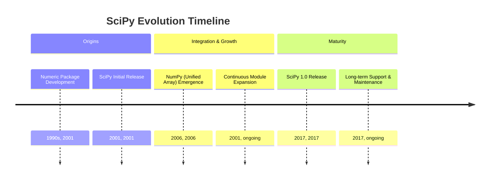
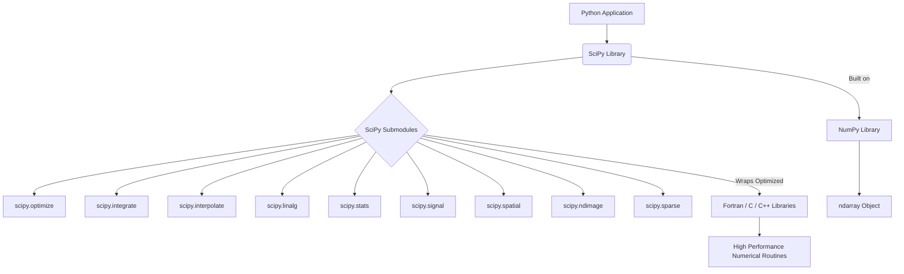
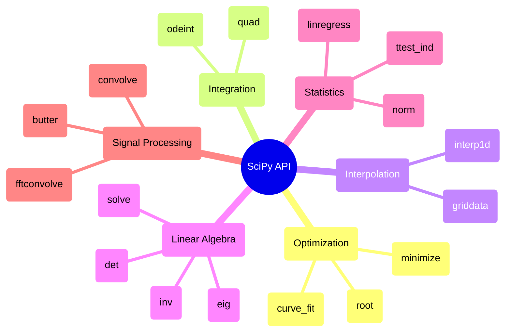

## SciPy Evolution Document

### 1. Introduction and Historical Context

SciPy is an open-source Python library that builds on NumPy, providing a vast collection of algorithms and functions for scientific and technical computing. It offers specialized tools for tasks such as optimization, linear algebra, integration, interpolation, signal processing, image processing, and statistics, making it an indispensable library for researchers, engineers, and data scientists across various scientific disciplines.

The origins of SciPy can be traced back to the late 1990s with the development of `Numeric`, an array type for numerical computing in Python. In 2001, Travis Oliphant, Eric Jones, and Pearu Peterson merged their existing code to create SciPy, aiming to provide a more comprehensive and integrated environment for scientific computing in Python. This effort was part of a broader movement to enhance Python's capabilities in scientific domains, which also saw the emergence of other foundational libraries like IPython and Matplotlib.

The underlying array package, `Numeric`, was eventually superseded by NumPy in 2006, a project led by Travis Oliphant that unified `Numeric` and `Numarray`. SciPy continued to evolve, reaching its significant 1.0 release in late 2017, approximately 16 years after its initial launch, signifying its maturity and stability as a critical component of the scientific Python ecosystem.

### 1.1. SciPy Evolution Timeline

### 2. Core Architecture

SciPy's core architecture is designed as a collection of specialized submodules that extend NumPy's capabilities. Each submodule focuses on a distinct area of scientific computing, providing a modular and organized structure for its vast array of functions and algorithms.

#### 2.1. Submodule Organization

SciPy is organized into various subpackages, each dedicated to a specific domain:

*   **`scipy.optimize`**: Algorithms for optimization, including minimization, curve fitting, and root finding.
*   **`scipy.integrate`**: Routines for numerical integration (quadrature) and ordinary differential equations.
*   **`scipy.interpolate`**: Tools for interpolation, including various interpolation methods.
*   **`scipy.linalg`**: Advanced linear algebra routines, building on `numpy.linalg` but offering more specialized functions.
*   **`scipy.stats`**: Statistical functions, distributions, and statistical tests.
*   **`scipy.signal`**: Signal processing tools, including filtering, convolution, and spectral analysis.
*   **`scipy.spatial`**: Spatial data structures and algorithms, such as k-d trees and Delaunay triangulation.
*   **`scipy.ndimage`**: N-dimensional image processing.
*   **`scipy.sparse`**: Sparse matrix storage and sparse linear algebra.

#### 2.2. Leveraging Compiled Code

To achieve high performance, SciPy wraps highly optimized implementations written in lower-level languages such as Fortran, C, and C++. This allows users to leverage the flexibility and ease of use of Python for high-level programming while benefiting from the speed and efficiency of compiled code for computationally intensive tasks. This hybrid approach is fundamental to SciPy's ability to handle complex scientific computations effectively.

#### 2.3. NumPy Foundation

SciPy is deeply dependent on NumPy. All data exchanged between SciPy's functions and the user's code is typically in the form of NumPy arrays. This tight integration ensures consistency in data handling and allows SciPy to seamlessly operate on the efficient `ndarray` objects provided by NumPy.

**Mermaid Diagram: SciPy Core Architecture**

### 3. Detailed API Overview

SciPy's API is extensive, with each submodule offering a specialized set of functions.

#### 3.1. Optimization (`scipy.optimize`)

*   **`scipy.optimize.minimize(fun, x0, ...)`**: Minimization of scalar function of one or more variables.
*   **`scipy.optimize.curve_fit(f, xdata, ydata, ...)`**: Use non-linear least squares to fit a function, `f`, to data.
*   **`scipy.optimize.root(fun, x0, ...)`**: Find a root of a function.

#### 3.2. Integration (`scipy.integrate`)

*   **`scipy.integrate.quad(func, a, b)`**: Compute a definite integral.
*   **`scipy.integrate.odeint(func, y0, t, ...)`**: Integrate a system of ordinary differential equations.

#### 3.3. Interpolation (`scipy.interpolate`)

*   **`scipy.interpolate.interp1d(x, y, ...)`**: Interpolate a 1-D function.
*   **`scipy.interpolate.griddata(points, values, xi, ...)`**: Interpolate unstructured D-dimensional data.

#### 3.4. Linear Algebra (`scipy.linalg`)

*   **`scipy.linalg.det(a)`**: Compute the determinant of a matrix.
*   **`scipy.linalg.inv(a)`**: Compute the inverse of a matrix.
*   **`scipy.linalg.eig(a)`**: Compute the eigenvalues and right eigenvectors of a square array.
*   **`scipy.linalg.solve(a, b)`**: Solve the linear equation `Ax = b`.

#### 3.5. Statistics (`scipy.stats`)

*   **`scipy.stats.norm`**: A normal continuous random variable.
*   **`scipy.stats.ttest_ind(a, b)`**: Calculate the T-test for the means of two independent samples of scores.
*   **`scipy.stats.linregress(x, y)`**: Calculate a linear least-squares regression for two sets of measurements.

#### 3.6. Signal Processing (`scipy.signal`)

*   **`scipy.signal.convolve(in1, in2)`**: Convolve two N-dimensional arrays.
*   **`scipy.signal.fftconvolve(in1, in2)`**: Convolve two N-dimensional arrays using FFT.
*   **`scipy.signal.butter(N, Wn, ...)`**: Butterworth digital and analog filter design.

### 3.7. API Mindmap

### 4. Evolution and Impact

*   **Foundation of Scientific Python:** SciPy, alongside NumPy, forms the bedrock of the scientific Python ecosystem, enabling complex numerical and scientific computations that are crucial for various fields.
*   **Comprehensive Toolset:** It provides a vast and well-organized collection of algorithms, saving researchers and developers from having to implement these complex routines from scratch.
*   **Performance through Compiled Code:** By wrapping highly optimized Fortran, C, and C++ libraries, SciPy delivers high performance for computationally intensive tasks, making Python a viable language for scientific computing.
*   **Interoperability:** Its tight integration with NumPy ensures seamless data handling and compatibility with other libraries in the scientific Python stack.
*   **Community-Driven Development:** SciPy has a strong and active open-source community that continuously contributes to its development, maintenance, and documentation, ensuring its ongoing relevance and quality.

### 5. Conclusion

SciPy has evolved into an indispensable library for scientific and technical computing in Python. By extending NumPy's capabilities with a rich set of specialized algorithms and functions, it empowers users to perform complex mathematical operations efficiently and effectively. Its modular architecture, reliance on optimized compiled code, and strong community support have cemented its position as a critical component of the scientific Python ecosystem, driving innovation across diverse scientific and engineering domains.
