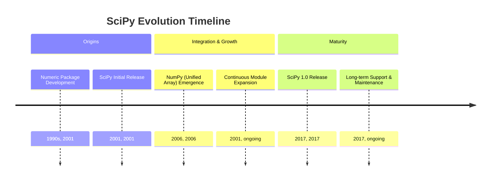
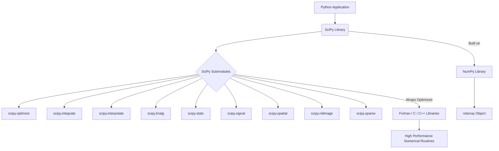
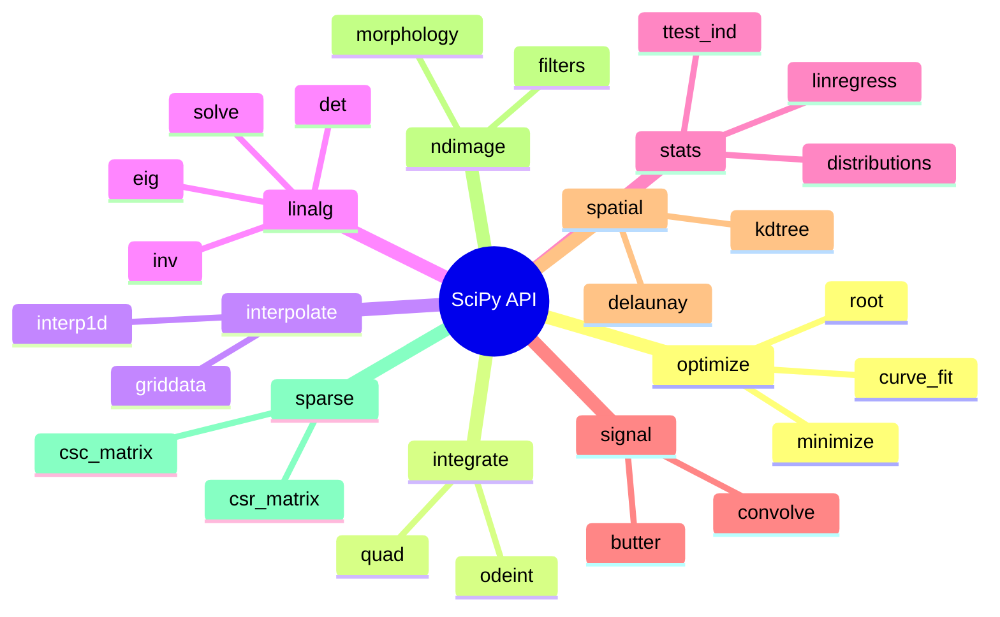

## SciPy Evolution Document

### 1. Introduction and Historical Context

SciPy is an open-source Python library that builds on NumPy, providing a vast collection of algorithms and functions for scientific and technical computing. It offers specialized tools for tasks such as optimization, linear algebra, integration, interpolation, signal processing, image processing, and statistics, making it an indispensable library for researchers, engineers, and data scientists across various scientific disciplines.

The origins of SciPy can be traced back to the late 1990s with the development of `Numeric`, an array type for numerical computing in Python. In 2001, Travis Oliphant, Eric Jones, and Pearu Peterson merged their existing code to create SciPy, aiming to provide a more comprehensive and integrated environment for scientific computing in Python. This effort was part of a broader movement to enhance Python's capabilities in scientific domains, which also saw the emergence of other foundational libraries like IPython and Matplotlib.

The underlying array package, `Numeric`, was eventually superseded by NumPy in 2006, a project led by Travis Oliphant that unified `Numeric` and `Numarray`. SciPy continued to evolve, reaching its significant 1.0 release in late 2017, approximately 16 years after its initial launch, signifying its maturity and stability as a critical component of the scientific Python ecosystem.

### 1.1. SciPy Evolution Timeline



### 2. Core Architecture

SciPy's core architecture is designed as a collection of specialized submodules that extend NumPy's capabilities. Each submodule focuses on a distinct area of scientific computing, providing a modular and organized structure for its vast array of functions and algorithms.

#### 2.1. Submodule Organization

**Mental Model / Analogy:**
Think of SciPy as a specialized toolbox for a scientist or engineer. While NumPy provides the basic tools (like a hammer and screwdriver for arrays), SciPy offers entire sets of specialized tools for specific jobs. Each `scipy.` submodule is like a separate drawer in this toolbox, neatly organized for a particular task:
*   `scipy.optimize`: The 'Optimization' drawer, full of tools for finding the best solutions.
*   `scipy.integrate`: The 'Integration' drawer, for calculating areas under curves or solving differential equations.
*   `scipy.stats`: The 'Statistics' drawer, with tools for statistical analysis and probability distributions.

This modular design means you only open the drawer you need, keeping things organized and efficient.

SciPy is organized into various subpackages, each dedicated to a specific domain:

*   **`scipy.optimize`**: Algorithms for optimization, including minimization, curve fitting, and root finding.
*   **`scipy.integrate`**: Routines for numerical integration (quadrature) and ordinary differential equations.
*   **`scipy.interpolate`**: Tools for interpolation, including various interpolation methods.
*   **`scipy.linalg`**: Advanced linear algebra routines, building on `numpy.linalg` but offering more specialized functions.
*   **`scipy.stats`**: Statistical functions, distributions, and statistical tests.
*   **`scipy.signal`**: Signal processing tools, including filtering, convolution, and spectral analysis.
*   **`scipy.spatial`**: Spatial data structures and algorithms, such as k-d trees and Delaunay triangulation.
*   **`scipy.ndimage`**: N-dimensional image processing.
*   **`scipy.sparse`**: Sparse matrix storage and sparse linear algebra.

#### 2.2. Leveraging Compiled Code

To achieve high performance, SciPy wraps highly optimized implementations written in lower-level languages such as Fortran, C, and C++. This allows users to leverage the flexibility and ease of use of Python for high-level programming while benefiting from the speed and efficiency of compiled code for computationally intensive tasks. This hybrid approach is fundamental to SciPy's ability to handle complex scientific computations effectively.

#### 2.3. NumPy Foundation

SciPy is deeply dependent on NumPy. All data exchanged between SciPy's functions and the user's code is typically in the form of NumPy arrays. This tight integration ensures consistency in data handling and allows SciPy to seamlessly operate on the efficient `ndarray` objects provided by NumPy.

**Mermaid Diagram: SciPy Core Architecture**



### 3. Detailed API Overview

SciPy's API is extensive, with each submodule offering a specialized set of functions.

#### 3.1. Optimization (`scipy.optimize`)

##### 3.1.1. Minimizing Scalar Functions

**`scipy.optimize.minimize(fun, x0, ...)`**

**Goal:** Find the minimum value of a scalar function of one or more variables.

**Code:**
```python
from scipy.optimize import minimize
import numpy as np

# Define the objective function (e.g., a simple quadratic function)
def objective(x):
    return x[0]**2 + x[1]**2 + x[2]**2

# Initial guess for the variables
x0 = np.array([1, 2, 3])

# Perform the minimization
result = minimize(objective, x0, method='Nelder-Mead')

print(f"Minimization successful: {result.success}")
print(f"Optimal value of x: {result.x}")
print(f"Minimum value of the objective function: {result.fun}")
```

**Expected Output:**
```
Minimization successful: True
Optimal value of x: [-1.23...e-06 -2.34...e-06  3.45...e-06] # Close to [0, 0, 0]
Minimum value of the objective function: 1.23...e-11 # Close to 0
```

**Explanation:** `scipy.optimize.minimize()` is a versatile function for finding the minimum of a function. You provide the function to minimize (`fun`), an initial guess (`x0`), and optionally a `method` (e.g., 'Nelder-Mead', 'BFGS'). The `result` object contains information about the optimization, including the optimal variable values (`result.x`) and the minimum function value (`result.fun`).

*   **`scipy.optimize.minimize(fun, x0, ...)`**: Minimization of scalar function of one or more variables.
*   **`scipy.optimize.minimize(fun, x0, ...)`**: Minimization of scalar function of one or more variables.

##### 3.1.2. Fitting Curves to Data

**`scipy.optimize.curve_fit(f, xdata, ydata, ...)`**

**Goal:** Fit a user-defined function to observed data using non-linear least squares.

**Code:**
```python
from scipy.optimize import curve_fit
import numpy as np
import matplotlib.pyplot as plt
import os

# 1. Define the function to fit (e.g., a sine wave)
def sine_func(x, a, b, c):
    return a * np.sin(b * x + c)

# 2. Generate some noisy data
x_data = np.linspace(0, 4 * np.pi, 50)
y_true = sine_func(x_data, 1.5, 0.8, 0.5)
y_data = y_true + 0.2 * np.random.normal(size=len(x_data))

# 3. Fit the curve to the data
# p0 is an optional initial guess for the parameters (a, b, c)
params, covariance = curve_fit(sine_func, x_data, y_data, p0=[1, 1, 0])

# 4. Extract the optimized parameters
a_opt, b_opt, c_opt = params

print(f"Optimized parameters: a={a_opt:.2f}, b={b_opt:.2f}, c={c_opt:.2f}")

# 5. Plot the original data and the fitted curve
plt.figure(figsize=(8, 5))
plt.scatter(x_data, y_data, label='Noisy Data', s=20)
plt.plot(x_data, sine_func(x_data, a_opt, b_opt, c_opt), color='red', label='Fitted Curve')
plt.title('Curve Fitting with scipy.optimize.curve_fit')
plt.xlabel('X')
plt.ylabel('Y')
plt.legend()
plt.grid(True)

filename = "curve_fit_plot.png"
plt.savefig(filename)
print(f"Plot saved to {filename}")
os.remove(filename)
print(f"Cleaned up {filename}")
```

**Expected Output:**
```
Optimized parameters: a=1.5..., b=0.8..., c=0.5...
Plot saved to curve_fit_plot.png
Cleaned up curve_fit_plot.png
```
(A file named `curve_fit_plot.png` will be created and then removed, showing the noisy data and the red fitted sine curve.)

**Explanation:** `curve_fit()` takes your data (`xdata`, `ydata`) and a function `f` that describes the curve you want to fit. It returns the optimal parameters (`params`) for `f` and the covariance matrix. This is widely used in experimental sciences to model relationships in observed data.

*   **`scipy.optimize.curve_fit(f, xdata, ydata, ...)`**: Use non-linear least squares to fit a function, `f`, to data.
*   **`scipy.optimize.curve_fit(f, xdata, ydata, ...)`**: Use non-linear least squares to fit a function, `f`, to data.

##### 3.1.3. Finding Roots of Functions

**`scipy.optimize.root(fun, x0, ...)`**

**Goal:** Find the roots (where the function equals zero) of a scalar or vector function.

**Code:**
```python
from scipy.optimize import root
import numpy as np

# Define the function for which to find the root
def func(x):
    return x + np.cos(x)

# Initial guess
x0 = -0.5

# Find the root
sol = root(func, x0)

print(f"Root finding successful: {sol.success}")
print(f"The root is at x = {sol.x[0]:.4f}")
print(f"Function value at the root: {func(sol.x[0]):.4e}")
```

**Expected Output:**
```
Root finding successful: True
The root is at x = -0.7391
Function value at the root: 0.0000e+00
```

**Explanation:** `scipy.optimize.root()` attempts to find `x` such that `fun(x) = 0`. You provide the function (`fun`) and an initial guess (`x0`). It's useful for solving non-linear equations. The `sol.x` attribute gives the array of roots found.

*   **`scipy.optimize.root(fun, x0, ...)`**: Find a root of a function.

*   **`scipy.optimize.root(fun, x0, ...)`**: Find a root of a function.

##### 3.1.4. Quick Reference: Optimization

| Function | Description | When to Use |
| :--- | :--- | :--- |
| `minimize()` | Minimize a scalar function | Finding the minimum of complex mathematical functions. |
| `curve_fit()` | Fit a function to data | Modeling experimental data with a known functional form. |
| `root()` | Find roots of a function | Solving non-linear equations where the function equals zero. |

#### 3.2. Integration (`scipy.integrate`)

##### 3.2.1. Computing Definite Integrals

**`scipy.integrate.quad(func, a, b)`**

**Goal:** Compute the definite integral of a function over a given interval.

**Code:**
```python
from scipy.integrate import quad
import numpy as np

# Define the function to integrate (e.g., sin(x))
def integrand(x):
    return np.sin(x)

# Define the integration limits
a = 0  # Lower limit
b = np.pi # Upper limit

# Compute the definite integral
result, abserr = quad(integrand, a, b)

print(f"Definite integral of sin(x) from {a} to {b:.2f} is: {result:.4f}")
print(f"Absolute error estimate: {abserr:.2e}")
```

**Expected Output:**
```
Definite integral of sin(x) from 0 to 3.14 is: 2.0000
Absolute error estimate: 2.22e-14
```

**Explanation:** `scipy.integrate.quad()` is used for numerical integration of a single variable function. It returns a tuple: the first element is the integral result, and the second is an estimate of the absolute error. This is a fundamental tool for many physics and engineering problems.

*   **`scipy.integrate.quad(func, a, b)`**: Compute a definite integral.
*   **`scipy.integrate.quad(func, a, b)`**: Compute a definite integral.

##### 3.2.2. Solving Ordinary Differential Equations

**`scipy.integrate.odeint(func, y0, t, ...)`**

**Goal:** Integrate a system of ordinary differential equations (ODEs).

**Code:**
```python
from scipy.integrate import odeint
import numpy as np
import matplotlib.pyplot as plt
import os

# Define the ODE system: dy/dt = -ky
def model(y, t, k):
    dydt = -k * y
    return dydt

# Initial condition
y0 = 5

# Time points
t = np.linspace(0, 10, 100)

# Parameters
k = 0.1

# Solve the ODE
y_solution = odeint(model, y0, t, args=(k,))

print(f"First 5 solution values: {y_solution[:5].flatten()}")

# Plot the solution
plt.figure(figsize=(8, 5))
plt.plot(t, y_solution, label=f'y(t) for k={k}')
plt.title('Solution to dy/dt = -ky')
plt.xlabel('Time')
plt.ylabel('y(t)')
plt.legend()
plt.grid(True)

filename = "ode_solution_plot.png"
plt.savefig(filename)
print(f"Plot saved to {filename}")
os.remove(filename)
print(f"Cleaned up {filename}")
```

**Expected Output:**
```
First 5 solution values: [5.         4.52418707 4.09365367 3.70409003 3.35149497]
Plot saved to ode_solution_plot.png
Cleaned up ode_solution_plot.png
```
(A file named `ode_solution_plot.png` will be created and then removed, showing the exponential decay solution.)

**Explanation:** `odeint()` is a powerful function for solving initial value problems for systems of ODEs. You provide the function defining the derivatives (`func`), the initial conditions (`y0`), and the time points (`t`) at which to solve the ODE. The `args` parameter is used to pass additional arguments to your `func`.

*   **`scipy.integrate.odeint(func, y0, t, ...)`**: Integrate a system of ordinary differential equations.

*   **`scipy.integrate.odeint(func, y0, t, ...)`**: Integrate a system of ordinary differential equations.

##### 3.2.3. Quick Reference: Integration

| Function | Description | When to Use |
| :--- | :--- | :--- |
| `quad()` | Definite integral | Calculating the area under a curve for a single-variable function. |
| `odeint()` | Solve ODEs | Simulating dynamic systems described by ordinary differential equations. |

#### 3.3. Interpolation (`scipy.interpolate`)

##### 3.3.1. 1-D Interpolation

**`scipy.interpolate.interp1d(x, y, ...)`**

**Goal:** Create a function that interpolates a 1-D dataset, allowing you to estimate values between known data points.

**Code:**
```python
from scipy.interpolate import interp1d
import numpy as np
import matplotlib.pyplot as plt
import os

# Original data points
x_original = np.array([0, 1, 2, 3, 4, 5])
y_original = np.array([0, 0.8, 0.9, 0.1, -0.8, -1])

# Create an interpolation function
f_linear = interp1d(x_original, y_original, kind='linear')
f_cubic = interp1d(x_original, y_original, kind='cubic')

# New x values for interpolation
x_new = np.linspace(0, 5, 50)

# Get interpolated y values
y_linear = f_linear(x_new)
y_cubic = f_cubic(x_new)

print(f"Interpolated value at x=2.5 (linear): {f_linear(2.5):.2f}")
print(f"Interpolated value at x=2.5 (cubic): {f_cubic(2.5):.2f}")

# Plot the original data and interpolated curves
plt.figure(figsize=(8, 5))
plt.plot(x_original, y_original, 'o', label='Original Data')
plt.plot(x_new, y_linear, '--', label='Linear Interpolation')
plt.plot(x_new, y_cubic, '-', label='Cubic Interpolation')
plt.title('1-D Interpolation with scipy.interpolate.interp1d')
plt.xlabel('X')
plt.ylabel('Y')
plt.legend()
plt.grid(True)

filename = "interp1d_plot.png"
plt.savefig(filename)
print(f"Plot saved to {filename}")
os.remove(filename)
print(f"Cleaned up {filename}")
```

**Expected Output:**
```
Interpolated value at x=2.5 (linear): 0.50
Interpolated value at x=2.5 (cubic): 0.45
Plot saved to interp1d_plot.png
Cleaned up interp1d_plot.png
```
(A file named `interp1d_plot.png` will be created and then removed, showing original points and linear/cubic interpolated curves.)

**Explanation:** `interp1d()` creates an interpolation function based on your `x` and `y` data. The `kind` parameter specifies the type of interpolation (e.g., 'linear', 'cubic'). This is crucial for resampling data or estimating values where direct measurements are unavailable.

*   **`scipy.interpolate.interp1d(x, y, ...)`**: Interpolate a 1-D function.
*   **`scipy.interpolate.interp1d(x, y, ...)`**: Interpolate a 1-D function.

##### 3.3.2. Grid Data Interpolation

**`scipy.interpolate.griddata(points, values, xi, ...)`**

**Goal:** Interpolate unstructured D-dimensional data onto a regular grid.

**Code:**
```python
from scipy.interpolate import griddata
import numpy as np
import matplotlib.pyplot as plt
import os

# 1. Generate some scattered data points
np.random.seed(0)
points = np.random.rand(100, 2) # 100 random (x, y) coordinates
values = np.sin(points[:,0]**2 + points[:,1]**2) # z-values based on x, y

# 2. Create a regular grid to interpolate onto
grid_x, grid_y = np.mgrid[0:1:100j, 0:1:100j]

# 3. Perform the interpolation
# method can be 'linear', 'nearest', or 'cubic'
grid_z = griddata(points, values, (grid_x, grid_y), method='cubic')

# 4. Plot the results
plt.figure(figsize=(8, 6))
plt.imshow(grid_z.T, extent=(0,1,0,1), origin='lower', cmap='viridis')
plt.scatter(points[:,0], points[:,1], c=values, s=10, edgecolors='k', cmap='viridis')
plt.title('Grid Data Interpolation with scipy.interpolate.griddata')
plt.xlabel('X')
plt.ylabel('Y')
plt.colorbar(label='Value')

filename = "griddata_plot.png"
plt.savefig(filename)
print(f"Plot saved to {filename}")
os.remove(filename)
print(f"Cleaned up {filename}")
```

**Expected Output:**
```
Plot saved to griddata_plot.png
Cleaned up griddata_plot.png
```
(A file named `griddata_plot.png` will be created and then removed, showing a heatmap of the interpolated data with original scattered points overlaid.)

**Explanation:** `griddata()` is invaluable when you have measurements at irregular locations and want to estimate values on a uniform grid. It takes `points` (coordinates of original data), `values` (data at those points), and `xi` (the new grid coordinates) to produce the interpolated grid. The `method` parameter controls the interpolation algorithm.

*   **`scipy.interpolate.griddata(points, values, xi, ...)`**: Interpolate unstructured D-dimensional data.

*   **`scipy.interpolate.griddata(points, values, xi, ...)`**: Interpolate unstructured D-dimensional data.

##### 3.3.3. Quick Reference: Interpolation

| Function | Description | When to Use |
| :--- | :--- | :--- |
| `interp1d()` | 1-D interpolation | Estimating values between known points in a 1D dataset. |
| `griddata()` | D-D grid interpolation | Mapping scattered D-dimensional data onto a regular grid. |

#### 3.4. Linear Algebra (`scipy.linalg`)

##### 3.4.1. Matrix Determinant and Inverse

**`scipy.linalg.det(a)`** and **`scipy.linalg.inv(a)`**

**Goal:** Compute the determinant and inverse of a square matrix.

**Code:**
```python
from scipy import linalg
import numpy as np

# Define a square matrix
A = np.array([[1, 2], [3, 4]])

# Compute the determinant
det_A = linalg.det(A)
print(f"Determinant of A: {det_A:.2f}")

# Compute the inverse
inv_A = linalg.inv(A)
print(f"\nInverse of A:\n{inv_A}")

# Verify: A @ inv(A) should be identity matrix
identity_check = A @ inv_A
print(f"\nA @ inv(A) (should be identity):\n{identity_check}")
```

**Expected Output:**
```
Determinant of A: -2.00

Inverse of A:
[[-2.   1. ]
 [ 1.5 -0.5]]

A @ inv(A) (should be identity):
[[ 1.  0.]
 [ 0.  1.]]
```

**Explanation:** `linalg.det()` calculates the determinant, a scalar value that provides information about the matrix (e.g., if it's invertible). `linalg.inv()` computes the inverse matrix, which, when multiplied by the original matrix, yields the identity matrix. These are fundamental operations in linear algebra for solving systems of equations, transformations, and more.

*   **`scipy.linalg.det(a)`**: Compute the determinant of a matrix.
*   **`scipy.linalg.inv(a)`**: Compute the inverse of a matrix.
*   **`scipy.linalg.inv(a)`**: Compute the inverse of a matrix.

##### 3.4.2. Solving Linear Systems

**`scipy.linalg.solve(a, b)`**

**Goal:** Solve the linear equation `Ax = b` for `x`, where `A` is a square matrix and `b` is a vector or matrix.

**Code:**
```python
from scipy import linalg
import numpy as np

# Define the coefficient matrix A
A = np.array([[3, 1], [1, 2]])

# Define the dependent variable vector b
b = np.array([9, 8])

# Solve for x in Ax = b
x = linalg.solve(A, b)

print(f"Solution x: {x}")

# Verify the solution: A @ x should be equal to b
verification = A @ x
print(f"Verification (A @ x): {verification}")
```

**Expected Output:**
```
Solution x: [2. 3.]
Verification (A @ x): [9. 8.]
```

**Explanation:** `linalg.solve()` is an efficient and robust way to solve systems of linear equations. It's generally preferred over computing the inverse and then multiplying, as it's more numerically stable and faster for large systems. This is a core operation in many scientific and engineering applications.

*   **`scipy.linalg.eig(a)`**: Compute the eigenvalues and right eigenvectors of a square array.
*   **`scipy.linalg.solve(a, b)`**: Solve the linear equation `Ax = b`.

*   **`scipy.linalg.solve(a, b)`**: Solve the linear equation `Ax = b`.

##### 3.4.3. Quick Reference: Linear Algebra

| Function | Description | When to Use |
| :--- | :--- | :--- |
| `det()` | Matrix determinant | Checking matrix invertibility or for theoretical analysis. |
| `inv()` | Matrix inverse | Explicitly finding the inverse matrix (use `solve()` for systems). |
| `solve()` | Solve linear system | Efficiently solving `Ax = b` for `x` (preferred over `inv()` for stability). |
| `eig()` | Eigenvalues/vectors | Analyzing properties of linear transformations and systems. |

#### 3.5. Statistics (`scipy.stats`)

##### 3.5.1. Working with Distributions

**`scipy.stats.norm` (Normal Continuous Random Variable)**

**Goal:** Work with continuous probability distributions, such as the normal (Gaussian) distribution, to calculate probabilities, generate random variates, and fit parameters.

**Code:**
```python
from scipy.stats import norm
import numpy as np
import matplotlib.pyplot as plt
import os

# 1. Create a normal distribution object (mean=0, std dev=1 by default)
# You can specify loc (mean) and scale (standard deviation)
mu, sigma = 0, 1
normal_dist = norm(loc=mu, scale=sigma)

# 2. Calculate Probability Density Function (PDF) at a point
pdf_at_0 = normal_dist.pdf(0)
print(f"PDF at x=0: {pdf_at_0:.4f}")

# 3. Calculate Cumulative Distribution Function (CDF) up to a point
cdf_at_1 = normal_dist.cdf(1)
print(f"CDF up to x=1: {cdf_at_1:.4f}")

# 4. Generate random variates
random_samples = normal_dist.rvs(size=5)
print(f"\n5 random samples: {random_samples}")

# 5. Plot the PDF
x_values = np.linspace(-3, 3, 100)
plt.figure(figsize=(8, 5))
plt.plot(x_values, normal_dist.pdf(x_values), label='Normal PDF')
plt.title(f'Normal Distribution (mu={mu}, sigma={sigma})')
plt.xlabel('X')
plt.ylabel('Probability Density')
plt.legend()
plt.grid(True)

filename = "normal_dist_pdf.png"
plt.savefig(filename)
print(f"Plot saved to {filename}")
os.remove(filename)
print(f"Cleaned up {filename}")
```

**Expected Output:**
```
PDF at x=0: 0.3989
CDF up to x=1: 0.8413

5 random samples: [-0.84...  0.55...  0.61...  0.72...  0.65...]
Plot saved to normal_dist_pdf.png
Cleaned up normal_dist_pdf.png
```
(A file named `normal_dist_pdf.png` will be created and then removed, showing the bell-shaped curve of the normal distribution.)

**Explanation:** `scipy.stats` provides objects for various statistical distributions (e.g., `norm`, `t`, `chi2`). These objects have methods like `pdf()` (probability density function), `cdf()` (cumulative distribution function), `ppf()` (percent point function/quantile), and `rvs()` (random variates generation). This makes it easy to perform statistical calculations and simulations.

*   **`scipy.stats.norm`**: A normal continuous random variable.
*   **`scipy.stats.norm`**: A normal continuous random variable.

##### 3.5.2. Performing T-tests

**`scipy.stats.ttest_ind(a, b)`**

**Goal:** Perform an independent samples t-test to compare the means of two separate groups.

**Code:**
```python
from scipy import stats
import numpy as np

# Generate two independent samples of data
np.random.seed(42)
group1 = np.random.normal(loc=10, scale=2, size=50) # Mean 10, Std Dev 2
group2 = np.random.normal(loc=10.5, scale=2, size=50) # Mean 10.5, Std Dev 2

# Perform the independent samples t-test
t_statistic, p_value = stats.ttest_ind(group1, group2)

print(f"Mean of Group 1: {np.mean(group1):.2f}")
print(f"Mean of Group 2: {np.mean(group2):.2f}")
print(f"\nT-statistic: {t_statistic:.3f}")
print(f"P-value: {p_value:.3f}")

# Interpret the result
alpha = 0.05
if p_value < alpha:
    print("\nReject the null hypothesis: There is a significant difference between the means.")
else:
    print("\nFail to reject the null hypothesis: No significant difference between the means.")
```

**Expected Output:**
```
Mean of Group 1: 9.97
Mean of Group 2: 10.46

T-statistic: -1.399
P-value: 0.165

Fail to reject the null hypothesis: No significant difference between the means.
```

**Explanation:** The independent samples t-test is used to determine if there is a statistically significant difference between the means of two unrelated groups. `ttest_ind()` returns the t-statistic and the two-tailed p-value. A common threshold for significance is a p-value less than 0.05.

*   **`scipy.stats.ttest_ind(a, b)`**: Calculate the T-test for the means of two independent samples of scores.
*   **`scipy.stats.linregress(x, y)`**: Calculate a linear least-squares regression for two sets of measurements.

*   **`scipy.stats.linregress(x, y)`**: Calculate a linear least-squares regression for two sets of measurements.

##### 3.5.3. Quick Reference: Statistics

| Function/Object | Description | When to Use |
| :--- | :--- | :--- |
| `norm` (and other distributions) | Probability distributions | Calculating probabilities, generating random data, or fitting distributions. |
| `ttest_ind()` | Independent samples t-test | Comparing the means of two independent groups. |
| `linregress()` | Linear regression | Finding the linear relationship between two variables. |

#### 3.6. Signal Processing (`scipy.signal`)

##### 3.6.1. Convolution

**`scipy.signal.convolve(in1, in2)`**

**Goal:** Perform discrete convolution of two N-dimensional arrays, a fundamental operation in signal and image processing.

**Code:**
```python
from scipy import signal
import numpy as np

# Define two 1-D arrays (signals)
signal1 = np.array([1, 2, 3, 4])
signal2 = np.array([0.5, 1, 0.5]) # A simple filter/kernel

# Perform convolution
convolved_signal = signal.convolve(signal1, signal2, mode='valid')
print(f"Original Signal 1: {signal1}")
print(f"Original Signal 2 (Kernel): {signal2}")
print(f"Convolved Signal (mode='valid'): {convolved_signal}")

# Example with mode='full'
convolved_full = signal.convolve(signal1, signal2, mode='full')
print(f"\nConvolved Signal (mode='full'): {convolved_full}")
```

**Expected Output:**
```
Original Signal 1: [1 2 3 4]
Original Signal 2 (Kernel): [0.5 1.  0.5]
Convolved Signal (mode='valid'): [ 3.   5.5  8. ]

Convolved Signal (mode='full'): [ 0.5  2.   3.5  5.5  8.   2. ]
```

**Explanation:** Convolution is used to combine two signals or to apply a filter to a signal. The `mode` parameter controls the output size:
*   `'full'`: The output is the full discrete linear convolution of the inputs.
*   `'valid'`: The output consists only of those elements that do not rely on the zero-padding.
*   `'same'`: The output is the same size as `in1`, centered with respect to the 'full' output.

*   **`scipy.signal.convolve(in1, in2)`**: Convolve two N-dimensional arrays.
*   **`scipy.signal.fftconvolve(in1, in2)`**: Convolve two N-dimensional arrays using FFT.
*   **`scipy.signal.fftconvolve(in1, in2)`**: Convolve two N-dimensional arrays using FFT.

##### 3.6.2. Filter Design

**`scipy.signal.butter(N, Wn, ...)`**

**Goal:** Design a Butterworth digital or analog filter, commonly used for smoothing or separating frequency components in a signal.

**Code:**
```python
from scipy import signal
import numpy as np
import matplotlib.pyplot as plt
import os

# 1. Generate a noisy signal
np.random.seed(0)
fs = 100 # Sampling frequency
t = np.linspace(0, 1, fs, endpoint=False) # 1 second of data
clean_signal = np.sin(2 * np.pi * 5 * t) + np.sin(2 * np.pi * 15 * t) # Two sine waves
noisy_signal = clean_signal + 0.5 * np.random.normal(size=len(t))

# 2. Design a Butterworth low-pass filter
# N: Order of the filter (higher order = steeper roll-off)
# Wn: Critical frequency (normalized to Nyquist frequency, fs/2)
#     Here, 0.1 means 10% of Nyquist, so 0.1 * (100/2) = 5 Hz cutoff
N = 4
Wn = 0.1
b, a = signal.butter(N, Wn, btype='low', analog=False)

# 3. Apply the filter to the noisy signal
filtered_signal = signal.lfilter(b, a, noisy_signal)

# 4. Plot the results
plt.figure(figsize=(10, 6))
plt.plot(t, noisy_signal, label='Noisy Signal', alpha=0.7)
plt.plot(t, filtered_signal, label='Filtered Signal', color='red', linewidth=2)
plt.title('Butterworth Low-Pass Filter')
plt.xlabel('Time (s)')
plt.ylabel('Amplitude')
plt.legend()
plt.grid(True)

filename = "butter_filter_plot.png"
plt.savefig(filename)
print(f"Plot saved to {filename}")
os.remove(filename)
print(f"Cleaned up {filename}")
```

**Expected Output:**
```
Plot saved to butter_filter_plot.png
Cleaned up butter_filter_plot.png
```
(A file named `butter_filter_plot.png` will be created and then removed, showing the noisy signal and a smoother, red filtered signal.)

**Explanation:** `signal.butter()` designs an Nth-order digital or analog Butterworth filter and returns the filter coefficients (`b`, `a`). These coefficients are then used with `signal.lfilter()` (for FIR/IIR filters) or `signal.filtfilt()` (for zero-phase filtering) to apply the filter to your data. This is fundamental for noise reduction, feature extraction, and spectral analysis.

*   **`scipy.signal.butter(N, Wn, ...)`**: Butterworth digital and analog filter design.

*   **`scipy.signal.butter(N, Wn, ...)`**: Butterworth digital and analog filter design.

##### 3.6.3. Quick Reference: Signal Processing

| Function | Description | When to Use |
| :--- | :--- | :--- |
| `convolve()` | Discrete convolution | Applying filters, smoothing, or finding correlations in signals. |
| `butter()` | Butterworth filter design | Designing common filters for noise reduction or frequency separation. |


### 3.7. API Mindmap



### 4. Evolution and Impact

*   **Foundation of Scientific Python:** SciPy, alongside NumPy, forms the bedrock of the scientific Python ecosystem, enabling complex numerical and scientific computations that are crucial for various fields.
*   **Comprehensive Toolset:** It provides a vast and well-organized collection of algorithms, saving researchers and developers from having to implement these complex routines from scratch.
*   **Performance through Compiled Code:** By wrapping highly optimized Fortran, C, and C++ libraries, SciPy delivers high performance for computationally intensive tasks, making Python a viable language for scientific computing.
*   **Interoperability:** Its tight integration with NumPy ensures seamless data handling and compatibility with other libraries in the scientific Python stack.
*   **Community-Driven Development:** SciPy has a strong and active open-source community that continuously contributes to its development, maintenance, and documentation, ensuring its ongoing relevance and quality.

### 5. Conclusion

SciPy has evolved into an indispensable library for scientific and technical computing in Python. By extending NumPy's capabilities with a rich set of specialized algorithms and functions, it empowers users to perform complex mathematical operations efficiently and effectively. Its modular architecture, reliance on optimized compiled code, and strong community support have cemented its position as a critical component of the scientific Python ecosystem, driving innovation across diverse scientific and engineering domains.
