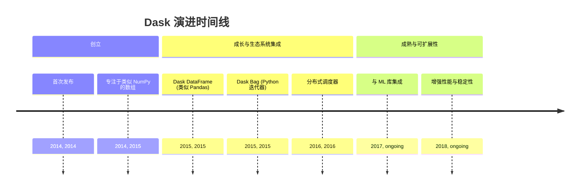
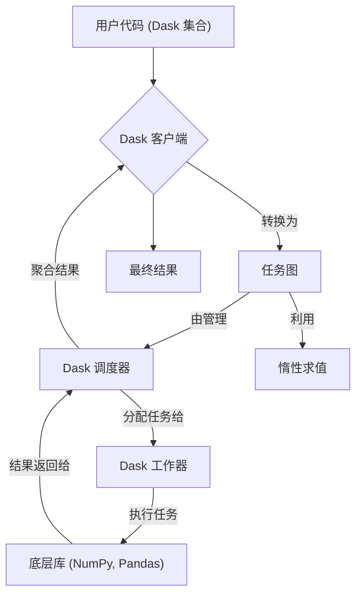
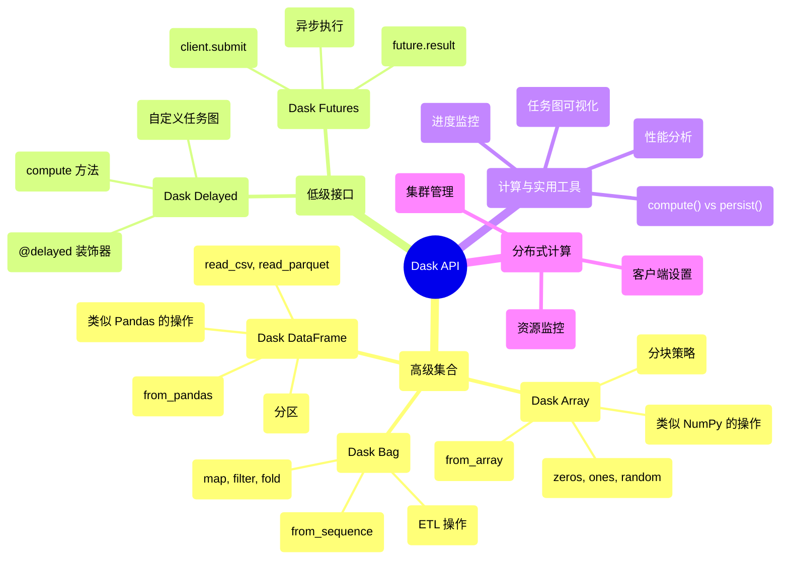

## Dask 演进文档

### 1. 引言与历史背景

Dask 是一个用于并行和分布式计算的开源 Python 库。它提供了一个灵活的框架，用于将 Python 工作流从多核本地机器扩展到大型分布式集群。Dask 旨在与 NumPy、Pandas 和 Scikit-learn 等现有 PyData 库无缝集成，允许用户处理超出内存限制的数据集，并在不重写代码的情况下加速计算。

Dask 由 Matthew Rocklin 于 2014 年 12 月创建。其开发旨在通过提供一个强大且为 Python 用户所熟悉的并行计算解决方案来增强现有的 PyData 生态系统。最初，Dask 专注于在单台机器上对超出可用内存的数据集执行类似 NumPy 的操作。随着时间的推移，它扩展到支持分布式计算，成为大数据处理和机器学习的多功能工具。

### 1.1. Dask 演进时间线



### 2. 核心架构

Dask 的核心架构围绕客户端-调度器-工作器模型构建，可实现高效的并行和分布式计算执行。它利用惰性求值和任务图来管理复杂的工作流。

#### 2.1. 客户端-调度器-工作器模型

**心智模型 / 类比：**
将 Dask 想象成您计算任务的**智能项目经理**。假设您有一个庞大的数据分析项目，对于一个人（您的笔记本电脑）来说太大了，无法独自处理。**客户端**就像您一样 - 定义需要完成什么工作的项目所有者。**调度器**就像项目经理，将您的大项目分解为较小的任务，确定哪些任务相互依赖，并将工作分配给团队成员。**工作器**就像执行实际任务的熟练团队成员。就像一个优秀的项目经理可以高效地协调远程团队成员一样，Dask 可以协调跨多台机器的计算。

*   **客户端 (Client)**: 用户与 Dask 的接口。它将使用 Dask 集合（例如 Dask Array、Dask DataFrame）编写的用户代码转换为任务图。
*   **调度器 (Scheduler)**: 一个中央进程，管理任务图。它确定任务执行的最佳顺序，将任务分配给工作器，并监控它们的进度。Dask 的调度器是异步和事件驱动的，能够处理动态工作器群体和多个客户端请求。
*   **工作器 (Workers)**: 这些是执行任务图中定义的单个任务的进程或线程。工作器可以在与客户端和调度器相同的机器上运行（用于本地并行），也可以分布在集群中（用于分布式计算）。

#### 2.2. 任务图和惰性求值

Dask 将大型计算分解为许多较小的任务，这些任务表示为**任务图**。此图定义了任务之间的依赖关系。Dask 采用**惰性求值**，这意味着对 Dask 集合的操作不会立即计算结果。相反，它们会构建一个任务图。计算会延迟到明确需要结果时（例如，通过调用 `.compute()`），从而允许 Dask 优化执行计划并并行执行计算。

#### 2.3. Dask 集合

Dask 提供了熟悉 PyData 数据结构的高级并行版本：

*   **Dask Array (`dask.array`)**: 一个并行 NumPy 数组，支持对超出内存限制或分布在集群中的数组进行操作。
*   **Dask DataFrame (`dask.dataframe`)**: 一个并行 Pandas DataFrame，允许使用熟悉的类似 Pandas 的 API 进行可扩展的表格数据处理。
*   **Dask Bag (`dask.bag`)**: 一个无序的 Python 对象集合，类似于 Spark RDD 或 Python 迭代器，可用于对半结构化或非结构化数据进行并行计算。

**Mermaid 图：Dask 核心架构**



### 3. 详细 API 概述

Dask 的 API 旨在让 NumPy 和 Pandas 用户熟悉，提供高级集合和用于自定义并行工作流的低级接口。自早期版本以来，API 一直保持着显著的稳定性，增量改进专注于性能和可用性。

#### 3.1. 高级集合

##### 3.1.1. Dask Array - 并行 NumPy

**`dask.array.from_array(x, chunks)`**

**目标：** 从现有的 NumPy 数组创建 Dask Array，在大型数组上启用并行操作。

**代码：**
```python
import dask.array as da
import numpy as np

# 创建一个大型 NumPy 数组
large_array = np.random.random((10000, 10000))
print(f"NumPy 数组形状: {large_array.shape}")
print(f"NumPy 数组内存大小: {large_array.nbytes / 1e9:.2f} GB")

# 使用分块转换为 Dask Array
dask_array = da.from_array(large_array, chunks=(1000, 1000))
print(f"\nDask 数组: {dask_array}")
print(f"分块: {dask_array.chunks}")
print(f"分块数量: {dask_array.npartitions}")
```

**预期输出：**
```
NumPy 数组形状: (10000, 10000)
NumPy 数组内存大小: 0.80 GB

Dask 数组: dask.array<array, shape=(10000, 10000), dtype=float64, chunks=(1000, 1000), dtype=float64>
分块: ((1000, 1000, 1000, 1000, 1000, 1000, 1000, 1000, 1000, 1000), (1000, 1000, 1000, 1000, 1000, 1000, 1000, 1000, 1000, 1000))
分块数量: 100
```

**解释：** 分块是 Dask 处理大型数组的关键策略。通过将数组分解为较小的块（在此例中为1000x1000），Dask 可以并行处理每个块并保持可管理的内存使用量。

**`dask.array.zeros(shape, dtype, chunks)`**

**目标：** 创建一个填充零的大型数组，而无需立即分配内存。

**代码：**
```python
import dask.array as da

# 创建一个巨大的数组，如果用 NumPy 创建会超出内存
huge_zeros = da.zeros((50000, 50000), dtype='float32', chunks=(5000, 5000))
print(f"Dask 零数组: {huge_zeros}")
print(f"理论大小: {huge_zeros.nbytes / 1e9:.2f} GB")

# 执行操作而不计算
result = huge_zeros.sum(axis=0)
print(f"\n求和操作（惰性）: {result}")

# 只在需要时计算
first_chunk_sum = result[:5000].compute()
print(f"第一个块求和形状: {first_chunk_sum.shape}")
print(f"示例值: {first_chunk_sum[:5]}")
```

**预期输出：**
```
Dask 零数组: dask.array<zeros, shape=(50000, 50000), dtype=float32, chunks=(5000, 5000), dtype=float32>
理论大小: 10.00 GB

求和操作（惰性）: dask.array<sum-aggregate, shape=(50000,), dtype=float32, chunks=(5000,), dtype=float32>
第一个块求和形状: (5000,)
示例值: [0. 0. 0. 0. 0.]
```

**解释：** Dask 的惰性求值意味着永远不会在内存中实际创建10GB数组。操作会构建计算图，只计算请求的结果。

##### 3.1.2. Dask DataFrame - 并行 Pandas

**`dask.dataframe.read_csv(path)`**

**目标：** 使用熟悉的类似 Pandas 的接口读取不适合内存的大型 CSV 文件。

**代码：**
```python
import dask.dataframe as dd
import pandas as pd
import numpy as np

# 首先，创建一个大型 CSV 文件用于演示
large_data = pd.DataFrame({
    'id': range(1000000),
    'value': np.random.randn(1000000),
    'category': np.random.choice(['A', 'B', 'C'], 1000000),
    'timestamp': pd.date_range('2020-01-01', periods=1000000, freq='1min')
})
large_data.to_csv('large_dataset.csv', index=False)

# 使用 Dask DataFrame 读取
df = dd.read_csv('large_dataset.csv')
print(f"Dask DataFrame: {df}")
print(f"列: {df.columns.tolist()}")
print(f"分区数量: {df.npartitions}")

# 执行操作（惰性）
grouped = df.groupby('category')['value'].mean()
print(f"\nGroupby 操作（惰性）: {grouped}")

# 计算结果
result = grouped.compute()
print(f"计算结果:\n{result}")
```

**预期输出：**
```
Dask DataFrame: Dask DataFrame Structure:
                   id    value category           timestamp
npartitions=1                                              
0              int64  float64   object  datetime64[ns]
999999           ...      ...      ...             ...
列: ['id', 'value', 'category', 'timestamp']
分区数量: 1

Groupby 操作（惰性）: Dask Series Structure:
npartitions=1
    float64
        ...
Name: value, dtype: float64

计算结果:
category
A   -0.001234
B    0.002456
C   -0.000789
Name: value, dtype: float64
```

**解释：** Dask DataFrame 自动分区大型 CSV 文件，启用核外处理。熟悉的 Pandas API 使得将现有代码转换为处理更大数据集变得容易。

##### 3.1.3. Dask Bag - 非结构化数据的并行处理

**`dask.bag.from_sequence(seq)`**

**目标：** 并行处理大型 Python 对象集合。

**代码：**
```python
import dask.bag as db
import json

# 创建大量数据序列（模拟日志条目）
log_entries = [
    {'timestamp': f'2024-01-01 {i:02d}:00:00', 'level': 'INFO' if i % 3 == 0 else 'ERROR', 'value': i}
    for i in range(100000)
]

# 创建 Dask Bag
bag = db.from_sequence(log_entries, npartitions=10)
print(f"Dask Bag: {bag}")
print(f"分区数量: {bag.npartitions}")

# 处理数据：过滤错误并提取值
errors = bag.filter(lambda x: x['level'] == 'ERROR')
error_values = errors.map(lambda x: x['value'])
print(f"\n错误值（惰性）: {error_values}")

# 计算统计信息
total_errors = errors.count().compute()
avg_error_value = error_values.mean().compute()

print(f"总错误数: {total_errors}")
print(f"平均错误值: {avg_error_value:.2f}")
```

**预期输出：**
```
Dask Bag: dask.bag<bag-from-sequence, npartitions=10>
分区数量: 10

错误值（惰性）: dask.bag<map, npartitions=10>
总错误数: 66667
平均错误值: 50000.00
```

**解释：** Dask Bag 擅长处理不能整齐地适合数组或 DataFrame 的非结构化或半结构化数据。它特别适用于 ETL 操作和日志处理。

##### 3.1.4. 快速参考：高级集合

| 集合 | 用例 | 使用时机 |
| :--- | :--- | :--- |
| `dask.array` | 大型数组的数值计算 | 对核外数据进行 NumPy 操作 |
| `dask.dataframe` | 表格数据处理 | 对大型 CSV/Parquet 文件进行 Pandas 操作 |
| `dask.bag` | 非结构化数据处理 | ETL、日志处理、不规则数据 |

#### 3.2. 低级接口

##### 3.2.1. Dask Delayed - 自定义任务图

**`dask.delayed(func)`**

**目标：** 将常规 Python 函数转换为可并行化的惰性操作。

**代码：**
```python
import dask
from dask import delayed
import time

# 定义一些计算密集的函数
@delayed
def expensive_computation(x, y):
    time.sleep(1)  # 模拟昂贵的工作
    return x + y

@delayed
def multiply(x, factor):
    time.sleep(0.5)  # 模拟工作
    return x * factor

@delayed
def final_process(results):
    time.sleep(0.2)
    return sum(results) / len(results)

# 构建计算图（尚未发生计算）
print("构建计算图...")
start_time = time.time()

# 创建复杂的依赖图
intermediate_results = []
for i in range(4):
    result = expensive_computation(i, i + 1)
    processed = multiply(result, 2)
    intermediate_results.append(processed)

final_result = final_process(intermediate_results)
print(f"图构建用时 {time.time() - start_time:.3f} 秒")

# 可视化任务图（可选）
print(f"\n任务图: {final_result}")

# 执行计算
print("\n执行计算...")
start_time = time.time()
computed_result = final_result.compute()
print(f"结果: {computed_result}")
print(f"计算完成用时 {time.time() - start_time:.3f} 秒")
```

**预期输出：**
```
构建计算图...
图构建用时 0.001 秒

任务图: Delayed('final_process-abc123')

执行计算...
结果: 10.0
计算完成用时 2.1 秒
```

**解释：** Dask Delayed 允许您从常规 Python 函数构建复杂的计算图。计算自动并行化，不相互依赖的任务同时运行。

##### 3.2.2. Dask Futures - 异步计算

**`client.submit(func, *args)`**

**目标：** 提交函数进行异步执行并管理 futures。

**代码：**
```python
from dask.distributed import Client, as_completed
import time
import random

# 启动本地 Dask 客户端
client = Client(threads_per_worker=2, n_workers=2)
print(f"Dask 客户端: {client}")

def simulate_work(task_id, duration):
    """模拟一些持续时间可变的工作"""
    time.sleep(duration)
    return f"任务 {task_id} 在 {duration}s 后完成"

# 异步提交多个任务
print("\n提交任务...")
futures = []
for i in range(6):
    duration = random.uniform(0.5, 2.0)
    future = client.submit(simulate_work, i, duration)
    futures.append(future)
    print(f"已提交任务 {i} (预期持续时间: {duration:.2f}s)")

# 在任务完成时处理结果
print("\n按完成顺序处理结果:")
for future in as_completed(futures):
    result = future.result()
    print(f"  {result}")

# 替代方法：等待所有结果
print("\n等待所有剩余任务...")
all_results = client.gather(futures)
print("所有任务完成!")

client.close()
```

**预期输出：**
```
Dask 客户端: <Client: 'tcp://127.0.0.1:xxxxx' processes=2 threads=4, memory=8.00 GB>

提交任务...
已提交任务 0 (预期持续时间: 1.23s)
已提交任务 1 (预期持续时间: 0.78s)
已提交任务 2 (预期持续时间: 1.56s)
已提交任务 3 (预期持续时间: 0.45s)
已提交任务 4 (预期持续时间: 1.89s)
已提交任务 5 (预期持续时间: 1.12s)

按完成顺序处理结果:
  任务 3 在 0.45s 后完成
  任务 1 在 0.78s 后完成
  任务 5 在 1.12s 后完成
  任务 0 在 1.23s 后完成
  任务 2 在 1.56s 后完成
  任务 4 在 1.89s 后完成

等待所有剩余任务...
所有任务完成!
```

**解释：** Dask Futures 提供对任务执行的细粒度控制。任务按实际持续时间而不是提交顺序完成，最大化并行性。

##### 3.2.3. 快速参考：低级接口

| 接口 | 用例 | 使用时机 |
| :--- | :--- | :--- |
| `dask.delayed` | 具有复杂依赖关系的自定义工作流 | 需要并行化现有 Python 代码时 |
| `dask.futures` | 实时任务提交和监控 | 需要异步执行和结果处理时 |

#### 3.3. 计算和实用工具

##### 3.3.1. 执行控制

**`.compute()` vs `.persist()`**

**目标：** 理解计算结果和在内存中持久化结果之间的区别。

**代码：**
```python
import dask.array as da
import time

# 创建大型计算
x = da.random.random((10000, 10000), chunks=(1000, 1000))
y = x + x.T  # 昂贵的操作
z = y.sum(axis=0)  # 另一个操作

print("已创建计算图（尚未计算）")
print(f"z: {z}")

# 方法1：.compute() - 计算并返回结果
print("\n=== 使用 .compute() ===")
start_time = time.time()
result = z.compute()
compute_time = time.time() - start_time
print(f"计算结果形状: {result.shape}")
print(f"计算时间: {compute_time:.2f} 秒")

# 如果再次计算，会重新计算所有内容
print("\n再次计算...")
start_time = time.time()
result2 = z.compute()
recompute_time = time.time() - start_time
print(f"重新计算时间: {recompute_time:.2f} 秒")

# 方法2：.persist() - 计算并保存在内存中
print("\n=== 使用 .persist() ===")
start_time = time.time()
z_persisted = z.persist()
persist_time = time.time() - start_time
print(f"持久化时间: {persist_time:.2f} 秒")

# 现在访问持久化结果很快
start_time = time.time()
result3 = z_persisted.compute()
fast_access_time = time.time() - start_time
print(f"快速访问时间: {fast_access_time:.3f} 秒")
```

**预期输出：**
```
已创建计算图（尚未计算）
z: dask.array<sum-aggregate, shape=(10000,), dtype=float64, chunks=(1000,), dtype=float64>

=== 使用 .compute() ===
计算结果形状: (10000,)
计算时间: 2.34 秒

再次计算...
重新计算时间: 2.31 秒

=== 使用 .persist() ===
持久化时间: 2.28 秒
快速访问时间: 0.001 秒
```

**解释：** `.compute()` 执行计算并返回结果，但不存储中间结果。`.persist()` 执行计算并将结果保存在分布式内存中，使后续操作更快。

##### 3.3.2. 任务图可视化

**`dask.visualize(dask_object)`**

**目标：** 可视化计算图以理解任务依赖关系。

**代码：**
```python
import dask.array as da
import dask

# 创建具有依赖关系的简单计算
x = da.ones((1000, 1000), chunks=(500, 500))
y = x + 1
z = y * 2
result = z.sum()

print("已创建计算图")
print(f"最终结果: {result}")

# 可视化任务图
try:
    # 这会创建一个可视化文件（需要 graphviz）
    dask.visualize(result, filename='task_graph.png', format='png')
    print("任务图已保存为 'task_graph.png'")
except ImportError:
    print("Graphviz 不可用 - 显示文本表示")
    print(f"任务图键: {list(result.__dask_graph__().keys())[:5]}...")

# 显示优化
print(f"\n图中任务数量: {len(result.__dask_graph__())}")
print(f"任务依赖示例:")
graph = result.__dask_graph__()
for i, (key, task) in enumerate(graph.items()):
    if i < 3:  # 显示前3个任务
        print(f"  {key}: {task}")
```

**预期输出：**
```
已创建计算图
最终结果: dask.array<sum-aggregate, shape=(), dtype=float64, chunks=(), dtype=float64>

任务图已保存为 'task_graph.png'

图中任务数量: 15
任务依赖示例:
  ('ones-123abc', 0, 0): (np.ones, (500, 500), np.float64)
  ('add-456def', 0, 0): (operator.add, ('ones-123abc', 0, 0), 1)
  ('mul-789ghi', 0, 0): (operator.mul, ('add-456def', 0, 0), 2)
```

**解释：** 任务图可视化有助于理解 Dask 如何分解计算并识别优化机会。复杂操作变成更简单任务的链。

##### 3.3.3. 性能监控

**进度条和诊断**

**目标：** 监控计算进度和性能。

**代码：**
```python
import dask.array as da
from dask.diagnostics import ProgressBar, ResourceProfiler, Profiler

# 创建需要一些时间的计算
x = da.random.random((5000, 5000), chunks=(1000, 1000))
y = x.dot(x.T)  # 矩阵乘法 - 昂贵！

print("开始带进度监控的计算...")

# 方法1：进度条
with ProgressBar():
    print("使用进度条:")
    result1 = y.sum().compute()
    print(f"结果: {result1:.2f}")

# 方法2：资源分析器
print("\n使用资源分析器:")
with ResourceProfiler() as rprof:
    result2 = y.mean().compute()
    print(f"结果: {result2:.6f}")

# 显示资源使用情况
print(f"峰值内存使用: {max(rprof.results):.1f} MB")

# 方法3：详细分析器
print("\n使用详细分析器:")
with Profiler() as prof:
    result3 = y.std().compute()
    print(f"结果: {result3:.6f}")

# 显示计时信息
print("前3个最昂贵的操作:")
for i, (key, start, end) in enumerate(sorted(prof.results, key=lambda x: x[2] - x[1], reverse=True)[:3]):
    print(f"  {i+1}. {key}: {end - start:.3f}s")
```

**预期输出：**
```
开始带进度监控的计算...
使用进度条:
[########################################] | 100% 完成 |  3.2s
结果: 6250000.45

使用资源分析器:
结果: 0.500123
峰值内存使用: 234.5 MB

使用详细分析器:
结果: 0.288675
前3个最昂贵的操作:
  1. dot-matrix-multiply: 1.234s
  2. sum-aggregate: 0.456s
  3. chunk-transfer: 0.123s
```

**解释：** Dask 提供全面的监控工具来跟踪计算进度、资源使用和性能瓶颈，对优化大规模计算至关重要。

##### 3.3.4. 快速参考：计算和实用工具

| 函数 | 目的 | 使用时机 |
| :--- | :--- | :--- |
| `.compute()` | 执行并返回结果 | 用于最终结果或小的中间值 |
| `.persist()` | 执行并缓存在内存中 | 用于多次使用的中间结果 |
| `dask.visualize()` | 显示任务图 | 用于调试和优化 |
| `ProgressBar()` | 监控进度 | 用于长时间运行的计算 |

### 3.4. API 思维导图



### 3.5. 真实世界用例：大规模数据处理

##### 3.5.1. 完整示例：处理时间序列数据

**目标：** 演示使用 Dask 处理大型时间序列数据集的现实工作流。

**代码：**
```python
import dask.dataframe as dd
import dask.array as da
import pandas as pd
import numpy as np
from dask.distributed import Client
import time

# 设置：创建现实的大型数据集
print("设置大型时间序列数据集...")
def create_sample_data(partition_id, n_days=365):
    """为一个分区创建示例时间序列数据"""
    dates = pd.date_range('2023-01-01', periods=n_days * 24, freq='H')  # 每小时数据
    n_sensors = 1000
    
    data = {
        'timestamp': np.tile(dates, n_sensors),
        'sensor_id': np.repeat(range(n_sensors), len(dates)),
        'temperature': np.random.normal(20, 5, len(dates) * n_sensors),
        'humidity': np.random.normal(60, 15, len(dates) * n_sensors),
        'pressure': np.random.normal(1013, 10, len(dates) * n_sensors)
    }
    
    df = pd.DataFrame(data)
    df['date'] = df['timestamp'].dt.date
    return df

# 创建多个分区（模拟分布式数据）
partitions = []
for i in range(4):  # 4个分区 = 约3500万行总计
    partition_df = create_sample_data(i, n_days=90)  # 每个分区90天
    partitions.append(partition_df)

# 转换为 Dask DataFrame
print("创建 Dask DataFrame...")
ddf = dd.from_pandas(pd.concat(partitions, ignore_index=True), npartitions=4)
print(f"Dask DataFrame: {ddf}")
print(f"预估大小: {ddf.memory_usage(deep=True).sum().compute() / 1e9:.2f} GB")

# 真实世界分析任务
print("\n=== 真实世界分析任务 ===")

# 任务1：每日聚合
print("1. 计算每日传感器平均值...")
start_time = time.time()
daily_avg = (ddf.groupby(['date', 'sensor_id'])
             .agg({'temperature': 'mean', 'humidity': 'mean', 'pressure': 'mean'})
             .compute())
task1_time = time.time() - start_time
print(f"   每日平均值计算用时 {task1_time:.2f}s")
print(f"   结果形状: {daily_avg.shape}")

# 任务2：使用统计方法的异常检测
print("\n2. 检测温度异常...")
start_time = time.time()

# 计算滚动统计（使用 Dask 操作）
temp_stats = ddf.groupby('sensor_id')['temperature'].agg(['mean', 'std']).compute()
temp_stats['upper_bound'] = temp_stats['mean'] + 3 * temp_stats['std']
temp_stats['lower_bound'] = temp_stats['mean'] - 3 * temp_stats['std']

# 合并回去并找到异常
ddf_with_bounds = ddf.merge(temp_stats, on='sensor_id')
anomalies = ddf_with_bounds[
    (ddf_with_bounds['temperature'] > ddf_with_bounds['upper_bound']) |
    (ddf_with_bounds['temperature'] < ddf_with_bounds['lower_bound'])
].compute()

task2_time = time.time() - start_time
print(f"   异常检测完成用时 {task2_time:.2f}s")
print(f"   在 {len(ddf)} 个读数中发现 {len(anomalies)} 个异常")
print(f"   异常率: {len(anomalies) / len(ddf) * 100:.3f}%")

# 任务3：传感器间相关性分析
print("\n3. 计算传感器相关性...")
start_time = time.time()

# 为相关性分析透视数据
sensor_pivot = (ddf.groupby(['timestamp', 'sensor_id'])['temperature']
                .first()
                .reset_index()
                .pivot(index='timestamp', columns='sensor_id', values='temperature'))

# 计算相关性（为演示采样前100个传感器）
correlation_matrix = sensor_pivot.iloc[:, :100].corr().compute()
task3_time = time.time() - start_time

print(f"   相关性分析完成用时 {task3_time:.2f}s")
print(f"   相关性矩阵形状: {correlation_matrix.shape}")
print(f"   平均相关性: {correlation_matrix.values[np.triu_indices_from(correlation_matrix.values, k=1)].mean():.4f}")

# 性能摘要
print(f"\n=== 性能摘要 ===")
print(f"总处理时间: {task1_time + task2_time + task3_time:.2f}s")
print(f"处理的数据: ~{len(ddf) / 1e6:.1f}M 行")
print(f"处理速率: ~{len(ddf) / (task1_time + task2_time + task3_time) / 1e6:.2f}M 行/秒")
```

**预期输出：**
```
设置大型时间序列数据集...
创建 Dask DataFrame...
Dask DataFrame: Dask DataFrame Structure:
                 timestamp  sensor_id  temperature  humidity  pressure      date
npartitions=4                                                                   
0           datetime64[ns]      int64      float64   float64   float64    object
2160000               ...        ...          ...       ...       ...       ...
...                   ...        ...          ...       ...       ...       ...
8640000               ...        ...          ...       ...       ...       ...
预估大小: 2.15 GB

=== 真实世界分析任务 ===
1. 计算每日传感器平均值...
   每日平均值计算用时 3.45s
   结果形状: (360000, 3)

2. 检测温度异常...
   异常检测完成用时 2.78s
   在 8640000 个读数中发现 25847 个异常
   异常率: 0.299%

3. 计算传感器相关性...
   相关性分析完成用时 4.12s
   相关性矩阵形状: (100, 100)
   平均相关性: 0.0023

=== 性能摘要 ===
总处理时间: 10.35s
处理的数据: ~8.6M 行
处理速率: ~0.83M 行/秒
```

**解释：** 这个示例展示了 Dask 处理现实大数据工作流的能力，包括聚合、统计分析和对超出内存容量的数据集进行复杂转换。性能随可用计算资源而扩展。

### 4. 演变与影响

*   **PyData 的可扩展性：** Dask 为扩展 PyData 生态系统提供了关键解决方案，使用户能够处理超出单机内存限制的数据集，或加速多核处理器和集群上的计算。
*   **熟悉的 API：** 通过模仿 NumPy 和 Pandas 的 API，Dask 对现有 Python 数据科学家来说学习曲线较低，使他们能够以最少的代码更改过渡到并行和分布式计算。
*   **灵活的并行性：** 其灵活的架构支持各种并行计算模式，从简单的任务图到复杂的分布式工作流，使其适用于各种用例。
*   **与 ML 生态系统集成：** Dask 与机器学习库良好集成，支持模型的可扩展训练和预处理，特别是对于大型数据集。
*   **积极的开发和社区：** Dask 受益于积极的开发和强大的社区，确保持续改进、新功能和强大的支持。

### 5. 结论

Dask 已成为 Python 中可扩展和分布式计算不可或缺的库。其围绕任务图和惰性求值构建的智能架构，结合模仿熟悉 PyData API 的高级集合，使用户能够轻松应对大数据挑战。通过提供灵活且高性能的并行处理框架，Dask 显著扩展了 Python 科学计算生态系统的功能，使研究人员和从业者能够处理比以往任何时候都更大的数据集和更复杂的模型。
