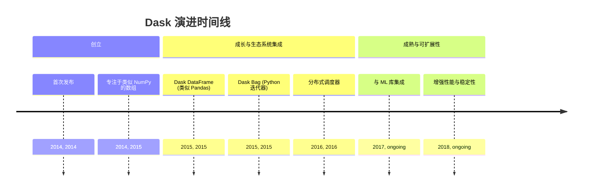
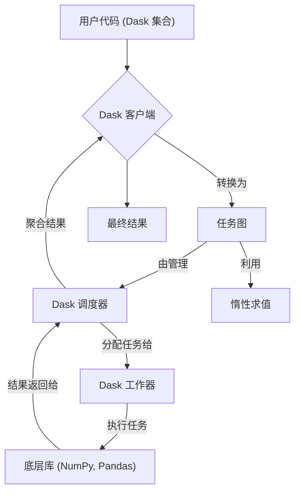
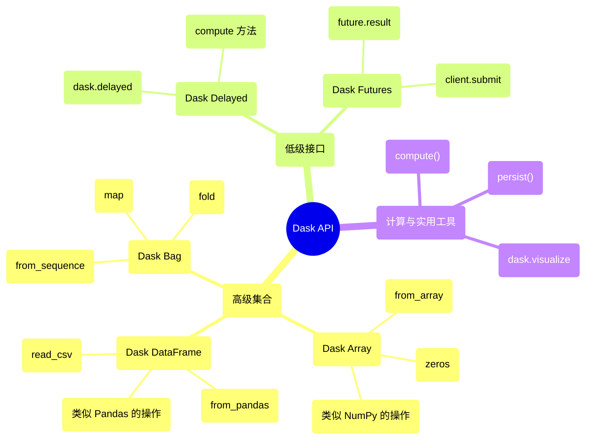

## Dask 演进文档

### 1. 引言与历史背景

Dask 是一个用于并行和分布式计算的开源 Python 库。它提供了一个灵活的框架，用于将 Python 工作流从多核本地机器扩展到大型分布式集群。Dask 旨在与 NumPy、Pandas 和 Scikit-learn 等现有 PyData 库无缝集成，允许用户处理超出内存限制的数据集，并在不重写代码的情况下加速计算。

Dask 由 Matthew Rocklin 于 2014 年 12 月创建。其开发旨在通过提供一个强大且为 Python 用户所熟悉的并行计算解决方案来增强现有的 PyData 生态系统。最初，Dask 专注于在单台机器上对超出可用内存的数据集执行类似 NumPy 的操作。随着时间的推移，它扩展到支持分布式计算，成为大数据处理和机器学习的多功能工具。

### 1.1. Dask 演进时间线

### 2. 核心架构

Dask 的核心架构围绕客户端-调度器-工作器模型构建，可实现高效的并行和分布式计算执行。它利用惰性求值和任务图来管理复杂的工作流。

#### 2.1. 客户端-调度器-工作器模型

*   **客户端 (Client)**: 用户与 Dask 的接口。它将使用 Dask 集合（例如 Dask Array、Dask DataFrame）编写的用户代码转换为任务图。
*   **调度器 (Scheduler)**: 一个中央进程，管理任务图。它确定任务执行的最佳顺序，将任务分配给工作器，并监控它们的进度。Dask 的调度器是异步和事件驱动的，能够处理动态工作器群体和多个客户端请求。
*   **工作器 (Workers)**: 这些是执行任务图中定义的单个任务的进程或线程。工作器可以在与客户端和调度器相同的机器上运行（用于本地并行），也可以分布在集群中（用于分布式计算）。

#### 2.2. 任务图和惰性求值

Dask 将大型计算分解为许多较小的任务，这些任务表示为**任务图**。此图定义了任务之间的依赖关系。Dask 采用**惰性求值**，这意味着对 Dask 集合的操作不会立即计算结果。相反，它们会构建一个任务图。计算会延迟到明确需要结果时（例如，通过调用 `.compute()`），从而允许 Dask 优化执行计划并并行执行计算。

#### 2.3. Dask 集合

Dask 提供了熟悉 PyData 数据结构的高级并行版本：

*   **Dask Array (`dask.array`)**: 一个并行 NumPy 数组，支持对超出内存限制或分布在集群中的数组进行操作。
*   **Dask DataFrame (`dask.dataframe`)**: 一个并行 Pandas DataFrame，允许使用熟悉的类似 Pandas 的 API 进行可扩展的表格数据处理。
*   **Dask Bag (`dask.bag`)**: 一个无序的 Python 对象集合，类似于 Spark RDD 或 Python 迭代器，可用于对半结构化或非结构化数据进行并行计算。

**Mermaid 图：Dask 核心架构**

### 3. 详细 API 概述

Dask 的 API 旨在让 NumPy 和 Pandas 用户熟悉，提供高级集合和用于自定义并行工作流的低级接口。

#### 3.1. 高级集合

*   **Dask Array (`dask.array`)**:
    *   `dask.array.from_array(x, chunks)`: 从 NumPy 数组创建 Dask Array。
    *   `dask.array.zeros(shape, dtype)`: 创建一个填充零的 Dask Array。
    *   支持大多数 NumPy 数组操作（例如 `sum()`、`mean()`、`dot()`）。
*   **Dask DataFrame (`dask.dataframe`)**:
    *   `dask.dataframe.read_csv(path)`: 将 CSV 文件读取到 Dask DataFrame 中。
    *   `dask.dataframe.from_pandas(df, npartitions)`: 从 Pandas DataFrame 创建 Dask DataFrame。
    *   支持大多数 Pandas DataFrame 操作（例如 `groupby()`、`merge()`、`apply()`）。
*   **Dask Bag (`dask.bag`)**:
    *   `dask.bag.from_sequence(seq)`: 从 Python 序列创建 Dask Bag。
    *   `bag.map(func)`: 将函数应用于 Bag 中的每个元素。
    *   `bag.fold(binop)`: 使用二元运算符聚合元素。

#### 3.2. 低级接口

*   **Dask Delayed (`dask.delayed`)**:
    *   `dask.delayed(func)(*args, **kwargs)`: 包装函数以进行惰性求值，返回一个延迟对象。
    *   `delayed_object.compute()`: 触发延迟对象的计算。
*   **Dask Futures (`dask.distributed.Client`)**:
    *   `client.submit(func, *args, **kwargs)`: 提交函数以进行异步执行。
    *   `future.result()`: 阻塞直到结果可用并返回结果。

#### 3.3. 计算和实用工具

*   **`.compute()`**: 触发 Dask 集合或延迟对象的计算。
*   **`.persist()`**: 计算并将 Dask 集合的结果存储在集群内存中。
*   **`dask.visualize(dask_object)`**: 生成任务图的可视化表示。

### 3.4. API 思维导图

### 4. 演变与影响

*   **PyData 的可扩展性:** Dask 为扩展 PyData 生态系统提供了关键解决方案，使用户能够处理超出单机内存限制的数据集，或加速多核处理器和集群上的计算。
*   **熟悉的 API:** 通过模仿 NumPy 和 Pandas 的 API，Dask 对现有 Python 数据科学家来说学习曲线较低，使他们能够以最少的代码更改过渡到并行和分布式计算。
*   **灵活的并行性:** 其灵活的架构支持各种并行计算模式，从简单的任务图到复杂的分布式工作流，使其适用于各种用例。
*   **与 ML 生态系统集成:** Dask 与机器学习库良好集成，支持模型的可扩展训练和预处理，特别是对于大型数据集。
*   **积极的开发和社区:** Dask 受益于积极的开发和强大的社区，确保持续改进、新功能和强大的支持。

### 5. 结论

Dask 已成为 Python 中可扩展和分布式计算不可或缺的库。其围绕任务图和惰性求值构建的智能架构，结合模仿熟悉 PyData API 的高级集合，使用户能够轻松应对大数据挑战。通过提供灵活且高性能的并行处理框架，Dask 显著扩展了 Python 科学计算生态系统的功能，使研究人员和从业者能够处理比以往任何时候都更大的数据集和更复杂的模型。
