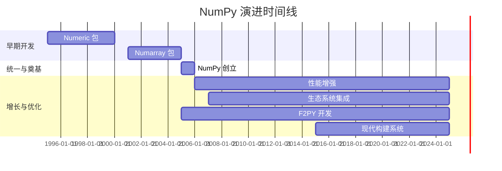
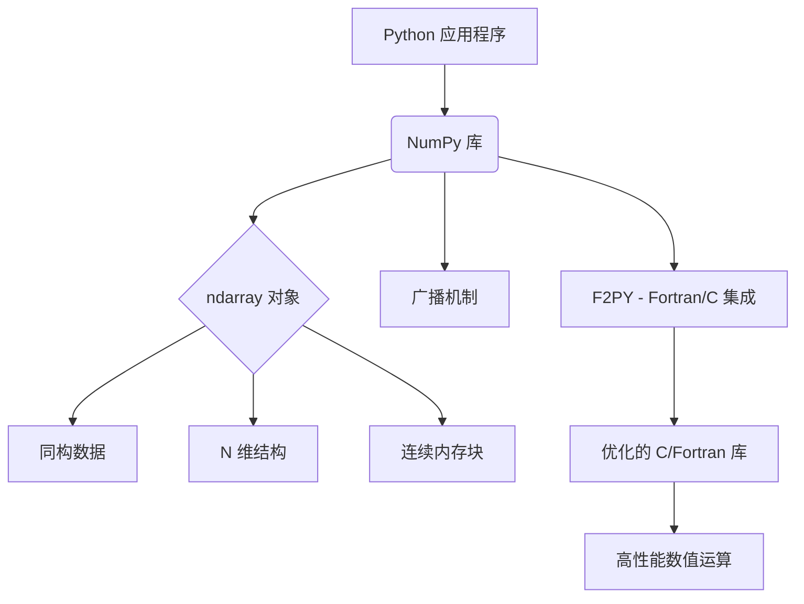
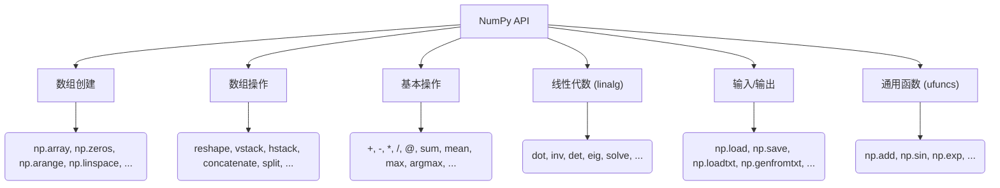
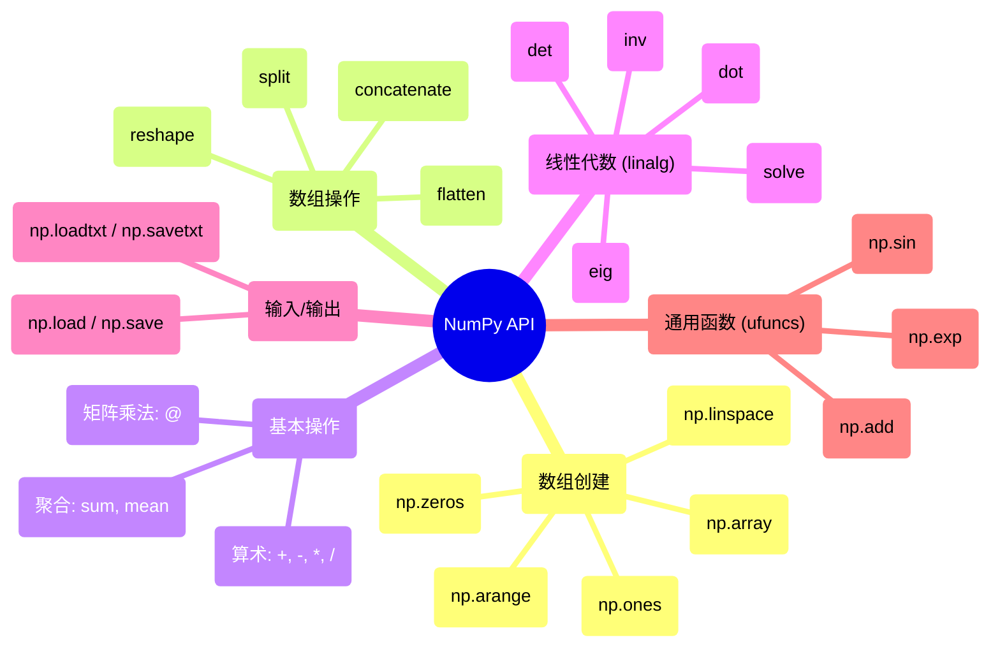

## NumPy 演进文档

### 1. 引言与历史背景

NumPy (Numerical Python) 是 Python 中科学计算的基础包。它提供了一个高性能的多维数组对象，以及用于处理这些数组的工具。它是科学 Python 生态系统的基石，为数据科学、机器学习和科学研究提供了至关重要的高效数值运算能力。

NumPy 的起源可以追溯到 20 世纪 90 年代末，当时 Jim Hugunin 开发了 **Numeric**。Numeric 提供了一个基本的数组对象和操作。后来，**Numarray** 作为一个替代品出现，提供了不同的功能和性能特点。两个相互竞争的数组包的存在导致了科学 Python 社区的分裂。

2005 年，Travis Oliphant 将 Numeric 和 Numarray 的功能合并到一个名为 **NumPy** 的包中。这次统一是一个关键时刻，它提供了一个一致且强大的数组计算基础，加速了整个科学 Python 技术栈的成长。

### 1.1. NumPy 演进时间线

### 2. 核心架构

NumPy 架构的核心围绕 `ndarray` (N 维数组) 对象展开。该对象是一个连续的内存块，用于存储同构数据 (所有元素都是相同的数据类型)。这一设计选择对性能至关重要，因为它允许高效的内存访问，并利用优化的 C/Fortran 库进行计算。

#### 2.1. `ndarray` 对象

`ndarray` 是 Python 中用于存储大型数据集的灵活容器。它具有以下特点：
*   **同构数据:** `ndarray` 中的所有元素必须是相同的数据类型 (例如，整数、浮点数、布尔值)。这简化了内存管理，并实现了高度优化的操作。
*   **N 维:** 数组可以有任意数量的维度，从一维向量到二维矩阵再到更高维的张量。
*   **连续内存:** 数据通常存储在连续的内存块中，这对于缓存效率和向量化操作至关重要。
*   **元数据:** `ndarray` 对象本身存储有关数组的元数据，例如其形状、数据类型 (`dtype`) 和步长 (在内存中为了移动到每个维度的下一个元素需要跳过的字节数)。

#### 2.2. 广播 (Broadcasting)

广播是 NumPy 中一个强大的机制，它允许对不同形状的数组执行算术运算。它消除了显式循环的需要，使代码更简洁、更高效。当对两个数组进行操作时，NumPy 会从末尾维度开始逐元素比较它们的形状。如果维度兼容 (它们相等、其中一个为 1，或者其中一个缺失)，则操作继续进行。

#### 2.3. C/Fortran 集成 (F2PY)

NumPy 的一个重要架构特点是它能够与 C 和 Fortran 代码无缝集成。这主要通过 **F2PY (Fortran to Python Interface Generator)** 实现。F2PY 允许开发人员包装现有的 Fortran (和 C) 库，将其功能作为 Python 模块暴露出来。这使得 NumPy 能够利用这些底层语言编写的高度优化的数值例程，从而显著提升性能。

**Mermaid 图：NumPy 核心架构**

### 3. 详细 API 概述

NumPy 的 API 自诞生以来经历了显著的演变，平衡了稳定性需求与现代化和一致性的驱动力。其核心功能在 2006 年发布的 **NumPy 1.0** 中得以确立，为科学 Python 生态系统的构建提供了坚实的基础。

在整个 1.x 发布系列中，API 呈增量式发展。虽然增加了新功能并对现有功能进行了优化，但向后兼容性始终是首要考虑因素。这段长期的稳定期对于 NumPy 的普及至关重要。一个重要的演变发生在 2024 年发布的 **NumPy 2.0**。这是一个旨在实现库现代化的变革性版本。它对 API 命名空间进行了大规模清理 (移除了许多别名和较少使用的函数)，改进了类型提升规则，并采纳了 Python 数组 API 标准，以确保与其他库 (如 PyTorch 和 JAX) 的一致性和互操作性。

以下是关键领域及其演变的详细介绍：

#### 3.1. 数组创建例程

这些函数用于创建新的 NumPy 数组。虽然核心例程自 1.0 版本以来一直保持稳定，但 API 的这一部分也经历了显著的演变。例如，随机数生成系统在 **NumPy 1.17** 中进行了全面改革，引入了新的 `np.random.Generator` API，以提供更强大和可扩展的伪随机数生成功能。

*   **`np.array(object, dtype=None, ...)`**
    *   **背景:** 最基础的数组创建函数。它将 Python 原生数据结构 (如列表或元组) 转换为 NumPy `ndarray`。
    *   **参数:**
        *   `object`: 要转换为数组的数据。
        *   `dtype`: (可选) 数组元素的期望数据类型。如果未指定，NumPy 将从输入数据中推断类型。
    *   **返回:** 一个包含输入 `object` 数据的 `ndarray`。

*   **`np.zeros(shape, dtype=float, ...)`**
    *   **背景:** 创建一个给定形状的数组，并用零填充。这对于在填充值之前初始化数组非常有用。
    *   **参数:**
        *   `shape`: 定义数组维度的整数或整数元组 (例如，`(2, 3)` 表示一个 2x3 的矩阵)。
        *   `dtype`: (可选) 数组元素的数据类型，默认为 `float`。
    *   **返回:** 一个指定形状和类型的新数组，用零填充。

*   **`np.ones(shape, dtype=float, ...)`**
    *   **背景:** 与 `np.zeros()` 类似，但创建一个用一来填充的数组。
    *   **参数:**
        *   `shape`: 数组的维度。
        *   `dtype`: (可选) 数据类型，默认为 `float`。
    *   **返回:** 一个指定形状和类型的新数组，用一来填充。

*   **`np.arange([start,] stop, [step,], dtype=None, ...)`**
    *   **背景:** 在给定区间内创建具有规律间隔值的数组。它类似于 Python 的内置 `range` 函数，但返回一个 NumPy 数组。
    *   **参数:**
        *   `start`: (可选) 区间的起始值。默认为 0。
        *   `stop`: 区间的结束值 (不包含)。
        *   `step`: (可选) 值之间的间隔。默认为 1。
    *   **返回:** 一个具有均匀间隔值的 `ndarray`。

*   **`np.linspace(start, stop, num=50, ...)`**
    *   **背景:** 在给定区间内创建具有指定数量的均匀间隔值的数组。当您知道需要多少个点而不是步长时，这非常有用。
    *   **参数:**
        *   `start`: 序列的起始值。
        *   `stop`: 序列的结束值。
        *   `num`: (可选) 要生成的样本数。默认为 50。
    *   **返回:** 一个从 `start` 到 `stop` 的 `num` 个均匀间隔样本的 `ndarray`。

#### 3.2. 数组操作

用于改变数组形状和结构的函数一直非常稳定，因为它们代表了基本操作。此类别中的大多数函数，如 `reshape` 和 `concatenate`，自 NumPy 首次发布以来一直是其一部分，为开发人员提供了一致的接口。

*   **`ndarray.reshape(shape)`**
    *   **背景:** 在不改变数据的情况下，将数组的元素重新排列成新的形状。元素总数必须保持不变。
    *   **参数:**
        *   `shape`: 定义数组新维度的整数或整数元组。
    *   **返回:** 一个具有指定形状的新 `ndarray`，与原始数组共享相同的数据 (一个“视图”)。

*   **`ndarray.flatten()`**
    *   **背景:** 返回数组的一维副本。
    *   **返回:** 一个新的一维 `ndarray`，包含原始数组元素的副本。

*   **`np.concatenate((a1, a2, ...), axis=0)`**
    *   **背景:** 沿指定轴连接一系列数组。
    *   **参数:**
        *   `(a1, a2, ...)`: 要连接的数组的元组或序列。除了对应于 `axis` 的维度外，它们必须具有相同的形状。
        *   `axis`: (可选) 数组将沿其连接的轴。默认为 0 (第一个维度)。
    *   **返回:** 一个包含连接后数组的新 `ndarray`。

*   **`np.split(ary, indices_or_sections, axis=0)`**
    *   **背景:** 将一个数组分割成多个子数组。
    *   **参数:**
        *   `ary`: 要分割的数组。
        *   `indices_or_sections`: 一个整数或一维数组。如果是一个整数，数组将被分割成该数量的等大小子数组。如果是一维数组，它指定了分割的索引位置。
        *   `axis`: (可选) 沿其进行分割的轴。默认为 0。
    *   **返回:** 一个 `ndarray` 对象列表。

*   **`ndarray.T`**
    *   **背景:** 用于转置数组的便捷属性。它反转轴的顺序。对于二维数组，这会交换行和列。
    *   **返回:** 数组的轴已置换的视图。

#### 3.3. 基本操作

逐元素操作是 NumPy 性能的基石。一个显著的演变是在 **NumPy 1.10** 中引入了用于矩阵乘法的 `@` 运算符 (在 Python 3.5 中添加后)，提供了比 `np.dot()` 更清晰的语法。最近，**NumPy 2.0** 增强了聚合函数，例如为 `np.quantile` 添加了 `weights` 参数以支持加权分位数。

*   **算术运算符 (`+`, `-`, `*`, `/`, `**`)**
    *   **背景:** 这些标准运算符对数组执行逐元素的算术运算。数组的形状必须兼容 (这一概念称为“广播”)。
    *   **返回:** 一个包含逐元素运算结果的新数组。

*   **`@` 运算符 / `np.dot(a, b)`**
    *   **背景:** 执行矩阵乘法。对于二维数组，这是标准的矩阵乘积。对于一维数组，这是向量的内积。
    *   **参数:**
        *   `a`, `b`: 要相乘的数组。
    *   **返回:** `a` 和 `b` 的点积。

*   **`np.sum(a, axis=None, ...)`**
    *   **背景:** 计算数组元素在给定轴上的总和。
    *   **参数:**
        *   `a`: 要求和的数组。
        *   `axis`: (可选) 计算总和的轴。如果为 `None`，则计算所有元素的总和。
    *   **返回:** 一个移除了指定轴的数组，如果 `axis` 为 `None`，则返回一个标量。

*   **`np.mean(a, axis=None, ...)`**
    *   **背景:** 计算数组元素在给定轴上的算术平均值。
    *   **参数:**
        *   `a`: 要计算平均值的数组。
        *   `axis`: (可选) 计算平均值的轴。
    *   **返回:** 数组元素的平均值。

*   **`ndarray.argmax(axis=None, ...)`**
    *   **背景:** 返回沿指定轴的最大值的索引。
    *   **参数:**
        *   `axis`: (可选) 查找最大值索引的轴。如果为 `None`，则索引指向扁平化后的数组。
    *   **返回:** 一个包含索引的数组。

#### 3.4. 线性代数 (`numpy.linalg`)

`numpy.linalg` 子模块为高度优化的线性代数库 (如 BLAS 和 LAPACK) 提供了稳定的接口。虽然底层实现为了性能不断改进，但面向 Python 的 API 在很大程度上保持了一致，以确保依赖这些基本操作的代码不会中断。

*   **`np.linalg.inv(a)`**
    *   **背景:** 计算矩阵的乘法逆。
    *   **参数:**
        *   `a`: 要求逆的矩阵。必须是方阵。
    *   **返回:** 矩阵 `a` 的逆。

*   **`np.linalg.det(a)`**
    *   **背景:** 计算方阵的行列式。
    *   **参数:**
        *   `a`: 输入矩阵。
    *   **返回:** `a` 的行列式。

*   **`np.linalg.eig(a)`**
    *   **背景:** 计算方阵的特征值和右特征向量。
    *   **参数:**
        *   `a`: 要计算特征值和特征向量的矩阵。
    *   **返回:** 一个元组，包含：
        *   一个特征值数组。
        *   一个数组，其中每一列是对应的特征向量。

*   **`np.linalg.solve(a, b)`**
    *   **背景:** 求解线性矩阵方程 `ax = b` 中的 `x`。
    *   **参数:**
        *   `a`: 系数矩阵。
        *   `b`: 纵坐标或“因变量”值。
    *   **返回:** 方程组 `ax = b` 的解。

#### 3.5. 输入/输出

NumPy 的 I/O 函数设计兼顾了简单性和性能。虽然 `np.loadtxt` 对于简单的文本文件很有用，但引入 `np.genfromtxt` 是为了提供一种更强大的方式来处理包含缺失数据的文件。对于性能要求高的应用，二进制 `.npy` 和 `.npz` 格式自早期版本以来一直是标准。

*   **`np.save(file, arr)`**
    *   **背景:** 将单个数组以 NumPy 的 `.npy` 格式保存到二进制文件中。
    *   **参数:**
        *   `file`: 要保存数据的文件名 (或文件对象)。
        *   `arr`: 要保存的数组。

*   **`np.load(file)`**
    *   **背景:** 从 `.npy` 或 `.npz` 文件中加载数组。
    *   **参数:**
        *   `file`: 要读取的文件。
    *   **返回:** 文件中存储的数组。

*   **`np.savetxt(fname, X, fmt='%.18e', delimiter=' ', ...)`**
    *   **背景:** 将数组保存到文本文件中。
    *   **参数:**
        *   `fname`: 文件名。
        *   `X`: 要保存的数组。
        *   `fmt`: (可选) 数字的格式字符串。
        *   `delimiter`: (可选) 用于分隔值的字符串。

*   **`np.loadtxt(fname, dtype=float, delimiter=None, ...)`**
    *   **背景:** 从文本文件中加载数据。
    *   **参数:**
        *   `fname`: 文件名。
        *   `dtype`: (可选) 结果数组的数据类型。
        *   `delimiter`: (可选) 用于分隔值的字符串。
    *   **返回:** 一个包含文件数据的 `ndarray`。

#### 3.6. 通用函数 (ufuncs)

Ufuncs 是 NumPy 逐元素操作的核心。它们是以逐元素方式对 `ndarray` 进行操作的函数，支持数组广播和类型转换等功能。一个关键的演变是在 **NumPy 1.13** 中引入了 `__array_ufunc__` 协议，这使得其他库能够与 NumPy 的 ufuncs 互操作。

*   **背景:** Ufuncs 为接受固定数量标量输入并产生固定数量标量输出的函数提供了“向量化”包装器。这意味着它们可以将一个函数应用于数组的每个元素，而无需显式的 Python 循环，从而显著提升性能。
*   **常见示例:**
    *   **`np.add`**, **`np.subtract`**, **`np.multiply`**, **`np.divide`**: 这些对应于基本的算术运算符 (`+`, `-`, `*`, `/`)。
    *   **`np.sin`**, **`np.cos`**, **`np.exp`**: 这些是可以逐元素应用的常见数学函数的示例。
    *   **`np.sqrt`**: 计算每个元素的非负平方根。
    *   **`np.log`**: 计算每个元素的自然对数。

**Mermaid 图：简化的 NumPy API 结构**

### 3.7. API 思维导图

### 4. 演变与影响

NumPy 的演变受到科学计算社区需求的推动，专注于性能、易用性和广泛的适用性。

*   **性能优化:** 为了优化 NumPy 的性能，人们做出了持续的努力，包括利用 SIMD (单指令多数据) 指令、改进内存管理以及增强其 C/Fortran 集成。针对 CPU 功能的构建选项 (`cpu-baseline`, `cpu-dispatch`) 展示了对硬件特定优化的关注。
*   **生态系统基础:** NumPy 稳定高效的 `ndarray` 已成为 Python 中数值数据交换的事实标准。SciPy、Pandas、Matplotlib、Scikit-learn 和 TensorFlow 等库都建立在 NumPy 数组之上或与之深度集成。
*   **社区与发展:** NumPy 拥有一个充满活力的开源社区，为其开发、文档和维护做出贡献。用于运行测试的 `spin` 实用程序和用于文档检查的 `scipy-doctest` 突出了其强大的开发和测试实践。
*   **互操作性:** F2PY 仍然是一个关键功能，它允许研究人员和开发人员集成用 Fortran 或 C 编写的高性能遗留代码，从而在不重写核心数值算法的情况下扩展 Python 的功能。
*   **现代构建系统:** 采用 `scikit-build` 和 `meson-python` 等工具来构建 NumPy 扩展，反映了向更现代、更强大的构建流程的转变，特别是对于涉及编译语言的复杂项目。

### 5. 结论

NumPy 从分散的数组包到统一、高性能的基础的历程，对 Python 中的科学计算具有变革性意义。其 `ndarray` 对象，加上强大的广播、广泛的 API 和无缝的 C/Fortran 集成，为数值运算提供了一个无与伦比的平台。在性能优化和社区贡献的推动下，持续的演变确保了 NumPy 始终处于科学数据处理的前沿，继续为各个领域的研究人员和开发人员赋能。
