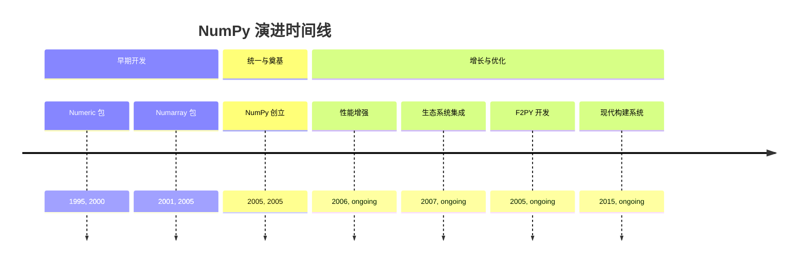
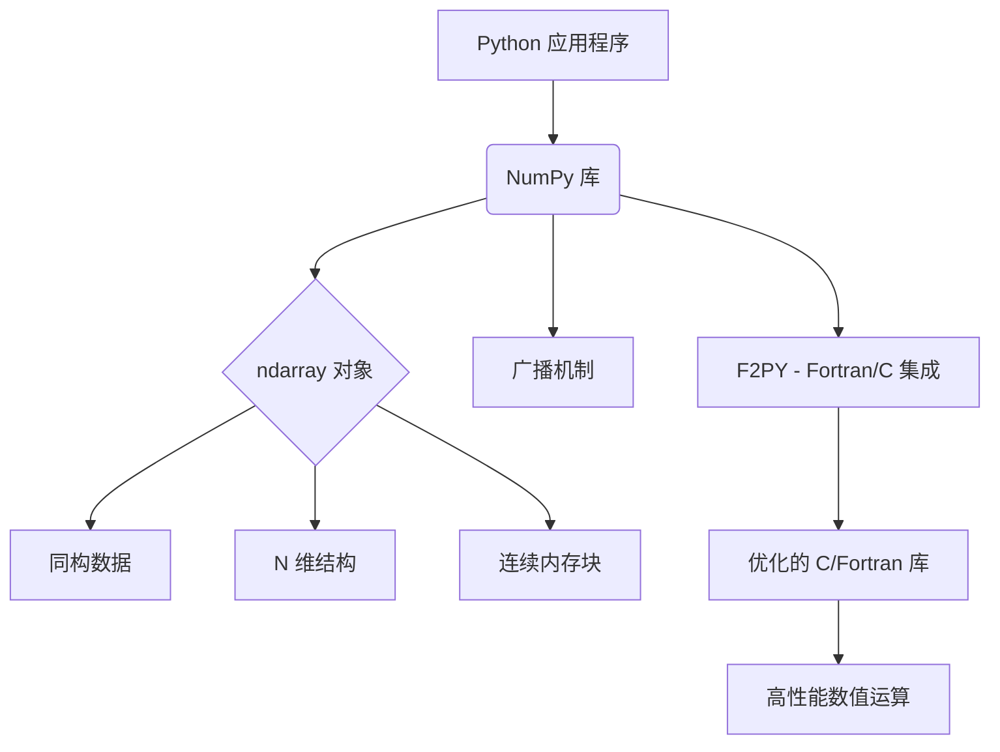
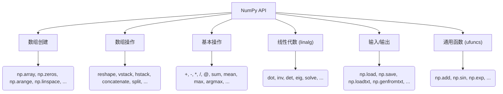
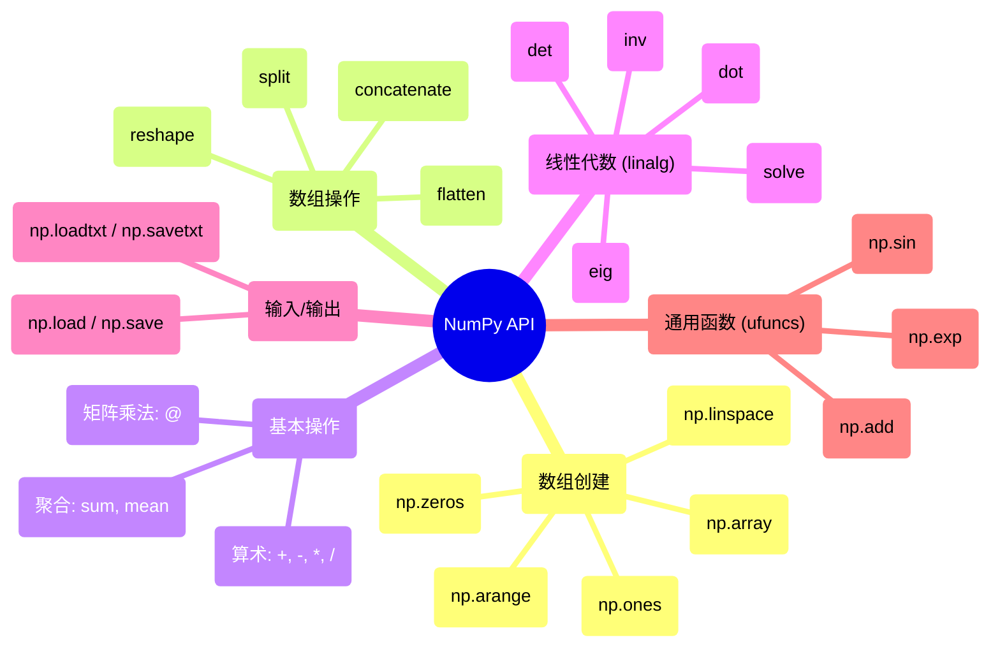

## NumPy 演进文档

### 1. 引言与历史背景

NumPy (Numerical Python) 是 Python 中科学计算的基础包。它提供了一个高性能的多维数组对象，以及用于处理这些数组的工具。它是科学 Python 生态系统的基石，为数据科学、机器学习和科学研究提供了至关重要的高效数值运算能力。

NumPy 的起源可以追溯到 20 世纪 90 年代末，当时 Jim Hugunin 开发了 **Numeric**。Numeric 提供了一个基本的数组对象和操作。后来，**Numarray** 作为一个替代品出现，提供了不同的功能和性能特点。两个相互竞争的数组包的存在导致了科学 Python 社区的分裂。

2005 年，Travis Oliphant 将 Numeric 和 Numarray 的功能合并到一个名为 **NumPy** 的包中。这次统一是一个关键时刻，它提供了一个一致且强大的数组计算基础，加速了整个科学 Python 技术栈的成长。

### 1.1. NumPy 演进时间线



### 2. 核心架构

NumPy 架构的核心围绕 `ndarray` (N 维数组) 对象展开。该对象是一个连续的内存块，用于存储同构数据 (所有元素都是相同的数据类型)。这一设计选择对性能至关重要，因为它允许高效的内存访问，并利用优化的 C/Fortran 库进行计算。

#### 2.1. `ndarray` 对象

**心智模型 / 类比：**
将 `ndarray` 想象成一个高度组织化的、多维度的数字容器，类似于网格或电子表格，但经过了速度优化。与 Python 列表不同，它的所有“单元格”都必须存储相同类型的数据（例如，所有整数、所有浮点数），这就是它如此快速的原因。您可以拥有简单的行（一维）、表格（二维），甚至立方体和超立方体（N 维）的数字。

`ndarray` 是 Python 中用于存储大型数据集的灵活容器。它具有以下特点：
*   **同构数据:** `ndarray` 中的所有元素必须是相同的数据类型 (例如，整数、浮点数、布尔值)。这简化了内存管理，并实现了高度优化的操作。
*   **N 维:** 数组可以有任意数量的维度，从一维向量到二维矩阵再到更高维的张量。
*   **连续内存:** 数据通常存储在连续的内存块中，这对于缓存效率和向量化操作至关重要。
*   **元数据:** `ndarray` 对象本身存储有关数组的元数据，例如其形状、数据类型 (`dtype`) 和步长 (在内存中为了移动到每个维度的下一个元素需要跳过的字节数)。

#### 2.2. 广播 (Broadcasting)

广播是 NumPy 中一个强大的机制，它允许对不同形状的数组执行算术运算。它消除了显式循环的需要，使代码更简洁、更高效。当对两个数组进行操作时，NumPy 会从末尾维度开始逐元素比较它们的形状。如果维度兼容 (它们相等、其中一个为 1，或者其中一个缺失)，则操作继续进行。

#### 2.3. C/Fortran 集成 (F2PY)

NumPy 的一个重要架构特点是它能够与 C 和 Fortran 代码无缝集成。这主要通过 **F2PY (Fortran to Python Interface Generator)** 实现。F2PY 允许开发人员包装现有的 Fortran (和 C) 库，将其功能作为 Python 模块暴露出来。这使得 NumPy 能够利用这些底层语言编写的高度优化的数值例程，从而显著提升性能。

**Mermaid 图：NumPy 核心架构**



### 3. 详细 API 概述

NumPy 的 API 自诞生以来经历了显著的演变，平衡了稳定性需求与现代化和一致性的驱动力。其核心功能在 2006 年发布的 **NumPy 1.0** 中得以确立，为科学 Python 生态系统的构建提供了坚实的基础。

在整个 1.x 发布系列中，API 呈增量式发展。虽然增加了新功能并对现有功能进行了优化，但向后兼容性始终是首要考虑因素。这段长期的稳定期对于 NumPy 的普及至关重要。一个重要的演变发生在 2024 年发布的 **NumPy 2.0**。这是一个旨在实现库现代化的变革性版本。它对 API 命名空间进行了大规模清理 (移除了许多别名和较少使用的函数)，改进了类型提升规则，并采纳了 Python 数组 API 标准，以确保与其他库 (如 PyTorch 和 JAX) 的一致性和互操作性。

以下是关键领域及其演变的详细介绍：

#### 3.1. 数组创建例程

这些函数用于创建新的 NumPy 数组。虽然核心例程自 1.0 版本以来一直保持稳定，但 API 的这一部分也经历了显著的演变。例如，随机数生成系统在 **NumPy 1.17** 中进行了全面改革，引入了新的 `np.random.Generator` API，以提供更强大和可扩展的伪随机数生成功能。

##### 3.1.1. 从现有 Python 数据创建数组

**`np.array(object, dtype=None, ...)`**

**目标：** 将标准 Python 列表或元组转换为 NumPy 数组。

**代码：**
```python
import numpy as np

python_list = [1, 2, 3, 4, 5]
numpy_array = np.array(python_list)
print(numpy_array)
print(type(numpy_array))
```

**预期输出：**
```
[1 2 3 4 5]
<class 'numpy.ndarray'>
```

**解释：** `np.array()` 是最基础的数组创建函数。它接受 Python 原生数据结构并将其转换为高效的 NumPy `ndarray`。这是从 Python 列表转移到 NumPy 高性能运算的起点。

##### 3.1.2. 创建特定模式的数组

**`np.zeros(shape, dtype=float, ...)`**

**目标：** 创建一个给定形状的数组，并用零填充。

**代码：**
```python
import numpy as np

# 创建一个 3x4 的零矩阵
zeros_array = np.zeros((3, 4))
print("零矩阵:")
print(zeros_array)
print(f"形状: {zeros_array.shape}")
print(f"数据类型: {zeros_array.dtype}")
```

**预期输出：**
```
零矩阵:
[[0. 0. 0. 0.]
 [0. 0. 0. 0.]
 [0. 0. 0. 0.]]
形状: (3, 4)
数据类型: float64
```

**解释：** `np.zeros()` 对于初始化数组非常有用，特别是在您知道最终形状但需要逐步填充值的情况下。默认数据类型是 `float64`，但您可以指定其他类型。

**`np.ones(shape, dtype=float, ...)`**

**目标：** 创建一个给定形状的数组，并用一填充。

**代码：**
```python
import numpy as np

# 创建一个 2x3 的一矩阵
ones_array = np.ones((2, 3), dtype=int)
print("一矩阵:")
print(ones_array)
print(f"数据类型: {ones_array.dtype}")
```

**预期输出：**
```
一矩阵:
[[1 1 1]
 [1 1 1]]
数据类型: int64
```

**解释：** `np.ones()` 类似于 `np.zeros()`，但用一填充数组。注意我们如何指定 `dtype=int` 来获取整数而不是默认的浮点数。

**`np.arange(start, stop, step, dtype=None)`**

**目标：** 创建一个包含指定范围内均匀间隔值的数组。

**代码：**
```python
import numpy as np

# 创建一个从 0 到 9 的数组
range_array = np.arange(10)
print("范围数组 (0-9):")
print(range_array)

# 创建一个从 1 到 10，步长为 2 的数组
step_array = np.arange(1, 11, 2)
print("\n步长数组 (1-10, 步长=2):")
print(step_array)

# 创建浮点数范围
float_array = np.arange(0, 1, 0.1)
print(f"\n浮点数范围 (0-1, 步长=0.1):")
print(float_array)
```

**预期输出：**
```
范围数组 (0-9):
[0 1 2 3 4 5 6 7 8 9]

步长数组 (1-10, 步长=2):
[1 3 5 7 9]

浮点数范围 (0-1, 步长=0.1):
[0.  0.1 0.2 0.3 0.4 0.5 0.6 0.7 0.8 0.9]
```

**解释：** `np.arange()` 是 Python 内置 `range()` 函数的 NumPy 版本，但它返回一个 `ndarray` 而不是 Python 范围对象。它对于创建数值序列特别有用。

**`np.linspace(start, stop, num=50, ...)`**

**目标：** 在指定区间内创建指定数量的均匀间隔值。

**代码：**
```python
import numpy as np

# 创建从 0 到 10 的 5 个均匀间隔的点
linspace_array = np.linspace(0, 10, 5)
print("线性间隔数组 (0-10, 5个点):")
print(linspace_array)

# 创建从 0 到 2π 的 100 个点（对于绘制正弦曲线很有用）
pi_array = np.linspace(0, 2*np.pi, 100)
print(f"\n2π 间隔数组的前 5 个值:")
print(pi_array[:5])
```

**预期输出：**
```
线性间隔数组 (0-10, 5个点):
[ 0.   2.5  5.   7.5 10. ]

2π 间隔数组的前 5 个值:
[0.         0.06346652 0.12693304 0.19039955 0.25386607]
```

**解释：** `np.linspace()` 当您知道需要多少个点而不是步长时特别有用。与 `np.arange()` 不同，它包含结束值，并确保精确的点数。

##### 3.1.3. 快速参考：数组创建例程

| 函数 | 描述 | 使用时机 |
| :--- | :--- | :--- |
| `np.array()` | 从 Python 数据创建数组 | 将列表、元组转换为 NumPy 数组。 |
| `np.zeros()` | 创建零填充数组 | 初始化已知形状的数组。 |
| `np.ones()` | 创建一填充数组 | 需要全一数组时，如掩码或权重。 |
| `np.arange()` | 创建数值序列 | 生成等间距的数值范围。 |
| `np.linspace()` | 创建指定点数的均匀间隔 | 需要精确点数的科学计算。 |

#### 3.2. 数组操作

用于改变数组形状和结构的函数一直非常稳定，因为它们代表了基本操作。此类别中的大多数函数，如 `reshape` 和 `concatenate`，自 NumPy 首次发布以来一直是其一部分，为开发人员提供了一致的接口。

##### 3.2.1. 重塑数组

**`ndarray.reshape(shape)`**

**目标：** 在不改变数据的情况下，将数组重新排列成新的形状。

**代码：**
```python
import numpy as np

# 创建一个一维数组
original_array = np.arange(12)
print("原始数组:")
print(original_array)
print(f"原始形状: {original_array.shape}")

# 重塑为 3x4 矩阵
reshaped_2d = original_array.reshape((3, 4))
print("\n重塑为 3x4 矩阵:")
print(reshaped_2d)
print(f"新形状: {reshaped_2d.shape}")

# 重塑为 2x2x3 三维数组
reshaped_3d = original_array.reshape((2, 2, 3))
print("\n重塑为 2x2x3 三维数组:")
print(reshaped_3d)
print(f"新形状: {reshaped_3d.shape}")
```

**预期输出：**
```
原始数组:
[ 0  1  2  3  4  5  6  7  8  9 10 11]
原始形状: (12,)

重塑为 3x4 矩阵:
[[ 0  1  2  3]
 [ 4  5  6  7]
 [ 8  9 10 11]]
新形状: (3, 4)

重塑为 2x2x3 三维数组:
[[[ 0  1  2]
  [ 3  4  5]]

 [[ 6  7  8]
  [ 9 10 11]]]
新形状: (2, 2, 3)
```

**解释：** `reshape()` 是数据科学中最常用的操作之一。关键约束是新形状中的元素总数必须与原始数组相同（在此例中为12个元素）。

##### 3.2.2. 数组连接

**`np.concatenate((a1, a2, ...), axis=0)`**

**目标：** 沿指定轴连接多个数组。

**代码：**
```python
import numpy as np

# 创建两个数组进行连接
array1 = np.array([[1, 2], [3, 4]])
array2 = np.array([[5, 6], [7, 8]])

print("数组 1:")
print(array1)
print("\n数组 2:")
print(array2)

# 沿轴 0（行）连接
concat_axis0 = np.concatenate([array1, array2], axis=0)
print("\n沿轴 0 连接（垂直堆叠）:")
print(concat_axis0)

# 沿轴 1（列）连接
concat_axis1 = np.concatenate([array1, array2], axis=1)
print("\n沿轴 1 连接（水平堆叠）:")
print(concat_axis1)
```

**预期输出：**
```
数组 1:
[[1 2]
 [3 4]]

数组 2:
[[5 6]
 [7 8]]

沿轴 0 连接（垂直堆叠）:
[[1 2]
 [3 4]
 [5 6]
 [7 8]]

沿轴 1 连接（水平堆叠）:
[[1 2 5 6]
 [3 4 7 8]]
```

**解释：** `np.concatenate()` 是组合数据的基础函数。轴参数决定连接方向：axis=0 沿行连接（垂直），axis=1 沿列连接（水平）。

##### 3.2.3. 数组转置

**`ndarray.T`**

**目标：** 转置数组，交换行和列。

**代码：**
```python
import numpy as np

# 创建一个 2x3 矩阵
matrix = np.array([[1, 2, 3], [4, 5, 6]])
print("原始矩阵:")
print(matrix)
print(f"原始形状: {matrix.shape}")

# 转置矩阵
transposed = matrix.T
print("\n转置后的矩阵:")
print(transposed)
print(f"转置后形状: {transposed.shape}")

# 验证转置：原始矩阵的第一行应该成为转置矩阵的第一列
print(f"\n原始矩阵第一行: {matrix[0, :]}")
print(f"转置矩阵第一列: {transposed[:, 0]}")
```

**预期输出：**
```
原始矩阵:
[[1 2 3]
 [4 5 6]]
原始形状: (2, 3)

转置后的矩阵:
[[1 4]
 [2 5]
 [3 6]]
转置后形状: (3, 2)

原始矩阵第一行: [1 2 3]
转置矩阵第一列: [1 4]
```

**解释：** 转置是线性代数中的基础操作。`.T` 属性提供了一种简洁的方式来交换矩阵的行和列。

##### 3.2.4. 快速参考：数组操作

| 函数 | 描述 | 使用时机 |
| :--- | :--- | :--- |
| `ndarray.reshape()` | 改变数组形状 | 为不同操作准备数据格式。 |
| `np.concatenate()` | 连接数组 | 组合来自不同源的数据。 |
| `ndarray.T` | 转置数组 | 矩阵运算和数据重新排列。 |

#### 3.3. 基本操作

逐元素操作是 NumPy 性能的基石。一个显著的演变是在 **NumPy 1.10** 中引入了用于矩阵乘法的 `@` 运算符 (在 Python 3.5 中添加后)，提供了比 `np.dot()` 更清晰的语法。最近，**NumPy 2.0** 增强了聚合函数，例如为 `np.quantile` 添加了 `weights` 参数以支持加权分位数。

##### 3.3.1. 算术运算

**算术运算符 (`+`, `-`, `*`, `/`, `**`)**

**目标：** 对数组执行逐元素的算术运算。

**代码：**
```python
import numpy as np

# 创建两个数组
arr1 = np.array([1, 2, 3, 4])
arr2 = np.array([5, 6, 7, 8])

print("数组 1:", arr1)
print("数组 2:", arr2)

# 基本算术运算
print(f"\n加法: {arr1 + arr2}")
print(f"减法: {arr1 - arr2}")
print(f"乘法: {arr1 * arr2}")
print(f"除法: {arr1 / arr2}")
print(f"幂运算: {arr1 ** 2}")

# 与标量的运算（广播）
print(f"\n数组 + 10: {arr1 + 10}")
print(f"数组 * 3: {arr1 * 3}")
```

**预期输出：**
```
数组 1: [1 2 3 4]
数组 2: [5 6 7 8]

加法: [ 6  8 10 12]
减法: [-4 -4 -4 -4]
乘法: [ 5 12 21 32]
除法: [0.2        0.33333333 0.42857143 0.5       ]
幂运算: [ 1  4  9 16]

数组 + 10: [11 12 13 14]
数组 * 3: [ 3  6  9 12]
```

**解释：** NumPy 的算术运算是逐元素进行的，这与标准的矩阵乘法不同。广播允许不同形状的数组进行运算。

##### 3.3.2. 矩阵运算

**`@` 运算符 / `np.dot(a, b)`**

**目标：** 执行矩阵乘法和点积运算。

**代码：**
```python
import numpy as np

# 矩阵乘法示例
matrix1 = np.array([[1, 2], [3, 4]])
matrix2 = np.array([[5, 6], [7, 8]])

print("矩阵 1:")
print(matrix1)
print("\n矩阵 2:")
print(matrix2)

# 使用 @ 运算符进行矩阵乘法
result_at = matrix1 @ matrix2
print("\n矩阵乘法 (使用 @):")
print(result_at)

# 使用 np.dot() 函数（等价结果）
result_dot = np.dot(matrix1, matrix2)
print("\n矩阵乘法 (使用 np.dot):")
print(result_dot)

# 向量点积
vec1 = np.array([1, 2, 3])
vec2 = np.array([4, 5, 6])
dot_product = vec1 @ vec2
print(f"\n向量点积: {vec1} · {vec2} = {dot_product}")
```

**预期输出：**
```
矩阵 1:
[[1 2]
 [3 4]]

矩阵 2:
[[5 6]
 [7 8]]

矩阵乘法 (使用 @):
[[19 22]
 [43 50]]

矩阵乘法 (使用 np.dot):
[[19 22]
 [43 50]]

向量点积: [1 2 3] · [4 5 6] = 32
```

**解释：** `@` 运算符提供了清晰的矩阵乘法语法。对于向量，它计算点积；对于矩阵，它执行标准的矩阵乘法。

##### 3.3.3. 聚合函数

**`np.sum(a, axis=None, ...)` 和 `np.mean(a, axis=None, ...)`**

**目标：** 计算数组的统计量。

**代码：**
```python
import numpy as np

# 创建一个 2D 数组
data = np.array([[1, 2, 3], [4, 5, 6], [7, 8, 9]])
print("数据数组:")
print(data)

# 全部元素的统计
print(f"\n所有元素的总和: {np.sum(data)}")
print(f"所有元素的平均值: {np.mean(data)}")

# 沿不同轴的统计
print(f"\n沿轴 0 的总和 (列总和): {np.sum(data, axis=0)}")
print(f"沿轴 1 的总和 (行总和): {np.sum(data, axis=1)}")

print(f"\n沿轴 0 的平均值 (列平均): {np.mean(data, axis=0)}")
print(f"沿轴 1 的平均值 (行平均): {np.mean(data, axis=1)}")

# 查找最大值的索引
print(f"\n最大值的索引 (扁平化): {np.argmax(data)}")
print(f"沿轴 0 的最大值索引: {np.argmax(data, axis=0)}")
print(f"沿轴 1 的最大值索引: {np.argmax(data, axis=1)}")
```

**预期输出：**
```
数据数组:
[[1 2 3]
 [4 5 6]
 [7 8 9]]

所有元素的总和: 45
所有元素的平均值: 5.0

沿轴 0 的总和 (列总和): [12 15 18]
沿轴 1 的总和 (行总和): [ 6 15 24]

沿轴 0 的平均值 (列平均): [4. 5. 6.]
沿轴 1 的平均值 (行平均): [2. 5. 8.]

最大值的索引 (扁平化): 8
沿轴 0 的最大值索引: [2 2 2]
沿轴 1 的最大值索引: [2 2 2]
```

**解释：** 聚合函数可以应用于整个数组或沿特定轴。轴的概念是 NumPy 中的核心：axis=0 通常表示行方向，axis=1 表示列方向。

##### 3.3.4. 快速参考：基本操作

| 操作 | 描述 | 使用时机 |
| :--- | :--- | :--- |
| `+`, `-`, `*`, `/` | 逐元素算术运算 | 数组间的基本数学运算。 |
| `@`, `np.dot()` | 矩阵乘法/点积 | 线性代数运算。 |
| `np.sum()`, `np.mean()` | 聚合统计 | 数据分析和统计计算。 |
| `np.argmax()`, `np.argmin()` | 查找极值索引 | 找到最大/最小值的位置。 |

#### 3.4. 线性代数 (`numpy.linalg`)

`numpy.linalg` 子模块为高度优化的线性代数库 (如 BLAS 和 LAPACK) 提供了稳定的接口。虽然底层实现为了性能不断改进，但面向 Python 的 API 在很大程度上保持了一致，以确保依赖这些基本操作的代码不会中断。

*   **`np.linalg.inv(a)`**
    *   **背景:** 计算矩阵的乘法逆。
    *   **参数:**
        *   `a`: 要求逆的矩阵。必须是方阵。
    *   **返回:** 矩阵 `a` 的逆。

*   **`np.linalg.det(a)`**
    *   **背景:** 计算方阵的行列式。
    *   **参数:**
        *   `a`: 输入矩阵。
    *   **返回:** `a` 的行列式。

*   **`np.linalg.eig(a)`**
    *   **背景:** 计算方阵的特征值和右特征向量。
    *   **参数:**
        *   `a`: 要计算特征值和特征向量的矩阵。
    *   **返回:** 一个元组，包含：
        *   一个特征值数组。
        *   一个数组，其中每一列是对应的特征向量。

*   **`np.linalg.solve(a, b)`**
    *   **背景:** 求解线性矩阵方程 `ax = b` 中的 `x`。
    *   **参数:**
        *   `a`: 系数矩阵。
        *   `b`: 纵坐标或“因变量”值。
    *   **返回:** 方程组 `ax = b` 的解。

#### 3.5. 输入/输出

NumPy 的 I/O 函数设计兼顾了简单性和性能。虽然 `np.loadtxt` 对于简单的文本文件很有用，但引入 `np.genfromtxt` 是为了提供一种更强大的方式来处理包含缺失数据的文件。对于性能要求高的应用，二进制 `.npy` 和 `.npz` 格式自早期版本以来一直是标准。

*   **`np.save(file, arr)`**
    *   **背景:** 将单个数组以 NumPy 的 `.npy` 格式保存到二进制文件中。
    *   **参数:**
        *   `file`: 要保存数据的文件名 (或文件对象)。
        *   `arr`: 要保存的数组。

*   **`np.load(file)`**
    *   **背景:** 从 `.npy` 或 `.npz` 文件中加载数组。
    *   **参数:**
        *   `file`: 要读取的文件。
    *   **返回:** 文件中存储的数组。

*   **`np.savetxt(fname, X, fmt='%.18e', delimiter=' ', ...)`**
    *   **背景:** 将数组保存到文本文件中。
    *   **参数:**
        *   `fname`: 文件名。
        *   `X`: 要保存的数组。
        *   `fmt`: (可选) 数字的格式字符串。
        *   `delimiter`: (可选) 用于分隔值的字符串。

*   **`np.loadtxt(fname, dtype=float, delimiter=None, ...)`**
    *   **背景:** 从文本文件中加载数据。
    *   **参数:**
        *   `fname`: 文件名。
        *   `dtype`: (可选) 结果数组的数据类型。
        *   `delimiter`: (可选) 用于分隔值的字符串。
    *   **返回:** 一个包含文件数据的 `ndarray`。

#### 3.6. 通用函数 (ufuncs)

Ufuncs 是 NumPy 逐元素操作的核心。它们是以逐元素方式对 `ndarray` 进行操作的函数，支持数组广播和类型转换等功能。一个关键的演变是在 **NumPy 1.13** 中引入了 `__array_ufunc__` 协议，这使得其他库能够与 NumPy 的 ufuncs 互操作。

*   **背景:** Ufuncs 为接受固定数量标量输入并产生固定数量标量输出的函数提供了“向量化”包装器。这意味着它们可以将一个函数应用于数组的每个元素，而无需显式的 Python 循环，从而显著提升性能。
*   **常见示例:**
    *   **`np.add`**, **`np.subtract`**, **`np.multiply`**, **`np.divide`**: 这些对应于基本的算术运算符 (`+`, `-`, `*`, `/`)。
    *   **`np.sin`**, **`np.cos`**, **`np.exp`**: 这些是可以逐元素应用的常见数学函数的示例。
    *   **`np.sqrt`**: 计算每个元素的非负平方根。
    *   **`np.log`**: 计算每个元素的自然对数。

**Mermaid 图：简化的 NumPy API 结构**



### 3.7. API 思维导图



### 4. 演变与影响

NumPy 的演变受到科学计算社区需求的推动，专注于性能、易用性和广泛的适用性。

*   **性能优化:** 为了优化 NumPy 的性能，人们做出了持续的努力，包括利用 SIMD (单指令多数据) 指令、改进内存管理以及增强其 C/Fortran 集成。针对 CPU 功能的构建选项 (`cpu-baseline`, `cpu-dispatch`) 展示了对硬件特定优化的关注。
*   **生态系统基础:** NumPy 稳定高效的 `ndarray` 已成为 Python 中数值数据交换的事实标准。SciPy、Pandas、Matplotlib、Scikit-learn 和 TensorFlow 等库都建立在 NumPy 数组之上或与之深度集成。
*   **社区与发展:** NumPy 拥有一个充满活力的开源社区，为其开发、文档和维护做出贡献。用于运行测试的 `spin` 实用程序和用于文档检查的 `scipy-doctest` 突出了其强大的开发和测试实践。
*   **互操作性:** F2PY 仍然是一个关键功能，它允许研究人员和开发人员集成用 Fortran 或 C 编写的高性能遗留代码，从而在不重写核心数值算法的情况下扩展 Python 的功能。
*   **现代构建系统:** 采用 `scikit-build` 和 `meson-python` 等工具来构建 NumPy 扩展，反映了向更现代、更强大的构建流程的转变，特别是对于涉及编译语言的复杂项目。

### 5. 结论

NumPy 从分散的数组包到统一、高性能的基础的历程，对 Python 中的科学计算具有变革性意义。其 `ndarray` 对象，加上强大的广播、广泛的 API 和无缝的 C/Fortran 集成，为数值运算提供了一个无与伦比的平台。在性能优化和社区贡献的推动下，持续的演变确保了 NumPy 始终处于科学数据处理的前沿，继续为各个领域的研究人员和开发人员赋能。

### 6. 典型用例

#### 6.1. 数组计算

```python
import numpy as np
x = np.arange(1, 6)
y = np.linspace(0.0, 1.0, 5)
z = x * y + np.sin(x)
```

#### 6.2. 广播

```python
import numpy as np
A = np.ones((3, 1))
B = np.arange(3)
C = A + B
```

#### 6.3. 线性代数

```python
import numpy as np
M = np.array([[3.0, 1.0], [2.0, 4.0]])
b = np.array([10.0, 8.0])
x = np.linalg.solve(M, b)
```

#### 6.4. 使用 .npy 进行 I/O

```python
import numpy as np
arr = np.random.rand(2, 3)
np.save("data.npy", arr)
loaded = np.load("data.npy")
```