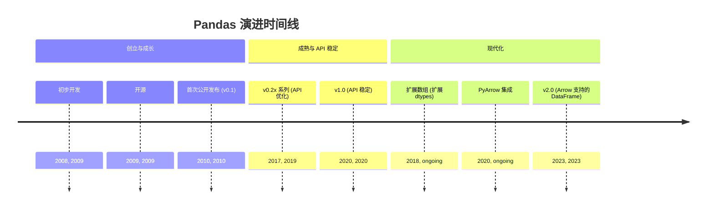
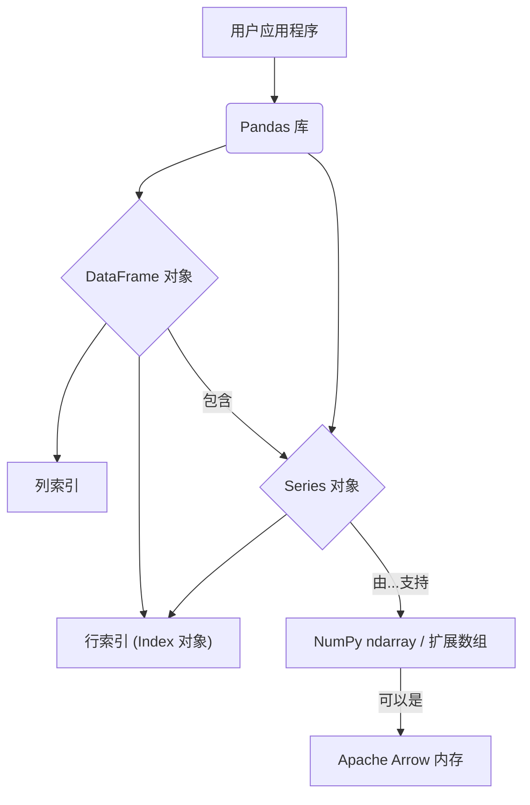
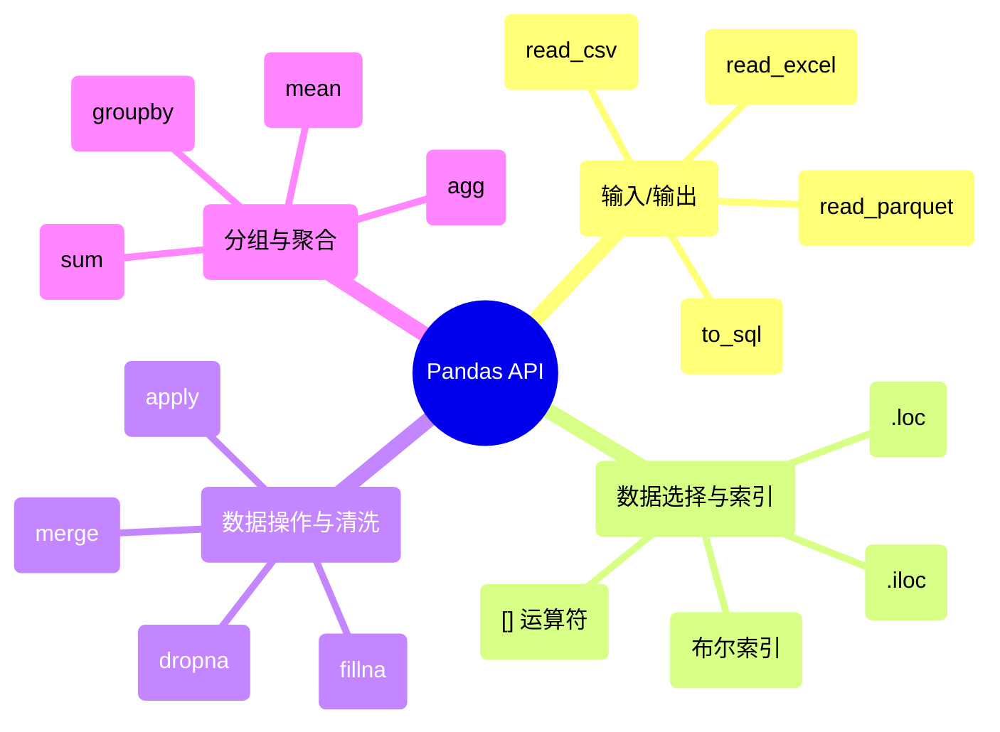

## Pandas 演进文档

### 1. 引言与历史背景

Pandas 是 Python 中数据操作和分析的基础库。它提供高性能、易于使用的数据结构和数据分析工具，使其成为数据科学和机器学习生态系统中不可或缺的一部分。它的名字来源于“面板数据”(panel data)，这是一个计量经济学术语，指代多维结构化数据集。

Pandas 由 Wes McKinney 于 2008 年在 AQR 资本管理公司工作时创建。他需要一个能够高性能、灵活地处理复杂金融数据的工具。由于发现 Python 中现有的工具不足以满足需求，他开始构建 pandas 来解决这些问题。它于 2009 年开源，并从此发展成为一个庞大、由社区驱动的项目。

该库的主要贡献是 **DataFrame**，这是一种二维标记数据结构，其列可以具有不同的数据类型，类似于电子表格或 SQL 表。它为读取和写入数据、清洗、转换、合并和重塑数据集提供了强大的工具。

### 1.1. Pandas 演进时间线



### 2. 核心架构

Pandas 构建于 NumPy 之上，利用其 `ndarray` 实现快速、内存高效的数据存储。然而，pandas 引入了自己的高级数据结构 `Series` 和 `DataFrame`，它们提供了带标签的轴 (索引和列) 以及大量用于数据操作的专门函数。

#### 2.1. `Series` 和 `DataFrame` 对象

**心智模型 / 类比：**
*   **`Series`:** 想象电子表格中的单列，例如姓名或年龄列表，但每个项目都有一个特殊的标签（“索引”）。它是一个具有数据处理超能力的一维数组。
*   **`DataFrame`:** 将其视为完整的电子表格或 SQL 表。它是 `Series`（列）的集合，这些 `Series` 共享相同的行标签（索引）。这种二维结构是 Pandas 中数据分析的核心，允许您高效地组织和操作表格数据。

*   **`Series`:** 一种能够容纳任何数据类型的一维标记数组。它本质上是 `DataFrame` 的单列。这些标签统称为**索引**。
*   **`DataFrame`:** 一种二维标记数据结构，其列可以具有不同的数据类型。它可以被看作是 `Series` 对象的字典，其中键是列名，值是 `Series` 本身。它同时具有行索引和列索引。

#### 2.2. Index 对象

`Index` 是 pandas 的核心数据结构，用于保存 `Series` 和 `DataFrame` 对象的轴标签。它是不可变的，并提供优化的查找和集合逻辑，从而在操作过程中实现数据的高效对齐。

#### 2.3. 内存管理和数据类型

在内部，`DataFrame` 是 `Series` 的集合，每个 `Series` 都由一个 NumPy 数组支持。这种“列主序”或“基于块”的架构允许高效的存储和计算，因为可以按列对操作进行向量化。该领域的一个重要演进是引入了**扩展数组 (Extension Arrays)**，它允许使用 NumPy 之外的自定义数据类型 (例如，分类、可空整数和时区感知的日期时间)。最近，与 **Apache Arrow** 的集成为内存中的列式格式提供了更高的效率，特别是在处理字符串数据和与其他系统互操作时。

**Mermaid 图：Pandas 核心架构**



### 3. 详细 API 概述

Pandas 的 API 非常广泛，涵盖了从数据提取到清洗、转换和可视化的整个数据分析工作流程。API 在 `0.x` 版本中经历了显著的增长和优化，最终在 2020 年发布了 **pandas 1.0**，这标志着对 API 稳定性的坚定承诺。

最近的一个主要演进是 2023 年发布的 **pandas 2.0**，它正式支持 **Apache Arrow** 作为内存后端。这带来了显著的性能提升 (尤其是在字符串处理和 I/O 方面)，并改进了与其他数据分析库的互操作性。

#### 3.1. 输入/输出

Pandas 提供了一套丰富的 I/O 工具，用于读取和写入各种格式的数据。

##### 3.1.1. 从 CSV 文件读取数据

**`pd.read_csv(filepath_or_buffer, ...)`**

**目标：** 将 CSV（逗号分隔值）文件中的数据加载到 Pandas DataFrame 中。

**代码：**
```python
import pandas as pd
import os

# Create a dummy CSV file for demonstration
csv_content = "col1,col2\n1,A\n2,B\n3,C"
with open("sample.csv", "w") as f:
    f.write(csv_content)

df_csv = pd.read_csv("sample.csv")
print(df_csv)

# Clean up the dummy file
os.remove("sample.csv")
```

**预期输出：**
```
   col1 col2
0     1    A
1     2    B
2     3    C
```

**解释：** `pd.read_csv()` 是最常用的导入表格数据的函数。它会自动推断列类型并处理常见的分隔符。您可以使用 `sep` 指定不同的分隔符（例如，`sep='\t'` 用于 TSV），如果文件没有标题行，则可以使用 `header` 参数。

*   **背景:** 读取分隔符数据 (如 CSV 和 TSV 文件) 到 `DataFrame` 的主力函数。
*   **参数:**
        *   `filepath_or_buffer`: 文件路径或类文件对象。
        *   `sep`: 使用的分隔符。
        *   `header`: 用作列名的行号。
*   **返回:** 一个 `DataFrame`。

##### 3.1.2. 从 Excel 文件读取数据

**`pd.read_excel(io, ...)`**

**目标：** 将 Excel 文件（例如 `.xlsx`、`.xls`）中的数据加载到 Pandas DataFrame 中。

**代码：**
```python
import pandas as pd
import os

# This example requires the openpyxl engine to be installed:
# pip install openpyxl

# Create a dummy Excel file for demonstration
# (Requires openpyxl to write, but read_excel can use other engines too)
try:
    from openpyxl import Workbook
    wb = Workbook()
    ws = wb.active
    ws['A1'] = 'col1'
    ws['B1'] = 'col2'
    ws['A2'] = 1
    ws['B2'] = 'X'
    ws['A3'] = 2
    ws['B3'] = 'Y'
    excel_filename = "sample.xlsx"
    wb.save(excel_filename)

    df_excel = pd.read_excel(excel_filename)
    print(df_excel)

    # Clean up the dummy file
    os.remove(excel_filename)
    print(f"Cleaned up {excel_filename}")
except ImportError:
    print("'openpyxl' not installed. Skipping Excel example.")
except Exception as e:
    print(f"An error occurred: {e}")
```

**预期输出（如果安装了 openpyxl）：**
```
   col1 col2
0     1    X
1     2    Y
Cleaned up sample.xlsx
```

**解释：** `pd.read_excel()` 用于从 Excel 电子表格中读取数据。您可以指定 `sheet_name` 来读取特定的工作表。它通常需要安装额外的引擎，如 `openpyxl` 或 `xlrd`。

*   **背景:** 从 Excel 文件中读取数据到 `DataFrame`。
*   **参数:**
        *   `io`: Excel 文件的路径。
        *   `sheet_name`: 要读取的特定工作表。
*   **返回:** 一个 `DataFrame`。

##### 3.1.3. 将数据写入 SQL 数据库

**`DataFrame.to_sql(name, con, ...)`**

**目标：** 将 DataFrame 中存储的记录写入 SQL 数据库表。

**代码：**
```python
import pandas as pd
import sqlite3
import os

# Create a dummy DataFrame
df_sql = pd.DataFrame({'id': [1, 2, 3], 'name': ['Alice', 'Bob', 'Charlie']})

# Create an in-memory SQLite database connection
conn = sqlite3.connect(':memory:')

# Write the DataFrame to a SQL table named 'users'
df_sql.to_sql('users', conn, if_exists='replace', index=False)
print("DataFrame written to SQL table 'users'.")

# Verify by reading from SQL
df_from_sql = pd.read_sql("SELECT * FROM users", conn)
print(f"\nData read from SQL:\n{df_from_sql}")

# Close the connection
conn.close()
```

**预期输出：**
```
DataFrame written to SQL table 'users'.

Data read from SQL:
   id     name
0   1    Alice
1   2      Bob
2   3  Charlie
```

**解释：** `DataFrame.to_sql()` 对于将 Pandas 与关系数据库集成至关重要。您需要一个数据库连接对象 (`con`)，并且可以指定如何处理现有表（`if_exists='replace'`、`'append'` 或 `'fail'`）。`index=False` 可防止将 DataFrame 索引作为列写入 SQL 表。

*   **背景:** 将存储在 `DataFrame` 中的记录写入 SQL 数据库。
*   **参数:**
        *   `name`: SQL 表的名称。
        *   `con`: 数据库连接对象。

##### 3.1.4. 从 Parquet 文件读取数据

**`pd.read_parquet(path, ...)`**

**目标：** 将 Parquet 文件中的数据加载到 Pandas DataFrame 中。

**代码：**
```python
import pandas as pd
import os

# This example requires the pyarrow or fastparquet engine to be installed:
# pip install pyarrow

# Create a dummy DataFrame and save it to Parquet
df_parquet_original = pd.DataFrame({
    'col1': [1, 2, 3],
    'col2': ['A', 'B', 'C']
})
parquet_filename = "sample.parquet"

try:
    df_parquet_original.to_parquet(parquet_filename, index=False)
    print(f"DataFrame saved to {parquet_filename}")

    # Read the Parquet file back into a DataFrame
    df_parquet_loaded = pd.read_parquet(parquet_filename)
    print(f"\nData read from Parquet:\n{df_parquet_loaded}")

    # Clean up the dummy file
    os.remove(parquet_filename)
    print(f"Cleaned up {parquet_filename}")
except ImportError:
    print("'pyarrow' or 'fastparquet' not installed. Skipping Parquet example.")
except Exception as e:
    print(f"An error occurred: {e}")
```

**预期输出（如果安装了 pyarrow/fastparquet）：**
```
DataFrame saved to sample.parquet

Data read from Parquet:
   col1 col2
0     1    A
1     2    B
2     3    C
Cleaned up sample.parquet
```

**解释：** Parquet 是一种列式存储格式，针对性能和高效磁盘使用进行了优化，尤其适用于大型数据集。`pd.read_parquet()` 是加载这些文件的函数。它通常用于大数据生态系统。

*   **背景:** 读取 Parquet 文件中的数据。Parquet 是一种高效的列式存储格式。
*   **参数:**
        *   `path`: Parquet 文件的路径。
*   **返回:** 一个 `DataFrame`。

##### 3.1.5. 快速参考：输入/输出

| 函数 | 描述 | 何时使用 |
| :--- | :--- | :--- |
| `pd.read_csv()` | 读取分隔符数据 (CSV, TSV) | 最常用于平面文件数据，高度可配置。 |
| `pd.read_excel()` | 读取 Excel 文件 | 处理存储在 `.xlsx` 或 `.xls` 格式中的数据。 |
| `DataFrame.to_sql()` | 将 DataFrame 写入 SQL | 将处理后的数据存储在关系数据库中。 |
| `pd.read_parquet()` | 读取 Parquet 文件 | 高效加载大型列式数据集。 |

#### 3.2. 数据选择与索引

Pandas 提供了强大而灵活的方式来选择数据的子集。

##### 3.2.1. 基本列选择

**`[]` 运算符**

**目标：** 从 DataFrame 中选择一列或多列。

**代码：**
```python
import pandas as pd

df = pd.DataFrame({
    'name': ['Alice', 'Bob', 'Charlie'],
    'age': [25, 30, 35],
    'city': ['NY', 'LA', 'CHI']
})

# Select a single column (returns a Series)
names = df['name']
print(f"Single column (Series):\n{names}")
print(f"Type of single column: {type(names)}")

# Select multiple columns (returns a DataFrame)
cities_ages = df[['city', 'age']]
print(f"\nMultiple columns (DataFrame):\n{cities_ages}")
print(f"Type of multiple columns: {type(cities_ages)}")
```

**预期输出：**
```
Single column (Series):
0      Alice
1        Bob
2    Charlie
Name: name, dtype: object
Type of single column: <class 'pandas.core.series.Series'>

Multiple columns (DataFrame):
  city  age
0   NY   25
1   LA   30
2  CHI   35
Type of multiple columns: <class 'pandas.core.frame.DataFrame'>
```

**解释：** 使用单方括号 `[]` 和列名会返回一个 `Series`。使用双层方括号 `[[]]` 和列名列表会返回一个 `DataFrame`。这是访问列的基本方法。

*   **背景:** 基本选择。对于 `DataFrame`，`df['col']` 选择一列作为 `Series`，而 `df[['col1', 'col2']]` 选择多列作为 `DataFrame`。

##### 3.2.2. 使用 `.loc[]` 进行基于标签的选择

**`.loc[]` 访问器**

**目标：** 通过行和列标签选择数据。

**代码：**
```python
import pandas as pd

df = pd.DataFrame({
    'name': ['Alice', 'Bob', 'Charlie'],
    'age': [25, 30, 35],
    'city': ['NY', 'LA', 'CHI']
}, index=['a', 'b', 'c'])

print(f"Original DataFrame:\n{df}")

# Select a single row by label
row_b = df.loc['b']
print(f"\nRow 'b' (Series):\n{row_b}")

# Select a single value by row and column label
alice_age = df.loc['a', 'age']
print(f"\nAlice's age: {alice_age}")

# Select multiple rows and columns by labels
subset_df = df.loc[['a', 'c'], ['name', 'city']]
print(f"\nSubset by labels:\n{subset_df}")

# Select rows with a boolean condition using .loc
older_than_30 = df.loc[df['age'] > 30]
print(f"\nRows where age > 30:\n{older_than_30}")
```

**预期输出：**
```
Original DataFrame:
      name  age city
a    Alice   25   NY
b      Bob   30   LA
c  Charlie   35  CHI

Row 'b' (Series):
name    Bob
age      30
city     LA
Name: b, dtype: object

Alice's age: 25

Subset by labels:
      name city
a    Alice   NY
c  Charlie  CHI

Rows where age > 30:
      name  age city
c  Charlie   35  CHI
```

**解释：** `.loc[]` 严格基于标签。第一个参数指代行标签，第二个参数指代列标签。在切片时，它包含起始和结束标签。当您希望确保标签对齐时，它也是对行执行布尔索引的首选方法。

*   **背景:** 基于标签的索引。根据索引和列标签选择数据。
*   **用法:** `df.loc['row_label', 'col_label']`

##### 3.2.3. 使用 `.iloc[]` 进行基于整数位置的选择

**`.iloc[]` 访问器**

**目标：** 通过行和列的整数位置（0-based 索引）选择数据。

**代码：**
```python
import pandas as pd

df = pd.DataFrame({
    'name': ['Alice', 'Bob', 'Charlie'],
    'age': [25, 30, 35],
    'city': ['NY', 'LA', 'CHI']
}, index=['a', 'b', 'c'])

print(f"Original DataFrame:\n{df}")

# Select the first row by integer position
first_row = df.iloc[0]
print(f"\nFirst row (Series):\n{first_row}")

# Select a single value by row and column integer position
bob_age = df.iloc[1, 1]
print(f"\nBob's age: {bob_age}")

# Select multiple rows and columns by integer positions
subset_iloc_df = df.iloc[[0, 2], [0, 2]] # Rows 0 and 2, columns 0 and 2
print(f"\nSubset by integer positions:\n{subset_iloc_df}")

# Slice rows and columns by integer position
slice_df = df.iloc[0:2, 1:3] # Rows 0 to 1, columns 1 to 2
print(f"\nSliced by integer positions:\n{slice_df}")
```

**预期输出：**
```
Original DataFrame:
      name  age city
a    Alice   25   NY
b      Bob   30   LA
c  Charlie   35  CHI

First row (Series):
name    Alice
age        25
city       NY
Name: a, dtype: object

Bob's age: 30

Subset by integer positions:
      name city
a    Alice   NY
c  Charlie  CHI

Sliced by integer positions:
    age city
a    25   NY
b    30   LA
```

**解释：** `.iloc[]` 严格基于整数位置，类似于标准的 Python 列表切片。第一个参数指代行位置，第二个参数指代列位置。在切片时，它不包含结束位置。

*   **背景:** 基于整数位置的索引。根据其整数位置选择数据。
*   **用法:** `df.iloc[0, 1]`
*   **布尔索引:**
    *   **用法:** `df.iloc[0, 1]`

##### 3.2.4. 条件选择（布尔索引）

**布尔索引**

**目标：** 根据应用于一列或多列的条件从 DataFrame 中选择行。

**代码：**
```python
import pandas as pd

df = pd.DataFrame({
    'name': ['Alice', 'Bob', 'Charlie', 'David'],
    'age': [25, 30, 35, 28],
    'city': ['NY', 'LA', 'CHI', 'NY']
})

print(f"Original DataFrame:\n{df}")

# Select rows where age is greater than 30
older_than_30 = df[df['age'] > 30]
print(f"\nRows where age > 30:\n{older_than_30}")

# Select rows based on multiple conditions (AND)
ny_and_young = df[(df['city'] == 'NY') & (df['age'] < 30)]
print(f"\nRows from NY and age < 30:\n{ny_and_young}")

# Select rows based on multiple conditions (OR)
ny_or_la = df[(df['city'] == 'NY') | (df['city'] == 'LA')]
print(f"\nRows from NY or LA:\n{ny_or_la}")
```

**预期输出：**
```
Original DataFrame:
      name  age   city
0    Alice   25     NY
1      Bob   30     LA
2  Charlie   35    CHI
3    David   28     NY

Rows where age > 30:
      name  age city
2  Charlie   35  CHI

Rows from NY and age < 30:
    name  age city
0  Alice   25   NY
3  David   28   NY

Rows from NY or LA:
    name  age city
0  Alice   25   NY
1    Bob   30   LA
3  David   28   NY
```

**解释：** 布尔索引涉及将布尔值（True/False）的 Series 传递给 DataFrame 的 `[]` 运算符。只选择对应于 `True` 值的行。对于多个条件，使用 `&` (AND) 和 `|` (OR) 运算符，并确保每个条件都用括号括起来。

*   **背景:** 根据布尔条件选择行。
*   **用法:** `df[df['age'] > 30]`

##### 3.2.5. 快速参考：数据选择与索引

| 方法/运算符 | 描述 | 何时使用 |
| :--- | :--- | :--- |
| `df[]` | 基本列选择 | 按名称选择一列或多列。 |
| `df.loc[]` | 基于标签的选择 | 通过其显式标签（名称）选择行/列。 |
| `df.iloc[]` | 基于整数位置的选择 | 通过其整数位置（0-based）选择行/列。 |
| `df[boolean_array]` | 条件选择 | 根据应用于列值的布尔条件过滤行。 |

#### 3.3. 数据操作与清洗

这是 pandas 真正大放异彩的地方，它提供了大量用于清洗和转换数据的函数。

##### 3.3.1. 处理缺失数据

**`DataFrame.dropna(axis=0, ...)`**

**目标：** 删除包含缺失值（NaN）的行或列。

**代码：**
```python
import pandas as pd
import numpy as np

df = pd.DataFrame({
    'A': [1, 2, np.nan, 4],
    'B': [5, np.nan, 7, 8],
    'C': [9, 10, 11, 12]
})

print(f"Original DataFrame:\n{df}")

# Drop rows with any NaN values
df_dropped_rows = df.dropna(axis=0)
print(f"\nDataFrame after dropping rows with NaN:\n{df_dropped_rows}")

# Drop columns with any NaN values
df_dropped_cols = df.dropna(axis=1)
print(f"\nDataFrame after dropping columns with NaN:\n{df_dropped_cols}")

# Drop rows only if ALL values are NaN
df_all_nan = pd.DataFrame({'X': [1, np.nan], 'Y': [np.nan, np.nan]})
print(f"\nOriginal DataFrame (with all NaN row):\n{df_all_nan}")
df_dropped_all_nan = df_all_nan.dropna(how='all')
print(f"DataFrame after dropping rows where ALL are NaN:\n{df_dropped_all_nan}")
```

**预期输出：**
```
Original DataFrame:
     A    B   C
0  1.0  5.0   9
1  2.0  NaN  10
2  NaN  7.0  11
3  4.0  8.0  12

DataFrame after dropping rows with NaN:
     A    B   C
0  1.0  5.0   9
3  4.0  8.0  12

DataFrame after dropping columns with NaN:
    C
0   9
1  10
2  11
3  12

Original DataFrame (with all NaN row):
     X   Y
0  1.0 NaN
1  NaN NaN
DataFrame after dropping rows where ALL are NaN:
     X   Y
0  1.0 NaN
```

**解释：** `dropna()` 对于数据清洗至关重要。`axis=0`（默认）删除行，`axis=1` 删除列。`how` 参数（`'any'` 或 `'all'`）指定是存在 *任何* NaN 时删除，还是仅当 *所有* 值都是 NaN 时删除。它返回一个新的 DataFrame，除非使用 `inplace=True`，否则原始 DataFrame 不会改变。

*   **背景:** 移除缺失值 (NaN)。
*   **参数:**
        *   `axis`: `0` 表示删除包含缺失值的行，`1` 表示删除列。
    *   **返回:** 一个移除了缺失值的 `DataFrame`。

**`DataFrame.fillna(value, ...)`**

**目标：** 用指定的值或方法替换缺失值（NaN）。

**代码：**
```python
import pandas as pd
import numpy as np

df = pd.DataFrame({
    'A': [1, 2, np.nan, 4],
    'B': [5, np.nan, 7, 8],
    'C': [9, 10, 11, 12]
})

print(f"Original DataFrame:\n{df}")

# Fill all NaN with a scalar value
df_filled_scalar = df.fillna(0)
print(f"\nDataFrame after filling NaN with 0:\n{df_filled_scalar}")

# Fill NaN with the mean of each column
df_filled_mean = df.fillna(df.mean())
print(f"\nDataFrame after filling NaN with column means:\n{df_filled_mean}")

# Forward fill (propagate last valid observation forward)
df_ffill = df.fillna(method='ffill')
print(f"\nDataFrame after forward fill:\n{df_ffill}")
```

**预期输出：**
```
Original DataFrame:
     A    B   C
0  1.0  5.0   9
1  2.0  NaN  10
2  NaN  7.0  11
3  4.0  8.0  12

DataFrame after filling NaN with 0:
     A    B   C
0  1.0  5.0   9
1  2.0  0.0  10
2  0.0  7.0  11
3  4.0  8.0  12

DataFrame after filling NaN with column means:
     A    B   C
0  1.0  5.0   9
1  2.0  6.6  10
2  2.3  7.0  11
3  4.0  8.0  12

DataFrame after forward fill:
     A    B   C
0  1.0  5.0   9
1  2.0  5.0  10
2  2.0  7.0  11
3  4.0  8.0  12
```

**解释：** `fillna()` 是另一个重要的数据清洗工具。您可以用常量 `value`、Series（如 `df.mean()`）填充，或者使用 `'ffill'`（前向填充）或 `'bfill'`（后向填充）等方法来传播值。与 `dropna()` 类似，它默认返回一个新的 DataFrame。

*   **背景:** 用指定的值或方法填充缺失值。
*   **参数:**
        *   `value`: 用于填充缺失数据的值。
    *   **返回:** 一个填充了缺失值的 `DataFrame`。

##### 3.3.2. 合并 DataFrames (Merge)

**`DataFrame.merge(right, on=None, ...)`**

**目标：** 根据共同的列或索引组合两个 DataFrame，类似于 SQL JOIN 操作。

**代码：**
```python
import pandas as pd

# Create two dummy DataFrames
df1 = pd.DataFrame({'id': [1, 2, 3], 'name': ['Alice', 'Bob', 'Charlie']})
df2 = pd.DataFrame({'id': [1, 3, 4], 'score': [90, 85, 95]})

print(f"DataFrame 1:\n{df1}")
print(f"\nDataFrame 2:\n{df2}")

# Inner merge (default): only rows with matching 'id' in both DataFrames
merged_inner = df1.merge(df2, on='id')
print(f"\nInner Merge (on 'id'):\n{merged_inner}")

# Left merge: keep all rows from df1, add matching from df2 (NaN for no match)
merged_left = df1.merge(df2, on='id', how='left')
print(f"\nLeft Merge (on 'id'):\n{merged_left}")

# Outer merge: keep all rows from both, fill NaN for no match
merged_outer = df1.merge(df2, on='id', how='outer')
print(f"\nOuter Merge (on 'id'):\n{merged_outer}")
```

**预期输出：**
```
DataFrame 1:
   id     name
0   1    Alice
1   2      Bob
2   3  Charlie

DataFrame 2:
   id  score
0   1     90
1   3     85
2   4     95

Inner Merge (on 'id'):
   id     name  score
0   1    Alice     90
1   3  Charlie     85

Left Merge (on 'id'):
   id     name  score
0   1    Alice   90.0
1   2      Bob    NaN
2   3  Charlie   85.0

Outer Merge (on 'id'):
   id     name  score
0   1    Alice   90.0
1   2      Bob    NaN
2   3  Charlie   85.0
3   4      NaN   95.0
```

**解释：** `DataFrame.merge()` 是一个用于组合数据集的强大函数。`on` 参数指定要连接的列。`how` 参数（`'inner'`、`'left'`、`'right'`、`'outer'`）确定连接类型，控制保留原始 DataFrame 中的哪些行。

*   **背景:** 使用数据库风格的连接合并两个 `DataFrame` 对象。
*   **参数:**
        *   `right`: 要合并的另一个 `DataFrame`。
        *   `on`: 用于连接的列。
    *   **返回:** 一个合并后的 `DataFrame`。

##### 3.3.3. 将函数应用于数据

**`Series.apply(func)`**

**目标：** 将自定义函数逐元素应用于 Series。

**代码：**
```python
import pandas as pd

df = pd.DataFrame({
    'name': ['Alice', 'Bob', 'Charlie'],
    'score': [85, 92, 78]
})

print(f"Original DataFrame:\n{df}")

# Define a function to categorize scores
def categorize_score(score):
    if score >= 90:
        return 'Excellent'
    elif score >= 80:
        return 'Good'
    else:
        return 'Average'

# Apply the function to the 'score' column
df['grade'] = df['score'].apply(categorize_score)
print(f"\nDataFrame with new 'grade' column:\n{df}")

# Using a lambda function for a simpler transformation
df['score_plus_5'] = df['score'].apply(lambda x: x + 5)
print(f"\nDataFrame with 'score_plus_5':\n{df}")
```

**预期输出：**
```
Original DataFrame:
      name  score
0    Alice     85
1      Bob     92
2  Charlie     78

DataFrame with new 'grade' column:
      name  score      grade
0    Alice     85       Good
1      Bob     92  Excellent
2  Charlie     78    Average

DataFrame with 'score_plus_5':
      name  score      grade  score_plus_5
0    Alice     85       Good            90
1      Bob     92  Excellent            97
2  Charlie     78    Average            83
```

**解释：** `apply()` 方法非常灵活，可用于使用自定义 Python 函数（包括 lambda 函数）对 Series 执行逐元素转换。对于 DataFrame，`df.apply()` 可以按行或按列应用函数。

*   **背景:** 将一个函数逐元素应用于 `Series`。
*   **参数:**
        *   `func`: 要应用的函数。
    *   **返回:** 一个应用了函数的新 `Series`。

##### 3.3.4. 快速参考：数据操作与清洗

| 函数 | 描述 | 何时使用 |
| :--- | :--- | :--- |
| `DataFrame.dropna()` | 移除缺失值 | 当您想消除包含 `NaN` 值的行/列时。 |
| `DataFrame.fillna()` | 填充缺失值 | 当您想用特定数据或方法替换 `NaN` 值时。 |
| `DataFrame.merge()` | 合并 DataFrames | 执行类似 SQL 的连接以组合来自不同表的数据。 |
| `Series.apply()` | 逐元素应用函数 | 对 Series 的单个元素执行自定义转换。 |

#### 3.4. 分组与聚合

Pandas 提供了强大的“group by”机制，用于分割数据、应用函数和合并结果。

##### 3.4.1. 使用 `groupby()` 分组数据

**`DataFrame.groupby(by, ...)`**

**目标：** 根据一列或多列中的唯一值对 DataFrame 的行进行分组。

**代码：**
```python
import pandas as pd

df = pd.DataFrame({
    'city': ['NY', 'LA', 'NY', 'LA', 'CHI'],
    'gender': ['M', 'F', 'F', 'M', 'F'],
    'age': [25, 30, 35, 28, 40]
})

print(f"Original DataFrame:\n{df}")

# Group by a single column 'city'
grouped_by_city = df.groupby('city')
print(f"\nGrouped by city (type): {type(grouped_by_city)}")

# Group by multiple columns 'city' and 'gender'
grouped_by_city_gender = df.groupby(['city', 'gender'])
print(f"Grouped by city and gender (type): {type(grouped_by_city_gender)}")

# To see the groups, you often need to apply an aggregation function immediately
print(f"\nMean age by city:\n{grouped_by_city['age'].mean()}")
```

**预期输出：**
```
Original DataFrame:
  city gender  age
0   NY      M   25
1   LA      F   30
2   NY      F   35
3   LA      M   28
4  CHI      F   40

Grouped by city (type): <class 'pandas.core.groupby.generic.DataFrameGroupBy'>
Grouped by city and gender (type): <class 'pandas.core.groupby.generic.DataFrameGroupBy'>

Mean age by city:
city
CHI    40.0
LA     29.0
NY     30.0
Name: age, dtype: float64
```

**解释：** `groupby()` 是数据分析中的核心操作。它返回一个 `DataFrameGroupBy` 对象，这是一个中间对象。要获得有意义的结果，您通常需要在此分组对象上链式调用聚合函数（如 `mean()`、`sum()`、`count()`）或 `apply()`。

*   **背景:** 使用一列或多列对 `DataFrame` 进行分组。这将返回一个 `DataFrameGroupBy` 对象。
*   **参数:**
        *   `by`: 用于分组的列。
*   **返回:** 一个 `DataFrameGroupBy` 对象。

##### 3.4.2. 执行聚合操作

**聚合 (`.sum()`, `.mean()`, `.agg()`)**

**目标：** 计算 `groupby()` 创建的每个组的摘要统计信息。

**代码：**
```python
import pandas as pd

df = pd.DataFrame({
    'category': ['A', 'B', 'A', 'B', 'A'],
    'value1': [10, 20, 15, 25, 12],
    'value2': [1, 2, 3, 4, 5]
})

print(f"Original DataFrame:\n{df}")

# Group by 'category' and calculate the sum of 'value1' for each group
sum_by_category = df.groupby('category')['value1'].sum()
print(f"\nSum of value1 by category:\n{sum_by_category}")

# Group by 'category' and calculate the mean of 'value2' for each group
mean_by_category = df.groupby('category')['value2'].mean()
print(f"\nMean of value2 by category:\n{mean_by_category}")

# Perform multiple aggregations on multiple columns using .agg()
multi_agg = df.groupby('category').agg(
    value1_mean=('value1', 'mean'),
    value1_max=('value1', 'max'),
    value2_sum=('value2', 'sum')
)
print(f"\nMultiple aggregations using .agg():\n{multi_agg}")
```

**预期输出：**
```
Original DataFrame:
  category  value1  value2
0        A      10       1
1        B      20       2
2        A      15       3
3        B      25       4
4        A      12       5

Sum of value1 by category:
category
A    37
B    45
Name: value1, dtype: int64

Mean of value2 by category:
category
A    3.0
B    3.0
Name: value2, dtype: float64

Multiple aggregations using .agg():
          value1_mean  value1_max  value2_sum
category                                  
A               12.33          15           9
B               22.50          25           6
```

**解释：** 分组后，您可以应用各种聚合函数。常见的包括 `sum()`、`mean()`、`min()`、`max()`、`count()`、`size()`、`std()`、`var()`。`.agg()` 方法非常灵活，允许您同时对多个列应用多个聚合函数，甚至可以重命名输出列。

*   **背景:** 分组后，您可以应用聚合函数来计算每个组的摘要统计信息。
*   **用法:** `df.groupby('category').agg({'price': 'mean', 'quantity': 'sum'})`

##### 3.4.3. 快速参考：分组与聚合

| 函数 | 描述 | 何时使用 |
| :--- | :--- | :--- |
| `DataFrame.groupby()` | 按列分组数据 | 对基于分类变量的数据子集执行操作。 |
| `.sum()`, `.mean()` 等 | 标准聚合 | 计算分组数据的基本统计信息（总和、平均值、最小值、最大值）。 |
| `.agg()` | 灵活聚合 | 对分组数据应用多个或自定义聚合函数。 |

### 3.5. API 思维导图



### 4. 演变与影响

*   **性能:** Pandas 通过更好的算法、与 NumPy 更紧密的集成以及采用新技术 (如用于 JIT 编译用户定义函数的 Numba，以及最近用于其内存后端的 Apache Arrow) 不断提高其性能。
*   **数据科学标准:** Pandas 与 NumPy 和 Matplotlib 一起构成了 Python 数据科学的“标准技术栈”。它是数据整理和探索的主要工具，其 `DataFrame` 是许多其他库 (包括 Scikit-learn 和 Seaborn) 的标准输入。
*   **可扩展性:** 扩展数组接口的引入是一个重要步骤，它使 pandas 能够更高效、更清晰地处理更多样的数据类型。这为更好地支持可空整数、分类数据以及与 GeoPandas 等库集成以处理地理空间数据铺平了道路。
*   **互操作性:** 在 pandas 2.0 中转向使用 Apache Arrow 作为后端，是朝着在更广泛的数据科学生态系统中实现更好互操作性的关键一步，它使得与 Spark、Dask 和各种数据库技术等系统之间的数据交换无需昂贵的序列化/反序列化步骤。

### 5. 结论

Pandas 将 Python 中的数据分析从一个小众功能转变为一种主流实践。其直观的 `DataFrame` 和 `Series` 对象，结合丰富而富有表现力的 API，为现实世界的数据整理提供了强大而灵活的工具包。该库的演变反映了对性能、可用性和互操作性的坚定承诺，确保 pandas 仍然是任何在 Python 中处理数据的人的必备工具。