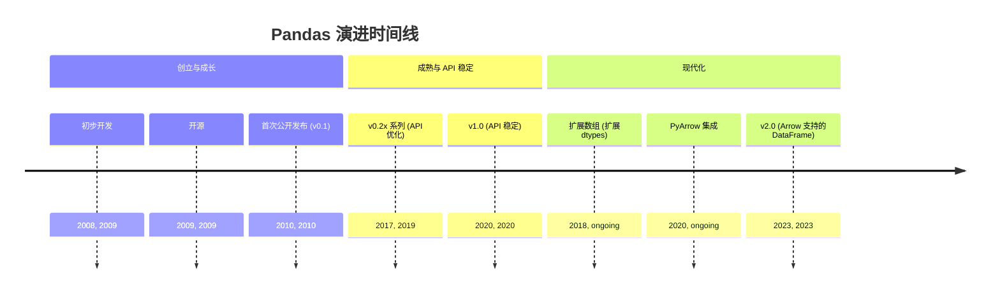
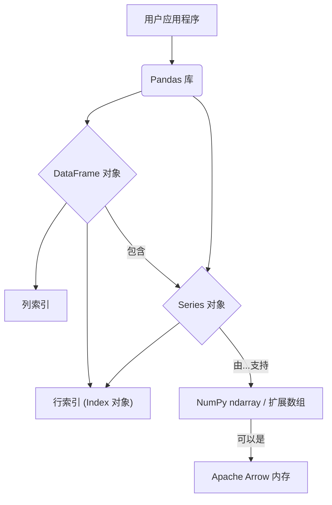
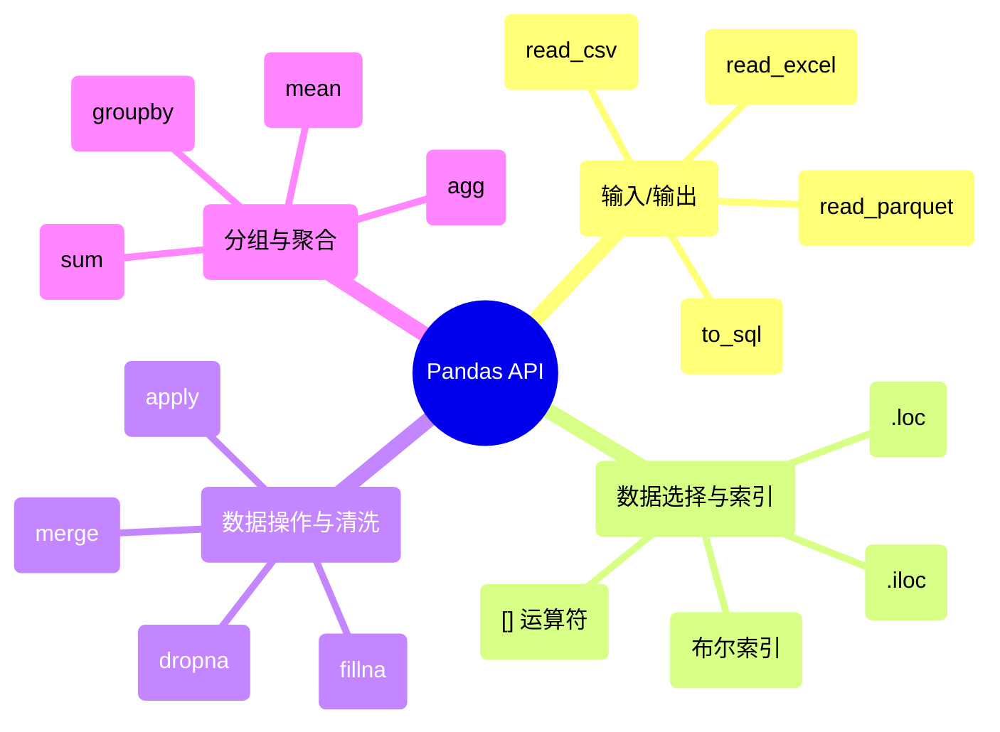

## Pandas 演进文档

### 1. 引言与历史背景

Pandas 是 Python 中数据操作和分析的基础库。它提供高性能、易于使用的数据结构和数据分析工具，使其成为数据科学和机器学习生态系统中不可或缺的一部分。它的名字来源于“面板数据”(panel data)，这是一个计量经济学术语，指代多维结构化数据集。

Pandas 由 Wes McKinney 于 2008 年在 AQR 资本管理公司工作时创建。他需要一个能够高性能、灵活地处理复杂金融数据的工具。由于发现 Python 中现有的工具不足以满足需求，他开始构建 pandas 来解决这些问题。它于 2009 年开源，并从此发展成为一个庞大的、由社区驱动的项目。

该库的主要贡献是 **DataFrame**，这是一种二维标记数据结构，其列可以具有不同的数据类型，类似于电子表格或 SQL 表。它为读取和写入数据、清洗、转换、合并和重塑数据集提供了强大的工具。

### 1.1. Pandas 演进时间线

### 2. 核心架构

Pandas 构建于 NumPy 之上，利用其 `ndarray` 实现快速、内存高效的数据存储。然而，pandas 引入了自己的高级数据结构 `Series` 和 `DataFrame`，它们提供了带标签的轴 (索引和列) 以及大量用于数据操作的专门函数。

#### 2.1. `Series` 和 `DataFrame` 对象

*   **`Series`:** 一种能够容纳任何数据类型的一维标记数组。它本质上是 `DataFrame` 的单列。这些标签统称为**索引**。
*   **`DataFrame`:** 一种二维标记数据结构，其列可以具有不同的数据类型。它可以被看作是 `Series` 对象的字典，其中键是列名，值是 `Series` 本身。它同时具有行索引和列索引。

#### 2.2. Index 对象

`Index` 是 pandas 的核心数据结构，用于保存 `Series` 和 `DataFrame` 对象的轴标签。它是不可变的，并提供优化的查找和集合逻辑，从而在操作过程中实现数据的高效对齐。

#### 2.3. 内存管理和数据类型

在内部，`DataFrame` 是 `Series` 的集合，每个 `Series` 都由一个 NumPy 数组支持。这种“列主序”或“基于块”的架构允许高效的存储和计算，因为可以按列对操作进行向量化。该领域的一个重要演进是引入了**扩展数组 (Extension Arrays)**，它允许使用 NumPy 之外的自定义数据类型 (例如，分类、可空整数和时区感知的日期时间)。最近，与 **Apache Arrow** 的集成为内存中的列式格式提供了更高的效率，特别是在处理字符串数据和与其他系统互操作时。

**Mermaid 图：Pandas 核心架构**

### 3. 详细 API 概述

Pandas 的 API 非常广泛，涵盖了从数据提取到清洗、转换和可视化的整个数据分析工作流程。API 在 `0.x` 版本中经历了显著的增长和优化，最终在 2020 年发布了 **pandas 1.0**，这标志着对 API 稳定性的坚定承诺。

最近的一个主要演进是 2023 年发布的 **pandas 2.0**，它正式支持 **Apache Arrow** 作为内存后端。这带来了显著的性能提升 (尤其是在字符串处理和 I/O 方面)，并改善了与其他数据分析库的互操作性。

#### 3.1. 输入/输出

Pandas 提供了一套丰富的 I/O 工具，用于读取和写入各种格式的数据。

*   **`pd.read_csv(filepath_or_buffer, ...)`**
    *   **背景:** 读取分隔符数据 (如 CSV 和 TSV 文件) 到 `DataFrame` 的主力函数。
    *   **参数:**
        *   `filepath_or_buffer`: 文件路径或类文件对象。
        *   `sep`: 使用的分隔符。
        *   `header`: 用作列名的行号。
    *   **返回:** 一个 `DataFrame`。

*   **`pd.read_excel(io, ...)`**
    *   **背景:** 从 Excel 文件中读取数据到 `DataFrame`。
    *   **参数:**
        *   `io`: Excel 文件的路径。
        *   `sheet_name`: 要读取的特定工作表。
    *   **返回:** 一个 `DataFrame`。

*   **`DataFrame.to_sql(name, con, ...)`**
    *   **背景:** 将存储在 `DataFrame` 中的记录写入 SQL 数据库。
    *   **参数:**
        *   `name`: SQL 表的名称。
        *   `con`: 数据库连接对象。

*   **`pd.read_parquet(path, ...)`**
    *   **背景:** 从 Parquet 文件中读取数据。Parquet 是一种高效的列式存储格式。
    *   **参数:**
        *   `path`: Parquet 文件的路径。
    *   **返回:** 一个 `DataFrame`。

#### 3.2. 数据选择和索引

Pandas 提供了强大而灵活的方式来选择数据的子集。

*   **`[]` 运算符:**
    *   **背景:** 基本选择。对于 `DataFrame`，`df['col']` 选择一列作为 `Series`，而 `df[['col1', 'col2']]` 选择多列作为 `DataFrame`。
*   **`.loc[]` 访问器:**
    *   **背景:** 基于标签的索引。根据索引和列标签选择数据。
    *   **用法:** `df.loc['row_label', 'col_label']`
*   **`.iloc[]` 访问器:**
    *   **背景:** 基于整数位置的索引。根据其整数位置选择数据。
    *   **用法:** `df.iloc[0, 1]`
*   **布尔索引:**
    *   **背景:** 根据布尔条件选择行。
    *   **用法:** `df[df['age'] > 30]`

#### 3.3. 数据操作和清洗

这是 pandas 真正大放异彩的地方，它提供了大量用于清洗和转换数据的函数。

*   **`DataFrame.dropna(axis=0, ...)`**
    *   **背景:** 移除缺失值 (NaN)。
    *   **参数:**
        *   `axis`: `0` 表示删除包含缺失值的行，`1` 表示删除列。
    *   **返回:** 一个移除了缺失值的 `DataFrame`。

*   **`DataFrame.fillna(value, ...)`**
    *   **背景:** 用指定的值或方法填充缺失值。
    *   **参数:**
        *   `value`: 用于填充缺失数据的值。
    *   **返回:** 一个填充了缺失值的 `DataFrame`。

*   **`DataFrame.merge(right, on=None, ...)`**
    *   **背景:** 使用数据库风格的连接合并两个 `DataFrame` 对象。
    *   **参数:**
        *   `right`: 要合并的另一个 `DataFrame`。
        *   `on`: 用于连接的列。
    *   **返回:** 一个合并后的 `DataFrame`。

*   **`Series.apply(func)`**
    *   **背景:** 将一个函数逐元素应用于 `Series`。
    *   **参数:**
        *   `func`: 要应用的函数。
    *   **返回:** 一个应用了函数的新 `Series`。

#### 3.4. 分组和聚合

Pandas 提供了强大的“group by”机制，用于分割数据、应用函数和合并结果。

*   **`DataFrame.groupby(by, ...)`**
    *   **背景:** 使用一列或多列对 `DataFrame` 进行分组。这将返回一个 `DataFrameGroupBy` 对象。
    *   **参数:**
        *   `by`: 用于分组的列。
    *   **返回:** 一个 `DataFrameGroupBy` 对象。

*   **聚合 (`.sum()`, `.mean()`, `.agg()`)**
    *   **背景:** 分组后，您可以应用聚合函数来计算每个组的摘要统计信息。
    *   **用法:** `df.groupby('category').agg({'price': 'mean', 'quantity': 'sum'})`

### 3.5. API 思维导图

### 4. 演变与影响

*   **性能:** Pandas 通过更好的算法、与 NumPy 更紧密的集成以及采用新技术 (如用于 JIT 编译用户定义函数的 Numba，以及最近用于其内存后端的 Apache Arrow) 不断提高其性能。
*   **数据科学标准:** Pandas 与 NumPy 和 Matplotlib 一起构成了 Python 数据科学的“标准技术栈”。它是数据整理和探索的主要工具，其 `DataFrame` 是许多其他库 (包括 Scikit-learn 和 Seaborn) 的标准输入。
*   **可扩展性:** 扩展数组接口的引入是一个重要步骤，它使 pandas 能够更高效、更清晰地处理更多样的数据类型。这为更好地支持可空整数、分类数据以及与 GeoPandas 等库集成以处理地理空间数据铺平了道路。
*   **互操作性:** 在 pandas 2.0 中转向使用 Apache Arrow 作为后端，是朝着在更广泛的数据科学生态系统中实现更好互操作性的重要一步，它使得与 Spark、Dask 和各种数据库技术等系统之间的数据交换无需昂贵的序列化/反序列化步骤。

### 5. 结论

Pandas 将 Python 中的数据分析从一个小众功能转变为一种主流实践。其直观的 `DataFrame` 和 `Series` 对象，结合丰富而富有表现力的 API，为现实世界的数据整理提供了强大而灵活的工具包。该库的演变反映了对性能、可用性和互操作性的坚定承诺，确保 pandas 仍然是任何在 Python 中处理数据的人的必备工具。
