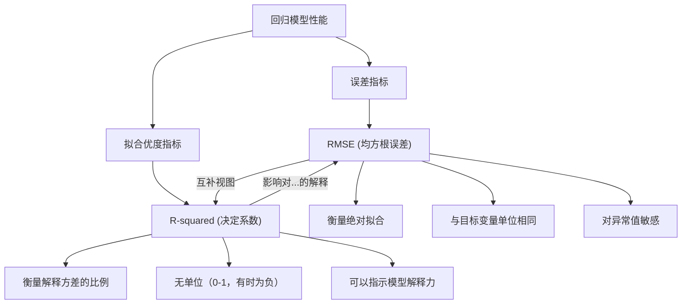
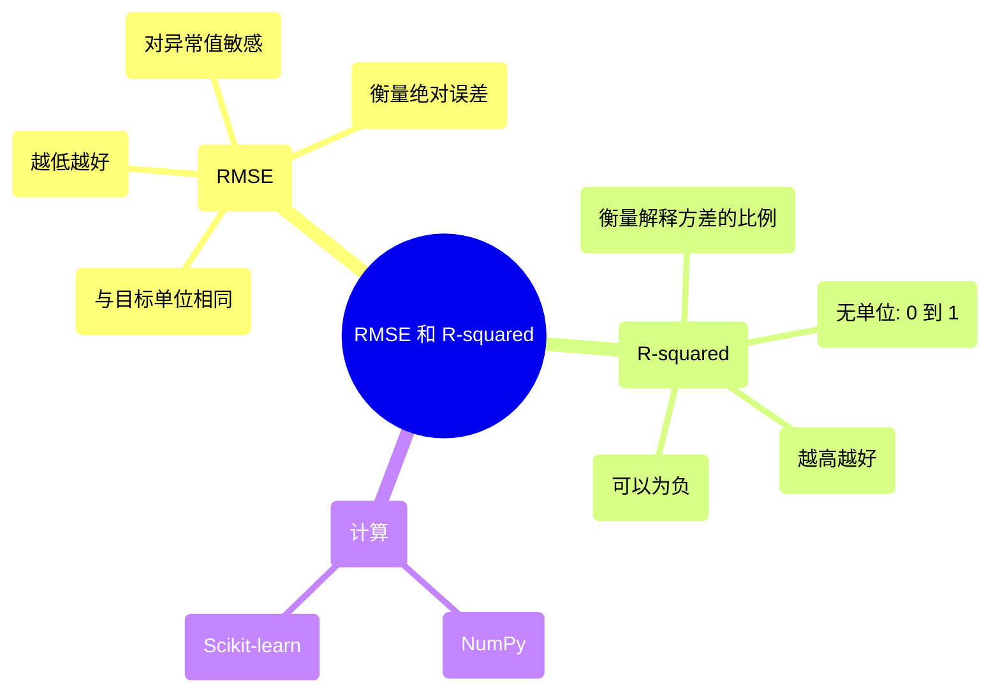

## RMSE 和 R-squared 演进文档

### 1. 引言和历史背景

均方根误差 (RMSE) 和 R-squared (决定系数) 是评估回归模型性能最广泛和最基础的两个指标。在统计学、机器学习和数据科学领域，理解模型预测连续结果的好坏至关重要，这些指标为模型的准确性和解释力提供了关键见解。

历史上，RMSE 和 R-squared 都起源于经典的统计分析，特别是在线性回归的背景下。随着统计建模的复杂性和应用不断增长，这些指标成为评估模型拟合的标准工具。随着20世纪末和21世纪初机器学习的兴起，它们的重要性只增不减，成为比较不同算法、调整超参数和向利益相关者传达模型有效性的必备工具。它们分别提供了衡量预测准确性和解释方差比例的定量方法，形成了跨学科模型评估的通用语言。

### 2. 核心概念

评估回归模型的核心在于量化预测值和实际值之间的差异。RMSE 和 R-squared 从互补的角度提供了对这种差异的见解。

#### 2.1. 均方根误差 (RMSE)

**心智模型 / 类比：**
想象你正在用飞镖射击靶心。每次投掷飞镖都是一个预测，靶心是实际值。RMSE 就像计算你的飞镖距离靶心的平均距离。它对较大的失误惩罚更重，因为误差在平均之前被平方。较小的 RMSE 意味着你的飞镖平均而言更接近靶心。

RMSE 是衡量模型或估计器预测值与观测值之间差异的常用指标。它是残差（预测误差）的标准差。残差是衡量数据点与回归线距离的指标；RMSE 是衡量这些残差分布的程度。换句话说，它告诉你数据在最佳拟合线周围的集中程度。

RMSE 的公式是：

$RMSE = \sqrt{\frac{1}{n} \sum_{i=1}^{n} (y_i - \hat{y}_i)^2}$

其中：
*   $y_i$ 是第 i 个观测值的实际值。
*   $\hat{y}_i$ 是第 i 个观测值的预测值。
*   $n$ 是观测值的总数。

**解释：**
*   **RMSE 越低越好：** RMSE 为 0 表示完美拟合，所有预测都与实际值完全匹配。
*   **单位：** RMSE 的单位与因变量（目标变量）相同，使其易于在实际情境中解释。例如，如果你预测房屋价格以美元计，RMSE 为 $10,000 意味着你的预测平均偏差 $10,000。
*   **对异常值的敏感性：** 由于误差被平方，RMSE 对大误差的惩罚比平均绝对误差 (MAE) 更重，使其对异常值敏感。

#### 2.2. R-squared (决定系数)

**心智模型 / 类比：**
R-squared 告诉你，与仅仅猜测平均值相比，你的模型（投掷飞镖）解释了你的目标（靶心）多少变异。如果 R-squared 是 0.80，这意味着靶心不总是在同一位置的 80% 的原因可以通过你的投掷飞镖来解释。如果它非常低，你的投掷飞镖解释的很少，几乎就像你只是随机地围绕平均位置投掷。

R-squared，或决定系数，是一个统计量，表示回归模型中因变量的方差有多少比例可以由一个或多个自变量解释。它表明数据点与曲线或线的拟合程度。

R-squared 的公式是：

$R^2 = 1 - \frac{\sum_{i=1}^{n} (y_i - \hat{y}_i)^2}{\sum_{i=1}^{n} (y_i - \bar{y})^2}$

其中：
*   $y_i$ 是第 i 个观测值的实际值。
*   $\hat{y}_i$ 是第 i 个观测值的预测值。
*   $\bar{y}$ 是实际值的平均值。
*   $n$ 是观测值的总数。

**解释：**
*   **范围：** R-squared 通常在 0 到 1 之间，其中：
    *   **1：** 表示模型解释了响应数据围绕其均值的所有变异性。
    *   **0：** 表示模型没有解释响应数据围绕其均值的任何变异性（它与简单地预测均值一样好）。
*   **负 R-squared：** 虽然通常在 0 到 1 之间，但如果模型比简单地预测因变量的均值更差，R-squared 可以是负数。这通常表明模型非常差或应用不正确。
*   **解释的方差比例：** R-squared 为 0.75 意味着因变量中 75% 的方差可以从自变量中预测。

**Mermaid 图：RMSE 和 R-squared 之间的关系（概念）**



### 3. 详细 API 概述（概念）

虽然 RMSE 和 R-squared 是统计概念，但它们的计算通常使用数值库（如 NumPy）和统计/机器学习库（如 Python 中的 scikit-learn）来实现。这些库提供了高效和标准化的方法来计算这些指标。

#### 3.1. RMSE 计算

**目标：** 计算实际值和预测值之间的均方根误差 (RMSE)。

**代码：**
```python
import numpy as np
from sklearn.metrics import mean_squared_error

# 实际值
y_true = np.array([3, -0.5, 2, 7])
# 预测值
y_pred = np.array([2.5, 0.0, 2, 8])

# 使用 NumPy 手动计算
rmse_manual = np.sqrt(np.mean((y_true - y_pred)**2))
print(f"RMSE (使用 NumPy 手动计算): {rmse_manual:.4f}")

# 使用 scikit-learn 的 mean_squared_error 并设置 squared=False
rmse_sklearn = mean_squared_error(y_true, y_pred, squared=False)
print(f"RMSE (scikit-learn): {rmse_sklearn:.4f}")
```

**预期输出：**
```
RMSE (使用 NumPy 手动计算): 0.6124
RMSE (scikit-learn): 0.6124
```

**解释：**
此代码演示了两种计算 RMSE 的方法。手动方法使用基本的 NumPy 操作来实现 RMSE 公式：计算平方差、求平均值，然后取平方根。`scikit-learn` 方法利用 `mean_squared_error` 并设置 `squared=False` 参数直接返回 RMSE，这在机器学习环境中通常更受青睐，因为它更简洁和健壮。

*   **上下文：** 计算均方根误差，衡量误差平均大小的指标。
*   **参数：**
    *   `y_true`：类数组，真实目标值。
    *   `y_pred`：类数组，估计目标值。
    *   `squared`：（对于 scikit-learn）如果为 `True` 则返回 MSE，如果为 `False` 则返回 RMSE。
*   **返回：** 一个浮点数，表示 RMSE 值。

#### 3.2. R-squared 计算

**目标：** 计算 R-squared (决定系数) 分数。

**代码：**
```python
import numpy as np
from sklearn.metrics import r2_score

# 实际值
y_true = np.array([3, -0.5, 2, 7])
# 预测值
y_pred = np.array([2.5, 0.0, 2, 8])

# 使用 NumPy 手动计算
ss_res = np.sum((y_true - y_pred)**2) # 残差平方和
ss_tot = np.sum((y_true - np.mean(y_true))**2) # 总平方和
r2_manual = 1 - (ss_res / ss_tot)
print(f"R-squared (使用 NumPy 手动计算): {r2_manual:.4f}")

# 使用 scikit-learn 的 r2_score
r2_sklearn = r2_score(y_true, y_pred)
print(f"R-squared (scikit-learn): {r2_sklearn:.4f}")

# 糟糕模型的示例 (R-squared 可以为负数)
y_pred_bad = np.array([5, 5, 5, 5]) # 一个常数预测，比均值更差
r2_bad = r2_score(y_true, y_pred_bad)
print(f"R-squared (糟糕模型示例): {r2_bad:.4f}")
```

**预期输出：**
```
R-squared (使用 NumPy 手动计算): 0.9486
R-squared (scikit-learn): 0.9486
R-squared (糟糕模型示例): -0.0769
```

**解释：**
与 RMSE 类似，R-squared 可以根据其公式使用 NumPy 手动计算，该公式涉及残差平方和和总平方和。然而，`scikit-learn` 中的 `r2_score` 函数提供了一种直接而健壮的方法来计算 R-squared，处理边缘情况并确保一致性。该示例还说明，对于性能比因变量平均值的简单水平线更差的模型，R-squared 可以为负。

*   **上下文：** 计算 R-squared (决定系数) 分数，表示因变量中可由自变量预测的方差比例。
*   **参数：**
    *   `y_true`：类数组，真实目标值。
    *   `y_pred`：类数组，估计目标值。
*   **返回：** 一个浮点数，表示 R-squared 值。

#### 3.3. 快速参考：计算函数

| 函数/方法 | 描述 | 何时使用 |
| :--- | :--- | :--- |
| `np.sqrt(np.mean((y_true - y_pred)**2))` | 手动 RMSE 计算 | 用于基本理解或当 `scikit-learn` 不可用时。 |
| `sklearn.metrics.mean_squared_error(..., squared=False)` | `scikit-learn` RMSE 计算 | 在机器学习环境中，首选用于健壮性和便捷性。 |
| `1 - (np.sum((y_true - y_pred)**2) / np.sum((y_true - np.mean(y_true))**2))` | 手动 R-squared 计算 | 用于基本理解或当 `scikit-learn` 不可用时。 |
| `sklearn.metrics.r2_score(y_true, y_pred)` | `scikit-learn` R-squared 计算 | 在机器学习环境中，首选用于健壮性和便捷性。 |

### 3.4. API 思维导图



### 4. 演进和影响

RMSE 和 R-squared 的演进和广泛采用反映了它们在评估和比较回归模型方面的持久效用。

*   **从理论到实践：** 这些指标起源于理论统计学，已转化为实用工具，成为计量经济学、工程学和预测分析等不同领域从业者不可或缺的工具。它们直观的解释（尤其是在目标变量单位中的 RMSE）使其易于非专业人士理解。
*   **基准测试和模型选择：** 在机器学习时代，RMSE 和 R-squared 是模型比较的关键基准。研究人员和开发人员 routinely 使用它们来评估新算法，比较不同模型（例如，线性回归与随机森林）的性能，并为给定任务选择性能最佳的模型。
*   **超参数调整：** 在超参数调整过程中，这些指标指导优化算法。例如，回归模型的网格搜索或贝叶斯优化中的常见目标是最小化验证数据上的 RMSE 或最大化 R-squared。
*   **局限性和上下文：** 随着时间的推移，对这些指标的理解也演变为包括它们的局限性。例如，R-squared 在某些情况下可能具有误导性（例如，在具有许多预测变量的模型中，通常首选调整后的 R-squared）。这两个指标都对异常值敏感，这促使在处理嘈杂数据时使用替代的鲁棒指标，如平均绝对误差 (MAE)。对这些细微差别的认识导致了这些指标更复杂的应用，通常与其他评估技术和可视化结合使用。
*   **跨库标准化：** 这些指标在 scikit-learn 等库中的一致实现确保了模型评估的标准化和可重复性，促进了科学计算社区内的协作和知识共享。

### 5. 结论

RMSE 和 R-squared 仍然是回归模型评估的基石指标。RMSE 提供了一个清晰、可解释的预测误差典型大小度量，以与目标变量相同的单位表示，使其对于理解绝对模型准确性具有不可估量的价值。另一方面，R-squared 量化了因变量中可由模型解释的方差比例，提供了对其解释力的深入了解。

总之，这些指标提供了回归模型性能的全面视图，指导模型选择、优化和解释。虽然它们的基本定义保持不变，但它们的应用程序和对其细微差别的理解随着统计建模和机器学习的发展而演变，巩固了它们作为全球数据科学家和分析师基本工具的作用。