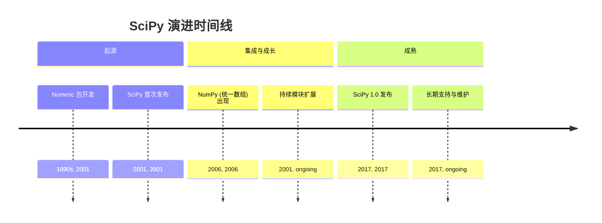
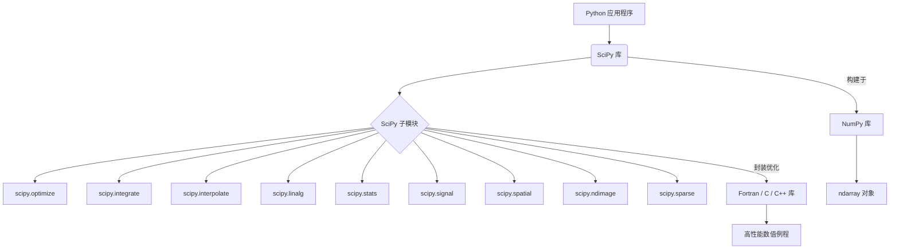
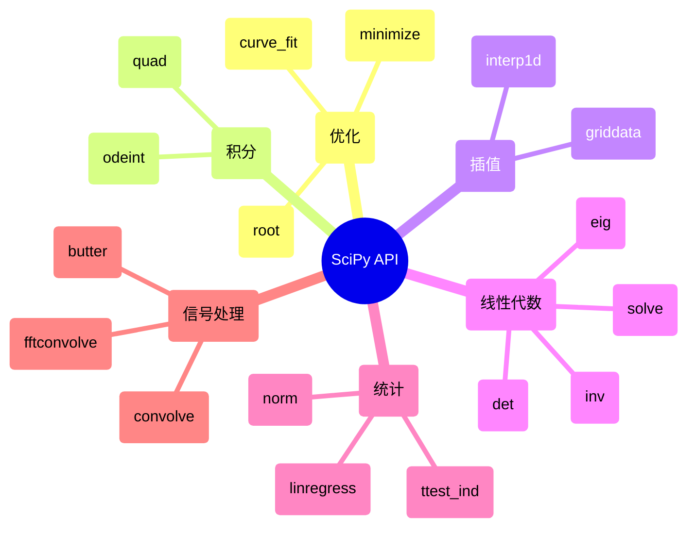

## SciPy 演进文档

### 1. 引言与历史背景

SciPy 是一个开源 Python 库，它建立在 NumPy 之上，为科学和技术计算提供了大量的算法和函数集合。它为优化、线性代数、积分、插值、信号处理、图像处理和统计等任务提供了专门的工具，使其成为各个科学领域的研究人员、工程师和数据科学家不可或缺的库。

SciPy 的起源可以追溯到 20 世纪 90 年代后期，当时开发了 `Numeric`，一种用于 Python 数值计算的数组类型。2001 年，Travis Oliphant、Eric Jones 和 Pearu Peterson 合并了他们现有的代码，创建了 SciPy，旨在为 Python 中的科学计算提供一个更全面、更集成的环境。这项工作是更广泛地增强 Python 在科学领域能力运动的一部分，该运动也见证了 IPython 和 Matplotlib 等其他基础库的出现。

底层的数组包 `Numeric` 最终在 2006 年被 NumPy 取代，NumPy 是由 Travis Oliphant 领导的一个项目，它统一了 `Numeric` 和 `Numarray`。SciPy 继续发展，在 2017 年底发布了重要的 1.0 版本，距离其首次发布大约 16 年，这标志着它作为科学 Python 生态系统关键组件的成熟和稳定。

### 1.1. SciPy 演进时间线

### 2. 核心架构

SciPy 的核心架构设计为一系列专门的子模块，这些子模块扩展了 NumPy 的功能。每个子模块都专注于科学计算的一个不同领域，为其大量的函数和算法提供了模块化和有组织的结构。

#### 2.1. 子模块组织

SciPy 分为各种子包，每个子包都致力于一个特定领域：

*   **`scipy.optimize`**: 优化算法，包括最小化、曲线拟合和求根。
*   **`scipy.integrate`**: 数值积分（求积）和常微分方程的例程。
*   **`scipy.interpolate`**: 插值工具，包括各种插值方法。
*   **`scipy.linalg`**: 高级线性代数例程，建立在 `numpy.linalg` 之上，但提供更专业的函数。
*   **`scipy.stats`**: 统计函数、分布和统计检验。
*   **`scipy.signal`**: 信号处理工具，包括滤波、卷积和频谱分析。
*   **`scipy.spatial`**: 空间数据结构和算法，例如 k-d 树和 Delaunay 三角剖分。
*   **`scipy.ndimage`**: N 维图像处理。
*   **`scipy.sparse`**: 稀疏矩阵存储和稀疏线性代数。

#### 2.2. 利用编译代码

为了实现高性能，SciPy 封装了用 Fortran、C 和 C++ 等低级语言编写的高度优化实现。这允许用户利用 Python 的灵活性和易用性进行高级编程，同时受益于编译代码在计算密集型任务中的速度和效率。这种混合方法是 SciPy 有效处理复杂科学计算能力的基础。

#### 2.3. NumPy 基础

SciPy 深度依赖于 NumPy。SciPy 函数与用户代码之间交换的所有数据通常都采用 NumPy 数组的形式。这种紧密集成确保了数据处理的一致性，并允许 SciPy 无缝地操作 NumPy 提供的 `ndarray` 对象。

**Mermaid 图：SciPy 核心架构**

### 3. 详细 API 概述

SciPy 的 API 非常广泛，每个子模块都提供了一组专门的函数。

#### 3.1. 优化 (`scipy.optimize`)

*   **`scipy.optimize.minimize(fun, x0, ...)`**: 最小化一个或多个变量的标量函数。
*   **`scipy.optimize.curve_fit(f, xdata, ydata, ...)`**: 使用非线性最小二乘法将函数 `f` 拟合到数据。
*   **`scipy.optimize.root(fun, x0, ...)`**: 查找函数的根。

#### 3.2. 积分 (`scipy.integrate`)

*   **`scipy.integrate.quad(func, a, b)`**: 计算定积分。
*   **`scipy.integrate.odeint(func, y0, t, ...)`**: 积分常微分方程组。

#### 3.3. 插值 (`scipy.interpolate`)

*   **`scipy.interpolate.interp1d(x, y, ...)`**: 插值一维函数。
*   **`scipy.interpolate.griddata(points, values, xi, ...)`**: 插值非结构化 D 维数据。

#### 3.4. 线性代数 (`scipy.linalg`)

*   **`scipy.linalg.det(a)`**: 计算矩阵的行列式。
*   **`scipy.linalg.inv(a)`**: 计算矩阵的逆。
*   **`scipy.linalg.eig(a)`**: 计算方阵的特征值和右特征向量。
*   **`scipy.linalg.solve(a, b)`**: 求解线性方程 `Ax = b`。

#### 3.5. 统计 (`scipy.stats`)

*   **`scipy.stats.norm`**: 正态连续随机变量。
*   **`scipy.stats.ttest_ind(a, b)`**: 计算两个独立样本分数的均值的 T 检验。
*   **`scipy.stats.linregress(x, y)`**: 计算两组测量的线性最小二乘回归。

#### 3.6. 信号处理 (`scipy.signal`)

*   **`scipy.signal.convolve(in1, in2)`**: 卷积两个 N 维数组。
*   **`scipy.signal.fftconvolve(in1, in2)`**: 使用 FFT 卷积两个 N 维数组。
*   **`scipy.signal.butter(N, Wn, ...)`**: 巴特沃斯数字和模拟滤波器设计。

### 3.7. API 思维导图

### 4. 演变与影响

*   **科学 Python 的基础:** SciPy 与 NumPy 一起构成了科学 Python 生态系统的基石，支持各种领域所需的复杂数值和科学计算。
*   **全面的工具集:** 它提供了大量组织良好的算法集合，使研究人员和开发人员无需从头开始实现这些复杂的例程。
*   **通过编译代码实现性能:** 通过封装高度优化的 Fortran、C 和 C++ 库，SciPy 为计算密集型任务提供了高性能，使 Python 成为科学计算的可行语言。
*   **互操作性:** 它与 NumPy 的紧密集成确保了数据处理的一致性以及与科学 Python 技术栈中其他库的兼容性。
*   **社区驱动的开发:** SciPy 拥有一个强大而活跃的开源社区，不断为其开发、维护和文档做出贡献，确保其持续的相关性和质量。

### 5. 结论

SciPy 已发展成为 Python 中科学和技术计算不可或缺的库。通过使用丰富的专业算法和函数扩展 NumPy 的功能，它使用户能够高效且有效地执行复杂的数学运算。其模块化架构、对优化编译代码的依赖以及强大的社区支持巩固了其作为科学 Python 生态系统关键组件的地位，推动了各种科学和工程领域的创新。
