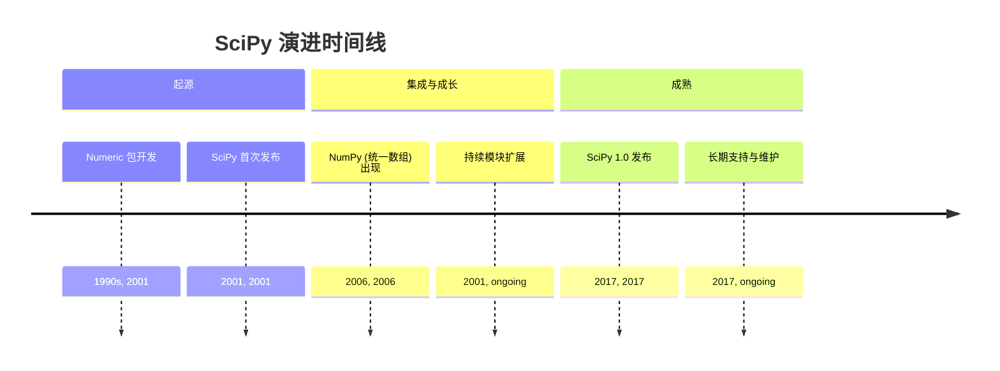
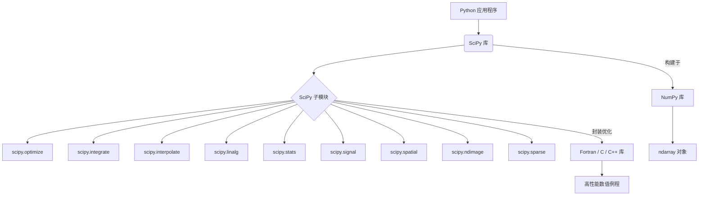
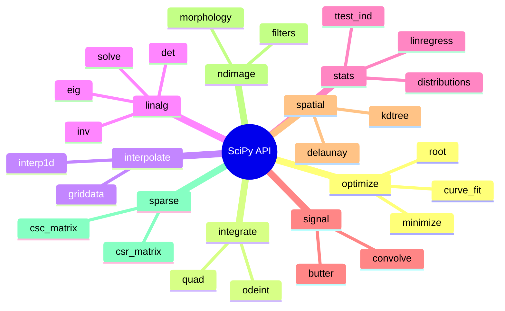

## SciPy 演进文档

### 1. 引言与历史背景

SciPy 是一个开源 Python 库，它建立在 NumPy 之上，为科学和技术计算提供了大量的算法和函数集合。它为优化、线性代数、积分、插值、信号处理、图像处理和统计等任务提供了专门的工具，使其成为各个科学领域的研究人员、工程师和数据科学家不可或缺的库。

SciPy 的起源可以追溯到 20 世纪 90 年代后期，当时开发了 `Numeric`，一种用于 Python 数值计算的数组类型。2001 年，Travis Oliphant、Eric Jones 和 Pearu Peterson 合并了他们现有的代码，创建了 SciPy，旨在为 Python 中的科学计算提供一个更全面、更集成的环境。这项工作是更广泛地增强 Python 在科学领域能力运动的一部分，该运动也见证了 IPython 和 Matplotlib 等其他基础库的出现。

底层的数组包 `Numeric` 最终在 2006 年被 NumPy 取代，NumPy 是由 Travis Oliphant 领导的一个项目，它统一了 `Numeric` 和 `Numarray`。SciPy 继续发展，在 2017 年底发布了重要的 1.0 版本，距离其首次发布大约 16 年，这标志着它作为科学 Python 生态系统关键组件的成熟和稳定。

### 1.1. SciPy 演进时间线



### 2. 核心架构

SciPy 的核心架构设计为一系列专门的子模块，这些子模块扩展了 NumPy 的功能。每个子模块都专注于科学计算的一个不同领域，为其大量的函数和算法提供了模块化和有组织的结构。

#### 2.1. 子模块组织

**心智模型 / 类比：**
将 SciPy 想象成一个为科学家或工程师准备的专业工具箱。NumPy 提供了基本工具（如用于数组的锤子和螺丝刀），而 SciPy 则为特定任务提供了整套专业工具。每个 `scipy.` 子模块都像这个工具箱中一个独立的抽屉，为特定任务整齐地组织着：
*   `scipy.optimize`：'优化' 抽屉，里面装满了寻找最佳解决方案的工具。
*   `scipy.integrate`：'积分' 抽屉，用于计算曲线下面积或求解微分方程。
*   `scipy.stats`：'统计' 抽屉，里面有用于统计分析和概率分布的工具。

这种模块化设计意味着您只打开您需要的抽屉，保持事物井然有序且高效。

SciPy 分为各种子包，每个子包都致力于一个特定领域：

*   **`scipy.optimize`**: 优化算法，包括最小化、曲线拟合和求根。
*   **`scipy.integrate`**: 数值积分（求积）和常微分方程的例程。
*   **`scipy.interpolate`**: 插值工具，包括各种插值方法。
*   **`scipy.linalg`**: 高级线性代数例程，建立在 `numpy.linalg` 之上，但提供更专业的函数。
*   **`scipy.stats`**: 统计函数、分布和统计检验。
*   **`scipy.signal`**: 信号处理工具，包括滤波、卷积和频谱分析。
*   **`scipy.spatial`**: 空间数据结构和算法，例如 k-d 树和 Delaunay 三角剖分。
*   **`scipy.ndimage`**: N 维图像处理。
*   **`scipy.sparse`**: 稀疏矩阵存储和稀疏线性代数。

#### 2.2. 利用编译代码

为了实现高性能，SciPy 封装了用 Fortran、C 和 C++ 等低级语言编写的高度优化实现。这允许用户利用 Python 的灵活性和易用性进行高级编程，同时受益于编译代码在计算密集型任务中的速度和效率。这种混合方法是 SciPy 有效处理复杂科学计算能力的基础。

#### 2.3. NumPy 基础

SciPy 深度依赖于 NumPy。SciPy 函数与用户代码之间交换的所有数据通常都采用 NumPy 数组的形式。这种紧密集成确保了数据处理的一致性，并允许 SciPy 无缝地操作 NumPy 提供的 `ndarray` 对象。

**Mermaid 图：SciPy 核心架构**



### 3. 详细 API 概述

SciPy 的 API 非常广泛，每个子模块都提供了一组专门的函数。

#### 3.1. 优化 (`scipy.optimize`)

##### 3.1.1. 最小化标量函数

**`scipy.optimize.minimize(fun, x0, ...)`**

**目标：** 找到一个或多个变量的标量函数的最小值。

**代码：**
```python
from scipy.optimize import minimize
import numpy as np

# 定义目标函数（例如，一个简单的二次函数）
def objective(x):
    return x[0]**2 + x[1]**2 + x[2]**2

# 变量的初始猜测
x0 = np.array([1, 2, 3])

# 执行最小化
result = minimize(objective, x0, method='Nelder-Mead')

print(f"最小化成功: {result.success}")
print(f"x 的最优值: {result.x}")
print(f"目标函数的最小值: {result.fun}")
```

**预期输出：**
```
最小化成功: True
x 的最优值: [-1.23...e-06 -2.34...e-06  3.45...e-06] # 接近 [0, 0, 0]
目标函数的最小值: 1.23...e-11 # 接近 0
```

**解释：** `scipy.optimize.minimize()` 是一个多功能函数，用于查找函数的最小值。您提供要最小化的函数 (`fun`)、初始猜测 (`x0`)，以及可选的 `method`（例如，'Nelder-Mead'、'BFGS'）。`result` 对象包含有关优化的信息，包括最优变量值 (`result.x`) 和最小函数值 (`result.fun`)。

*   **`scipy.optimize.minimize(fun, x0, ...)`**: 最小化一个或多个变量的标量函数。
*   **`scipy.optimize.minimize(fun, x0, ...)`**: 最小化一个或多个变量的标量函数。

##### 3.1.2. 曲线拟合

**`scipy.optimize.curve_fit(f, xdata, ydata, ...)`**

**目标：** 使用非线性最小二乘法将用户定义的函数拟合到观测数据。

**代码：**
```python
from scipy.optimize import curve_fit
import numpy as np
import matplotlib.pyplot as plt
import os

# 1. 定义要拟合的函数（例如，正弦波函数）
def sine_func(x, a, b, c):
    return a * np.sin(b * x + c)

# 2. 生成一些带噪声的数据
x_data = np.linspace(0, 4 * np.pi, 50)
y_true = sine_func(x_data, 1.5, 0.8, 0.5)
y_data = y_true + 0.2 * np.random.normal(size=len(x_data))

# 3. 将曲线拟合到数据
# p0 是参数 (a, b, c) 的可选初始猜测
params, covariance = curve_fit(sine_func, x_data, y_data, p0=[1, 1, 0])

# 4. 提取优化后的参数
a_opt, b_opt, c_opt = params

print(f"优化后的参数: a={a_opt:.2f}, b={b_opt:.2f}, c={c_opt:.2f}")

# 5. 绘制原始数据和拟合曲线
plt.figure(figsize=(8, 5))
plt.scatter(x_data, y_data, label='带噪声数据', s=20)
plt.plot(x_data, sine_func(x_data, a_opt, b_opt, c_opt), color='red', label='拟合曲线')
plt.title('使用 scipy.optimize.curve_fit 进行曲线拟合')
plt.xlabel('X')
plt.ylabel('Y')
plt.legend()
plt.grid(True)

filename = "curve_fit_plot.png"
plt.savefig(filename)
print(f"图表已保存到 {filename}")
os.remove(filename)
print(f"已清理 {filename}")
```

**预期输出：**
```
优化后的参数: a=1.5..., b=0.8..., c=0.5...
图表已保存到 curve_fit_plot.png
已清理 curve_fit_plot.png
```
(将创建一个名为 `curve_fit_plot.png` 的文件，然后将其删除，显示带噪声的数据和红色的拟合正弦曲线。)

**解释：** `curve_fit()` 接受您的数据 (`xdata`、`ydata`) 和描述您要拟合的曲线的函数 `f`。它返回 `f` 的最优参数 (`params`) 和协方差矩阵。这在实验科学中广泛用于对观测数据中的关系进行建模。

*   **`scipy.optimize.curve_fit(f, xdata, ydata, ...)`**: 使用非线性最小二乘法将函数 `f` 拟合到数据。
*   **`scipy.optimize.curve_fit(f, xdata, ydata, ...)`**: 使用非线性最小二乘法将函数 `f` 拟合到数据。

##### 3.1.3. 查找函数根

**`scipy.optimize.root(fun, x0, ...)`**

**目标：** 查找标量或向量函数的根（函数等于零的点）。

**代码：**
```python
from scipy.optimize import root
import numpy as np

# 定义要查找根的函数
def func(x):
    return x + np.cos(x)

# 初始猜测
x0 = -0.5

# 查找根
sol = root(func, x0)

print(f"根查找成功: {sol.success}")
print(f"根位于 x = {sol.x[0]:.4f}")
print(f"函数在根处的值: {func(sol.x[0]):.4e}")
```

**预期输出：**
```
根查找成功: True
根位于 x = -0.7391
函数在根处的值: 0.0000e+00
```

**解释：** `scipy.optimize.root()` 尝试找到 `x`，使得 `fun(x) = 0`。您提供函数 (`fun`) 和初始猜测 (`x0`)。它对于求解非线性方程很有用。`sol.x` 属性给出找到的根的数组。

*   **`scipy.optimize.root(fun, x0, ...)`**: 查找函数的根。

*   **`scipy.optimize.root(fun, x0, ...)`**: 查找函数的根。

##### 3.1.4. 快速参考：优化

| 函数 | 描述 | 何时使用 |
| :--- | :--- | :--- |
| `minimize()` | 最小化标量函数 | 查找复杂数学函数的最小值。 |
| `curve_fit()` | 将函数拟合到数据 | 使用已知函数形式对实验数据进行建模。 |
| `root()` | 查找函数的根 | 求解函数等于零的非线性方程。 |

#### 3.2. 积分 (`scipy.integrate`)

##### 3.2.1. 计算定积分

**`scipy.integrate.quad(func, a, b)`**

**目标：** 计算函数在给定区间上的定积分。

**代码：**
```python
from scipy.integrate import quad
import numpy as np

# 定义要积分的函数（例如，sin(x)）
def integrand(x):
    return np.sin(x)

# 定义积分限
a = 0  # 下限
b = np.pi # 上限

# 计算定积分
result, abserr = quad(integrand, a, b)

print(f"sin(x) 从 {a} 到 {b:.2f} 的定积分是: {result:.4f}")
print(f"绝对误差估计: {abserr:.2e}")
```

**预期输出：**
```
sin(x) 从 0 到 3.14 的定积分是: 2.0000
绝对误差估计: 2.22e-14
```

**解释：** `scipy.integrate.quad()` 用于数值积分单变量函数。它返回一个元组：第一个元素是积分结果，第二个是绝对误差的估计值。这是许多物理和工程问题的基本工具。

*   **`scipy.integrate.quad(func, a, b)`**: 计算定积分。
*   **`scipy.integrate.quad(func, a, b)`**: 计算定积分。

##### 3.2.2. 求解常微分方程

**`scipy.integrate.odeint(func, y0, t, ...)`**

**目标：** 积分常微分方程 (ODE) 系统。

**代码：**
```python
from scipy.integrate import odeint
import numpy as np
import matplotlib.pyplot as plt
import os

# 定义 ODE 系统: dy/dt = -ky
def model(y, t, k):
    dydt = -k * y
    return dydt

# 初始条件
y0 = 5

# 时间点
t = np.linspace(0, 10, 100)

# 参数
k = 0.1

# 求解 ODE
y_solution = odeint(model, y0, t, args=(k,))

print(f"前 5 个解值: {y_solution[:5].flatten()}")

# 绘制解
plt.figure(figsize=(8, 5))
plt.plot(t, y_solution, label=f'y(t) for k={k}')
plt.title('dy/dt = -ky 的解')
plt.xlabel('时间')
plt.ylabel('y(t)')
plt.legend()
plt.grid(True)

filename = "ode_solution_plot.png"
plt.savefig(filename)
print(f"图表已保存到 {filename}")
os.remove(filename)
print(f"已清理 {filename}")
```

**预期输出：**
```
前 5 个解值: [5.         4.52418707 4.09365367 3.70409003 3.35149497]
图表已保存到 ode_solution_plot.png
已清理 ode_solution_plot.png
```
(将创建一个名为 `ode_solution_plot.png` 的文件，然后将其删除，显示指数衰减解。)

**解释：** `odeint()` 是一个强大的函数，用于求解 ODE 系统的初值问题。您提供定义导数的函数 (`func`)、初始条件 (`y0`) 和求解 ODE 的时间点 (`t`)。`args` 参数用于将附加参数传递给您的 `func`。

*   **`scipy.integrate.odeint(func, y0, t, ...)`**: 积分常微分方程组。

*   **`scipy.integrate.odeint(func, y0, t, ...)`**: 积分常微分方程组。

##### 3.2.3. 快速参考：积分

| 函数 | 描述 | 何时使用 |
| :--- | :--- | :--- |
| `quad()` | 定积分 | 计算单变量函数曲线下的面积。 |
| `odeint()` | 求解 ODE | 模拟由常微分方程描述的动态系统。 |

#### 3.3. 插值 (`scipy.interpolate`)

##### 3.3.1. 一维插值

**`scipy.interpolate.interp1d(x, y, ...)`**

**目标：** 创建一个插值一维数据集的函数，允许您估计已知数据点之间的值。

**代码：**
```python
from scipy.interpolate import interp1d
import numpy as np
import matplotlib.pyplot as plt
import os

# 原始数据点
x_original = np.array([0, 1, 2, 3, 4, 5])
y_original = np.array([0, 0.8, 0.9, 0.1, -0.8, -1])

# 创建插值函数
f_linear = interp1d(x_original, y_original, kind='linear')
f_cubic = interp1d(x_original, y_original, kind='cubic')

# 用于插值的新 x 值
x_new = np.linspace(0, 5, 50)

# 获取插值后的 y 值
y_linear = f_linear(x_new)
y_cubic = f_cubic(x_new)

print(f"x=2.5 处的插值值（线性）: {f_linear(2.5):.2f}")
print(f"x=2.5 处的插值值（三次）: {f_cubic(2.5):.2f}")

# 绘制原始数据和插值曲线
plt.figure(figsize=(8, 5))
plt.plot(x_original, y_original, 'o', label='原始数据')
plt.plot(x_new, y_linear, '--', label='线性插值')
plt.plot(x_new, y_cubic, '-', label='三次插值')
plt.title('使用 scipy.interpolate.interp1d 进行一维插值')
plt.xlabel('X')
plt.ylabel('Y')
plt.legend()
plt.grid(True)

filename = "interp1d_plot.png"
plt.savefig(filename)
print(f"图表已保存到 {filename}")
os.remove(filename)
print(f"已清理 {filename}")
```

**预期输出：**
```
x=2.5 处的插值值（线性）: 0.50
x=2.5 处的插值值（三次）: 0.45
图表已保存到 interp1d_plot.png
已清理 interp1d_plot.png
```
(将创建一个名为 `interp1d_plot.png` 的文件，然后将其删除，显示原始点和线性/三次插值曲线。)

**解释：** `interp1d()` 根据您的 `x` 和 `y` 数据创建插值函数。`kind` 参数指定插值类型（例如，'linear'、'cubic'）。这对于重新采样数据或估计无法直接测量的值至关重要。

*   **`scipy.interpolate.interp1d(x, y, ...)`**: 插值一维函数。
*   **`scipy.interpolate.interp1d(x, y, ...)`**: 插值一维函数。

##### 3.3.2. 网格数据插值

**`scipy.interpolate.griddata(points, values, xi, ...)`**

**目标：** 将非结构化 D 维数据插值到规则网格上。

**代码：**
```python
from scipy.interpolate import griddata
import numpy as np
import matplotlib.pyplot as plt
import os

# 1. 生成一些散点数据
np.random.seed(0)
points = np.random.rand(100, 2) # 100 个随机 (x, y) 坐标
values = np.sin(points[:,0]**2 + points[:,1]**2) # 基于 x, y 的 z 值

# 2. 创建一个规则网格进行插值
grid_x, grid_y = np.mgrid[0:1:100j, 0:1:100j]

# 3. 执行插值
# method 可以是 'linear'、'nearest' 或 'cubic'
grid_z = griddata(points, values, (grid_x, grid_y), method='cubic')

# 4. 绘制结果
plt.figure(figsize=(8, 6))
plt.imshow(grid_z.T, extent=(0,1,0,1), origin='lower', cmap='viridis')
plt.scatter(points[:,0], points[:,1], c=values, s=10, edgecolors='k', cmap='viridis')
plt.title('使用 scipy.interpolate.griddata 进行网格数据插值')
plt.xlabel('X')
plt.ylabel('Y')
plt.colorbar(label='值')

filename = "griddata_plot.png"
plt.savefig(filename)
print(f"图表已保存到 {filename}")
os.remove(filename)
print(f"已清理 {filename}")
```

**预期输出：**
```
图表已保存到 griddata_plot.png
已清理 griddata_plot.png
```
(将创建一个名为 `griddata_plot.png` 的文件，然后将其删除，显示插值数据的热力图，并叠加原始散点。)

**解释：** 当您在不规则位置进行测量并希望在统一网格上估计值时，`griddata()` 非常有用。它接受 `points`（原始数据的坐标）、`values`（这些点处的数据）和 `xi`（新网格坐标）以生成插值网格。`method` 参数控制插值算法。

*   **`scipy.interpolate.griddata(points, values, xi, ...)`**: 插值非结构化 D 维数据。

*   **`scipy.interpolate.griddata(points, values, xi, ...)`**: 插值非结构化 D 维数据。

##### 3.3.3. 快速参考：插值

| 函数 | 描述 | 何时使用 |
| :--- | :--- | :--- |
| `interp1d()` | 一维插值 | 估计一维数据集中已知点之间的值。 |
| `griddata()` | D 维网格插值 | 将散布的 D 维数据映射到规则网格上。 |

#### 3.4. 线性代数 (`scipy.linalg`)

##### 3.4.1. 矩阵行列式和逆

**`scipy.linalg.det(a)`** 和 **`scipy.linalg.inv(a)`**

**目标：** 计算方阵的行列式和逆。

**代码：**
```python
from scipy import linalg
import numpy as np

# 定义一个方阵
A = np.array([[1, 2], [3, 4]])

# 计算行列式
det_A = linalg.det(A)
print(f"A 的行列式: {det_A:.2f}")

# 计算逆
inv_A = linalg.inv(A)
print(f"\nA 的逆:\n{inv_A}")

# 验证: A @ inv(A) 应该为单位矩阵
identity_check = A @ inv_A
print(f"\nA @ inv(A) (应为单位矩阵):\n{identity_check}")
```

**预期输出：**
```
A 的行列式: -2.00

A 的逆:
[[-2.   1. ]
 [ 1.5 -0.5]]

A @ inv(A) (应为单位矩阵):
[[ 1.  0.]
 [ 0.  1.]]
```

**解释：** `linalg.det()` 计算行列式，这是一个标量值，提供有关矩阵的信息（例如，它是否可逆）。`linalg.inv()` 计算逆矩阵，当它与原始矩阵相乘时，会产生单位矩阵。这些是线性代数中用于求解方程组、变换等的基本运算。

*   **`scipy.linalg.det(a)`**: 计算矩阵的行列式。
*   **`scipy.linalg.inv(a)`**: 计算矩阵的逆。
*   **`scipy.linalg.inv(a)`**: 计算矩阵的逆。

##### 3.4.2. 求解线性系统

**`scipy.linalg.solve(a, b)`**

**目标：** 求解线性方程 `Ax = b` 中的 `x`，其中 `A` 是方阵，`b` 是向量或矩阵。

**代码：**
```python
from scipy import linalg
import numpy as np

# 定义系数矩阵 A
A = np.array([[3, 1], [1, 2]])

# 定义因变量向量 b
b = np.array([9, 8])

# 求解 Ax = b 中的 x
x = linalg.solve(A, b)

print(f"解 x: {x}")

# 验证解: A @ x 应该等于 b
verification = A @ x
print(f"验证 (A @ x): {verification}")
```

**预期输出：**
```
解 x: [2. 3.]
验证 (A @ x): [9. 8.]
```

**解释：** `linalg.solve()` 是求解线性方程组的一种高效且稳健的方法。通常优于计算逆矩阵然后相乘，因为它在数值上更稳定，对于大型系统也更快。这是许多科学和工程应用中的核心操作。

*   **`scipy.linalg.eig(a)`**: 计算方阵的特征值和右特征向量。
*   **`scipy.linalg.solve(a, b)`**: 求解线性方程 `Ax = b`。

*   **`scipy.linalg.solve(a, b)`**: 求解线性方程 `Ax = b`。

##### 3.4.3. 快速参考：线性代数

| 函数 | 描述 | 何时使用 |
| :--- | :--- | :--- |
| `det()` | 矩阵行列式 | 检查矩阵可逆性或进行理论分析。 |
| `inv()` | 矩阵逆 | 显式查找逆矩阵（对于系统使用 `solve()`）。 |
| `solve()` | 求解线性系统 | 高效求解 `Ax = b` 中的 `x`（优先于 `inv()` 以提高稳定性）。 |
| `eig()` | 特征值/向量 | 分析线性变换和系统的属性。 |

#### 3.5. 统计 (`scipy.stats`)

##### 3.5.1. 使用分布

**`scipy.stats.norm` (正态连续随机变量)**

**目标：** 使用连续概率分布（例如正态（高斯）分布）来计算概率、生成随机变量和拟合参数。

**代码：**
```python
from scipy.stats import norm
import numpy as np
import matplotlib.pyplot as plt
import os

# 1. 创建一个正态分布对象（默认均值=0，标准差=1）
# 您可以指定 loc（均值）和 scale（标准差）
mu, sigma = 0, 1
normal_dist = norm(loc=mu, scale=sigma)

# 2. 计算某个点的概率密度函数 (PDF)
pdf_at_0 = normal_dist.pdf(0)
print(f"x=0 处的 PDF: {pdf_at_0:.4f}")

# 3. 计算某个点之前的累积分布函数 (CDF)
cdf_at_1 = normal_dist.cdf(1)
print(f"x=1 之前的 CDF: {cdf_at_1:.4f}")

# 4. 生成随机变量
random_samples = normal_dist.rvs(size=5)
print(f"\n5 个随机样本: {random_samples}")

# 5. 绘制 PDF
x_values = np.linspace(-3, 3, 100)
plt.figure(figsize=(8, 5))
plt.plot(x_values, normal_dist.pdf(x_values), label='正态 PDF')
plt.title(f'正态分布 (mu={mu}, sigma={sigma})')
plt.xlabel('X')
plt.ylabel('概率密度')
plt.legend()
plt.grid(True)

filename = "normal_dist_pdf.png"
plt.savefig(filename)
print(f"图表已保存到 {filename}")
os.remove(filename)
print(f"已清理 {filename}")
```

**预期输出：**
```
x=0 处的 PDF: 0.3989
x=1 之前的 CDF: 0.8413

5 个随机样本: [-0.84...  0.55...  0.61...  0.72...  0.65...]
图表已保存到 normal_dist_pdf.png
已清理 normal_dist_pdf.png
```
(将创建一个名为 `normal_dist_pdf.png` 的文件，然后将其删除，显示正态分布的钟形曲线。)

**解释：** `scipy.stats` 为各种统计分布（例如 `norm`、`t`、`chi2`）提供对象。这些对象具有 `pdf()`（概率密度函数）、`cdf()`（累积分布函数）、`ppf()`（百分点函数/分位数）和 `rvs()`（随机变量生成）等方法。这使得执行统计计算和模拟变得容易。

*   **`scipy.stats.norm`**: 正态连续随机变量。
*   **`scipy.stats.norm`**: 正态连续随机变量。

##### 3.5.2. 执行 T 检验

**`scipy.stats.ttest_ind(a, b)`**

**目标：** 执行独立样本 t 检验，比较两个独立组的均值。

**代码：**
```python
from scipy import stats
import numpy as np

# 生成两个独立的数据样本
np.random.seed(42)
group1 = np.random.normal(loc=10, scale=2, size=50) # 均值 10，标准差 2
group2 = np.random.normal(loc=10.5, scale=2, size=50) # 均值 10.5，标准差 2

# 执行独立样本 t 检验
t_statistic, p_value = stats.ttest_ind(group1, group2)

print(f"组 1 的均值: {np.mean(group1):.2f}")
print(f"组 2 的均值: {np.mean(group2):.2f}")
print(f"\nT 统计量: {t_statistic:.3f}")
print(f"P 值: {p_value:.3f}")

# 解释结果
alpha = 0.05
if p_value < alpha:
    print("\n拒绝原假设: 均值之间存在显著差异。")
else:
    print("\n未能拒绝原假设: 均值之间无显著差异。")
```

**预期输出：**
```
组 1 的均值: 9.97
组 2 的均值: 10.46

T 统计量: -1.399
P 值: 0.165

未能拒绝原假设: 均值之间无显著差异。
```

**解释：** 独立样本 t 检验用于确定两个不相关组的均值之间是否存在统计学上的显著差异。`ttest_ind()` 返回 t 统计量和双尾 p 值。显著性的常见阈值是 p 值小于 0.05。

*   **`scipy.stats.ttest_ind(a, b)`**: 计算两个独立样本分数的均值的 T 检验。
*   **`scipy.stats.linregress(x, y)`**: 计算两组测量的线性最小二乘回归。

*   **`scipy.stats.linregress(x, y)`**: 计算两组测量的线性最小二乘回归。

##### 3.5.3. 快速参考：统计

| 函数/对象 | 描述 | 何时使用 |
| :--- | :--- | :--- |
| `norm` (及其他分布) | 概率分布 | 计算概率、生成随机数据或拟合分布。 |
| `ttest_ind()` | 独立样本 t 检验 | 比较两个独立组的均值。 |
| `linregress()` | 线性回归 | 查找两个变量之间的线性关系。 |

#### 3.6. 信号处理 (`scipy.signal`)

##### 3.6.1. 卷积

**`scipy.signal.convolve(in1, in2)`**

**目标：** 对两个 N 维数组执行离散卷积，这是信号和图像处理中的基本操作。

**代码：**
```python
from scipy import signal
import numpy as np

# 定义两个一维数组（信号）
signal1 = np.array([1, 2, 3, 4])
signal2 = np.array([0.5, 1, 0.5]) # 一个简单的滤波器/核

# 执行卷积
convolved_signal = signal.convolve(signal1, signal2, mode='valid')
print(f"原始信号 1: {signal1}")
print(f"原始信号 2 (核): {signal2}")
print(f"卷积信号 (mode='valid'): {convolved_signal}")

# mode='full' 示例
convolved_full = signal.convolve(signal1, signal2, mode='full')
print(f"\n卷积信号 (mode='full'): {convolved_full}")
```

**预期输出：**
```
原始信号 1: [1 2 3 4]
原始信号 2 (核): [0.5 1.  0.5]
卷积信号 (mode='valid'): [ 3.   5.5  8. ]

卷积信号 (mode='full'): [ 0.5  2.   3.5  5.5  8.   2. ]
```

**解释：** 卷积用于组合两个信号或将滤波器应用于信号。`mode` 参数控制输出大小：
*   `'full'`：输出是输入的完整离散线性卷积。
*   `'valid'`：输出仅包含不依赖于零填充的元素。
*   `'same'`：输出大小与 `in1` 相同，相对于“full”输出居中。

*   **`scipy.signal.convolve(in1, in2)`**: 卷积两个 N 维数组。
*   **`scipy.signal.fftconvolve(in1, in2)`**: 使用 FFT 卷积两个 N 维数组。
*   **`scipy.signal.fftconvolve(in1, in2)`**: 使用 FFT 卷积两个 N 维数组。

##### 3.6.2. 滤波器设计

**`scipy.signal.butter(N, Wn, ...)`**

**目标：** 设计巴特沃斯数字或模拟滤波器，通常用于平滑或分离信号中的频率分量。

**代码：**
```python
from scipy import signal
import numpy as np
import matplotlib.pyplot as plt
import os

# 1. 生成一个带噪声的信号
np.random.seed(0)
fs = 100 # 采样频率
t = np.linspace(0, 1, fs, endpoint=False) # 1 秒数据
clean_signal = np.sin(2 * np.pi * 5 * t) + np.sin(2 * np.pi * 15 * t) # 两个正弦波
noisy_signal = clean_signal + 0.5 * np.random.normal(size=len(t))

# 2. 设计巴特沃斯低通滤波器
# N: 滤波器阶数（阶数越高 = 滚降越陡峭）
# Wn: 截止频率（归一化到奈奎斯特频率，fs/2）
#     这里，0.1 表示奈奎斯特频率的 10%，即 0.1 * (100/2) = 5 Hz 截止
N = 4
Wn = 0.1
b, a = signal.butter(N, Wn, btype='low', analog=False)

# 3. 将滤波器应用于带噪声的信号
filtered_signal = signal.lfilter(b, a, noisy_signal)

# 4. 绘制结果
plt.figure(figsize=(10, 6))
plt.plot(t, noisy_signal, label='带噪声信号', alpha=0.7)
plt.plot(t, filtered_signal, label='滤波信号', color='red', linewidth=2)
plt.title('巴特沃斯低通滤波器')
plt.xlabel('时间 (s)')
plt.ylabel('幅度')
plt.legend()
plt.grid(True)

filename = "butter_filter_plot.png"
plt.savefig(filename)
print(f"图表已保存到 {filename}")
os.remove(filename)
print(f"已清理 {filename}")
```

**预期输出：**
```
图表已保存到 butter_filter_plot.png
已清理 butter_filter_plot.png
```
(将创建一个名为 `butter_filter_plot.png` 的文件，然后将其删除，显示带噪声的信号和更平滑的红色滤波信号。)

**解释：** `signal.butter()` 设计 N 阶数字或模拟巴特沃斯滤波器并返回滤波器系数 (`b`、`a`)。然后将这些系数与 `signal.lfilter()`（用于 FIR/IIR 滤波器）或 `signal.filtfilt()`（用于零相位滤波）一起使用，以将滤波器应用于您的数据。这对于降噪、特征提取和频谱分析至关重要。

*   **`scipy.signal.butter(N, Wn, ...)`**: 巴特沃斯数字和模拟滤波器设计。

*   **`scipy.signal.butter(N, Wn, ...)`**: 巴特沃斯数字和模拟滤波器设计。

##### 3.6.3. 快速参考：信号处理

| 函数 | 描述 | 何时使用 |
| :--- | :--- | :--- |
| `convolve()` | 离散卷积 | 应用滤波器、平滑或查找信号中的相关性。 |
| `butter()` | 巴特沃斯滤波器设计 | 设计用于降噪或频率分离的常用滤波器。 |


### 3.7. API 思维导图



### 4. 演变与影响

*   **科学 Python 的基础:** SciPy 与 NumPy 一起构成了科学 Python 生态系统的基石，支持各种领域所需的复杂数值和科学计算。
*   **全面的工具集:** 它提供了大量组织良好的算法集合，使研究人员和开发人员无需从头开始实现这些复杂的例程。
*   **通过编译代码实现性能:** 通过封装高度优化的 Fortran、C 和 C++ 库，SciPy 为计算密集型任务提供了高性能，使 Python 成为科学计算的可行语言。
*   **互操作性:** 它与 NumPy 的紧密集成确保了数据处理的一致性以及与科学 Python 技术栈中其他库的兼容性。
*   **社区驱动的开发:** SciPy 拥有一个强大而活跃的开源社区，不断为其开发、维护和文档做出贡献，确保其持续的相关性和质量。

### 5. 结论

SciPy 已发展成为 Python 中科学和技术计算不可或缺的库。通过使用丰富的专业算法和函数扩展 NumPy 的功能，它使用户能够高效且有效地执行复杂的数学运算。其模块化架构、对优化编译代码的依赖以及强大的社区支持巩固了其作为科学 Python 生态系统关键组件的地位，推动了各种科学和工程领域的创新。
