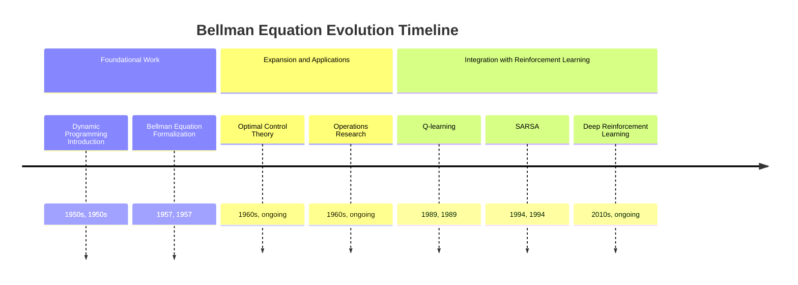
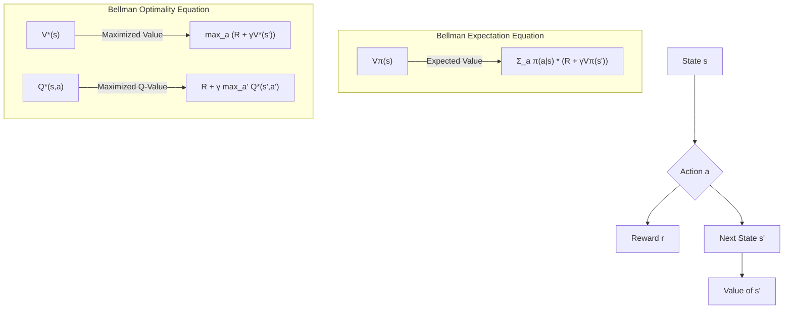

## Bellman Equation Evolution Document

### 1. Introduction and Historical Context

The Bellman equation, named after American mathematician Richard Bellman, is a fundamental concept in dynamic programming and optimal control theory. It describes how to find an optimal policy in a Markov Decision Process (MDP) by breaking down a complex problem into simpler subproblems. Essentially, it states that the value of a decision problem at a certain point in time can be expressed in terms of the value of the decisions made at subsequent points in time.

Richard Bellman developed the concept of dynamic programming in the 1950s, which provided a mathematical framework for solving multi-stage decision problems. The Bellman equation is the core of this framework, offering a recursive relationship that links the value of a state (or state-action pair) to the values of successor states. This recursive structure is crucial because it allows for the efficient computation of optimal policies, especially in problems with a finite number of states and actions.

Initially, the Bellman equation was applied in operations research, economics, and control engineering to problems where the system dynamics were fully known. With the advent of reinforcement learning in the late 20th century, the Bellman equation found new prominence as the theoretical foundation for algorithms that learn optimal policies in environments with unknown dynamics. Algorithms like Q-learning and SARSA are direct applications of the Bellman equation, enabling agents to learn optimal behaviors through trial and error.

### 1.1. Bellman Equation Evolution Timeline

### 2. Core Concepts and Architecture

The Bellman equation is built upon the concepts of states, actions, rewards, and value functions within an MDP framework.

#### 2.1. Value Functions

**Mental Model / Analogy:**
Imagine you're planning a road trip. For each city you could visit (state), you want to know how "valuable" that city is in terms of reaching your ultimate destination and enjoying the journey. The Bellman equation helps you calculate this value. It says: the value of being in your current city is the immediate enjoyment you get there, plus the discounted value of the *best* next city you could go to. You don't need to plan the entire trip from scratch every time; you just need to know the value of the next best step from where you are.

*   **State-Value Function (V(s)):** Represents the expected cumulative discounted reward an agent can obtain starting from state `s` and following a particular policy `π`.
*   **Action-Value Function (Q(s, a)):** Represents the expected cumulative discounted reward an agent can obtain starting from state `s`, taking action `a`, and then following a particular policy `π`.

#### 2.2. The Bellman Expectation Equation

This equation describes the value function for a *given* policy `π`. It averages over all possible actions prescribed by the policy and all possible next states.

$
V^\pi(s) = \sum_a \pi(a|s) \sum_{s'} P(s'|s, a) [R(s, a, s') + \gamma V^\pi(s')]
$

*   **`Vπ(s)`:** The value of state `s` under policy `π`.
*   **`π(a|s)`:** The probability of taking action `a` in state `s` under policy `π`.
*   **`P(s'|s, a)`:** The probability of transitioning to state `s'` from state `s` after taking action `a`.
*   **`R(s, a, s')`:** The immediate reward received for taking action `a` in state `s` and landing in `s'`.
*   **`γ`:** The discount factor.

This equation is used in **policy evaluation**, where we want to determine how good a given policy is.

#### 2.3. The Bellman Optimality Equation

This equation describes the value function for the *optimal* policy `π*`. Instead of averaging over actions, it takes the maximum over all possible actions, effectively choosing the best action at each step.

$
V^*(s) = \max_a \sum_{s'} P(s'|s, a) [R(s, a, s') + \gamma V^*(s')]
$

And for the optimal action-value function:

$
Q^*(s, a) = \sum_{s'} P(s'|s, a) [R(s, a, s') + \gamma \max_{a'} Q^*(s', a')]
$

*   **`V*(s)`:** The optimal value of state `s`.
*   **`Q*(s, a)`:** The optimal value of taking action `a` in state `s`.
*   **`max_a` / `max_{a'}`:** The operator that selects the action leading to the highest expected future reward.

These equations are used in **policy improvement** and **value iteration** to find the optimal policy.

**Mermaid Diagram: Bellman Equation Core Structure**

### 3. Solving with Bellman Equations

The Bellman equations are solved iteratively to find the optimal value functions and, consequently, the optimal policy.

#### 3.1. Value Iteration

**Goal:** Find the optimal value function `V*(s)` by repeatedly applying the Bellman optimality equation until convergence.

**Process:**
1.  Initialize `V(s)` arbitrarily for all `s` (e.g., to zeros).
2.  Repeatedly update `V(s)` using: $V_{k+1}(s) = \max_a \sum_{s'} P(s'|s, a) [R(s, a, s') + \gamma V_k(s')]$
3.  Continue until `V(s)` converges.

#### 3.2. Policy Iteration

**Goal:** Find the optimal policy `π*` by alternating between policy evaluation and policy improvement.

**Process:**
1.  **Policy Evaluation:** Given a policy `π`, compute `Vπ(s)` using the Bellman expectation equation (often by solving a system of linear equations or iterative updates).
2.  **Policy Improvement:** Update the policy `π` by choosing actions greedily with respect to `Vπ(s)`: $ 
\pi'(s) = \underset{a}{\operatorname{argmax}} \sum_{s'} P(s'|s, a) [R(s, a, s') + \gamma V^\pi(s')]
$.
3.  Repeat steps 1 and 2 until the policy no longer improves.

### 3.3. Quick Reference: Bellman Equation Applications (Conceptual)

| Method | Goal | Key Equation | Model Requirement |
| :--- | :--- | :--- | :--- |
| **Value Iteration** | Find `V*(s)` | Bellman Optimality | Known (P, R) |
| **Policy Iteration** | Find `π*` | Bellman Expectation & Optimality | Known (P, R) |
| **Q-learning** | Find `Q*(s, a)` | Bellman Optimality (TD update) | Model-Free |
| **SARSA** | Find `Qπ(s, a)` | Bellman Expectation (TD update) | Model-Free |

### 4. Evolution and Impact

The Bellman equation's influence has grown significantly since its inception, particularly with the rise of computational power and reinforcement learning:

*   **Foundation of Dynamic Programming:** It provided the mathematical basis for dynamic programming, enabling the solution of complex sequential decision problems that were previously intractable.
*   **Theoretical Basis for Reinforcement Learning:** The Bellman equation is the core theoretical underpinning of almost all modern reinforcement learning algorithms. Value iteration and policy iteration are direct applications when the environment model is known, while Q-learning and SARSA adapt it for model-free learning.
*   **Scalability with Function Approximation:** When combined with function approximators (like neural networks in deep reinforcement learning), the Bellman equation allows agents to learn optimal policies in environments with vast or continuous state and action spaces, far beyond what tabular methods could handle.
*   **Optimal Control and Economics:** Beyond AI, the Bellman equation remains a critical tool in optimal control theory, economics (e.g., intertemporal choice, asset pricing), and operations research for optimizing resource allocation and decision-making over time.

### 5. Conclusion

The Bellman equation is a cornerstone of modern decision theory, dynamic programming, and reinforcement learning. Its elegant recursive structure provides a powerful means to decompose complex sequential decision problems into manageable subproblems, leading to the discovery of optimal policies. From its origins in the 1950s to its central role in today's advanced AI systems, the Bellman equation continues to be an indispensable tool for understanding and solving problems of optimal decision-making under uncertainty. A deep understanding of this equation is essential for anyone pursuing studies or applications in reinforcement learning and artificial intelligence.
