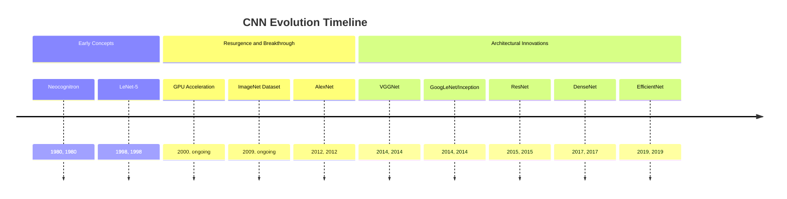
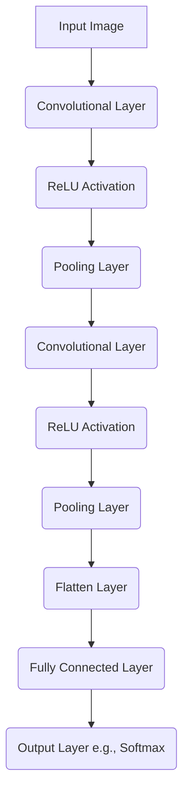
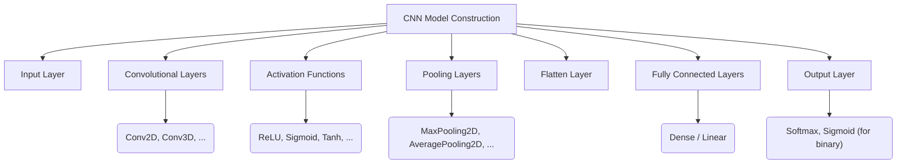
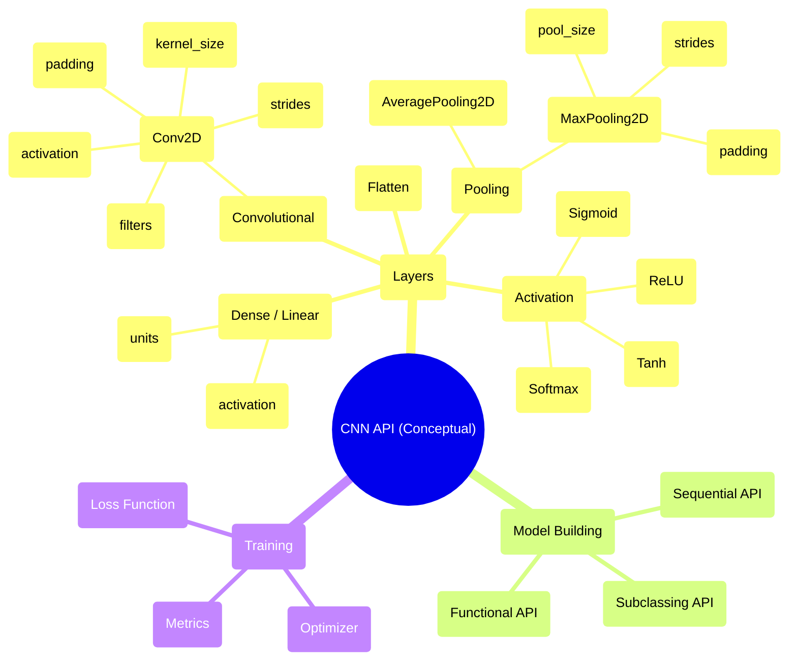

## CNN Evolution Document

### 1. Introduction and Historical Context

Convolutional Neural Networks (CNNs or ConvNets) are a class of deep neural networks, most commonly applied to analyzing visual imagery. They are inspired by the organization of the animal visual cortex, where individual cortical neurons respond to stimuli only in a restricted region of the visual field known as the receptive field. A collection of such fields overlap to cover the entire visual area.

The foundational ideas behind CNNs date back to the 1980s with the introduction of **Neocognitron** by Kunihiko Fukushima, which proposed a hierarchical, multi-layered neural network for visual pattern recognition. This model introduced concepts like convolutional layers and pooling layers. However, it was not until the late 1990s that **LeNet-5**, developed by Yann LeCun and his colleagues, demonstrated the practical applicability of CNNs for tasks like handwritten digit recognition. LeNet-5 successfully applied backpropagation to train a deep network with convolutional and pooling layers.

Despite early successes, CNNs remained relatively niche for many years due to computational limitations and the lack of large datasets. The resurgence began in the 2010s with the advent of powerful GPUs and massive datasets like ImageNet. The breakthrough moment came in 2012 when **AlexNet**, a deeper and wider CNN architecture, won the ImageNet Large Scale Visual Recognition Challenge (ILSVRC), significantly outperforming traditional computer vision methods. This event catalyzed the deep learning revolution and established CNNs as the dominant approach for image recognition and many other computer vision tasks.

### 1.1. CNN Evolution Timeline



### 2. Core Architecture

The core architecture of a CNN is built upon several key types of layers that work in conjunction to extract a hierarchy of features from input data. A typical CNN architecture consists of an input layer, a series of convolutional and pooling layers for feature extraction, and fully connected layers for classification or regression.

#### 2.1. Convolutional Layer

**Mental Model / Analogy:**
Imagine a flashlight (the filter/kernel) scanning over an image. At each spot, the flashlight illuminates a small area, and you calculate a "summary" of that area (the convolution operation). This summary becomes one pixel in a new, "feature map" image. Different flashlights (different filters) highlight different features, like edges, textures, or specific patterns.

The convolutional layer is the fundamental building block of a CNN. It performs a convolution operation, passing a filter (or kernel) over the input data.
*   **Filters/Kernels:** Small matrices of learnable weights that slide across the input. Each filter is designed to detect a specific feature (e.g., edges, textures, corners).
*   **Feature Maps:** The output of a convolutional layer, representing the detected features. Each filter produces one feature map.
*   **Parameter Sharing:** A key concept where the same filter is used across the entire input image. This drastically reduces the number of parameters compared to a fully connected network, making the model more efficient and less prone to overfitting.
*   **Stride:** The step size at which the filter moves across the input. A stride greater than 1 results in downsampling of the feature map.
*   **Padding:** Adding extra pixels (usually zeros) around the border of the input. This allows the filter to operate on the edges of the image and can be used to control the spatial size of the output feature map. Common types are 'valid' (no padding) and 'same' (padding is added to ensure the output has the same width and height as the input).

#### 2.2. Activation Function (ReLU)

After a convolutional operation, an activation function is applied element-wise to the feature map. The most common activation function in CNNs is the Rectified Linear Unit (ReLU).
*   **ReLU:** `f(x) = max(0, x)`. It introduces non-linearity into the model, allowing it to learn more complex patterns. It's computationally efficient and helps mitigate the vanishing gradient problem.

#### 2.3. Pooling Layer

**Mental Model / Analogy:**
After you've highlighted features with your "flashlights" (convolutional layers), a pooling layer is like summarizing those highlights. If you have a 2x2 grid of highlights, max pooling picks the brightest highlight in that grid, effectively keeping the most important information and reducing the image size.

Pooling layers are used to reduce the spatial dimensions (width and height) of the feature maps. This has two main benefits:
*   **Dimensionality Reduction:** It reduces the number of parameters and computational cost, making the network more efficient and helping to prevent overfitting.
*   **Translation Invariance:** It makes the learned features more robust to small translations and distortions in the input image.
*   **Max Pooling:** Selects the maximum value from a patch of the feature map. This is the most common type of pooling.
*   **Average Pooling:** Calculates the average value from a patch of the feature map.

#### 2.4. Fully Connected Layer

After several convolutional and pooling layers have extracted high-level features, these features are passed to fully connected (dense) layers for the final task.
*   **Flattening:** Before entering the fully connected layers, the 3D feature maps are "flattened" into a 1D vector. This transition is essential to connect the convolutional base to the dense classifier head.
*   **Classification/Regression:** Fully connected layers perform the final classification or regression based on the features learned by the preceding layers. The output layer often uses a softmax activation for multi-class classification tasks or a sigmoid for binary classification.

**Mermaid Diagram: CNN Core Architecture**



### 3. Detailed API Overview (Conceptual)

Unlike general-purpose libraries like NumPy, CNNs are typically implemented using deep learning frameworks such as TensorFlow, PyTorch, or Keras. The "API" here refers to the common components and patterns used to construct CNN models within these frameworks. The evolution has been towards more abstract and modular APIs, allowing researchers and practitioners to build complex architectures with less boilerplate code.

#### 3.1. Convolutional Layers

These are the core feature extractors. Frameworks provide highly optimized implementations.

##### 3.1.1. 2D Convolutional Layer (e.g., `tf.keras.layers.Conv2D`, `torch.nn.Conv2d`)

**Goal:** Apply 2D convolution over an input image.

**Code (Conceptual - Keras):**
```python
from tensorflow.keras import layers
from tensorflow.keras import models

# Example of adding a Conv2D layer
model = models.Sequential()
model.add(layers.Conv2D(32, (3, 3), activation='relu', input_shape=(28, 28, 1)))
model.add(layers.MaxPooling2D((2, 2)))
model.add(layers.Conv2D(64, (3, 3), activation='relu'))
model.add(layers.MaxPooling2D((2, 2)))
model.add(layers.Conv2D(64, (3, 3), activation='relu'))
model.add(layers.Flatten())
model.add(layers.Dense(64, activation='relu'))
model.add(layers.Dense(10, activation='softmax'))

model.summary()
```

**Explanation:**
*   `filters`: The number of output filters in the convolution. This determines the number of feature maps.
*   `kernel_size`: A tuple or integer specifying the height and width of the 2D convolution window.
*   `activation`: The activation function to use (e.g., 'relu', 'sigmoid', 'tanh').
*   `input_shape`: Required for the first layer, specifying the shape of the input data (height, width, channels).
*   `padding`: 'valid' (no padding) or 'same' (pads to ensure output size is same as input size).
*   `strides`: The step size of the convolution.

*   **Context:** The primary layer for learning spatial hierarchies of features from images.
*   **Parameters (Common):**
    *   `filters` (int): Dimensionality of the output space (i.e., the number of output filters in the convolution).
    *   `kernel_size` (int or tuple/list of 2 ints): The height and width of the 2D convolution window.
    *   `strides` (int or tuple/list of 2 ints): The strides of the convolution along the height and width.
    *   `padding` (string): One of "valid" or "same".
    *   `activation`: Activation function to use.
*   **Returns:** A tensor representing the convolved feature map.

##### 3.1.2. Quick Reference: Convolutional Layers

| Parameter | Description | Common Values |
| :--- | :--- | :--- |
| `filters` | Number of output feature maps | 32, 64, 128, 256 |
| `kernel_size` | Size of the convolution window | (3, 3), (5, 5) |
| `strides` | Step size of the convolution | (1, 1), (2, 2) |
| `padding` | Strategy for padding input | 'valid', 'same' |
| `activation` | Non-linear activation function | 'relu', 'sigmoid', 'tanh' |

#### 3.2. Pooling Layers

Used for downsampling feature maps.

##### 3.2.1. Max Pooling Layer (e.g., `tf.keras.layers.MaxPooling2D`, `torch.nn.MaxPool2d`)

**Goal:** Downsample the input along its spatial dimensions (height and width) by taking the maximum value over a window.

**Code (Conceptual - Keras):**
```python
from tensorflow.keras import layers
from tensorflow.keras import models

model = models.Sequential()
model.add(layers.Conv2D(32, (3, 3), activation='relu', input_shape=(28, 28, 1)))
model.add(layers.MaxPooling2D((2, 2))) # Max pooling layer
# ... rest of the model
```

**Explanation:**
*   `pool_size`: A tuple or integer specifying the size of the pooling window.
*   `strides`: The step size of the pooling operation. If `None`, it defaults to `pool_size`.

*   **Context:** Reduces the spatial dimensions of the feature maps, making the model more robust to small shifts and reducing computation.
*   **Parameters (Common):**
    *   `pool_size` (int or tuple/list of 2 ints): Factors by which to downscale (vertical, horizontal).
    *   `strides` (int or tuple/list of 2 ints): How far the pooling window moves for each step.
    *   `padding` (string): One of "valid" or "same".
*   **Returns:** A downsampled tensor.

##### 3.2.2. Quick Reference: Pooling Layers

| Parameter | Description | Common Values |
| :--- | :--- | :--- |
| `pool_size` | Size of the pooling window | (2, 2), (3, 3) |
| `strides` | Step size of the pooling | (2, 2) (often same as `pool_size`) |
| `padding` | Strategy for padding input | 'valid', 'same' |

#### 3.3. Fully Connected Layers

The final layers for classification or regression.

##### 3.3.1. Dense Layer (e.g., `tf.keras.layers.Dense`, `torch.nn.Linear`)

**Goal:** A regular densely-connected neural network layer.

**Code (Conceptual - Keras):**
```python
from tensorflow.keras import layers
from tensorflow.keras import models

model = models.Sequential()
# ... convolutional and pooling layers
model.add(layers.Flatten()) # Flatten before dense layers
model.add(layers.Dense(128, activation='relu'))
model.add(layers.Dense(10, activation='softmax')) # Output layer for 10 classes
```

**Explanation:**
*   `units`: Positive integer, dimensionality of the output space.
*   `activation`: Activation function to use.

*   **Context:** Performs the final classification or regression based on the high-level features extracted by the convolutional base.
*   **Parameters (Common):**
    *   `units` (int): Dimensionality of the output space.
    *   `activation`: Activation function to use.
*   **Returns:** A tensor representing the output of the layer.

##### 3.3.2. Quick Reference: Fully Connected Layers

| Parameter | Description | Common Values |
| :--- | :--- | :--- |
| `units` | Number of neurons in the layer | 64, 128, 256, 512 |
| `activation` | Non-linear activation function | 'relu', 'softmax', 'sigmoid' |

**Mermaid Diagram: Simplified CNN API Structure (Conceptual)**



### 3.4. API Mindmap



### 4. Architectural Trade-offs

CNNs have inherent properties that make them exceptionally well-suited for certain tasks but less so for others.

#### 4.1. Strengths

*   **Inductive Bias for Spatial Data:** CNNs have a strong **inductive bias** for grid-like data. The concepts of **spatial locality** (pixels closer together are more related) and **translation equivariance** (an object's identity doesn't change if it moves) are built into the architecture. This makes them highly parameter-efficient and quick to learn on visual data.
*   **Parameter Efficiency:** Through **parameter sharing**, a single filter is slid across the entire image, detecting a feature regardless of its location. This drastically reduces the number of learnable parameters compared to a fully connected network, mitigating overfitting and reducing computational requirements.
*   **Hierarchical Feature Learning:** The stacked nature of convolutional layers allows the network to learn a hierarchy of features, from simple edges and textures in the initial layers to complex patterns and object parts in deeper layers.

#### 4.2. Weaknesses

*   **Limited Global Context:** The local receptive field of a convolution kernel can make it difficult for the network to learn long-range dependencies or understand the global context of an image without very deep networks or large kernels.
*   **Inflexibility for Non-Grid Data:** CNNs are specifically designed for grid-like data structures (e.g., images, time-series). They are not easily applicable to irregular data formats like graphs or point clouds.
*   **Geometric Invariance:** While pooling provides some translation invariance, standard CNNs are not inherently robust to other geometric transformations like rotation or scaling.

### 5. Practical Applications & Use Cases

CNNs are the backbone of modern computer vision and have been successfully applied to a wide range of tasks.

*   **Image Classification:** The most common application, where a CNN assigns a label to an entire image (e.g., "cat," "dog," "car").
*   **Object Detection:** Identifying and localizing multiple objects within an image by drawing bounding boxes around them (e.g., YOLO, SSD, R-CNN).
*   **Semantic Segmentation:** Classifying each pixel in an image to create a pixel-level mask of the objects within it (e.g., U-Net, FCN).
*   **Image Generation:** Using architectures like Generative Adversarial Networks (GANs), where CNNs often form the generator and discriminator components.
*   **Medical Image Analysis:** Analyzing medical scans like X-rays, MRIs, and CT scans for tumor detection, disease classification, and segmentation.

#### 5.1. Example: Using a Pre-trained Model for Classification

A common and powerful technique is **transfer learning**, where a model pre-trained on a large dataset (like ImageNet) is used as a feature extractor for a new task.

**Code (Conceptual - PyTorch):**
```python
import torch
from torchvision import models, transforms
from PIL import Image

# Load a pre-trained ResNet-18 model
resnet = models.resnet18(weights=models.ResNet18_Weights.DEFAULT)
resnet.eval() # Set the model to evaluation mode

# Define the image transformation pipeline
preprocess = transforms.Compose([
    transforms.Resize(256),
    transforms.CenterCrop(224),
    transforms.ToTensor(),
    transforms.Normalize(mean=[0.485, 0.456, 0.406], std=[0.229, 0.224, 0.225]),
])

# Load and preprocess an example image (replace with your image path)
# img = Image.open("path/to/your/image.jpg")
# input_tensor = preprocess(img)
# input_batch = input_tensor.unsqueeze(0) # Create a mini-batch as expected by the model

# Make a prediction
# with torch.no_grad():
#     output = resnet(input_batch)

# The output has unnormalized scores. To get probabilities, you can apply softmax.
# probabilities = torch.nn.functional.softmax(output[0], dim=0)
```

### 6. Complete Code Examples (MNIST)

To make the architecture concrete, here are two complete, runnable examples of a simple CNN for classifying handwritten digits from the MNIST dataset, one using TensorFlow/Keras and the other using PyTorch.

#### 6.1. TensorFlow/Keras Implementation

This example uses the Keras Sequential API, which is a straightforward way to build a model layer-by-layer.

```python
import tensorflow as tf
from tensorflow.keras import layers, models

# 1. Load and preprocess the MNIST dataset
(x_train, y_train), (x_test, y_test) = tf.keras.datasets.mnist.load_data()

# Normalize pixel values to be between 0 and 1 and add a channel dimension
x_train = x_train.reshape((60000, 28, 28, 1)).astype('float32') / 255
x_test = x_test.reshape((10000, 28, 28, 1)).astype('float32') / 255

# 2. Define the CNN model architecture
model = models.Sequential([
    layers.Conv2D(32, (3, 3), activation='relu', input_shape=(28, 28, 1)),
    layers.MaxPooling2D((2, 2)),
    layers.Conv2D(64, (3, 3), activation='relu'),
    layers.MaxPooling2D((2, 2)),
    layers.Conv2D(64, (3, 3), activation='relu'),
    layers.Flatten(),
    layers.Dense(64, activation='relu'),
    layers.Dense(10, activation='softmax')
])

model.summary()

# 3. Compile the model
model.compile(optimizer='adam',
              loss='sparse_categorical_crossentropy',
              metrics=['accuracy'])

# 4. Train the model
history = model.fit(x_train, y_train, epochs=5, 
                    validation_data=(x_test, y_test))

# 5. Evaluate the model
test_loss, test_acc = model.evaluate(x_test, y_test, verbose=2)
print(f"\nTest accuracy: {test_acc:.4f}")
```

#### 6.2. PyTorch Implementation

This example defines the CNN as a custom `nn.Module` class, which is the standard and most flexible way to build models in PyTorch.

```python
import torch
import torch.nn as nn
import torch.optim as optim
from torchvision import datasets, transforms
from torch.utils.data import DataLoader

# 1. Define transformations and load the MNIST dataset
transform = transforms.Compose([
    transforms.ToTensor(),
    transforms.Normalize((0.1307,), (0.3081,)) # Mean and std dev of MNIST
])

train_dataset = datasets.MNIST(root='./data', train=True, download=True, transform=transform)
test_dataset = datasets.MNIST(root='./data', train=False, download=True, transform=transform)

train_loader = DataLoader(train_dataset, batch_size=64, shuffle=True)
test_loader = DataLoader(test_dataset, batch_size=1000, shuffle=False)

# 2. Define the CNN model architecture
class SimpleCNN(nn.Module):
    def __init__(self):
        super(SimpleCNN, self).__init__()
        self.conv1 = nn.Conv2d(1, 32, kernel_size=3, stride=1, padding=1)
        self.pool = nn.MaxPool2d(kernel_size=2, stride=2, padding=0)
        self.conv2 = nn.Conv2d(32, 64, kernel_size=3, stride=1, padding=1)
        self.fc1 = nn.Linear(64 * 7 * 7, 128) # 28x28 -> 14x14 -> 7x7
        self.fc2 = nn.Linear(128, 10)
        self.relu = nn.ReLU()

    def forward(self, x):
        x = self.relu(self.conv1(x))
        x = self.pool(x)
        x = self.relu(self.conv2(x))
        x = self.pool(x)
        x = x.view(-1, 64 * 7 * 7) # Flatten the tensor
        x = self.relu(self.fc1(x))
        x = self.fc2(x)
        return x

model = SimpleCNN()

# 3. Define loss function and optimizer
criterion = nn.CrossEntropyLoss()
optimizer = optim.Adam(model.parameters(), lr=0.001)

# 4. Train the model
def train_model(num_epochs):
    model.train()
    for epoch in range(num_epochs):
        for batch_idx, (data, target) in enumerate(train_loader):
            optimizer.zero_grad()
            outputs = model(data)
            loss = criterion(outputs, target)
            loss.backward()
            optimizer.step()
            if (batch_idx + 1) % 100 == 0:
                print(f'Epoch [{epoch+1}/{num_epochs}], Step [{batch_idx+1}/{len(train_loader)}], Loss: {loss.item():.4f}')

train_model(num_epochs=5)

# 5. Evaluate the model
def evaluate_model():
    model.eval()
    with torch.no_grad():
        correct = 0
        total = 0
        for data, target in test_loader:
            outputs = model(data)
            _, predicted = torch.max(outputs.data, 1)
            total += target.size(0)
            correct += (predicted == target).sum().item()
        print(f'Test Accuracy: {100 * correct / total:.2f}%')

evaluate_model()
```

### 7. Evolution and Impact

The evolution of CNNs has been a story of increasing depth, width, and architectural innovation, driven by the pursuit of higher accuracy and efficiency.

*   **Deeper Networks:** Early networks like LeNet-5 were shallow. AlexNet showed the power of deeper networks, and subsequent architectures like VGGNet (up to 19 layers) and ResNet (up to 152 layers, introducing residual connections to combat vanishing gradients) pushed this trend further.
*   **Computational Efficiency:** Innovations like Inception modules (GoogLeNet) and grouped convolutions (ResNeXt, MobileNet) focused on making networks more computationally efficient, allowing for deeper models or deployment on resource-constrained devices. EfficientNet systematically scales network depth, width, and resolution using a compound coefficient.
*   **Transfer Learning:** The ability to pre-train large CNNs on massive datasets (like ImageNet) and then fine-tune them for specific tasks has revolutionized computer vision. This significantly reduces the need for large, task-specific datasets and training from scratch.
*   **Beyond Image Classification:** While initially dominant in image classification, CNNs have been adapted for a vast array of tasks, including object detection (R-CNN, YOLO, SSD), semantic segmentation (FCN, U-Net), image generation (GANs), and even natural language processing (though Transformers are now dominant here).
*   **Hardware Acceleration:** The parallelizable nature of convolutions has made CNNs ideal for GPU acceleration, which has been a critical factor in their success and widespread adoption.

### 8. Conclusion

Convolutional Neural Networks have fundamentally transformed the field of computer vision and deep learning. From their early conceptualization to the modern, highly optimized architectures, CNNs have demonstrated an unparalleled ability to learn hierarchical features from visual data. Their core components—convolution, activation, and pooling—combined with the power of deep learning frameworks, continue to drive advancements in image recognition, object detection, and many other AI applications. The ongoing research into more efficient and powerful CNN architectures ensures their continued relevance in the rapidly evolving landscape of artificial intelligence.
