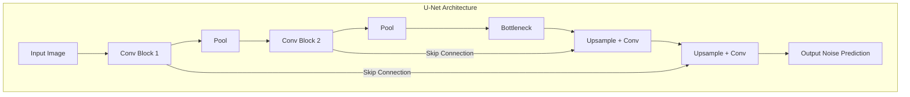

# Diffusion Models Introduction for Beginners

> A gentle, beginner-friendly introduction to Diffusion Models - the technology behind Stable Diffusion, Midjourney, and modern AI image generation. No prior machine learning knowledge required!

---

## Table of Contents

1. [Prerequisites & Foundations](#1-prerequisites--foundations)
2. [From GANs to Diffusion: The Evolution](#2-from-gans-to-diffusion-the-evolution)
3. [Why Do We Need Diffusion Models?](#3-why-do-we-need-diffusion-models)
4. [Core Concepts](#4-core-concepts)
5. [How Diffusion Models Work](#5-how-diffusion-models-work)
6. [Why Diffusion Models Matter](#6-why-diffusion-models-matter)
7. [Hands-On Intuition](#7-hands-on-intuition)
8. [Glossary](#8-glossary)

---

## 1. Prerequisites & Foundations

Before diving into Diffusion Models, let's build up some foundational concepts. We'll explain everything from scratch!

### 1.1 What is a Vector?

> 📖 **Term: Vector** - An ordered list of numbers. Think of it as a point in space or an arrow pointing from the origin to that point. For example, [3, 5] is a 2D vector representing a point 3 units right and 5 units up from the origin.

A **vector** is simply a list of numbers arranged in order. It's one of the most fundamental concepts in machine learning.

**Why do we use vectors in AI?**

Vectors let computers represent information as numbers:
- **Words** become vectors (e.g., "cat" might be [0.9, -0.2, 0.5, ...])
- **Pixels** in an image are represented by vectors, like [Red, Green, Blue] values.
- An **entire image** can be one giant vector of all its pixel values.

### 1.2 What is a Matrix?

> 📖 **Term: Matrix** - A rectangular grid of numbers. Think of it as a collection of vectors arranged in rows and columns.

A **matrix** is a grid of numbers with rows and columns. An image is a perfect example of a matrix, where each entry is a pixel.

**Visual Example:**
```
An image is a matrix of pixel values:
A 3x3 grayscale image (numbers = brightness)

┌           ┐
│ 255  128  0   │   Row 1
│ 100  200  50  │   Row 2
│ 25   75   150 │   Row 3
└           ┘
```

### 1.3 What is a Function?

> 📖 **Term: Function** - A mathematical relationship that takes input(s) and produces an output. You give it something, it follows rules, and gives you back something else. Written as f(x) = y, where x is input and y is output.

In machine learning, the **neural network itself is the function**. The goal of training is to **learn** the right function that transforms inputs (like noise or text prompts) into the correct outputs (a beautiful image).

### 1.4 What is a Neural Network?

> 📖 **Term: Neural Network** - A computational model inspired by the human brain. It consists of connected layers of "neurons" that process information. Each neuron takes inputs, applies weights (importance factors), and produces an output.

A **neural network** is the engine that powers diffusion models. It's the part of the system that **learns** to reverse the noise and create an image.

**How it learns:**
> 📖 **Term: Training** - The process of teaching a neural network by showing it examples and adjusting its internal parameters to reduce errors.

1. Make a prediction (e.g., guess the noise in an image).
2. Compare to the correct answer (the actual noise).
3. Adjust internal values slightly to reduce the error.
4. Repeat millions of times!

### 1.5 What is Noise?

> 📖 **Term: Noise** - Random, meaningless data. In image generation, we often use Gaussian noise, which looks like TV static.

Imagine a perfectly clear image. Now, imagine slowly adding random static to it until the original image is completely gone. That static is **noise**.

**Visual Example:**
```
Clean Image        Slightly Noisy      Very Noisy          Pure Noise
  (Cat)      →       (Fuzzy Cat)     →   (Vague Shape)   →     (Static)
   ● ●               ●~●                 ~_~                 ▓▒░▓▒░
  /---\             /~-~\               /~~~\                 ▓▒░▓▒░
 <|   |>           <|~~~|>             <|~~~|>                ▓▒░▓▒░
```
Diffusion models are masters of understanding and manipulating this noise.

---

## 2. From GANs to Diffusion: The Evolution

Before Diffusion, two other models ruled generative AI: VAEs and GANs.

### 2.1 What are VAEs and GANs?

**VAEs (Variational Autoencoders):**
- **Idea:** Squeeze an image down into a simple description (a latent vector) and then rebuild it.
- **Problem:** Often produce blurry and low-quality results.

**GANs (Generative Adversarial Networks):**
- **Idea:** A "Generator" network tries to create fake images, and a "Discriminator" network tries to spot the fakes. They compete and improve together.
- **Analogy:** An art forger (Generator) and an art critic (Discriminator).
- **Problem:** Notoriously difficult and unstable to train. The two networks have to be perfectly balanced.

### 2.2 Diffusion's "Simple" Idea

Diffusion models came with a fresh perspective:

> Instead of trying to generate an image in one single, giant leap from a random vector (like GANs do), what if we did it gradually, in small, manageable steps?

This is the key insight! Diffusion models break down the impossibly hard task of "generating a cat" into a thousand tiny, easy steps of "making this static look slightly more like a cat."

```
GANs:
  Random Noise ──────────► [COMPLEX NETWORK] ──────────► Final Image (One Shot)

Diffusion:
  Random Noise ──► [Step 1] ──► [Step 2] ... ──► [Step 1000] ──► Final Image (Gradual)
```
This step-by-step process is much more stable and often leads to higher-quality results.

---

## 3. Why Do We Need Diffusion Models?

### 3.1 The Problem: High-Quality Generation is Hard

Creating realistic, diverse, and high-resolution images from scratch is one of the most challenging tasks in AI.
- **GANs**, while powerful, can suffer from "mode collapse" - they learn to generate only a few types of images that can fool the discriminator, leading to a lack of diversity.
- **VAEs** are more stable but tend to produce blurrier, less detailed images.

### 3.2 Diffusion's Solution: Quality and Stability

Diffusion models solve these problems by:
1.  **Breaking it down:** The step-by-step denoising process is easier to learn and control.
2.  **Stable Training:** The training process is much more stable than GANs. You are just teaching one network a straightforward task: predict the noise.
3.  **High-Fidelity Results:** The gradual process allows for the creation of incredibly detailed and realistic images.

This combination of quality, diversity, and stability is why diffusion models have taken over the world of image generation.

---

## 4. Core Concepts

Let's explore the two key processes that make diffusion work.

### 4.1 The Forward Process: Adding Noise

> 📖 **Term: Forward Process (or Diffusion Process)** - The process of starting with a clean image and gradually adding a little bit of noise at each step, for a set number of steps, until the image becomes pure noise.

This process is **fixed**. We don't need to learn anything here. It's a simple mathematical procedure.

```
Step 0 (t=0)        Step 1 (t=1)        ...        Step T (t=1000)
┌───────────┐       ┌───────────┐                  ┌───────────┐
│ Clean Cat │ +noise→ │ Noisy Cat │ +noise→ ... +noise→│ Pure Noise│
└───────────┘       └───────────┘                  └───────────┘
```
The purpose of the forward process is to create the training data. For any image, we can instantly generate a noisy version of it at any timestep `t`.

### 4.2 The Reverse Process: Learning to Denoise

> 📖 **Term: Reverse Process (or Denoising Process)** - The process of training a neural network to undo one step of the forward process. It takes a noisy image at step `t` and tries to predict a slightly less noisy image at step `t-1`.

This is where the magic happens and where the learning occurs. The neural network's job is to predict the noise that was added to the image at a given step.

**The Goal:**
- **Input:** A noisy image `x_t` and the timestep `t`.
- **Prediction:** The noise `ε` that was added to get to `x_t`.
- **Action:** Subtract the predicted noise from `x_t` to get an estimate of `x_{t-1}`.

```
Step T (t=1000)      ...        Step 1 (t=1)          Step 0 (t=0)
┌───────────┐                    ┌───────────┐         ┌───────────┐
│ Pure Noise│ ─noise→ ... ─noise→│ Noisy Cat │ ─noise→ │ Clean Cat │
└───────────┘                    └───────────┘         └───────────┘
   ▲                             ▲                     ▲
   │ [Neural Net Predicts Noise] │ [Predicts Noise]    │ [Predicts Noise]
```

### 4.3 The U-Net Architecture

> 📖 **Term: U-Net** - A specific type of neural network architecture shaped like the letter "U". It's exceptionally good at tasks where the output needs to be the same size as the input (like image-to-image tasks).

The neural network used in most diffusion models is a **U-Net**.

**Why a U-Net?**
1.  **Downsampling Path (Encoder):** It first shrinks the image to understand the "big picture" context (what is in the image).
2.  **Upsampling Path (Decoder):** It then expands the image back to its original size, adding back fine details.
3.  **Skip Connections:** It connects layers from the downsampling path directly to the upsampling path. This is crucial! It allows the network to remember and reuse low-level details (like textures and edges) when it reconstructs the image.



### 4.4 Conditional Diffusion: Text-to-Image

How do we control what the model generates? We add **conditioning**. For text-to-image models like Stable Diffusion, the condition is a text prompt.

> 📖 **Term: Conditioning** - Guiding the diffusion process with extra information, such as a text description, to influence the final output.

This is often done using a mechanism borrowed from Transformers: **cross-attention**.

1.  The text prompt is converted into a numerical representation (embedding).
2.  Inside the U-Net, at various layers, **cross-attention** layers allow the image representation to "look at" the text representation.
3.  The U-Net asks: "Given I'm trying to make 'an astronaut riding a horse', what parts of this text are most relevant to this part of the image I'm currently denoising?"

This guides the denoising process to create an image that matches the text prompt.

---

## 5. How Diffusion Models Work

Let's walk through the training and generation process.

### 5.1 Training the Model

The goal of training is to teach the U-Net to be a master noise-predictor.

```
LOOP (repeat millions of times):
  1. Get a random image from the training dataset (e.g., a photo of a dog).
  2. Pick a random timestep `t` (e.g., t=250 out of 1000).
  3. Generate the actual noise `ε` (a tensor of random numbers).
  4. Apply `t` steps of this noise `ε` to the image to create a noisy image `x_t`.
  5. Feed the noisy image `x_t` and the timestep `t` into the U-Net.
  6. The U-Net predicts the noise `ε_predicted`.
  7. Calculate the error (loss) between the `ε_predicted` and the actual `ε`.
  8. Update the U-Net's parameters to minimize this error.
```

The U-Net never sees the clean image directly. It only sees a noisy version and is asked to predict the noise that was added.

### 5.2 Inference (Generating an Image)

Now that we have a trained U-Net, we can generate new images.

```
START: Generate a random image of pure noise `x_T` (e.g., at t=1000).

LOOP from t=T down to 1 (e.g., t=1000, 999, 998, ...):
  1. Feed the current image `x_t` and the timestep `t` into our trained U-Net.
     (If we have a text prompt, we feed that in too).
  2. The U-Net predicts the noise `ε_predicted` for the current step.
  3. Use a scheduler algorithm to subtract a small amount of this predicted noise from `x_t`.
     This gives us our new, slightly less noisy image, `x_{t-1}`.
  4. The result `x_{t-1}` becomes the input for the next loop iteration.

END: After the loop finishes (at t=0), the final `x_0` is our generated image!
```

This iterative refinement process, starting from pure static and slowly carving out an image based on the U-Net's predictions, is what creates the stunningly detailed images we see from models like Midjourney and Stable Diffusion.

---

## 6. Why Diffusion Models Matter

### 6.1 Real-World Applications

Diffusion models are not just for fun images. They are a powerful new tool for creativity and science.

```
┌─────────────────────────────────────────────────────────────┐
│                 DIFFUSION APPLICATIONS                      │
├─────────────────────────────────────────────────────────────┤
│                                                             │
│  🖼️ Text-to-Image Generation                                │
│     "A photo of an astronaut riding a horse on Mars"        │
│     → Midjourney, Stable Diffusion, DALL-E 2                │
│                                                             │
│  🎨 Image Editing (Inpainting & Outpainting)                │
│     "Remove the person from this photo" or "Extend the      │
│     background of this image"                               │
│     → Adobe Photoshop Generative Fill                       │
│                                                             │
│  ✨ Image-to-Image Translation                               │
│     "Turn this sketch into a photorealistic image"          │
│     → ControlNet, InstructPix2Pix                           │
│                                                             │
│  🎬 Video Generation                                        │
│     "A cinematic shot of a boat sailing in a storm"         │
│     → Sora, RunwayML, Pika Labs                             │
│                                                             │
│  🎵 Audio & Music Generation                                │
│     "Generate a happy acoustic folk song"                   │
│     → AudioLDM, Riffusion                                   │
│                                                             │
│  🔬 Scientific Discovery                                   │
│     "Generate new protein structures for a specific        │
│      function" or "Design a new molecule"                   │
│     → Drug discovery, materials science                     │
│                                                             │
└─────────────────────────────────────────────────────────────┘
```

### 6.2 The Diffusion Family Tree

The field has evolved rapidly since the original concept.

```
Diffusion Evolution:

2015: "Deep Unsupervised Learning using Nonequilibrium Thermodynamics"
         │
         └─► The theoretical foundation is laid.

2020: DDPM (Denoising Diffusion Probabilistic Models)
         │
         └─► The paper that showed diffusion models could achieve
             high-quality image generation, kicking off the revolution.

2021: GLIDE & DALL-E 2
         │
         └─► OpenAI combines diffusion with text conditioning,
             achieving incredible text-to-image results.

2022: Latent Diffusion Models (LDM)
         │
         └─► The breakthrough behind Stable Diffusion! Instead of
             running diffusion on giant images, run it on a small,
             compressed "latent" version of the image. This is
             MASSIVELY more efficient and faster.

2022+: Many variants...
         ControlNet (precise control), DDIM (faster sampling),
         and application-specific models.
```

---

## 7. Hands-On Intuition

Let's build intuition with a 1-dimensional example: generating a single number.

### 7.1 Setup: Simple Example

Imagine our "image" is just a single number, and our dataset has only one data point: `8`. Our goal is to train a model that can generate the number `8` starting from random noise.

Let's define a simple 3-step diffusion process.
- Our data `x_0` = `8`
- Noise is just a random number (e.g., from -2 to +2).

**Forward Process (Adding Noise):**
- `x_1` = `x_0` + noise_1 = `8 + 1.5` = `9.5`
- `x_2` = `x_1` + noise_2 = `9.5 - 2.0` = `7.5`
- `x_3` = `x_2` + noise_3 = `7.5 + 1.8` = `9.3` (This is our "pure noise" starting point)

### 7.2 Step-by-Step Denoising Intuition

Our neural network's job is to learn the reverse of this process. Let's pretend our "network" is a very simple function: `f(x) = x - (x - 8) * 0.5`. This function tries to move any number `x` halfway back towards `8`.

**Reverse Process (Generating):**

**Step 1: Start with noise `x_3`**
- Input: `x_3` = `9.3`
- Network predicts the "direction": `f(9.3) = 9.3 - (9.3 - 8) * 0.5 = 9.3 - 0.65 = 8.65`
- Our new value `x_2` is `8.65`. We are closer to 8!

**Step 2: Denoise `x_2`**
- Input: `x_2` = `8.65`
- Network predicts: `f(8.65) = 8.65 - (8.65 - 8) * 0.5 = 8.65 - 0.325 = 8.325`
- Our new value `x_1` is `8.325`. Even closer!

**Step 3: Denoise `x_1`**
- Input: `x_1` = `8.325`
- Network predicts: `f(8.325) = 8.325 - (8.325 - 8) * 0.5 = 8.325 - 0.1625 = 8.1625`
- Our final value `x_0` is `8.1625`.

We started from random noise (`9.3`) and ended up with `8.1625`, which is very close to our original data `8`. A real diffusion model does this in thousands of steps and for millions of pixels at once!

---

## 8. Glossary

| Term | Definition |
|------|------------|
| **Conditioning** | Guiding the diffusion process with extra information (like text) to influence the output. |
| **Cross-Attention** | A mechanism (often from Transformers) that allows the model to focus on relevant parts of the conditioning (e.g., text prompt) while generating the image. |
| **DDPM** | Denoising Diffusion Probabilistic Model. The influential 2020 paper that demonstrated the high performance of diffusion models. |
| **Diffusion Model**| A type of generative model that creates data by gradually reversing a noising process. |
| **Forward Process**| The fixed process of gradually adding noise to an image until it becomes random static. |
| **GAN** | Generative Adversarial Network. A generative model where a Generator and a Discriminator compete against each other. |
| **Latent Diffusion**| A highly efficient type of diffusion model (used by Stable Diffusion) that operates on a small, compressed "latent" representation of an image instead of the full pixel image. |
| **Noise** | Random, meaningless data. In image generation, typically Gaussian noise that looks like TV static. |
| **Reverse Process**| The learned process of training a neural network to gradually denoise an image, step-by-step, starting from pure noise to generate a clean image. |
| **Scheduler** | The algorithm used during inference to decide exactly how much of the predicted noise to subtract at each step of the reverse process. |
| **Skip Connection**| A connection in a U-Net that passes information directly from the encoder (downsampling path) to the decoder (upsampling path), preserving important details. |
| **Timestep (t)** | A number that indicates how much noise has been added to an image. `t=0` is a clean image, and a high `t` (e.g., `t=1000`) is pure noise. |
| **Training** | The process of teaching a neural network by showing it examples and adjusting its parameters to reduce errors. |
| **U-Net** | A U-shaped neural network architecture, excellent for image-to-image tasks, that is the core of most diffusion models. |
| **Vector** | An ordered list of numbers used to represent data like pixels or words. |

---

## Conclusion

Congratulations! You've learned the fundamentals of Diffusion Models:

**What you now understand:**
- ✓ The basic concepts of noise, neural networks, and vectors.
- ✓ Why diffusion models were a major step forward from GANs.
- ✓ The core concepts: the Forward (noising) and Reverse (denoising) processes.
- ✓ How diffusion models are trained (predicting noise) and how they generate images (iterative denoising).
- ✓ The role of the U-Net architecture and text conditioning.
- ✓ The incredible impact these models are having across many fields.

This foundational knowledge gives you a powerful lens through which to understand the current explosion in AI-driven creativity.

**Keep learning!** 🚀
