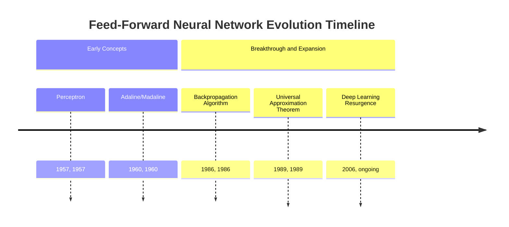
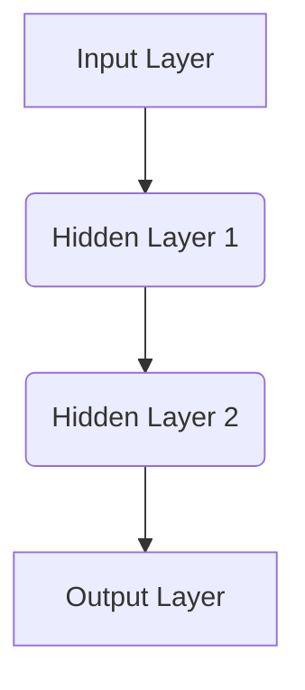
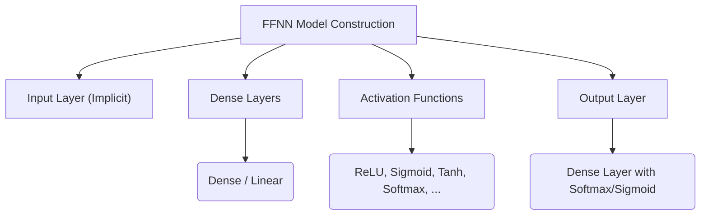
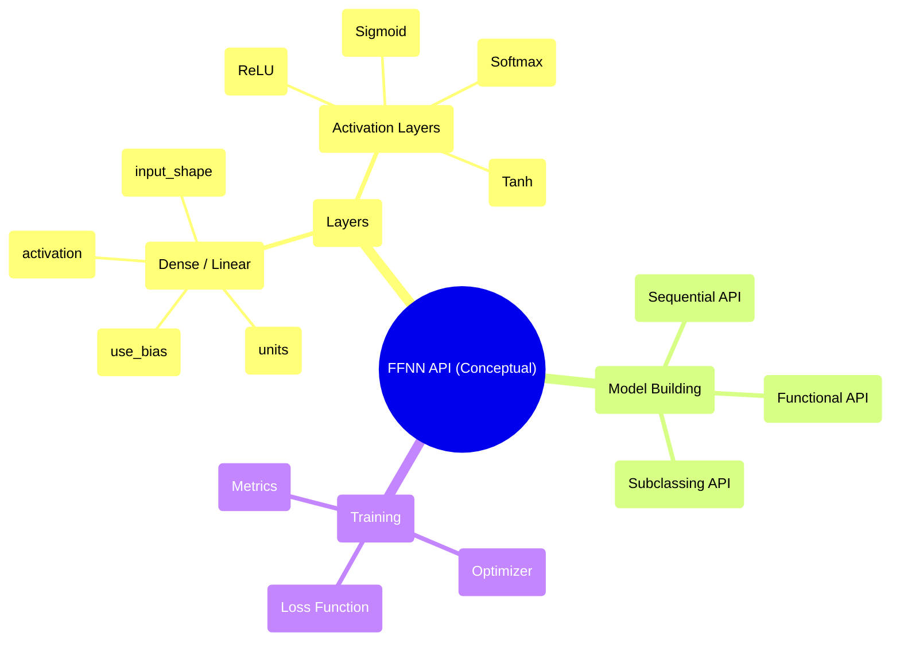

## Feed-Forward Neural Network Evolution Document

### 1. Introduction and Historical Context

A Feed-Forward Neural Network (FFNN), also known as a multi-layer perceptron (MLP) when it has one or more hidden layers, is the simplest type of artificial neural network. In an FFNN, the connections between the nodes do not form a cycle; information moves in only one direction—forward—from the input nodes, through any hidden nodes, and to the output nodes. These networks are called "feed-forward" because information flows strictly in one direction, from input to output, without any feedback loops.

The concept of artificial neurons dates back to the **Perceptron**, introduced by Frank Rosenblatt in 1957, which was a single-layer network capable of learning binary classifiers. While groundbreaking, the Perceptron's limitations, particularly its inability to solve non-linearly separable problems (highlighted by Minsky and Papert in 1969), led to a period known as the "AI winter" for neural networks.

The resurgence of interest in FFNNs came with the development of the **backpropagation algorithm** in the 1980s, famously popularized by David Rumelhart, Geoffrey Hinton, and Ronald Williams in 1986. Backpropagation provided an efficient method for training multi-layer networks, allowing them to learn complex, non-linear relationships and overcome the limitations of single-layer perceptrons. This breakthrough paved the way for modern deep learning, as FFNNs became the foundational architecture upon which more complex networks (like CNNs and RNNs) were later built.

### 1.1. FFNN Evolution Timeline



### 2. Core Architecture

The core architecture of a Feed-Forward Neural Network consists of an input layer, one or more hidden layers, and an output layer. Each layer is composed of multiple neurons (or nodes), and each neuron in one layer is connected to every neuron in the subsequent layer, giving it a "fully connected" or "dense" structure.

#### 2.1. Input Layer

**Mental Model / Analogy:**
Imagine the input layer as the "reception desk" of a building. It receives all the incoming information (data features) and simply passes it along to the first set of workers (the first hidden layer) without performing any processing itself.

*   **Purpose:** Receives the raw input data.
*   **Structure:** Number of neurons in this layer corresponds to the number of features in the input dataset. No computation is performed here; it simply distributes the input values to the next layer.

#### 2.2. Hidden Layers

**Mental Model / Analogy:**
Hidden layers are like the "processing departments" within the building. Each department (layer) has its own team of workers (neurons), and they all work together to transform the information they received from the previous department. They might combine pieces of information, filter out noise, or highlight important aspects, and then pass their refined understanding to the next department.

*   **Purpose:** Perform intermediate computations and extract features from the input data. These layers are "hidden" because their inputs and outputs are not directly exposed to the external world.
*   **Structure:** Each neuron in a hidden layer receives inputs from all neurons in the previous layer, applies a weighted sum, and then passes the result through an activation function. The number of hidden layers and neurons per layer are hyperparameters determined during model design.

#### 2.3. Output Layer

**Mental Model / Analogy:**
The output layer is the "final reporting department." After all the processing in the hidden layers, this department compiles the final results or decisions based on the refined information and presents them to the outside world.

*   **Purpose:** Produces the final output of the network, such as a prediction or classification.
*   **Structure:** The number of neurons in the output layer depends on the type of problem:
    *   **Regression:** Typically one neuron for predicting a continuous value.
    *   **Binary Classification:** One neuron (often with a sigmoid activation) for predicting probabilities of two classes.
    *   **Multi-class Classification:** Multiple neurons (often with a softmax activation), one for each class, to predict class probabilities.

#### 2.4. Weights and Biases

*   **Weights:** Numerical values assigned to the connections between neurons. They determine the strength and importance of a connection. During training, weights are adjusted to minimize the network's prediction error.
*   **Biases:** Additional parameters in each neuron that allow the activation function to be shifted. They enable the network to learn better fits for the data.

#### 2.5. Activation Functions

*   **Purpose:** Introduce non-linearity into the network, allowing it to learn complex patterns and relationships that linear models cannot. Without activation functions, a multi-layer network would behave like a single-layer linear model.
*   **Common Examples:**
    *   **ReLU (Rectified Linear Unit):** `f(x) = max(0, x)`.
    *   **Use Case:** Most commonly used in hidden layers of deep networks due to its computational efficiency and its ability to alleviate the vanishing gradient problem.
    *   **Sigmoid:** `f(x) = 1 / (1 + e^(-x))`.
    *   **Use Case:** Outputs values between 0 and 1, making it suitable for binary classification problems in the output layer (interpreting the output as a probability) or for hidden layers in simpler, shallower networks.
    *   **Tanh (Hyperbolic Tangent):** `f(x) = (e^x - e^-x) / (e^x + e^-x)`.
    *   **Use Case:** Outputs values between -1 and 1, often preferred over Sigmoid in hidden layers because its output is zero-centered, which can aid in training dynamics.
    *   **Softmax:** Converts a vector of arbitrary real values into a probability distribution. For an input vector `z` of `K` dimensions, the softmax function is `P(y=j|z) = e^(z_j) / sum(e^(z_k) for k in 1 to K)`.
    *   **Use Case:** Exclusively used in the output layer for multi-class classification, where it assigns probabilities to each class that sum up to 1.

**Mermaid Diagram: FFNN Core Architecture**



### 3. Detailed API Overview (Conceptual)

Feed-Forward Neural Networks are typically implemented using deep learning frameworks like TensorFlow, PyTorch, or Keras. The "API" here refers to the common components and patterns used to construct FFNN models within these frameworks. The focus is on defining layers, activation functions, and assembling them into a sequential or functional model.

#### 3.1. Dense/Linear Layers

These are the fundamental building blocks for FFNNs, representing the fully connected nature between layers.

##### 3.1.1. Dense Layer (e.g., `tf.keras.layers.Dense`, `torch.nn.Linear`)

**Goal:** Implement `output = activation(dot(input, kernel) + bias)`. This layer represents a fully connected operation.

**Code (Conceptual - Keras):**
```python
from tensorflow.keras import layers, models

model = models.Sequential([
    # The first Dense layer. It takes an input of shape (784,) for flattened MNIST images
    # and has 64 neurons. 'relu' is the activation function.
    layers.Dense(64, activation='relu', input_shape=(784,)), 
    # A second hidden Dense layer with 64 neurons and ReLU activation.
    layers.Dense(64, activation='relu'), 
    # The output Dense layer for a 10-class classification problem (e.g., MNIST digits).
    # 'softmax' activation ensures the outputs are probabilities summing to 1.
    layers.Dense(10, activation='softmax') 
])

model.summary()
```

**Explanation:**
*   `units`: The number of neurons (dimensionality of the output space) in the layer.
*   `activation`: The activation function to use (e.g., `'relu'`, `'sigmoid'`, `'softmax'`).
*   `input_shape`: Required for the first layer, specifying the shape of the input data.

*   **Context:** The primary layer for constructing FFNNs, responsible for weighted sum and activation.
*   **Parameters (Common):**
    *   `units` (int): Dimensionality of the output space.
    *   `activation`: Activation function to use.
    *   `use_bias` (bool): Whether the layer uses a bias vector.
*   **Returns:** A tensor representing the output of the layer.

##### 3.1.2. Quick Reference: Dense/Linear Layers

| Parameter | Description | Common Values |
| :--- | :--- | :--- |
| `units` | Number of neurons in the layer | 32, 64, 128, 256 |
| `activation` | Non-linear activation function | \'relu\', \'sigmoid\', \'softmax\' |
| `input_shape` | Shape of the input data (for first layer) | (784,), (100,) |

#### 3.2. Activation Functions

These are often specified as an argument within a `Dense` layer or as separate layers.

##### 3.2.1. ReLU Activation (e.g., `tf.keras.layers.ReLU`, `torch.nn.ReLU`)

**Goal:** Applies the rectified linear unit activation function.

**Code (Conceptual - Keras):**
```python
from tensorflow.keras import layers, models

model = models.Sequential([
    # A Dense layer without an activation function specified directly.
    layers.Dense(64, input_shape=(784,)),
    # An explicit ReLU activation layer applied after the Dense layer's linear transformation.
    layers.ReLU(), 
    # The output layer with softmax activation.
    layers.Dense(10, activation='softmax')
])
```

*   **Context:** Introduces non-linearity.
*   **Parameters (Common):** None usually, or `max_value`, `negative_slope`.
*   **Returns:** The activated tensor.

##### 3.2.2. Softmax Activation (e.g., `tf.keras.layers.Softmax`, `torch.nn.Softmax`)

**Goal:** Converts a vector of values to a probability distribution.

**Code (Conceptual - Keras):**
```python
from tensorflow.keras import layers, models

model = models.Sequential([
    # A hidden Dense layer with ReLU activation.
    layers.Dense(64, activation='relu', input_shape=(784,)),
    # An output Dense layer with 10 units (for 10 classes) but no activation specified here,
    # as softmax will be applied separately.
    layers.Dense(10), 
    # An explicit Softmax activation layer, converting the raw outputs (logits) 
    # from the previous Dense layer into a probability distribution.
    layers.Softmax() 
])
```

*   **Context:** Used in the output layer for multi-class classification.
*   **Parameters (Common):** `axis` (the dimension along which to apply softmax).
*   **Returns:** A tensor of probabilities.

**Mermaid Diagram: Simplified FFNN API Structure (Conceptual)**



### 3.3. API Mindmap



#### 3.4. Loss Functions and Optimizers

Training a Feed-Forward Neural Network involves minimizing a **loss function** (also called a cost function) which quantifies the difference between the network's predictions and the true target values. The **optimizer** is then responsible for adjusting the network's weights and biases to reduce this loss.

##### 3.4.1. Loss Functions

*   **Purpose:** Measure how well the model is performing. A lower loss value indicates a better-performing model.
*   **Common Examples:**
    *   **Mean Squared Error (MSE):** `Loss = (1/N) * sum((y_true - y_pred)^2)`.
    *   **Use Case:** Primarily used for regression problems, where the goal is to predict continuous numerical values.
    *   **Binary Cross-Entropy:** `Loss = - (y_true * log(y_pred) + (1 - y_true) * log(1 - y_pred))`.
    *   **Use Case:** Used for binary classification problems (two classes), typically when the output layer has a sigmoid activation function.
    *   **Categorical Cross-Entropy (or Sparse Categorical Cross-Entropy):** `Loss = - sum(y_true * log(y_pred))`.
    *   **Use Case:** Used for multi-class classification problems. Categorical Cross-Entropy is for one-hot encoded labels, while Sparse Categorical Cross-Entropy is for integer labels.

##### 3.4.2. Optimizers

*   **Purpose:** Algorithms that adjust the model's parameters (weights and biases) during training to minimize the loss function. They determine how the network learns.
*   **Common Examples:**
    *   **Stochastic Gradient Descent (SGD):** A basic optimizer that updates weights in the direction opposite to the gradient of the loss function. Often includes momentum to accelerate convergence and dampen oscillations.
    *   **Adam (Adaptive Moment Estimation):** A popular and generally effective optimizer that combines concepts from RMSprop and Adagrad. It adaptively adjusts learning rates for each parameter based on estimates of first and second moments of the gradients.
    *   **RMSprop (Root Mean Square Propagation):** An optimizer that maintains a moving average of squared gradients and divides the learning rate by this average, helping to adapt the learning rate for each parameter.

### 4. Architectural Trade-offs

FFNNs, while fundamental, have specific strengths and weaknesses that dictate their suitability for various tasks. Understanding these trade-offs is crucial for selecting the appropriate architecture.

#### 4.1. Strengths

*   **Simplicity and Interpretability (Relative):** Compared to more complex deep learning architectures like deep CNNs or complex RNNs, simpler FFNNs (especially those with fewer hidden layers) are generally easier to understand, debug, and interpret. Their fully connected nature makes the flow of information more direct.
*   **Universal Approximation Theorem:** A feed-forward network with a single hidden layer containing a finite number of neurons can approximate any continuous function to arbitrary accuracy. This theoretical backing highlights their power for learning complex mappings, provided sufficient neurons and appropriate training.
*   **Flexibility for Tabular Data:** FFNNs are highly effective for learning patterns in structured, tabular data where features do not have strong inherent spatial or temporal relationships (unlike images or sequences). For datasets where each row is an independent observation with distinct features (e.g., customer data, sensor readings), FFNNs often perform very well.
*   **Foundation for Deep Learning:** They serve as the foundational architecture upon which more specialized neural networks (like CNNs for images and RNNs/Transformers for sequences) are built. FFNNs are frequently used as the final "classification head" or "regression tail" of these more complex models, processing the high-level features extracted by specialized layers.

#### 4.2. Weaknesses

*   **Lack of Spatial/Temporal Awareness:** FFNNs treat all input features independently. They do not inherently understand spatial relationships (e.g., the proximity of pixels in an image) or temporal dependencies (e.g., the order of words in a sentence or time steps in a series). This makes them significantly less efficient and powerful for such data compared to architectures like CNNs (for spatial data) or RNNs/Transformers (for sequential data).
*   **High Parameter Count (for complex tasks):** For tasks involving high-dimensional inputs, especially raw grid-like data such as images, a fully connected FFNN would require an enormous number of parameters. For instance, a 28x28 image flattened for an FFNN has 784 input features; connecting this to a hidden layer with 128 neurons alone requires 784 * 128 = 100,352 weights. This leads to computational inefficiency and a high risk of overfitting without careful regularization.
*   **Vanishing/Exploding Gradients:** In deep FFNNs, gradients calculated during backpropagation can become extremely small (vanishing) or very large (exploding) as they propagate through many layers. This makes it difficult for the network to learn effectively, especially in earlier layers. The advent of ReLU activation functions, better weight initialization strategies, and techniques like batch normalization has helped mitigate these issues.
*   **Inefficiency for Large Inputs:** Processing large inputs like high-resolution images with a fully connected FFNN is computationally expensive and generally outperformed by CNNs. CNNs leverage parameter sharing and local receptive fields, which are far more efficient for capturing spatial hierarchies in images.

### 5. Practical Applications & Use Cases

FFNNs are versatile and have been successfully applied to numerous tasks, particularly those involving structured data.

*   **Classification:**
    *   **Image Classification (simple):** For small, pre-processed images (e.g., MNIST handwritten digits), FFNNs can perform well. However, for complex images, CNNs are preferred.
    *   **Spam Detection:** Classifying emails as spam or not spam based on features extracted from the email content.
    *   **Sentiment Analysis:** Classifying text as positive, negative, or neutral sentiment.
*   **Regression:**
    *   **Predictive Modeling:** Predicting continuous values like house prices, stock prices, or sales figures based on various input features.
*   **Pattern Recognition:**
    *   **Handwritten Digit Recognition:** Early successes of MLPs were in recognizing handwritten digits.
*   **Anomaly Detection:** Identifying unusual patterns in data that do not conform to expected behavior (e.g., fraud detection).

#### 5.1. Example: Simple Classification with a Feed-Forward Network

Here's a conceptual code example demonstrating a simple FFNN for a classification task, such as predicting whether a customer will churn based on various features.

**Code (Conceptual - Keras):**
```python
import tensorflow as tf
from tensorflow.keras import layers, models
from sklearn.model_selection import train_test_split
from sklearn.preprocessing import StandardScaler
import numpy as np

# 1. Generate some synthetic data for demonstration
# Imagine 5 features: age, income, usage_duration, support_calls, contract_type (binary)
# And a binary target: churn (0 or 1)
np.random.seed(42)
num_samples = 1000
age = np.random.randint(20, 70, num_samples)
income = np.random.normal(50000, 15000, num_samples)
usage_duration = np.random.normal(12, 5, num_samples) # months
support_calls = np.random.randint(0, 10, num_samples)
contract_type = np.random.randint(0, 2, num_samples) # 0: monthly, 1: yearly

# A simple rule for churn (e.g., older, lower income, shorter usage, more support calls, monthly contract)
churn_prob = (
    0.1 * (70 - age) / 50 +
    0.05 * (50000 - income) / 15000 +
    0.15 * (12 - usage_duration) / 12 +
    0.2 * support_calls / 10 +
    0.3 * (1 - contract_type)
)
churn_prob = np.clip(churn_prob, 0.05, 0.95) # Clip probabilities to reasonable range.
churn = (np.random.rand(num_samples) < churn_prob).astype(int) # Generate binary churn labels based on probabilities.

X = np.stack([age, income, usage_duration, support_calls, contract_type], axis=1) # Combine features into input matrix X.
y = churn # Assign churn labels to target vector y.

# 2. Preprocess data
scaler = StandardScaler() # Initialize a StandardScaler for feature scaling.
X_scaled = scaler.fit_transform(X) # Fit the scaler and transform the input features.

# Split the data into training and testing sets.
X_train, X_test, y_train, y_test = train_test_split(X_scaled, y, test_size=0.2, random_state=42)

# 3. Define the FFNN model architecture
model = models.Sequential([
    # Input layer and first hidden layer: 32 neurons, ReLU activation, input shape based on number of features.
    layers.Dense(32, activation='relu', input_shape=(X_train.shape[1],)), 
    # Second hidden layer: 16 neurons with ReLU activation.
    layers.Dense(16, activation='relu'), 
    # Output layer for binary classification: 1 neuron with sigmoid activation 
    # to output a probability between 0 and 1.
    layers.Dense(1, activation='sigmoid') 
])

model.summary() # Print a summary of the model architecture.

# 4. Compile the model
model.compile(optimizer='adam', # Use the Adam optimizer for efficient training.
              loss='binary_crossentropy', # Use binary cross-entropy as the loss function for binary classification.
              metrics=['accuracy']) # Monitor accuracy during training.

# 5. Train the model
history = model.fit(X_train, y_train, epochs=10, batch_size=32, validation_data=(X_test, y_test)) # Train the model for 10 epochs.

# 6. Evaluate the model
test_loss, test_acc = model.evaluate(X_test, y_test, verbose=2) # Evaluate model performance on the test set.
print(f"\nTest accuracy: {test_acc:.4f}")

# 7. Make predictions
predictions = (model.predict(X_test) > 0.5).astype(int) # Get binary predictions from probabilities (threshold at 0.5).
print("\nSample predictions vs actual:")
for i in range(5):
    print(f"Predicted: {predictions[i][0]}, Actual: {y_test[i]}")
```

### 6. Complete Code Examples (MNIST)

To make the architecture concrete, here are two complete, runnable examples of a simple FFNN for classifying handwritten digits from the MNIST dataset, one using TensorFlow/Keras and the other using PyTorch. The MNIST dataset is often used as a "hello world" for neural networks, even though CNNs typically achieve higher accuracy on it.

#### 6.1. TensorFlow/Keras Implementation

This example uses the Keras Sequential API, which is a straightforward way to build a model layer-by-layer.

```python
import tensorflow as tf
from tensorflow.keras import layers, models

# 1. Load and preprocess the MNIST dataset
(x_train, y_train), (x_test, y_test) = tf.keras.datasets.mnist.load_data()

# Normalize pixel values to be between 0 and 1
x_train = x_train.astype('float32') / 255
x_test = x_test.astype('float32') / 255

# Flatten the 28x28 images into 784-dimensional vectors for FFNN
x_train = x_train.reshape((60000, 28 * 28))
x_test = x_test.reshape((10000, 28 * 28))

# 2. Define the FFNN model architecture
model = models.Sequential([
    layers.Input(shape=(784,)), # Input layer
    layers.Dense(128, activation='relu'), # First hidden layer
    layers.Dense(64, activation='relu'),  # Second hidden layer
    layers.Dense(10, activation='softmax') # Output layer for 10 classes
])

model.summary() # Print a summary of the model architecture.

# 3. Compile the model
model.compile(optimizer='adam',
              loss='sparse_categorical_crossentropy',
              metrics=['accuracy'])

# 4. Train the model
history = model.fit(x_train, y_train, epochs=10, batch_size=32, \
                    validation_data=(x_test, y_test))

# 5. Evaluate the model
test_loss, test_acc = model.evaluate(x_test, y_test, verbose=2)
print(f"\nTest accuracy: {test_acc:.4f}")
```

#### 6.2. PyTorch Implementation

This example defines the FFNN as a custom `nn.Module` class, which is the standard and most flexible way to build models in PyTorch.

```python
import torch
import torch.nn as nn
import torch.optim as optim
from torchvision import datasets, transforms
from torch.utils.data import DataLoader

# 1. Define transformations and load the MNIST dataset
transform = transforms.Compose([
    transforms.ToTensor(), # Converts PIL image to PyTorch tensor (0-1 range).
    transforms.Normalize((0.1307,), (0.3081,)), # Normalize with MNIST mean and std dev for better training stability.
    transforms.Lambda(lambda x: x.view(-1)) # Flatten the 28x28 image tensor into a 784-element vector.
])

# Load the training and testing datasets. 'download=True' will fetch the data if not already present.
train_dataset = datasets.MNIST(root='./data', train=True, download=True, transform=transform)
test_dataset = datasets.MNIST(root='./data', train=False, download=True, transform=transform)

# Create DataLoaders for batching and shuffling the data.
train_loader = DataLoader(train_dataset, batch_size=64, shuffle=True)
test_loader = DataLoader(test_dataset, batch_size=1000, shuffle=False)

# 2. Define the FFNN model architecture
class SimpleFFNN(nn.Module):
    def __init__(self):
        super(SimpleFFNN, self).__init__()
        # Define the first fully connected layer: input size 784 (28*28), output size 128.
        self.fc1 = nn.Linear(28 * 28, 128)
        self.relu1 = nn.ReLU() # Apply ReLU activation after the first layer.
        # Define the second fully connected layer: input size 128, output size 64.
        self.fc2 = nn.Linear(128, 64)
        self.relu2 = nn.ReLU() # Apply ReLU activation after the second layer.
        # Define the output fully connected layer: input size 64, output size 10 (for 10 digits).
        self.fc3 = nn.Linear(64, 10)

    def forward(self, x):
        # Define the forward pass: how data flows through the layers.
        x = self.relu1(self.fc1(x))
        x = self.relu2(self.fc2(x))
        x = self.fc3(x) # Output raw logits (scores).
        return x # Return raw logits; CrossEntropyLoss will apply softmax internally.

model = SimpleFFNN() # Instantiate the model.

# 3. Define loss function and optimizer
# CrossEntropyLoss is suitable for multi-class classification and includes Softmax.
criterion = nn.CrossEntropyLoss()
# Adam optimizer is a popular choice for adaptive learning rates.
optimizer = optim.Adam(model.parameters(), lr=0.001)

# 4. Train the model
def train_model(num_epochs):
    model.train() # Set the model to training mode.
    for epoch in range(num_epochs):
        for batch_idx, (data, target) in enumerate(train_loader):
            optimizer.zero_grad() # Clear previous gradients.
            outputs = model(data) # Forward pass: get model predictions.
            loss = criterion(outputs, target) # Calculate the loss.
            loss.backward() # Backward pass: compute gradients.
            optimizer.step() # Update model parameters.
            # Print status updates periodically.
            if (batch_idx + 1) % 100 == 0:
                print(f'Epoch [{epoch+1}/{num_epochs}], Step [{batch_idx+1}/{len(train_loader)}], Loss: {loss.item():.4f}')

train_model(num_epochs=10) # Train the model for 10 epochs.

# 5. Evaluate the model
def evaluate_model():
    model.eval() # Set the model to evaluation mode (disables dropout, etc.).
    with torch.no_grad(): # Disable gradient calculation for evaluation.
        correct = 0
        total = 0
        for data, target in test_loader:
            outputs = model(data)
            # Get the index of the max log-probability (predicted class).
            _, predicted = torch.max(outputs.data, 1)
            total += target.size(0)
            correct += (predicted == target).sum().item() # Count correct predictions.
        print(f'Test Accuracy: {100 * correct / total:.2f}%')

evaluate_model() # Run the evaluation.
```

### 7. Evolution and Impact

The evolution of Feed-Forward Neural Networks has been closely tied to advancements in training algorithms, computational power, and the availability of data. While simpler FFNNs were initially limited, their underlying principles have been continuously refined and integrated into more sophisticated architectures.

*   **From Perceptrons to Multi-Layer Perceptrons (MLPs):** The shift from single-layer perceptrons to MLPs with hidden layers, enabled by backpropagation, allowed networks to learn non-linear decision boundaries and solve more complex problems.
*   **Deepening Networks:** The concept of "deep" learning, while more prominent in CNNs and RNNs, also applies to FFNNs. Stacking more hidden layers allows FFNNs to learn more abstract and hierarchical representations of data, albeit with challenges like vanishing gradients.
*   **Activation Function Innovations:** The move from sigmoid/tanh to ReLU and its variants significantly improved training speed and mitigated the vanishing gradient problem in deeper networks.
*   **Regularization Techniques:** Techniques like dropout, batch normalization, and L1/L2 regularization became crucial for training deep FFNNs effectively, preventing overfitting and improving generalization.
*   **Optimization Algorithms:** The development of advanced optimizers (e.g., Adam, RMSprop, SGD with momentum) greatly accelerated and stabilized the training of FFNNs and other deep learning models.
*   **Foundational Role:** FFNNs remain a fundamental component. They are often used as the "head" of more complex models (e.g., the final dense layers for classification in a CNN) or for processing flat, unstructured data.
*   **Decline in Standalone Use for Complex Data:** While historically significant, standalone deep FFNNs are often superseded by specialized architectures like CNNs for image data or RNNs/Transformers for sequential data, due to their inherent structural advantages for these data types. However, they continue to be a go-to choice for tabular data problems.

### 8. Conclusion

Feed-Forward Neural Networks represent the foundational architecture of artificial neural networks, embodying the core principles of connectionism and learning. From the early Perceptron to the multi-layered networks trainable with backpropagation, FFNNs have provided the essential building blocks for the broader field of deep learning. While more specialized architectures have emerged for specific data types, the FFNN's simplicity, theoretical power (universal approximation), and adaptability for tabular data ensure its continued relevance. Its legacy as the precursor and often integral component of modern deep neural networks underscores its profound and lasting impact on artificial intelligence.