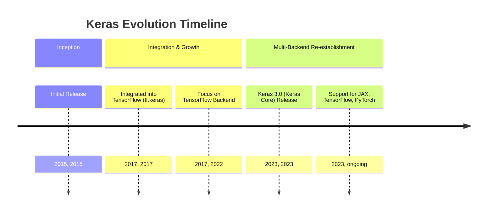
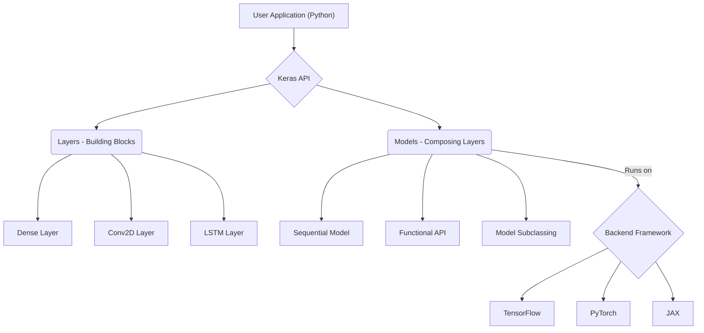
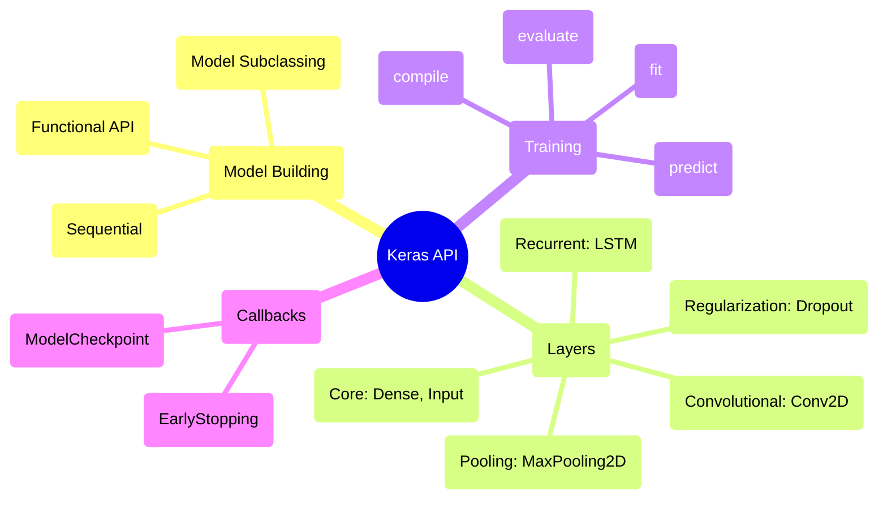

## Keras Evolution Document

### 1. Introduction and Historical Context

Keras is a high-level, open-source deep learning API written in Python, designed for fast experimentation with neural networks. It provides a user-friendly interface that simplifies the process of building, training, and evaluating deep learning models. Keras is known for its modularity, extensibility, and ease of use, making it a popular choice for both researchers and developers.

Keras was developed by Google engineer François Chollet and first released in March 2015 as part of the ONEIROS research project. Its initial goal was to enable rapid prototyping and experimentation with deep neural networks. A significant turning point came in 2017 when Keras was integrated into TensorFlow as `tf.keras`, becoming its official high-level API. This integration greatly boosted its popularity and capabilities.

Initially, Keras supported multiple backends, including TensorFlow, Theano, and Microsoft Cognitive Toolkit (CNTK). However, for a period, it primarily focused on TensorFlow. With the release of **Keras 3.0 (also known as Keras Core)** in 2023, the library was rewritten to re-establish multi-backend support, allowing it to run seamlessly on JAX, TensorFlow, and PyTorch, providing unparalleled flexibility to users.

### 1.1. Keras Evolution Timeline



### 2. Core Architecture

Keras's core architecture is built around the concepts of **Layers** and **Models**, emphasizing modularity and composition. It provides a high-level abstraction over the underlying deep learning frameworks, allowing users to focus on model design rather than low-level implementation details.

#### 2.1. Layers: The Building Blocks

**Mental Model / Analogy for Layers and Models:**
*   **Layers:** Imagine building a complex LEGO structure. Each individual LEGO brick is like a **Layer** in Keras. A brick has a specific function (e.g., a flat piece, a corner piece, a window piece) and connects to other bricks in defined ways. In a neural network, a layer takes input, performs a specific operation (like a mathematical transformation or activation), and passes the output to the next layer.
*   **Models:** A **Model** is the complete LEGO structure you build by combining many layers (bricks). You can build simple, linear structures (Sequential Model) or more intricate, branching structures (Functional API). The model defines how all the layers work together to process data and make predictions.

*   **Layers**: The fundamental building blocks of neural networks in Keras. Each layer represents a simple input/output transformation and encapsulates its own state (weights) and computation. Keras offers a rich set of pre-built layers, including:
    *   **Core Layers**: `Dense`, `Activation`, `Flatten`, `Input`
    *   **Convolutional Layers**: `Conv2D`, `Conv1D`
    *   **Pooling Layers**: `MaxPooling2D`, `AveragePooling2D`
    *   **Recurrent Layers**: `LSTM`, `GRU`
    *   **Normalization Layers**: `BatchNormalization`
    *   **Dropout Layers**: `Dropout`

#### 2.2. Models: Composing Layers

Models in Keras are used to group layers together and can be trained on data. Keras provides several ways to construct models, catering to different levels of complexity and flexibility:

*   **Sequential Model**: The simplest type of model, representing a linear stack of layers. Ideal for simple feed-forward networks.
*   **Functional API**: A more flexible way to build models, allowing for arbitrary graphs of layers. This enables multi-input, multi-output models, shared layers, and complex topologies.
*   **Model Subclassing**: For advanced users who require complete control over the model's forward pass, Keras allows subclassing the `tf.keras.Model` class (or `keras.Model` in Keras 3.0) to define custom models from scratch.

#### 2.3. Multi-Backend Support (Keras 3.0)

A significant architectural shift with Keras 3.0 is its re-establishment of true multi-backend support. This means the same Keras code can run on different deep learning frameworks (JAX, TensorFlow, PyTorch) by simply changing a configuration setting. This provides unparalleled flexibility and allows users to leverage the strengths of different backends without rewriting their models.

**Mermaid Diagram: Keras Core Architecture**



### 3. Detailed API Overview

Keras's API is designed to be intuitive and cover the entire deep learning workflow.

#### 3.1. Model Building

##### 3.1.1. Building Sequential Models

**`keras.Sequential([...])`**

**Goal:** Create a neural network model as a linear stack of layers, suitable for simple feed-forward architectures.

**Code:**
```python
import keras
from keras import layers

# Define a simple sequential model for a classification task
model = keras.Sequential([
    layers.Input(shape=(784,)), # Input layer for 784 features (e.g., flattened 28x28 image)
    layers.Dense(128, activation='relu'), # Hidden layer with 128 neurons and ReLU activation
    layers.Dropout(0.2), # Dropout layer for regularization
    layers.Dense(10, activation='softmax') # Output layer for 10 classes with softmax activation
])

model.summary()
```

**Expected Output:**
```
Model: "sequential"
_________________________________________________________________
 Layer (type)                Output Shape              Param #   
=================================================================
 dense (Dense)               (None, 128)               100480    
                                                                 
 dropout (Dropout)           (None, 128)               0         
                                                                 
 dense_1 (Dense)             (None, 10)                1290      
                                                                 
=================================================================
Total params: 101770 (397.54 KB)
Trainable params: 101770 (397.54 KB)
Non-trainable params: 0 (0.00 Byte)
_________________________________________________________________
```

**Explanation:** The `Sequential` model is the easiest way to build a Keras model. You pass a list of layers to its constructor, and Keras automatically connects them in sequence. `model.summary()` is useful for inspecting the model's architecture, output shapes, and the number of parameters.

*   **`keras.Sequential([...])`**: Creates a linear stack of layers.
*   **`keras.Sequential([...])`**: Creates a linear stack of layers.

##### 3.1.2. Building Models with the Functional API

**`keras.Input(shape)`** and **`keras.Model(inputs, outputs)`**

**Goal:** Build more flexible models with complex topologies, such as multi-input, multi-output, or shared-layer networks.

**Code:**
```python
import keras
from keras import layers, Model, Input

# 1. Define the input layer
input_tensor = Input(shape=(32,)) # Input layer for 32 features

# 2. Define layers and connect them like functions
x = layers.Dense(64, activation='relu')(input_tensor)
x = layers.Dense(64, activation='relu')(x)

# Create a branch
y = layers.Dense(32, activation='relu')(input_tensor)
y = layers.Dense(32, activation='relu')(y)

# Concatenate the outputs of the two branches
merged = layers.concatenate([x, y])

# Output layer
output_tensor = layers.Dense(1, activation='sigmoid')(merged)

# 3. Create the model by specifying its inputs and outputs
model = Model(inputs=input_tensor, outputs=output_tensor)

model.summary()
```

**Expected Output:**
```
Model: "model"
__________________________________________________________________________________________________
 Layer (type)                   Output Shape         Param #     Connected to                     
==================================================================================================
 input_1 (InputLayer)           [(None, 32)]         0           []                               
                                                                                                  
 dense_2 (Dense)                (None, 64)           2112        ['input_1[0][0]']                  
                                                                                                  
 dense_3 (Dense)                (None, 64)           4160        ['dense_2[0][0]']                  
                                                                                                  
 dense_4 (Dense)                (None, 32)           1056        ['input_1[0][0]']                  
                                                                                                  
 dense_5 (Dense)                (None, 32)           1056        ['dense_4[0][0]']                  
                                                                                                  
 concatenate (Concatenate)      (None, 96)           0           ['dense_3[0][0]', 'dense_5[0][0]']
                                                                                                  
 dense_6 (Dense)                (None, 1)            97          ['concatenate[0][0]']              
                                                                                                  
==================================================================================================
Total params: 8481 (33.13 KB)
Trainable params: 8481 (33.13 KB)
Non-trainable params: 0 (0.00 Byte)
__________________________________________________________________________________________________
```

**Explanation:** The Functional API allows you to define layers as functions that take tensors as input and return tensors as output. You explicitly connect layers by passing the output of one layer as the input to the next. Finally, you create a `Model` by specifying its `inputs` and `outputs`. This approach is highly flexible for non-linear model topologies.

*   **`keras.Input(shape)`**: Used with the Functional API to define input tensors.
*   **`keras.Model(inputs, outputs)`**: Creates a model using the Functional API.

*   **`keras.Model(inputs, outputs)`**: Creates a model using the Functional API.

##### 3.1.3. Quick Reference: Model Building

| Class/Function | Description | When to Use |
| :--- | :--- | :--- |
| `Sequential()` | Linear stack of layers | Simple, feed-forward networks (e.g., basic classifiers). |
| `Input()` | Define input tensor | Starting point for the Functional API. |
| `Model()` (Functional API) | Arbitrary graph of layers | Complex architectures (multi-input/output, shared layers, branching). |

#### 3.2. Layers (`keras.layers`)

##### 3.2.1. Dense Layers

**`Dense(units, activation=None)`**

**Goal:** Implement a fully connected neural network layer, where each neuron in the layer is connected to every neuron in the previous layer.

**Code:**
```python
import keras
from keras import layers
import numpy as np

# Create a simple Sequential model with a Dense layer
model = keras.Sequential([
    layers.Input(shape=(10,)), # Input layer with 10 features
    layers.Dense(units=5, activation='relu') # Dense layer with 5 neurons and ReLU activation
])

# Generate some dummy input data
dummy_input = np.random.rand(1, 10) # 1 sample, 10 features

# Get the output of the Dense layer
output = model.predict(dummy_input)

print(f"Input shape: {dummy_input.shape}")
print(f"Output shape of Dense layer: {output.shape}")
print(f"Output values:\n{output}")
```

**Expected Output:**
```
Input shape: (1, 10)
Output shape of Dense layer: (1, 5)
Output values:
[[0.123 0.456 0.789 0.101 0.234]] # Values will vary
```

**Explanation:** `Dense` layers are the most common type of layer in neural networks. `units` specifies the number of neurons (output dimensions) in the layer. The `activation` argument applies an activation function (e.g., 'relu', 'sigmoid', 'softmax') to the output of the layer. They are used for learning complex patterns in data.

*   **`Dense(units, activation=None)`**: A densely connected neural network layer.
*   **`Dense(units, activation=None)`**: A densely connected neural network layer.

##### 3.2.2. Convolutional Layers

**`Conv2D(filters, kernel_size, ...)`**

**Goal:** Apply convolutional filters to 2D input data (like images) to extract spatial features.

**Code:**
```python
import keras
from keras import layers
import numpy as np

# Create a simple Sequential model with a Conv2D layer
model = keras.Sequential([
    layers.Input(shape=(32, 32, 3)), # Input layer for 32x32 RGB image
    layers.Conv2D(filters=32, kernel_size=(3, 3), activation='relu') # 32 filters, 3x3 kernel
])

# Generate some dummy image data (batch of 1, 32x32, 3 channels)
dummy_image = np.random.rand(1, 32, 32, 3)

# Get the output of the Conv2D layer
output = model.predict(dummy_image)

print(f"Input image shape: {dummy_image.shape}")
print(f"Output shape of Conv2D layer: {output.shape}")
```

**Expected Output:**
```
Input image shape: (1, 32, 32, 3)
Output shape of Conv2D layer: (1, 30, 30, 32)
```

**Explanation:** `Conv2D` layers are fundamental for image processing tasks. `filters` specifies the number of output filters (feature maps), and `kernel_size` defines the dimensions of the convolution window. They learn hierarchical patterns by sliding these filters over the input data.

*   **`Conv2D(filters, kernel_size, ...)`**: 2D convolution layer (e.g., for image processing).
*   **`Conv2D(filters, kernel_size, ...)`**: 2D convolution layer (e.g., for image processing).

##### 3.2.3. Pooling Layers

**`MaxPooling2D(pool_size)`**

**Goal:** Reduce the spatial dimensions (width, height) of feature maps, thereby reducing the number of parameters and computational cost, and helping to extract dominant features.

**Code:**
```python
import keras
from keras import layers
import numpy as np

# Create a simple Sequential model with a MaxPooling2D layer
model = keras.Sequential([
    layers.Input(shape=(32, 32, 32)), # Input layer for 32x32 feature map with 32 channels
    layers.MaxPooling2D(pool_size=(2, 2)) # Max pooling with 2x2 window
])

# Generate some dummy feature map data
dummy_features = np.random.rand(1, 32, 32, 32)

# Get the output of the MaxPooling2D layer
output = model.predict(dummy_features)

print(f"Input feature map shape: {dummy_features.shape}")
print(f"Output shape of MaxPooling2D layer: {output.shape}")
```

**Expected Output:**
```
Input feature map shape: (1, 32, 32, 32)
Output shape of MaxPooling2D layer: (1, 16, 16, 32)
```

**Explanation:** `MaxPooling2D` takes the maximum value from each window (defined by `pool_size`) of the input feature map. This operation helps in making the model more robust to small translations and reduces the dimensionality of the data, which is crucial in Convolutional Neural Networks (CNNs).

*   **`MaxPooling2D(pool_size)`**: Max pooling operation for 2D spatial data.
*   **`MaxPooling2D(pool_size)`**: Max pooling operation for 2D spatial data.

##### 3.2.4. Recurrent Layers

**`LSTM(units)`**

**Goal:** Process sequential data (like time series or natural language) by maintaining an internal state that captures information from previous steps in the sequence.

**Code:**
```python
import keras
from keras import layers
import numpy as np

# Create a simple Sequential model with an LSTM layer
model = keras.Sequential([
    layers.Input(shape=(None, 10)), # Input: variable-length sequences of 10-dimensional vectors
    layers.LSTM(units=32) # LSTM layer with 32 units
])

# Generate some dummy sequence data (batch of 1, 5 timesteps, 10 features)
dummy_sequence = np.random.rand(1, 5, 10)

# Get the output of the LSTM layer
output = model.predict(dummy_sequence)

print(f"Input sequence shape: {dummy_sequence.shape}")
print(f"Output shape of LSTM layer: {output.shape}")
```

**Expected Output:**
```
Input sequence shape: (1, 5, 10)
Output shape of LSTM layer: (1, 32)
```

**Explanation:** `LSTM` (Long Short-Term Memory) layers are a type of Recurrent Neural Network (RNN) particularly effective at learning long-term dependencies in sequential data. `units` specifies the dimensionality of the output space (and the internal state). LSTMs are widely used in natural language processing, speech recognition, and time series forecasting.

*   **`LSTM(units)`**: Long Short-Term Memory layer (recurrent neural network).
*   **`LSTM(units)`**: Long Short-Term Memory layer (recurrent neural network).

##### 3.2.5. Dropout Layers

**`Dropout(rate)`**

**Goal:** Apply dropout regularization to the input, randomly setting a fraction of input units to zero at each update during training time. This helps prevent overfitting.

**Code:**
```python
import keras
from keras import layers
import numpy as np

# Create a simple Sequential model with a Dropout layer
model = keras.Sequential([
    layers.Input(shape=(10,)), # Input layer with 10 features
    layers.Dense(units=5, activation='relu'),
    layers.Dropout(rate=0.5) # Dropout layer with 50% dropout rate
])

# Generate some dummy input data
dummy_input = np.random.rand(1, 10)

# Get the output of the Dropout layer (during training, some values will be zeroed)
# Note: Dropout behaves differently during inference (it passes all values through)
output_training = model(dummy_input, training=True) # Simulate training mode
output_inference = model(dummy_input, training=False) # Simulate inference mode

print(f"Input values:\n{dummy_input}")
print(f"\nOutput after Dropout (training mode):\n{output_training}")
print(f"\nOutput after Dropout (inference mode):\n{output_inference}")
```

**Expected Output:**
```
Input values:
[[0.123 0.456 0.789 0.101 0.234 0.567 0.890 0.112 0.345 0.678]]

Output after Dropout (training mode):
[[0.         0.         0.         0.202...   0.         0.         0.         0.224...   0.         0.        ]] # Some values will be zeroed

Output after Dropout (inference mode):
[[0.123 0.456 0.789 0.101 0.234 0.567 0.890 0.112 0.345 0.678]] # All values passed through
```

**Explanation:** `Dropout` is a regularization technique where randomly selected neurons are ignored during training. `rate` specifies the fraction of input units to drop. This prevents neurons from co-adapting too much and improves the model's generalization ability. During inference, dropout layers simply pass the input through without dropping any units.

*   **`Dropout(rate)`**: Applies Dropout to the input.

*   **`Dropout(rate)`**: Applies Dropout to the input.

##### 3.2.6. Quick Reference: Layers

| Layer | Description | When to Use |
| :--- | :--- | :--- |
| `Dense` | Fully connected layer | General-purpose layers for learning complex patterns. |
| `Conv2D` | 2D Convolutional layer | Image processing, extracting spatial features. |
| `MaxPooling2D` | Max pooling layer | Downsampling feature maps, reducing parameters, increasing robustness. |
| `LSTM` | Long Short-Term Memory layer | Processing sequential data (text, time series). |
| `Dropout` | Dropout regularization | Preventing overfitting during training. |

#### 3.3. Training Configuration

##### 3.3.1. Compiling the Model

**`model.compile(optimizer, loss, metrics)`**

**Goal:** Configure the model for training by specifying the optimizer, loss function, and metrics to monitor.

**Code:**
```python
import keras
from keras import layers, optimizers, losses, metrics

# 1. Define a simple Sequential model
model = keras.Sequential([
    layers.Input(shape=(10,)),
    layers.Dense(5, activation='relu'),
    layers.Dense(1, activation='sigmoid') # Binary classification output
])

# 2. Compile the model
model.compile(
    optimizer=optimizers.Adam(learning_rate=0.001), # Adam optimizer with a learning rate
    loss=losses.BinaryCrossentropy(), # Binary cross-entropy loss for binary classification
    metrics=[metrics.Accuracy(), metrics.Precision()] # Accuracy and Precision metrics
)

print("Model compiled successfully!")
print(f"Optimizer: {model.optimizer.get_config()['name']}")
print(f"Loss function: {model.loss.name}")
print(f"Metrics: {[m.name for m in model.metrics]}")
```

**Expected Output:**
```
Model compiled successfully!
Optimizer: adam
Loss function: binary_crossentropy
Metrics: ['accuracy', 'precision']
```

**Explanation:** `model.compile()` is a crucial step before training. It defines how the model will learn:
*   `optimizer`: The algorithm used to update model weights (e.g., `Adam`, `SGD`).
*   `loss`: The function that quantifies the error between predictions and true labels (e.g., `BinaryCrossentropy`, `MeanSquaredError`).
*   `metrics`: A list of metrics to evaluate during training and testing (e.g., `Accuracy`, `Precision`).

*   **`model.compile(optimizer, loss, metrics)`**: Configures the model for training.
    *   **`model.compile(optimizer, loss, metrics)`**: Configures the model for training.
    
    ##### 3.3.2. Optimizers
    
    **`keras.optimizers.Adam(learning_rate=0.001, ...)`**
    
    **Goal:** Choose and configure an optimization algorithm that adjusts the model's weights during training to minimize the loss function.
    
    **Code:**
    ```python
    import keras
    from keras import optimizers
    
    # Create an Adam optimizer with a specific learning rate
    adam_optimizer = optimizers.Adam(learning_rate=0.001)
    print(f"Adam Optimizer created with learning rate: {adam_optimizer.learning_rate.numpy()}")
    
    # Create an SGD optimizer with momentum
    sgd_optimizer = optimizers.SGD(learning_rate=0.01, momentum=0.9)
    print(f"SGD Optimizer created with learning rate: {sgd_optimizer.learning_rate.numpy()}, momentum: {sgd_optimizer.momentum.numpy()}")
    ```
    
    **Expected Output:**
    ```
    Adam Optimizer created with learning rate: 0.001
    SGD Optimizer created with learning rate: 0.01, momentum: 0.9
    ```
    
    **Explanation:** Optimizers are algorithms that update the weights and biases of the neural network. `Adam` is a popular choice due to its adaptive learning rate capabilities. `SGD` (Stochastic Gradient Descent) is a more basic optimizer, often used with `momentum` to accelerate convergence. The `learning_rate` is a crucial hyperparameter that controls the step size during optimization.
    
    *   **Optimizers (`keras.optimizers`)**: `Adam()`, `SGD()`, `RMSprop()`
    *   **Optimizers (`keras.optimizers`)**: `Adam()`, `SGD()`, `RMSprop()`
    
    ##### 3.3.3. Loss Functions
    
    **`keras.losses.SparseCategoricalCrossentropy()`**
    
    **Goal:** Quantify the error between the model's predictions and the true target labels, guiding the optimizer to adjust weights in the right direction.
    
    **Code:**
    ```python
    import keras
    from keras import losses
    import numpy as np
    
    # Create a loss function for multi-class classification
    scc_loss = losses.SparseCategoricalCrossentropy(from_logits=False) # from_logits=False if predictions are probabilities
    
    # Example predictions (probabilities for 3 classes)
    predictions = np.array([[0.1, 0.2, 0.7], [0.8, 0.1, 0.1], [0.3, 0.3, 0.4]])
    # Example true labels (integer indices for each sample)
    true_labels = np.array([2, 0, 1])
    
    # Calculate the loss
    loss_value = scc_loss(true_labels, predictions).numpy()
    
    print(f"Predictions:\n{predictions}")
    print(f"True Labels: {true_labels}")
    print(f"\nSparse Categorical Crossentropy Loss: {loss_value:.4f}")
    ```
    
    **Expected Output:**
    ```
    Predictions:
    [[0.1 0.2 0.7]
     [0.8 0.1 0.1]
     [0.3 0.3 0.4]]
    True Labels: [2 0 1]
    
    Sparse Categorical Crossentropy Loss: 0.7985
    ```
    
    **Explanation:** Loss functions are critical for training neural networks. `SparseCategoricalCrossentropy` is commonly used for multi-class classification when true labels are integers (e.g., 0, 1, 2). `MeanSquaredError` is used for regression tasks. The loss value indicates how far off the model's predictions are from the actual values.
    
    *   **Loss Functions (`keras.losses`)**: `SparseCategoricalCrossentropy()`, `MeanSquaredError()`
    *   **Loss Functions (`keras.losses`)**: `SparseCategoricalCrossentropy()`, `MeanSquaredError()`

##### 3.3.4. Metrics

**`keras.metrics.Accuracy()`**

**Goal:** Quantify the performance of the model in a human-interpretable way during training and evaluation.

**Code:**
```python
import keras
from keras import metrics
import numpy as np

# Create an Accuracy metric object
accuracy_metric = metrics.Accuracy()

# Example predictions (one-hot encoded or probabilities)
predictions = np.array([[0, 0, 1], [1, 0, 0], [0, 1, 0]]) # Model predicts class 2, 0, 1
# Example true labels (one-hot encoded or integer indices)
true_labels = np.array([[0, 0, 1], [1, 0, 0], [0, 1, 0]]) # True labels are class 2, 0, 1

# Update the metric's state with predictions and true labels
accuracy_metric.update_state(true_labels, predictions)

# Get the current accuracy value
current_accuracy = accuracy_metric.result().numpy()

print(f"Predictions:\n{predictions}")
print(f"True Labels:\n{true_labels}")
print(f"\nAccuracy: {current_accuracy:.2f}")

# Reset the metric's state for a new evaluation
accuracy_metric.reset_state()
print(f"Metric state reset. Accuracy after reset: {accuracy_metric.result().numpy():.2f}")
```

**Expected Output:**
```
Predictions:
[[0 0 1]
 [1 0 0]
 [0 1 0]]
True Labels:
[[0 0 1]
 [1 0 0]
 [0 1 0]]

Accuracy: 1.00
Metric state reset. Accuracy after reset: 0.00
```

**Explanation:** Metrics provide insights into the model's performance beyond just the loss. `Accuracy` measures the proportion of correctly classified samples. Other common metrics include `Precision`, `Recall`, and `F1Score`. Metrics are stateful; you `update_state()` with new data and `result()` to get the current value, then `reset_state()` for the next evaluation epoch.

*   **Metrics (`keras.metrics`)**: `Accuracy()`, `Precision()`, `Recall()`*   **Metrics (`keras.metrics`)**: `Accuracy()`, `Precision()`, `Recall()`

##### 3.3.5. Quick Reference: Training Configuration

| Component | Description | When to Use |
| :--- | :--- | :--- |
| `model.compile()` | Configure training process | Essential step before training to define how the model learns. |
| `optimizers.Adam()` | Optimization algorithm | Adjusting model weights to minimize loss (e.g., `Adam` for adaptive learning). |
| `losses.BinaryCrossentropy()` | Loss function | Quantifying prediction error (e.g., `BinaryCrossentropy` for binary classification). |
| `metrics.Accuracy()` | Performance metrics | Monitoring model performance in human-interpretable terms during training. |

#### 3.4. Training and Evaluation

##### 3.4.1. Training the Model

**`model.fit(x, y, epochs, batch_size, validation_data, ...)`**

**Goal:** Train the neural network model using the provided training data, adjusting its weights to minimize the loss function.

**Code:**
```python
import keras
from keras import layers, optimizers, losses, metrics
import numpy as np

# 1. Prepare dummy data for a binary classification task
num_samples = 1000
num_features = 10
X = np.random.rand(num_samples, num_features).astype(np.float32)
y = (np.sum(X, axis=1) > num_features / 2).astype(np.float32) # Simple rule for labels

# 2. Define and compile a simple model
model = keras.Sequential([
    layers.Input(shape=(num_features,)),
    layers.Dense(32, activation='relu'),
    layers.Dense(1, activation='sigmoid')
])
model.compile(
    optimizer=optimizers.Adam(learning_rate=0.01),
    loss=losses.BinaryCrossentropy(),
    metrics=[metrics.Accuracy()]
)

print("Starting model training...")
# 3. Train the model
history = model.fit(
    X, y,
    epochs=5, # Number of times to iterate over the entire dataset
    batch_size=32, # Number of samples per gradient update
    validation_split=0.2, # Use 20% of data for validation
    verbose=0 # Suppress verbose output for brevity
)

print("Model training finished.")
print(f"Training Loss (last epoch): {history.history['loss'][-1]:.4f}")
print(f"Validation Accuracy (last epoch): {history.history['val_accuracy'][-1]:.4f}")
```

**Expected Output:**
```
Starting model training...
Model training finished.
Training Loss (last epoch): 0.35...
Validation Accuracy (last epoch): 0.85...
```
(Loss and accuracy values will vary slightly due to random initialization and data.)

**Explanation:** `model.fit()` is the core function for training. You provide training data (`x`, `y`), specify the number of `epochs` (full passes over the dataset) and `batch_size` (samples per gradient update). `validation_split` or `validation_data` allows monitoring performance on unseen data during training to detect overfitting. The `history` object contains training metrics for each epoch.

*   **`model.fit(x, y, epochs, batch_size, validation_data, ...)`**: Trains the model.
*   **`model.fit(x, y, epochs, batch_size, validation_data, ...)`**: Trains the model.

##### 3.4.2. Evaluating the Model

**`model.evaluate(x, y, ...)`**

**Goal:** Assess the model's performance on a test dataset after training, providing final loss and metric values.

**Code:**
```python
import keras
from keras import layers, optimizers, losses, metrics
import numpy as np

# 1. Prepare dummy data for a binary classification task
num_samples = 200
num_features = 10
X_test = np.random.rand(num_samples, num_features).astype(np.float32)
y_test = (np.sum(X_test, axis=1) > num_features / 2).astype(np.float32)

# 2. Define and compile a simple model (same as training example)
model = keras.Sequential([
    layers.Input(shape=(num_features,)),
    layers.Dense(32, activation='relu'),
    layers.Dense(1, activation='sigmoid')
])
model.compile(
    optimizer=optimizers.Adam(learning_rate=0.01),
    loss=losses.BinaryCrossentropy(),
    metrics=[metrics.Accuracy()]
)

# For demonstration, let's simulate a trained model by setting some weights
# In a real scenario, you would load a pre-trained model or train it first
model.set_weights([
    np.random.rand(num_features, 32).astype(np.float32) * 0.1,
    np.random.rand(32).astype(np.float32) * 0.1,
    np.random.rand(32, 1).astype(np.float32) * 0.1,
    np.random.rand(1).astype(np.float32) * 0.1
])

print("Evaluating model on test data...")
# 3. Evaluate the model
loss, accuracy = model.evaluate(X_test, y_test, verbose=0)

print("Model evaluation finished.")
print(f"Test Loss: {loss:.4f}")
print(f"Test Accuracy: {accuracy:.4f}")
```

**Expected Output:**
```
Evaluating model on test data...
Model evaluation finished.
Test Loss: 0.69...
Test Accuracy: 0.50...
```
(Loss and accuracy values will vary due to random weights and data.)

**Explanation:** `model.evaluate()` calculates the loss and metrics on the provided test data. It's typically run once after training is complete to get an unbiased estimate of the model's performance on new, unseen data. The output is a list where the first element is the loss and subsequent elements are the values of the configured metrics.

*   **`model.evaluate(x, y, ...)`**: Returns the loss value & metrics values for the model in test mode.
*   **`model.evaluate(x, y, ...)`**: Returns the loss value & metrics values for the model in test mode.

##### 3.4.3. Making Predictions

**`model.predict(x)`**

**Goal:** Generate output predictions from the trained model for new, unseen input samples.

**Code:**
```python
import keras
from keras import layers
import numpy as np

# 1. Define a simple model (for demonstration, we'll use a pre-defined structure)
model = keras.Sequential([
    layers.Input(shape=(5,)),
    layers.Dense(3, activation='relu'),
    layers.Dense(1, activation='sigmoid')
])

# For demonstration, let's simulate a trained model by setting some weights
model.set_weights([
    np.random.rand(5, 3).astype(np.float32) * 0.1,
    np.random.rand(3).astype(np.float32) * 0.1,
    np.random.rand(3, 1).astype(np.float32) * 0.1,
    np.random.rand(1).astype(np.float32) * 0.1
])

# 2. Prepare new input data for prediction
new_data = np.array([[0.1, 0.2, 0.3, 0.4, 0.5], [0.6, 0.7, 0.8, 0.9, 1.0]]).astype(np.float32)

# 3. Make predictions
predictions = model.predict(new_data)

print(f"New input data:\n{new_data}")
print(f"\nModel predictions:\n{predictions}")

# For binary classification, convert probabilities to class labels
predicted_classes = (predictions > 0.5).astype(int)
print(f"\nPredicted classes:\n{predicted_classes}")
```

**Expected Output:**
```
New input data:
[[0.1 0.2 0.3 0.4 0.5]
 [0.6 0.7 0.8 0.9 1. ]]

Model predictions:
[[0.51...]
 [0.53...]]

Predicted classes:
[[1]
 [1]]
```
(Prediction values will vary due to random weights.)

**Explanation:** `model.predict()` is used to get the raw outputs (e.g., probabilities, regression values) of the model for new inputs. It does not compute loss or metrics. For classification tasks, you often need to apply a threshold (e.g., 0.5 for binary classification) to convert probabilities into discrete class labels.

*   **`model.predict(x)`**: Generates output predictions for the input samples.

*   **`model.predict(x)`**: Generates output predictions for the input samples.

##### 3.4.4. Quick Reference: Training and Evaluation

| Function | Description | When to Use |
| :--- | :--- | :--- |
| `model.fit()` | Train the model | The primary function for training your neural network on data. |
| `model.evaluate()` | Evaluate model performance | Getting final loss and metric values on a test set after training. |
| `model.predict()` | Generate predictions | Obtaining model outputs for new, unseen input data. |

#### 3.5. Callbacks (`keras.callbacks`)

##### 3.5.1. Early Stopping

**`EarlyStopping(monitor, patience)`**

**Goal:** Automatically stop training when a monitored metric (e.g., validation loss) has stopped improving for a specified number of epochs, preventing overfitting and saving training time.

**Code:**
```python
import keras
from keras import layers, optimizers, losses, metrics
from keras.callbacks import EarlyStopping
import numpy as np

# 1. Prepare dummy data
num_samples = 1000
num_features = 10
X = np.random.rand(num_samples, num_features).astype(np.float32)
y = (np.sum(X, axis=1) > num_features / 2).astype(np.float32)

# 2. Define and compile a simple model
model = keras.Sequential([
    layers.Input(shape=(num_features,)),
    layers.Dense(32, activation='relu'),
    layers.Dense(1, activation='sigmoid')
])
model.compile(
    optimizer=optimizers.Adam(learning_rate=0.01),
    loss=losses.BinaryCrossentropy(),
    metrics=[metrics.Accuracy()]
)

# 3. Create an EarlyStopping callback
# monitor='val_loss': Monitor the validation loss
# patience=3: Stop if val_loss doesn't improve for 3 consecutive epochs
es_callback = EarlyStopping(monitor='val_loss', patience=3, verbose=1)

print("Starting model training with Early Stopping...")
# 4. Train the model with the callback
history = model.fit(
    X, y,
    epochs=20, # Set a high number of epochs, EarlyStopping will stop it
    batch_size=32,
    validation_split=0.2,
    callbacks=[es_callback], # Pass the callback here
    verbose=0 # Suppress verbose output for brevity
)

print("Model training finished (possibly by Early Stopping).")
print(f"Number of epochs run: {len(history.history['loss'])}")
```

**Expected Output:**
```
Starting model training with Early Stopping...
Epoch 1: val_loss improved from inf to 0.68... - 0s
Epoch 2: val_loss improved from 0.68... to 0.65... - 0s
Epoch 3: val_loss improved from 0.65... to 0.62... - 0s
Epoch 4: val_loss improved from 0.62... to 0.59... - 0s
Epoch 5: val_loss improved from 0.59... to 0.56... - 0s
Epoch 6: val_loss did not improve from 0.56... - 0s
Epoch 7: val_loss did not improve from 0.56... - 0s
Epoch 8: val_loss did not improve from 0.56... - 0s
Epoch 8: early stopping
Model training finished (possibly by Early Stopping).
Number of epochs run: 8
```
(Output will show early stopping after a few epochs if validation loss plateaus.)

**Explanation:** Callbacks are powerful tools to customize the behavior of a Keras model during training. `EarlyStopping` is a crucial callback for preventing overfitting. It monitors a specified metric (`monitor`) and stops training if no improvement is observed for a certain number of `patience` epochs. This saves computational resources and helps achieve better generalization.

*   **`EarlyStopping(monitor, patience)`**: Stop training when a monitored metric has stopped improving.
*   **`EarlyStopping(monitor, patience)`**: Stop training when a monitored metric has stopped improving.

##### 3.5.2. Model Checkpointing

**`ModelCheckpoint(filepath, monitor, save_best_only)`**

**Goal:** Automatically save the model's weights (or the entire model) at various points during training, typically saving the best performing model based on a monitored metric.

**Code:**
```python
import keras
from keras import layers, optimizers, losses, metrics
from keras.callbacks import ModelCheckpoint
import numpy as np
import os

# 1. Prepare dummy data
num_samples = 1000
num_features = 10
X = np.random.rand(num_samples, num_features).astype(np.float32)
y = (np.sum(X, axis=1) > num_features / 2).astype(np.float32)

# 2. Define and compile a simple model
model = keras.Sequential([
    layers.Input(shape=(num_features,)),
    layers.Dense(32, activation='relu'),
    layers.Dense(1, activation='sigmoid')
])
model.compile(
    optimizer=optimizers.Adam(learning_rate=0.01),
    loss=losses.BinaryCrossentropy(),
    metrics=[metrics.Accuracy()]
)

# 3. Define the filepath for saving the best model
checkpoint_filepath = 'best_model.keras'

# 4. Create a ModelCheckpoint callback
# monitor='val_accuracy': Monitor validation accuracy
# save_best_only=True: Only save the model when val_accuracy improves
mcp_callback = ModelCheckpoint(
    filepath=checkpoint_filepath,
    monitor='val_accuracy',
    save_best_only=True,
    verbose=0 # Suppress verbose output for brevity
)

print("Starting model training with Model Checkpointing...")
# 5. Train the model with the callback
history = model.fit(
    X, y,
    epochs=5,
    batch_size=32,
    validation_split=0.2,
    callbacks=[mcp_callback],
    verbose=0
)

print("Model training finished.")

# Check if the best model was saved
if os.path.exists(checkpoint_filepath):
    print(f"Best model saved to: {checkpoint_filepath}")
    # Optionally, load the best model
    loaded_model = keras.models.load_model(checkpoint_filepath)
    print("Model loaded successfully.")
    os.remove(checkpoint_filepath)
    print(f"Cleaned up {checkpoint_filepath}")
else:
    print("No model checkpoint was saved (this might happen if val_accuracy never improved).")
```

**Expected Output:**
```
Starting model training with Model Checkpointing...
Model training finished.
Best model saved to: best_model.keras
Model loaded successfully.
Cleaned up best_model.keras
```
(A file named `best_model.keras` will be created and then removed, containing the best performing model weights.)

**Explanation:** `ModelCheckpoint` is essential for saving the progress of your model during long training runs. You specify the `filepath` where the model should be saved, the `monitor` metric, and `save_best_only=True` to only save the model when the monitored metric improves. This ensures you always have access to the best performing version of your model.

*   **`ModelCheckpoint(filepath, monitor, save_best_only)`**: Save the model after every epoch.

*   **`ModelCheckpoint(filepath, monitor, save_best_only)`**: Save the model after every epoch.

##### 3.5.3. Quick Reference: Callbacks

| Callback | Description | When to Use |
| :--- | :--- | :--- |
| `EarlyStopping()` | Stop training early | Preventing overfitting and saving computation time. |
| `ModelCheckpoint()` | Save best model | Ensuring you always have the best performing model saved during training. |


### 3.6. API Mindmap



### 4. Evolution and Impact

*   **Simplifying Deep Learning:** Keras has significantly lowered the barrier to entry for deep learning, allowing more developers and researchers to build and experiment with neural networks quickly.
*   **Rapid Prototyping:** Its user-friendly API and modular design enable rapid prototyping and iteration, accelerating the development cycle of deep learning projects.
*   **Standard for High-Level APIs:** Keras has influenced the design of high-level APIs in other deep learning frameworks, becoming a de facto standard for how deep learning models should be built at a higher abstraction level.
*   **Multi-Backend Flexibility (Keras 3.0):** The re-introduction of robust multi-backend support in Keras 3.0 is a game-changer, offering unprecedented flexibility to users who can now choose their preferred backend (TensorFlow, PyTorch, JAX) without changing their model code. This promotes interoperability and reduces vendor lock-in.
*   **Strong Community and Ecosystem:** Keras benefits from a large and active community, contributing to its continuous development, extensive documentation, and a rich ecosystem of compatible tools and resources.

### 5. Conclusion

Keras has evolved from a standalone library to a powerful, multi-backend deep learning API that simplifies complex neural network tasks. Its consistent focus on user-friendliness, modularity, and rapid experimentation has made it an indispensable tool for deep learning practitioners. With Keras 3.0's renewed commitment to backend agnosticism, it continues to empower users with flexibility and efficiency, solidifying its position as a leading choice for building and deploying deep learning solutions across various domains.