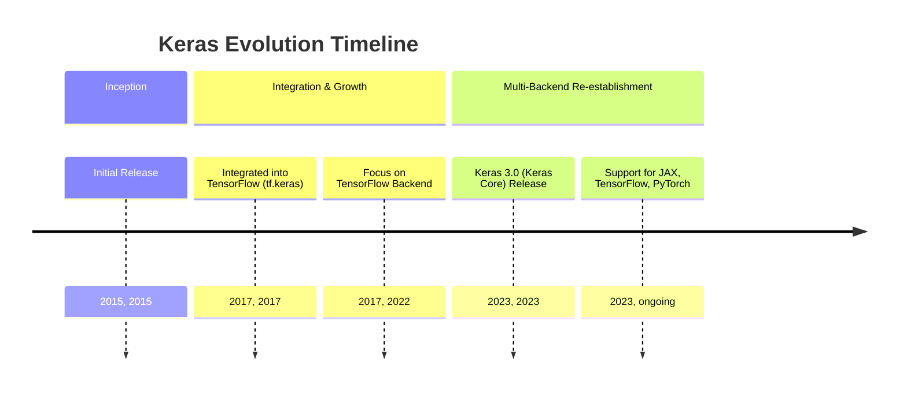
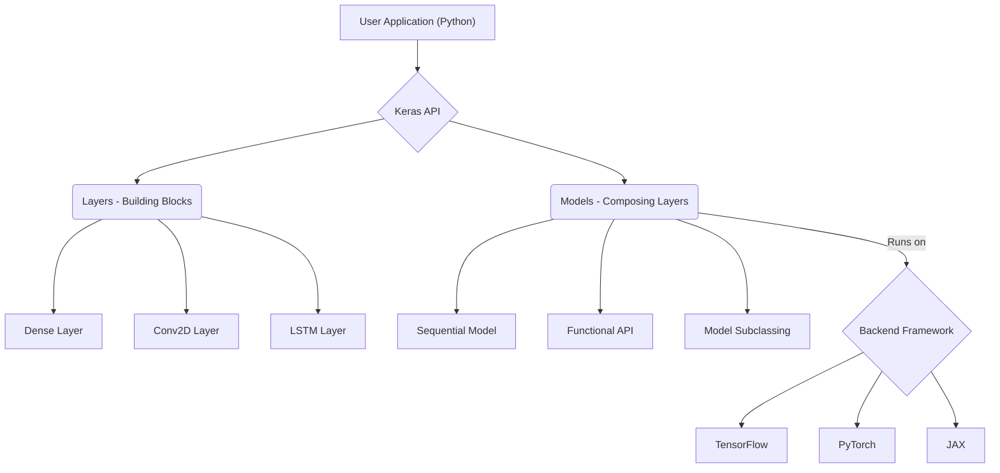
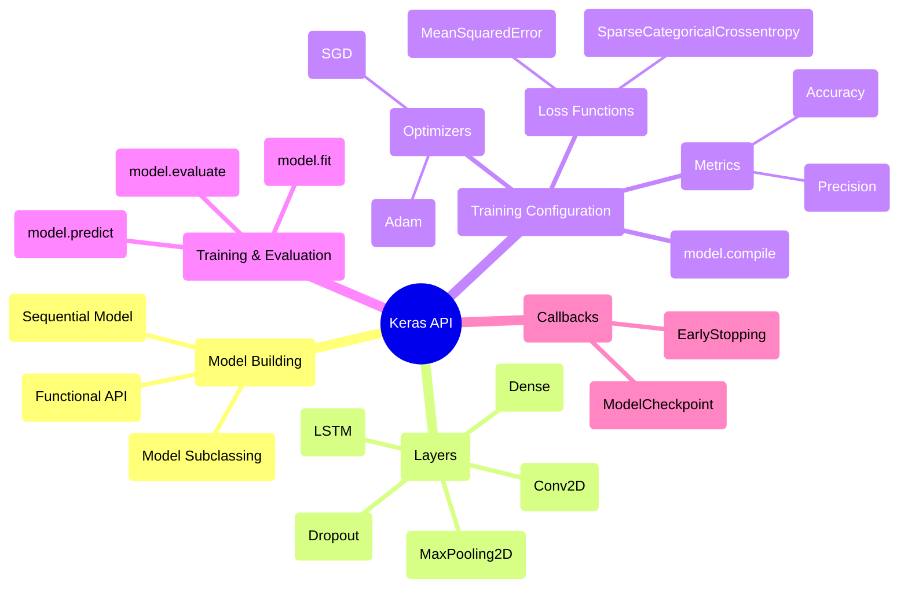

## Keras Evolution Document

### 1. Introduction and Historical Context

Keras is a high-level, open-source deep learning API written in Python, designed for fast experimentation with neural networks. It provides a user-friendly interface that simplifies the process of building, training, and evaluating deep learning models. Keras is known for its modularity, extensibility, and ease of use, making it a popular choice for both researchers and developers.

Keras was developed by Google engineer François Chollet and first released in March 2015 as part of the ONEIROS research project. Its initial goal was to enable rapid prototyping and experimentation with deep neural networks. A significant turning point came in 2017 when Keras was integrated into TensorFlow as `tf.keras`, becoming its official high-level API. This integration greatly boosted its popularity and capabilities.

Initially, Keras supported multiple backends, including TensorFlow, Theano, and Microsoft Cognitive Toolkit (CNTK). However, for a period, it primarily focused on TensorFlow. With the release of **Keras 3.0 (also known as Keras Core)** in 2023, the library was rewritten to re-establish multi-backend support, allowing it to run seamlessly on JAX, TensorFlow, and PyTorch, providing unparalleled flexibility to users.

### 1.1. Keras Evolution Timeline



### 2. Core Architecture

Keras's core architecture is built around the concepts of **Layers** and **Models**, emphasizing modularity and composition. It provides a high-level abstraction over the underlying deep learning frameworks, allowing users to focus on model design rather than low-level implementation details.

#### 2.1. Layers: The Building Blocks

*   **Layers**: The fundamental building blocks of neural networks in Keras. Each layer represents a simple input/output transformation and encapsulates its own state (weights) and computation. Keras offers a rich set of pre-built layers, including:
    *   **Core Layers**: `Dense`, `Activation`, `Flatten`, `Input`
    *   **Convolutional Layers**: `Conv2D`, `Conv1D`
    *   **Pooling Layers**: `MaxPooling2D`, `AveragePooling2D`
    *   **Recurrent Layers**: `LSTM`, `GRU`
    *   **Normalization Layers**: `BatchNormalization`
    *   **Dropout Layers**: `Dropout`

#### 2.2. Models: Composing Layers

Models in Keras are used to group layers together and can be trained on data. Keras provides several ways to construct models, catering to different levels of complexity and flexibility:

*   **Sequential Model**: The simplest type of model, representing a linear stack of layers. Ideal for simple feed-forward networks.
*   **Functional API**: A more flexible way to build models, allowing for arbitrary graphs of layers. This enables multi-input, multi-output models, shared layers, and complex topologies.
*   **Model Subclassing**: For advanced users who require complete control over the model's forward pass, Keras allows subclassing the `tf.keras.Model` class (or `keras.Model` in Keras 3.0) to define custom models from scratch.

#### 2.3. Multi-Backend Support (Keras 3.0)

A significant architectural shift with Keras 3.0 is its re-establishment of true multi-backend support. This means the same Keras code can run on different deep learning frameworks (JAX, TensorFlow, PyTorch) by simply changing a configuration setting. This provides unparalleled flexibility and allows users to leverage the strengths of different backends without rewriting their models.

**Mermaid Diagram: Keras Core Architecture**



### 3. Detailed API Overview

Keras's API is designed to be intuitive and cover the entire deep learning workflow.

#### 3.1. Model Building

*   **`keras.Sequential([...])`**: Creates a linear stack of layers.
*   **`keras.Input(shape)`**: Used with the Functional API to define input tensors.
*   **`keras.Model(inputs, outputs)`**: Creates a model using the Functional API.

#### 3.2. Layers (`keras.layers`)

*   **`Dense(units, activation=None)`**: A densely connected neural network layer.
*   **`Conv2D(filters, kernel_size, ...)`**: 2D convolution layer (e.g., for image processing).
*   **`MaxPooling2D(pool_size)`**: Max pooling operation for 2D spatial data.
*   **`LSTM(units)`**: Long Short-Term Memory layer (recurrent neural network).
*   **`Dropout(rate)`**: Applies Dropout to the input.

#### 3.3. Training Configuration

*   **`model.compile(optimizer, loss, metrics)`**: Configures the model for training.
    *   **Optimizers (`keras.optimizers`)**: `Adam()`, `SGD()`, `RMSprop()`
    *   **Loss Functions (`keras.losses`)**: `SparseCategoricalCrossentropy()`, `MeanSquaredError()`
    *   **Metrics (`keras.metrics`)**: `Accuracy()`, `Precision()`, `Recall()`

#### 3.4. Training and Evaluation

*   **`model.fit(x, y, epochs, batch_size, validation_data, ...)`**: Trains the model.
*   **`model.evaluate(x, y, ...)`**: Returns the loss value & metrics values for the model in test mode.
*   **`model.predict(x)`**: Generates output predictions for the input samples.

#### 3.5. Callbacks (`keras.callbacks`)

*   **`EarlyStopping(monitor, patience)`**: Stop training when a monitored metric has stopped improving.
*   **`ModelCheckpoint(filepath, monitor, save_best_only)`**: Save the model after every epoch.

### 3.6. API Mindmap



### 4. Evolution and Impact

*   **Simplifying Deep Learning:** Keras has significantly lowered the barrier to entry for deep learning, allowing more developers and researchers to build and experiment with neural networks quickly.
*   **Rapid Prototyping:** Its user-friendly API and modular design enable rapid prototyping and iteration, accelerating the development cycle of deep learning projects.
*   **Standard for High-Level APIs:** Keras has influenced the design of high-level APIs in other deep learning frameworks, becoming a de facto standard for how deep learning models should be built at a higher abstraction level.
*   **Multi-Backend Flexibility (Keras 3.0):** The re-introduction of robust multi-backend support in Keras 3.0 is a game-changer, offering unprecedented flexibility to users who can now choose their preferred backend (TensorFlow, PyTorch, JAX) without changing their model code. This promotes interoperability and reduces vendor lock-in.
*   **Strong Community and Ecosystem:** Keras benefits from a large and active community, contributing to its continuous development, extensive documentation, and a rich ecosystem of compatible tools and resources.

### 5. Conclusion

Keras has evolved from a standalone library to a powerful, multi-backend deep learning API that simplifies complex neural network tasks. Its consistent focus on user-friendliness, modularity, and rapid experimentation has made it an indispensable tool for deep learning practitioners. With Keras 3.0's renewed commitment to backend agnosticism, it continues to empower users with flexibility and efficiency, solidifying its position as a leading choice for building and deploying deep learning solutions across various domains.

### 6. Typical use cases

#### 6.1. Sequential model for classification

```python
import keras
from keras import layers

model = keras.Sequential([
    layers.Input((784,)),
    layers.Dense(128, activation="relu"),
    layers.Dropout(0.2),
    layers.Dense(10, activation="softmax")
])
model.compile(optimizer="adam", loss="sparse_categorical_crossentropy", metrics=["accuracy"])
```

#### 6.2. Functional API with branching

```python
from keras import layers, Model, Input

inp = Input((32,))
x1 = layers.Dense(64, activation="relu")(inp)
x2 = layers.Dense(64, activation="relu")(inp)
concat = layers.Concatenate()([x1, x2])
out = layers.Dense(1)(concat)
model = Model(inp, out)
model.compile(optimizer="adam", loss="mse")
```

#### 6.3. Training with callbacks

```python
from keras.callbacks import EarlyStopping, ModelCheckpoint

es = EarlyStopping(monitor="val_loss", patience=3)
mcp = ModelCheckpoint("best.keras", monitor="val_loss", save_best_only=True)
model.fit(X_train, y_train, epochs=20, batch_size=64, validation_split=0.2, callbacks=[es, mcp])
```