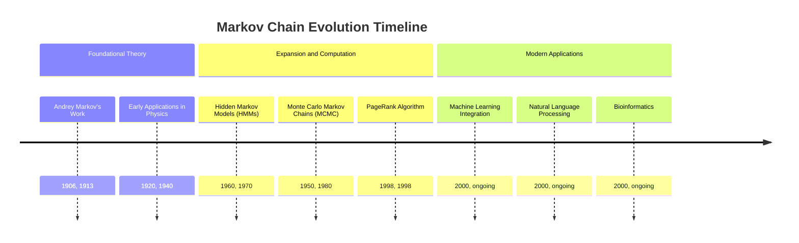
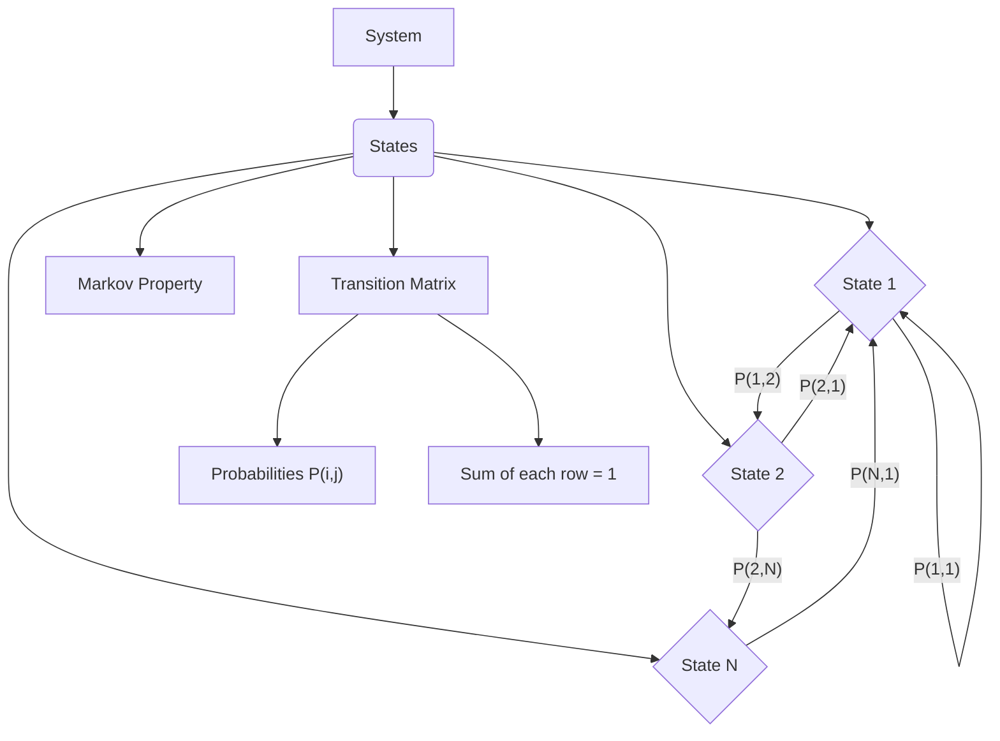
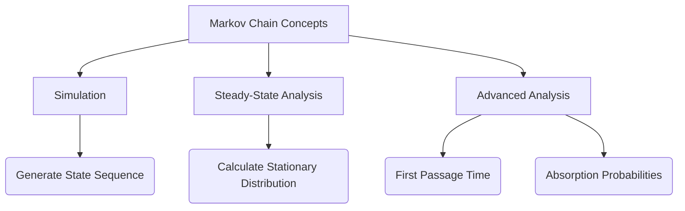
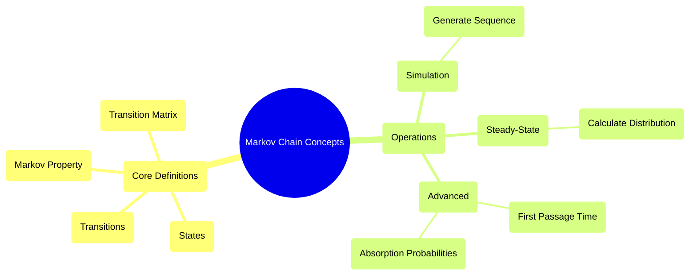

## Markov Chain Evolution Document

### 1. Introduction and Historical Context

Markov chains, named after the Russian mathematician Andrey Markov, are a fundamental concept in probability theory and statistics. They describe a sequence of possible events in which the probability of each event depends only on the state attained in the previous event. This "memoryless" property, known as the Markov property, makes them incredibly powerful for modeling systems that evolve over time through a series of states.

Their applications span a vast array of fields, including physics, chemistry, biology, economics, computer science, and natural language processing. From modeling the movement of particles to predicting stock prices, and from understanding genetic sequences to powering Google's PageRank algorithm, Markov chains provide a robust framework for analyzing sequential data and predicting future behavior based on current states.

### 1.1. Markov Chain Evolution Timeline



### 2. Core Concepts and Architecture

The core of a Markov chain lies in its states and the transitions between them, governed by probabilities.

#### 2.1. States and Transitions

**Mental Model / Analogy:**
Imagine a game board where you move a token between different squares. Each square represents a "state" (e.g., "Start," "Jail," "Property A"). The dice roll determines your "transition" to the next square. In a Markov chain, instead of a dice roll, you have probabilities that dictate the likelihood of moving from your current square (state) to any other square. The key is that *only* your current square matters for your next move, not how you got to the current square.

*   **States:** These are the possible outcomes or conditions of the system being modeled. For example, in a weather model, states might be "Sunny," "Cloudy," or "Rainy." In a language model, states could be individual words.
*   **Transitions:** These are the movements from one state to another. Each transition has an associated probability.

#### 2.2. Markov Property

The defining characteristic of a Markov chain is the **Markov property**. It states that the future state of the system depends only on its current state, and not on the sequence of events that preceded it. In simpler terms, "memorylessness."

*   **Context:** The probability of moving to the next state depends *only* on the current state, not on the history of states visited before.
*   **Implication:** This property greatly simplifies the mathematical analysis and modeling of complex systems.

#### 2.3. Transition Matrix

The probabilities of transitioning between states are typically organized into a **transition matrix** (also known as a stochastic matrix).

*   **Structure:** A square matrix where each element `P(i, j)` represents the probability of moving from state `i` to state `j`.
*   **Properties:**
    *   Each element `P(i, j)` is between 0 and 1 (inclusive).
    *   The sum of probabilities in each row must equal 1 (since the system must transition to *some* state from state `i`).

**Mermaid Diagram: Markov Chain Core Architecture**



### 3. Detailed API Overview (Conceptual)

While Markov chains are a mathematical concept, their practical application involves computational tools. This section outlines how one might interact with Markov chain concepts using common programming paradigms and libraries (e.g., NumPy for matrix operations, SciPy for specific algorithms).

#### 3.1. Simulating Markov Chains

**Goal:** Generate a sequence of states based on a given transition matrix and an initial state.

**Conceptual Code (Python with NumPy):**
```python
import numpy as np

# Example: Weather model (Sunny, Cloudy, Rainy)
# Transition matrix P[i, j] = P(next state is j | current state is i)
# Rows: Current state, Columns: Next state
# P = [[P_SS, P_SC, P_SR],
#      [P_CS, P_CC, P_CR],
#      [P_RS, P_RC, P_RR]]
transition_matrix = np.array([
    [0.7, 0.2, 0.1],  # Sunny -> Sunny, Cloudy, Rainy
    [0.3, 0.4, 0.3],  # Cloudy -> Sunny, Cloudy, Rainy
    [0.2, 0.3, 0.5]   # Rainy -> Sunny, Cloudy, Rainy
])

states = ["Sunny", "Cloudy", "Rainy"]
current_state_index = 0 # Start with Sunny
simulation_length = 10
simulated_sequence = [states[current_state_index]]

print(f"Starting state: {states[current_state_index]}")

for _ in range(simulation_length - 1):
    # Get probabilities for the current state
    current_state_probabilities = transition_matrix[current_state_index, :]
    
    # Choose the next state based on these probabilities
    next_state_index = np.random.choice(len(states), p=current_state_probabilities)
    
    simulated_sequence.append(states[next_state_index])
    current_state_index = next_state_index

print(f"Simulated sequence: {simulated_sequence}")
```

**Explanation:** Simulation involves iteratively choosing the next state based on the probabilities defined by the current state's row in the transition matrix. `np.random.choice` is a common function used for this probabilistic selection.

*   **Context:** Generating a path or sequence of states that the Markov chain might take over time.
*   **Parameters (Conceptual):**
    *   `transition_matrix`: The matrix defining state transition probabilities.
    *   `initial_state`: The starting state of the simulation.
    *   `num_steps`: The number of steps to simulate.
*   **Returns (Conceptual):** A list or array representing the sequence of visited states.

#### 3.2. Calculating Steady-State Distribution

**Goal:** Find the long-term probability distribution of being in each state, assuming the Markov chain is irreducible and aperiodic.

**Conceptual Code (Python with NumPy/SciPy):**
```python
import numpy as np
from scipy.linalg import eig

# Example transition matrix (same as above)
transition_matrix = np.array([
    [0.7, 0.2, 0.1],
    [0.3, 0.4, 0.3],
    [0.2, 0.3, 0.5]
])

# For steady-state, we need to solve (P^T - I)pi = 0, where pi is the steady-state vector
# and sum(pi) = 1.
# This is equivalent to finding the left eigenvector of P corresponding to eigenvalue 1.
# Or, finding the right eigenvector of P.T corresponding to eigenvalue 1.

eigenvalues, eigenvectors = eig(transition_matrix.T)

# Find the eigenvector corresponding to eigenvalue 1
steady_state_vector = None
for i in range(len(eigenvalues)):
    if np.isclose(eigenvalues[i], 1.0):
        steady_state_vector = eigenvectors[:, i]
        break

if steady_state_vector is not None:
    # Normalize the vector so its elements sum to 1
    steady_state_distribution = steady_state_vector / np.sum(steady_state_vector)
    # Ensure real values (eigenvectors can be complex due to numerical precision)
    steady_state_distribution = np.real(steady_state_distribution)
    print(f"Steady-state distribution: {steady_state_distribution}")
    print(f"Sum of probabilities: {np.sum(steady_state_distribution):.4f}")
else:
    print("Could not find steady-state distribution (eigenvalue 1 not found).")

# A simpler approach for some cases: raise P to a large power
# P_large_power = np.linalg.matrix_power(transition_matrix, 1000)
# print(f"
Transition matrix raised to a large power (first row is steady state):
{P_large_power[0, :]}")
```

**Explanation:** The steady-state distribution `π` is a probability vector such that `πP = π`. This means that if the system is in the steady-state distribution, it will remain in that distribution after one transition. Mathematically, it's the left eigenvector of the transition matrix `P` corresponding to an eigenvalue of 1. Libraries like SciPy's `linalg.eig` can be used to find eigenvectors.

*   **Context:** Determining the long-run probabilities of the system being in each state.
*   **Parameters (Conceptual):**
    *   `transition_matrix`: The matrix defining state transition probabilities.
    *   `initial_state`: The starting state of the simulation.
    *   `num_steps`: The number of steps to simulate.
*   **Returns (Conceptual):** A probability distribution (vector) where each element represents the long-term probability of being in a corresponding state.

#### 3.3. Quick Reference: Markov Chain Operations (Conceptual)

| Operation | Description | When to Use |
| :--- | :--- | :--- |
| **Simulation** | Generate a sequence of states over time. | Understanding possible paths, generating sample data, predicting short-term behavior. |
| **Steady-State Calculation** | Find long-term state probabilities. | Analyzing long-run behavior, understanding equilibrium, PageRank-like applications. |
| **First Passage Time** | Calculate expected time to reach a specific state. | Reliability analysis, queuing theory, biological modeling. |
| **Absorption Probabilities** | Probability of being absorbed into a specific absorbing state. | Risk analysis, game theory. |

#### 3.4. Simplified Markov Chain Conceptual API Structure



#### 3.5. API Mindmap



### 4. Evolution and Impact

The evolution of Markov chains has been characterized by both theoretical advancements and an explosion of practical applications.

*   **Theoretical Foundations:** Andrey Markov's initial work laid the groundwork for stochastic processes with the memoryless property. Subsequent mathematicians expanded the theory, leading to concepts like ergodicity, irreducibility, and periodicity, which are crucial for understanding the long-term behavior of chains.
*   **Computational Methods:** The development of efficient algorithms for simulating Markov chains and calculating their steady-state distributions (often leveraging linear algebra libraries like LAPACK, which NumPy wraps) has been critical. The rise of Monte Carlo Markov Chains (MCMC) in the mid-20th century revolutionized statistical inference, allowing for sampling from complex probability distributions.
*   **Hidden Markov Models (HMMs):** A significant extension, HMMs, allow for modeling systems where the underlying states are not directly observable, but can be inferred from observable outputs. This led to breakthroughs in speech recognition, bioinformatics (e.g., gene finding), and natural language processing.
*   **PageRank Algorithm:** One of the most famous applications, Google's PageRank, uses a Markov chain to model a random web surfer's behavior, determining the importance of web pages based on the probability of reaching them.
*   **Integration with Machine Learning:** Markov chains and their variants (like Markov Random Fields) are integral to various machine learning algorithms, particularly in sequence modeling, reinforcement learning (e.g., Markov Decision Processes), and graphical models.

### 5. Conclusion

Markov chains stand as a testament to the enduring power of probabilistic modeling. From their humble beginnings in theoretical mathematics, they have evolved into an indispensable tool for understanding and predicting complex systems across virtually every scientific and engineering discipline. Their elegant simplicity, combined with their profound ability to capture sequential dependencies, ensures their continued relevance in an increasingly data-driven world.
