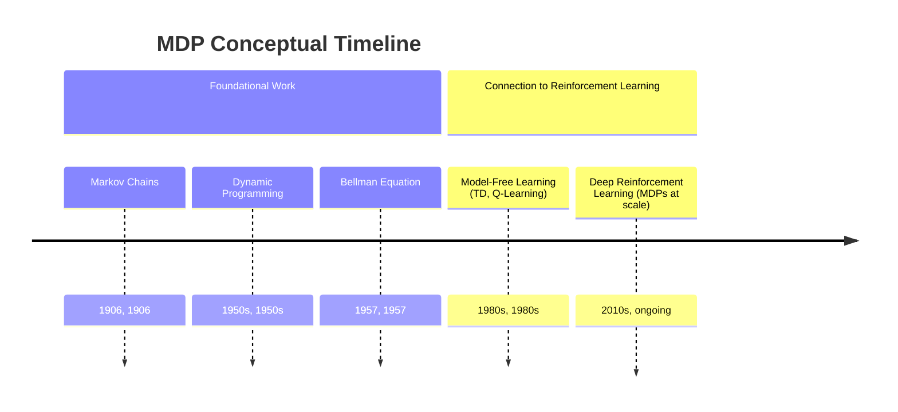
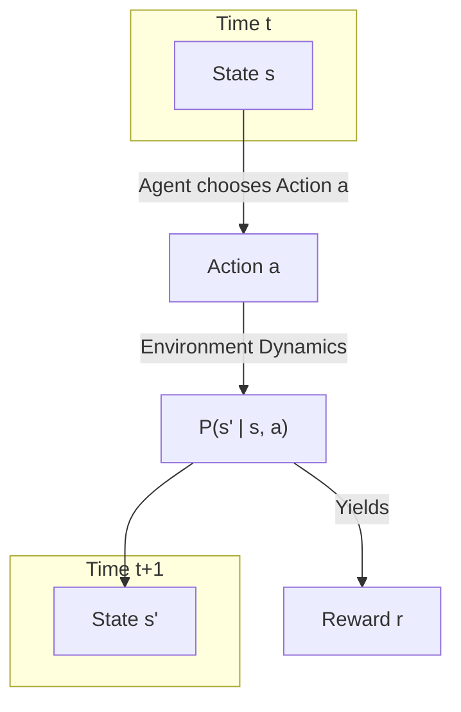

## Markov Decision Process Evolution Document

### 1. Introduction and Historical Context

A Markov Decision Process (MDP) is a mathematical framework for modeling decision-making in situations where outcomes are partly random and partly under the control of a decision-maker. It provides the formal foundation for Reinforcement Learning (RL). The "Markov" property, named after the Russian mathematician Andrey Markov, is the core assumption: it states that the future is independent of the past, given the present. In other words, the current state `S_t` captures all the information needed to make an optimal decision; the history of how the agent arrived at `S_t` is irrelevant.

The concept of MDPs was developed in the 1950s by Richard Bellman, who introduced **dynamic programming** and the **Bellman equation**. These tools provided a way to solve for optimal policies in systems that could be modeled as MDPs. For decades, MDPs were primarily used in fields like operations research, control theory, and economics to solve problems with known models (i.e., where the transition probabilities and reward functions were given).

The connection to machine learning and AI became prominent in the late 1980s with the rise of Reinforcement Learning. RL provided a way to solve MDPs when the model was *unknown*. Algorithms like Q-learning and TD-learning allowed an agent to learn an optimal policy through trial-and-error interaction with the environment, effectively learning the underlying MDP dynamics implicitly. Today, the MDP framework is the standard way to formalize nearly all RL problems, from simple grid worlds to complex games like Go.

### 1.1. MDP Conceptual Timeline

### 2. Core Components of an MDP

**Mental Model / Analogy:**
Imagine playing a classic board game like Snakes and Ladders. The goal is to be the first player to reach the final square on the board. On your turn, you roll a die and move your piece that many squares. The board also contains "ladders" that let you jump ahead to a higher square, and "snakes" that slide you back down to a lower square.

This game is a perfect analogy for an MDP:
*   **Agent:** You are the agent.
*   **State (S):** Your specific square on the board is the current state.
*   **Action (A):** The action is rolling the die.
*   **Transition (P):** The rules of the game and the random die roll determine the probability of moving to the next state. Landing on a ladder is a transition to a much better state, while landing on a snake is a transition to a worse one.
*   **Reward (R):** You might get a small negative reward for each move (to encourage finishing quickly) and a large positive reward for reaching the final square.
*   **Policy (π):** In a simple game like this, your policy is fixed (you always roll the die). In a more complex game like chess, your policy would be the strategy you use to decide which piece to move.

An MDP is the formal mathematical framework for describing this kind of goal-oriented, step-by-step process with elements of chance. Reinforcement learning is the process of learning the best strategy to win the game, even if you don't initially know the exact layout of the snakes and ladders.

An MDP is formally defined as a tuple `(S, A, P, R, γ)`.

*   **S (States):** A finite set of possible states. The state represents a complete description of the world at a particular time. For example, in a chess game, the state is the position of all pieces on the board.
*   **A (Actions):** A finite set of possible actions available to the agent. In a given state `s`, the agent can choose to take an action `a`.
*   **P (Transition Probability Function):** `P(s' | s, a)` is the probability of transitioning to state `s'` after taking action `a` in state `s`. This defines the dynamics of the environment.
*   **R (Reward Function):** `R(s, a, s')` is the immediate reward received after transitioning from state `s` to state `s'`, due to action `a`.
*   **γ (Discount Factor):** `γ` is a value between 0 and 1 that represents the discount factor. It determines the importance of future rewards. A value of 0 makes the agent "myopic" (only caring about immediate rewards), while a value close to 1 makes it strive for long-term high rewards.

The agent's goal is to find a **policy (π)**, which is a function `π(a|s)` that specifies the probability of taking action `a` in state `s`. The objective is to find an **optimal policy (π*)** that maximizes the expected cumulative discounted reward.

**Mermaid Diagram: MDP Components and Flow**

### 3. The Bellman Equation: The Core of MDPs

The Bellman equation, developed by Richard Bellman, is the cornerstone of solving MDPs. It provides a recursive definition for the value of a state, breaking it down into the immediate reward plus the discounted value of the next state.

#### 3.1. Value Functions

*   **State-Value Function (Vπ(s)):** The expected return when starting in state `s` and following policy `π` thereafter.
*   **Action-Value Function (Qπ(s, a)):** The expected return when starting in state `s`, taking action `a`, and thereafter following policy `π`.

#### 3.2. The Bellman Expectation Equation

This equation calculates the value of a state `s` under a given policy `π`. It averages over all possible actions and next states.

`Vπ(s) = Σ_a π(a|s) Σ_{s'} P(s'|s, a) [R(s, a, s') + γVπ(s')]`

It essentially says: "The value of being in state `s` is the sum, over all possible actions, of the probability of taking that action, times the expected reward you'll get."

#### 3.3. The Bellman Optimality Equation

This equation defines the value of a state `s` under the *optimal* policy `π*`. It states that the value of a state under an optimal policy must equal the expected return for the best action from that state.

`V*(s) = max_a Σ_{s'} P(s'|s, a) [R(s, a, s') + γV*(s')]`

The key difference is the `max_a` operator. Instead of averaging over the policy's actions, it simply chooses the single best action. If we can solve this equation, we can find the optimal policy.

### 4. Solving MDPs

There are two main scenarios for solving MDPs:

#### 4.1. When the Model is Known (Planning)

If the transition probabilities `P` and reward function `R` are known, we can use dynamic programming methods to find the optimal policy.

*   **Value Iteration:** An iterative algorithm that starts with a random value function and repeatedly applies the Bellman optimality equation to update the values until they converge to the optimal values `V*`.
*   **Policy Iteration:** An algorithm that alternates between two steps:
    1.  **Policy Evaluation:** Calculate the value function `Vπ` for the current policy `π`.
    2.  **Policy Improvement:** Improve the policy by acting greedily with respect to the calculated value function.

#### 4.2. When the Model is Unknown (Reinforcement Learning)

This is the more common and challenging scenario in AI. The agent does not know `P` or `R` and must learn them through interaction with the environment.

*   **Model-Free RL:** Algorithms like **Q-learning** and **SARSA** learn the optimal action-value function `Q*` directly through trial and error, without ever explicitly learning the transition model `P`. They use the agent's experiences (tuples of `(s, a, r, s')`) to iteratively update their Q-value estimates, eventually converging to the optimal values. This is the essence of most modern RL.

### 5. Practical Example: A Simple Grid World

Consider a simple 2x2 grid world.
*   **States (S):** Four states: `(0,0), (0,1), (1,0), (1,1)`.
*   **Actions (A):** `up, down, left, right`.
*   **Transition (P):** Deterministic. Taking an action moves the agent one step in that direction. If the agent hits a wall, it stays in the same state.
*   **Reward (R):** +1 for reaching a goal state `(1,1)`, -1 for falling into a hole `(1,0)`, and -0.1 for all other transitions (to encourage finding the goal quickly).
*   **Discount (γ):** 0.9.

An RL agent placed in this environment would initially take random actions. Over many episodes, it would learn:
1.  The action "right" in state `(0,1)` leads to the high-reward state `(1,1)`. Therefore, the Q-value `Q((0,1), right)` will increase.
2.  The action "down" in state `(0,0)` leads to the high-penalty state `(1,0)`. Therefore, the Q-value `Q((0,0), down)` will decrease.

Eventually, the agent's learned Q-values will guide it to the optimal policy, which is to always take actions that lead towards the goal state `(1,1)`.

### 6. Conclusion

The Markov Decision Process is the theoretical bedrock upon which modern Reinforcement Learning is built. It provides a simple yet powerful mathematical language to describe the problem of learning from interaction to achieve a goal. While classical dynamic programming methods can solve MDPs with known models, the true power of the framework is realized in Reinforcement Learning, where agents can learn to solve complex, unknown MDPs through experience. Understanding the core components of an MDP and the logic of the Bellman equation is essential for anyone looking to delve deeper into the theory and practice of Reinforcement Learning.
