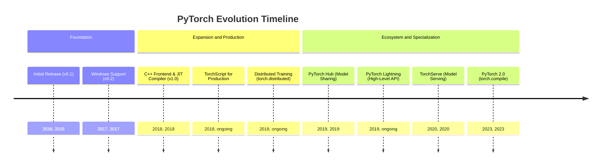
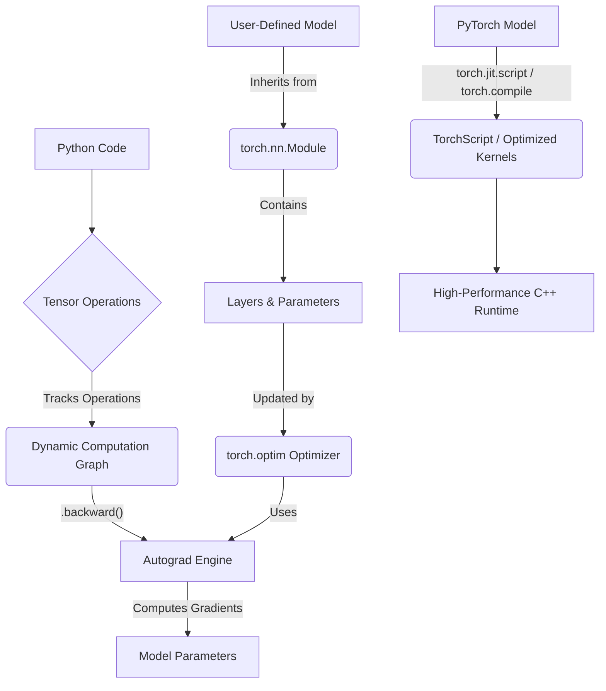
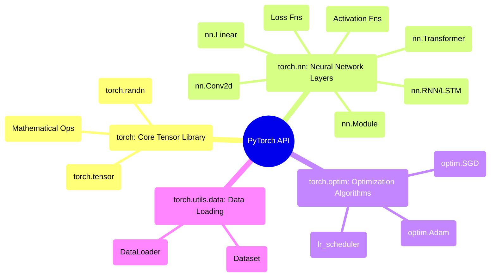

## PyTorch Evolution Document

### 1. Introduction and Historical Context

PyTorch is a leading open-source machine learning framework, widely known for its flexibility, ease of use, and strong community support. It is primarily developed by Meta AI and is celebrated for its "Pythonic" feel, which makes it a favorite among researchers and developers for rapid prototyping and building complex neural network architectures.

PyTorch's origins lie in the **Torch** framework, which was first released in 2002 and written in the Lua programming language. While powerful, Torch's use of Lua was a barrier to adoption in the Python-dominated machine learning community. Recognizing this, a team at Meta (then Facebook) created PyTorch, a Python-first deep learning library that combined the flexibility of Torch with the ease of use of Python.

The first public release of PyTorch in 2016 was a turning point. It introduced a dynamic computation graph (a "define-by-run" approach), which was a major departure from the static graphs used by frameworks like TensorFlow at the time. This dynamic nature made debugging easier and allowed for more flexible model architectures, especially in natural language processing (NLP).

### 1.1. PyTorch Evolution Timeline

### 2. Core Architecture

PyTorch's architecture is designed to be both flexible for research and robust for production. Its core components work together to provide a seamless experience from model definition to training and deployment.

#### 2.1. Tensors

The fundamental data structure in PyTorch is the **Tensor** (`torch.Tensor`), which is conceptually similar to a NumPy `ndarray`. Tensors are multi-dimensional arrays that can run on either a CPU or a GPU. The ability to effortlessly move tensors to a GPU is a cornerstone of PyTorch's performance for deep learning.

#### 2.2. Dynamic Computation Graphs and Autograd

This is PyTorch's most defining feature. Instead of pre-defining a static graph of computations, PyTorch builds the graph on the fly as operations are executed. This "define-by-run" approach allows for dynamic model architectures where the structure of the computation can change at every iteration.

The **`autograd`** engine is responsible for automatically computing the gradients (derivatives) of tensor operations. When a tensor is created with `requires_grad=True`, PyTorch tracks all operations performed on it. When `.backward()` is called on a final (scalar) tensor, `autograd` traverses the computation graph backward and computes the gradients for all tensors that require them.

#### 2.3. Modules (`torch.nn`) and Optimizers (`torch.optim`)

*   **`torch.nn.Module`:** This is the base class for all neural network modules (e.g., layers, loss functions). Models in PyTorch are built by subclassing `nn.Module` and defining the layers in the `__init__` method and the forward pass logic in the `forward` method.
*   **`torch.optim`:** This package provides a wide range of optimization algorithms (like SGD, Adam, RMSprop) used to update the model's parameters based on the computed gradients.

#### 2.4. JIT Compiler and TorchScript

While the dynamic graph is excellent for research, it can be less efficient for production deployment. To bridge this gap, PyTorch introduced the **Just-In-Time (JIT) compiler** and **TorchScript**. TorchScript is a subset of Python that can be understood and optimized by the PyTorch JIT. It allows you to convert a dynamic PyTorch model into a static graph representation that can be run in high-performance environments (like C++) where a Python interpreter is not available. The introduction of **`torch.compile`** in PyTorch 2.0 further enhanced this by providing a simple function to JIT-compile Python code into optimized kernels.

**Mermaid Diagram: PyTorch Core Architecture**

### 3. Detailed API Overview

PyTorch's API is organized into a set of libraries that provide the tools for building, training, and deploying machine learning models.

#### 3.1. `torch`: Core Tensor Library

This is the main namespace, providing the `Tensor` object and a vast collection of mathematical functions that operate on tensors.

*   **`torch.tensor(data, ...)`**: Creates a tensor from a Python list or NumPy array.
*   **`torch.randn(size, ...)`**: Creates a tensor with random numbers from a standard normal distribution.
*   **Mathematical Operations**: A rich library of functions like `torch.matmul`, `torch.sum`, `torch.sigmoid`, etc.

#### 3.2. `torch.nn`: Neural Network Layers

This module provides the building blocks for creating neural networks.

*   **`nn.Module`**: The base class for all models.
*   **Layers**: A comprehensive set of layers, including:
    *   `nn.Linear(in_features, out_features)`: A fully connected layer.
    *   `nn.Conv2d(...)`: A 2D convolution layer for image data.
    *   `nn.RNN(...)`, `nn.LSTM(...)`: Recurrent layers for sequence data.
    *   `nn.Transformer(...)`: The standard Transformer architecture.
*   **Activation Functions**: `nn.ReLU`, `nn.Sigmoid`, `nn.Softmax`, etc.
*   **Loss Functions**: `nn.MSELoss`, `nn.CrossEntropyLoss`, `nn.BCELoss`, etc.

#### 3.3. `torch.optim`: Optimization Algorithms

This module contains optimizers for training models.

*   **`optim.SGD(params, lr=...)`**: Stochastic Gradient Descent.
*   **`optim.Adam(params, lr=...)`**: The Adam optimizer, widely used in deep learning.
*   **`optim.lr_scheduler`**: Sub-module for adjusting the learning rate during training.

#### 3.4. `torch.utils.data`: Data Loading and Handling

This module provides tools for creating efficient data loading pipelines.

*   **`Dataset`**: An abstract class for representing a dataset. Users create custom datasets by subclassing it.
*   **`DataLoader`**: Wraps a `Dataset` and provides an iterable over the dataset, with features like batching, shuffling, and parallel data loading.

### 3.5. API Mindmap

### 4. Evolution and Impact

*   **From Research to Production:** PyTorch's evolution has been heavily focused on bridging the gap between research and production. The introduction of TorchScript, TorchServe (for model serving), and the C++ frontend were crucial steps in making PyTorch a production-ready framework.
*   **The Rise of Dynamic Graphs:** PyTorch's "define-by-run" philosophy had a profound impact on the machine learning landscape, pushing other frameworks to adopt more dynamic and imperative approaches (e.g., TensorFlow's Eager Execution).
*   **Compiler-First Approach (PyTorch 2.0):** The release of PyTorch 2.0 with `torch.compile` marked a major strategic shift. Instead of requiring users to explicitly convert models to a static graph format (like TorchScript), it provides a compiler that can automatically optimize standard Python code for performance, offering the best of both worlds: the flexibility of eager execution and the speed of a compiled graph.
*   **A Rich Ecosystem:** PyTorch's success has led to a thriving ecosystem of libraries built on top of it. Libraries like **Hugging Face Transformers** (for NLP), **PyTorch Lightning** (for high-level training loops), and **fastai** have made it even easier to build state-of-the-art models.

### 5. Conclusion

PyTorch has fundamentally changed the way machine learning models are developed. Its focus on user experience, flexibility, and a "Pythonic" approach has made it the framework of choice for a vast community of researchers and practitioners. The evolution from a dynamic-first research tool to a comprehensive framework with a powerful compiler and a robust production story demonstrates its maturity and long-term vision. By successfully combining ease of use with high performance, PyTorch continues to be a driving force in the advancement of artificial intelligence.
