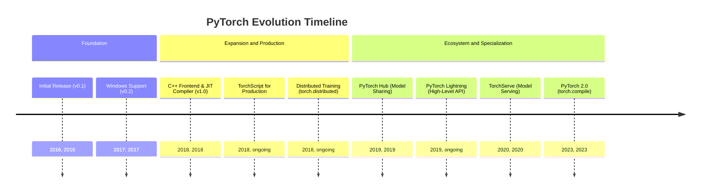
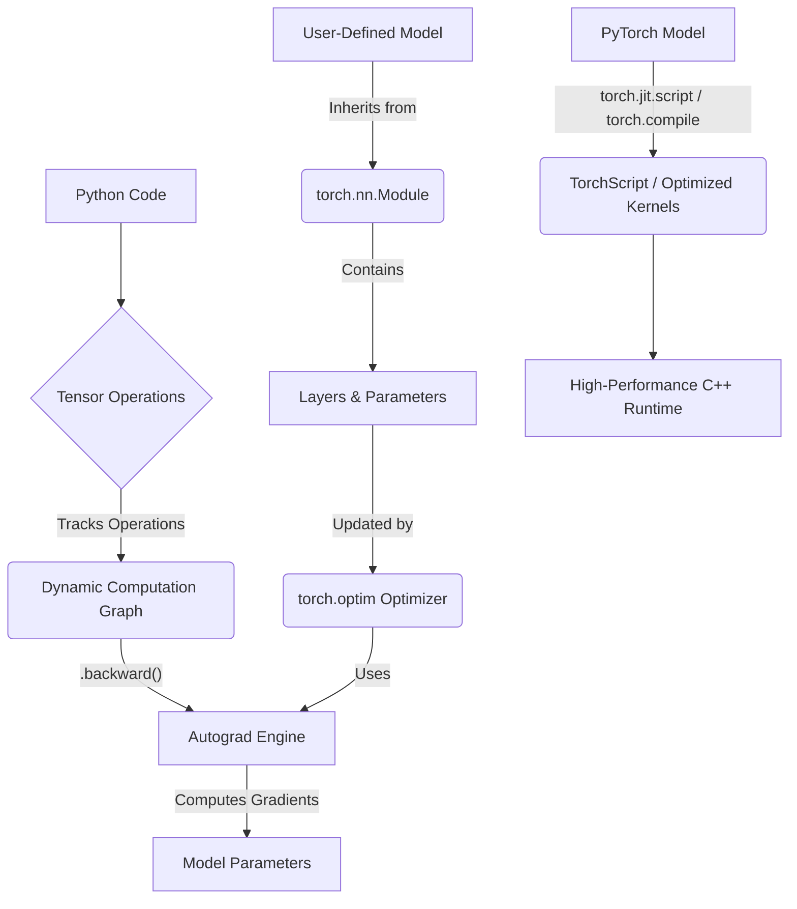
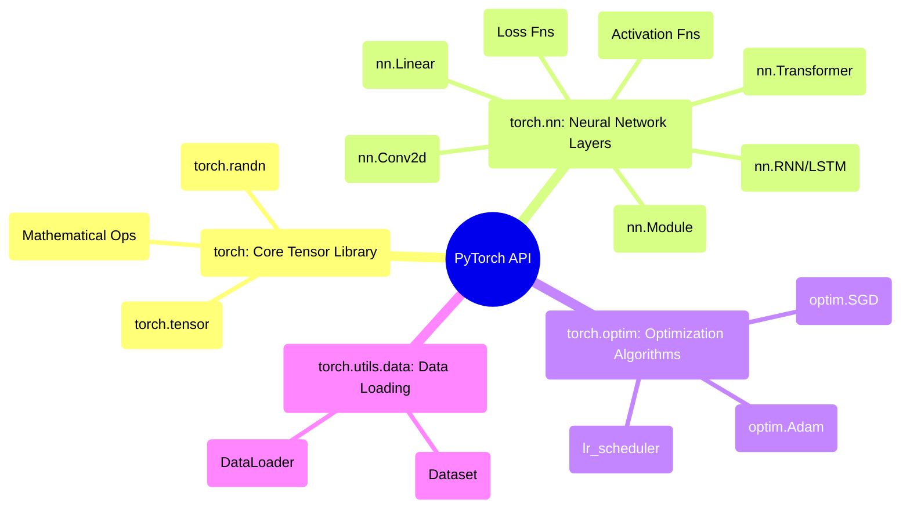

## PyTorch Evolution Document

### 1. Introduction and Historical Context

PyTorch is a leading open-source machine learning framework, widely known for its flexibility, ease of use, and strong community support. It is primarily developed by Meta AI and is celebrated for its "Pythonic" feel, which makes it a favorite among researchers and developers for rapid prototyping and building complex neural network architectures.

PyTorch's origins lie in the **Torch** framework, which was first released in 2002 and written in the Lua programming language. While powerful, Torch's use of Lua was a barrier to adoption in the Python-dominated machine learning community. Recognizing this, a team at Meta (then Facebook) created PyTorch, a Python-first deep learning library that combined the flexibility of Torch with the ease of use of Python.

The first public release of PyTorch in 2016 was a turning point. It introduced a dynamic computation graph (a "define-by-run" approach), which was a major departure from the static graphs used by frameworks like TensorFlow at the time. This dynamic nature made debugging easier and allowed for more flexible model architectures, especially in natural language processing (NLP).

### 1.1. PyTorch Evolution Timeline



### 2. Core Architecture

PyTorch's architecture is designed to be both flexible for research and robust for production. Its core components work together to provide a seamless experience from model definition to training and deployment.

#### 2.1. Tensors

**Mental Model / Analogy:**
Think of a **Tensor** as a super-powered, multi-dimensional array, much like a NumPy `ndarray`. You can have:
*   A **0D tensor** (a scalar): a single number, like `5`.
*   A **1D tensor** (a vector): a list of numbers, like `[1, 2, 3]`.
*   A **2D tensor** (a matrix): a table of numbers, like `[[1, 2], [3, 4]]`.
*   A **3D tensor** or higher: a cube of numbers, and so on.

The key superpower is that PyTorch can move these tensors to a GPU to perform calculations incredibly fast, which is essential for deep learning.

The fundamental data structure in PyTorch is the **Tensor** (`torch.Tensor`), which is conceptually similar to a NumPy `ndarray`. Tensors are multi-dimensional arrays that can run on either a CPU or a GPU. The ability to effortlessly move tensors to a GPU is a cornerstone of PyTorch's performance for deep learning.

#### 2.2. Dynamic Computation Graphs and Autograd

This is PyTorch's most defining feature. Instead of pre-defining a static graph of computations, PyTorch builds the graph on the fly as operations are executed. This "define-by-run" approach allows for dynamic model architectures where the structure of the computation can change at every iteration.

The **`autograd`** engine is responsible for automatically computing the gradients (derivatives) of tensor operations. When a tensor is created with `requires_grad=True`, PyTorch tracks all operations performed on it. When `.backward()` is called on a final (scalar) tensor, `autograd` traverses the computation graph backward and computes the gradients for all tensors that require them.

#### 2.3. Modules (`torch.nn`) and Optimizers (`torch.optim`)

*   **`torch.nn.Module`:** This is the base class for all neural network modules (e.g., layers, loss functions). Models in PyTorch are built by subclassing `nn.Module` and defining the layers in the `__init__` method and the forward pass logic in the `forward` method.
*   **`torch.optim`:** This package provides a wide range of optimization algorithms (like SGD, Adam, RMSprop) used to update the model's parameters based on the computed gradients.

#### 2.4. JIT Compiler and TorchScript

While the dynamic graph is excellent for research, it can be less efficient for production deployment. To bridge this gap, PyTorch introduced the **Just-In-Time (JIT) compiler** and **TorchScript**. TorchScript is a subset of Python that can be understood and optimized by the PyTorch JIT. It allows you to convert a dynamic PyTorch model into a static graph representation that can be run in high-performance environments (like C++) where a Python interpreter is not available. The introduction of **`torch.compile`** in PyTorch 2.0 further enhanced this by providing a simple function to JIT-compile Python code into optimized kernels.

**Mermaid Diagram: PyTorch Core Architecture**



### 3. Detailed API Overview

PyTorch's API is organized into a set of libraries that provide the tools for building, training, and deploying machine learning models.

#### 3.1. `torch`: Core Tensor Library

This is the main namespace, providing the `Tensor` object and a vast collection of mathematical functions that operate on tensors.

##### 3.1.1. Creating Tensors

**`torch.tensor(data, ...)`**

**Goal:** Create a PyTorch tensor from existing data, like a Python list or a NumPy array.

**Code:**
```python
import torch
import numpy as np

# From a Python list
list_data = [[1, 2], [3, 4]]
tensor_from_list = torch.tensor(list_data)
print(f"Tensor from list:\n{tensor_from_list}")

# From a NumPy array
numpy_array = np.array([5, 6, 7])
tensor_from_numpy = torch.tensor(numpy_array)
print(f"\nTensor from NumPy array:\n{tensor_from_numpy}")
```

**Expected Output:**
```
Tensor from list:
tensor([[1, 2],
        [3, 4]])

Tensor from NumPy array:
tensor([5, 6, 7])
```

**Explanation:** `torch.tensor()` is the primary way to create tensors from existing data structures. PyTorch automatically infers the data type (e.g., `torch.int64`, `torch.float32`), but you can specify it with the `dtype` argument.

*   **`torch.tensor(data, ...)`**: Creates a tensor from a Python list or NumPy array.

**`torch.randn(size, ...)`**

**Goal:** Create a tensor of a given size filled with random numbers from a standard normal distribution (mean 0, variance 1).

**Code:**
```python
import torch

# Create a 2x3 tensor of random numbers
random_tensor = torch.randn(2, 3)
print(f"Random 2x3 tensor:\n{random_tensor}")
```

**Expected Output:**
(A 2x3 tensor with random values, which will vary on each run)
```
Random 2x3 tensor:
tensor([[ 0.1234, -0.5678,  1.2345],
        [-1.5432,  0.8765, -0.2345]])
```

**Explanation:** Functions like `torch.randn()`, `torch.rand()` (uniform distribution), and `torch.ones()` are used to create tensors of a specific shape without providing the data manually. This is essential for initializing model weights and other parameters.

*   **`torch.randn(size, ...)`**: Creates a tensor with random numbers from a standard normal distribution.
*   **`torch.randn(size, ...)`**: Creates a tensor with random numbers from a standard normal distribution.

##### 3.1.2. Performing Mathematical Operations

**Mathematical Operations (`torch.matmul`, `torch.sum`, `torch.sigmoid`, etc.)**

**Goal:** Apply mathematical functions to tensors.

**Code:**
```python
import torch

t1 = torch.tensor([[1., 2.], [3., 4.]])
t2 = torch.tensor([[5., 6.], [7., 8.]])

# Element-wise addition
add_result = t1 + t2
print(f"Element-wise addition:\n{add_result}")

# Matrix multiplication
matmul_result = torch.matmul(t1, t2)
print(f"\nMatrix multiplication:\n{matmul_result}")

# Applying a non-linear function (sigmoid)
sigmoid_result = torch.sigmoid(t1)
print(f"\nSigmoid applied to t1:\n{sigmoid_result}")
```

**Expected Output:**
```
Element-wise addition:
tensor([[ 6.,  8.],
        [10., 12.]])

Matrix multiplication:
tensor([[19., 22.],
        [43., 50.]])

Sigmoid applied to t1:
tensor([[0.7311, 0.8808],
        [0.9526, 0.9820]])
```

**Explanation:** PyTorch provides a comprehensive library of mathematical operations that are highly optimized for both CPU and GPU. Standard Python operators like `+`, `-`, `*`, `/` are overloaded for element-wise operations, while functions like `torch.matmul()` are used for specific linear algebra operations.

*   **Mathematical Operations**: A rich library of functions like `torch.matmul`, `torch.sum`, `torch.sigmoid`, etc.

##### 3.1.3. Quick Reference: Core Tensor Library

| Function | Description | When to Use |
| :--- | :--- | :--- |
| `torch.tensor()` | Create tensor from data | Converting existing Python lists or NumPy arrays into tensors. |
| `torch.randn()`, `torch.rand()` | Create random tensors | Initializing weights and biases in neural networks. |
| `torch.matmul()`, `+`, `*` | Mathematical operations | Performing linear algebra and element-wise calculations in models. |

#### 3.2. `torch.nn`: Neural Network Layers

This module provides the building blocks for creating neural networks.

##### 3.2.1. Defining a Model with `nn.Module`

**`nn.Module`**

**Goal:** Create a custom neural network by defining its layers and the forward pass logic.

**Code:**
```python
import torch
import torch.nn as nn

class SimpleNet(nn.Module):
    def __init__(self):
        super(SimpleNet, self).__init__()
        # Define the layers
        self.layer1 = nn.Linear(in_features=10, out_features=32)
        self.activation = nn.ReLU()
        self.layer2 = nn.Linear(in_features=32, out_features=1)

    def forward(self, x):
        # Define the forward pass logic
        x = self.layer1(x)
        x = self.activation(x)
        x = self.layer2(x)
        return x

# Instantiate the model
model = SimpleNet()
print(model)

# Test with a dummy input
dummy_input = torch.randn(64, 10) # Batch of 64, 10 features
output = model(dummy_input)
print(f"\nOutput shape: {output.shape}")
```

**Expected Output:**
```
SimpleNet(
  (layer1): Linear(in_features=10, out_features=32, bias=True)
  (activation): ReLU()
  (layer2): Linear(in_features=32, out_features=1, bias=True)
)

Output shape: torch.Size([64, 1])
```

**Explanation:** All custom models in PyTorch should inherit from `nn.Module`. Layers are typically defined in the `__init__` method, and the computation logic (how data flows through the layers) is defined in the `forward` method. PyTorch automatically tracks the parameters of all defined layers.

*   **`nn.Module`**: The base class for all models.
*   **Layers**: A comprehensive set of layers, including:
    *   `nn.Linear(in_features, out_features)`: A fully connected layer.
    *   `nn.Conv2d(...)`: A 2D convolution layer for image data.
    *   `nn.RNN(...)`, `nn.LSTM(...)`: Recurrent layers for sequence data.
    *   `nn.Transformer(...)`: The standard Transformer architecture.
*   **Activation Functions**: `nn.ReLU`, `nn.Sigmoid`, `nn.Softmax`, etc.
*   **Activation Functions**: `nn.ReLU`, `nn.Sigmoid`, `nn.Softmax`, etc.

##### 3.2.2. Calculating Loss

**Loss Functions (`nn.MSELoss`, `nn.CrossEntropyLoss`, etc.)**

**Goal:** Compute the difference between the model's predictions and the true target values.

**Code:**
```python
import torch
import torch.nn as nn

# Example for a regression task
predictions_reg = torch.randn(10, 1) # 10 predictions
targets_reg = torch.randn(10, 1) # 10 true values
mse_loss_fn = nn.MSELoss()
mse_loss = mse_loss_fn(predictions_reg, targets_reg)
print(f"Mean Squared Error (MSE) Loss: {mse_loss.item()}")

# Example for a classification task (3 classes)
predictions_cls = torch.randn(10, 3) # 10 samples, 3 classes
targets_cls = torch.randint(0, 3, (10,)) # 10 true class labels
ce_loss_fn = nn.CrossEntropyLoss()
ce_loss = ce_loss_fn(predictions_cls, targets_cls)
print(f"Cross-Entropy Loss: {ce_loss.item()}")
```

**Expected Output:**
(Loss values will vary on each run)
```
Mean Squared Error (MSE) Loss: 2.1345...
Cross-Entropy Loss: 1.4567...
```

**Explanation:** Loss functions are essential for training. They quantify how well the model is performing. `nn.MSELoss` (Mean Squared Error) is common for regression, while `nn.CrossEntropyLoss` is standard for multi-class classification. The `.item()` method is used to extract the scalar value from a single-element tensor.

*   **Loss Functions**: `nn.MSELoss`, `nn.CrossEntropyLoss`, `nn.BCELoss`, etc.

##### 3.2.3. Quick Reference: Neural Network Layers

| Class/Module | Description | When to Use |
| :--- | :--- | :--- |
| `nn.Module` | Base class for all models | The foundation for building any custom neural network. |
| `nn.Linear`, `nn.Conv2d`, etc. | Pre-defined layers | As building blocks within an `nn.Module` to define the model's architecture. |
| `nn.ReLU`, `nn.Sigmoid`, etc. | Activation functions | To introduce non-linearity into the model, typically after a linear or convolutional layer. |
| `nn.MSELoss`, `nn.CrossEntropyLoss` | Loss functions | To calculate the error between model predictions and true targets during training. |

#### 3.3. `torch.optim`: Optimization Algorithms

This module contains optimizers for training models.

##### 3.3.1. Updating Model Parameters

**Optimizers (`optim.SGD`, `optim.Adam`, etc.)**

**Goal:** Use an optimization algorithm to update the model's parameters (weights and biases) based on the computed gradients.

**Code:**
```python
import torch
import torch.nn as nn
import torch.optim as optim

# 1. Define a model
model = nn.Linear(in_features=5, out_features=1)

# 2. Create an optimizer, passing the model's parameters and a learning rate (lr)
optimizer = optim.Adam(model.parameters(), lr=0.01)

# --- A single training step ---
# 3. Generate some dummy data and a loss
input_data = torch.randn(16, 5)
predictions = model(input_data)
loss = predictions.mean() # A dummy loss

# 4. Clear old gradients
optimizer.zero_grad()

# 5. Compute gradients for the current loss
loss.backward()

# 6. Update the model's parameters
optimizer.step()

print("Model parameters updated for one step.")
# You can inspect model.parameters() before and after to see the change
```

**Expected Output:**
```
Model parameters updated for one step.
```

**Explanation:** The training loop involves these key optimizer steps:
1.  `optimizer.zero_grad()`: Clears gradients from the previous step.
2.  `loss.backward()`: Computes the gradients of the loss with respect to all model parameters.
3.  `optimizer.step()`: Updates the parameters using the computed gradients and the optimizer's logic (e.g., Adam's momentum).

*   **`optim.SGD(params, lr=...)`**: Stochastic Gradient Descent.
*   **`optim.Adam(params, lr=...)`**: The Adam optimizer, widely used in deep learning.
*   **`optim.lr_scheduler`**: Sub-module for adjusting the learning rate during training.

##### 3.3.2. Quick Reference: Optimization Algorithms

| Class/Module | Description | When to Use |
| :--- | :--- | :--- |
| `optim.Adam` | Adaptive Moment Estimation optimizer | A robust, general-purpose optimizer that works well for most deep learning tasks. |
| `optim.SGD` | Stochastic Gradient Descent | A fundamental optimizer; often used with momentum for training deep networks. |
| `optimizer.zero_grad()` | Clear gradients | At the beginning of each training step to prevent gradient accumulation. |
| `loss.backward()` | Compute gradients | After calculating the loss to compute gradients for all parameters. |
| `optimizer.step()` | Update parameters | After computing gradients to update the model's weights. |

#### 3.4. `torch.utils.data`: Data Loading and Handling

This module provides tools for creating efficient data loading pipelines.

##### 3.4.1. Creating a Custom Dataset

**`Dataset`**

**Goal:** Create a custom dataset class to handle your specific data format and structure.

**Code:**
```python
import torch
from torch.utils.data import Dataset

class MyCustomDataset(Dataset):
    def __init__(self, num_samples=100):
        # In a real scenario, you would load data from files here
        self.num_samples = num_samples
        self.features = torch.randn(num_samples, 10) # 100 samples, 10 features each
        self.labels = torch.randint(0, 2, (num_samples,)) # 100 labels (0 or 1)

    def __len__(self):
        # Returns the total number of samples in the dataset
        return self.num_samples

    def __getitem__(self, idx):
        # Returns one sample from the dataset at the given index
        return self.features[idx], self.labels[idx]

# Instantiate the dataset
dataset = MyCustomDataset(num_samples=50)
print(f"Length of dataset: {len(dataset)}")

# Get a single sample
first_sample_features, first_sample_label = dataset[0]
print(f"First sample features shape: {first_sample_features.shape}")
print(f"First sample label: {first_sample_label}")
```

**Expected Output:**
```
Length of dataset: 50
First sample features shape: torch.Size([10])
First sample label: tensor(0)
```
(The label value will vary on each run)

**Explanation:** To create a custom dataset, you must inherit from `torch.utils.data.Dataset` and implement two methods:
1.  `__len__()`: Should return the total size of the dataset.
2.  `__getitem__(idx)`: Should retrieve and return the sample (features and label) at the given index `idx`.

*   **`Dataset`**: An abstract class for representing a dataset. Users create custom datasets by subclassing it.
*   **`Dataset`**: An abstract class for representing a dataset. Users create custom datasets by subclassing it.

##### 3.4.2. Loading Data in Batches

**`DataLoader`**

**Goal:** Create an iterable that automatically batches, shuffles, and loads data from a `Dataset` in parallel.

**Code:**
```python
import torch
from torch.utils.data import Dataset, DataLoader

# Use the custom dataset from the previous example
class MyCustomDataset(Dataset):
    def __init__(self, num_samples=100):
        self.num_samples = num_samples
        self.features = torch.randn(num_samples, 10)
        self.labels = torch.randint(0, 2, (num_samples,))
    def __len__(self):
        return self.num_samples
    def __getitem__(self, idx):
        return self.features[idx], self.labels[idx]

dataset = MyCustomDataset(num_samples=50)

# Create a DataLoader
# batch_size=16: Load data in batches of 16 samples
# shuffle=True: Shuffle the data at the beginning of each epoch
# num_workers > 0: Use multiple subprocesses to load data in parallel
data_loader = DataLoader(dataset, batch_size=16, shuffle=True)

# Iterate over the DataLoader
print("Iterating through one epoch of the DataLoader:")
for batch_idx, (features_batch, labels_batch) in enumerate(data_loader):
    print(f"  Batch {batch_idx+1}:")
    print(f"    Features batch shape: {features_batch.shape}")
    print(f"    Labels batch shape: {labels_batch.shape}")
```

**Expected Output:**
```
Iterating through one epoch of the DataLoader:
  Batch 1:
    Features batch shape: torch.Size([16, 10])
    Labels batch shape: torch.Size([16])
  Batch 2:
    Features batch shape: torch.Size([16, 10])
    Labels batch shape: torch.Size([16])
  Batch 3:
    Features batch shape: torch.Size([16, 10])
    Labels batch shape: torch.Size([16])
  Batch 4:
    Features batch shape: torch.Size([2, 10])
    Labels batch shape: torch.Size([2])
```

**Explanation:** The `DataLoader` is a crucial utility for training. It takes a `Dataset` object and handles the complexities of batching and shuffling. In a training loop, you iterate directly over the `DataLoader` to get mini-batches of data for each training step. The last batch may be smaller if the total number of samples is not divisible by the batch size.

*   **`DataLoader`**: Wraps a `Dataset` and provides an iterable over the dataset, with features like batching, shuffling, and parallel data loading.

##### 3.4.3. Quick Reference: Data Loading and Handling

| Class | Description | When to Use |
| :--- | :--- | :--- |
| `Dataset` | Abstract class for custom datasets | To create a standardized interface for your specific data (e.g., images from a folder, text from a file). |
| `DataLoader` | Iterable data loader | To efficiently load data from a `Dataset` in shuffled mini-batches during model training. |

### 3.5. API Mindmap



### 4. Evolution and Impact

*   **From Research to Production:** PyTorch's evolution has been heavily focused on bridging the gap between research and production. The introduction of TorchScript, TorchServe (for model serving), and the C++ frontend were crucial steps in making PyTorch a production-ready framework.
*   **The Rise of Dynamic Graphs:** PyTorch's "define-by-run" philosophy had a profound impact on the machine learning landscape, pushing other frameworks to adopt more dynamic and imperative approaches (e.g., TensorFlow's Eager Execution).
*   **Compiler-First Approach (PyTorch 2.0):** The release of PyTorch 2.0 with `torch.compile` marked a major strategic shift. Instead of requiring users to explicitly convert models to a static graph format (like TorchScript), it provides a compiler that can automatically optimize standard Python code for performance, offering the best of both worlds: the flexibility of eager execution and the speed of a compiled graph.
*   **A Rich Ecosystem:** PyTorch's success has led to a thriving ecosystem of libraries built on top of it. Libraries like **Hugging Face Transformers** (for NLP), **PyTorch Lightning** (for high-level training loops), and **fastai** have made it even easier to build state-of-the-art models.

### 5. Conclusion

PyTorch has fundamentally changed the way machine learning models are developed. Its focus on user experience, flexibility, and a "Pythonic" approach has made it the framework of choice for a vast community of researchers and practitioners. The evolution from a dynamic-first research tool to a comprehensive framework with a powerful compiler and a robust production story demonstrates its maturity and long-term vision. By successfully combining ease of use with high performance, PyTorch continues to be a driving force in the advancement of artificial intelligence.