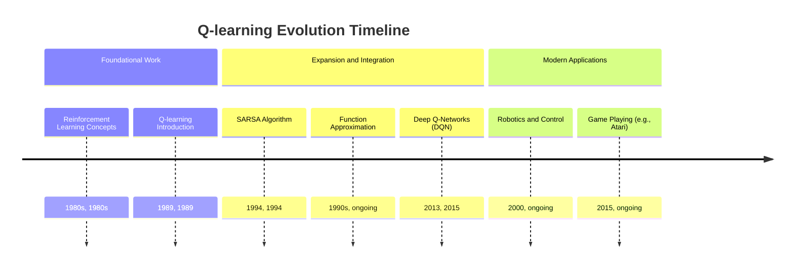
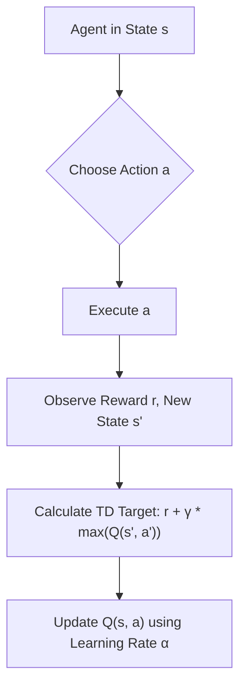
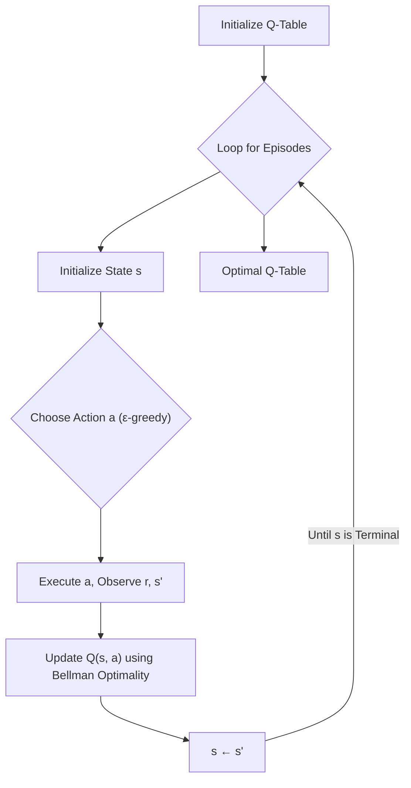

## Q-learning Evolution Document

### 1. Introduction and Historical Context

Q-learning is a model-free reinforcement learning algorithm. It is a value iteration algorithm that learns the quality of actions in specific states without requiring a model of the environment's dynamics. In simpler terms, a Q-learning agent learns to make optimal decisions by trial and error, observing the consequences (rewards) of its actions in different situations.

Developed by Christopher Watkins in 1989, Q-learning was a significant breakthrough in reinforcement learning because it allowed agents to learn optimal policies even when the environment's transition probabilities and reward functions were unknown. This "model-free" aspect made it highly applicable to real-world problems where a complete understanding of the environment is often unavailable or too complex to model explicitly.

Q-learning's impact has been profound, serving as a foundational algorithm for many subsequent advancements in reinforcement learning, including deep Q-networks (DQNs) which combine Q-learning with deep neural networks to tackle high-dimensional state spaces. It remains a cornerstone for understanding and implementing basic reinforcement learning agents.

### 1.1. Q-learning Evolution Timeline



### 2. Core Concepts and Architecture

The core of Q-learning revolves around the Q-table (or Q-function) and the Bellman equation for optimality.

#### 2.1. Q-Table / Q-Function

**Mental Model / Analogy:**
Imagine you're trying to navigate a maze. For every intersection (state) in the maze, you have a mental scorecard. On this scorecard, for each possible direction you can go (action), you've written down a "quality score" (Q-value) indicating how good that direction is. Initially, all scores are zero. As you explore the maze, you update these scores based on whether a path leads to a reward (like cheese) or a penalty (like a dead end). Over time, your scorecard becomes a reliable guide to the best path through the maze.

*   **Q-Table:** A table that stores Q-values for every possible state-action pair `(s, a)`. Each entry `Q(s, a)` represents the expected future reward for taking action `a` in state `s` and then following an optimal policy thereafter.
*   **Q-Function:** When the state space is too large for a table, a function approximator (e.g., a neural network) is used to estimate `Q(s, a)`.

#### 2.2. The Q-learning Update Rule

The heart of Q-learning is how it updates its Q-values based on experience. The agent interacts with the environment, taking an action `a` in state `s`, observing a reward `r`, and transitioning to a new state `s'`.

`Q(s, a) ← Q(s, a) + α [r + γ max_{a'} Q(s', a') - Q(s, a)]`

*   **`Q(s, a)`:** The current estimated Q-value for the state-action pair.
*   **`α` (Learning Rate):** A value between 0 and 1 that determines how much new information overrides old information. A high `α` means the agent learns quickly but might be unstable; a low `α` means slower but more stable learning.
*   **`r` (Reward):** The immediate reward received after taking action `a` in state `s` and transitioning to `s'`.
*   **`γ` (Discount Factor):** A value between 0 and 1 that discounts future rewards. It determines the importance of future rewards. A value of 0 makes the agent "myopic"; a value close to 1 makes it strive for long-term high rewards.
*   **`max_{a'} Q(s', a')`:** The maximum Q-value for the *next state* `s'`, considering all possible actions `a'` from `s'`. This is the key difference from SARSA, as Q-learning is an *off-policy* algorithm – it learns the value of the optimal policy regardless of the policy being followed.
*   **`[r + γ max_{a'} Q(s', a') - Q(s, a)]`:** This entire term is the "temporal difference (TD) error." It represents the difference between the new, more accurate estimate of the Q-value (the target: `r + γ max_{a'} Q(s', a')`) and the old estimate (`Q(s, a)`).

**Mermaid Diagram: Q-learning Update Flow**



### 3. Detailed API Overview (Conceptual)

Q-learning is an algorithm, not a library with a direct API. However, its implementation typically involves data structures for the Q-table and functions for the update rule and action selection. Libraries like NumPy are often used for numerical operations.

#### 3.1. Q-Table Initialization

**Goal:** Create and initialize a Q-table with zeros or small random values.

**Conceptual Code (Python with NumPy):**
```python
import numpy as np

num_states = 10
num_actions = 4

# Initialize Q-table with zeros
q_table = np.zeros((num_states, num_actions))
print("Initialized Q-table (first 5 rows):")
print(q_table[:5, :])

# Alternatively, initialize with small random values
q_table_random = np.random.uniform(low=-1, high=1, size=(num_states, num_actions))
print("\nInitialized Q-table (random, first 5 rows):")
print(q_table_random[:5, :])
```

**Explanation:** Initializing with zeros is common, implying no prior knowledge of action values. Random initialization can help with exploration.

*   **Context:** Setting up the data structure to store Q-values.
*   **Parameters (Conceptual):**
    *   `num_states`: The total number of states in the environment.
    *   `num_actions`: The total number of actions available to the agent.
*   **Returns (Conceptual):** A 2D NumPy array representing the Q-table.

#### 3.2. Action Selection (Exploration vs. Exploitation)

**Goal:** Choose an action based on the current Q-values, balancing exploration (trying new things) and exploitation (using known good actions).

**Conceptual Code (Python):**
```python
import numpy as np

def choose_action(state, q_table, epsilon):
    if np.random.uniform(0, 1) < epsilon: # Explore
        action = np.random.randint(q_table.shape[1])
    else: # Exploit
        action = np.argmax(q_table[state, :])
    return action

# Example usage
num_states = 10
num_actions = 4
q_table = np.zeros((num_states, num_actions))
current_state = 0
epsilon = 0.1 # 10% chance of exploration

selected_action = choose_action(current_state, q_table, epsilon)
print(f"Selected action for state {current_state} with epsilon {epsilon}: {selected_action}")

epsilon = 0.9 # 90% chance of exploration
selected_action_explore = choose_action(current_state, q_table, epsilon)
print(f"Selected action for state {current_state} with epsilon {epsilon}: {selected_action_explore}")
```

**Explanation:** The ε-greedy policy is a common strategy. With probability `ε`, the agent explores by choosing a random action. With probability `1-ε`, it exploits by choosing the action with the highest Q-value for the current state.

*   **Context:** How the agent decides which action to take in a given state.
*   **Parameters (Conceptual):**
    *   `state`: The current state of the agent.
    *   `q_table`: The current Q-table.
    *   `epsilon`: The exploration rate (for ε-greedy policy).
*   **Returns (Conceptual):** The chosen action.

#### 3.3. Q-value Update

**Goal:** Apply the Q-learning update rule after each interaction with the environment.

**Conceptual Code (Python):**
```python
import numpy as np

def update_q_value(q_table, state, action, reward, next_state, learning_rate, discount_factor):
    # Q(s, a) ← Q(s, a) + α [r + γ max_{a'} Q(s', a') - Q(s, a)]
    old_q_value = q_table[state, action]
    max_future_q = np.max(q_table[next_state, :])
    
    new_q_value = old_q_value + learning_rate * (reward + discount_factor * max_future_q - old_q_value)
    q_table[state, action] = new_q_value
    return q_table

# Example usage
num_states = 3
num_actions = 2
q_table = np.array([[0., 0.], [0., 0.], [0., 0.]])

state = 0
action = 0
reward = 1
next_state = 1
learning_rate = 0.1
discount_factor = 0.9

print(f"Q-table before update:\n{q_table}")
updated_q_table = update_q_value(q_table, state, action, reward, next_state, learning_rate, discount_factor)
print(f"\nQ-table after update:\n{updated_q_table}")
```

**Explanation:** This function directly implements the Q-learning update rule, taking the necessary parameters from the agent's experience and the algorithm's hyperparameters.

*   **Context:** The core learning step of the Q-learning algorithm.
*   **Parameters (Conceptual):**
    *   `q_table`: The current Q-table.
    *   `state`: The state `s` where the action was taken.
    *   `action`: The action `a` that was taken.
    *   `reward`: The immediate reward `r` received.
    *   `next_state`: The resulting state `s'`.
    *   `learning_rate`: The learning rate `α`.
    *   `discount_factor`: The discount factor `γ`.
*   **Returns (Conceptual):** The updated Q-table.

### 3.4. Quick Reference: Q-learning Components (Conceptual)

| Component | Description | When to Use |
| :--- | :--- | :--- |
| **Q-Table/Q-Function** | Stores expected future rewards for state-action pairs. | When the state-action space is manageable (table) or complex (function approximator). |
| **Action Selection (ε-greedy)** | Balances exploration and exploitation. | During training to ensure the agent discovers optimal paths while also exploiting known good actions. |
| **Update Rule** | Iteratively refines Q-values based on experience. | After each step of interaction with the environment. |

**Mermaid Diagram: Simplified Q-learning Process**



### 4. Evolution and Impact

Q-learning's evolution has been marked by its adaptability and the foundational role it plays in reinforcement learning:

*   **Model-Free Learning:** Its ability to learn without an explicit model of the environment was revolutionary, opening up reinforcement learning to a much wider range of real-world problems.
*   **Off-Policy Learning:** Being an off-policy algorithm (learning the optimal policy while following a different, often exploratory, policy) is a powerful feature, allowing for efficient data reuse and robust learning.
*   **Function Approximation:** The integration of Q-learning with function approximators (like linear models and later neural networks) allowed it to scale to problems with continuous or very large state spaces, moving beyond simple tabular representations.
*   **Deep Q-Networks (DQNs):** The combination of Q-learning with deep neural networks in DQNs (e.g., playing Atari games from raw pixel data) demonstrated the immense potential of deep reinforcement learning and sparked a new wave of research.
*   **Foundation for Advanced Algorithms:** Many advanced RL algorithms, such as Double Q-learning, Dueling DQN, and Rainbow DQN, build directly upon the principles of Q-learning, addressing its limitations and improving its performance.

### 5. Conclusion

Q-learning stands as a pivotal algorithm in the history of reinforcement learning. Its elegant simplicity, combined with its model-free and off-policy nature, made it a powerful tool for agents to learn optimal behaviors through direct interaction with their environment. From its inception, it has not only solved challenging problems but also laid the groundwork for the deep reinforcement learning revolution, continuing to influence the development of cutting-edge AI systems today. Understanding Q-learning is fundamental to grasping the core concepts of value-based reinforcement learning.
