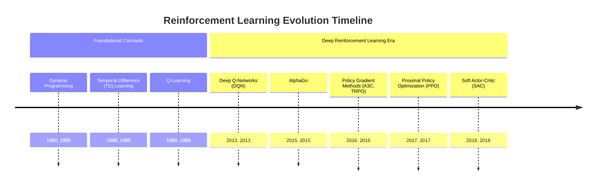
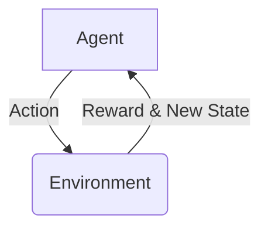
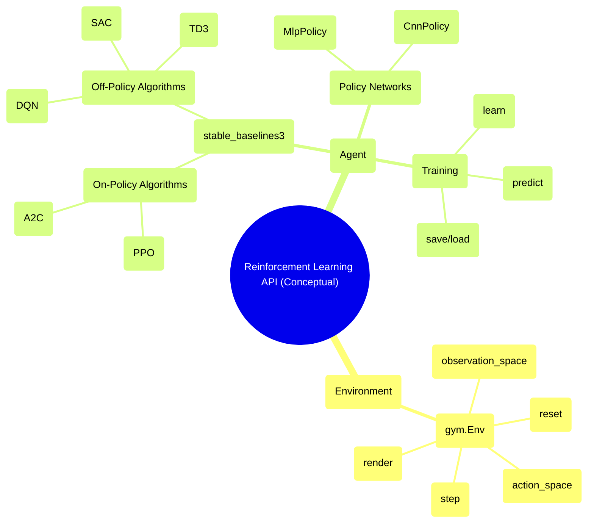

## Reinforcement Learning Evolution Document

### 1. Introduction and Historical Context

Reinforcement Learning (RL) is a paradigm of machine learning concerned with how intelligent agents ought to take actions in an environment in order to maximize the notion of cumulative reward. It is one of the three basic machine learning paradigms, alongside supervised learning and unsupervised learning. RL differs from supervised learning in that it does not need labeled input/output pairs to be presented, and it does not need sub-optimal actions to be explicitly corrected. Instead, the focus is on finding a balance between exploration (of uncharted territory) and exploitation (of current knowledge).

The intellectual roots of RL can be traced back to the psychology of animal learning and the optimal control of dynamical systems. The modern field of RL emerged in the 1980s, building on ideas from trial-and-error learning and dynamic programming. Early breakthroughs included the development of **Temporal-Difference (TD) learning**, which allowed models to learn from raw experience without a model of the environment's dynamics, and **Q-learning**, a model-free RL algorithm that could find an optimal action-selection policy for any given finite Markov Decision Process (MDP).

The last decade has seen a dramatic resurgence in RL, largely driven by its combination with deep learning. This fusion, known as **Deep Reinforcement Learning (DRL)**, has enabled RL algorithms to scale to previously intractable problems with high-dimensional state and action spaces. A landmark achievement was in 2015 when DeepMind's **AlphaGo**, a DRL-powered system, defeated a professional human Go player, a feat previously thought to be decades away. This event, along with successes in robotics, game playing, and resource management, has solidified RL as a key pillar of modern artificial intelligence.

### 1.1. Reinforcement Learning Evolution Timeline



### 2. Core Architecture

The core of RL is the interaction between an **agent** and an **environment**. The agent takes **actions**, which change the **state** of the environment. The environment, in turn, provides the agent with a **reward** (or penalty) and the new state. The agent's goal is to learn a **policy**—a mapping from states to actions—that maximizes its cumulative reward over time.

#### 2.1. Key Concepts

*   **Agent:** The learner or decision-maker.
*   **Environment:** The external system that the agent interacts with.
*   **State (S):** A complete description of the state of the environment.
*   **Action (A):** One of the possible moves the agent can make.
*   **Reward (R):** An immediate signal that the agent receives from the environment after taking an action in a state.
*   **Policy (π):** The agent's strategy or behavior function, which maps states to actions.
*   **Value Function (V or Q):** A prediction of the expected future reward. The value function of a state, V(s), is the expected cumulative reward starting from state s. The action-value function, Q(s, a), is the expected cumulative reward from taking action a in state s.
*   **Model (Optional):** The agent's representation of the environment, which predicts what the environment will do next.

**Mermaid Diagram: The RL Interaction Loop**



#### 2.2. Value-Based vs. Policy-Based Methods

RL algorithms can be broadly categorized into two main types:

*   **Value-Based Methods:** These methods learn a value function that estimates the expected return for each state or state-action pair. The policy is then derived implicitly from this value function (e.g., by always choosing the action with the highest value). **Q-learning** and **DQN** are prominent examples.
*   **Policy-Based Methods:** These methods directly learn the policy function that maps states to actions. They are often more effective in high-dimensional or continuous action spaces. **REINFORCE** and **PPO** are examples of policy-based methods.
*   **Actor-Critic Methods:** These methods combine the strengths of both value-based and policy-based approaches. They use two models: an **actor** that learns the policy, and a **critic** that learns a value function to critique the actor's policy. **A2C/A3C** and **SAC** are popular actor-critic algorithms.

### 3. Detailed API Overview (Conceptual)

RL is typically implemented using libraries like **Stable Baselines3**, **RLlib**, or **Tianshou**, which build on top of deep learning frameworks like PyTorch and TensorFlow. The "API" here refers to the common components and patterns used to define and train RL agents in these libraries.

#### 3.1. Core RL Components

##### 3.1.1. Environment (e.g., `gym.Env`)

**Goal:** Define the world in which the RL agent operates.

**Code (Conceptual - Gymnasium):**
```python
import gymnasium as gym

# Create a classic control environment
env = gym.make("CartPole-v1")

# Reset the environment to get the initial state
observation, info = env.reset()

for _ in range(100):
    action = env.action_space.sample()  # Take a random action
    observation, reward, terminated, truncated, info = env.step(action)

    if terminated or truncated:
        observation, info = env.reset()

env.close()
```

**Explanation:**
*   `gym.make(id)`: Creates an environment instance.
*   `reset()`: Resets the environment to an initial state and returns the initial observation.
*   `step(action)`: Takes an action and returns the new observation, reward, and whether the episode has terminated.
*   `action_space`: The space of possible actions.
*   `observation_space`: The space of possible observations.

*   **Context:** The fundamental interface for RL environments, standardized by OpenAI's Gym (now maintained as Gymnasium).
*   **Methods (Common):**
    *   `reset()`: Resets the environment.
    *   `step(action)`: Executes one time step.
    *   `render()`: Renders the environment.
*   **Attributes (Common):**
    *   `action_space`: The space of valid actions.
    *   `observation_space`: The space of valid observations.

##### 3.1.2. Agent/Policy (e.g., `stable_baselines3.PPO`)

**Goal:** Define the RL agent and its policy.

**Code (Conceptual - Stable Baselines3):**
```python
from stable_baselines3 import PPO
import gymnasium as gym

# Create the environment
env = gym.make("CartPole-v1")

# Instantiate the agent
model = PPO("MlpPolicy", env, verbose=1)

# Train the agent
model.learn(total_timesteps=10000)

# Evaluate the trained agent
obs, info = env.reset()
for _ in range(1000):
    action, _states = model.predict(obs, deterministic=True)
    obs, reward, terminated, truncated, info = env.step(action)
    if terminated or truncated:
        obs, info = env.reset()

env.close()
```

**Explanation:**
*   `PPO("MlpPolicy", env)`: Creates a PPO agent with a Multi-Layer Perceptron (MLP) policy for the given environment.
*   `learn(total_timesteps)`: Trains the agent for a specified number of timesteps.
*   `predict(observation)`: Gets the action from the learned policy for a given observation.

*   **Context:** High-level classes that encapsulate the logic of a specific RL algorithm.
*   **Methods (Common):**
    *   `learn()`: Trains the agent.
    *   `predict()`: Infers the best action.
    *   `save()` / `load()`: Saves and loads the trained model.

##### 3.1.3. Quick Reference: Core RL Components

| Component | Description | Key Methods/Attributes |
| :--- | :--- | :--- |
| `Environment` | The world the agent interacts with | `reset()`, `step()`, `action_space` |
| `Agent/Policy` | The learner and decision-maker | `learn()`, `predict()` |

#### 3.2. API Mindmap



### 4. Architectural Trade-offs

Different RL algorithms have different trade-offs in terms of sample efficiency, stability, and computational cost.

#### 4.1. On-Policy vs. Off-Policy

*   **On-Policy:** The agent learns from the data generated by its current policy.
    *   **Pros:** More stable and reliable.
    *   **Cons:** Less sample-efficient as data is discarded after each policy update.
    *   **Examples:** PPO, A2C.
*   **Off-Policy:** The agent can learn from data generated by a different policy (e.g., from a replay buffer of past experiences).
    *   **Pros:** More sample-efficient.
    *   **Cons:** Can be less stable.
    *   **Examples:** DQN, SAC, TD3.

#### 4.2. Model-Free vs. Model-Based

*   **Model-Free:** The agent learns a policy or value function directly from experience, without building a model of the environment.
    *   **Pros:** Simpler and more flexible.
    *   **Cons:** Can be very sample-inefficient.
    *   **Examples:** Most popular DRL algorithms like DQN, PPO, SAC.
*   **Model-Based:** The agent learns a model of the environment's dynamics and then uses this model for planning (e.g., by simulating future trajectories).
    *   **Pros:** Can be much more sample-efficient.
    *   **Cons:** The performance is limited by the accuracy of the learned model.

### 5. Practical Applications & Use Cases

RL has been successfully applied to a wide range of complex decision-making problems.

*   **Game Playing:** Achieving superhuman performance in games like Go (AlphaGo), StarCraft II (AlphaStar), and Dota 2 (OpenAI Five).
*   **Robotics:** Training robots to perform complex manipulation tasks, locomotion, and navigation.
*   **Autonomous Driving:** Optimizing driving policies for self-driving cars.
*   **Resource Management:** Managing resources in data centers, communication networks, and supply chains.
*   **Recommender Systems:** Personalizing recommendations to users to maximize long-term engagement.

### 6. Complete Code Example (CartPole with PPO)

This example uses Stable Baselines3 to train a PPO agent on the classic CartPole environment.

```python
import gymnasium as gym
from stable_baselines3 import PPO
from stable_baselines3.common.evaluation import evaluate_policy

# 1. Create the CartPole environment
env = gym.make("CartPole-v1")

# 2. Instantiate the PPO agent
# "MlpPolicy" means the policy network is a Multi-Layer Perceptron
model = PPO("MlpPolicy", env, verbose=1)

# 3. Train the agent for 10,000 timesteps
model.learn(total_timesteps=10000)

# 4. Evaluate the trained agent
mean_reward, std_reward = evaluate_policy(model, env, n_eval_episodes=100)
print(f"Mean reward: {mean_reward:.2f} +/- {std_reward:.2f}")

# 5. Enjoy a trained agent
obs, info = env.reset()
for i in range(1000):
    action, _states = model.predict(obs, deterministic=True)
    obs, reward, terminated, truncated, info = env.step(action)
    env.render()
    if terminated or truncated:
        obs, info = env.reset()

env.close()
```

### 7. Evolution and Impact

The evolution of RL has been marked by a shift from tabular methods on small, discrete problems to deep learning-based approaches that can handle high-dimensional, continuous state and action spaces.

*   **Deep Reinforcement Learning:** The combination of RL with deep neural networks has been the key driver of recent progress, allowing RL to be applied to complex, real-world problems.
*   **Algorithmic Innovations:** The development of more stable and sample-efficient algorithms like PPO and SAC has made RL more practical and accessible.
*   **Standardization and Libraries:** The creation of standardized environments (Gym/Gymnasium) and easy-to-use libraries (Stable Baselines3, RLlib) has democratized RL and accelerated research.
*   **From Simulation to the Real World:** A major focus of current research is on bridging the "sim-to-real" gap, enabling policies trained in simulation to be effectively deployed on real-world robots and systems.

### 8. Conclusion

Reinforcement Learning provides a powerful framework for solving sequential decision-making problems. From its theoretical foundations in dynamic programming to the recent breakthroughs in deep reinforcement learning, the field has made remarkable progress. As algorithms become more powerful and sample-efficient, and as simulation environments become more realistic, RL is poised to play an increasingly important role in tackling some of the most challenging problems in AI and automation.
