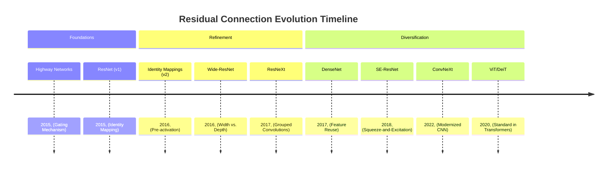
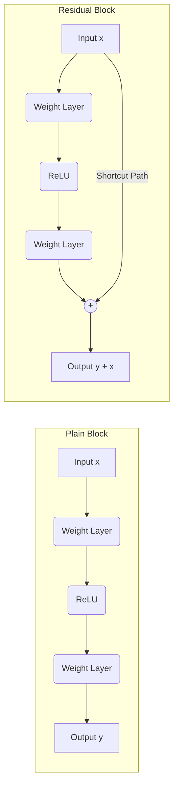
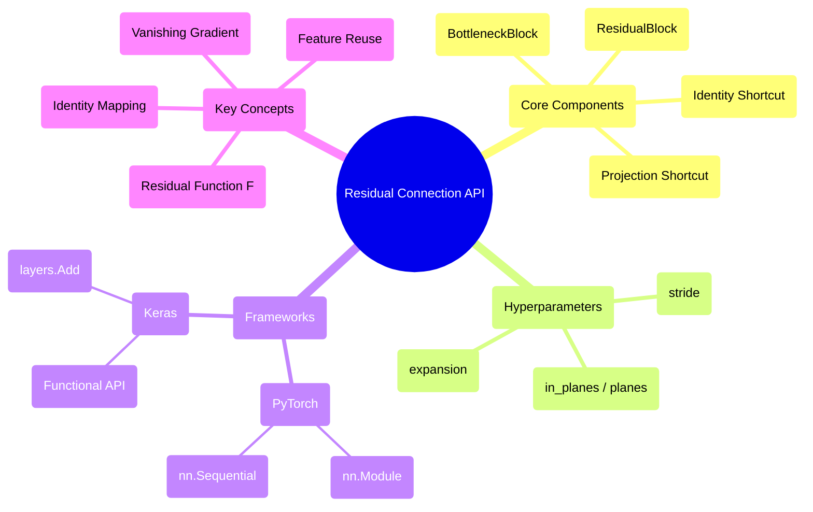

## Residual Connection Evolution Document

### 1. Introduction and Historical Context

Residual Connections, also known as skip connections or shortcut connections, are a fundamental architectural innovation in deep learning that enable the training of extremely deep neural networks. Introduced by Kaiming He et al. in the landmark 2015 paper **"Deep Residual Learning for Image Recognition"**, they effectively solved the "degradation problem," where adding more layers to a deep network led to higher training error.

Before Residual Connections, networks like VGG reached an accuracy plateau around 19 layers. ResNets (Residual Networks) shattered this barrier, successfully training networks with over 150 layers and winning the ILSVRC 2015 competition across all categories. This innovation catalyzed the era of very deep learning and is now standard in architectures ranging from Vision Transformers (ViT) to Large Language Models (LLM).

### 1.1. Residual Connection Evolution Timeline



### 2. Core Architecture

The core idea of a Residual Connection is to allow the input to a layer to bypass the weight layers and be added directly to the output. Instead of learning a direct mapping $H(x)$, the network learns the **residual mapping** $F(x) = H(x) - x$.

#### 2.1. The Residual Block

**Mental Model / Analogy:**
Imagine you are playing a game of "telephone" where a message is passed through many people. Usually, the message gets distorted. A residual connection is like keeping the original written note (the input $x$) and only asking each person to suggest **one small correction** (the residual $F(x)$). At the end, you add the cumulative corrections to the original note.

The fundamental operation is:
$$y = F(x, \{W_i\}) + x$$

*   **Identity Mapping:** The $x$ term represents the identity shortcut. It carries the gradient backward without attenuation, preventing the vanishing gradient problem.
*   **Residual Function ($F$):** Usually consists of 2-3 convolutional layers with Batch Normalization and ReLU.
*   **Element-wise Addition:** The input and residual output are summed. This requires them to have the same dimensions.

#### 2.2. Bottleneck Design

For deeper networks (ResNet-50 and above), "bottleneck" blocks are used to reduce computational cost.
1.  **1x1 Conv:** Reduces the channel dimension (bottleneck).
2.  **3x3 Conv:** Performs the main spatial feature extraction.
3.  **1x1 Conv:** Restores the channel dimension for addition.

#### 2.3. Identity Shortcuts vs. Projection Shortcuts

*   **Identity Shortcut:** Used when input and output shapes match. No extra parameters.
*   **Projection Shortcut (1x1 Conv):** Used when the output has halved spatial resolution and doubled channels. A 1x1 convolution with a stride of 2 is used on the shortcut path to match dimensions.

**Mermaid Diagram: Residual Block vs. Plain Block**



### 3. Detailed API Overview (Conceptual)

In modern frameworks, residual connections are often implemented within custom "Block" modules or using built-in addition layers.

#### 3.1. PyTorch Implementation (Conceptual)

**Goal:** Implement a basic residual block.

```python
import torch.nn as nn

class ResidualBlock(nn.Module):
    def __init__(self, in_planes, planes, stride=1):
        super(ResidualBlock, self).__init__()
        self.conv1 = nn.Conv2d(in_planes, planes, kernel_size=3, 
                               stride=stride, padding=1, bias=False)
        self.bn1 = nn.BatchNorm2d(planes)
        self.conv2 = nn.Conv2d(planes, planes, kernel_size=3, 
                               stride=1, padding=1, bias=False)
        self.bn2 = nn.BatchNorm2d(planes)

        self.shortcut = nn.Sequential()
        if stride != 1 or in_planes != planes:
            self.shortcut = nn.Sequential(
                nn.Conv2d(in_planes, planes, kernel_size=1, stride=stride, bias=False),
                nn.BatchNorm2d(planes)
            )

    def forward(self, x):
        out = nn.ReLU()(self.bn1(self.conv1(x)))
        out = self.bn2(self.conv2(out))
        out += self.shortcut(x) # The Residual Connection
        out = nn.ReLU()(out)
        return out
```

#### 3.2. Keras Implementation (Conceptual)

**Goal:** Use the Functional API for shortcuts.

```python
from tensorflow.keras import layers

def residual_block(x, filters, stride=1):
    shortcut = x
    
    # Main path
    x = layers.Conv2D(filters, 3, strides=stride, padding='same')(x)
    x = layers.BatchNormalization()(x)
    x = layers.Activation('relu')(x)
    
    x = layers.Conv2D(filters, 3, padding='same')(x)
    x = layers.BatchNormalization()(x)
    
    # Projection shortcut
    if stride != 1:
        shortcut = layers.Conv2D(filters, 1, strides=stride)(shortcut)
        shortcut = layers.BatchNormalization()(shortcut)
    
    x = layers.Add()([x, shortcut]) # Element-wise Addition
    x = layers.Activation('relu')(x)
    return x
```

### 3.3. API Mindmap



### 4. Architectural Trade-offs

#### 4.1. Strengths
*   **Ease of Optimization:** Simplifies the learning task. Even if the weight layers do nothing, the network can at least represent the identity mapping.
*   **Gradient Flow:** Shortcuts act as "gradient superhighways," significantly mitigating the vanishing gradient problem.
*   **Feature Reuse:** Information from earlier layers is preserved and carried forward, allowing later layers to focus on refining existing features.

#### 4.2. Weaknesses
*   **Dimensionality Constraints:** Addition requires exact matching of feature map height, width, and depth, necessitating 1x1 convolutions for projection.
*   **Feature Mixing:** Unlike Concatenation (DenseNet), Addition merges information into a single representation, which might lead to some loss of specific feature identity.

### 5. Practical Applications & Use Cases

*   **Modern Backbones:** ResNet-18, 34, 50, 101, 152 are the "default" starting points for most computer vision projects.
*   **Transformer Models:** Every major Transformer (GPT-4, Claude, BERT) uses residual connections around Multi-Head Attention and Feed-Forward layers.
*   **Medical Imaging:** U-Nets often incorporate residual blocks to improve segmentation accuracy in thin vessel or tumor detection.

### 6. Code Example: ResNet-18 for CIFAR-10 (PyTorch)

```python
import torch
import torch.nn as nn
import torch.nn.functional as F

class BasicBlock(nn.Module):
    expansion = 1
    def __init__(self, in_planes, planes, stride=1):
        super(BasicBlock, self).__init__()
        self.conv1 = nn.Conv2d(in_planes, planes, kernel_size=3, stride=stride, padding=1, bias=False)
        self.bn1 = nn.BatchNorm2d(planes)
        self.conv2 = nn.Conv2d(planes, planes, kernel_size=3, stride=1, padding=1, bias=False)
        self.bn2 = nn.BatchNorm2d(planes)
        self.shortcut = nn.Sequential()
        if stride != 1 or in_planes != self.expansion * planes:
            self.shortcut = nn.Sequential(
                nn.Conv2d(in_planes, self.expansion * planes, kernel_size=1, stride=stride, bias=False),
                nn.BatchNorm2d(self.expansion * planes)
            )

    def forward(self, x):
        out = F.relu(self.bn1(self.conv1(x)))
        out = self.bn2(self.conv2(out))
        out += self.shortcut(x)
        out = F.relu(out)
        return out

class ResNet(nn.Module):
    def __init__(self, block, num_blocks, num_classes=10):
        super(ResNet, self).__init__()
        self.in_planes = 64
        self.conv1 = nn.Conv2d(3, 64, kernel_size=3, stride=1, padding=1, bias=False)
        self.bn1 = nn.BatchNorm2d(64)
        self.layer1 = self._make_layer(block, 64, num_blocks[0], stride=1)
        self.layer2 = self._make_layer(block, 128, num_blocks[1], stride=2)
        self.layer3 = self._make_layer(block, 256, num_blocks[2], stride=2)
        self.layer4 = self._make_layer(block, 512, num_blocks[3], stride=2)
        self.linear = nn.Linear(512 * block.expansion, num_classes)

    def _make_layer(self, block, planes, num_blocks, stride):
        strides = [stride] + [1] * (num_blocks - 1)
        layers = []
        for strike in strides:
            layers.append(block(self.in_planes, planes, strike))
            self.in_planes = planes * block.expansion
        return nn.Sequential(*layers)

    def forward(self, x):
        out = F.relu(self.bn1(self.conv1(x)))
        out = self.layer1(out)
        out = self.layer2(out)
        out = self.layer3(out)
        out = self.layer4(out)
        out = F.avg_pool2d(out, 4)
        out = out.view(out.size(0), -1)
        out = self.linear(out)
        return out

def ResNet18():
    return ResNet(BasicBlock, [2, 2, 2, 2])
```

### 7. Evolution and Impact

The impact of Residual Connections cannot be overstated. By shifting the paradigm from "learning a mapping" to "learning a residual," they unlocked the depth dimension for neural networks. 

*   **From CNNs to Transformers:** While ResNet was a CNN innovation, the residual architecture proved equally vital for the Transformer scaling laws.
*   **Normalization Co-evolution:** Residual connections work best with **Batch Normalization** (or LayerNorm in Transformers), as it ensures the input and residual signals are on a similar scale.
*   **Scientific Foundation:** Future research into "Neural ODEs" interprets residual connections as Euler discretizations of continuous dynamical systems, providing a deeper mathematical link to physics.

### 8. Conclusion

Residual Connections remain the single most effective "architectural glue" in AI. By providing an identity path for signals and gradients, they allow practitioners to build models of arbitrary depth without fear of degradation. Whether in a ResNet-101 for image classification or a GPT-4 for language reasoning, the residual shortcut ensures that deep learning remains both deep and trainable.
