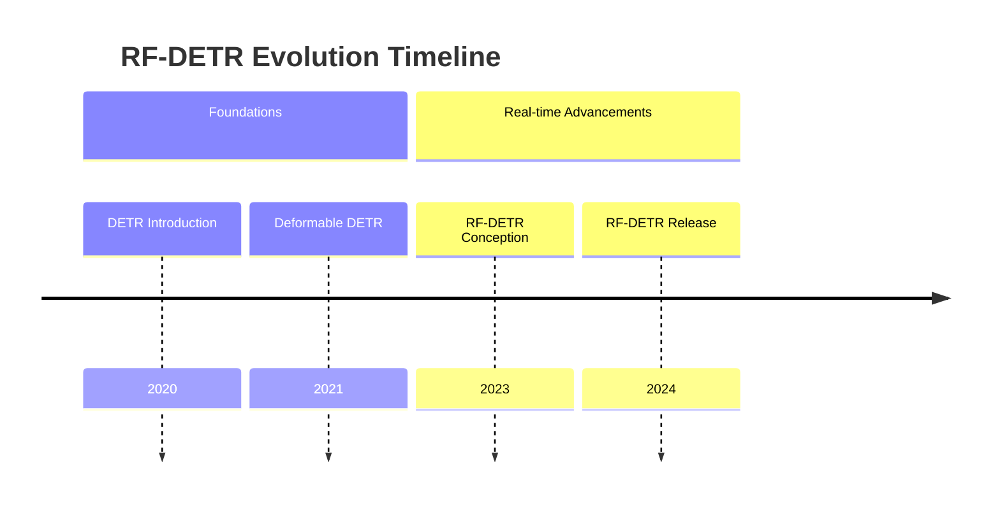
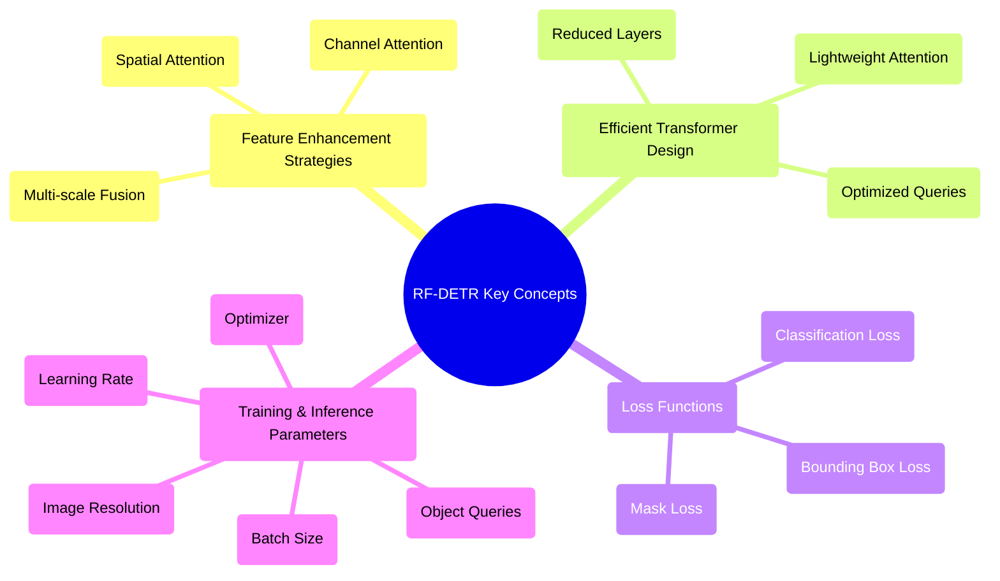

## RF-DETR Evolution Document

### 1. Introduction and Historical Context

RF-DETR (Real-time Feature-enhanced Detection Transformer) is a state-of-the-art, transformer-based object detection and instance segmentation model architecture developed by **Roboflow**. It is released under the permissive **Apache 2.0 license**. The model is designed for real-time performance, claiming to be the fastest and most accurate for its size compared to contemporary models.

A significant achievement of RF-DETR is its performance on standard benchmarks. It exceeds **60 AP on the Microsoft COCO object detection benchmark** and achieves state-of-the-art results on **RF100-VL**, a benchmark designed to test a model's domain adaptability to real-world problems.

The original DETR model, introduced by Facebook AI in 2020, revolutionized object detection by framing it as a direct set prediction problem. However, it suffered from slow convergence and high computational cost. Subsequent works like Deformable DETR improved efficiency, and RF-DETR further pushes these boundaries by enhancing feature extraction and optimizing the Transformer architecture for speed, making it a practical solution for real-world deployment.

### 1.1. RF-DETR Evolution Timeline



### 2. Core Architecture

RF-DETR's core architecture integrates an efficient backbone, a Feature Enhancement Module (FEM), and a streamlined Transformer encoder-decoder. The key innovation lies in its ability to extract rich, multi-scale features and process them rapidly through a specialized Transformer, enabling real-time performance without sacrificing accuracy.

The development of RF-DETR acknowledges the foundational contributions of several prior works, including **LW-DETR**, **DINOv2**, and **Deformable DETR**, from which it draws architectural inspiration and principles.

#### 2.1. Mental Model / Analogy

Imagine you are a highly skilled detective (RF-DETR) trying to spot specific objects (e.g., cars, pedestrians) in a rapidly moving crowd (video stream).
*   The **Backbone Network** is like your eyes quickly scanning the entire scene, capturing initial visual cues.
*   The **Feature Enhancement Module (FEM)** is your brain, intelligently processing these raw visual cues, highlighting important details, and combining information from different distances (scales) to form a clearer picture of potential suspects.
*   The **Transformer Encoder** is your team of specialized analysts, each focusing on different aspects of the enhanced visual data, identifying patterns and relationships.
*   The **Transformer Decoder** is your lead detective, taking the analysts' findings and directly pinpointing the exact location and identity of each suspect, even predicting their bounding boxes and masks in real-time.

#### 2.2. Key Components

*   **Efficient Backbone Network:** Typically a lightweight CNN (e.g., ResNet variants, Swin Transformer) optimized for speed, responsible for initial feature extraction from input images.
*   **Feature Enhancement Module (FEM):** A novel module that refines and fuses multi-scale features from the backbone. It often incorporates attention mechanisms or spatial aggregation techniques to create more discriminative feature maps.
*   **Transformer Encoder:** Processes the enhanced features from the FEM. It uses self-attention to capture global contextual information across the entire image. RF-DETR often employs a more efficient variant of the Transformer encoder to reduce computational overhead.
*   **Transformer Decoder:** Takes a fixed set of learnable object queries and the encoder's output to directly predict object bounding boxes and class labels. It uses cross-attention to attend to relevant features from the encoder output.
*   **Prediction Heads:** Simple feed-forward networks that convert the decoder's output into final bounding box coordinates, class probabilities, and segmentation masks.

**Mermaid Diagram: RF-DETR Core Architecture**

```mermaid
graph TD
    A[Input Image] --> B[Efficient Backbone Network];
    B --> C[Multi-scale Features];
    C --> D[Feature Enhancement Module (FEM)];
    D --> E[Enhanced Features];
    E --> F[Transformer Encoder];
    F --> G[Encoder Output];
    H[Object Queries] --> I[Transformer Decoder];
    G --> I;
    I --> J[Prediction Heads];
    J --> K[Object Detections & Segmentation Masks];
```

### 3. Practical Usage and Key Concepts

While RF-DETR is a research model, it is also packaged for practical use. Its "API" can be understood both through its user-facing package for inference and its configurable architectural components.

#### 3.1. Practical Usage / API

RF-DETR is designed for fine-tuning on custom datasets and can be easily installed and used for inference.

*   **Installation:** The model can be installed directly from PyPI using pip:
    ```bash
    pip install rfdetr
    ```
    Alternatively, it can be installed from the source repository:
    ```bash
    pip install git+https://github.com/roboflow/rf-detr.git
    ```

*   **Inference:** Inference can be performed using Roboflow's `Inference` package or directly through the model's `.predict()` method, making it straightforward to apply the model to new images.

#### 3.2. Feature Enhancement Strategies

**Context:** The FEM is crucial for RF-DETR's performance. It focuses on improving the quality and richness of features before they enter the Transformer.
*   **Techniques:** This often involves spatial attention, channel attention, or multi-scale feature fusion mechanisms (e.g., FPN-like structures, but optimized for real-time). The goal is to make features more discriminative and robust to variations in object size and appearance.

#### 3.3. Efficient Transformer Design

**Context:** To achieve real-time performance, RF-DETR employs optimizations within its Transformer architecture.
*   **Techniques:** This can include:
    *   **Reduced Number of Layers:** Fewer encoder and decoder layers compared to original DETR.
    *   **Lightweight Attention:** Using variants of attention mechanisms (e.g., linear attention, windowed attention, deformable attention) that have lower computational complexity.
    *   **Query Design:** Optimizing the number and initialization of object queries to speed up the decoding process.

#### 3.4. Loss Functions

**Context:** Training RF-DETR involves a combination of loss functions to guide the model in predicting accurate bounding boxes, classes, and masks.
*   **Components:**
    *   **Classification Loss:** Typically a Focal Loss or Cross-Entropy Loss for predicting object classes.
    *   **Bounding Box Regression Loss:** Often a combination of L1 loss and Generalized IoU (GIoU) loss for precise box localization.
    *   **Mask Loss (for segmentation):** Binary Cross-Entropy or Dice Loss for pixel-wise segmentation.

#### 3.5. Training and Inference Parameters

**Context:** Various parameters are configured during training and inference to control the model's behavior.
*   **Parameters:**
    *   **Learning Rate Schedule:** How the learning rate changes during training.
    *   **Optimizer:** (e.g., AdamW)
    *   **Batch Size:** Number of samples processed in one training iteration.
    *   **Number of Epochs:** Total training iterations.
    *   **Image Resolution:** Input image size, which impacts both accuracy and speed.
    *   **Number of Object Queries:** A critical parameter influencing the maximum number of objects the model can detect.

**Mermaid Diagram: Simplified RF-DETR Key Concepts**



### 4. Evolution and Impact

RF-DETR's evolution is a testament to the ongoing efforts to make Transformer-based object detection models practical for real-world applications. Its primary impact lies in demonstrating that high-accuracy detection and segmentation can be achieved in real-time, bridging the gap between research breakthroughs and deployable solutions.

*   **Real-time Performance:** RF-DETR significantly reduces inference latency compared to earlier DETR variants, making it suitable for applications requiring immediate responses, such as autonomous driving, robotics, and video surveillance.
*   **Enhanced Feature Representation:** The Feature Enhancement Module (FEM) is a key innovation, allowing the model to build more robust and context-rich feature representations, which directly contributes to improved accuracy.
*   **SOTA Performance:** RF-DETR often achieves state-of-the-art (SOTA) results on challenging benchmarks (e.g., COCO) while maintaining real-time speeds, showcasing the effectiveness of its architectural optimizations.
*   **Broader Applicability:** By overcoming the speed limitations of previous DETR models, RF-DETR expands the applicability of Transformer-based detectors to a wider range of real-time computer vision tasks.
*   **Foundation for Future Work:** RF-DETR's success inspires further research into efficient Transformer architectures and feature engineering techniques for real-time perception.

### 5. Conclusion and Future Trajectory

RF-DETR represents a significant leap forward in real-time object detection and segmentation, successfully combining the power of Transformer models with the efficiency required for practical deployment. Its innovative Feature Enhancement Module and optimized Transformer design have set new benchmarks for speed and accuracy.

The future trajectory of models like RF-DETR will likely involve:
*   **Further Efficiency Improvements:** Exploring even more lightweight backbones, advanced attention mechanisms, and quantization techniques to push inference speeds even higher.
*   **Multi-task Learning:** Integrating more tasks (e.g., depth estimation, pose estimation) into a single, unified real-time Transformer model.
*   **Robustness and Generalization:** Improving performance in challenging conditions (e.g., low light, adverse weather) and on diverse datasets.
*   **Hardware-aware Design:** Developing architectures specifically tailored for efficient deployment on edge devices and specialized AI accelerators.
*   **Self-supervised and Few-shot Learning:** Reducing the reliance on large labeled datasets for training, making these models more adaptable to new domains with limited data.
