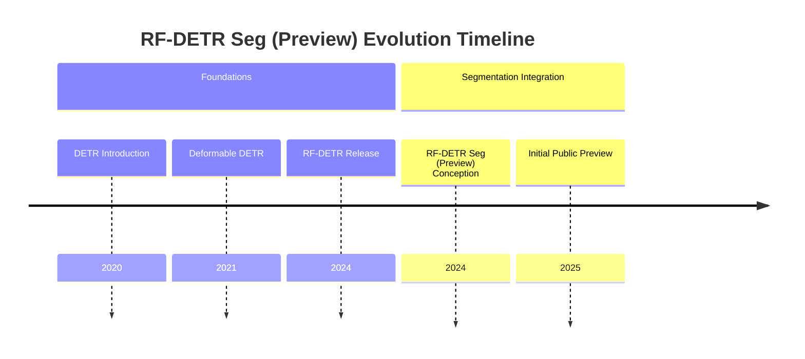

## RF-DETR Seg (Preview) Evolution Document

### 1. Introduction and Historical Context

RF-DETR Seg (Preview) represents an experimental extension of the RF-DETR model, specifically tailored for real-time instance segmentation. Building upon the advancements in real-time object detection achieved by RF-DETR, this preview version integrates segmentation capabilities, aiming to provide pixel-level masks alongside bounding box detections at high inference speeds. According to Roboflow, RF-DETR Seg is **3x faster and more accurate than the largest YOLO models** on the Microsoft COCO Segmentation benchmark.

The journey from DETR to RF-DETR focused on optimizing the Transformer architecture for speed and enhancing feature representation for detection. RF-DETR Seg (Preview) extends this by incorporating a mask prediction branch, often a lightweight FCN (Fully Convolutional Network) or a specialized mask head, into the existing RF-DETR framework. The "Preview" status indicates ongoing development, refinement, and evaluation of its segmentation performance and real-time efficiency.

### 1.1. RF-DETR Seg (Preview) Evolution Timeline



### 2. Core Architecture

RF-DETR Seg (Preview) largely inherits the efficient backbone, Feature Enhancement Module (FEM), and streamlined Transformer encoder-decoder from the base RF-DETR. The primary architectural addition is a dedicated **Mask Prediction Head** that operates on the features processed by the Transformer decoder to generate high-quality instance masks.

#### 2.1. Mental Model / Analogy

Continuing the detective analogy, if RF-DETR was a detective pinpointing suspects (bounding boxes), RF-DETR Seg (Preview) is a forensic artist (segmentation head) who, after the detective identifies a suspect, meticulously outlines their exact silhouette (pixel-level mask) in the crowd. The core detective work (feature extraction, Transformer processing) remains the same, but an additional, precise outlining step is added to the workflow.

#### 2.2. Key Components

*   **Efficient Backbone Network:** (Same as RF-DETR) Lightweight CNN for initial feature extraction.
*   **Feature Enhancement Module (FEM):** (Same as RF-DETR) Refines and fuses multi-scale features.
*   **Transformer Encoder:** (Same as RF-DETR) Processes enhanced features, capturing global context.
*   **Transformer Decoder:** (Same as RF-DETR) Takes object queries and encoder output to predict object bounding boxes and class labels.
*   **Mask Prediction Head:** A new component, typically a small FCN or a specialized module, that takes the decoder's output features and generates a binary mask for each detected object. This head is designed to be efficient to maintain real-time performance.
*   **Prediction Heads (for Detection):** (Same as RF-DETR) Simple feed-forward networks for bounding box coordinates and class probabilities.

**Mermaid Diagram: RF-DETR Seg (Preview) Core Architecture**

```mermaid
graph TD
    A[Input Image] --> B[Efficient Backbone Network];
    B --> C[Multi-scale Features];
    C --> D[Feature Enhancement Module (FEM)];
    D --> E[Enhanced Features];
    E --> F[Transformer Encoder];
    F --> G[Encoder Output];
    H[Object Queries] --> I[Transformer Decoder];
    G --> I;
    I --> J[Detection Prediction Heads];
    I --> K[Mask Prediction Head];
    J --> L[Object Detections];
    K --> M[Segmentation Masks];
    L & M --> N[Combined Output];
```

### 3. Detailed API Overview / Key Concepts

RF-DETR Seg (Preview) extends the concepts of RF-DETR with specific considerations for instance segmentation. The "API" here refers to the architectural additions and the parameters governing segmentation.

#### 3.1. Mask Prediction Head Design

**Context:** The design of the mask prediction head is critical for generating accurate and high-resolution masks efficiently.
*   **Techniques:** This can involve:
    *   **FCN-based Heads:** Using a series of convolutional layers and upsampling to predict pixel-wise masks.
    *   **Dynamic Mask Heads:** Where the mask head is dynamically generated based on the object queries, allowing for instance-specific mask prediction.
    *   **Feature Resolution:** Balancing the resolution of features fed to the mask head to achieve detail without excessive computational cost.

#### 3.2. Segmentation Loss Functions

**Context:** Training for segmentation requires additional loss terms to guide the mask prediction.
*   **Components:**
    *   **Binary Cross-Entropy (BCE) Loss:** Commonly used for pixel-wise classification (foreground/background).
    *   **Dice Loss:** Particularly effective for imbalanced segmentation tasks, focusing on the overlap between predicted and ground truth masks.
    *   **Combined Loss:** Often a weighted sum of BCE and Dice losses.

#### 3.3. Training and Inference Parameters for Segmentation

**Context:** Parameters specific to segmentation are introduced or adjusted.
*   **Parameters:**
    *   **Mask Head Learning Rate:** Potentially different learning rate for the mask branch.
    *   **Mask Loss Weights:** Balancing the contribution of mask loss against classification and bounding box losses.
    *   **Mask Resolution:** The output resolution of the predicted masks.
    *   **Post-processing for Masks:** Techniques like connected components analysis or thresholding to refine raw mask predictions.

**Mermaid Diagram: Simplified RF-DETR Seg (Preview) Key Concepts**

```mermaid
mindmap
  root((RF-DETR Seg (Preview) Key Concepts))
    (Mask Prediction Head Design)
      (FCN-based Heads)
      (Dynamic Mask Heads)
      (Feature Resolution)
    (Segmentation Loss Functions)
      (Binary Cross-Entropy Loss)
      (Dice Loss)
      (Combined Loss)
    (Training & Inference Parameters for Segmentation)
      (Mask Head Learning Rate)
      (Mask Loss Weights)
      (Mask Resolution)
      (Mask Post-processing)
```

### 4. Evolution and Impact

RF-DETR Seg (Preview) signifies the ongoing effort to extend real-time Transformer-based detection to the more granular task of instance segmentation. Its impact, even in a preview state, is in demonstrating the feasibility of real-time, high-quality segmentation within the DETR family of models.

*   **Real-time Instance Segmentation:** The primary impact is the potential to deliver instance segmentation at speeds previously challenging for Transformer-based models, opening doors for applications in robotics, augmented reality, and advanced video analytics.
*   **Unified Detection and Segmentation:** It moves towards a more unified framework for both detection and segmentation, simplifying model deployment and reducing computational overhead compared to multi-stage approaches.
*   **Research Direction:** The preview status highlights an active area of research, pushing the boundaries of what's possible with efficient Transformer designs for dense prediction tasks.
*   **Foundation for Future Models:** The architectural choices and optimizations in RF-DETR Seg (Preview) will likely inform the development of subsequent, fully-fledged real-time segmentation models.

### 5. Conclusion and Future Trajectory

RF-DETR Seg (Preview) is an exciting development, showcasing the potential for real-time instance segmentation using an optimized Transformer architecture. It builds on the strengths of RF-DETR, adding pixel-level understanding to its rapid object localization capabilities.

The future trajectory for RF-DETR Seg and similar real-time segmentation models will likely involve:
*   **Production-Ready Stability:** Moving from preview to a stable release with extensive benchmarking and robustness testing.
*   **Improved Mask Quality:** Further enhancing the mask prediction head and loss functions to achieve even finer-grained segmentation details.
*   **Efficiency for Edge Devices:** Continued optimization for deployment on resource-constrained hardware.
*   **Panoptic Segmentation:** Extending to panoptic segmentation, which unifies instance segmentation (for 'things') and semantic segmentation (for 'stuff').
*   **Domain Adaptation:** Improving generalization to new domains and datasets with minimal retraining.
