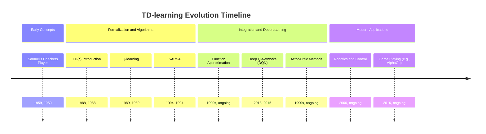

## TD-learning Evolution Document

### 1. Introduction and Historical Context

Temporal Difference (TD) learning refers to a class of model-free reinforcement learning methods that learn by bootstrapping from the estimated value of the next state. Unlike Monte Carlo methods, which wait until the end of an episode to compute the actual return, TD methods update their estimates based on other learned estimates, making them more efficient for continuous tasks or tasks with very long episodes.

The foundational ideas of TD learning were introduced by Arthur Samuel in his checkers-playing program in the late 1950s, where the program learned to evaluate board positions by comparing successive evaluations. However, the formalization and widespread recognition of TD learning came with Richard Sutton's work in 1988, particularly with the introduction of **TD(λ)**. Sutton showed that TD methods combine ideas from Monte Carlo (learning from experience) and dynamic programming (bootstrapping from estimates), offering a powerful and flexible approach to reinforcement learning.

TD learning is central to many successful reinforcement learning algorithms, including Q-learning and SARSA, which are essentially TD control methods. Its ability to learn incrementally from experience, without a model of the environment, and to update estimates based on other estimates, makes it a cornerstone of modern reinforcement learning and a key component in agents that learn to master complex tasks.

### 1.1. TD-learning Evolution Timeline



### 2. Core Concepts and Architecture

The core of TD learning lies in its update rule, which combines elements of Monte Carlo and dynamic programming.

#### 2.1. The TD Error

**Mental Model / Analogy:**
Imagine you're trying to predict the final score of a basketball game while it's still being played. A Monte Carlo approach would be to wait until the game ends and then compare your initial prediction to the actual final score. A TD approach is like constantly adjusting your prediction *during* the game. After each quarter, you look at the current score and your *new* prediction for the final score, and you adjust your *old* prediction based on this new information. You're using one estimate (your prediction after this quarter) to update a previous estimate (your prediction before this quarter), rather than waiting for the absolute truth (the final score).

*   **TD Error:** The difference between the estimated value of the current state and the estimated value of the next state, plus the immediate reward. It quantifies how "surprised" the agent is by the actual outcome compared to its expectation.

    `TD Error = r + γ V(s') - V(s)`

    *   `r`: Immediate reward received.
    *   `γ`: Discount factor.
    *   `V(s')`: Estimated value of the next state `s'`.
    *   `V(s)`: Estimated value of the current state `s`.

#### 2.2. The TD Update Rule

The general TD update rule for a state-value function `V(s)` is:

`V(s) ← V(s) + α [r + γ V(s') - V(s)]`

*   **`V(s)`:** The current estimated value of state `s`.
*   **`α` (Learning Rate):** Determines the step size for updates.
*   **`r + γ V(s')`:** This is the "TD target" – a new, bootstrapped estimate of the true value of state `s`.
*   **`[r + γ V(s') - V(s)]`:** This is the TD error, which drives the learning.

This update rule is applied after each step of interaction with the environment, making TD learning an online, incremental method.

**Mermaid Diagram: TD Update Flow**

```mermaid
graph TD
    A[Agent in State s] --> B{Take Action a}
    B --> C[Observe Reward r, New State s']
    C --> D[Estimate V(s')]
    D --> E[Calculate TD Target: r + γ * V(s')]
    E --> F[Calculate TD Error: TD Target - V(s)]
    F --> G[Update V(s) using Learning Rate α]
```

### 3. Key TD Control Algorithms

While the basic TD update is for *prediction* (learning `V(s)`), it can be extended to *control* (learning an optimal policy).

#### 3.1. SARSA (State-Action-Reward-State-Action)

**Goal:** Learn an optimal policy by updating the Q-value for the *actual* action taken in the next state.

**Update Rule:**
`Q(s, a) ← Q(s, a) + α [r + γ Q(s', a') - Q(s, a)]`

*   **Key Difference from Q-learning:** SARSA is an *on-policy* algorithm. It updates `Q(s, a)` based on the action `a'` that is *actually chosen* in the next state `s'` (following the current policy). This means SARSA learns the value of the policy it is currently following, including its exploration strategy.

#### 3.2. Q-learning

**Goal:** Learn an optimal policy by updating the Q-value for the *best possible* action in the next state.

**Update Rule:**
`Q(s, a) ← Q(s, a) + α [r + γ max_{a'} Q(s', a') - Q(s, a)]`

*   **Key Difference from SARSA:** Q-learning is an *off-policy* algorithm. It updates `Q(s, a)` based on the `max` Q-value for the next state `s'`, regardless of the action `a'` that was actually taken. This allows Q-learning to learn the optimal policy even while the agent is exploring sub-optimal actions.

### 3.3. Quick Reference: TD Algorithms (Conceptual)

| Algorithm | Type | Update Target | Policy Learned |
| :--- | :--- | :--- | :--- |
| **TD(0)** | Prediction | `r + γ V(s')` | N/A (learns state values) |
| **SARSA** | Control (On-policy) | `r + γ Q(s', a')` | Value of the *current* policy |
| **Q-learning** | Control (Off-policy) | `r + γ max_{a'} Q(s', a')` | Value of the *optimal* policy |

### 4. Evolution and Impact

TD learning has been a cornerstone of reinforcement learning, evolving in several key ways:

*   **Efficiency over Monte Carlo:** TD methods can learn online and incrementally, often converging faster than Monte Carlo methods, especially in tasks with long episodes or continuous environments.
*   **Bootstrapping:** The idea of updating estimates based on other estimates (bootstrapping) is a powerful concept that allows for faster learning and is a hallmark of dynamic programming and many RL algorithms.
*   **TD(λ) and Eligibility Traces:** Sutton's TD(λ) introduced eligibility traces, which allow TD updates to propagate back over multiple steps, bridging the gap between one-step TD updates and full Monte Carlo updates. This significantly improved learning efficiency.
*   **Foundation for Control Methods:** TD learning provided the basis for model-free control algorithms like Q-learning and SARSA, which enabled agents to learn optimal behaviors in unknown environments.
*   **Deep Reinforcement Learning:** TD principles are fundamental to deep reinforcement learning. Deep Q-Networks (DQNs), for instance, use a deep neural network to approximate the Q-function and update it using a TD error, demonstrating the scalability of TD learning to complex, high-dimensional problems.
*   **Actor-Critic Methods:** More advanced RL algorithms, such as actor-critic methods, also leverage TD learning. The critic component typically uses TD methods to learn a value function, which then helps the actor component improve its policy.

### 5. Conclusion

Temporal Difference learning is a fundamental and highly influential concept in reinforcement learning. By combining the strengths of Monte Carlo and dynamic programming, it provides an efficient and flexible way for agents to learn value functions and optimal policies directly from experience, without requiring a model of the environment. Its evolution from early conceptual ideas to the core of modern deep reinforcement learning algorithms underscores its enduring importance in the field of artificial intelligence. A solid understanding of TD learning is crucial for anyone engaging with reinforcement learning theory and practice.
