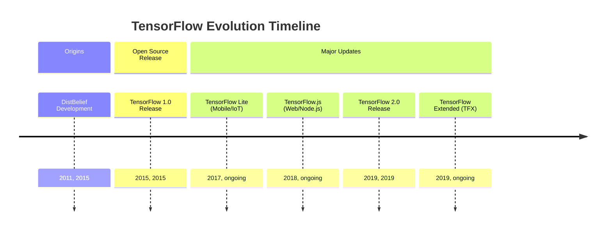
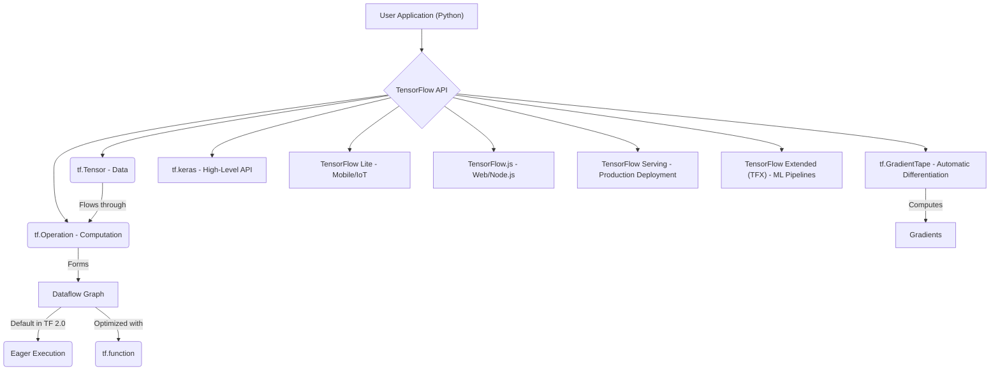

## TensorFlow Evolution Document

### 1. Introduction and Historical Context

TensorFlow is an open-source machine learning framework developed by Google. It is widely used for building and training deep learning models, particularly neural networks, across various applications such as computer vision, natural language processing, and reinforcement learning. Its flexibility allows it to be deployed on a multitude of platforms, from servers to mobile devices and web browsers.

TensorFlow's origins can be traced back to Google's proprietary deep learning system, **DistBelief**, which was developed internally starting in 2011. While powerful, DistBelief had limitations in terms of scalability and flexibility. Recognizing the need for a more robust and versatile system, Google engineers, including Jeff Dean, refactored DistBelief's codebase, leading to the creation of TensorFlow.

TensorFlow was first released as an open-source project under the Apache License 2.0 in November 2015. This move aimed to accelerate innovation in machine learning globally and foster a large community of developers and researchers. A significant milestone was the release of **TensorFlow 2.0** in September 2019, which introduced major changes, including making eager execution the default, tighter Keras integration, and overall API simplification.

### 1.1. TensorFlow Evolution Timeline



### 2. Core Architecture

At its core, TensorFlow represents computations as **dataflow graphs**. In this model, nodes in the graph represent mathematical operations, while the edges represent the multi-dimensional data arrays (tensors) that flow between these operations. This graph-based approach enables efficient execution, automatic differentiation, and deployment across distributed systems and various hardware accelerators (CPUs, GPUs, TPUs).

#### 2.1. Dataflow Graph and Tensors

*   **Tensors**: The central unit of data in TensorFlow. Tensors are multi-dimensional arrays, similar to NumPy arrays, but with the added capability of residing in accelerator memory (GPU, TPU) and participating in automatic differentiation.
*   **Operations (Ops)**: Nodes in the dataflow graph that represent computations. TensorFlow provides a rich library of operations, from basic arithmetic to complex neural network layers.

#### 2.2. Eager Execution

With TensorFlow 2.0, **Eager Execution** became the default. This allows operations to be evaluated immediately, rather than building a graph first and then running it in a session. Eager execution makes TensorFlow more intuitive, easier to debug, and more similar to traditional imperative programming paradigms, while still allowing for graph-based performance benefits when needed (e.g., through `tf.function`).

#### 2.3. Automatic Differentiation (`tf.GradientTape`)

TensorFlow's automatic differentiation system is crucial for training neural networks. The `tf.GradientTape` API records operations performed during a forward pass and then uses these recordings to compute the gradients of a target with respect to some source (typically model variables). This automates the backpropagation process, which is fundamental for optimizing model parameters.

#### 2.4. Modularity and Deployment Ecosystem

TensorFlow is designed with modularity and a broad deployment ecosystem in mind:

*   **`tf.keras`**: A high-level API for building and training deep learning models, integrated directly into TensorFlow 2.0. It simplifies model construction and experimentation.
*   **TensorFlow Lite**: An optimized version of TensorFlow for mobile and embedded devices, enabling on-device machine learning inference.
*   **TensorFlow.js**: A JavaScript library for training and deploying ML models in web browsers and Node.js.
*   **TensorFlow Serving**: A flexible, high-performance serving system for machine learning models in production.
*   **TensorFlow Extended (TFX)**: An end-to-end platform for deploying production ML pipelines.

**Mermaid Diagram: TensorFlow Core Architecture**



### 3. Detailed API Overview

TensorFlow's API is extensive, offering both high-level abstractions for ease of use and low-level controls for flexibility.

#### 3.1. `tf.keras` (High-Level API)

`tf.keras` is the recommended API for most users due to its simplicity and power. It provides building blocks for neural networks.

*   **`tf.keras.Model`**: The base class for Keras models, used to define custom models.
*   **`tf.keras.layers`**: Contains various types of neural network layers (e.g., `Dense`, `Conv2D`, `LSTM`).
*   **`model.compile(optimizer, loss, metrics)`**: Configures the model for training.
*   **`model.fit(x, y, epochs, ...)`**: Trains the model for a fixed number of epochs.
*   **`model.predict(x)`**: Generates output predictions for the input samples.

#### 3.2. Tensors and Operations (Low-Level API)

Direct manipulation of tensors and operations provides fine-grained control.

*   **`tf.constant(value, dtype=None)`**: Creates a constant tensor.
*   **`tf.Variable(initial_value, ...)`**: Creates a mutable tensor whose value can be changed during training.
*   **`tf.add(x, y)`**, **`tf.multiply(x, y)`**, etc.: Element-wise arithmetic operations.
*   **`tf.matmul(a, b)`**: Performs matrix multiplication.
*   **`tf.reduce_sum(input_tensor, axis=None)`**: Computes the sum of elements across dimensions of a tensor.

#### 3.3. Data Input Pipelines (`tf.data`)

The `tf.data` API is used to build efficient and scalable input pipelines for machine learning models.

*   **`tf.data.Dataset.from_tensor_slices(tensors)`**: Creates a dataset from slices of tensors.
*   **`dataset.map(map_func)`**: Maps `map_func` across the elements of this dataset.
*   **`dataset.batch(batch_size)`**: Combines consecutive elements of this dataset into batches.
*   **`dataset.shuffle(buffer_size)`**: Randomly shuffles the elements of this dataset.

#### 3.4. Automatic Differentiation (`tf.GradientTape`)

*   **`tf.GradientTape()`**: Context manager to record operations for automatic differentiation.
*   **`tape.gradient(target, sources)`**: Computes the gradient of `target` with respect to `sources`.

### 3.5. API Mindmap

```mermaid
mindmap
  root((TensorFlow API))
    (High-Level API: tf.keras)
      (tf.keras.Model)
      (tf.keras.layers)
      (model.compile)
      (model.fit)
      (model.predict)
    (Low-Level API: Tensors & Operations)
      (tf.constant)
      (tf.Variable)
      (tf.add, tf.multiply, ...)
      (tf.matmul)
      (tf.reduce_sum)
    (Data Input Pipelines: tf.data)
      (tf.data.Dataset.from_tensor_slices)
      (dataset.map)
      (dataset.batch)
      (dataset.shuffle)
    (Automatic Differentiation: tf.GradientTape)
      (tf.GradientTape())
      (tape.gradient)
```

### 4. Evolution and Impact

*   **Democratizing Deep Learning:** TensorFlow has played a crucial role in making deep learning accessible to a vast community of developers and researchers, fostering rapid advancements in AI.
*   **Industry Standard:** It has become an industry standard for developing and deploying machine learning models, particularly in large-scale production environments at Google and beyond.
*   **Ecosystem Expansion:** The framework has spurred the creation of a rich ecosystem of tools and libraries (TensorFlow Lite, TensorFlow.js, TFX, etc.) that extend its capabilities to various platforms and use cases.
*   **Research and Innovation:** TensorFlow continues to be a leading platform for cutting-edge AI research, with new features and optimizations constantly being developed to push the boundaries of machine learning.
*   **TensorFlow 2.0 Simplification:** The shift to TensorFlow 2.0 with eager execution and Keras integration significantly improved the user experience, making the framework more intuitive and Pythonic, thereby lowering the barrier to entry for new users.

### 5. Conclusion

TensorFlow's journey from an internal Google project to a global open-source powerhouse has profoundly impacted the field of machine learning. Its robust dataflow graph architecture, combined with powerful features like eager execution and automatic differentiation, provides a flexible and scalable platform for building and deploying state-of-the-art AI models. The continuous evolution, driven by a vibrant community and Google's ongoing commitment, ensures TensorFlow remains at the forefront of AI innovation, empowering researchers and developers to tackle increasingly complex challenges.
