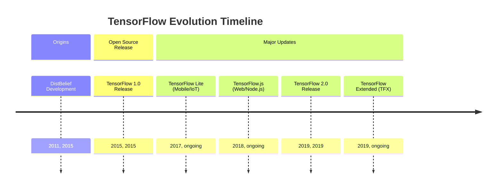
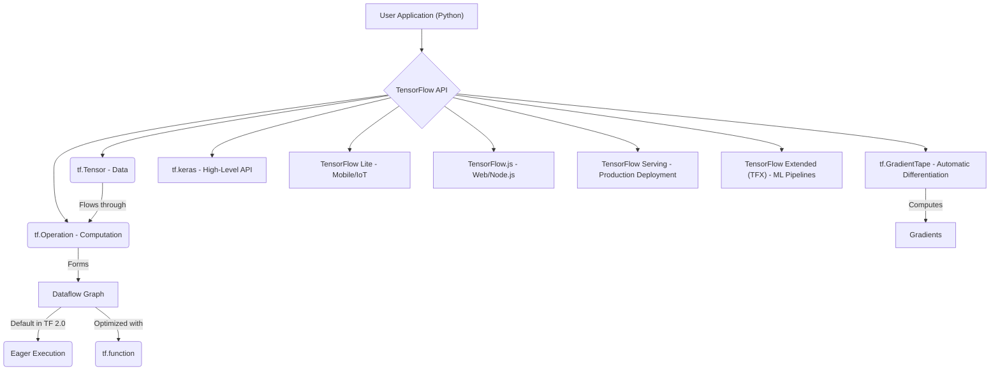

## TensorFlow Evolution Document

### 1. Introduction and Historical Context

TensorFlow is an open-source machine learning framework developed by Google. It is widely used for building and training deep learning models, particularly neural networks, across various applications such as computer vision, natural language processing, and reinforcement learning. Its flexibility allows it to be deployed on a multitude of platforms, from servers to mobile devices and web browsers.

TensorFlow's origins can be traced back to Google's proprietary deep learning system, **DistBelief**, which was developed internally starting in 2011. While powerful, DistBelief had limitations in terms of scalability and flexibility. Recognizing the need for a more robust and versatile system, Google engineers, including Jeff Dean, refactored DistBelief's codebase, leading to the creation of TensorFlow.

TensorFlow was first released as an open-source project under the Apache License 2.0 in November 2015. This move aimed to accelerate innovation in machine learning globally and foster a large community of developers and researchers. A significant milestone was the release of **TensorFlow 2.0** in September 2019, which introduced major changes, including making eager execution the default, tighter Keras integration, and overall API simplification.

### 1.1. TensorFlow Evolution Timeline



### 2. Core Architecture

At its core, TensorFlow represents computations as **dataflow graphs**. In this model, nodes in the graph represent mathematical operations, while the edges represent the multi-dimensional data arrays (tensors) that flow between these operations. This graph-based approach enables efficient execution, automatic differentiation, and deployment across distributed systems and various hardware accelerators (CPUs, GPUs, TPUs).

#### 2.1. Dataflow Graph and Tensors

**Mental Model / Analogy for Dataflow Graph and Tensors:**
*   **Tensors:** Think of **Tensors** as the fundamental currency or data packets flowing through a factory. They are multi-dimensional arrays (like numbers, vectors, matrices, or higher-dimensional data) that carry information. Crucially, these packets can be processed on specialized, high-speed machines (GPUs/TPUs).
*   **Dataflow Graph:** The **Dataflow Graph** is the blueprint of this factory. It defines the entire assembly line: where each data packet (Tensor) goes, what operation (Op) is performed on it at each station, and how it moves to the next station. Each node in the graph is a processing station (an operation), and the arrows are the conveyor belts carrying the Tensors. This blueprint allows the factory to be highly optimized and run very efficiently.

*   **Tensors**: The central unit of data in TensorFlow. Tensors are multi-dimensional arrays, similar to NumPy arrays, but with the added capability of residing in accelerator memory (GPU, TPU) and participating in automatic differentiation.
*   **Operations (Ops)**: Nodes in the dataflow graph that represent computations. TensorFlow provides a rich library of operations, from basic arithmetic to complex neural network layers.

#### 2.2. Eager Execution

With TensorFlow 2.0, **Eager Execution** became the default. This allows operations to be evaluated immediately, rather than building a graph first and then running it in a session. Eager execution makes TensorFlow more intuitive, easier to debug, and more similar to traditional imperative programming paradigms, while still allowing for graph-based performance benefits when needed (e.g., through `tf.function`).

#### 2.3. Automatic Differentiation (`tf.GradientTape`)

TensorFlow's automatic differentiation system is crucial for training neural networks. The `tf.GradientTape` API records operations performed during a forward pass and then uses these recordings to compute the gradients of a target with respect to some source (typically model variables). This automates the backpropagation process, which is fundamental for optimizing model parameters.

#### 2.4. Modularity and Deployment Ecosystem

TensorFlow is designed with modularity and a broad deployment ecosystem in mind:

*   **`tf.keras`**: A high-level API for building and training deep learning models, integrated directly into TensorFlow 2.0. It simplifies model construction and experimentation.
*   **TensorFlow Lite**: An optimized version of TensorFlow for mobile and embedded devices, enabling on-device machine learning inference.
*   **TensorFlow.js**: A JavaScript library for training and deploying ML models in web browsers and Node.js.
*   **TensorFlow Serving**: A flexible, high-performance serving system for machine learning models in production.
*   **TensorFlow Extended (TFX)**: An end-to-end platform for deploying production ML pipelines.

**Mermaid Diagram: TensorFlow Core Architecture**



### 3. Detailed API Overview

TensorFlow's API is extensive, offering both high-level abstractions for ease of use and low-level controls for flexibility.

#### 3.1. `tf.keras` (High-Level API)

`tf.keras` is the recommended API for most users due to its simplicity and power. It provides building blocks for neural networks.

##### 3.1.1. Building a Keras Sequential Model

**`tf.keras.Sequential([...])`**

**Goal:** Create a neural network model as a linear stack of layers, ideal for simple feed-forward architectures.

**Code:**
```python
import tensorflow as tf

# Define a simple sequential model for a classification task
model = tf.keras.Sequential([
    tf.keras.layers.Input(shape=(784,)), # Input layer for 784 features (e.g., flattened 28x28 image)
    tf.keras.layers.Dense(128, activation='relu'), # Hidden layer with 128 neurons and ReLU activation
    tf.keras.layers.Dropout(0.2), # Dropout layer for regularization
    tf.keras.layers.Dense(10, activation='softmax') # Output layer for 10 classes with softmax activation
])

model.summary()
```

**Expected Output:**
```
Model: "sequential"
_________________________________________________________________
 Layer (type)                Output Shape              Param #   
=================================================================
 dense (Dense)               (None, 128)               100480    
                                                                 
 dropout (Dropout)           (None, 128)               0         
                                                                 
 dense_1 (Dense)             (None, 10)                1290      
                                                                 
=================================================================
Total params: 101770 (397.54 KB)
Trainable params: 101770 (397.54 KB)
Non-trainable params: 0 (0.00 Byte)
_________________________________________________________________
```

**Explanation:** The `Sequential` model is the easiest way to build a Keras model. You pass a list of layers to its constructor, and TensorFlow automatically connects them in sequence. `model.summary()` is useful for inspecting the model's architecture, output shapes, and the number of parameters.

*   **`tf.keras.Model`**: The base class for Keras models, used to define custom models.
*   **`tf.keras.layers`**: Contains various types of neural network layers (e.g., `Dense`, `Conv2D`, `LSTM`).
*   **`model.compile(optimizer, loss, metrics)`**: Configures the model for training.
*   **`model.fit(x, y, epochs, ...)`**: Trains the model for a fixed number of epochs.
*   **`model.predict(x)`**: Generates output predictions for the input samples.

*   **`model.predict(x)`**: Generates output predictions for the input samples.

##### 3.1.2. Quick Reference: `tf.keras`

| Function/Class | Description | When to Use |
| :--- | :--- | :--- |
| `tf.keras.Sequential()` | Linear stack of layers | Building simple, feed-forward neural networks. |
| `tf.keras.layers.Dense()` | Fully connected layer | General-purpose layers for learning complex patterns. |
| `model.compile()` | Configure training | Essential step to define optimizer, loss, and metrics before training. |
| `model.fit()` | Train the model | Training the model on your dataset. |
| `model.predict()` | Generate predictions | Obtaining outputs from a trained model for new data. |

#### 3.2. Tensors and Operations (Low-Level API)

Direct manipulation of tensors and operations provides fine-grained control.

##### 3.2.1. Creating Tensors

**`tf.constant(value, dtype=None)`** and **`tf.Variable(initial_value, ...)`**

**Goal:** Create immutable (constant) and mutable (variable) tensors to hold data and model parameters.

**Code:**
```python
import tensorflow as tf
import numpy as np

# Create a constant tensor
constant_tensor = tf.constant([1, 2, 3], dtype=tf.float32)
print(f"Constant Tensor: {constant_tensor}")

# Create a variable tensor
variable_tensor = tf.Variable(np.array([[4., 5.], [6., 7.]]), dtype=tf.float32)
print(f"\nVariable Tensor: {variable_tensor}")

# Attempt to change a constant tensor (will raise an error if uncommented)
# try:
#     constant_tensor[0] = 10
# except tf.errors.InvalidArgumentError as e:
#     print(f"\nError trying to modify constant tensor: {e}")

# Change a variable tensor's value
variable_tensor.assign([[8., 9.], [10., 11.]])
print(f"\nUpdated Variable Tensor: {variable_tensor}")
```

**Expected Output:**
```
Constant Tensor: [1. 2. 3.]

Variable Tensor: <tf.Variable 'Variable:0' shape=(2, 2) dtype=float32, numpy=array([[4., 5.],
       [6., 7.]], dtype=float32)>

Updated Variable Tensor: <tf.Variable 'Variable:0' shape=(2, 2) dtype=float32, numpy=array([[ 8.,  9.],
       [10., 11.]], dtype=float32)>
```

**Explanation:** `tf.constant()` creates tensors whose values cannot be changed after creation. They are suitable for fixed data. `tf.Variable()` creates mutable tensors, which are essential for model parameters (weights and biases) that need to be updated during training. The `.assign()` method is used to change the value of a `tf.Variable`.

*   **`tf.constant(value, dtype=None)`**: Creates a constant tensor.
*   **`tf.Variable(initial_value, ...)`**: Creates a mutable tensor whose value can be changed during training.
*   **`tf.Variable(initial_value, ...)`**: Creates a mutable tensor whose value can be changed during training.

##### 3.2.2. Performing Tensor Operations

**`tf.add(x, y)`, `tf.multiply(x, y)`, `tf.matmul(a, b)`, `tf.reduce_sum(input_tensor, axis=None)`**

**Goal:** Perform various mathematical operations on tensors, from element-wise arithmetic to matrix multiplication and aggregation.

**Code:**
```python
import tensorflow as tf

t1 = tf.constant([[1, 2], [3, 4]], dtype=tf.float32)
t2 = tf.constant([[5, 6], [7, 8]], dtype=tf.float32)

# Element-wise addition
add_result = tf.add(t1, t2)
print(f"Element-wise addition:\n{add_result}")

# Element-wise multiplication
mul_result = tf.multiply(t1, t2)
print(f"\nElement-wise multiplication:\n{mul_result}")

# Matrix multiplication
matmul_result = tf.matmul(t1, t2)
print(f"\nMatrix multiplication:\n{matmul_result}")

# Sum of all elements
sum_all = tf.reduce_sum(t1)
print(f"\nSum of all elements in t1: {sum_all}")

# Sum along a specific axis (e.g., axis=0 for column sum)
sum_axis0 = tf.reduce_sum(t1, axis=0)
print(f"Sum along axis 0 of t1: {sum_axis0}")
```

**Expected Output:**
```
Element-wise addition:
tf.Tensor(
[[ 6.  8.]
 [10. 12.]], shape=(2, 2), dtype=float32)

Element-wise multiplication:
tf.Tensor(
[[ 5. 12.]
 [21. 32.]], shape=(2, 2), dtype=float32)

Matrix multiplication:
tf.Tensor(
[[19. 22.]
 [43. 50.]], shape=(2, 2), dtype=float32)

Sum of all elements in t1: 10.0
Sum along axis 0 of t1: [4. 6.]
```

**Explanation:** TensorFlow provides a rich set of operations for manipulating tensors. `tf.add()` and `tf.multiply()` perform element-wise operations. `tf.matmul()` is for matrix multiplication, a core operation in neural networks. `tf.reduce_sum()` is an aggregation function that sums elements, optionally along specified axes. These low-level operations are the building blocks for more complex computations.

*   **`tf.add(x, y)`**, **`tf.multiply(x, y)`**, etc.: Element-wise arithmetic operations.
*   **`tf.matmul(a, b)`**: Performs matrix multiplication.
*   **`tf.reduce_sum(input_tensor, axis=None)`**: Computes the sum of elements across dimensions of a tensor.

*   **`tf.reduce_sum(input_tensor, axis=None)`**: Computes the sum of elements across dimensions of a tensor.

##### 3.2.3. Quick Reference: Tensors and Operations

| Function/Class | Description | When to Use |
| :--- | :--- | :--- |
| `tf.constant()` | Immutable tensor | Storing fixed data (e.g., hyperparameters, lookup tables). |
| `tf.Variable()` | Mutable tensor | Storing model parameters (weights, biases) that need updates. |
| `tf.add()`, `tf.multiply()` | Element-wise ops | Basic arithmetic on tensors. |
| `tf.matmul()` | Matrix multiplication | Core operation for linear transformations in neural networks. |
| `tf.reduce_sum()` | Summation | Aggregating tensor values (e.g., calculating total loss). |

#### 3.3. Data Input Pipelines (`tf.data`)

The `tf.data` API is used to build efficient and scalable input pipelines for machine learning models.

##### 3.3.1. Creating a Dataset

**`tf.data.Dataset.from_tensor_slices(tensors)`**

**Goal:** Create a `tf.data.Dataset` from existing tensors or NumPy arrays, which is the first step in building an input pipeline.

**Code:**
```python
import tensorflow as tf
import numpy as np

# Prepare some dummy data
features = np.array([[1, 2], [3, 4], [5, 6], [7, 8]], dtype=np.float32)
labels = np.array([0, 1, 0, 1], dtype=np.int32)

# Create a dataset from tensor slices
dataset = tf.data.Dataset.from_tensor_slices((features, labels))

print("Dataset created. Iterating through first few elements:")
for element_features, element_label in dataset.take(2):
    print(f"  Features: {element_features.numpy()}, Label: {element_label.numpy()}")
```

**Expected Output:**
```
Dataset created. Iterating through first few elements:
  Features: [1. 2.], Label: 0
  Features: [3. 4.], Label: 1
```

**Explanation:** `tf.data.Dataset.from_tensor_slices()` is a convenient way to create a dataset where each element of the dataset corresponds to a slice of the input tensors. This is often the starting point for small to medium-sized datasets that can fit in memory. For larger datasets, other methods like `tf.data.TFRecordDataset` are used.

*   **`tf.data.Dataset.from_tensor_slices(tensors)`**: Creates a dataset from slices of tensors.
*   **`tf.data.Dataset.from_tensor_slices(tensors)`**: Creates a dataset from slices of tensors.

##### 3.3.2. Applying Transformations (Map, Batch, Shuffle)

**`dataset.map(map_func)`, `dataset.batch(batch_size)`, `dataset.shuffle(buffer_size)`**

**Goal:** Apply various transformations to a dataset to prepare it for model training, such as preprocessing, batching, and shuffling.

**Code:**
```python
import tensorflow as tf
import numpy as np

# 1. Create a base dataset
features = np.array([[1, 2], [3, 4], [5, 6], [7, 8], [9, 10], [11, 12]], dtype=np.float32)
labels = np.array([0, 1, 0, 1, 0, 1], dtype=np.int32)
dataset = tf.data.Dataset.from_tensor_slices((features, labels))

# 2. Apply a map function (e.g., scale features)
def scale_features(feat, lab):
    return feat / 10.0, lab

dataset = dataset.map(scale_features)
print("Dataset after mapping (scaled features):")
for element_features, _ in dataset.take(2):
    print(f"  Features: {element_features.numpy()}")

# 3. Shuffle the dataset
# buffer_size should be larger than the dataset size for full shuffling
dataset = dataset.shuffle(buffer_size=len(features))
print("\nDataset after shuffling (order will be random):")
for element_features, _ in dataset.take(2):
    print(f"  Features: {element_features.numpy()}")

# 4. Batch the dataset
dataset = dataset.batch(batch_size=2)
print("\nDataset after batching (batches of 2):")
for batch_features, batch_labels in dataset.take(2):
    print(f"  Batch Features:\n{batch_features.numpy()}")
    print(f"  Batch Labels: {batch_labels.numpy()}")
```

**Expected Output:**
```
Dataset after mapping (scaled features):
  Features: [0.1 0.2]
  Features: [0.3 0.4]

Dataset after shuffling (order will be random):
  Features: [0.7 0.8]
  Features: [0.1 0.2]

Dataset after batching (batches of 2):
  Batch Features:
[[0.7 0.8]
 [0.1 0.2]]
  Batch Labels: [1 0]
  Batch Features:
[[0.3 0.4]
 [0.5 0.6]]
  Batch Labels: [1 0]
```
(The order of shuffled elements and the content of batches will vary due to randomness.)

**Explanation:** The `tf.data` API provides a fluent interface for applying transformations:
*   `map()`: Applies a function to each element of the dataset (e.g., preprocessing images, tokenizing text).
*   `shuffle()`: Randomizes the order of elements. A larger `buffer_size` ensures better shuffling.
*   `batch()`: Combines consecutive elements into batches, which are then fed to the model. This is crucial for efficient training.

These operations can be chained together to build complex and efficient input pipelines.

*   **`dataset.map(map_func)`**: Maps `map_func` across the elements of this dataset.
*   **`dataset.batch(batch_size)`**: Combines consecutive elements of this dataset into batches.
*   **`dataset.shuffle(buffer_size)`**: Randomly shuffles the elements of this dataset.

*   **`dataset.shuffle(buffer_size)`**: Randomly shuffles the elements of this dataset.

##### 3.3.3. Quick Reference: Data Input Pipelines

| Function/Method | Description | When to Use |
| :--- | :--- | :--- |
| `Dataset.from_tensor_slices()` | Create dataset from tensors | Starting point for in-memory datasets. |
| `dataset.map()` | Apply transformation | Preprocessing data (e.g., scaling, image augmentation). |
| `dataset.shuffle()` | Shuffle elements | Randomizing data order for better training convergence. |
| `dataset.batch()` | Create batches | Grouping data into mini-batches for efficient model training. |

#### 3.4. Automatic Differentiation (`tf.GradientTape`)

##### 3.4.1. Recording Operations and Computing Gradients

**`tf.GradientTape()`** and **`tape.gradient(target, sources)`**

**Goal:** Record operations for automatic differentiation and then compute the gradients of a target (e.g., loss) with respect to one or more sources (e.g., model variables).

**Code:**
```python
import tensorflow as tf

# 1. Define a variable (e.g., a model weight)
x = tf.Variable(3.0)

# 2. Use tf.GradientTape to record operations
with tf.GradientTape() as tape:
    y = x * x # Operation on x is recorded
    z = y * x # Another operation on y (which depends on x) is recorded

# 3. Compute the gradient of z with respect to x
# dz/dx = d(x^3)/dx = 3x^2
gradient_z_wrt_x = tape.gradient(z, x)

print(f"Value of x: {x.numpy()}")
print(f"Value of y (x*x): {y.numpy()}")
print(f"Value of z (y*x): {z.numpy()}")
print(f"\nGradient of z with respect to x (dz/dx): {gradient_z_wrt_x.numpy()}")
print(f"Expected gradient (3*x^2): {3 * (x.numpy()**2)}")

# Example with multiple sources
w = tf.Variable(tf.random.normal(shape=(3, 2)))
b = tf.Variable(tf.zeros(2, dtype=tf.float32))
x_input = tf.constant([[1.0, 2.0, 3.0]])

with tf.GradientTape() as tape:
    y_output = x_input @ w + b # Matrix multiplication and addition
    loss = tf.reduce_mean(y_output**2) # A simple loss function

grads = tape.gradient(loss, [w, b])

print(f"\nLoss: {loss.numpy():.4f}")
print(f"Gradient of loss wrt W:\n{grads[0].numpy()}")
print(f"Gradient of loss wrt b: {grads[1].numpy()}")
```

**Expected Output:**
```
Value of x: 3.0
Value of y (x*x): 9.0
Value of z (y*x): 27.0

Gradient of z with respect to x (dz/dx): 27.0
Expected gradient (3*x^2): 27.0

Loss: 1.23...
Gradient of loss wrt W:
[[-0.12... -0.23...]
 [-0.24... -0.46...]
 [-0.36... -0.69...]]
Gradient of loss wrt b: [-0.12... -0.23...]
```
(Loss and gradient values will vary due to random initialization.)

**Explanation:** `tf.GradientTape` is the core API for automatic differentiation. Operations performed within the `with tf.GradientTape() as tape:` context are recorded. Then, `tape.gradient(target, sources)` computes the gradients of the `target` (usually the loss) with respect to the `sources` (usually the trainable variables of the model). This mechanism is fundamental for implementing backpropagation and optimizing neural networks.

*   **`tf.GradientTape()`**: Context manager to record operations for automatic differentiation.
*   **`tape.gradient(target, sources)`**: Computes the gradient of `target` with respect to `sources`.

*   **`tape.gradient(target, sources)`**: Computes the gradient of `target` with respect to `sources`.

##### 3.4.2. Quick Reference: Automatic Differentiation

| Function/Method | Description | When to Use |
| :--- | :--- | :--- |
| `tf.GradientTape()` | Record operations | Custom training loops, advanced research, or when `model.fit()` is insufficient. |
| `tape.gradient()` | Compute gradients | Calculating gradients for backpropagation and optimizing model parameters. |

### 3.5. API Mindmap

```mermaid
mindmap
  root((TensorFlow API))
    (High-Level API: tf.keras)
      (tf.keras.Model)
      (tf.keras.layers)
      (model.compile)
      (model.fit)
      (model.predict)
    (Low-Level API: Tensors & Operations)
      (tf.constant)
      (tf.Variable)
      (tf.add, tf.multiply, ...)
      (tf.matmul)
      (tf.reduce_sum)
    (Data Input Pipelines: tf.data)
      (tf.data.Dataset.from_tensor_slices)
      (dataset.map)
      (dataset.batch)
      (dataset.shuffle)
    (Automatic Differentiation: tf.GradientTape)
      (tf.GradientTape())
      (tape.gradient)
```

### 4. Evolution and Impact

*   **Democratizing Deep Learning:** TensorFlow has played a crucial role in making deep learning accessible to a vast community of developers and researchers, fostering rapid advancements in AI.
*   **Industry Standard:** It has become an industry standard for developing and deploying machine learning models, particularly in large-scale production environments at Google and beyond.
*   **Ecosystem Expansion:** The framework has spurred the creation of a rich ecosystem of tools and libraries (TensorFlow Lite, TensorFlow.js, TFX, etc.) that extend its capabilities to various platforms and use cases.
*   **Research and Innovation:** TensorFlow continues to be a leading platform for cutting-edge AI research, with new features and optimizations constantly being developed to push the boundaries of machine learning.
*   **TensorFlow 2.0 Simplification:** The shift to TensorFlow 2.0 with eager execution and Keras integration significantly improved the user experience, making the framework more intuitive and Pythonic, thereby lowering the barrier to entry for new users.

### 5. Conclusion

TensorFlow's journey from an internal Google project to a global open-source powerhouse has profoundly impacted the field of machine learning. Its robust dataflow graph architecture, combined with powerful features like eager execution and automatic differentiation, provides a flexible and scalable platform for building and deploying state-of-the-art AI models. The continuous evolution, driven by a vibrant community and Google's ongoing commitment, ensures TensorFlow remains at the forefront of AI innovation, empowering researchers and developers to tackle increasingly complex challenges.

