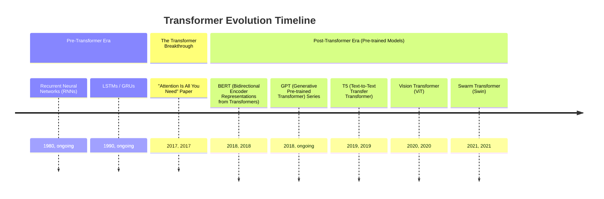
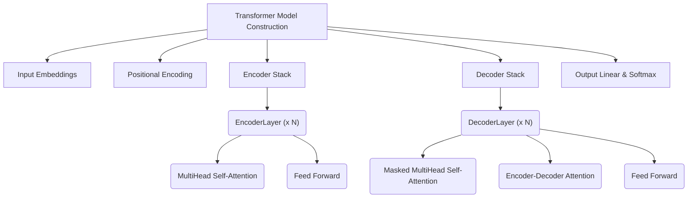
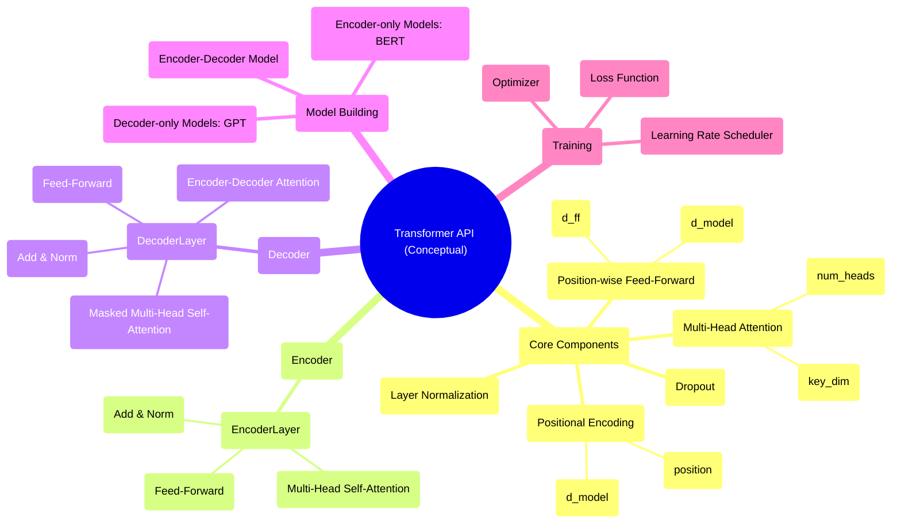

## Transformer Evolution Document

### 1. Introduction and Historical Context

The Transformer is a novel neural network architecture introduced in the 2017 paper "Attention Is All You Need" by Vaswani et al. It revolutionized the field of Natural Language Processing (NLP) by completely eschewing recurrence and convolutions, relying solely on an attention mechanism to draw global dependencies between input and output. This breakthrough allowed for unprecedented parallelization during training and significantly improved performance on various sequence-to-sequence tasks.

Before the Transformer, Recurrent Neural Networks (RNNs) and their variants like LSTMs (Long Short-Term Memory) and GRUs (Gated Recurrent Units) were the dominant architectures for sequence modeling. These models processed data sequentially, making them slow to train on long sequences and prone to issues like vanishing/exploding gradients. Convolutional Neural Networks (CNNs) were also used for some NLP tasks, but they struggled to capture long-range dependencies efficiently.

The Transformer's introduction marked a paradigm shift. Its self-attention mechanism allowed every element in a sequence to attend to every other element, capturing long-range dependencies effectively. The ability to process all input tokens in parallel, combined with the power of attention, led to faster training times and state-of-the-art results across a wide range of NLP benchmarks. This architecture quickly became the foundation for many influential models, including BERT, GPT, and T5, driving significant advancements in areas like machine translation, text generation, and question answering.

### 1.1. Transformer Evolution Timeline



### 2. Core Architecture

The Transformer architecture is an encoder-decoder structure that relies entirely on attention mechanisms. Both the encoder and decoder are stacks of identical layers. Before the main architecture, input tokens are converted to embeddings and combined with positional encodings to provide sequence order information.

#### 2.1. The Attention Mechanism: Q, K, V

**Mental Model / Analogy:**
Imagine you are researching a topic (a **Query**). You go to a library where books are labeled with titles (**Keys**). You compare your query to these keys to find the most relevant books. The content of these books is the **Value**. You then take a weighted sum of the contents of all books, giving more weight to the more relevant ones.

This is the essence of the Transformer's **Scaled Dot-Product Attention**. For each input token, the model learns three vectors:
*   **Query (Q):** Represents the current token's "question" about what other parts of the sequence are relevant to it.
*   **Key (K):** Represents a "label" or "identifier" for each token in the sequence, indicating what it's about.
*   **Value (V):** Represents the actual "substance" or content of each token.

The attention score is calculated by taking the dot product of the Query of the current token with the Key of every other token. This score, after scaling and a softmax function, determines how much attention the current token should pay to every other token. The final output for the token is a weighted sum of all Value vectors in the sequence.

**Formula:** `Attention(Q, K, V) = softmax(Q * K^T / sqrt(d_k)) * V`

#### 2.2. Multi-Head Attention

Instead of performing a single attention calculation, the Transformer uses **Multi-Head Attention**. This mechanism splits the Q, K, and V vectors into multiple smaller, parallel "attention heads."

**Mental Model / Analogy:**
Instead of one researcher looking for books, you have a team of researchers (multiple heads). Each researcher can focus on a different aspect of the query. One might look for syntactic connections, another for semantic similarities. By combining their findings, you get a much richer and more nuanced understanding.

Each head learns different aspects of the relationships between tokens. The outputs of all heads are then concatenated and linearly transformed to produce the final result. This allows the model to jointly attend to information from different representation subspaces at different positions.

#### 2.3. The Encoder-Decoder Structure

##### 2.3.1. Encoder

The encoder's job is to build a rich, contextualized representation of the input sequence. It consists of a stack of identical layers, each containing:
1.  **Multi-Head Self-Attention:** Here, the Q, K, and V vectors all come from the *same* preceding layer's output. Each token looks at all other tokens in the input sequence to build its own context-aware representation.
2.  **Position-wise Feed-Forward Network:** A simple fully connected network applied to each token's representation independently.

Each of these sub-layers is wrapped with a **Residual Connection** and **Layer Normalization**.

##### 2.3.2. Decoder

The decoder's job is to generate the output sequence token by token. It is also a stack of identical layers, but each layer has three sub-layers:
1.  **Masked Multi-Head Self-Attention:** Similar to the encoder's self-attention, but with a crucial difference: a "look-ahead mask" is applied. This prevents any token from attending to subsequent (future) tokens in the output sequence, ensuring that the prediction for the current word can only depend on the words that have already been generated.
2.  **Multi-Head Encoder-Decoder Attention (Cross-Attention):** This is the crucial link between the encoder and decoder. The **Query** vectors come from the decoder's previous masked self-attention sub-layer. The **Key** and **Value** vectors come from the **final output of the encoder stack**. This allows the decoder to look at the entire input sequence and focus on the most relevant parts when generating the next token.
3.  **Position-wise Feed-Forward Network:** Same as in the encoder.

Again, each sub-layer is wrapped with a **Residual Connection** and **Layer Normalization**.

**Mermaid Diagram: Transformer Core Architecture**

```mermaid
graph TD
    A[Input Embeddings + Positional Encoding] --> C["Encoder Stack (N layers)"]
    C -- K, V --> D4
    D1[Output Embeddings + Positional Encoding] --> D2
    
    subgraph Encoder Layer
        C1[Input] --> C2[Multi-Head Self-Attention (Q, K, V from Input)]
        C2 --> C3[Add & Norm]
        C3 --> C4[Feed Forward]
        C4 --> C5[Add & Norm]
        C5 --> C6[Output to next Encoder Layer or Decoder]
    end

    D["Decoder Stack (N layers)"] --> E[Final Linear & Softmax]

    subgraph Decoder Layer
        D2[Input] --> D3[Masked Multi-Head Self-Attention (Q, K, V from Input)]
        D3 --> D3_2[Add & Norm]
        D3_2 -- Q --> D4[Encoder-Decoder Attention]
        D4 --> D5[Add & Norm]
        D5 --> D6[Feed Forward]
        D6 --> D7[Add & Norm]
        D7 --> D8[Output to next Decoder Layer or Final Output]
    end

    C --> C1
    A --> C1
    D1 --> D2
```

### 3. Detailed API Overview (Conceptual)

Similar to CNNs, Transformers are implemented using deep learning frameworks. The "API" here refers to the common modules and patterns used to construct Transformer models, often leveraging pre-built components provided by libraries like Hugging Face Transformers, TensorFlow, and PyTorch. The evolution has been towards highly modular and configurable components, enabling rapid experimentation with different Transformer variants.

#### 3.1. Core Transformer Components

These are the fundamental building blocks provided by frameworks.

##### 3.1.1. Multi-Head Attention (e.g., `tf.keras.layers.MultiHeadAttention`, `torch.nn.MultiheadAttention`)

**Goal:** Perform attention function multiple times in parallel, then concatenate and linearly transform the results.

**Code (Conceptual - Keras):**
```python
import tensorflow as tf
from tensorflow.keras import layers

# Example of MultiHeadAttention layer
# Assume query, key, value are tensors with shape (batch_size, seq_len, embed_dim)
query = tf.random.uniform(shape=(2, 10, 64))
key = tf.random.uniform(shape=(2, 10, 64))
value = tf.random.uniform(shape=(2, 10, 64))

attention_layer = layers.MultiHeadAttention(num_heads=8, key_dim=64)
output_attention = attention_layer(query, key, value)

print(f"Output attention shape: {output_attention.shape}")
```

**Expected Output:**
```
Output attention shape: (2, 10, 64)
```

**Explanation:**
*   `num_heads`: Number of attention heads.
*   `key_dim`: Size of each attention head for query and key.

*   **Context:** The central mechanism for capturing dependencies within a sequence (self-attention) or between two sequences (encoder-decoder attention).
*   **Parameters (Common):**
    *   `num_heads` (int): Number of attention heads.
    *   `key_dim` (int): Size of each attention head for query and key.
    *   `value_dim` (int): Optional size of each attention head for value.
*   **Returns:** A tensor representing the output of the multi-head attention.

##### 3.1.2. Position-wise Feed-Forward Network (e.g., `tf.keras.layers.Dense` stack, `torch.nn.Sequential` of `Linear` layers)

**Goal:** Apply two linear transformations with a ReLU activation in between, independently to each position.

**Code (Conceptual - Keras):**
```python
import tensorflow as tf
from tensorflow.keras import layers

# Example of a position-wise feed-forward network
input_tensor = tf.random.uniform(shape=(2, 10, 64))

ffn = tf.keras.Sequential([
    layers.Dense(256, activation='relu'),
    layers.Dense(64)
])

output_ffn = ffn(input_tensor)

print(f"Output FFN shape: {output_ffn.shape}")
```

**Expected Output:**
```
Output FFN shape: (2, 10, 64)
```

**Explanation:**
*   Typically implemented as two `Dense` layers. The first expands the dimensionality, and the second projects it back.

*   **Context:** Provides non-linearity and allows the model to learn more complex transformations of the attention outputs.
*   **Parameters (Common):**
    *   `d_model` (int): The dimensionality of the input and output.
    *   `d_ff` (int): The dimensionality of the inner layer.
*   **Returns:** A tensor representing the output of the feed-forward network.

##### 3.1.3. Positional Encoding (Custom Layer or function)

**Goal:** Inject positional information into the input embeddings.

**Code (Conceptual - Keras):**
```python
import tensorflow as tf

def get_angles(pos, i, d_model):
    angle_rates = 1 / tf.pow(10000, (2 * (i // 2)) / tf.cast(d_model, tf.float32))
    return pos * angle_rates

def positional_encoding(position, d_model):
    angle_rads = get_angles(tf.range(position, dtype=tf.float32)[:, tf.newaxis],
                            tf.range(d_model, dtype=tf.float32)[tf.newaxis, :],
                            d_model)

    # apply sin to even indices in the array; 2i
    sines = tf.sin(angle_rads[:, 0::2])

    # apply cos to odd indices in the array; 2i + 1
    cosines = tf.cos(angle_rads[:, 1::2])

    pos_encoding = tf.concat([sines, cosines], axis=-1)
    return pos_encoding[tf.newaxis, ...]

# Example usage
pos_enc = positional_encoding(position=50, d_model=128)
print(f"Positional encoding shape: {pos_enc.shape}")
```

**Expected Output:**
```
Positional encoding shape: (1, 50, 128)
```

**Explanation:** Positional encodings are typically generated using sine and cosine functions of different frequencies. This allows the model to learn to attend to relative positions.

*   **Context:** Crucial for providing sequence order information to the Transformer, as it lacks inherent recurrence or convolution.
*   **Parameters (Common):**
    *   `position` (int): Maximum sequence length.
    *   `d_model` (int): Dimensionality of the embeddings.
*   **Returns:** A tensor of positional encodings.

##### 3.1.4. Quick Reference: Core Transformer Components

| Component | Description | Key Parameters |
| :--- | :--- | :--- |
| `MultiHeadAttention` | Parallel attention computations | `num_heads`, `key_dim` |
| `FeedForward Network` | Two linear layers with ReLU | `d_model`, `d_ff` |
| `Positional Encoding` | Injects sequence order info | `position`, `d_model` |
| `LayerNormalization` | Stabilizes training | `epsilon` |
| `Add & Norm` | Residual connection + LayerNorm | N/A |

#### 3.2. Transformer Encoder/Decoder Layers

Frameworks often provide pre-built `EncoderLayer` and `DecoderLayer` modules.

##### 3.2.1. Encoder Layer (e.g., Custom `EncoderLayer` class)

**Goal:** A single layer of the Transformer encoder, combining self-attention and a feed-forward network.

**Code (Conceptual - PyTorch):**
```python
import torch
import torch.nn as nn

class EncoderLayer(nn.Module):
    def __init__(self, d_model, num_heads, d_ff, dropout):
        super(EncoderLayer, self).__init__()
        self.mha = nn.MultiheadAttention(d_model, num_heads, dropout=dropout, batch_first=True)
        self.ffn = nn.Sequential(
            nn.Linear(d_model, d_ff),
            nn.ReLU(),
            nn.Linear(d_ff, d_model)
        )
        self.layernorm1 = nn.LayerNorm(d_model, eps=1e-6)
        self.layernorm2 = nn.LayerNorm(d_model, eps=1e-6)
        self.dropout1 = nn.Dropout(dropout)
        self.dropout2 = nn.Dropout(dropout)

    def forward(self, x, mask):
        attn_output, _ = self.mha(x, x, x, attn_mask=mask)
        attn_output = self.dropout1(attn_output)
        out1 = self.layernorm1(x + attn_output)

        ffn_output = self.ffn(out1)
        ffn_output = self.dropout2(ffn_output)
        out2 = self.layernorm2(out1 + ffn_output)
        return out2

# Example usage
encoder_layer = EncoderLayer(d_model=512, num_heads=8, d_ff=2048, dropout=0.1)
input_tensor = torch.rand(1, 60, 512) # (batch_size, seq_len, d_model)
output_encoder = encoder_layer(input_tensor, mask=None)
print(f"Output Encoder Layer shape: {output_encoder.shape}")
```

**Expected Output:**
```
Output Encoder Layer shape: torch.Size([1, 60, 512])
```

**Explanation:** This conceptual `EncoderLayer` combines `MultiheadAttention`, `FeedForward` networks, `LayerNormalization`, and `Dropout` as described in the original paper.

*   **Context:** Encapsulates the self-attention and feed-forward logic for a single layer within the Transformer encoder stack.
*   **Parameters (Common):**
    *   `d_model` (int): Dimensionality of the input/output.
    *   `num_heads` (int): Number of attention heads.
    *   `d_ff` (int): Dimensionality of the feed-forward network's inner layer.
    *   `dropout` (float): Dropout rate.
*   **Returns:** A tensor representing the output of the encoder layer.

##### 3.2.2. Decoder Layer (e.g., Custom `DecoderLayer` class)

**Goal:** A single layer of the Transformer decoder, combining masked self-attention, encoder-decoder attention, and a feed-forward network.

**Code (Conceptual - PyTorch):**
```python
import torch
import torch.nn as nn

class DecoderLayer(nn.Module):
    def __init__(self, d_model, num_heads, d_ff, dropout):
        super(DecoderLayer, self).__init__()
        self.mha1 = nn.MultiheadAttention(d_model, num_heads, dropout=dropout, batch_first=True) # Masked self-attention
        self.mha2 = nn.MultiheadAttention(d_model, num_heads, dropout=dropout, batch_first=True) # Encoder-decoder attention
        self.ffn = nn.Sequential(
            nn.Linear(d_model, d_ff),
            nn.ReLU(),
            nn.Linear(d_ff, d_model)
        )
        self.layernorm1 = nn.LayerNorm(d_model, eps=1e-6)
        self.layernorm2 = nn.LayerNorm(d_model, eps=1e-6)
        self.layernorm3 = nn.LayerNorm(d_model, eps=1e-6)
        self.dropout1 = nn.Dropout(dropout)
        self.dropout2 = nn.Dropout(dropout)
        self.dropout3 = nn.Dropout(dropout)

    def forward(self, x, enc_output, look_ahead_mask, padding_mask):
        attn1, attn_weights_block1 = self.mha1(x, x, x, attn_mask=look_ahead_mask)
        attn1 = self.dropout1(attn1)
        out1 = self.layernorm1(x + attn1)

        attn2, attn_weights_block2 = self.mha2(out1, enc_output, enc_output, attn_mask=padding_mask)
        attn2 = self.dropout2(attn2)
        out2 = self.layernorm2(out1 + attn2)

        ffn_output = self.ffn(out2)
        ffn_output = self.dropout3(ffn_output)
        out3 = self.layernorm3(out2 + ffn_output)
        return out3

# Example usage (conceptual)
decoder_layer = DecoderLayer(d_model=512, num_heads=8, d_ff=2048, dropout=0.1)
input_decoder = torch.rand(1, 50, 512) # (batch_size, target_seq_len, d_model)
encoder_output = torch.rand(1, 60, 512) # (batch_size, input_seq_len, d_model)

# Masks would be generated based on sequence lengths and padding
look_ahead_mask = torch.triu(torch.ones(50, 50), diagonal=1).bool()
padding_mask = None # For simplicity, assume no padding mask here

output_decoder = decoder_layer(input_decoder, encoder_output, look_ahead_mask, padding_mask)
print(f"Output Decoder Layer shape: {output_decoder.shape}")
```

**Expected Output:**
```
Output Decoder Layer shape: torch.Size([1, 50, 512])
```

**Explanation:** This conceptual `DecoderLayer` includes the masked self-attention and encoder-decoder attention, along with the feed-forward network, layer normalization, and dropout.

*   **Context:** Encapsulates the masked self-attention, encoder-decoder attention, and feed-forward logic for a single layer within the Transformer decoder stack.
*   **Parameters (Common):**
    *   `d_model` (int): Dimensionality of the input/output.
    *   `num_heads` (int): Number of attention heads.
    *   `d_ff` (int): Dimensionality of the feed-forward network's inner layer.
    *   `dropout` (float): Dropout rate.
*   **Returns:** A tensor representing the output of the decoder layer.

##### 3.2.3. Quick Reference: Transformer Layers

| Layer | Description | Key Parameters |
| :--- | :--- | :--- |
| `EncoderLayer` | Single encoder block | `d_model`, `num_heads`, `d_ff`, `dropout` |
| `DecoderLayer` | Single decoder block | `d_model`, `num_heads`, `d_ff`, `dropout` |

**Mermaid Diagram: Simplified Transformer API Structure (Conceptual)**



### 3.3. API Mindmap



### 4. Architectural Trade-offs

Transformers have a unique set of properties that present distinct advantages and disadvantages compared to prior architectures like RNNs and CNNs.

#### 4.1. Strengths

*   **Captures Global Dependencies:** The self-attention mechanism allows every token to directly attend to every other token in the sequence, regardless of their distance. This makes Transformers exceptionally good at capturing long-range dependencies, a significant weakness of RNNs.
*   **Parallelization:** Unlike the sequential nature of RNNs, which must process tokens one by one, the Transformer can process all tokens in a sequence simultaneously. This high degree of parallelization makes it possible to train much larger models on massive datasets.
*   **No Vanishing/Exploding Gradients from Recurrence:** By eliminating recurrent connections, Transformers avoid the vanishing and exploding gradient problems that plague RNNs when dealing with long sequences.

#### 4.2. Weaknesses

*   **Quadratic Computational Complexity:** The self-attention mechanism is computationally expensive. For a sequence of length `n`, the computation and memory requirements are O(n²). This makes it challenging to apply Transformers to very long sequences (e.g., high-resolution images or entire documents).
*   **Lack of Inductive Bias:** Transformers have a weaker inductive bias compared to CNNs (for spatial data) or RNNs (for sequentiality and temporality). They don't inherently know about the order of the sequence or the local structure of the data. This is why they require positional encodings and often need very large datasets to learn these patterns from scratch.
*   **Data-Hungry:** Due to their flexibility and lack of strong inductive biases, Transformers typically require more data to train effectively than CNNs or RNNs to avoid overfitting.

### 5. Practical Applications & Use Cases

The Transformer architecture, especially through pre-trained models, has become the state-of-the-art for a vast range of tasks.

*   **Machine Translation:** The original task for which the Transformer was designed (e.g., Google Translate).
*   **Text Generation:** Creating human-like text for chatbots, story writing, and code generation (e.g., GPT series).
*   **Text Summarization:** Condensing long documents into coherent summaries.
*   **Question Answering:** Answering questions based on a given context.
*   **Sentiment Analysis:** Classifying the sentiment of a piece of text.
*   **Computer Vision:** Applying attention to image patches for tasks like image classification (Vision Transformer - ViT) and object detection.

#### 5.1. Example: Using a Pre-trained Model for Sentiment Analysis

The Hugging Face `transformers` library makes it incredibly easy to use pre-trained models for various tasks.

**Code (Conceptual - PyTorch):**
```python
from transformers import pipeline

# Load a pre-trained sentiment analysis pipeline
# This will download the model and tokenizer on the first run
classifier = pipeline('sentiment-analysis')

# Analyze some text
results = classifier(["I love the new Transformer movie!", "I'm not sure about the plot of this film."])

for result in results:
    print(f"Label: {result['label']}, Score: {result['score']:.4f}")
```
**Expected Output:**
```
Label: POSITIVE, Score: 0.9998
Label: NEGATIVE, Score: 0.9967
```

### 6. Complete Code Example (Sentiment Analysis)

This example demonstrates how to fine-tune a pre-trained Transformer model (DistilBERT) for a sentiment analysis task on the IMDb dataset. It uses the Hugging Face `transformers` and `datasets` libraries, which is the standard approach for such tasks.

#### 6.1. TensorFlow/Keras Implementation

```python
import tensorflow as tf
from transformers import TFAutoModelForSequenceClassification, AutoTokenizer
from datasets import load_dataset

# 1. Load and preprocess the IMDb dataset
imdb = load_dataset("imdb")

# 2. Initialize tokenizer and tokenize the data
tokenizer = AutoTokenizer.from_pretrained("distilbert-base-uncased")

def tokenize_function(examples):
    return tokenizer(examples["text"], padding="max_length", truncation=True)

tokenized_datasets = imdb.map(tokenize_function, batched=True)

# Prepare subsets for training and validation
small_train_dataset = tokenized_datasets["train"].shuffle(seed=42).select(range(1000))
small_eval_dataset = tokenized_datasets["test"].shuffle(seed=42).select(range(1000))

# Convert to TensorFlow datasets
tf_train_dataset = small_train_dataset.to_tf_dataset(
    columns=["attention_mask", "input_ids", "label"],
    shuffle=True,
    batch_size=16
)
tf_eval_dataset = small_eval_dataset.to_tf_dataset(
    columns=["attention_mask", "input_ids", "label"],
    shuffle=False,
    batch_size=16
)

# 3. Load the pre-trained model
model = TFAutoModelForSequenceClassification.from_pretrained("distilbert-base-uncased", num_labels=2)

# 4. Compile the model
optimizer = tf.keras.optimizers.Adam(learning_rate=5e-5)
loss = tf.keras.losses.SparseCategoricalCrossentropy(from_logits=True)
metrics = [tf.keras.metrics.SparseCategoricalAccuracy()]
model.compile(optimizer=optimizer, loss=loss, metrics=metrics)

# 5. Fine-tune the model
epochs = 3
model.fit(tf_train_dataset, validation_data=tf_eval_dataset, epochs=epochs)

# 6. Evaluate the model
print("\nEvaluation on the full test set:")
tf_test_dataset = tokenized_datasets["test"].to_tf_dataset(
    columns=["attention_mask", "input_ids", "label"],
    shuffle=False,
    batch_size=16
)
eval_loss, eval_acc = model.evaluate(tf_test_dataset)
print(f"Test Accuracy: {eval_acc:.4f}")
```

#### 6.2. PyTorch Implementation

```python
import torch
from torch.utils.data import DataLoader
from transformers import AutoTokenizer, AutoModelForSequenceClassification, AdamW
from datasets import load_dataset

# 1. Load and preprocess the IMDb dataset
imdb = load_dataset("imdb")

# 2. Initialize tokenizer and tokenize the data
tokenizer = AutoTokenizer.from_pretrained("distilbert-base-uncased")

def tokenize_function(examples):
    return tokenizer(examples["text"], padding="max_length", truncation=True)

tokenized_datasets = imdb.map(tokenize_function, batched=True)
tokenized_datasets.set_format("torch", columns=["input_ids", "attention_mask", "label"])

# Prepare subsets for training and validation
small_train_dataset = tokenized_datasets["train"].shuffle(seed=42).select(range(1000))
small_eval_dataset = tokenized_datasets["test"].shuffle(seed=42).select(range(1000))

train_dataloader = DataLoader(small_train_dataset, shuffle=True, batch_size=8)
eval_dataloader = DataLoader(small_eval_dataset, batch_size=8)

# 3. Load the pre-trained model
model = AutoModelForSequenceClassification.from_pretrained("distilbert-base-uncased", num_labels=2)

# 4. Set up optimizer and device
optimizer = AdamW(model.parameters(), lr=5e-5)
device = torch.device("cuda" if torch.cuda.is_available() else "cpu")
model.to(device)

# 5. Fine-tune the model
num_epochs = 3
for epoch in range(num_epochs):
    model.train()
    for batch in train_dataloader:
        batch = {k: v.to(device) for k, v in batch.items()}
        outputs = model(**batch)
        loss = outputs.loss
        loss.backward()
        optimizer.step()
        optimizer.zero_grad()
    print(f"Epoch {epoch+1}/{num_epochs} training complete.")

# 6. Evaluate the model
model.eval()
total_correct = 0
total_samples = 0
for batch in eval_dataloader:
    batch = {k: v.to(device) for k, v in batch.items()}
    with torch.no_grad():
        outputs = model(**batch)
    
    logits = outputs.logits
    predictions = torch.argmax(logits, dim=-1)
    total_correct += (predictions == batch["labels"]).sum().item()
    total_samples += len(batch["labels"])

accuracy = total_correct / total_samples
print(f"Validation Accuracy: {accuracy:.4f}")
```

### 7. Evolution and Impact

The Transformer's impact on NLP and beyond has been profound, leading to a rapid acceleration of research and application development.

*   **Pre-trained Language Models:** The Transformer architecture enabled the development of large-scale pre-trained language models like BERT, GPT, and T5. These models, trained on vast amounts of text data, can be fine-tuned for a wide array of downstream tasks with remarkable success, establishing a new paradigm in NLP.
*   **Transfer Learning in NLP:** Similar to CNNs in computer vision, pre-trained Transformers have made transfer learning the standard approach in NLP, significantly reducing the data and computational resources required for many tasks.
*   **Scalability and Parallelization:** By removing recurrent connections, Transformers allowed for unprecedented parallelization during training, making it feasible to train models with billions of parameters on large datasets.
*   **Beyond NLP:** The success of Transformers in NLP quickly led to their adoption in other domains. The **Vision Transformer (ViT)** demonstrated that Transformers could achieve state-of-the-art results in image classification by treating image patches as sequences. Subsequent models like **Swin Transformer** further improved efficiency and performance in computer vision.
*   **Attention Mechanism as a Core Concept:** The attention mechanism, central to the Transformer, has become a fundamental concept in deep learning, influencing architectures across various modalities.
*   **Hardware Optimization:** The parallel nature of Transformers is highly amenable to modern GPU and TPU architectures, which has been crucial for their scalability and performance.

### 8. Conclusion

The Transformer architecture represents a monumental leap in deep learning, particularly for sequence modeling. Its innovative reliance on self-attention, coupled with a parallelizable encoder-decoder structure, has not only redefined the state-of-the-art in Natural Language Processing but has also extended its influence to computer vision and other domains. The Transformer's ability to efficiently capture long-range dependencies and its suitability for large-scale pre-training have made it the cornerstone of modern AI, promising continued advancements in how machines understand and generate complex data.
