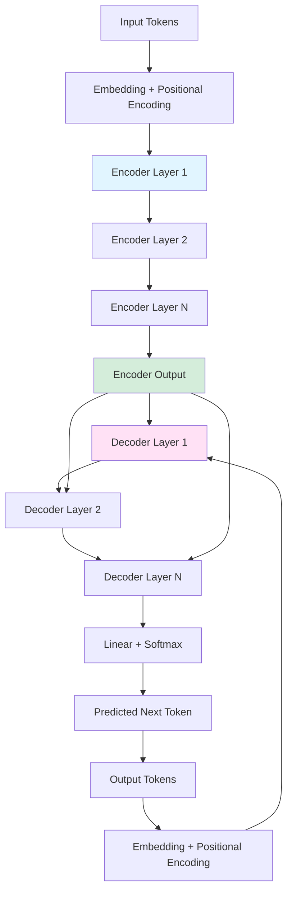

# Transformer Introduction for Beginners

> A gentle, beginner-friendly introduction to the Transformer architecture - the technology behind ChatGPT, BERT, and modern AI. No prior machine learning knowledge required!

---

## Table of Contents

1. [Prerequisites & Foundations](#1-prerequisites--foundations)
2. [From CNN to Transformer: The Evolution](#2-from-cnn-to-transformer-the-evolution)
3. [Why Do We Need Transformers?](#3-why-do-we-need-transformers)
4. [Core Concepts](#4-core-concepts)
5. [How Transformers Work](#5-how-transformers-work)
6. [Why Transformers Matter](#6-why-transformers-matter)
7. [Hands-On Intuition](#7-hands-on-intuition)
8. [Glossary](#8-glossary)

---

## 1. Prerequisites & Foundations

Before diving into Transformers, let's build up some foundational concepts. Don't worry - we'll explain everything from scratch!

### 1.1 What is a Vector?

> 📖 **Term: Vector** - An ordered list of numbers. Think of it as a point in space or an arrow pointing from the origin to that point. For example, [3, 5] is a 2D vector representing a point 3 units right and 5 units up from the origin.

A **vector** is simply a list of numbers arranged in order. It's one of the most fundamental concepts in machine learning.

**Visual Example:**

```
In 2D space:
    ↑
  5 |    ● [3, 5]
  4 |   /
  3 |  /
  2 | /
  1 |/
  0 +--●---→
    0 1 2 3 4 5
      [2, 0]

Vectors as arrows:
    [3, 5] = an arrow from (0,0) to (3,5)
    [2, 0] = an arrow from (0,0) to (2,0)
```

**Why do we use vectors in AI?**

Vectors let computers represent information as numbers:
- Words become vectors (e.g., "cat" might be [0.9, -0.2, 0.5, ...])
- Images become vectors (each pixel's color value)
- Sound becomes vectors (audio amplitude at each time point)

### 1.2 What is a Matrix?

> 📖 **Term: Matrix** - A rectangular grid of numbers. Think of it as a collection of vectors arranged in rows and columns. You can add, subtract, and multiply matrices to transform data.

A **matrix** is a grid of numbers with rows and columns. It's like a spreadsheet filled with numbers.

**Visual Example:**

```
A 3×2 matrix (3 rows, 2 columns):

┌           ┐
│ 1  5  │   Row 1
│ 3  2  │   Row 2
│ 4  8  │   Row 3
└           ┘
  ↑  ↑
 Col Col
  1  2

We can also think of it as 3 vectors stacked:
[1, 5]  →  Row 1
[3, 2]  →  Row 2
[4, 8]  →  Row 3
```

**Matrices in AI:**
- An image is a matrix of pixel values
- A sentence can be represented as a matrix (each row is a word vector)
- Neural networks use matrices to transform input data into outputs

### 1.3 What is a Function?

> 📖 **Term: Function** - A mathematical relationship that takes input(s) and produces an output. You give it something, it follows rules, and gives you back something else. Written as f(x) = y, where x is input and y is output.

You probably remember functions from algebra class. They're just rules that transform inputs into outputs.

**Simple Example:**

```
f(x) = 2x + 1

If x = 3:  f(3) = 2(3) + 1 = 7
If x = 10: f(10) = 2(10) + 1 = 21

Input → [Function applies rules] → Output
```

**In machine learning:**
- The "function" is the neural network itself
- Input: your data (text, images, etc.)
- Output: predictions, classifications, generated text

The goal of training is to **learn** the right function that transforms inputs to correct outputs!

### 1.4 What is a Neural Network?

> 📖 **Term: Neural Network** - A computational model inspired by the human brain. It consists of connected layers of "neurons" that process information. Each neuron takes inputs, applies weights (importance factors), and produces an output.

A **neural network** is like a mathematical brain. It's made of layers of connected "neurons" that process information step by step.

**Visual Structure:**

```
        Input Layer        Hidden Layers        Output Layer
           (Layer 0)         (Layer 1, 2...)        (Final)

         ┌─────┐
         │ I₁  │────────┐
         ├─────┤        │
         │ I₂  │────────┼───┐
         ├─────┤        │   │
         │ I₃  │────────┼───┼────┐
         └─────┘        │   │    │
                        ▼   ▼    ▼
                      ┌─────────┐
                      │  H₁ H₂  │
                      └─────────┘
                        │     │
                        ▼     ▼
                      ┌─────────┐
                      │  O₁ O₂  │
                      └─────────┘

I = Input neuron (receives raw data)
H = Hidden neuron (processes and learns patterns)
O = Output neuron (produces final result)
```

**How it learns:**

> 📖 **Term: Training** - The process of teaching a neural network by showing it examples and adjusting its internal parameters to reduce errors.

1. Make a prediction
2. Compare to the correct answer
3. Adjust internal values slightly to reduce error
4. Repeat millions of times!


---

## 2. From CNN to Transformer: The Evolution

Before understanding Transformers, we need to understand CNNs (Convolutional Neural Networks). They provide the foundation for understanding how attention works.

### 2.1 What is a CNN?

> 📖 **Term: CNN (Convolutional Neural Network)** - A neural network designed for grid-like data (images). It uses "filters" that slide across the input to find patterns, focusing on local regions at a time.

A **CNN** is like a flashlight that scans an image piece by piece, looking for patterns.

**How CNN "Convolution" Works:**

```
Imagine a 5×5 image (each number = pixel brightness):

Image:
┌─────────┐
│ 1  1  1  0  0 │
│ 0  1  1  1  0 │
│ 0  0  1  1  1 │
│ 0  0  1  1  0 │
│ 0  1  1  0  0 │
└─────────┘

A 3×3 filter slides across (convolution):

Filter:           Step 1 (top-left):     Step 2 (shift right):
┌───┐             ┌───┐                   ┌───┐
│ 1 0 1 │         │ 1 1 1 │               │ 1 1 0 │
│ 0 1 0 │    →    │ 0 1 1 │       →       │ 1 1 1 │
│ 1 0 1 │         │ 0 0 1 │               │ 0 1 1 │
└───┘             └───┘                   └───┘
  ↓                 ↓                         ↓
Multiplies with    (1×1)+(1×0)+(1×1)       Computes new
image patch        +(0×0)+(1×1)+(1×0)      value...
                   +(0×1)+(0×0)+(1×1) = 4

This creates a "feature map" showing where patterns appear!
```

**Key insight:** The filter only sees a **small local region** at a time.

### 2.2 CNN's "Local" Attention

CNNs are great at finding local patterns (edges, corners, textures), but they have a limitation:

```
Problem: Can CNN connect distant pixels easily?

Image: "A dog catching a frisbee"

┌─────────────────────────────────────────┐
│  [dog's head]  .....  [frisbee]       │
│       ↑                        ↑       │
│    These pixels are far apart!         │
│    CNN needs many layers to connect    │
│    them (receptive field grows slowly) │
└─────────────────────────────────────────┘

CNN Layer 1: Each neuron sees 3×3 region
CNN Layer 2: Each neuron sees 5×5 region (combining Layer 1)
CNN Layer 3: Each neuron sees 7×7 region
...
Need many deep layers to see the whole image!
```

### 2.3 Transformer's Solution: Global Attention

> 📖 **Term: Global Attention** - The ability to connect any element to any other element directly, regardless of distance. Unlike CNN's local sliding window, attention can "see" the entire input at once.

The Transformer's breakthrough: **Every position can attend to every other position directly!**

```
CNN vs Transformer Attention:

CNN (Local):
    Position 5 sees: [3, 4, 5, 6, 7] ← nearby only

    ┌───┬───┬───┬───┬───┬───┬───┬───┐
    │   │   │   │ ● │   │   │   │   │
    └───┴───┴───┴───┴───┴───┴───┴───┘
              ╰─ local window ─╯

Transformer (Global):
    Position 5 sees: [0, 1, 2, 3, 4, 5, 6, 7, 8, 9] ← everything!

    ┌───┬───┬───┬───┬───┬───┬───┬───┬───┬───┐
    │ ✓ │ ✓ │ ✓ │ ✓ │ ● │ ✓ │ ✓ │ ✓ │ ✓ │ ✓ │
    └───┴───┴───┴───┴───┴───┴───┴───┴───┴───┘
      ╰─────── can attend to anywhere ───────╯

Each position can directly "look at" every other position!
```

### 2.4 Side-by-Side Comparison

| Aspect | CNN | Transformer |
|--------|-----|-------------|
| **Attention Scope** | Local (sliding window) | Global (all-to-all) |
| **What it sees** | Nearby pixels/tokens | Everything at once |
| **Best for** | Images, local patterns | Text, long-range connections |
| **Connection distance** | Grows slowly with layers | Immediate, regardless of distance |
| **Parallelization** | Yes (independent windows) | Yes (all positions processed together) |

---

## 3. Why Do We Need Transformers?

Now that we understand the CNN foundation, let's explore why Transformers were needed and what problems they solve.

### 3.1 The Problem: Understanding Language Requires Context

Language is tricky because meaning depends on context from **anywhere** in the sentence.

**Example 1: Pronoun Resolution**

```
Sentence: "The trophy didn't fit in the suitcase because it was too [large/small]."

Question: What does "it" refer to?

┌─────────────────────────────────────────────────┐
│  "The trophy didn't fit in the suitcase because │
│   it was too LARGE."                            │
│                                                  │
│  "it" = trophy (the trophy was too large)       │
└─────────────────────────────────────────────────┘

┌─────────────────────────────────────────────────┐
│  "The trophy didn't fit in the suitcase because │
│   it was too SMALL."                            │
│                                                  │
│  "it" = suitcase (the suitcase was too small)   │
└─────────────────────────────────────────────────┘

To understand "it", you must connect words that are FAR apart!
```

**Example 2: Long-Range Dependencies**

```
Scientific text:
"Alice inserted the DNA sequence into the plasmid vector using
restriction enzymes. After ligating the fragments, she transformed
the bacteria and plated them on agar with ampicillin."

Question: What was "ligated"?

To answer, you must trace back through the sentence to find
"DNA sequence" and "fragments" - they're connected across many words!
```

### 3.2 Why CNNs/RNNs Struggled

**RNN Problem (Sequential Processing):**

> 📖 **Term: RNN (Recurrent Neural Network)** - A neural network that processes sequences one element at a time, maintaining a "memory" of what it has seen so far. It's like reading a book word-by-word.

```
RNN processing (word by word):

Time steps:  t₁      t₂      t₃      t₄
           [Alice]  [inserted] [the]   [DNA]
             │        │        │        │
             └────────┴────────┴────────┘
                      (hidden state flows forward)

Problems:
1. Slow: Must process sequentially (can't parallelize)
2. Memory loss: Early information gets "forgotten" (**vanishing gradient** - a problem where gradients become tiny, making early layers hard to train)
3. Hard to connect distant words
```

**CNN Problem (Local Windows):**

```
CNN processing (sliding windows):

Text:     [The] [cat] [sat] [on] [the] [mat]
          ╰─┬─╯
            │ CNN sees these words together
            │ (limited window size)

To connect "The" with "mat", CNN needs many layers:
Layer 1: sees 3 words
Layer 2: sees 5 words
Layer 3: sees 7 words
Layer 4: sees 9 words ← finally connects!
```

### 3.3 Transformer's Solution

**Parallel Processing + Global Attention:**

```
Transformer processes ALL positions at once:

Input:    [The] [cat] [sat] [on] [the] [mat]
           ↓     ↓     ↓     ↓     ↓     ↓
        All processed in parallel!

Each position can "attend to" every other:
┌─────────────────────────────────────────────────┐
│                                                 │
│  "The" ←────────── "mat"                        │
│    ╲                   ╱                        │
│     ╲                 ╱                         │
│      ╲              "cat"                       │
│       ╲            ╱                            │
│        ╲          ╱                             │
│         ─→  "sat"  ←─                          │
│              ╲     ╱                            │
│               ╲   ╱                             │
│              "on"                               │
│                                                 │
│  Every word can directly look at every word!    │
└─────────────────────────────────────────────────┘

Benefits:
✓ Parallel training (all positions at once)
✓ Direct long-range connections
✓ No vanishing gradients
```

---

## 4. Core Concepts

Now let's understand the key concepts that make Transformers work.

### 4.1 From Words to Numbers: Embeddings

> 📖 **Term: Embedding** - A vector representation of a word, image, or other data. Similar words have similar embeddings. For example, "cat" and "dog" have closer embeddings than "cat" and "car".

Computers can't process words directly - they need numbers. **Embeddings** convert words into vectors.

**Example: Word Embeddings**

```
Word → Embedding Vector

"cat"  → [0.9, -0.2, 0.5, 0.1, ...]
"dog"  → [0.8, -0.1, 0.6, 0.2, ...]
"car"  → [0.1, 0.7, -0.3, 0.4, ...]

Visualized in 2D:
        ↑
   0.5  │    ● cat
        │       ● dog
   0.0  ┼──────────────→
        │    ● car
  -0.5  │

Similar words cluster together!
```

### 4.2 The Attention Mechanism: Q, K, V

> 📖 **Term: Attention Mechanism** - A technique that allows the model to focus on relevant parts of the input when producing each part of the output. It learns what to pay attention to.

The core innovation of Transformers is the **attention mechanism**. Let's understand it through an analogy.

**Library Analogy:**

```
Imagine you're researching a topic:

┌─────────────────────────────────────────────────┐
│  📚 LIBRARY ANALOGY                             │
│                                                 │
│  Your Question: "How do neural networks learn?" │
│         │                                       │
│         └── This is your QUERY (Q)              │
│             What you're looking for             │
│                                                 │
│  Book Titles on shelves:                        │
│  ├─ "Gardening for Beginners"                   │
│  ├─ "Neural Networks Explained"  ← Match!       │
│  ├─ "French Cooking"                            │
│  └─ "Deep Learning with Python"  ← Match!       │
│         │                                       │
│         └── These are KEYS (K)                  │
│             Labels/identifiers for each item    │
│                                                 │
│  Book Contents:                                 │
│  "Neural networks learn by adjusting..."        │
│  "Backpropagation is an algorithm that..."      │
│         │                                       │
│         └── This is the VALUE (V)               │
│             The actual content/information      │
│                                                 │
│  Process:                                       │
│  1. Compare Query to Keys (find matches)        │
│  2. Give more attention to better matches       │
│  3. Read the Values from matched books          │
└─────────────────────────────────────────────────┘
```

**In Transformers:**

> 📖 **Term: Query (Q)** - In attention, represents what a token is "looking for" when attending to other tokens.
>
> 📖 **Term: Key (K)** - In attention, represents what each token "offers" or is labeled as for others to match against.
>
> 📖 **Term: Value (V)** - In attention, represents the actual information or content each token contains.

For each word (token), the model learns:
- **Query (Q)**: What this word is "looking for"
- **Key (K)**: What this word "offers" to others
- **Value (V)**: The actual information this word contains

**Concrete Example:**

```
Sentence: "The cat sat on the mat"

Processing "cat":
┌─────────────────────────────────────────────────┐
│  Word: "cat"                                    │
│                                                 │
│  Query (Q): "A noun, looking for verbs         │
│             that might describe its action"     │
│                                                 │
│  Key (K): "A furry animal noun"                │
│                                                 │
│  Value (V): [0.5, 0.8, -0.2, ...]              │
│             (actual information about "cat")    │
└─────────────────────────────────────────────────┘

Attention scores (how much "cat" attends to each word):

"The":  0.01 (not relevant)
"cat":  1.00 (itself)
"sat":  0.45 (relevant verb!)
"on":   0.12 (somewhat relevant)
"the":  0.02 (not relevant)
"mat":  0.38 (related location)

"cat" pays most attention to "sat" (what it does)
           and "mat" (where it sits)
```

### 4.3 The Attention Formula (Simplified)

> 📖 **Term: Softmax** - A function converting numbers to probabilities (all positive, sum to 1). Used in attention to create weights.

```
Attention(Q, K, V) = softmax(Q × K / √d) × V

Broken down:
1. Q × K: Compare queries to keys (find matches)
2. / √d: Scale down (prevent huge numbers)
3. softmax: Convert to probabilities (sum to 1)
4. × V: Weight values by attention

We'll do this by hand in Section 7!
```

### 4.4 Multi-Head Attention

> 📖 **Term: Multi-Head Attention** - Running multiple attention operations in parallel. Each "head" can learn different relationships. Like having multiple researchers looking at the same problem from different angles.

Instead of one attention mechanism, Transformers use **multiple heads** - each learning different patterns.

**Analogy: Multiple Researchers**

```
Single Head vs Multi-Head:

Single Head:
┌─────────────────────────────────────────────────┐
│  One researcher looking for connections         │
│  "cat" ──→ focuses on "sat" (action)           │
│  Might miss other relationships!                │
└─────────────────────────────────────────────────┘

Multi-Head (8 researchers):
┌─────────────────────────────────────────────────┐
│  Head 1: "cat" ──→ "sat" (finds the action)    │
│  Head 2: "cat" ──→ "mat" (finds the location)  │
│  Head 3: "cat" ──→ "The" (finds the article)   │
│  Head 4: "cat" ──→ "on" (finds the preposition)│
│  Head 5: "cat" ──→ finds grammar patterns      │
│  Head 6: "cat" ──→ finds semantic similarity   │
│  Head 7: "cat" ──→ finds something else        │
│  Head 8: "cat" ──→ finds something else        │
│                                                 │
│  Combined: Rich understanding of "cat"!        │
└─────────────────────────────────────────────────┘
```

---

## 5. How Transformers Work

Now let's put it all together and see how a Transformer processes input.

### 5.1 The Big Picture: Encoder-Decoder Architecture

> 📖 **Term: Encoder-Decoder** - A two-part architecture. The encoder processes input and creates a representation. The decoder takes that representation and generates output.

```
┌─────────────────────────────────────────────────────────────┐
│                    TRANSFORMER ARCHITECTURE                 │
├─────────────────────────────────────────────────────────────┤
│                                                             │
│  INPUT: "The cat sat"                                       │
│     │                                                       │
│     ▼                                                       │
│  ┌─────────────────────────────────────┐                   │
│  │  ENCODER (understands the input)    │                   │
│  │                                     │                   │
│  │  Layer 1: Multi-Head Self-Attention │                   │
│  │          ↓                           │                   │
│  │  Layer 2: Feed-Forward Network      │                   │
│  │          ↓                           │                   │
│  │  (Repeat N times)                   │                   │
│  │                                     │                   │
│  │  Output: Rich context vectors       │                   │
│  └─────────────────────────────────────┘                   │
│     │                                                       │
│     │ (context vectors passed to decoder)                  │
│     ▼                                                       │
│  ┌─────────────────────────────────────┐                   │
│  │  DECODER (generates the output)     │                   │
│  │                                     │                   │
│  │  Layer 1: Masked Self-Attention     │                   │
│  │          ↓                           │                   │
│  │  Layer 2: Cross-Attention           │                   │
│  │          (looks at encoder output)  │                   │
│  │          ↓                           │                   │
│  │  Layer 3: Feed-Forward Network      │                   │
│  │          ↓                           │                   │
│  │  (Repeat N times)                   │                   │
│  └─────────────────────────────────────┘                   │
│     │                                                       │
│     ▼                                                       │
│  OUTPUT: "Le chat s'est assis" (French translation)        │
│                                                             │
└─────────────────────────────────────────────────────────────┘
```

### 5.2 Encoder: Understanding the Input

The encoder's job is to create rich representations of the input.

```
Input: "The cat sat on the mat"

Step 1: Tokenization
┌─────────────────────────────────────────────────┐
│  "The cat sat on the mat"                       │
│         ↓                                       │
│  ["The", "cat", "sat", "on", "the", "mat"]     │
│         ↓                                       │
│  [101,  5855, 2419, 286,  101,  3698]         │
│         (token IDs from vocabulary)             │
└─────────────────────────────────────────────────┘

Step 2: Embedding
┌─────────────────────────────────────────────────┐
│  Each token ID → embedding vector (512 numbers) │
│                                                 │
│  "The" → [0.1, -0.5, 0.8, ..., 0.2]            │
│  "cat" → [0.9, -0.2, 0.5, ..., 0.7]            │
│  "sat" → [0.3, 0.6, -0.1, ..., 0.4]            │
│  ...                                            │
│                                                 │
│  Shape: [6 tokens × 512 dimensions]             │
└─────────────────────────────────────────────────┘

Step 3: Positional Encoding
┌─────────────────────────────────────────────────┐
│  Add position information (order matters!)      │
│                                                 │
│  Position 0 ("The"): + [sin(0), cos(0), ...]   │
│  Position 1 ("cat"): + [sin(1), cos(1), ...]   │
│  Position 2 ("sat"): + [sin(2), cos(2), ...]   │
│  ...                                            │
│                                                 │
│  Now the model knows "The" comes before "cat"! │
└─────────────────────────────────────────────────┘

Step 4: Multi-Head Self-Attention
┌─────────────────────────────────────────────────┐
│  Each word attends to all other words:         │
│                                                 │
│  "cat" looks at: ["The", "cat", "sat", "on",   │
│                   "the", "mat"]                │
│  Finds: "sat" (action) and "mat" (location)    │
│         are most relevant                       │
│                                                 │
│  Result: Context-aware representations          │
└─────────────────────────────────────────────────┘

Step 5: Feed-Forward Network
┌─────────────────────────────────────────────────┐
│  Each position processed independently:        │
│                                                 │
│  [context + attention] → [FFN] → [output]      │
│                                                 │
│  Two linear layers with ReLU activation:        │
│  Input (512) → Expand (2048) → Contract (512)  │
└─────────────────────────────────────────────────┘

Step 6: Repeat (N layers)
┌─────────────────────────────────────────────────┐
│  Original paper: N = 6 layers                   │
│  Each layer learns increasingly abstract        │
│  representations                                │
└─────────────────────────────────────────────────┘
```

### 5.3 Decoder: Generating the Output

The decoder generates output one token at a time, using both:
1. What it has generated so far (masked self-attention)
2. The encoder's understanding (cross-attention)

```
Task: Translate "The cat sat" → French

Output so far: "Le chat"

Step 1: Masked Self-Attention
┌─────────────────────────────────────────────────┐
│  Current output tokens attend to each other:    │
│                                                 │
│  ["Le", "chat"]                                 │
│     ↓      ↓                                    │
│  "chat" attends to "Le" (article agreement)     │
│                                                 │
│  MASK: Cannot see future tokens (not yet       │
│         generated)!                             │
└─────────────────────────────────────────────────┘

Step 2: Cross-Attention (Encoder-Decoder)
┌─────────────────────────────────────────────────┐
│  Decoder queries encoder's understanding:       │
│                                                 │
│  "chat" (cat) asks encoder:                    │
│  "What in the input should I pay attention to?"│
│                                                 │
│  Encoder responds:                              │
│  "Focus on 'cat' and 'sat' from the input"    │
│                                                 │
│  This ensures output is grounded in input!     │
└─────────────────────────────────────────────────┘

Step 3: Feed-Forward Network
┌─────────────────────────────────────────────────┐
│  Process the combined information               │
└─────────────────────────────────────────────────┘

Step 4: Output Prediction
┌─────────────────────────────────────────────────┐
│  Linear layer + softmax → probability over      │
│  all possible next tokens:                      │
│                                                 │
│  "s'est":  0.65  ← predicted!                  │
│  "est":    0.25                                │
│  "a":      0.05                                │
│  "mange":  0.03                                │
│  ...                                            │
└─────────────────────────────────────────────────┘

Step 5: Append and Repeat
┌─────────────────────────────────────────────────┐
│  Add predicted token to output:                 │
│  ["Le", "chat"] → ["Le", "chat", "s'est"]      │
│                                                 │
│  Repeat until <END> token predicted             │
└─────────────────────────────────────────────────┘
```

### 5.4 Visual Architecture Diagram



---

## 6. Why Transformers Matter

Transformers have revolutionized artificial intelligence. Let's see why they're so important.

### 6.1 Real-World Applications

```
┌─────────────────────────────────────────────────────────────┐
│                 TRANSFORMER APPLICATIONS                    │
├─────────────────────────────────────────────────────────────┤
│                                                             │
│  🌐 Machine Translation                                     │
│     "Translate this sentence from English to Spanish"      │
│     → Google Translate, DeepL                              │
│                                                             │
│  💬 Chatbots & Conversational AI                            │
│     "Have a natural conversation with me"                   │
│     → ChatGPT, Claude, Bing Chat                            │
│                                                             │
│  📝 Text Generation                                         │
│     "Write a story about a robot learning to love"          │
│     → GPT-4, Claude                                         │
│                                                             │
│  📚 Text Summarization                                      │
│     "Summarize this 100-page document in 3 paragraphs"     │
│     → Meeting summarizers, News condensers                 │
│                                                             │
│  ❓ Question Answering                                      │
│     "Answer this question based on the given context"       │
│     → Search engines, Reading comprehension                │
│                                                             │
│  😊 Sentiment Analysis                                      │
│     "Is this review positive or negative?"                  │
│     → Product review analysis                              │
│                                                             │
│  🔍 Code Generation                                         │
│     "Write a Python function to sort a list"               │
│     → GitHub Copilot, CodeT5                                │
│                                                             │
│  🖼️ Computer Vision                                         │
│     "Classify this image"                                   │
│     → Vision Transformer (ViT), DALL-E                      │
│                                                             │
│  🧬 Biology                                                 │
│     "Predict protein structure"                             │
│     → AlphaFold                                             │
│                                                             │
└─────────────────────────────────────────────────────────────┘
```

### 6.2 The Transformer Family Tree

```
Transformer Evolution:

2017: "Attention Is All You Need"
         │
         └─► Original Transformer (Encoder-Decoder)
              │
              ├─► 2018: BERT (Encoder only)
              │        "Bidirectional Encoder Representations from Transformers"
              │        Used for: Understanding, classification, QA
              │
              ├─► 2018: GPT (Decoder only)
              │        "Generative Pre-trained Transformer"
              │        Used for: Text generation
              │        → GPT-2 (2019) → GPT-3 (2020) → GPT-4 (2023)
              │
              ├─► 2019: T5 (Encoder-Decoder)
              │        "Text-to-Text Transfer Transformer"
              │        All tasks framed as text-to-text
              │
              ├─► 2020: GPT-3
              │        175 billion parameters!
              │        Few-shot learning champion
              │
              ├─► 2022: ChatGPT
              │        GPT-3.5 fine-tuned for dialogue
              │        Sparked AI revolution
              │
              ├─► 2023: GPT-4
              │        Multimodal (text + images)
              │
              └─► 2023+: Many variants...
                    LLaMA, Claude, Gemini, etc.
```

### 6.3 Key Innovations Summary

| Innovation | Why It Matters |
|------------|----------------|
| **Self-Attention** | Direct connections between any positions |
| **Parallelization** | Train on massive datasets quickly |
| **Scalability** | Architecture scales to billions of parameters |
| **Pre-training + Fine-tuning** | Learn once, adapt to many tasks |
| **Transfer Learning** | Knowledge transfers across domains |

---

## 7. Hands-On Intuition

Let's compute attention by hand with a simple example. This will help you really understand how it works!

### 7.1 Setup: Simple Example

```
Sentence: "cat sat mat"

We have 3 tokens: ["cat", "sat", "mat"]

For simplicity, let's use 2-dimensional vectors:

Word embeddings (V):
┌─────────────────────────────────────┐
│  "cat" → [1.0, 0.5]                 │
│  "sat" → [0.5, 1.0]                 │
│  "mat" → [0.8, 0.7]                 │
└─────────────────────────────────────┘

Let's say Q and K are the same as V for this example:
Q = K = V (self-attention)
```

### 7.2 Step-by-Step Attention Computation

**Step 1: Compute Attention Scores (Q × K^T)**

```
For "cat" attending to all words:

┌─────────────────────────────────────────────────────────────┐
│  Q("cat") • K("cat") = [1.0, 0.5] • [1.0, 0.5]             │
│                      = 1.0×1.0 + 0.5×0.5                   │
│                      = 1.0 + 0.25 = 1.25                   │
│                                                             │
│  Q("cat") • K("sat") = [1.0, 0.5] • [0.5, 1.0]             │
│                      = 1.0×0.5 + 0.5×1.0                   │
│                      = 0.5 + 0.5 = 1.0                     │
│                                                             │
│  Q("cat") • K("mat") = [1.0, 0.5] • [0.8, 0.7]             │
│                      = 1.0×0.8 + 0.5×0.7                   │
│                      = 0.8 + 0.35 = 1.15                   │
└─────────────────────────────────────────────────────────────┘

Raw scores: [1.25, 1.0, 1.15]
```

**Step 2: Scale (divide by √d)**

```
d = 2 (dimension of our vectors)
√d = √2 ≈ 1.414

Scaled scores: [1.25, 1.0, 1.15] / 1.414
             = [0.884, 0.707, 0.813]
```

**Step 3: Softmax (convert to probabilities)**

```
Formula: softmax(x) = exp(x) / sum(exp(all))

exp([0.884, 0.707, 0.813]) = [2.42, 2.03, 2.25]
sum = 2.42 + 2.03 + 2.25 = 6.70

Softmax: [2.42, 2.03, 2.25] / 6.70
        = [0.361, 0.303, 0.336]

These are our attention weights!

┌─────────────────────────────────────────────────────────────┐
│  "cat" attends to:                                         │
│    "cat": 36.1% (itself, highest)                          │
│    "sat": 30.3% (the verb)                                 │
│    "mat": 33.6% (the location)                             │
│                                                             │
│  Interpretation: "cat" pays attention to all words,        │
│  with slightly more to itself and "mat" (location)        │
└─────────────────────────────────────────────────────────────┘
```

**Step 4: Weight Values**

```
Final output = weighted sum of values:

= 0.361 × [1.0, 0.5]    ("cat")
+ 0.303 × [0.5, 1.0]    ("sat")
+ 0.336 × [0.8, 0.7]    ("mat")

= [0.361, 0.181] + [0.152, 0.303] + [0.269, 0.235]
= [0.782, 0.719]

This is the context-aware representation for "cat"!

It's NOT just [1.0, 0.5] anymore - it contains information
from "sat" and "mat" too!
```

### 7.3 Visual Summary

```
        ATTENTION MATRIX (for "cat")

         cat    sat    mat
        ┌──────┬──────┬──────┐
   cat  │ 36%  │ 30%  │ 34%  │
        ├──────┼──────┼──────┤
   sat  │  ?   │  ?   │  ?   │  ← Compute similarly
        ├──────┼──────┼──────┤
   mat  │  ?   │  ?   │  ?   │
        └──────┴──────┴──────┘

       Darker color = higher attention
```

---

## 8. Glossary

Complete reference for all terms introduced in this document.

| Term | Definition |
|------|------------|
| **Attention** | A technique allowing the model to focus on relevant parts of the input when producing output. Learns what to pay attention to. |
| **CNN** | Convolutional Neural Network - A neural network for grid-like data (images) using sliding filters to find local patterns. |
| **Decoder** | Part of encoder-decoder architecture that generates output, often using masked self-attention and cross-attention. |
| **Embedding** | A vector representation of data (words, images). Similar items have similar embeddings. |
| **Encoder** | Part of encoder-decoder architecture that processes input to create rich contextual representations. |
| **Function** | A mathematical relationship taking inputs and producing outputs following rules. Written as f(x) = y. |
| **Global Attention** | Ability to connect any element to any other directly, regardless of distance. |
| **Key (K)** | In attention, represents what each token "offers" or is labeled as for others to match against. |
| **Matrix** | A rectangular grid of numbers. A collection of vectors arranged in rows and columns. |
| **Multi-Head Attention** | Running multiple attention operations in parallel, each learning different relationship patterns. |
| **Neural Network** | Computational model inspired by the brain. Connected layers of neurons process information to learn patterns. |
| **Query (Q)** | In attention, represents what a token is "looking for" when attending to other tokens. |
| **RNN** | Recurrent Neural Network - Processes sequences one element at a time, maintaining memory of seen data. |
| **Softmax** | A function converting numbers to probabilities (all positive, sum to 1). Used in attention to create weights. |
| **Training** | Teaching a neural network by showing examples and adjusting parameters to reduce errors over many iterations. |
| **Transformer** | Neural network architecture using only attention mechanisms. Enables parallel processing and global connections. |
| **Value (V)** | In attention, represents the actual information or content each token contains. |
| **Vector** | An ordered list of numbers. Can represent a point in space or an arrow from the origin. |
| **Vanishing Gradient** | Problem in deep networks where gradients become tiny, making early layers hard to train. Transformers avoid this. |

---

## Conclusion

Congratulations! You've learned the fundamentals of the Transformer architecture:

**What you now understand:**
- ✓ Prerequisites: Vectors, matrices, functions, neural networks
- ✓ CNN foundation and why it matters
- ✓ Why Transformers were invented (the problems they solve)
- ✓ Core concepts: Embeddings, attention (Q, K, V), multi-head attention
- ✓ How Transformers work (encoder-decoder, step-by-step)
- ✓ Why they matter (real-world applications)
- ✓ Hands-on intuition (computed attention by hand!)

**Next Steps:**
1. **Experiment** with pre-trained models (Hugging Face Transformers library)
2. **Read** "Attention Is All You Need" (the original paper)
3. **Implement** a simple Transformer from scratch
4. **Explore** applications in your field of interest

The Transformer is more than an architecture - it's a paradigm shift that has reshaped artificial intelligence. Understanding it gives you insight into how modern AI systems work at a fundamental level.

**Keep learning!** 🚀

---

> **Document Info**
>
> - **Created:** 2026
> - **Target Audience:** Complete beginners (no ML/DL background required)
> - **Prerequisites:** Basic algebra comfort
> - **Approximate Reading Time:** 45-60 minutes
>
> For the standard technical reference, see `transformer_evolution_document.md`
